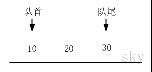
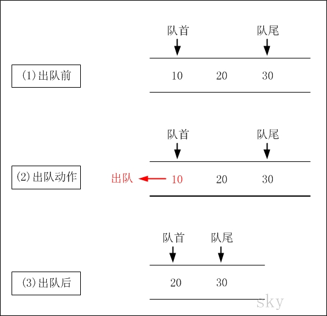

http://www.cnblogs.com/skywang12345/p/3562279.html

# 概要

本章和介绍"栈"时的流程一样, 先对队列进行介绍, 然后分别给出队列的 C、C++和 Java 三种语言的实现. 内容包括:

1. 队列的介绍
2. 队列的 C 实现
3. 队列的 C++实现
4. 队列的 Java 实现

# 队列的介绍

队列(Queue), 是一种线性存储结构. 它有以下几个特点:

- (01) 队列中数据是按照"先进先出(FIFO, First-In-First-Out)"方式进出队列的.
- (02) 队列只允许在"队首"进行删除操作, 而在"队尾"进行插入操作.

队列通常包括的两种操作: 入队列 和 出队列.

## 队列的示意图



队列中有 10, 20, 30 共 3 个数据.

## 出队列



**出队列前**: 队首是 10, 队尾是 30.
**出队列后**: 出队列(队首)之后. 队首是 20, 队尾是 30.

## 入队列


**入队列前**: 队首是 20, 队尾是 30.
**入队列后**: 40 入队列(队尾)之后. 队首是 20, 队尾是 40.

下面介绍队列的实现, 分别介绍 C/C++/Java 三种实现

# 队列的 C 实现

共介绍 4 种 C 语言实现.

1. C 语言实现一: 数组实现的队列, 并且只能存储 int 数据.
2. C 语言实现二: 单向链表实现的队列, 并且只能存储 int 数据.
3. C 语言实现三: 双向链表实现的队列, 并且只能存储 int 数据.
4. C 语言实现四: 双向链表实现的队列, 能存储任意类型的数据.

## C 语言实现一: 数组实现的队列, 并且只能存储 int 数据

实现代码(array_queue.c)

```cpp
#include <stdio.h>
#include <malloc.h>

/**
 * C 语言: 数组实现的队列, 只能存储 int 数据.
 *
 * @author skywang
 * @date 2013/11/07
 */

// 保存数据的数组
static int *arr=NULL;
// 队列的实际大小
static int count;

// 创建"队列"
int create_array_queue(int sz)
{
    arr = (int *)malloc(sz*sizeof(int));
    if (!arr)
    {
        printf("arr malloc error!");
        return -1;
    }
    count = 0;

    return 0;
}

// 销毁"队列"
int destroy_array_queue()
{
    if (arr)
    {
        free(arr);
        arr = NULL;
    }

    return 0;
}

// 将 val 添加到队列的末尾
void add(int val)
{
    arr[count++] = val;
}

// 返回"队列开头元素"
int front()
{
    return arr[0];
}

// 返回并删除"队列开头元素"
int pop()
{
    int i = 0;;
    int ret = arr[0];

    count--;
    while (i++<count)
        arr[i-1] = arr[i];

    return ret;
}

// 返回"队列"的大小
int size()
{
    return count;
}

// 返回"队列"是否为空
int is_empty()
{
    return count==0;
}

void main()
{
    int tmp=0;

    // 创建"队列"
    create_array_queue(12);

    // 将 10, 20, 30 依次推入队列中
    add(10);
    add(20);
    add(30);

    // 将"队列开头的元素"赋值给 tmp, 并删除"该元素"
    tmp = pop();
    printf("tmp=%d\n", tmp);

    // 只将"队列开头的元素"赋值给 tmp, 不删除该元素.
    tmp = front();
    printf("tmp=%d\n", tmp);

    add(40);

    // 打印队列
    printf("is_empty()=%d\n", is_empty());
    printf("size()=%d\n", size());
    while (!is_empty())
    {
        printf("%d\n", pop());
    }

    // 销毁队列
    destroy_array_queue();
}
```

**运行结果**:

```
tmp=10
tmp=20
is_empty()=0
size()=3
20
30
40
```

**结果说明**: 该示例中的队列, 是通过"数组"来实现的！

由于代码中已经给出了详细了注释, 这里就不再对函数进行说明了. 仅对主函数 main 的逻辑进行简单介绍.

- (01) 在主函数 main 中, 先将 "10, 20, 30"依次入队列. 此时, 队列的数据是:  10 --> 20 --> 30

- (02) 接着通过 pop()返回队首元素; pop()操作并不会改变队列中的数据. 此时, 队列的数据依然是:  10 --> 20 --> 30

- (03) 接着通过 front()返回并删除队首元素. front()操作之后, 队列的数据是:  10 --> 30

- (04) 接着通过 add(40)将 40 入队列. add(40)操作之后, 队列中的数据是:  10 --> 20 --> 40

2. C 语言实现二: 单向链表实现的队列, 并且只能存储 int 数据

实现代码(slink_queue.c)

```cpp
#include <stdio.h>
#include <malloc.h>

/**
 * C 语言: 单链表实现"队列", 只能存储 int 数据.
 *
 * @author skywang
 * @date 2013/11/07
 */

// 单链表节点
struct node {
    int val;
    struct node* next;
};

// 表头
static struct node *phead=NULL;

// 创建节点, val 为节点值
static struct node* create_node(val)
{
    struct node *pnode=NULL;
    pnode = (struct node*)malloc(sizeof(struct node));
    if (!pnode)
        return NULL;
    pnode->val = val;
    pnode->next = NULL;

    return pnode;
}

// 销毁单向链表
static int destroy_single_link()
{
    struct node *pnode=NULL;

    while (phead != NULL)
    {
        pnode = phead;
        phead = phead->next;
        free(pnode);
    }
    return 0;
}

// 将 val 添加到队列的末尾
static void add(int val)
{
    if (!phead)
    {
        phead = create_node(val);
        return ;
    }

    struct node *pnode = create_node(val);
    struct node *pend = phead;
    while (pend->next)
        pend = pend->next;

    pend->next = pnode;
}

// 返回"队列开头元素"
int front()
{
    return phead->val;
}

// 返回并删除"队列开头元素"
static int pop()
{
    int ret = phead->val;
    struct node *pnode = phead;

    phead = phead->next;
    free(pnode);

    return ret;
}

// 返回链表中节点的个数
static int size()
{
    int count=0;
    struct node *pend = phead;

    while (pend)
    {
        pend = pend->next;
        count++;
    }

    return count;
}

// 链表是否为空
static int is_empty()
{
    return size()==0;
}

void main()
{
    int tmp=0;

    // 将 10, 20, 30 依次加入到队列中
    add(10);
    add(20);
    add(30);

    // 将"队列开头元素"赋值给 tmp, 并删除"该元素"
    tmp = pop();
    printf("tmp=%d\n", tmp);

    // 只将"队列开头的元素"赋值给 tmp, 不删除该元素.
    tmp = front();
    printf("tmp=%d\n", tmp);

    add(40);

    printf("is_empty()=%d\n", is_empty());
    printf("size()=%d\n", size());
    while (!is_empty())
    {
        printf("%d\n", pop());
    }

    // 销毁队列
    destroy_single_link();
}
```

**代码说明**: "运行结果" 以及 "主函数 main 的逻辑"都和"C 语言实现一"的一样. 不同的是, 该示例中的队列是通过单向链表实现的.

## C 语言实现三: 双向链表实现的队列, 并且只能存储 int 数据

**实现代码**

双向链表的头文件(`double_link.h`)

```cpp
#ifndef _DOUBLE_LINK_H
#define _DOUBLE_LINK_H

// 新建"双向链表". 成功, 返回表头; 否则, 返回 NULL
extern int create_dlink();
// 撤销"双向链表". 成功, 返回 0; 否则, 返回-1
extern int destroy_dlink();

// "双向链表是否为空". 为空的话返回 1; 否则, 返回 0.
extern int dlink_is_empty();
// 返回"双向链表的大小"
extern int dlink_size();

// 获取"双向链表中第 index 位置的元素的值". 成功, 返回节点值; 否则, 返回-1.
extern int dlink_get(int index);
// 获取"双向链表中第 1 个元素的值". 成功, 返回节点值; 否则, 返回-1.
extern int dlink_get_first();
// 获取"双向链表中最后 1 个元素的值". 成功, 返回节点值; 否则, 返回-1.
extern int dlink_get_last();

// 将"value"插入到 index 位置. 成功, 返回 0; 否则, 返回-1.
extern int dlink_insert(int index, int value);
// 将"value"插入到表头位置. 成功, 返回 0; 否则, 返回-1.
extern int dlink_insert_first(int value);
// 将"value"插入到末尾位置. 成功, 返回 0; 否则, 返回-1.
extern int dlink_append_last(int value);

// 删除"双向链表中 index 位置的节点". 成功, 返回 0; 否则, 返回-1
extern int dlink_delete(int index);
// 删除第一个节点. 成功, 返回 0; 否则, 返回-1
extern int dlink_delete_first();
// 删除组后一个节点. 成功, 返回 0; 否则, 返回-1
extern int dlink_delete_last();

// 打印"双向链表"
extern void print_dlink();

#endif
```

双向链表的实现文件(`double_link.c`)

```cpp
#include <stdio.h>
#include <malloc.h>

/**
 * C 语言: 双向链表, 只能存储 int 数据.
 *
 * @author skywang
 * @date 2013/11/07
 */

// 双向链表节点
typedef struct tag_node
{
    struct tag_node *prev;
    struct tag_node *next;
    int value;
}node;

// 表头. 注意, 表头不存放元素值！！！
static node *phead=NULL;
// 节点个数.
static int  count=0;

// 新建"节点". 成功, 返回节点指针; 否则, 返回 NULL.
static node* create_node(int value)
{
    node *pnode=NULL;
    pnode = (node *)malloc(sizeof(node));
    if (!pnode)
    {
        printf("create node error!\n");
        return NULL;
    }
    // 默认的, pnode 的前一节点和后一节点都指向它自身
    pnode->prev = pnode->next = pnode;
    // 节点的值为 value
    pnode->value = value;

    return pnode;
}

// 新建"双向链表". 成功, 返回 0; 否则, 返回-1.
int create_dlink()
{
    // 创建表头
    phead = create_node(-1);
    if (!phead)
        return -1;

    // 设置"节点个数"为 0
    count = 0;

    return 0;
}

// "双向链表是否为空"
int dlink_is_empty()
{
    return count == 0;
}

// 返回"双向链表的大小"
int dlink_size() {
    return count;
}

// 获取"双向链表中第 index 位置的节点"
static node* get_node(int index)
{
    if (index<0 || index>=count)
    {
        printf("%s failed! the index in out of bound!\n", __func__);
        return NULL;
    }

    // 正向查找
    if (index <= (count/2))
    {
        int i=0;
        node *pnode=phead->next;
        while ((i++) < index)
            pnode = pnode->next;

        return pnode;
    }

    // 反向查找
    int j=0;
    int rindex = count - index - 1;
    node *rnode=phead->prev;
    while ((j++) < rindex)
        rnode = rnode->prev;

    return rnode;
}

// 获取"第一个节点"
static node* get_first_node()
{
    return get_node(0);
}

// 获取"最后一个节点"
static node* get_last_node()
{
    return get_node(count-1);
}

// 获取"双向链表中第 index 位置的元素的值". 成功, 返回节点值; 否则, 返回-1.
int dlink_get(int index)
{
    node *pindex=get_node(index);
    if (!pindex)
    {
        printf("%s failed!\n", __func__);
        return -1;
    }

    return pindex->value;

}

// 获取"双向链表中第 1 个元素的值"
int dlink_get_first()
{
    return dlink_get(0);
}

// 获取"双向链表中最后 1 个元素的值"
int dlink_get_last()
{
    return dlink_get(count-1);
}

// 将"value"插入到 index 位置. 成功, 返回 0; 否则, 返回-1.
int dlink_insert(int index, int value)
{
    // 插入表头
    if (index==0)
        return dlink_insert_first(value);

    // 获取要插入的位置对应的节点
    node *pindex=get_node(index);
    if (!pindex)
        return -1;

    // 创建"节点"
    node *pnode=create_node(value);
    if (!pnode)
        return -1;

    pnode->prev = pindex->prev;
    pnode->next = pindex;
    pindex->prev->next = pnode;
    pindex->prev = pnode;
    // 节点个数+1
    count++;

    return 0;
}

// 将"value"插入到表头位置
int dlink_insert_first(int value)
{
    node *pnode=create_node(value);
    if (!pnode)
        return -1;

    pnode->prev = phead;
    pnode->next = phead->next;
    phead->next->prev = pnode;
    phead->next = pnode;
    count++;
    return 0;
}

// 将"value"插入到末尾位置
int dlink_append_last(int value)
{
    node *pnode=create_node(value);
    if (!pnode)
        return -1;

    pnode->next = phead;
    pnode->prev = phead->prev;
    phead->prev->next = pnode;
    phead->prev = pnode;
    count++;
    return 0;
}

// 删除"双向链表中 index 位置的节点". 成功, 返回 0; 否则, 返回-1.
int dlink_delete(int index)
{
    node *pindex=get_node(index);
    if (!pindex)
    {
        printf("%s failed! the index in out of bound!\n", __func__);
        return -1;
    }

    pindex->next->prev = pindex->prev;
    pindex->prev->next = pindex->next;
    free(pindex);
    count--;

    return 0;
}

// 删除第一个节点
int dlink_delete_first()
{
    return dlink_delete(0);
}

// 删除组后一个节点
int dlink_delete_last()
{
    return dlink_delete(count-1);
}

// 撤销"双向链表". 成功, 返回 0; 否则, 返回-1.
int destroy_dlink()
{
    if (!phead)
    {
        printf("%s failed! dlink is null!\n", __func__);
        return -1;
    }

    node *pnode=phead->next;
    node *ptmp=NULL;
    while(pnode != phead)
    {
        ptmp = pnode;
        pnode = pnode->next;
        free(ptmp);
    }

    free(phead);
    phead = NULL;
    count = 0;

    return 0;
}

// 打印"双向链表"
void print_dlink()
{
    if (count==0 || (!phead))
    {
        printf("%s dlink is empty!\n", __func__);
        return ;
    }

    printf("%s dlink size()=%d\n", __func__, count);
    node *pnode=phead->next;
    while(pnode != phead)
    {
        printf("%d\n", pnode->value);
        pnode = pnode->next;
    }
}
```

双向链表的测试程序(`dlink_queue.c`)

```cpp
#include <stdio.h>
#include "double_link.h"

/**
 * C 语言: 双向链表实现"队列", 只能存储 int 数据.
 *
 * @author skywang
 * @date 2013/11/07
 */

// 创建队列
int create_dlink_queue()
{
    return create_dlink();
}

// 销毁队列
int destroy_dlink_queue()
{
    return destroy_dlink();
}

// 将 val 添加到队列的末尾
int add(int val)
{
    return dlink_append_last(val);
}

// 返回"队列开头元素"
int front()
{
    return dlink_get_first();
}

// 返回并删除"队列开头元素"
int pop()
{
    int ret = dlink_get_first();
    dlink_delete_first();
    return ret;
}

// 返回"队列"的大小
int size()
{
    return dlink_size();
}

// 返回"队列"是否为空
int is_empty()
{
    return dlink_is_empty();
}

void main()
{
    int tmp=0;

    // 创建"队列"
    create_dlink_queue();

    // 将 10, 20, 30 依次队列中
    add(10);
    add(20);
    add(30);

    // 将"队列开头的元素"赋值给 tmp, 并删除"该元素"
    tmp = pop();
    printf("tmp=%d\n", tmp);

    // 只将"队列开头的元素"赋值给 tmp, 不删除该元素.
    tmp = front();
    printf("tmp=%d\n", tmp);

    add(40);

    printf("is_empty()=%d\n", is_empty());
    printf("size()=%d\n", size());
    while (!is_empty())
    {
        printf("%d\n", pop());
    }

    // 销毁队列
    destroy_dlink_queue();
}
```

**代码说明**: "运行结果" 以及 "主函数 main 的逻辑"都和前两个示例的一样. 不同的是, 该示例中的队列是通过双向链表实现的.

## C 语言实现四: 双向链表实现的队列, 能存储任意类型的数据

**实现代码**

双向链表的头文件(double_link.h)

```cpp
#ifndef _DOUBLE_LINK_H
#define _DOUBLE_LINK_H

// 新建"双向链表". 成功, 返回表头; 否则, 返回 NULL
extern int create_dlink();
// 撤销"双向链表". 成功, 返回 0; 否则, 返回-1
extern int destroy_dlink();

// "双向链表是否为空". 为空的话返回 1; 否则, 返回 0.
extern int dlink_is_empty();
// 返回"双向链表的大小"
extern int dlink_size();

// 获取"双向链表中第 index 位置的元素". 成功, 返回节点指针; 否则, 返回 NULL.
extern void* dlink_get(int index);
// 获取"双向链表中第 1 个元素". 成功, 返回节点指针; 否则, 返回 NULL.
extern void* dlink_get_first();
// 获取"双向链表中最后 1 个元素". 成功, 返回节点指针; 否则, 返回 NULL.
extern void* dlink_get_last();

// 将"value"插入到 index 位置. 成功, 返回 0; 否则, 返回-1.
extern int dlink_insert(int index, void *pval);
// 将"value"插入到表头位置. 成功, 返回 0; 否则, 返回-1.
extern int dlink_insert_first(void *pval);
// 将"value"插入到末尾位置. 成功, 返回 0; 否则, 返回-1.
extern int dlink_append_last(void *pval);

// 删除"双向链表中 index 位置的节点". 成功, 返回 0; 否则, 返回-1
extern int dlink_delete(int index);
// 删除第一个节点. 成功, 返回 0; 否则, 返回-1
extern int dlink_delete_first();
// 删除组后一个节点. 成功, 返回 0; 否则, 返回-1
extern int dlink_delete_last();

#endif
```

双向链表的实现文件(double_link.c)

```cpp
#include <stdio.h>
#include <malloc.h>

/**
 * C 语言: 双向链表, 能存储任意数据.
 *
 * @author skywang
 * @date 2013/11/07
 */

// 双向链表节点
typedef struct tag_node
{
    struct tag_node *prev;
    struct tag_node *next;
    void* p;
}node;

// 表头. 注意, 表头不存放元素值！！！
static node *phead=NULL;
// 节点个数.
static int  count=0;

// 新建"节点". 成功, 返回节点指针; 否则, 返回 NULL.
static node* create_node(void *pval)
{
    node *pnode=NULL;
    pnode = (node *)malloc(sizeof(node));
    if (!pnode)
    {
        printf("create node error!\n");
        return NULL;
    }
    // 默认的, pnode 的前一节点和后一节点都指向它自身
    pnode->prev = pnode->next = pnode;
    // 节点的值为 pval
    pnode->p = pval;

    return pnode;
}

// 新建"双向链表". 成功, 返回 0; 否则, 返回-1.
int create_dlink()
{
    // 创建表头
    phead = create_node(NULL);
    if (!phead)
        return -1;

    // 设置"节点个数"为 0
    count = 0;

    return 0;
}

// "双向链表是否为空"
int dlink_is_empty()
{
    return count == 0;
}

// 返回"双向链表的大小"
int dlink_size() {
    return count;
}

// 获取"双向链表中第 index 位置的节点"
static node* get_node(int index)
{
    if (index<0 || index>=count)
    {
        printf("%s failed! index out of bound!\n", __func__);
        return NULL;
    }

    // 正向查找
    if (index <= (count/2))
    {
        int i=0;
        node *pnode=phead->next;
        while ((i++) < index)
            pnode = pnode->next;

        return pnode;
    }

    // 反向查找
    int j=0;
    int rindex = count - index - 1;
    node *rnode=phead->prev;
    while ((j++) < rindex)
        rnode = rnode->prev;

    return rnode;
}

// 获取"第一个节点"
static node* get_first_node()
{
    return get_node(0);
}

// 获取"最后一个节点"
static node* get_last_node()
{
    return get_node(count-1);
}

// 获取"双向链表中第 index 位置的元素". 成功, 返回节点值; 否则, 返回-1.
void* dlink_get(int index)
{
    node *pindex=get_node(index);
    if (!pindex)
    {
        printf("%s failed!\n", __func__);
        return NULL;
    }

    return pindex->p;

}

// 获取"双向链表中第 1 个元素的值"
void* dlink_get_first()
{
    return dlink_get(0);
}

// 获取"双向链表中最后 1 个元素的值"
void* dlink_get_last()
{
    return dlink_get(count-1);
}

// 将"pval"插入到 index 位置. 成功, 返回 0; 否则, 返回-1.
int dlink_insert(int index, void* pval)
{
    // 插入表头
    if (index==0)
        return dlink_insert_first(pval);

    // 获取要插入的位置对应的节点
    node *pindex=get_node(index);
    if (!pindex)
        return -1;

    // 创建"节点"
    node *pnode=create_node(pval);
    if (!pnode)
        return -1;

    pnode->prev = pindex->prev;
    pnode->next = pindex;
    pindex->prev->next = pnode;
    pindex->prev = pnode;
    // 节点个数+1
    count++;

    return 0;
}

// 将"pval"插入到表头位置
int dlink_insert_first(void *pval)
{
    node *pnode=create_node(pval);
    if (!pnode)
        return -1;

    pnode->prev = phead;
    pnode->next = phead->next;
    phead->next->prev = pnode;
    phead->next = pnode;
    count++;
    return 0;
}

// 将"pval"插入到末尾位置
int dlink_append_last(void *pval)
{
    node *pnode=create_node(pval);
    if (!pnode)
        return -1;

    pnode->next = phead;
    pnode->prev = phead->prev;
    phead->prev->next = pnode;
    phead->prev = pnode;
    count++;
    return 0;
}

// 删除"双向链表中 index 位置的节点". 成功, 返回 0; 否则, 返回-1.
int dlink_delete(int index)
{
    node *pindex=get_node(index);
    if (!pindex)
    {
        printf("%s failed! the index in out of bound!\n", __func__);
        return -1;
    }

    pindex->next->prev = pindex->prev;
    pindex->prev->next = pindex->next;
    free(pindex);
    count--;

    return 0;
}

// 删除第一个节点
int dlink_delete_first()
{
    return dlink_delete(0);
}

// 删除组后一个节点
int dlink_delete_last()
{
    return dlink_delete(count-1);
}

// 撤销"双向链表". 成功, 返回 0; 否则, 返回-1.
int destroy_dlink()
{
    if (!phead)
    {
        printf("%s failed! dlink is null!\n", __func__);
        return -1;
    }

    node *pnode=phead->next;
    node *ptmp=NULL;
    while(pnode != phead)
    {
        ptmp = pnode;
        pnode = pnode->next;
        free(ptmp);
    }

    free(phead);
    phead = NULL;
    count = 0;

    return 0;
}
```

双向链表的测试程序(`dlink_queue.c`)

```cpp
#include <stdio.h>
#include "double_link.h"

/**
 * C 语言: 双向链表实现"队列", 能存储任意数据.
 *
 * @author skywang
 * @date 2013/11/07
 */

// 创建队列
int create_dlink_queue()
{
    return create_dlink();
}

// 销毁队列
int destroy_dlink_queue()
{
    return destroy_dlink();
}

// 将 p 添加到队列的末尾
int add(void *p)
{
    return dlink_append_last(p);
}

// 返回"队列开头元素"
void* front()
{
    return dlink_get_first();
}

// 返回"队列开头的元素", 并删除"该元素"
void* pop()
{
    void *p = dlink_get_first();
    dlink_delete_first();
    return p;
}

// 返回"队列"的大小
int size()
{
    return dlink_size();
}

// 返回"队列"是否为空
int is_empty()
{
    return dlink_is_empty();
}


typedef struct tag_stu
{
    int id;
    char name[20];
}stu;

static stu arr_stu[] =
{
    {10, "sky"},
    {20, "jody"},
    {30, "vic"},
    {40, "dan"},
};
#define ARR_STU_SIZE ( (sizeof(arr_stu)) / (sizeof(arr_stu[0])) )

static void print_stu(stu *p)
{
    if (!p)
        return ;

    printf("id=%d, name=%s\n", p->id, p->name);
}

void main()
{
    stu *pval=NULL;

    // 创建"队列"
    create_dlink_queue();

    // 将 10, 20, 30 依次推入队列中
    int i=0;
    for (i=0; i<ARR_STU_SIZE-1; i++)
    {
        add(&arr_stu[i]);
    }

    // 将"队列开头的元素"赋值给 tmp, 并删除"该元素"
    pval = (stu*)pop();
    print_stu(pval) ;

    // 只将"队列开头的元素"赋值给 tmp, 不删除该元素.
    pval = front();
    print_stu(pval) ;

    add(&arr_stu[ARR_STU_SIZE-1]);

    printf("is_empty()=%d\n", is_empty());
    printf("size()=%d\n", size());
    // 打印队列中的所有元素
    while (!is_empty())
    {
        pval = pop();
        print_stu(pval) ;
    }

    // 销毁队列
    destroy_dlink_queue();
}
```

**运行结果**:

```
id=10, name=sky
id=20, name=jody
is_empty()=0
size()=3
id=20, name=jody
id=30, name=vic
id=40, name=dan
```

**结果说明**: 该示例中的队列是通过双向链表实现的, 并且能存储任意类型的数据.