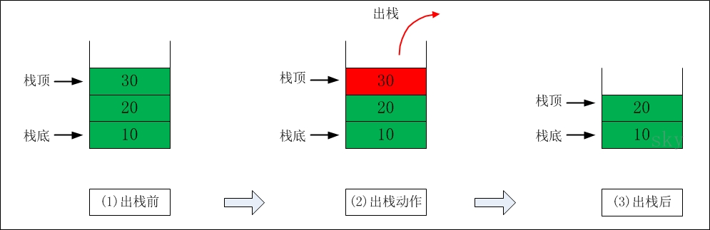

http://www.cnblogs.com/skywang12345/p/3562239.html

# 概要

本章会先对栈的原理进行介绍然后分别通过 C/C++/Java 三种语言来演示栈的实现示例. 注意: 本文所说的栈是数据结构中的栈而不是内存模型中栈. 内容包括:

1. 栈的介绍
2. 栈的 C 实现
3. 栈的 C++实现
4. 栈的 Java 实现

# 栈的介绍

栈(stack)是一种线性存储结构它有以下几个特点:

- (01) 栈中数据是按照"后进先出(LIFO, Last In First Out)"方式进出栈的.

- (02) 向栈中添加/删除数据时只能从栈顶进行操作.

栈通常包括的三种操作: push、peek、pop.

- push -- 向栈中添加元素.
- peek -- 返回栈顶元素.
- pop  -- 返回并删除栈顶元素的操作.

## 栈的示意图


栈中的数据依次是 30 --> 20 --> 10

## 出栈



**出栈前**: 栈顶元素是 30. 此时栈中的元素依次是 30 --> 20 --> 10
**出栈后**: 30 出栈之后栈顶元素变成 20. 此时栈中的元素依次是 20 --> 10

## 入栈


**入栈前**: 栈顶元素是 20. 此时栈中的元素依次是 20 --> 10
**入栈后**: 40 入栈之后栈顶元素变成 40. 此时栈中的元素依次是 40 --> 20 --> 10

下面介绍栈的实现分别介绍 C/C++/Java 三种实现.

# 栈的 C 实现

共介绍 4 种 C 语言实现.

1. C 语言实现一: 数组实现的栈并且只能存储 int 数据.
2. C 语言实现二: 单向链表实现的栈并且只能存储 int 数据.
3. C 语言实现三: 双向链表实现的栈并且只能存储 int 数据.
4. C 语言实现四: 双向链表实现的栈能存储任意类型的数据.

## C 语言实现一: 数组实现的栈并且只能存储 int 数据

实现代码(array_stack.c)

```cpp
#include <stdio.h>
#include <malloc.h>

/**
 * C 语言: 数组实现的栈只能存储 int 数据.
 *
 * @author skywang
 * @date 2013/11/07
 */

// 保存数据的数组
static int *arr=NULL;
// 栈的实际大小
static int count;

// 创建"栈"默认大小是 12
int create_array_stack(int sz)
{
    arr = (int *)malloc(sz*sizeof(int));
    if (!arr)
    {
        printf("arr malloc error!");
        return -1;
    }

    return 0;
}

// 销毁"栈"
int destroy_array_stack()
{
    if (arr)
    {
        free(arr);
        arr = NULL;
    }

    return 0;
}

// 将 val 添加到栈中
void push(int val)
{
    arr[count++] = val;
}

// 返回"栈顶元素值"
int peek()
{
    return arr[count-1];
}

// 返回"栈顶元素值"并删除"栈顶元素"
int pop()
{
    int ret = arr[count-1];
    count--;
    return ret;
}

// 返回"栈"的大小
int size()
{
    return count;
}

// 返回"栈"是否为空
int is_empty()
{
    return size()==0;
}

// 打印"栈"
void print_array_stack()
{
    if (is_empty())
    {
        printf("stack is Empty\n");
        return ;
    }

    printf("stack size()=%d\n", size());

    int i=size()-1;
    while (i>=0)
    {
        printf("%d\n", arr[i]);
        i--;
    }
}


void main()
{
    int tmp=0;

    // 创建"栈"
    create_array_stack(12);

    // 将 10, 20, 30 依次推入栈中
    push(10);
    push(20);
    push(30);

    //print_array_stack();    // 打印栈

    // 将"栈顶元素"赋值给 tmp 并删除"栈顶元素"
    tmp = pop();
    printf("tmp=%d\n", tmp);
    //print_array_stack();    // 打印栈

    // 只将"栈顶"赋值给 tmp 不删除该元素.
    tmp = peek();
    printf("tmp=%d\n", tmp);
    //print_array_stack();    // 打印栈

    push(40);
    print_array_stack();    // 打印栈

    // 销毁栈
    destroy_array_stack();
}
```

运行结果:

```
tmp=30
tmp=20
stack size()=3
40
20
10
```

结果说明: 该示例中的栈是通过"数组"来实现的！

由于代码中已经给出了详细了注释这里就不再对函数进行说明了. 仅对主函数 main 的逻辑进行简单介绍.

- (01) 在主函数 main 中先将 "10, 20, 30"依次压入栈. 此时栈的数据是:  30 --> 20 --> 10
- (02) 接着通过 pop()返回栈顶元素; pop()操作并不会改变栈中的数据. 此时栈的数据依然是:  30 --> 20 --> 10
- (03) 接着通过 peek()返回并删除栈顶元素. peek 操作之后栈的数据是:  20 --> 10
- (04) 接着通过 push(40)将 40 压入栈中. push(40)操作之后栈的数据是:  40 --> 20 --> 10

## C 语言实现二: 单向链表实现的栈并且只能存储 int 数据

**实现代码**(slink_stack.c)

```cpp
#include <stdio.h>
#include <malloc.h>

/**
 * C 语言: 单向链表实现的栈只能存储 int 数据.
 *
 * @author skywang
 * @date 2013/11/07
 */

// 单向链表的"节点"
struct node {
    int val;
    struct node* next;
};

// 单向链表的"表头"
static struct node *phead=NULL;

// 创建节点 val 为节点值
static struct node* create_node(int val)
{
    struct node *pnode=NULL;
    pnode = (struct node*)malloc(sizeof(struct node));
    if (!pnode)
        return NULL;
    pnode->val = val;
    pnode->next = NULL;

    return pnode;
}

// 销毁单向链表
static int destroy_single_link()
{
    struct node *pnode=NULL;

    while (phead != NULL) {
        pnode = phead;
        phead = phead->next;
        free(pnode);
    }
    return 0;
}

// 将 val 插入到链表的表头位置
static struct node* push(int val)
{
    struct node *pnode = NULL;

    pnode = create_node(val);
    pnode->next = phead;
    phead = pnode;

    return phead;
}

// 删除链表的表头
static int pop()
{
    if (!phead)
    {
        printf("remove failed! link is empty!");
        return -1;
    }

    int ret;
    struct node *pnode;
    ret = phead->val;
    pnode = phead;
    phead = phead->next;
    free(pnode);

    return ret;
}

// 返回链表的表头节点的值
static int peek()
{
    if (!phead)
    {
        printf("peek failed! link is empty!");
        return -1;
    }

    return phead->val;
}

// 返回链表中节点的个数
static int size()
{
    int count=0;
    struct node *pnode=phead;

    while (pnode != NULL) {
        pnode = pnode->next;
        count++;
    }
    return count;
}

// 链表是否为空
static int is_empty()
{
    return phead==NULL;
}

// 打印"栈"
static void print_single_link()
{
    if (is_empty())
    {
        printf("stack is Empty\n");
        return 0;
    }

    printf("stack size()=%d\n", size());

    struct node *pnode=NULL;

    while (phead != NULL) {
        printf("%d\n", phead->val);
        pnode = phead;
        phead = phead->next;
        free(pnode);
    }
}

void main()
{
    int tmp=0;

    // 将 10, 20, 30 依次推入栈中
    push(10);
    push(20);
    push(30);

    //print_single_link();    // 打印栈

    // 将"栈顶元素"赋值给 tmp 并删除"栈顶元素"
    tmp = pop();
    printf("tmp=%d\n", tmp);
    //print_single_link();    // 打印栈

    // 只将"栈顶"赋值给 tmp 不删除该元素.
    tmp = peek();
    printf("tmp=%d\n", tmp);
    //print_single_link();    // 打印栈

    push(40);
    print_single_link();    // 打印栈

    // 销毁栈
    destroy_single_link();
}
```

**代码说明**: "运行结果" 以及 "主函数 main 的逻辑"都和"C 语言实现一"的一样. 不同的是该示例中的栈是通过单向链表实现的.

## C 语言实现三: 双向链表实现的栈并且只能存储 int 数据

**实现代码**

双向链表的头文件(`double_link.h`)

```cpp
#ifndef _DOUBLE_LINK_H
#define _DOUBLE_LINK_H

// 新建"双向链表". 成功返回表头; 否则返回 NULL
extern int create_dlink();
// 撤销"双向链表". 成功返回 0; 否则返回-1
extern int destroy_dlink();

// "双向链表是否为空". 为空的话返回 1; 否则返回 0.
extern int dlink_is_empty();
// 返回"双向链表的大小"
extern int dlink_size();

// 获取"双向链表中第 index 位置的元素的值". 成功返回节点值; 否则返回-1.
extern int dlink_get(int index);
// 获取"双向链表中第 1 个元素的值". 成功返回节点值; 否则返回-1.
extern int dlink_get_first();
// 获取"双向链表中最后 1 个元素的值". 成功返回节点值; 否则返回-1.
extern int dlink_get_last();

// 将"value"插入到 index 位置. 成功返回 0; 否则返回-1.
extern int dlink_insert(int index, int value);
// 将"value"插入到表头位置. 成功返回 0; 否则返回-1.
extern int dlink_insert_first(int value);
// 将"value"插入到末尾位置. 成功返回 0; 否则返回-1.
extern int dlink_append_last(int value);

// 删除"双向链表中 index 位置的节点". 成功返回 0; 否则返回-1
extern int dlink_delete(int index);
// 删除第一个节点. 成功返回 0; 否则返回-1
extern int dlink_delete_first();
// 删除组后一个节点. 成功返回 0; 否则返回-1
extern int dlink_delete_last();

// 打印"双向链表"
extern void print_dlink();

#endif
```

双向链表的实现文件 (`double_link.c`)

```cpp
#include <stdio.h>
#include <malloc.h>

/**
 * c 语言实现的双向链表
 *
 * @author skywang
 * @date   2013/11/07
 */
// 双向链表节点
typedef struct tag_node
{
    struct tag_node *prev;
    struct tag_node *next;
    int value;
}node;

// 表头. 注意表头不存放元素值！！！
static node *phead=NULL;
// 节点个数.
static int  count=0;

// 新建"节点". 成功返回节点指针; 否则返回 NULL.
static node* create_node(int value)
{
    node *pnode=NULL;
    pnode = (node *)malloc(sizeof(node));
    if (!pnode)
    {
        printf("create node error!\n");
        return NULL;
    }
    // 默认的 pnode 的前一节点和后一节点都指向它自身
    pnode->prev = pnode->next = pnode;
    // 节点的值为 value
    pnode->value = value;

    return pnode;
}

// 新建"双向链表". 成功返回 0; 否则返回-1.
int create_dlink()
{
    // 创建表头
    phead = create_node(-1);
    if (!phead)
        return -1;

    // 设置"节点个数"为 0
    count = 0;

    return 0;
}

// "双向链表是否为空"
int dlink_is_empty()
{
    return count == 0;
}

// 返回"双向链表的大小"
int dlink_size() {
    return count;
}

// 获取"双向链表中第 index 位置的节点"
static node* get_node(int index)
{
    if (index<0 || index>=count)
    {
        printf("%s failed! the index in out of bound!\n", __func__);
        return NULL;
    }

    // 正向查找
    if (index <= (count/2))
    {
        int i=0;
        node *pnode=phead->next;
        while ((i++) < index)
            pnode = pnode->next;

//        printf("%s %d i=%d, pnode->value=%d\n",
//                __func__, __LINE__, i, pnode->value);
        return pnode;
    }

    // 反向查找
    int j=0;
    int rindex = count - index - 1;
    node *rnode=phead->prev;
    while ((j++) < rindex)
        rnode = rnode->prev;

//    printf("%s %d j=%d, rnode->value=%d\n",
//            __func__, __LINE__, j, rnode->value);
    return rnode;
}

// 获取"第一个节点"
static node* get_first_node()
{
    return get_node(0);
}

// 获取"最后一个节点"
static node* get_last_node()
{
    return get_node(count-1);
}

// 获取"双向链表中第 index 位置的元素的值". 成功返回节点值; 否则返回-1.
int dlink_get(int index)
{
    node *pindex=get_node(index);
    if (!pindex)
    {
        printf("%s failed!\n", __func__);
        return -1;
    }

    return pindex->value;

}

// 获取"双向链表中第 1 个元素的值"
int dlink_get_first()
{
    return dlink_get(0);
}

// 获取"双向链表中最后 1 个元素的值"
int dlink_get_last()
{
    return dlink_get(count-1);
}

// 将"value"插入到 index 位置. 成功返回 0; 否则返回-1.
int dlink_insert(int index, int value)
{
    // 插入表头
    if (index==0)
        return dlink_insert_first(value);

    // 获取要插入的位置对应的节点
    node *pindex=get_node(index);
    if (!pindex)
        return -1;

    // 创建"节点"
    node *pnode=create_node(value);
    if (!pnode)
        return -1;

    pnode->prev = pindex->prev;
    pnode->next = pindex;
    pindex->prev->next = pnode;
    pindex->prev = pnode;
    // 节点个数+1
    count++;

    return 0;
}

// 将"value"插入到表头位置
int dlink_insert_first(int value)
{
    node *pnode=create_node(value);
    if (!pnode)
        return -1;

    pnode->prev = phead;
    pnode->next = phead->next;
    phead->next->prev = pnode;
    phead->next = pnode;
    count++;
    return 0;
}

// 将"value"插入到末尾位置
int dlink_append_last(int value)
{
    node *pnode=create_node(value);
    if (!pnode)
        return -1;

    pnode->next = phead;
    pnode->prev = phead->prev;
    phead->prev->next = pnode;
    phead->prev = pnode;
    count++;
    return 0;
}

// 删除"双向链表中 index 位置的节点". 成功返回 0; 否则返回-1.
int dlink_delete(int index)
{
    node *pindex=get_node(index);
    if (!pindex)
    {
        printf("%s failed! the index in out of bound!\n", __func__);
        return -1;
    }

    pindex->next->prev = pindex->prev;
    pindex->prev->next = pindex->next;
    free(pindex);
    count--;

    return 0;
}

// 删除第一个节点
int dlink_delete_first()
{
    return dlink_delete(0);
}

// 删除组后一个节点
int dlink_delete_last()
{
    return dlink_delete(count-1);
}

// 撤销"双向链表". 成功返回 0; 否则返回-1.
int destroy_dlink()
{
    if (!phead)
    {
        printf("%s failed! dlink is null!\n", __func__);
        return -1;
    }

    node *pnode=phead->next;
    node *ptmp=NULL;
    while(pnode != phead)
    {
        ptmp = pnode;
        pnode = pnode->next;
        free(ptmp);
    }

    free(phead);
    phead = NULL;
    count = 0;

    return 0;
}

// 打印"双向链表"
void print_dlink()
{
    if (count==0 || (!phead))
    {
        printf("stack is Empty\n");
        return ;
    }

    printf("stack size()=%d\n", count);
    node *pnode=phead->next;
    while(pnode != phead)
    {
        printf("%d\n", pnode->value);
        pnode = pnode->next;
    }
}
```

双向链表的测试程序(`dlink_stack.c`)

```cpp
#include <stdio.h>
#include "double_link.h"

/**
 * C 语言: 双向链表实现栈只能存储 int 数据.
 *
 * @author skywang
 * @date 2013/11/07
 */
// 创建栈
int create_dlink_stack()
{
    return create_dlink();
}

// 销毁栈
int destroy_dlink_stack()
{
    return destroy_dlink();
}

// 将 val 添加到栈中
int push(int val)
{
    return dlink_insert_first(val);
}

// 返回"栈顶元素值"
int peek()
{
    return dlink_get_first();
}

// 返回"栈顶元素值"并删除"栈顶元素"
int pop()
{
    int ret = peek();
    dlink_delete_first();
    return ret;
}

// 返回"栈"的大小
int size()
{
    return dlink_size();
}

// 返回"栈"是否为空
int is_empty()
{
    return dlink_is_empty();
}

// 打印"栈"
void print_dlink_stack()
{
    return print_dlink();
}

void main()
{
    int tmp=0;

    // 创建"栈"
    create_dlink_stack();

    // 将 10, 20, 30 依次推入栈中
    push(10);
    push(20);
    push(30);

    //print_dlink_stack();    // 打印栈

    // 将"栈顶元素"赋值给 tmp 并删除"栈顶元素"
    tmp = pop();
    printf("tmp=%d\n", tmp);
    //print_dlink_stack();    // 打印栈

    // 只将"栈顶"赋值给 tmp 不删除该元素.
    tmp = peek();
    printf("tmp=%d\n", tmp);
    //print_dlink_stack();    // 打印栈

    push(40);
    print_dlink_stack();    // 打印栈

    // 销毁栈
    destroy_dlink_stack();
}
```

**代码说明**: "运行结果" 以及 "主函数 main 的逻辑"都和前两个示例的一样. 不同的是该示例中的栈是通过双向链表实现的.

## C 语言实现四: 双向链表实现的栈能存储任意类型的数据

**实现代码**

双向链表的头文件(`double_link.h`)

```cpp
#ifndef _DOUBLE_LINK_H
#define _DOUBLE_LINK_H

// 新建"双向链表". 成功返回表头; 否则返回 NULL
extern int create_dlink();
// 撤销"双向链表". 成功返回 0; 否则返回-1
extern int destroy_dlink();

// "双向链表是否为空". 为空的话返回 1; 否则返回 0.
extern int dlink_is_empty();
// 返回"双向链表的大小"
extern int dlink_size();

// 获取"双向链表中第 index 位置的元素". 成功返回节点指针; 否则返回 NULL.
extern void* dlink_get(int index);
// 获取"双向链表中第 1 个元素". 成功返回节点指针; 否则返回 NULL.
extern void* dlink_get_first();
// 获取"双向链表中最后 1 个元素". 成功返回节点指针; 否则返回 NULL.
extern void* dlink_get_last();

// 将"value"插入到 index 位置. 成功返回 0; 否则返回-1.
extern int dlink_insert(int index, void *pval);
// 将"value"插入到表头位置. 成功返回 0; 否则返回-1.
extern int dlink_insert_first(void *pval);
// 将"value"插入到末尾位置. 成功返回 0; 否则返回-1.
extern int dlink_append_last(void *pval);

// 删除"双向链表中 index 位置的节点". 成功返回 0; 否则返回-1
extern int dlink_delete(int index);
// 删除第一个节点. 成功返回 0; 否则返回-1
extern int dlink_delete_first();
// 删除组后一个节点. 成功返回 0; 否则返回-1
extern int dlink_delete_last();

#endif
```

双向链表的实现文件(`double_link.c`)

```cpp
#include <stdio.h>
#include <malloc.h>


/**
 * C 语言实现的双向链表能存储任意数据.
 *
 * @author skywang
 * @date 2013/11/07
 */
// 双向链表节点
typedef struct tag_node
{
    struct tag_node *prev;
    struct tag_node *next;
    void* p;
}node;

// 表头. 注意表头不存放元素值！！！
static node *phead=NULL;
// 节点个数.
static int  count=0;

// 新建"节点". 成功返回节点指针; 否则返回 NULL.
static node* create_node(void *pval)
{
    node *pnode=NULL;
    pnode = (node *)malloc(sizeof(node));
    if (!pnode)
    {
        printf("create node error!\n");
        return NULL;
    }
    // 默认的 pnode 的前一节点和后一节点都指向它自身
    pnode->prev = pnode->next = pnode;
    // 节点的值为 pval
    pnode->p = pval;

    return pnode;
}

// 新建"双向链表". 成功返回 0; 否则返回-1.
int create_dlink()
{
    // 创建表头
    phead = create_node(NULL);
    if (!phead)
        return -1;

    // 设置"节点个数"为 0
    count = 0;

    return 0;
}

// "双向链表是否为空"
int dlink_is_empty()
{
    return count == 0;
}

// 返回"双向链表的大小"
int dlink_size() {
    return count;
}

// 获取"双向链表中第 index 位置的节点"
static node* get_node(int index)
{
    if (index<0 || index>=count)
    {
        printf("%s failed! index out of bound!\n", __func__);
        return NULL;
    }

    // 正向查找
    if (index <= (count/2))
    {
        int i=0;
        node *pnode=phead->next;
        while ((i++) < index)
            pnode = pnode->next;

        return pnode;
    }

    // 反向查找
    int j=0;
    int rindex = count - index - 1;
    node *rnode=phead->prev;
    while ((j++) < rindex)
        rnode = rnode->prev;

    return rnode;
}

// 获取"第一个节点"
static node* get_first_node()
{
    return get_node(0);
}

// 获取"最后一个节点"
static node* get_last_node()
{
    return get_node(count-1);
}

// 获取"双向链表中第 index 位置的元素". 成功返回节点值; 否则返回-1.
void* dlink_get(int index)
{
    node *pindex=get_node(index);
    if (!pindex)
    {
        printf("%s failed!\n", __func__);
        return NULL;
    }

    return pindex->p;

}

// 获取"双向链表中第 1 个元素的值"
void* dlink_get_first()
{
    return dlink_get(0);
}

// 获取"双向链表中最后 1 个元素的值"
void* dlink_get_last()
{
    return dlink_get(count-1);
}

// 将"pval"插入到 index 位置. 成功返回 0; 否则返回-1.
int dlink_insert(int index, void* pval)
{
    // 插入表头
    if (index==0)
        return dlink_insert_first(pval);

    // 获取要插入的位置对应的节点
    node *pindex=get_node(index);
    if (!pindex)
        return -1;

    // 创建"节点"
    node *pnode=create_node(pval);
    if (!pnode)
        return -1;

    pnode->prev = pindex->prev;
    pnode->next = pindex;
    pindex->prev->next = pnode;
    pindex->prev = pnode;
    // 节点个数+1
    count++;

    return 0;
}

// 将"pval"插入到表头位置
int dlink_insert_first(void *pval)
{
    node *pnode=create_node(pval);
    if (!pnode)
        return -1;

    pnode->prev = phead;
    pnode->next = phead->next;
    phead->next->prev = pnode;
    phead->next = pnode;
    count++;
    return 0;
}

// 将"pval"插入到末尾位置
int dlink_append_last(void *pval)
{
    node *pnode=create_node(pval);
    if (!pnode)
        return -1;

    pnode->next = phead;
    pnode->prev = phead->prev;
    phead->prev->next = pnode;
    phead->prev = pnode;
    count++;
    return 0;
}

// 删除"双向链表中 index 位置的节点". 成功返回 0; 否则返回-1.
int dlink_delete(int index)
{
    node *pindex=get_node(index);
    if (!pindex)
    {
        printf("%s failed! the index in out of bound!\n", __func__);
        return -1;
    }

    pindex->next->prev = pindex->prev;
    pindex->prev->next = pindex->next;
    free(pindex);
    count--;

    return 0;
}

// 删除第一个节点
int dlink_delete_first()
{
    return dlink_delete(0);
}

// 删除组后一个节点
int dlink_delete_last()
{
    return dlink_delete(count-1);
}

// 撤销"双向链表". 成功返回 0; 否则返回-1.
int destroy_dlink()
{
    if (!phead)
    {
        printf("%s failed! dlink is null!\n", __func__);
        return -1;
    }

    node *pnode=phead->next;
    node *ptmp=NULL;
    while(pnode != phead)
    {
        ptmp = pnode;
        pnode = pnode->next;
        free(ptmp);
    }

    free(phead);
    phead = NULL;
    count = 0;

    return 0;
}
```

双向链表的测试程序(`dlink_stack.c`)

```cpp
#include <stdio.h>
#include "double_link.h"

/**
 * C 语言: 双向链表实现栈能存储任意数据.
 *
 * @author skywang
 * @date 2013/11/07
 */
// 创建栈
int create_dlink_stack()
{
    return create_dlink();
}

// 销毁栈
int destroy_dlink_stack()
{
    return destroy_dlink();
}

// 将 val 添加到栈中
int push(void *p)
{
    return dlink_insert_first(p);
}

// 返回"栈顶元素值"
void* peek()
{
    return dlink_get_first();
}

// 返回"栈顶元素值"并删除"栈顶元素"
void* pop()
{
    void *p = peek();
    dlink_delete_first();
    return p;
}

// 返回"栈"的大小
int size()
{
    return dlink_size();
}

// 返回"栈"是否为空
int is_empty()
{
    return dlink_is_empty();
}


typedef struct tag_stu
{
    int id;
    char name[20];
}stu;

static stu arr_stu[] =
{
    {10, "sky"},
    {20, "jody"},
    {30, "vic"},
    {40, "dan"},
};
#define ARR_STU_SIZE ( (sizeof(arr_stu)) / (sizeof(arr_stu[0])) )

static void print_stu(stu *p)
{
    if (!p)
        return ;

    printf("id=%d, name=%s\n", p->id, p->name);
}

void main()
{
    stu *pval=NULL;

    // 创建"栈"
    create_dlink_stack();

    // 将 10, 20, 30 依次推入栈中
    int i=0;
    for (i=0; i<ARR_STU_SIZE-1; i++)
    {
        push(&arr_stu[i]);
    }

    // 将"栈顶元素"赋值给 pval 并删除"栈顶元素"
    pval = (stu*)pop();
    //print_stu(pval) ;

    // 只将"栈顶"赋值给 pval 不删除该元素.
    pval = peek();
    //print_stu(pval) ;

    push(&arr_stu[ARR_STU_SIZE-1]);


    // 打印栈中的所有元素
    while (!is_empty())
    {
        pval = pop();
        print_stu(pval) ;
    }

    // 销毁栈
    destroy_dlink_stack();
}
```

**运行结果**:

```
id=40, name=dan
id=20, name=jody
id=10, name=sky
```

**结果说明**: 该示例中的栈是通过双向链表实现的并且能存储任意类型的数据. 示例中是以结构体类型的数据进行演示的由于代码中已经给出了详细的注释这里就不再介绍了.