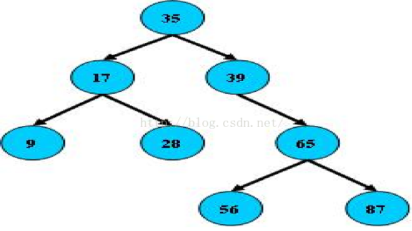
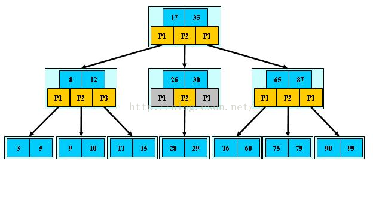
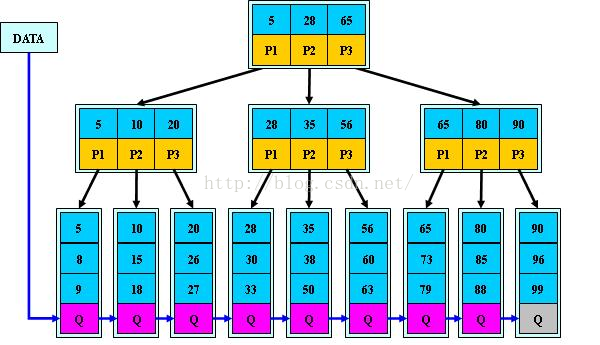
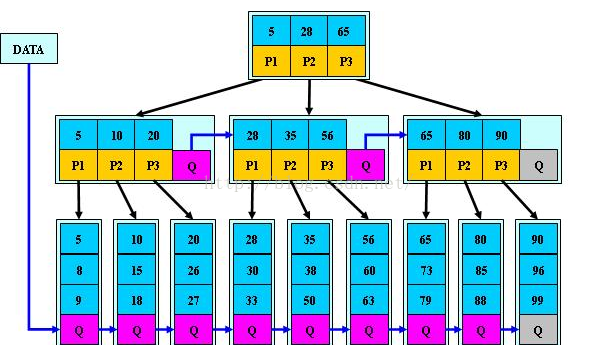
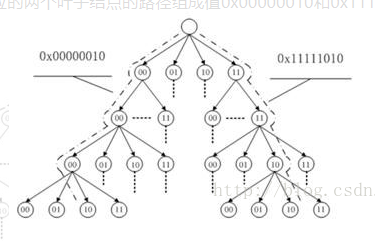
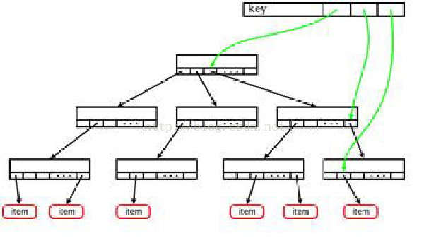
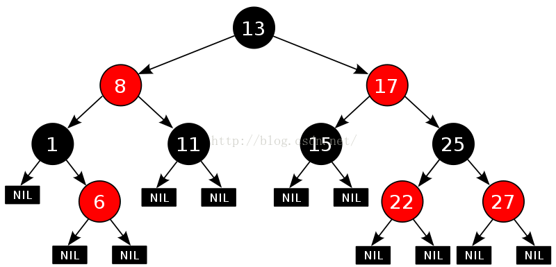

https://blog.csdn.net/ljy1988123/article/details/47905473

树作为一种很常用的数据结构, 主要包括二叉搜索数(BST)、多路搜索树(B-树)、B 树根据叶子节点树分为二叉树和多叉树. 根据左右节点是否高度上对称, 分为平衡树和非平衡树, 平衡树的一棵空树或它的左右两个子树的高度差的绝对值不超过 1, 并且左右两个子树都是一棵平衡树. 简单的说就是左右高度差不多.

树根据其组织节点的形式和添加删除的操作方式将树分成的很多种, 大的种类包括:

- **二叉树**
    - [二叉树](http://baike.baidu.com/view/88806.htm)
    - [二叉查找树](http://baike.baidu.com/view/389459.htm)
    - [笛卡尔树](http://baike.baidu.com/view/6667519.htm)
    - Top tree
    - T 树
- **自平衡二叉查找树**
    - [AA 树](https://baike.baidu.com/item/AA%E6%A0%91)
    - [AVL 树](http://baike.baidu.com/view/671745.htm)
    - [红黑树](http://baike.baidu.com/view/133754.htm)
    - [伸展树](http://baike.baidu.com/view/1118088.htm)
    - [树堆(Treap)](https://baike.baidu.com/item/Treap)
    - [节点大小平衡树](https://baike.baidu.com/item/%E8%8A%82%E7%82%B9%E5%A4%A7%E5%B0%8F%E5%B9%B3%E8%A1%A1%E6%A0%91)
- **B 树**
    - [B 树](https://baike.baidu.com/item/B%E6%A0%91)
    - `B+`树
    - `B*`树
    - Bx 树
    - UB 树
    - 2-3 树
    - 2-3-4 树
    - (a,b)-树
    - Dancing tree
    - H 树
- **Trie**
    - 前缀树
    - 后缀树
    - 基数树
- **空间划分树**
    - 四叉树
    - 八叉树
    - k-d 树
    - vp-树
    - R 树
    - R\*树
    - R\+树
    - X 树
    - M 树
    - 线段树
    - 希尔伯特 R 树
    - 优先 R 树
- **非二叉树**
    - Exponential tree
    - Fusion tree
    - 区间树
    - PQ tree
    - Range tree
    - SPQR tree
    - Van Emde Boas tree
- **其他类型**
    - 堆
    - 散列树
    - Finger tree
    - Metric tree
    - Cover tree
    - BK-tree
    - Doubly-chained tree
    - iDistance
    - Link-cut tree
    - 树状数组

二叉树是指每个节点有两个子节点的树, 自平衡二叉查找树是指在经过很多添加删除操作后树仍是平衡的, 因为其添加删除操作中本身就考虑了平衡问题.

Trie 树又叫做单词查找树, 或字典树. 典型应用是用于统计, 排序和保存大量的字符串(但不仅限于字符串), 所以经常被搜索引擎系统用于文本词频统计. 它的优点是: 利用字符串的公共前缀来减少查询时间, 最大限度地减少无谓的字符串比较, 查询效率比哈希树高.

## 一、BST(查找二叉树)

1. 所有非叶子结点至多拥有两个儿子(Left 和 Right);

2. 所有结点存储一个关键字;

3. 非叶子结点的左指针指向小于其关键字的子树, 右指针指向大于其关键字的子树;

这样定义的二叉查找树不一定是平衡的, 不平衡的二叉树在实际使用中作用不是很大. 因为经过一系列的添加删除操作后, 如果树不能保持平衡, 很容易变成左重右轻或者右重左轻. 这样的查找树效率非常低, 逼近于排序数组的遍历.

## 二、B 树

### 定义

1. 定义任意非叶子结点最多只有 M 个儿子; 且 M>2;

2. 根结点的儿子数为[2, M];

3. 除根结点以外的非叶子结点的儿子数为[M/2, M];

4. 每个结点存放至少 M/2-1(取上整)和至多 M-1 个关键字; (至少 2 个关键字)

5. 非叶子结点的关键字个数=指向儿子的指针个数-1;

6. 非叶子结点的关键字: K[1], K[2], ..., K[M-1]; 且 K[i];

7. 非叶子结点的指针: P[1], P[2], ..., P[M]; 其中 P[1]指向关键字小于 K[1]的子树, P[M]指向关键字大于 K[M-1]的子树, 其它 P[i]指向关键字属于(K[i-1], K[i])的子树;

8. 所有叶子结点位于同一层;

如: (M=3)

其中 P1、P2、P3 都代表指针.

### 搜索

B- 树的搜索, 从根结点开始, 对结点内的关键字(有序)序列进行二分查找, 如果命中则结束, 否则进入查询关键字所属范围的儿子结点; 重复, 直到所对应的儿子指针为空, 或已经是叶子结点;

### B 树的特性

1. 关键字集合分布在整颗树中;

2. 任何一个关键字出现且只出现在一个结点中;

3. 搜索有可能在非叶子结点结束;

4. 其搜索性能等价于在关键字全集内做一次二分查找;

5. 自动层次控制;

由于限制了除根结点以外的非叶子结点, 至少含有 M/2 个儿子, 确保了结点的至少利用率, 其最底搜索性能为 O(LogN).

### 应用

搜索取值范围内的数.

## 三、B+树: 为磁盘应用优化 B 树设计

B+ 树是专门为了在磁盘上存储而设计出来的数据结构. 不考虑实际的磁盘情况, B+ 树对于 B 树没有什么优势, 甚至有劣势. 但是由于磁盘的特殊性质 B+ 树在磁盘的文件系统和数据库的应用远比 B 树要合适.

### 定义

B+树是 B 树的变体, 也是一种多路搜索树:

1.其定义基本与 B 树同, 除了:

2.非叶子结点的子树指针与关键字个数相同;

3.非叶子结点的子树指针 P[i], 指向关键字值属于[ K[i], K[i+1])的子树(B-树是开区间);

5.为所有叶子结点增加一个链指针;

6.所有关键字都在叶子结点出现;

如: (M=3)

### 搜索

B+的搜索与 B-树也基本相同, 区别是 B+树只有达到叶子结点才命中(B-树可以在非叶子结点命中), 其性能也等价于在关键字全集做一次二分查找;

### B+的特性

1.所有关键字都出现在叶子结点的链表中(稠密索引), 且链表中的关键字恰好是有序的;

2.不可能在非叶子结点命中;

3.非叶子结点相当于是叶子结点的索引(稀疏索引), 叶子结点相当于是存储(关键字)数据的数据层;

4.更适合文件索引系统;

#### 应用

1. 不同于 B-树只适合随机检索, B+树同时支持随机检索和顺序检索, 在实际中应用比较多.

2. B+树比 B-树更适合实际应用中操作系统的文件索引和数据库索引.

在实际的涉及到磁盘搜索中, 一般使用 B+树. 原因是 B+树与 B-树在数据组织方面的区别. B+树的所有记录都放在叶子节点, 而 B-树则是分散在整个树中. 看起来从上到下的搜索 B-树可能不用到叶子节点就可以搜索到数据, 不考虑实际的情况, 确实 B 树能更快速的查找.

但实际的情况是磁盘是分块的, 每一块的大小是有限制的, B-树每个节点既有数据又有指针, 这个数据在应用中可不会只是一个整数, 而且大小还经常是不一样的. 这就决定了磁盘的一个块可以放少数的 B-树节点, 但可以放很多 B+树的非叶子节点. 由于搜索是一个涉及几乎全部节点的操作, B+树的非叶子节点不包含实际的数据, 只作为索引使用, 所以相当于通过一个短小的索引表(所占用物理空间)就可以定位出叶子节点, 最终检查叶子节点只需要一次. 而 B-树每次查询索引都需要检查一个带有数据的节点如此导致其走过的节点所占用的数据空间大小明显大. 在磁盘中分散的多次读取是非常浪费磁盘性能的导致 B-树在磁盘中的查找效率远远低于 B+树. 有人可以说全部读取到内存 B-树的效率不就高了吗?对于数据系统把节点全部读取到内存再处理是不现实的因为通常节点成千上网甚至千万.

## 四、B*树: 为磁盘应用优化 B+树设计

是 B+树的变体在 B+树的非根和非叶子结点再增加指向兄弟的指针提高空间的利用率. 其区别是兄弟节点如果一个太满就将一部分数据转移到不那么满的兄弟节点. 如果兄弟们都满了就新建兄弟节点. 而 B+树只会在一个兄弟满的时候新建新的兄弟节点.

B\*树定义了非叶子结点关键字个数至少为(2/3)\*M 即块的最低使用率为 2/3(代替 B+树的 1/2);

B+树的分裂: 当一个结点满时分配一个新的结点并将原结点中 1/2 的数据复制到新结点最后在父结点中增加新结点的指针; B+树的分裂只影响原结点和父结点而不会影响兄弟结点所以它不需要指向兄弟的指针;

B\*树的分裂: 当一个结点满时如果它的下一个兄弟结点未满那么将一部分数据移到兄弟结点中再在原结点插入关键字最后修改父结点中兄弟结点的关键字(因为兄弟结点的关键字范围改变了); 如果兄弟也满了则在原结点与兄弟结点之间增加新结点并各复制 1/3 的数据到新结点最后在父结点增加新结点的指针;

所以 B\*树分配新结点的概率比 B+树要低空间使用率更高;

## 小结

BST 树: 二叉搜索树每个结点只存储一个关键字等于则命中小于走左结点大于走右结点;

B-树(B 树): 多路搜索树每个结点存储 M/2 到 M 个关键字非叶子结点存储指向关键字范围的子结点; 所有关键字在整颗树中出现且只出现一次非叶子结点可以命中;

B+树: 在 B-树基础上为叶子结点增加链表指针所有关键字都在叶子结点中出现非叶子结点作为叶子结点的索引; B+树总是到叶子结点才命中;

B\*树: 在 B+树基础上为非叶子结点也增加链表指针将结点的最低利用率从 1/2 提高到 2/3;

## Linux 内核 B+树

Linux 内核中实现了一个通用的 B+树这个树非常简单以至于不适合实际的磁盘应用. 以至于很多文件系统都自己又实现了一份 B 类树.

头文件位于 include/linux 定义文件位于 lib 目录下. 可以看出这是 linux 提供的工具代码.

## Linux 内核 Radix 树(基树)

Linux 基数树(radix tree)是将指针与 long 整数键值相关联的机制它存储有效率并且可快速查询用于指针与整数值的映射(如: IDR 机制)、内存管理等. 需要特别注意的是 linux 的基树与课本里所学的数据结构的基树是完全不同的. 这个数据结构设计是用来取代稀疏整数数组的.

radix 树是通用的字典类型数据结构 radix 树又称为 PAT 位树(Patricia Trie or crit bit tree). Linux 内核使用了数据类型 unsigned long 的固定长度输入的版本. 每级代表了输入空间固定位数.

radix tree 是一种多叉搜索树树的叶子结点是实际的数据条目. 每个结点有一个固定的、2\^n 指针指向子结点(每个指针称为槽 slot)并有一个指针指向父结点.

Linux 内核利用 radix 树在文件内偏移快速定位文件缓存页图 4 是一个 radix 树样例该 radix 树的分叉为 4(22)树高为 4 树的每个叶子结点用来快速定位 8 位文件内偏移可以定位 4x4x4x4=256 页如: 图中虚线对应的两个叶子结点的路径组成值 0x00000010 和 0x11111010 指向文件内相应偏移所对应的缓存页.

Linux radix 树每个结点有 64 个 slot 与数据类型 long 的位数相同图 1 显示了一个有 3 级结点的 radix 树每个数据条目(item)可用 3 个 6 位的键值(key)进行索引键值从左到右分别代表第 1\~3 层结点位置. 没有孩子的结点在图中不出现. 因此 radix 树为稀疏树提供了有效的存储代替固定尺寸数组提供了键值到指针的快速查找.

一个 3 级结点的 radix 树及其键值表示:

Linux 基树与 trie 树非常类似只是一个是用来查询定位字符串每一个是用来查询定位整数.

## Linux 内核红黑树

红黑树是就是平衡二叉查找树的实现. 单纯的查找二叉树由于多次添加删除可能不平衡导致效率变低所以内核中实际使用的是红黑树.

红黑树通过定义一部分节点是红的一部分是黑的在插入删除时根据预先制定的红黑规则对树做一些变换以保证每次添加删除操作后树都是保持平衡的. 也就是说红与黑都是为了达成保持平衡的算法所设计的附属的手段.

从图中也可以看出红黑树也是一颗查找树. 都是左子节点<本节点<右子节点.

.................................................