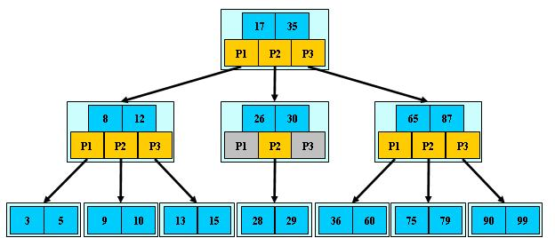

https://www.linuxidc.com/Linux/2014-11/109103.htm

# 1. BST

即二叉搜索树:

1. 所有非叶子结点最多拥有两个儿子;
2. 所有节点存储一个关键字;
3. 非叶子节点的左指针指向小于其关键字的子树, 右指针指向大于其关键字的子树;

# 2. B- 树(B 树)

**(M、M、2、1、关键)**

是一种多路搜索树(不是二叉的):

1. 定义任意非叶子节点最多只有 M 个儿子, 且 M>2;
2. 根节点的儿子数为[2, M];
3. 除根节点以外的非叶子节点的儿子数为[M/2, M];
4. 每个节点存放至少 M/2-1(取上整)和最多 M-1 个关键字; (至少 2 个关键字)
5. 非叶子节点的关键字个数=指向儿子的指针个数-1;
6. 非叶子接地啊的关键字: K[1],K[2],...,K[M-1]; 且 K[i];
7. 非叶子结点的指针: P[1], P[2], ..., P[M]; 其中 P[1]指向关键字小于 K[1]的子树, P[M]指向关键字大于 K[M-1]的子树, 其它 P[i]指向关键字属于(K[i-1], K[i])的子树;
8.所有叶子结点位于同一层;

如: (M=3)

`B-` 树的搜索, 从根结点开始, 对结点内的关键字(有序)序列进行二分查找, 如果命中则结束, 否则进入查询关键字所属范围的儿子结点; 重复, 直到所对应的儿子指针为空, 或已经是叶子结点;

`B-` 树的特性:

1.**关键字集合分布在整颗树中**;

2.**任何一个关键字出现且只出现在一个结点中**;

3.**搜索有可能在非叶子结点结束**;

4.**其搜索性能等价于在关键字全集内做一次二分查找**;

5.自动层次控制;

由于**限制了除根结点以外的非叶子结点, 至少含有 M/2 个儿子, 确保了结点的至少利用率, 其最底搜索性能为 O(LogN)**

# 3. B+ 树

`B+` 树是 `B-` 树的变体, 也是一种多路搜索树:

1.其定义基本与 `B-` 树同, 除了:

2.非叶子结点的子树指针与关键字个数相同;

3.非叶子结点的子树指针 `P[i]`, 指向关键字值属于`[K[i], K[i\+1])`的子树(`B-` 树是开区间);

5.为所有叶子结点增加一个链指针;

6.所有关键字都在叶子结点出现;

如: (M=3)

`B+`的搜索与 `B-`树也基本相同, 区别是 `B+`树只有达到叶子结点才命中(`B-`树可以在非叶子结点命中), 其性能也等价于在关键字全集做一次二分查找;

`B+`的特性:

1.所有关键字都出现在叶子结点的链表中(稠密索引), 且链表中的关键字恰好是有序的;

2.不可能在非叶子结点命中;

3.非叶子结点相当于是叶子结点的索引(稀疏索引), 叶子结点相当于是存储(关键字)数据的数据层;

4.更适合文件索引系统;

`B+`树比 `B-`树的优势:

1 不同于 `B-`树只适合随机检索, `B+`树同时支持随机检索和顺序检索, 在实际中应用比较多.

2 为什么说 `B+`树比 `B-`树更适合实际应用中操作系统的文件索引和数据库索引?

1) `B+`树的磁盘读写代价更低

`B+`树的内部结点并没有指向关键字具体信息的指针. 因此其内部结点相对 B 树更小. 如果把所有同一内部结点的关键字存放在同一盘块中, 那么盘块所能容纳的关键字数量也越多. 一次性读入内存中的需要查找的关键字也就越多. 相对来说 IO 读写次数也就降低了.

举个例子, 假设磁盘中的一个盘块容纳 16bytes, 而一个关键字 2bytes, 一个关键字具体信息指针 2bytes. 一棵 9 阶 B-tree(一个结点最多 8 个关键字)的内部结点需要 2 个盘块. 而 B+树内部结点只需要 1 个盘快(全部关键字都在叶结点的缘故?). 当需要把内部结点读入内存中的时候, B-树就比 B+树多一次盘块查找时间(在磁盘中就是盘片旋转的时间). (其实可以这么理解 B-tree B+的空间利用率的区别, 假如内存有一段存储空间, 如果存储 B-tree 的节点, 假如可以存储 10 个, 因为在 b-tree 的节点中可以发现, 10 个节点中最少有一般是指针, 也就是这些空间可以索引 10 个 key, 假如存储 b+树的节点, 10 个节点中都是索引, 那么每一个索引是可以指向一个链表的)

2) `B+`树的查询效率更加稳定

由于非终结点并不是最终指向文件内容的结点, 而只是叶子结点中关键字的索引. 所以任何关键字的查找必须走一条从根结点到叶子结点的路. 所有关键字查询的路径长度相同, 导致每一个数据的查询效率相当.

3 `B+`树和 `B-`树最大的不同点是:

1)`B-`树的关键字和记录是放在一起的, 叶子节点可以看作外部节点, 不包含任何信息; `B+`树的非叶子节点中只有关键字和指向下一个节点的索引, 记录只放在叶子节点中.

2)在 `B-`树中, 越靠近根节点的记录查找时间越快, 只要找到关键字即可确定记录的存在; 而 `B+`树中每个记录的查找时间基本是一样的, 都需要从根节点走到叶子节点, 而且在叶子节点中还要再比较关键字. 从这个角度看 `B-`树的性能好像要比 `B+`树好, 而在实际应用中却是 `B+`树的性能要好些. 因为 `B+`树的非叶子节点不存放实际的数据, 这样每个节点可容纳的元素个数比 `B-`树多, 树高比 `B-`树小, 这样带来的好处是减少磁盘访问次数. 尽管 `B+`树找到一个记录所需的比较次数要比 `B-`树多, 但是一次磁盘访问的时间相当于成百上千次内存比较的时间, 因此实际中 `B+`树的性能可能还会好些, 而且 `B+`树的叶子节点使用指针连接在一起, 方便顺序遍历(例如查看一个目录下的所有文件, 一个表中的所有记录等), 这也是很多数据库和文件系统使用 `B+`树的缘故.

# 4. B* 树

是 `B+` 树的变体, 在 `B+` 树的非根和非叶子结点再增加指向兄弟的指针;

`B*`树定义了非叶子结点关键字个数至少为(2/3)\*M, 即块的最低使用率为 2/3(代替 `B+`树的 1/2);

`B+`树的分裂: 当一个结点满时, 分配一个新的结点, 并将原结点中 1/2 的数据复制到新结点, 最后在父结点中增加新结点的指针; `B+`树的分裂只影响原结点和父结点, 而不会影响兄弟结点, 所以它不需要指向兄弟的指针;

`B*`树的分裂: 当一个结点满时, 如果它的下一个兄弟结点未满, 那么将一部分数据移到兄弟结点中, 再在原结点插入关键字, 最后修改父结点中兄弟结点的关键字(因为兄弟结点的关键字范围改变了); 如果兄弟也满了, 则在原结点与兄弟结点之间增加新结点, 并各复制 1/3 的数据到新结点, 最后在父结点增加新结点的指针;

所以, `B*` 树分配新结点的概率比 `B+` 树要低, 空间使用率更高;

# 5. 小结

BST 树: 二叉搜索树, 每个结点只存储一个关键字, 等于则命中, 小于走左结点, 大于走右结点;

`B-`树(B 树): 多路搜索树, 每个结点存储 M/2 到 M 个关键字, 非叶子结点存储指向关键字范围的子结点; 所有关键字在整颗树中出现, 且只出现一次, 非叶子结点可以命中;

`B+`树: 在 `B-`树基础上, 为叶子结点增加链表指针, 所有关键字都在叶子结点中出现, 非叶子结点作为叶子结点的索引; `B+`树总是到叶子结点才命中;

`B*`树: 在 `B+`树基础上, 为非叶子结点也增加链表指针, 将结点的最低利用率从 1/2 提高到 2/3;