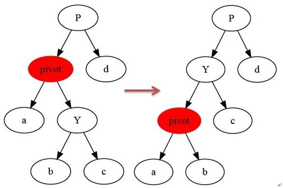
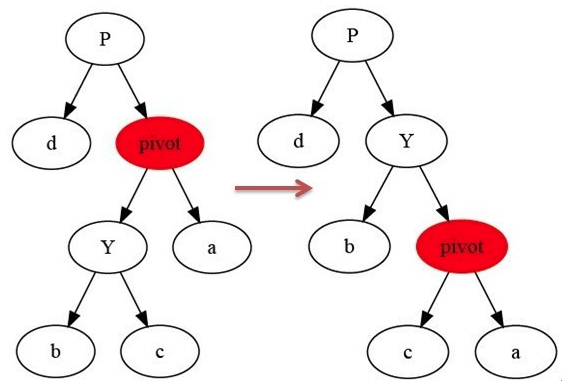
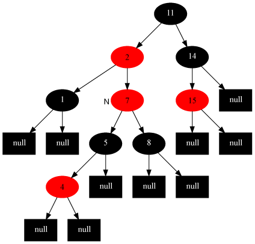
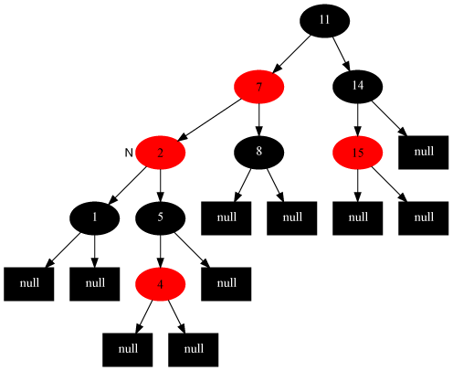
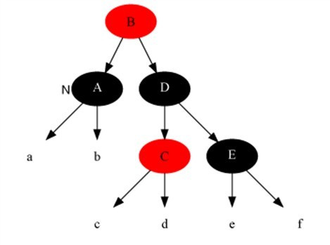
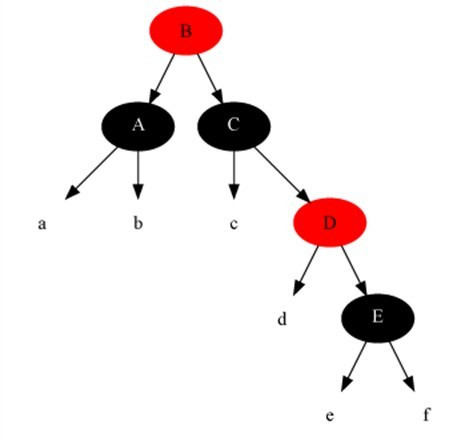

https://blog.csdn.net/v_JULY_v/article/details/6105630

本文参考: Google、算法导论、STL 源码剖析、计算机程序设计艺术.

推荐阅读:

1. Left-Leaning Red-Black Trees, Dagstuhl Workshop on Data Structures, Wadern, Germany, February, 2008, 直接下载: http://www.cs.princeton.edu/~rs/talks/LLRB/RedBlack.pdf.

2. 本文的 github 优化版: https://github.com/julycoding/The-Art-Of-Programming-By-July/blob/master/ebook/zh/03.01.md.

## 红黑树的介绍

先来看下算法导论对 R-B Tree 的介绍:

红黑树, 一种二叉查找树, 但在每个结点上增加一个存储位表示结点的颜色, 可以是 Red 或 Black.

通过对任何一条从根到叶子的路径上各个结点着色方式的限制, 红黑树确保没有一条路径会比其他路径长出俩倍, 因而是接近平衡的.

红黑树, 作为一棵二叉查找树, 满足二叉查找树的一般性质. 下面, 来了解下 二叉查找树的一般性质.

### 二叉查找树

二叉查找树, 也称有序二叉树(ordered binary tree), 或已排序二叉树(sorted binary tree), 是指一棵空树或者具有下列性质的二叉树:

- 若任意节点的左子树不空, 则左子树上所有结点的值均小于它的根结点的值;

- 若任意节点的右子树不空, 则右子树上所有结点的值均大于它的根结点的值;

- 任意节点的左、右子树也分别为二叉查找树.

- 没有键值相等的节点(no duplicate nodes).

因为一棵由 n 个结点随机构造的二叉查找树的高度为 lgn, 所以顺理成章, 二叉查找树的一般操作的执行时间为 O(lgn). 但二叉查找树若退化成了一棵具有 n 个结点的线性链后, 则这些操作最坏情况运行时间为 O(n).

红黑树虽然本质上是一棵二叉查找树, 但它在二叉查找树的基础上增加了着色和相关的性质使得红黑树相对平衡, 从而保证了**红黑树的查找、插入、删除的时间复杂度最坏为 O(log n)**.

但它是如何**保证一棵 n 个结点的红黑树的高度始终保持在 logn**的呢?这就引出了**红黑树的 5 个性质**:

1. 每个结点要么是红的要么是黑的.

2. 根结点是黑的.

3. 每个叶结点(叶结点即指树尾端 NIL 指针或 NULL 结点)都是黑的.

4. 如果一个结点是红的, 那么它的两个儿子都是黑的.

5. 对于任意结点而言, 其到叶结点树尾端 NIL 指针的每条路径都包含相同数目的黑结点.

正是红黑树的这 5 条性质, 使一棵 n 个结点的红黑树始终保持了 logn 的高度, 从而也就解释了上面所说的"红黑树的查找、插入、删除的时间复杂度最坏为 O(log n)"这一结论成立的原因.

(注: 上述第 3、5 点性质中所说的 NULL 结点, 包括 wikipedia.算法导论上所认为的叶子结点即为树尾端的 NIL 指针, 或者说 NULL 结点. 然百度百科以及网上一些其它博文直接说的叶结点, 则易引起误会, 因, 此叶结点非子结点)

如下图所示, 即是一颗红黑树(下图引自 wikipedia: http://t.cn/hgvH1l):


此图忽略了叶子和根部的父结点. 同时, 上文中我们所说的 "叶结点"或"NULL 结点", 如上图所示, **它不包含数据而只充当树在此结束的指示**, 这些节点在绘图中经常被省略, 望看到此文后的读者朋友注意.

## 二、树的旋转知识

当在对红黑树进行插入和删除等操作时, 对树做了修改可能会破坏红黑树的性质. 为了继续保持红黑树的性质, 可以通过对结点进行重新着色, 以及对树进行相关的旋转操作, 即通过修改树中某些结点的颜色及指针结构, 来达到对红黑树进行插入或删除结点等操作后继续保持它的性质或平衡的目的.

树的旋转分为左旋和右旋, 下面借助图来介绍一下左旋和右旋这两种操作.

### 1.左旋



如上图所示, 当在某个结点 pivot 上, 做左旋操作时, 我们假设它的右孩子 y 不是 NIL[T], pivot 可以为任何不是 NIL[T]的左子结点. 左旋以 pivot 到 Y 之间的链为"支轴"进行, 它使 Y 成为该子树的新根, 而 Y 的左孩子 b 则成为 pivot 的右孩子.

```
LeftRoate(T, x)
y ← x.right                    //定义 y: y 是 x 的右孩子
x.right ← y.left                //y 的左孩子成为 x 的右孩子
if y.left ≠ T.nil
    y.left.p ← x
y.p ← x.p                      //x 的父结点成为 y 的父结点
if x.p = T.nil
    then T.root ← y
else if x = x.p.left
    then x.p.left ← y
else x.p.right ← y
y.left ← x                       //x 作为 y 的左孩子
x.p ← y
```

### 2. 右旋

右旋与左旋差不多, 再此不做详细介绍.



树在经过左旋右旋之后, 树的搜索性质保持不变, 但树的红黑性质则被破坏了, 所以, 红黑树插入和删除数据后, 需要利用旋转与颜色重涂来重新恢复树的红黑性质.

至于有些书如《STL 源码剖析》有对双旋的描述, 其实双旋只是单旋的两次应用, 并无新的内容, 因此这里就不再介绍了, 而且左右旋也是相互对称的, 只要理解其中一种旋转就可以了.

## 三、红黑树的插入

要真正理解红黑树的插入, 还得先理解二叉查找树的插入. 磨刀不误砍柴工, 咱们再来了解一下二叉查找树的插入和红黑树的插入.

### 1. 二叉查找树的插入

如果要在二叉查找树中插入一个结点, 首先要查找到结点要插入的位置, 然后进行插入. 假设插入的结点为 z 的话, 插入的伪代码如下:

```
TREE-INSERT(T, z)
 1  y ← NIL
 2  x ← root[T]
 3  while x ≠ NIL
 4      do y ←  x
 5         if key[z] < key[x]
 6            then x ← left[x]
 7            else x ← right[x]
 8  p[z] ← y
 9  if y = NIL
10     then root[T] ← z              ⊹ Tree T was empty
11     else if key[z] < key[y]
12             then left[y] ← z
13             else right[y] ← z
```

可以看到, 上述第 3-7 行代码即是在二叉查找树中查找 z 待插入的位置, 如果插入结点 z 小于当前遍历到的结点, 则到当前结点的左子树中继续查找, 如果 z 大于当前结点, 则到当前结点的右子树中继续查找, 第 9-13 行代码找到待插入的位置, 如果 z 依然比此刻遍历到的新的当前结点小, 则 z 作为当前结点的左孩子, 否则作为当前结点的右孩子.

### 2. 红黑树的插入和插入修复

现在我们了解了二叉查找树的插入, 接下来, 咱们便来具体了解下红黑树的插入操作. 红黑树的插入相当于在二叉查找树插入的基础上, 为了重新恢复平衡, 继续做了插入修复操作.

假设插入的结点为 z, 红黑树的插入伪代码具体如下所示:

```
RB-INSERT(T, z)
y ← nil
x ← T.root
while x ≠ T.nil
    do y ← x
    if z.key < x.key
        then x ← x.left
    else x ← x.right
z.p ← y
if y == nil[T]
    then T.root ← z
else if z.key < y.key
    then y.left ← z
else y.right ← z
z.left ← T.nil
z.right ← T.nil
z.color ← RED
RB-INSERT-FIXUP(T, z)
```

我们把上面这段红黑树的插入代码, 跟我们之前看到的二叉查找树的插入代码, 可以看出, RB-INSERT(T, z)前面的第 1-13 行代码基本就是二叉查找树的插入代码, 然后第 14-16 行代码把 z 的左孩子、右孩子都赋为叶结点 nil, 再把 z 结点着为红色, 最后为保证红黑性质在插入操作后依然保持, 调用一个辅助程序 RB-INSERT-FIXUP 来对结点进行重新着色, 并旋转.

换言之

- 如果插入的是根结点, 因为原树是空树, 此情况只会违反性质 2, 所以直接把此结点涂为黑色.
- 如果插入的结点的父结点是黑色, 由于此不会违反性质 2 和性质 4, 红黑树没有被破坏, 所以此时也是什么也不做.

但当遇到下述 3 种情况时:

- 插入修复情况 1: 如果当前结点的父结点是红色且祖父结点的另一个子结点(叔叔结点)是红色
- 插入修复情况 2: 当前结点的父结点是红色,叔叔结点是黑色, 当前结点是其父结点的右子
- 插入修复情况 3: 当前结点的父结点是红色,叔叔结点是黑色, 当前结点是其父结点的左子

又该如何调整呢?答案就是根据红黑树插入代码 RB-INSERT(T, z)最后一行调用的 RB-INSERT-FIXUP(T,z)所示操作进行, 具体如下所示:

```
RB-INSERT-FIXUP(T,z)
 1 while color[p[z]] = RED
 2     do if p[z] = left[p[p[z]]]
 3           then y ← right[p[p[z]]]
 4                if color[y] = RED
 5                   then color[p[z]] ← BLACK                    ▹ Case 1
 6                        color[y] ← BLACK                       ▹ Case 1
 7                        color[p[p[z]]] ← RED                   ▹ Case 1
 8                        z ← p[p[z]]                            ▹ Case 1
 9                   else if z = right[p[z]]
10                           then z ← p[z]                       ▹ Case 2
11                                LEFT-ROTATE(T, z)              ▹ Case 2
12                           color[p[z]] ← BLACK                 ▹ Case 3
13                           color[p[p[z]]] ← RED                ▹ Case 3
14                           RIGHT-ROTATE(T, p[p[z]])            ▹ Case 3
15           else (same as then clause
                         with "right" and "left" exchanged)
16 color[root[T]] ← BLACK
```

下面, 咱们来分别处理上述 3 种插入修复情况.

**插入修复情况 1: 当前结点的父结点是红色且祖父结点的另一个子结点(叔叔结点)是红色. **

即如下代码所示:
```
 1 while color[p[z]] = RED
 2     do if p[z] = left[p[p[z]]]
 3           then y ← right[p[p[z]]]
 4                if color[y] = RED
```

此时父结点的父结点一定存在, 否则插入前就已不是红黑树.
与此同时, 又分为父结点是祖父结点的左子还是右子, 对于对称性, 我们只要解开一个方向就可以了.

在此, 我们只考虑父结点为祖父左子的情况.
同时, 还可以分为当前结点是其父结点的左子还是右子, 但是处理方式是一样的. 我们将此归为同一类.

  对策: 将当前结点的父结点和叔叔结点涂黑, 祖父结点涂红, 把当前结点指向祖父结点, 从新的当前结点重新开始算法. 即如下代码所示:

```
 5                   then color[p[z]] ← BLACK                    ▹ Case 1
 6                        color[y] ← BLACK                       ▹ Case 1
 7                        color[p[p[z]]] ← RED                   ▹ Case 1
 8                        z ← p[p[z]]                            ▹ Case 1
```

针对情况 1, 变化前(图片来源: saturnman)[当前结点为 4 结点]:


变化后:


**插入修复情况 2: 当前结点的父结点是红色,叔叔结点是黑色, 当前结点是其父结点的右子**
  对策: 当前结点的父结点做为新的当前结点, 以新当前结点为支点左旋. 即如下代码所示:
```
 9                   else if z = right[p[z]]
10                           then z ← p[z]                       ▹ Case 2
11                                LEFT-ROTATE(T, z)              ▹ Case 2
```
如下图所示, 变化前[当前结点为 7 结点]:



变化后:


**插入修复情况 3: 当前结点的父结点是红色,叔叔结点是黑色, 当前结点是其父结点的左子**
解法: 父结点变为黑色, 祖父结点变为红色, 在祖父结点为支点右旋, 操作代码为:
```
12                           color[p[z]] ← BLACK                 ▹ Case 3
13                           color[p[p[z]]] ← RED                ▹ Case 3
14                           RIGHT-ROTATE(T, p[p[z]])            ▹ Case 3
```

最后, 把根结点涂为黑色, 整棵红黑树便重新恢复了平衡.

如下图所示[当前结点为 2 结点]



变化后:


### 红黑树的删除

ok, 接下来, 咱们最后来了解, 红黑树的删除操作.

"我们删除的结点的方法与常规二叉搜索树中删除结点的方法是一样的, 如果被删除的结点不是有双非空子女, 则直接删除这个结点, 用它的唯一子结点顶替它的位置, 如果它的子结点都是空结点, 那就用空结点顶替它的位置, 如果它的双子全为非空, 我们就把它的直接后继结点内容复制到它的位置, 之后以同样的方式删除它的后继结点, 它的后继结点不可能是双子非空, 因此此传递过程最多只进行一次. "

#### 二叉查找树的删除

继续讲解之前, 补充说明下二叉树结点删除的几种情况, 待删除的结点按照儿子的个数可以分为三种:

1. 没有儿子, 即为叶结点. 直接把父结点的对应儿子指针设为 NULL, 删除儿子结点就 OK 了.
2. 只有一个儿子. 那么把父结点的相应儿子指针指向儿子的独生子, 删除儿子结点也 OK 了.
3. 有两个儿子. 这是最麻烦的情况, 因为你删除结点之后, 还要保证满足搜索二叉树的结构. 其实也比较容易, 我们可以选择左儿子中的最大元素或者右儿子中的最小元素放到待删除结点的位置, 就可以保证结构的不变. 当然, 你要记得调整子树, 毕竟又出现了结点删除. 习惯上大家选择左儿子中的最大元素, 其实选择右儿子的最小元素也一样, 没有任何差别, 只是人们习惯从左向右. 这里咱们也选择左儿子的最大元素, 将它放到待删结点的位置. 左儿子的最大元素其实很好找, 只要顺着左儿子不断的去搜索右子树就可以了, 直到找到一个没有右子树的结点. 那就是最大的了.

二叉查找树的删除代码如下所示:
```
TREE-DELETE(T, z)
 1  if left[z] = NIL or right[z] = NIL
 2      then y ← z
 3      else y ← TREE-SUCCESSOR(z)
 4  if left[y] ≠ NIL
 5      then x ← left[y]
 6      else x ← right[y]
 7  if x ≠ NIL
 8      then p[x] ← p[y]
 9  if p[y] = NIL
10      then root[T] ← x
11      else if y = left[p[y]]
12              then left[p[y]] ← x
13              else right[p[y]] ← x
14  if y ≠ z
15      then key[z] ← key[y]
16           copy y's satellite data into z
17  return y
```

#### 红黑树的删除和删除修复

OK, 回到红黑树上来, 红黑树结点删除的算法实现是:

RB-DELETE(T, z)   单纯删除结点的总操作
```
 1 if left[z] = nil[T] or right[z] = nil[T]
 2    then y ← z
 3    else y ← TREE-SUCCESSOR(z)
 4 if left[y] ≠ nil[T]
 5    then x ← left[y]
 6    else x ← right[y]
 7 p[x] ← p[y]
 8 if p[y] = nil[T]
 9    then root[T] ← x
10    else if y = left[p[y]]
11            then left[p[y]] ← x
12            else right[p[y]] ← x
13 if y ≠ z
14    then key[z] ← key[y]
15         copy y's satellite data into z
16 if color[y] = BLACK
17    then RB-DELETE-FIXUP(T, x)
18 return y
```

"在删除结点后, 原红黑树的性质可能被改变, 如果删除的是红色结点, 那么原红黑树的性质依旧保持, 此时不用做修正操作, 如果删除的结点是黑色结点, 原红黑树的性质可能会被改变, 我们要对其做修正操作. 那么哪些树的性质会发生变化呢, 如果删除结点不是树唯一结点, 那么删除结点的那一个支的到各叶结点的黑色结点数会发生变化, 此时性质 5 被破坏. 如果被删结点的唯一非空子结点是红色, 而被删结点的父结点也是红色, 那么性质 4 被破坏. 如果被删结点是根结点, 而它的唯一非空子结点是红色, 则删除后新根结点将变成红色, 违背性质 2. "

RB-DELETE-FIXUP(T, x)   恢复与保持红黑性质的工作

```
 1 while x ≠ root[T] and color[x] = BLACK
 2     do if x = left[p[x]]
 3           then w ← right[p[x]]
 4                if color[w] = RED
 5                   then color[w] ← BLACK                        ▹  Case 1
 6                        color[p[x]] ← RED                       ▹  Case 1
 7                        LEFT-ROTATE(T, p[x])                    ▹  Case 1
 8                        w ← right[p[x]]                         ▹  Case 1
 9                if color[left[w]] = BLACK and color[right[w]] = BLACK
10                   then color[w] ← RED                          ▹  Case 2
11                        x ← p[x]                                ▹  Case 2
12                   else if color[right[w]] = BLACK
13                           then color[left[w]] ← BLACK          ▹  Case 3
14                                color[w] ← RED                  ▹  Case 3
15                                RIGHT-ROTATE(T, w)              ▹  Case 3
16                                w ← right[p[x]]                 ▹  Case 3
17                         color[w] ← color[p[x]]                 ▹  Case 4
18                         color[p[x]] ← BLACK                    ▹  Case 4
19                         color[right[w]] ← BLACK                ▹  Case 4
20                         LEFT-ROTATE(T, p[x])                   ▹  Case 4
21                         x ← root[T]                            ▹  Case 4
22        else (same as then clause with "right" and "left" exchanged)
23 color[x] ← BLACK
```

"上面的修复情况看起来有些复杂, 下面我们用一个分析技巧: 我们从被删结点后来顶替它的那个结点开始调整, 并认为它有额外的一重黑色. 这里额外一重黑色是什么意思呢, 我们不是把红黑树的结点加上除红与黑的另一种颜色, 这里只是一种假设, 我们认为我们当前指向它, 因此空有额外一种黑色, 可以认为它的黑色是从它的父结点被删除后继承给它的, 它现在可以容纳两种颜色, 如果它原来是红色, 那么现在是红+黑, 如果原来是黑色, 那么它现在的颜色是黑+黑. 有了这重额外的黑色, 原红黑树性质 5 就能保持不变. 现在只要恢复其它性质就可以了, 做法还是尽量向根移动和穷举所有可能性. "--saturnman.

如果是以下情况, 恢复比较简单:
 - a)当前结点是红+黑色
    解法, 直接把当前结点染成黑色, 结束此时红黑树性质全部恢复.
 - b)当前结点是黑+黑且是根结点,
    解法: 什么都不做, 结束.

但如果是以下情况呢?:
 - 删除修复情况 1: 当前结点是黑+黑且兄弟结点为红色(此时父结点和兄弟结点的子结点分为黑)
 - 删除修复情况 2: 当前结点是黑加黑且兄弟是黑色且兄弟结点的两个子结点全为黑色
 - 删除修复情况 3: 当前结点颜色是黑+黑, 兄弟结点是黑色, 兄弟的左子是红色, 右子是黑色
 - 删除修复情况 4: 当前结点颜色是黑-黑色, 它的兄弟结点是黑色, 但是兄弟结点的右子是红色, 兄弟结点左子的颜色任意


此时, 我们需要调用 RB-DELETE-FIXUP(T, x), 来恢复与保持红黑性质的工作.

下面, 咱们便来分别处理这 4 种删除修复情况.

**删除修复情况 1: 当前结点是黑+黑且兄弟结点为红色(此时父结点和兄弟结点的子结点分为黑). **

  解法: 把父结点染成红色, 把兄弟结点染成黑色, 之后重新进入算法(我们只讨论当前结点是其父结点左孩子时的情况). 此变换后原红黑树性质 5 不变, 而把问题转化为兄弟结点为黑色的情况(注: 变化前, 原本就未违反性质 5, 只是为了**把问题转化为兄弟结点为黑色的情况**).   即如下代码操作:
```
//调用 RB-DELETE-FIXUP(T, x) 的 1-8 行代码
 1 while x ≠ root[T] and color[x] = BLACK
 2     do if x = left[p[x]]
 3           then w ← right[p[x]]
 4                if color[w] = RED
 5                   then color[w] ← BLACK                        ▹  Case 1
 6                        color[p[x]] ← RED                       ▹  Case 1
 7                        LEFT-ROTATE(T, p[x])                    ▹  Case 1
 8                        w ← right[p[x]]                         ▹  Case 1
```
变化前:


变化后:


**删除修复情况 2: 当前结点是黑加黑且兄弟是黑色且兄弟结点的两个子结点全为黑色. **

  解法: 把当前结点和兄弟结点中抽取一重黑色追加到父结点上, 把父结点当成新的当前结点, 重新进入算法. (此变换后性质 5 不变), 即调用 RB-INSERT-FIXUP(T, z) 的第 9-10 行代码操作, 如下:
```
//调用 RB-DELETE-FIXUP(T, x) 的 9-11 行代码
9                if color[left[w]] = BLACK and color[right[w]] = BLACK
10                   then color[w] ← RED                          ▹  Case 2
11                        x p[x]                                  ▹  Case 2
```
变化前:


变化后:


**删除修复情况 3: 当前结点颜色是黑+黑, 兄弟结点是黑色, 兄弟的左子是红色, 右子是黑色. **

  解法: 把兄弟结点染红, 兄弟左子结点染黑, 之后再在兄弟结点为支点解右旋, 之后重新进入算法. 此是把当前的情况转化为情况 4, 而性质 5 得以保持, 即调用 RB-INSERT-FIXUP(T, z) 的第 12-16 行代码, 如下所示:
```
//调用 RB-DELETE-FIXUP(T, x) 的第 12-16 行代码
12                   else if color[right[w]] = BLACK
13                           then color[left[w]] ← BLACK          ▹  Case 3
14                                color[w] ← RED                  ▹  Case 3
15                                RIGHT-ROTATE(T, w)              ▹  Case 3
16                                w ← right[p[x]]                 ▹  Case 3
```
变化前:



变化后:



**删除修复情况 4: 当前结点颜色是黑-黑色, 它的兄弟结点是黑色, 但是兄弟结点的右子是红色, 兄弟结点左子的颜色任意. **

  解法: 把兄弟结点染成当前结点父结点的颜色, 把当前结点父结点染成黑色, 兄弟结点右子染成黑色, 之后以当前结点的父结点为支点进行左旋, 此时算法结束, 红黑树所有性质调整正确, 即调用 RB-INSERT-FIXUP(T, z)的第 17-21 行代码, 如下所示:
```
//调用 RB-DELETE-FIXUP(T, x) 的第 17-21 行代码
17                         color[w] ← color[p[x]]                 ▹  Case 4
18                         color[p[x]] ← BLACK                    ▹  Case 4
19                         color[right[w]] ← BLACK                ▹  Case 4
20                         LEFT-ROTATE(T, p[x])                   ▹  Case 4
21                         x ← root[T]                            ▹  Case 4
```
变化前:


变化后:


### 本文参考

本文参考了算法导论、STL 源码剖析、计算机程序设计艺术等资料, 并推荐阅读这个 PDF: Left-Leaning Red-Black Trees, Dagstuhl Workshop on Data Structures, Wadern, Germany, February, 2008.
下载地址: <http://www.cs.princeton.edu/~rs/talks/LLRB/RedBlack.pdf>.
