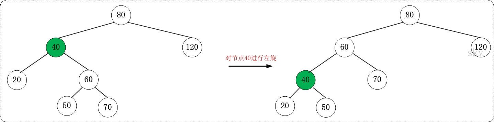
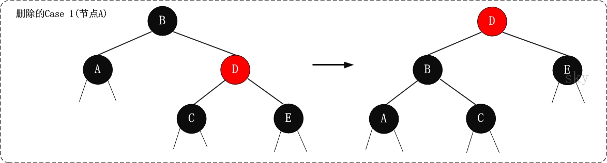

http://www.cnblogs.com/skywang12345/p/3245399.html

## 概要

1. 红黑树的介绍

2. 红黑树的应用

3. 红黑树的时间复杂度和相关证明

4. 红黑树的基本操作(一) 左旋和右旋

    - 4.1 左旋

    - 4.2 右旋

    - 4.3 区分 左旋 和 右旋

5. 红黑树的基本操作(二) 添加

6. 红黑树的基本操作(三) 删除

概述: R-B Tree, 又称为"红黑树". 本文参考了《算法导论》中红黑树相关知识, 加之自己的理解, 然后以图文的形式对红黑树进行说明. 本文的主要内容包括: 红黑树的特性, 红黑树的时间复杂度和它的证明, 红黑树的左旋、右旋、插入、删除等操作.

## 1. R-B Tree 简介

R-B Tree, 全称是 Red-Black Tree, 又称为"红黑树", 它一种特殊的二叉查找树. 红黑树的每个节点上都有存储位表示节点的颜色, 可以是红(Red) 或黑 (Black).

红黑树的特性:

(1)每个节点或者是黑色, 或者是红色.

(2)根节点是黑色.

(3)每个叶子节点(NIL)是黑色. [注意: 这里叶子节点, 是指为空(NIL 或 NULL)的叶子节点！]

(4)如果一个节点是红色的, 则它的子节点必须是黑色的.

(5)从一个节点到该节点的子孙节点的所有路径上包含相同数目的黑节点.

注意:

- 特性(3)中的叶子节点, 是只为空(NIL 或 null)的节点.

- 特性(5), 确保没有一条路径会比其他路径长出俩倍. 因而, 红黑树是相对是接近平衡的二叉树.

红黑树示意图如下:


结合 http://sandbox.runjs.cn/show/2nngvn8w 理解插入删除过程

## 2. 红黑树的应用

红黑树的应用比较广泛, 主要是用它来存储有序的数据, 它的时间复杂度是 `O(lgn)`, 效率非常之高.

例如, Java 集合中的[TreeSet](http://www.cnblogs.com/skywang12345/p/3311268.html)和[TreeMap](http://www.cnblogs.com/skywang12345/p/3310928.html), C++ STL 中的 set、map, 以及 Linux 虚拟内存的管理, 都是通过红黑树去实现的.

## 3. 红黑树的时间复杂度和相关证明

**红黑树的时间复杂度为: O(lgn)**

下面通过"数学归纳法"对红黑树的时间复杂度进行证明.

定理: 一棵含有 n 个节点的红黑树的高度至多为 2log(n+1).

证明:

"一棵含有 n 个节点的红黑树的高度至多为 2log(n+1)" 的逆否命题是 "高度为 h 的红黑树, 它的包含的内节点个数至少为 2h/2-1 个".

我们只需要证明逆否命题, 即可证明原命题为真; 即只需证明 "高度为 h 的红黑树, 它的包含的内节点个数至少为 2h/2-1 个".

从某个节点 x 出发(不包括该节点)到达一个叶节点的任意一条路径上, 黑色节点的个数称为该节点的黑高度(x's black height), 记为 bh(x). 关于 bh(x)有两点需要说明:

第 1 点: 根据红黑树的"特性(5) , 即从一个节点到该节点的子孙节点的所有路径上包含相同数目的黑节点"可知, 从节点 x 出发到达的所有的叶节点具有相同数目的黑节点. 这也就意味着, bh(x)的值是唯一的！

第 2 点: 根据红黑色的"特性(4), 即如果一个节点是红色的, 则它的子节点必须是黑色的"可知, 从节点 x 出发达到叶节点"所经历的黑节点数目">= "所经历的红节点的数目". 假设 x 是根节点, 则可以得出结论"bh(x) >= h/2". 进而, 我们只需证明 "高度为 h 的红黑树, 它的包含的黑节点个数至少为 2bh(x)-1 个"即可.

到这里, 我们将需要证明的定理已经由

"一棵含有 n 个节点的红黑树的高度至多为 2log(n+1)"

转变成只需要证明

"高度为 h 的红黑树, 它的包含的内节点个数至少为 (2\^(bh(x)))-1 个".


下面通过"数学归纳法"开始论证高度为 h 的红黑树, 它的包含的内节点个数至少为 2bh(x)-1 个".

(01) 当树的高度 h=0 时,

内节点个数是 0, bh(x) 为 0, 2\^(bh(x))-1 也为 0. 显然, 原命题成立.

(02) 当 h>0, 且树的高度为 h-1 时, 它包含的节点个数至少为 2\^(bh(x)-1)-1. 这个是根据(01)推断出来的！

下面, 由树的高度为 h-1 的已知条件推出"树的高度为 h 时, 它所包含的节点树为 2bh(x)-1".

当树的高度为 h 时,

对于节点 x(x 为根节点), 其黑高度为 bh(x).

对于节点 x 的左右子树, 它们黑高度为 bh(x) 或者 bh(x)-1.

根据(02)的已知条件, 我们已知 "x 的左右子树, 即高度为 h-1 的节点, 它包含的节点至少为 2bh(x)-1-1 个";

所以, 节点 x 所包含的节点至少为 ( 2\^(bh(x)-1)-1 ) + ( 2\^(bh(x)-1)-1 ) + 1 =2\^(bh(x))-1. 即节点 x 所包含的节点至少为 2\^(bh(x))-1.

因此, 原命题成立.

由(01)、(02)得出, "高度为 h 的红黑树, 它的包含的内节点个数至少为 2\^(bh(x))-1 个".

因此, "一棵含有 n 个节点的红黑树的高度至多为 2log(n+1)".

## 4. 红黑树的基本操作(一) 左旋和右旋

红黑树的基本操作是**添加、删除**. 在对红黑树进行添加或删除之后, **都会用到旋转方法**. 为什么呢?道理很简单, 添加或删除红黑树中的节点之后, 红黑树就发生了变化, 可能不满足红黑树的 5 条性质, 也就不再是一颗红黑树了, 而是一颗普通的树. 而通过旋转, 可以使这颗树重新成为红黑树. 简单点说, 旋转的目的是让树保持红黑树的特性.

旋转包括两种: **左旋** 和 **右旋**. 下面分别对它们进行介绍.

### 4.1 左旋


对 x 进行左旋, 意味着"**将 x 变成一个左节点**". 与 x 的右节点相关.

左旋的伪代码《算法导论》: 参考上面的示意图和下面的伪代码, 理解"红黑树 T 的节点 x 进行左旋"是如何进行的.

```
LEFT-ROTATE(T, x)
 y ← right[x]            // 前提: 这里假设 x 的右孩子为 y. 下面开始正式操作
 right[x] ← left[y]      // 将 "y 的左孩子" 设为 "x 的右孩子", 即 将β设为 x 的右孩子
 p[left[y]] ← x          // 将 "x" 设为 "y 的左孩子的父亲", 即 将β的父亲设为 x
 p[y] ← p[x]             // 将 "x 的父亲" 设为 "y 的父亲"
 if p[x] = nil[T]
 then root[T] ← y                 // 情况 1: 如果 "x 的父亲" 是空节点, 则将 y 设为根节点
 else if x = left[p[x]]
           then left[p[x]] ← y    // 情况 2: 如果 x 是它父节点的左孩子, 则将 y 设为"x 的父节点的左孩子"
           else right[p[x]] ← y   // 情况 3: (x 是它父节点的右孩子) 将 y 设为"x 的父节点的右孩子"
 left[y] ← x             // 将 "x" 设为 "y 的左孩子"
 p[x] ← y                // 将 "x 的父节点" 设为 "y"
 ```

```
 LeftRoate(T, x)
y ← x.right                    //定义 y: y 是 x 的右孩子
x.right ← y.left                //y 的左孩子成为 x 的右孩子
if y.left ≠ T.nil
    y.left.p ← x
y.p ← x.p                      //x 的父结点成为 y 的父结点
if x.p = T.nil
    then T.root ← y
else if x = x.p.left
    then x.p.left ← y
else x.p.right ← y
y.left ← x                       //x 作为 y 的左孩子
x.p ← y
```

理解左旋之后, 看看下面一个更鲜明的例子.



### 4.2 右旋


对 y 进行右旋, 意味着"**将 y 变成一个右节点**". 与 y 的左节点相关.

右旋的伪代码《算法导论》: 参考上面的示意图和下面的伪代码, 理解"红黑树 T 的节点 y 进行右旋"是如何进行的.

```
RIGHT-ROTATE(T, y)
 x ← left[y]             // 前提: 这里假设 y 的左孩子为 x. 下面开始正式操作
 left[y] ← right[x]      // 将 "x 的右孩子" 设为 "y 的左孩子", 即 将β设为 y 的左孩子
 p[right[x]] ← y         // 将 "y" 设为 "x 的右孩子的父亲", 即 将β的父亲设为 y
 p[x] ← p[y]             // 将 "y 的父亲" 设为 "x 的父亲"
 if p[y] = nil[T]
 then root[T] ← x                 // 情况 1: 如果 "y 的父亲" 是空节点, 则将 x 设为根节点
 else if y = right[p[y]]
           then right[p[y]] ← x   // 情况 2: 如果 y 是它父节点的右孩子, 则将 x 设为"y 的父节点的左孩子"
           else left[p[y]] ← x    // 情况 3: (y 是它父节点的左孩子) 将 x 设为"y 的父节点的左孩子"
 right[x] ← y            // 将 "y" 设为 "x 的右孩子"
 p[y] ← x                // 将 "y 的父节点" 设为 "x"
```

理解右旋之后, 看看下面一个更鲜明的例子.


**旋转总结**:

(01) 左旋 和 右旋 是相对的两个概念, 原理类似. 理解一个也就理解了另一个.

(02) 下面谈谈如何区分 左旋 和 右旋.

在实际应用中, 若没有彻底理解 左旋 和 右旋, 可能会将它们混淆. 下面谈谈我对如何区分 左旋 和 右旋 的理解.

### 4.3 区分 左旋 和 右旋

仔细观察上面"左旋"和"右旋"的示意图. 我们能清晰的发现, 它们是对称的. 无论是左旋还是右旋, 被旋转的树, 在旋转前是二叉查找树, 并且旋转之后仍然是一颗二叉查找树.


**左旋示例图**(以 x 为节点进行左旋):

```
                               z
   x                          /
  / \      --(左旋)-->       x
 y   z                      /
                           y
```

**对 x 进行左旋**, 意味着, 将"**x 的右孩子"设为"x 的父亲节点**"; 即, 将 x 变成了一个左节点(x 成了为 z 的左孩子)！. 因此, **左旋中的"左", 意味着"被旋转的节点将变成一个左节点"**.

**右旋示例图**(以 x 为节点进行右旋):

```
                               y
   x                            \
  / \      --(右旋)-->           x
 y   z                            \
                                   z
```

**对 x 进行右旋**, 意味着, 将"**x 的左孩子"设为"x 的父亲节点**"; 即, 将 x 变成了一个右节点(x 成了为 y 的右孩子)！因此, **右旋中的"右", 意味着"被旋转的节点将变成一个右节点"**.

## 5. 红黑树的基本操作(二) 添加

将一个节点插入到红黑树中, 需要执行哪些步骤呢?首先, 将红黑树当作一颗二叉查找树, 将节点插入; 然后, 将节点着色为红色; 最后, 通过旋转和重新着色等方法来修正该树, 使之重新成为一颗红黑树. 详细描述如下:

**第一步: 将红黑树当作一颗二叉查找树, 将节点插入**.

红黑树本身就是一颗二叉查找树, 将节点插入后, 该树仍然是一颗二叉查找树. 也就意味着, 树的键值仍然是有序的. 此外, 无论是左旋还是右旋, 若旋转之前这棵树是二叉查找树, 旋转之后它一定还是二叉查找树. 这也就意味着, 任何的旋转和重新着色操作, 都不会改变它仍然是一颗二叉查找树的事实.

好吧?那接下来, 我们就来想方设法的旋转以及重新着色, 使这颗树重新成为红黑树！

**第二步: 将插入的节点着色为"红色"**.

为什么着色成红色, 而不是黑色呢?为什么呢?在回答之前, 我们需要重新温习一下红黑树的特性:

(1) 每个节点或者是黑色, 或者是红色.

(2) 根节点是黑色.

(3) 每个叶子节点是黑色.  [注意: 这里叶子节点, 是指为空的叶子节点！]

(4) 如果一个节点是红色的, 则它的子节点必须是黑色的.

(5) 每个节点到叶子节点 NIL 的简单路径经过的黑色节点的个数一样.

**将插入的节点着色为红色, 不会违背"特性(5)"**！少违背一条特性, 就意味着我们需要处理的情况越少. 接下来, 就要努力的让这棵树满足其它性质即可; 满足了的话, 它就又是一颗红黑树了.

**第三步: 通过一系列的旋转或着色等操作, 使之重新成为一颗红黑树**.

第二步中, 将插入节点着色为"红色"之后, 不会违背"特性(5)". 那它到底会违背哪些特性呢?

对于"特性(1)", 显然不会违背了. 因为我们已经将它涂成红色了.

对于"特性(2)", 显然也不会违背. 在第一步中, 我们是将红黑树当作二叉查找树, 然后执行的插入操作. 而根据二叉查找数的特点, 插入操作不会改变根节点. 所以, 根节点仍然是黑色.

对于"特性(3)", 显然不会违背了. 这里的叶子节点是指的空叶子节点, 插入非空节点并不会对它们造成影响.

对于"特性(4)", 是有可能违背的！

那接下来, 想办法使之"**满足特性(4)**", 就可以将树重新构造成红黑树了.

下面看看代码到底是怎样实现这三步的.

添加操作的伪代码《算法导论》

```
RB-INSERT(T, z)

y ← nil[T]                        // 新建节点"y", 将 y 设为空节点.
x ← root[T]                       // 设"红黑树 T"的根节点为"x"

while x ≠ nil[T]                  // 找出要插入的节点"z"在二叉树 T 中的位置"y"
    do y ← x
        if key[z] < key[x]
           then x ← left[x]
        else x ← right[x]

p[z] ← y                          // 设置 "z 的父亲" 为 "y". y 是那个左子节点或右子节点为 nil 的叶节点, 第一张图中, 如果 z 值是 15, 那么 y 就是图中 10 对应的节点

if y = nil[T]                     // 空树
    then root[T] ← z              // 情况 1: 若 y 是空节点, 则将 z 设为根
else if key[z] < key[y]
    then left[y] ← z              // 情况 2: 若"z 所包含的值" < "y 所包含的值", 则将 z 设为"y 的左孩子"
else right[y] ← z                 // 情况 3: ("z 所包含的值" >= "y 所包含的值")将 z 设为"y 的右孩子"

left[z] ← nil[T]                  // z 的左孩子设为空
right[z] ← nil[T]                 // z 的右孩子设为空. 至此, 已经完成将"节点 z 插入到二叉树"中了.
color[z] ← RED                    // 将 z 着色为"红色"
RB-INSERT-FIXUP(T, z)             // 通过 RB-INSERT-FIXUP 对红黑树的节点进行颜色修改以及旋转, 让树 T 仍然是一颗红黑树
```

**上面的操作就是在红黑树中插入节点, 并涂成红色, 然后调用 RB-INSERT-FIXUP**.

结合伪代码以及为代码上面的说明, 先理解 RB-INSERT. 理解了 RB-INSERT 之后, 我们接着对 RB-INSERT-FIXUP 的伪代码进行说明.

添加修正操作的伪代码《算法导论》

```
RB-INSERT-FIXUP(T, z)

while color[p[z]] = RED                                                     // 若"当前节点(z)的父节点是红色", 则进行以下处理.
    do if p[z] = left[p[p[z]]]                                              // 若"z 的父节点"是"z 的祖父节点的左孩子", 则进行以下处理.
        then y ← right[p[p[z]]]                                             // 将 y 设置为"z 的叔叔节点(z 的祖父节点的右孩子)"

        if color[y] = RED                                                   // Case 1 条件: 叔叔是红色
            then color[p[z]] ← BLACK                            ▹ Case 1   //  (01) 将"父节点"设为黑色.
                color[y] ← BLACK                                ▹ Case 1   //  (02) 将"叔叔节点"设为黑色.
                color[p[p[z]]] ← RED                            ▹ Case 1   //  (03) 将"祖父节点"设为"红色".
                z ← p[p[z]]                                     ▹ Case 1   //  (04) 将"祖父节点"设为"当前节点"(红色节点)
        else if z = right[p[z]]                                             // Case 2 条件: 叔叔是黑色, 且当前节点是右孩子
            then z ← p[z]                                       ▹ Case 2   //  (01) 将"父节点"作为"新的当前节点".
                LEFT-ROTATE(T, z)                               ▹ Case 2   //  (02) 以"新的当前节点"为支点进行左旋.
            color[p[z]] ← BLACK                                 ▹ Case 3   // Case 3 条件: 叔叔是黑色, 且当前节点是左孩子. (01) 将"父节点"设为"黑色".
            color[p[p[z]]] ← RED                                ▹ Case 3   //  (02) 将"祖父节点"设为"红色".
            RIGHT-ROTATE(T, p[p[z]])                            ▹ Case 3   //  (03) 以"祖父节点"为支点进行右旋.
    else (same as then clause with "right" and "left" exchanged)            // 若"z 的父节点"是"z 的祖父节点的右孩子", 将上面的操作中"right"和"left"交换位置, 然后依次执行.

color[root[T]] ← BLACK
```

根据被插入节点的父节点的情况, 可以将"当节点 z 被着色为红色节点, 并插入二叉树"划分为三种情况来处理.

1) 情况说明: 被插入的节点是根节点.

处理方法: 直接把此节点涂为黑色.

2) 情况说明: 被插入的节点的父节点是黑色.

处理方法: 什么也不需要做. 节点被插入后, 仍然是红黑树.

3) 情况说明: 被插入的节点的父节点是红色.

处理方法: 那么, 该情况与红黑树的"特性(4)"相冲突. 这种情况下, 被插入节点是一定存在非空祖父节点的; 进一步的讲, 被插入节点也一定存在叔叔节点(即使叔叔节点为空, 我们也视之为存在, 空节点本身就是黑色节点). 理解这点之后, 我们依据"叔叔节点的情况", 将这种情况进一步划分为 3 种情况(Case). 也就是说**插入一共 5 种情况**.


Case X | 现象说明 | 处理策略
---|---|---
Case 1 | 当前节点的父节点是红色, 且当前节点的祖父节点的另一个子节点(叔叔节点)也是红色.  | (01) 将"父节点"设为黑色. (02) 将"叔叔节点"设为黑色. (03) 将"祖父节点"设为"红色". (04) 将"祖父节点"设为"当前节点"(红色节点); 即, 之后继续对"当前节点"进行操作.
Case 2 | 当前节点的父节点是红色, 叔叔节点是黑色, 且当前节点是其父节点的右孩子 | (01) 将"父节点"作为"新的当前节点". (02) 以"新的当前节点"为支点进行左旋.
Case 3 | 当前节点的父节点是红色, 叔叔节点是黑色, 且当前节点是其父节点的左孩子 | (01) 将"父节点"设为"黑色". (02) 将"祖父节点"设为"红色". (03) 以"祖父节点"为支点进行右旋.

上面三种情况(Case)处理问题的核心思路都是: 将红色的节点移到根节点; 然后, 将根节点设为黑色. 下面对它们详细进行介绍.

### 1. (Case 1)叔叔是红色

#### 1.1 现象说明

当前节点(即, 被插入节点)的父节点是红色, 且当前节点的祖父节点的另一个子节点(叔叔节点)也是红色.

#### 1.2 处理策略

(01) 将"父节点"设为黑色.

(02) 将"叔叔节点"设为黑色.

(03) 将"祖父节点"设为"红色".

(04) 将"祖父节点"设为"当前节点"(红色节点); 即, 之后继续对"当前节点"进行操作.

**下面谈谈为什么要这样处理**. (建议理解的时候, 通过下面的图进行对比)

"当前节点"和"父节点"都是红色, 违背"特性(4)". 所以, 将"父节点"设置"黑色"以解决这个问题.

但是, 将"父节点"由"红色"变成"黑色"之后, 违背了"特性(5)": 因为, 包含"父节点"的分支的黑色节点的总数增加了 1.   解决这个问题的办法是: 将"祖父节点"由"黑色"变成红色, 同时, 将"叔叔节点"由"红色"变成"黑色". 关于这里, 说明几点: 第一, 为什么"祖父节点"之前是黑色?这个应该很容易想明白, 因为在变换操作之前, 该树是红黑树, "父节点"是红色, 那么"祖父节点"一定是黑色.  第二, 为什么将"祖父节点"由"黑色"变成红色, 同时, 将"叔叔节点"由"红色"变成"黑色"; 能解决"包含'父节点'的分支的黑色节点的总数增加了 1"的问题. 这个道理也很简单. "包含'父节点'的分支的黑色节点的总数增加了 1" 同时也意味着 "包含'祖父节点'的分支的黑色节点的总数增加了 1", 既然这样, 我们通过将"祖父节点"由"黑色"变成"红色"以解决"包含'祖父节点'的分支的黑色节点的总数增加了 1"的问题;  但是, 这样处理之后又会引起另一个问题"包含'叔叔'节点的分支的黑色节点的总数减少了 1", 现在我们已知"叔叔节点"是"红色", 将"叔叔节点"设为"黑色"就能解决这个问题.  所以, 将"祖父节点"由"黑色"变成红色, 同时, 将"叔叔节点"由"红色"变成"黑色"; 就解决了该问题.

按照上面的步骤处理之后: 当前节点、父节点、叔叔节点之间都不会违背红黑树特性, 但祖父节点却不一定. 若此时, 祖父节点是根节点, 直接将祖父节点设为"黑色", 那就完全解决这个问题了; 若祖父节点不是根节点, 那我们需要将"祖父节点"设为"新的当前节点", 接着对"新的当前节点"进行分析.

#### 1.3 示意图


### 2. (Case 2)叔叔是黑色, 且当前节点是右孩子

#### 2.1 现象说明

当前节点(即, 被插入节点)的父节点是红色, 叔叔节点是黑色, 且当前节点是其父节点的右孩子

#### 2.2 处理策略

(01) 将"父节点"作为"新的当前节点".

(02) 以"新的当前节点"为支点进行左旋.

**下面谈谈为什么要这样处理**. (建议理解的时候, 通过下面的图进行对比)

首先, 将"父节点"作为"新的当前节点"; 接着, 以"新的当前节点"为支点进行左旋.  为了便于理解, 我们先说明第(02)步, 再说明第(01)步; 为了便于说明, 我们设置"父节点"的代号为 F(Father), "当前节点"的代号为 S(Son).

为什么要"以 F 为支点进行左旋"呢?根据已知条件可知: S 是 F 的右孩子. 而之前我们说过, 我们处理红黑树的核心思想: 将红色的节点移到根节点; 然后, 将根节点设为黑色. 既然是"将红色的节点移到根节点", 那就是说要不断的将破坏红黑树特性的红色节点上移(即向根方向移动).  而 S 又是一个右孩子, 因此, 我们可以通过"左旋"来将 S 上移！

按照上面的步骤(以 F 为支点进行左旋)处理之后: 若 S 变成了根节点, 那么直接将其设为"黑色", 就完全解决问题了; 若 S 不是根节点, 那我们需要执行步骤(01), 即"将 F 设为'新的当前节点'". 那为什么不继续以 S 为新的当前节点继续处理, 而需要以 F 为新的当前节点来进行处理呢?这是因为"左旋"之后, F 变成了 S 的"子节点", 即 S 变成了 F 的父节点; 而我们处理问题的时候, 需要从下至上(由叶到根)方向进行处理; 也就是说, 必须先解决"孩子"的问题, 再解决"父亲"的问题; 所以, 我们执行步骤(01): 将"父节点"作为"新的当前节点".

-------

感谢楼主写的很详细呢. 但是总觉得在 Insertion 操作中对 Case 2 的处理策略进行解释的有点片面.
之所以要左旋和将父节点作为当前节点, 其实根本原因不是红黑树的核心思想, 这里体现的不是核心思想. 对整个算法来说遵从了核心思想, 而这里左旋只是为了到达 Case 3 的效果, 为 Case 3 的右旋做准备, 为什么这么说呢?
我认为在 Case 1 中, 如果叔叔是红节点, 我们可以只通过 color changes 操作, 避免性质 4 和 5 的冲突, 因为此时我们可以调节叔叔的颜色为黑色, 来保证叔叔 path 上黑色节点数增加, 从而平衡.

而在 Case 2 中, 只通过 color changes 操作没法保证避免性质 4、5. 这时候我们只能迫于无赖采用旋转操作. 因为此时父亲节点是祖父节点的左孩子, 所以我们猜测可能要对祖父节点旋转选择右旋转. (如果假设我们跳过 Case2 的操作, 直接进行 Case 3 的操作), 也就是此时当前节点依然是父亲节点的右孩子, 我们首先采用 case3 的第一步操作, 变父亲节点为黑色, 消除了性质 4, 但是此时父亲所在路径多了一个黑节点, 我们想把父亲往上一层, 然后把祖父变为红色右侧下一层, 也就是所谓的对祖父进行右旋转.  注意到, 祖父此时变为红色, 而且父节点的右孩子也就是当前节点(红色)要变成祖父节点的左孩子. 那么变化后, 祖父节点和当前节点在相邻的两层了, 而且同时为红色. 又带来了冲突.  最简单的方法就是在右旋转的前, 把当前节点红色转移到左孩子去. 这就是 Case 2 为什么要这么做的原因了.

感觉说了一大堆, 还是说的不怎么清楚, 但其实楼主只要在 case 2 的情况下, 跳过 case 2 的操作, 直接进行 case 3, 画画图, 就知道为什么了~

-------

#### 2.2 示意图


### 3. (Case 3)叔叔是黑色, 且当前节点是左孩子

##### 3.1 现象说明

当前节点(即, 被插入节点)的父节点是红色, 叔叔节点是黑色, 且当前节点是其父节点的左孩子

#### 3.2 处理策略

(01) 将"父节点"设为"黑色".

(02) 将"祖父节点"设为"红色".

(03) 以"祖父节点"为支点进行右旋.

下面谈谈为什么要这样处理. (建议理解的时候, 通过下面的图进行对比)

为了便于说明, 我们设置"当前节点"为 S(Original Son), "兄弟节点"为 B(Brother), "叔叔节点"为 U(Uncle), "父节点"为 F(Father), 祖父节点为 G(Grand-Father).

S 和 F 都是红色, 违背了红黑树的"特性(4)", 我们可以将 F 由"红色"变为"黑色", 就解决了"违背'特性(4)'"的问题; 但却引起了其它问题: 违背特性(5), 因为将 F 由红色改为黑色之后, 所有经过 F 的分支的黑色节点的个数增加了 1. 那我们如何解决"所有经过 F 的分支的黑色节点的个数增加了 1"的问题呢?我们可以通过"将 G 由黑色变成红色", 同时"以 G 为支点进行右旋"来解决.

#### 2.3 示意图


------

case1
是为了一层一层向上递归 递归到根节点 直接黑掉根节点的红色

case2
这种情况不好处理, 或者说仅仅为了从左到右的习惯, 把这个棘手的右孩 子转为左孩子处理(可以这么理解、虽然这样不对)这样的结果就是变成了 case3

case3
默认添加之前该树就是红黑树, 这么一处理就对了, 不需要再处理. 循环到此结束！

综上所述针对添加操作怎么复原红黑树?

- 第一种情况: 递归到根节点、直接黑掉根节点
- 第二种情况: 这种情况不处理, 直接转成第三种情况
- 第三种情况: 一次到位.

------

注: **插入实际上是原地算法, 因为上述所有调用都使用了尾部递归**.

## 6. 红黑树的基本操作(三) 删除

将红黑树内的某一个节点删除. 需要执行的操作依次是: 首先, 将红黑树当作一颗二叉查找树, 将该节点从二叉查找树中删除; 然后, 通过"旋转和重新着色"等一系列来修正该树, 使之重新成为一棵红黑树. 详细描述如下:

**第一步: 将红黑树当作一颗二叉查找树, 将节点删除**.

这和"删除常规二叉查找树中删除节点的方法是一样的". 分 3 种情况:

1) 被删除节点没有儿子, 即为叶节点. 那么, 直接将该节点删除就 OK 了.

2) 被删除节点只有一个儿子. 那么, 直接删除该节点, 并用该节点的唯一子节点顶替它的位置.

3) 被删除节点有两个儿子. 那么, 先找出它的后继节点; 然后把"它的后继节点的内容"复制给"该节点的内容"; 之后, 删除"它的后继节点". 在这里, 后继节点相当于替身, 在将后继节点的内容复制给"被删除节点"之后, 再将后继节点删除. 这样就巧妙的将问题转换为"删除后继节点"的情况了, 下面就考虑后继节点.  在"被删除节点"有两个非空子节点的情况下, 它的后继节点不可能是双子非空. 既然"的后继节点"不可能双子都非空, 就意味着"该节点的后继节点"要么没有儿子, 要么只有一个儿子. 若没有儿子, 则按"情况1) "进行处理; 若只有一个儿子, 则按"情况2) "进行处理.

**第二步: 通过"旋转和重新着色"等一系列来修正该树, 使之重新成为一棵红黑树**.

因为"第一步"中删除节点之后, 可能会违背红黑树的特性. 所以需要通过"旋转和重新着色"来修正该树, 使之重新成为一棵红黑树.

删除操作的伪代码《算法导论》

```
RB-DELETE(T, z)
if left[z] = nil[T] or right[z] = nil[T]
   then y ← z                                  // 若"z 的左孩子" 或 "z 的右孩子"为空, 则将"z"赋值给 "y";
   else y ← TREE-SUCCESSOR(z)                  // 否则, 将"z 的后继节点"赋值给 "y".
if left[y] ≠ nil[T]
   then x ← left[y]                            // 若"y 的左孩子" 不为空, 则将"y 的左孩子" 赋值给 "x";
   else x ← right[y]                           // 否则, "y 的右孩子" 赋值给 "x".
p[x] ← p[y]                                    // 将"y 的父节点" 设置为 "x 的父节点"
if p[y] = nil[T]
   then root[T] ← x                            // 情况 1: 若"y 的父节点" 为空, 则设置"x" 为 "根节点".
   else if y = left[p[y]]
           then left[p[y]] ← x                 // 情况 2: 若"y 是它父节点的左孩子", 则设置"x" 为 "y 的父节点的左孩子"
           else right[p[y]] ← x                // 情况 3: 若"y 是它父节点的右孩子", 则设置"x" 为 "y 的父节点的右孩子"
if y ≠ z
   then key[z] ← key[y]                        // 若"y 的值" 赋值给 "z". 注意: 这里只拷贝 z 的值给 y, 而没有拷贝 z 的颜色！！！
        copy y's satellite data into z
if color[y] = BLACK
   then RB-DELETE-FIXUP(T, x)                  // 若"y 为黑节点", 则调用
return y
```

结合伪代码以及为代码上面的说明, 先理解 RB-DELETE. 理解了 RB-DELETE 之后, 接着对 RB-DELETE-FIXUP 的伪代码进行说明

```
RB-DELETE-FIXUP(T, x)
while x ≠ root[T] and color[x] = BLACK
    do if x = left[p[x]]
          then w ← right[p[x]]                                             // 若 "x"是"它父节点的左孩子", 则设置 "w"为"x 的叔叔"(即 x 为它父节点的右孩子)
               if color[w] = RED                                           // Case 1: x 是"黑+黑"节点, x 的兄弟节点是红色. (此时 x 的父节点和 x 的兄弟节点的子节点都是黑节点).
                  then color[w] ← BLACK                        ▹  Case 1   //   (01) 将 x 的兄弟节点设为"黑色".
                       color[p[x]] ← RED                       ▹  Case 1   //   (02) 将 x 的父节点设为"红色".
                       LEFT-ROTATE(T, p[x])                    ▹  Case 1   //   (03) 对 x 的父节点进行左旋.
                       w ← right[p[x]]                         ▹  Case 1   //   (04) 左旋后, 重新设置 x 的兄弟节点.
               if color[left[w]] = BLACK and color[right[w]] = BLACK       // Case 2: x 是"黑+黑"节点, x 的兄弟节点是黑色, x 的兄弟节点的两个孩子都是黑色.
                  then color[w] ← RED                          ▹  Case 2   //   (01) 将 x 的兄弟节点设为"红色".
                       x ←  p[x]                               ▹  Case 2   //   (02) 设置"x 的父节点"为"新的 x 节点".
                  else if color[right[w]] = BLACK                          // Case 3: x 是"黑+黑"节点, x 的兄弟节点是黑色; x 的兄弟节点的左孩子是红色, 右孩子是黑色的.
                          then color[left[w]] ← BLACK          ▹  Case 3   //   (01) 将 x 兄弟节点的左孩子设为"黑色".
                               color[w] ← RED                  ▹  Case 3   //   (02) 将 x 兄弟节点设为"红色".
                               RIGHT-ROTATE(T, w)              ▹  Case 3   //   (03) 对 x 的兄弟节点进行右旋.
                               w ← right[p[x]]                 ▹  Case 3   //   (04) 右旋后, 重新设置 x 的兄弟节点.
                        color[w] ← color[p[x]]                 ▹  Case 4   // Case 4: x 是"黑+黑"节点, x 的兄弟节点是黑色; x 的兄弟节点的右孩子是红色的. (01) 将 x 父节点颜色 赋值给 x 的兄弟节点.
                        color[p[x]] ← BLACK                    ▹  Case 4   //   (02) 将 x 父节点设为"黑色".
                        color[right[w]] ← BLACK                ▹  Case 4   //   (03) 将 x 兄弟节点的右子节设为"黑色".
                        LEFT-ROTATE(T, p[x])                   ▹  Case 4   //   (04) 对 x 的父节点进行左旋.
                        x ← root[T]                            ▹  Case 4   //   (05) 设置"x"为"根节点".
       else (same as then clause with "right" and "left" exchanged)        // 若 "x"是"它父节点的右孩子", 将上面的操作中"right"和"left"交换位置, 然后依次执行.
color[x] ← BLACK
```

下面对删除函数进行分析. 在分析之前, 我们再次温习一下红黑树的几个特性:

(1) 每个节点或者是黑色, 或者是红色.

(2) 根节点是黑色.

(3) 每个叶子节点是黑色.  [注意: 这里叶子节点, 是指为空的叶子节点！]

(4) 如果一个节点是红色的, 则它的子节点必须是黑色的.

(5) 每个节点到叶子节点 NIL 的简单路径经过的黑色节点的个数一样.

前面我们将"删除红黑树中的节点"大致分为两步, 在第一步中"将红黑树当作一颗二叉查找树, 将节点删除"后, 可能违反"特性(2)、(4)、(5)"三个特性. 第二步需要解决上面的三个问题, 进而保持红黑树的全部特性.

为了便于分析, 我们假设"x 包含一个额外的黑色"(x 原本的颜色还存在), 这样就不会违反"特性(5)". 为什么呢?

通过 RB-DELETE 算法, 我们知道: 删除节点 y 之后, x 占据了原来节点 y 的位置.  既然删除 y(y 是黑色), 意味着减少一个黑色节点; 那么, 再在该位置上增加一个黑色即可. 这样, 当我们假设"x 包含一个额外的黑色", 就正好弥补了"删除 y 所丢失的黑色节点", 也就不会违反"特性(5)".  因此, 假设"x 包含一个额外的黑色"(x 原本的颜色还存在), 这样就不会违反"特性(5)".

现在, x 不仅包含它原本的颜色属性, x 还包含一个额外的黑色. 即 x 的颜色属性是"红+黑"或"黑+黑", 它违反了"特性(1)".

现在, 我们面临的问题, 由解决"违反了特性(2)、(4)、(5)三个特性"转换成了"解决违反特性(1)、(2)、(4)三个特性". RB-DELETE-FIXUP 需要做的就是通过算法恢复红黑树的特性(1)、(2)、(4). RB-DELETE-FIXUP 的思想是: 将 x 所包含的额外的黑色不断沿树上移(向根方向移动), 直到出现下面的姿态:

a) x 指向一个"红+黑"节点. 此时, 将 x 设为一个"黑"节点即可.

b) x 指向根. 此时, 将 x 设为一个"黑"节点即可.

c) 非前面两种姿态.

将上面的姿态, 可以概括为 3 种情况.

1) 情况说明: x 是"红+黑"节点.

处理方法: 直接把 x 设为黑色, 结束. 此时红黑树性质全部恢复.

2) 情况说明: x 是"黑+黑"节点, 且 x 是根.

处理方法: 什么都不做, 结束. 此时红黑树性质全部恢复.

3) 情况说明: x 是"黑+黑"节点, 且 x 不是根.

处理方法: 这种情况又可以划分为 4 种子情况. 这 4 种子情况如下表所示:


### 1. (Case 1)x 是"黑+黑"节点, x 的兄弟节点是红色

#### 1.1 现象说明

x 是"黑+黑"节点, x 的兄弟节点是红色. (此时 x 的父节点和 x 的兄弟节点的子节点都是黑节点).

#### 1.2 处理策略

(01) 将 x 的兄弟节点设为"黑色".

(02) 将 x 的父节点设为"红色".

(03) 对 x 的父节点进行左旋.

(04) 左旋后, 重新设置 x 的兄弟节点.

下面谈谈为什么要这样处理. (建议理解的时候, 通过下面的图进行对比)

这样做的目的是将"Case 1"转换为"Case 2"、"Case 3"或"Case 4", 从而进行进一步的处理. 对 x 的父节点进行左旋; 左旋后, 为了保持红黑树特性, 就需要在左旋前"将 x 的兄弟节点设为黑色", 同时"将 x 的父节点设为红色"; 左旋后, 由于 x 的兄弟节点发生了变化, 需要更新 x 的兄弟节点, 从而进行后续处理.

#### 1.3 示意图




### 2. (Case 2) x 是"黑+黑"节点, x 的兄弟节点是黑色, x 的兄弟节点的两个孩子都是黑色

#### 2.1 现象说明

x 是"黑+黑"节点, x 的兄弟节点是黑色, x 的兄弟节点的两个孩子都是黑色.

#### 2.2 处理策略

(01) 将 x 的兄弟节点设为"红色".

(02) 设置"x 的父节点"为"新的 x 节点".

下面谈谈为什么要这样处理. (建议理解的时候, 通过下面的图进行对比)

这个情况的处理思想: 是将"x 中多余的一个黑色属性上移(往根方向移动)".  x 是"黑+黑"节点, 我们将 x 由"黑+黑"节点 变成 "黑"节点, 多余的一个"黑"属性移到 x 的父节点中, 即 x 的父节点多出了一个黑属性(若 x 的父节点原先是"黑", 则此时变成了"黑+黑"; 若 x 的父节点原先时"红", 则此时变成了"红+黑").  此时, 需要注意的是: 所有经过 x 的分支中黑节点个数没变化; 但是, 所有经过 x 的兄弟节点的分支中黑色节点的个数增加了 1(因为 x 的父节点多了一个黑色属性)！为了解决这个问题, 我们需要将"所有经过 x 的兄弟节点的分支中黑色节点的个数减 1"即可, 那么就可以通过"将 x 的兄弟节点由黑色变成红色"来实现.

经过上面的步骤(将 x 的兄弟节点设为红色), 多余的一个颜色属性(黑色)已经跑到 x 的父节点中. 我们需要将 x 的父节点设为"新的 x 节点"进行处理. 若"新的 x 节点"是"黑+红", 直接将"新的 x 节点"设为黑色, 即可完全解决该问题; 若"新的 x 节点"是"黑+黑", 则需要对"新的 x 节点"进行进一步处理.

#### 2.3 示意图


### 3. (Case 3)x 是"黑+黑"节点, x 的兄弟节点是黑色; x 的兄弟节点的左孩子是红色, 右孩子是黑色的

#### 3.1 现象说明

x 是"黑+黑"节点, x 的兄弟节点是黑色; x 的兄弟节点的左孩子是红色, 右孩子是黑色的.

#### 3.2 处理策略

(01) 将 x 兄弟节点的左孩子设为"黑色".

(02) 将 x 兄弟节点设为"红色".

(03) 对 x 的兄弟节点进行右旋.

(04) 右旋后, 重新设置 x 的兄弟节点.

下面谈谈为什么要这样处理. (建议理解的时候, 通过下面的图进行对比)

我们处理"Case 3"的目的是为了将"Case 3"进行转换, 转换成"Case 4",从而进行进一步的处理. 转换的方式是对 x 的兄弟节点进行右旋; 为了保证右旋后, 它仍然是红黑树, 就需要在右旋前"将 x 的兄弟节点的左孩子设为黑色", 同时"将 x 的兄弟节点设为红色"; 右旋后, 由于 x 的兄弟节点发生了变化, 需要更新 x 的兄弟节点, 从而进行后续处理.

#### 3.3 示意图


### 4. (Case 4)x 是"黑+黑"节点, x 的兄弟节点是黑色; x 的兄弟节点的右孩子是红色的, x 的兄弟节点的左孩子任意颜色

#### 4.1 现象说明

x 是"黑+黑"节点, x 的兄弟节点是黑色; x 的兄弟节点的右孩子是红色的, x 的兄弟节点的左孩子任意颜色.

#### 4.2 处理策略

(01) 将 x 父节点颜色 赋值给 x 的兄弟节点.

(02) 将 x 父节点设为"黑色".

(03) 将 x 兄弟节点的右子节设为"黑色".

(04) 对 x 的父节点进行左旋.

(05) 设置"x"为"根节点".

下面谈谈为什么要这样处理. (建议理解的时候, 通过下面的图进行对比)

我们处理"Case 4"的目的是: 去掉 x 中额外的黑色, 将 x 变成单独的黑色. 处理的方式是": 进行颜色修改, 然后对 x 的父节点进行左旋. 下面, 我们来分析是如何实现的.

为了便于说明, 我们设置"当前节点"为 S(Original Son), "兄弟节点"为 B(Brother), "兄弟节点的左孩子"为 BLS(Brother's Left Son), "兄弟节点的右孩子"为 BRS(Brother's Right Son), "父节点"为 F(Father).

我们要对 F 进行左旋. 但在左旋前, 我们需要调换 F 和 B 的颜色, 并设置 BRS 为黑色. 为什么需要这里处理呢?因为左旋后, F 和 BLS 是父子关系, 而我们已知 BL 是红色, 如果 F 是红色, 则违背了"特性(4)"; 为了解决这一问题, 我们将"F 设置为黑色".  但是, F 设置为黑色之后, 为了保证满足"特性(5)", 即为了保证左旋之后:

第一, "同时经过根节点和 S 的分支的黑色节点个数不变".

若满足"第一", 只需要 S 丢弃它多余的颜色即可. 因为 S 的颜色是"黑+黑", 而左旋后"同时经过根节点和 S 的分支的黑色节点个数"增加了 1; 现在, 只需将 S 由"黑+黑"变成单独的"黑"节点, 即可满足"第一".

第二, "同时经过根节点和 BLS 的分支的黑色节点数不变".

若满足"第二", 只需要将"F 的原始颜色"赋值给 B 即可. 之前, 我们已经将"F 设置为黑色"(即, 将 B 的颜色"黑色", 赋值给了 F). 至此, 我们算是调换了 F 和 B 的颜色.

第三, "同时经过根节点和 BRS 的分支的黑色节点数不变".

在"第二"已经满足的情况下, 若要满足"第三", 只需要将 BRS 设置为"黑色"即可.

经过, 上面的处理之后. 红黑树的特性全部得到的满足！接着, 我们将 x 设为根节点, 就可以跳出 while 循环(参考伪代码); 即完成了全部处理.

至此, 我们就完成了 Case 4 的处理. 理解 Case 4 的核心, 是了解如何"去掉当前节点额外的黑色".

#### 4.3 示意图


OK！至此, 红黑树的理论知识差不多讲完了. 后续再更新红黑树的实现代码！