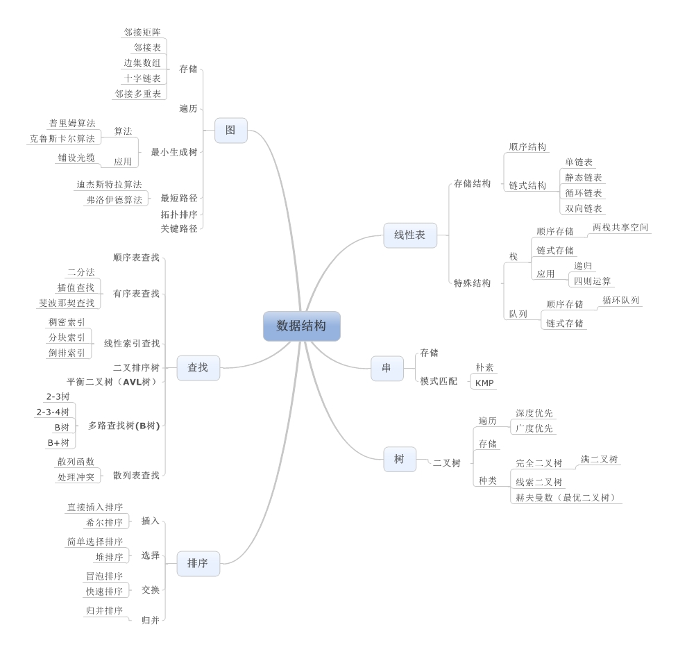
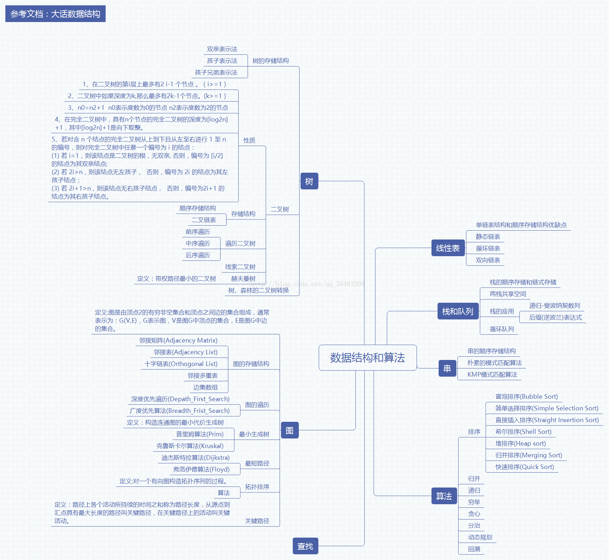
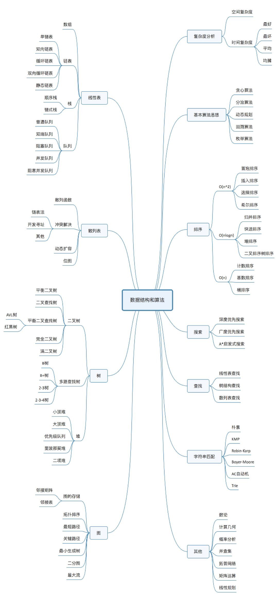

数据结构与算法知识结构思维导图:

数据结构和算法思维导图:

LeetCode 题解: [LeetCode 题解](http://so.csdn.net/so/search/s.do?p=1&q=Leet+Code+OJ&t=blog&u=Lnho2015)

Prim 算法: [浅谈最小生成树的算法思路(一)Prim 算法](http://blog.csdn.net/lnho2015/article/details/50674845)

Kruskal 算法: [浅谈最小生成树的算法思路(二)Kruskal 算法](http://blog.csdn.net/lnho2015/article/details/50676324)

快速排序: [JDK 的快速排序算法实现 DualPivotQuicksort](http://blog.csdn.net/lnho2015/article/details/50669816)