<!-- @import "[TOC]" {cmd="toc" depthFrom=1 depthTo=6 orderedList=false} -->

<!-- code_chunk_output -->

- [1 选个用来举例的主板](#1-选个用来举例的主板)
- [2 供电接口](#2-供电接口)
- [3 CPU 核心供电区域](#3-cpu-核心供电区域)
- [4 开启重启按钮与 DEBUG 数字灯](#4-开启重启按钮与-debug-数字灯)
- [5 内存插槽](#5-内存插槽)
- [6 风扇接口](#6-风扇接口)
- [7 IO 接口](#7-io-接口)
- [8 USB3.1 机箱拓展接口](#8-usb31-机箱拓展接口)
- [9 PCIE 插槽](#9-pcie-插槽)
- [10 主板芯片组合南桥](#10-主板芯片组合南桥)
- [11 声卡](#11-声卡)
- [12 网卡模块](#12-网卡模块)
- [13 CMOS 电池](#13-cmos-电池)
- [14 M.2 接口 M\-KEY](#14-m2-接口-m-key)
- [15 SATA 硬盘接口](#15-sata-硬盘接口)
- [16 前面板跳线](#16-前面板跳线)
- [17 RGB 灯条接口](#17-rgb-灯条接口)
- [参考](#参考)

<!-- /code_chunk_output -->

# 1 选个用来举例的主板

如果想要把目前所有的主板各种附属功能都讲一遍那么我们最好直接找一个功能最多的主板那么这里我找到一个图片素材比较多而且也是非常有特色的主板华硕 Asus ROG Maximus XI Formula(M11F)

图片素材来自: [这可能是最漂亮的 Z390--ASUS ROG Maximus XI Formula 评测](https://link.zhihu.com/?target=http%3A//koolshare.cn/forum.php%3Fmod%3Dviewthread%26tid%3D149669%26page%3D1%26extra%3D)

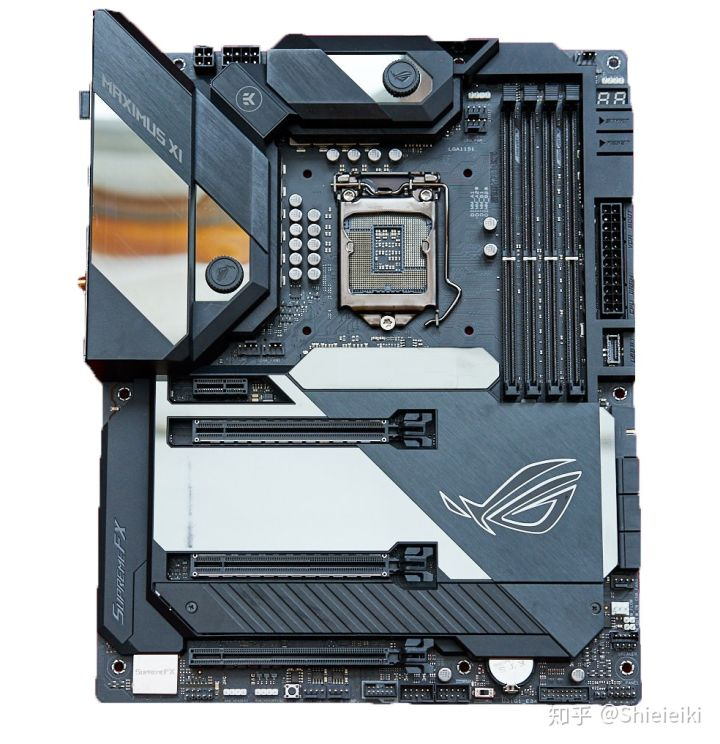

首先看到这个主板的时候大家应该都发现了这主板和普通主板还不一样 M11F 整块主板的绝大多部分都被整齐的装甲覆盖着一方面提高了主板的强度另一方面也提高了主板的美观程度. 而我们不是比谁美的那么我们就扒开装甲看主板了那么这里我们就可以看见主板的整体结构就是下图了.

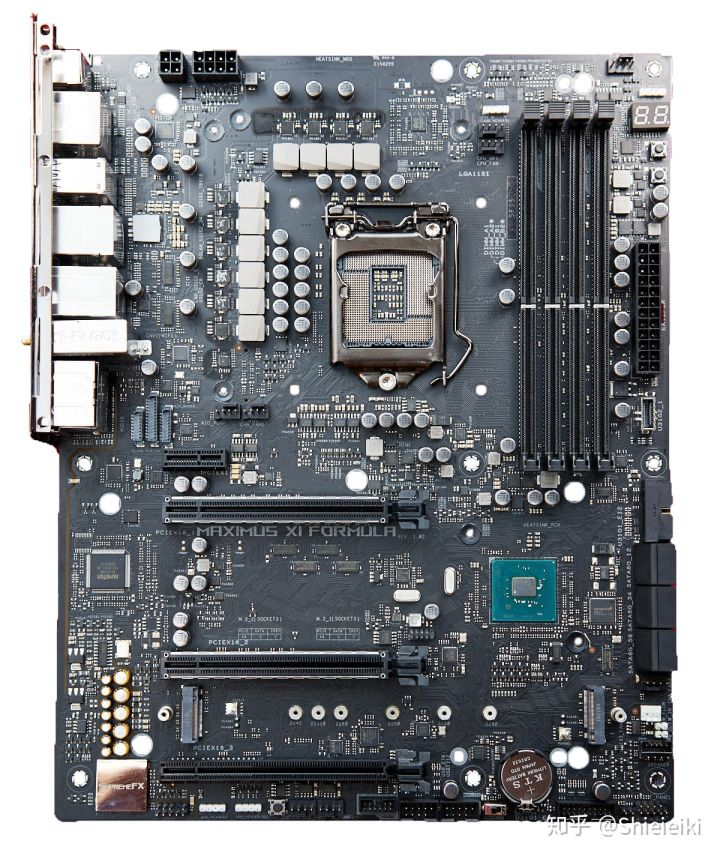

# 2 供电接口

在主板上你可以找到 2 个供电接口一个位于主板的左上角专门为 CPU 提供供电绝大多数主板是 8pin(4+4)这样的 M11F 由于比较高端额外提供了一个 4pin 供电.

另外一个位于主板右侧为整个主板提供供电除了服务器家用主板几乎全是 24pin(20+4) 这种.

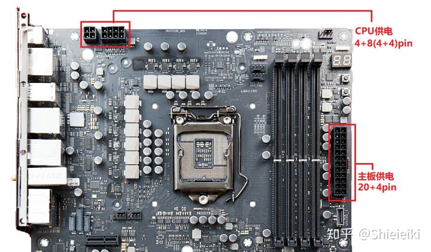

# 3 CPU 核心供电区域

12V 供电从左上角的供电接口接入后会经过各种电容 MOS 管电感最后再进入 CPU 因此判断一个主板的 CPU 供电能力就看这一部分. 供电区域由两部分构成一部分是 MOS 管另一部分是供电电感很多人靠供电电感也就是小方块判断主板供电能力实际上是错误的. 如果你看供电电感那么这个供电就是 10 相了但是实际上他是 4+2 相供电其中 CPU 部分由 2 组 4 相供电提供核显部分由 2 相供电提供. 至于怎么判断主板供电能力我们下篇文章会详细介绍.

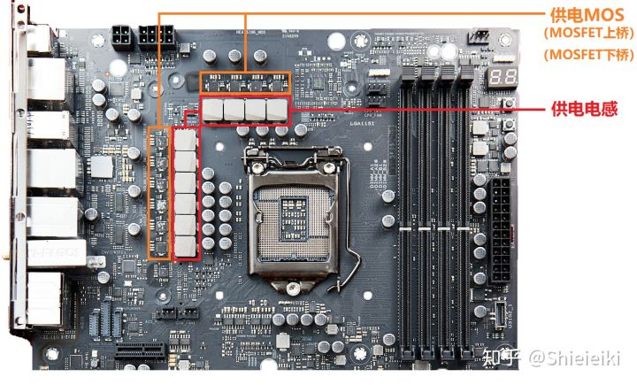

# 4 开启重启按钮与 DEBUG 数字灯

开机重启没什么好说的之所以有这个按钮是因为很多超频爱好者需要反复开机关机调试电脑这时候如果用机箱的按钮就不方便检修和排除故障原因当然螺丝刀也可以用来短接跳线开机不过毕竟没有直接来个按钮舒服是吧.

Debug 灯可以在你的电脑不能正常启动的时候给你 2 个字符的代码比如 00 就是 CPU 故障 55 是内存故障 D2 就是主板错误那么有了这个 Debug 灯再结合错误代码表你就可以很快的定位电脑哪里故障了而不需要一个配件一个配件的更换去排除. 一般这种数显 DeBug 灯只有高端主板才会有.

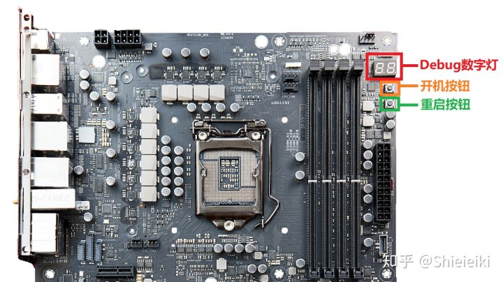

普通主板虽然没有数显 debug 但是有简易的 CPU 内存还有显卡故障灯如果某个部件故障对应的灯就会亮起不过这个毕竟功能不如数显多. 比起低端主板根本就没有故障灯也是要好太多了. 当然你也可以买个主板诊断卡主板诊断卡的功能和 Debug 灯一模一样.

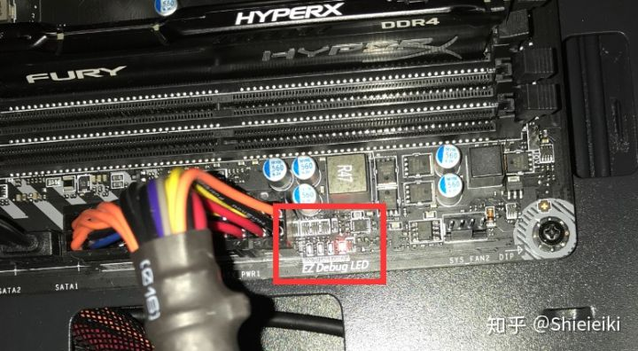

# 5 内存插槽

DIMM 内插插槽这个没什么介绍的但是要注意的是很多主板是有内存插槽优先级的这个在你的主板上能看到标识一般来讲绝大多数主板从左往右数 24 槽是优先使用的.

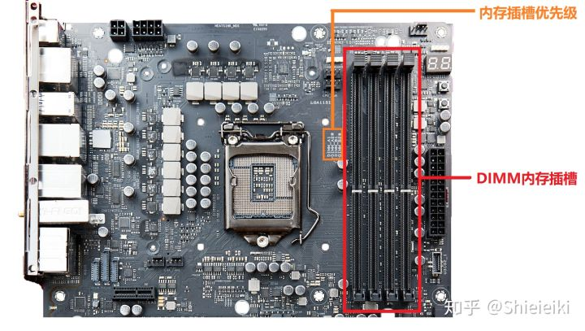

如果你是两条内存切记不能并排插因为 2 条内存可以组建双通道什么是双通道你们可以看这个文章: [Shieieiki: 【双 8G 内存比 16G 内存速度快?详解双通道内存和磁盘阵列】](https://zhuanlan.zhihu.com/p/51371002). 而在主板上 12 槽走的是一个通道 34 槽是一个通道所以如果你插在 12 是单通道插 23 不稳定插 34 也是单通道所以双内存用户请务必插 13 或 24 同时注意主板的内存槽优先级.

内存条 1 槽优先级 44 槽优先级 1, 数字越大等级越高.

# 6 风扇接口

在主板的各个位置你都能找到这样竖起来的 4 针同时你可以发现这 4 针有其中 3 针是有个竖起来的塑料片而风扇的接口上有一个滑槽那么这个滑槽对齐这个塑料片插下去就行了 4 针的风扇和接口是支持 PWM 调速的而 3 针的风扇对齐滑槽也可以插在 4 针的接口上但是无法调速.

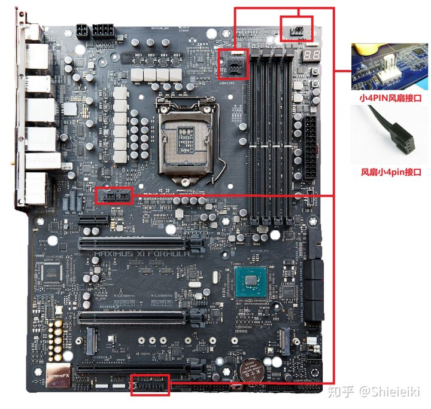

# 7 IO 接口

这部分就是你机箱后面那些 USB 啊视频接口之类的

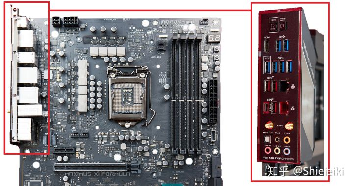

# 8 USB3.1 机箱拓展接口

目前很多新的机箱上有 USB3.1 接口这些接口可不是凭空和你的电脑连接的你需要把机箱 USB3.1 的线接到这里你的机箱上的 USB3.1 就可以用了.

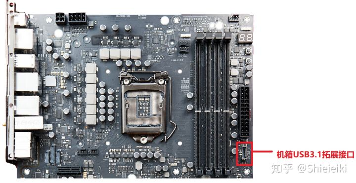

# 9 PCIE 插槽

PCIE 的主要作用就是接驳高带宽需求的配件比如显卡你可以打开你的机箱看看你的显卡是不是就插在这里. 除了显卡之外还可以插其他的设备比如走 pcie 通道的固态硬盘比如 Intel905P 可以插声卡无线网卡你可以从 PCIE 转接出 M.2 装固态硬盘. 总之 PCIE 插槽可以安置的设备很多对于大多数人来说主要用途就是装显卡和 PCIE 插槽的无线网卡.

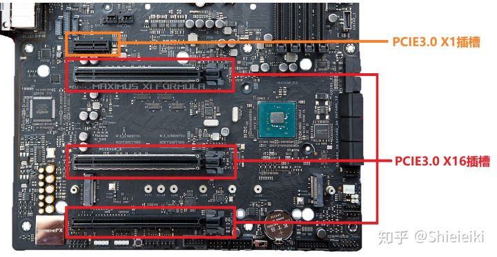

PCIE 插槽一般是以长度区分带宽的最长的是 X16 往下是 X8 X4 X2 X1 你可以把 X16 的设备插到 X1 槽里(尾部非闭合槽)也可以把 X1 的设备插到 X16 槽里都能正常工作只是可能会无法发挥设备的全部性能或者浪费 PCIE 通道了.

这里要注意的是民用平台一般就给 16 条 PCIE 你插一个显卡就直接用掉了 X16 了那么你再插新的显卡就是 X8+X8 了如果你需要玩 SLI 这样的多卡那么你最好考虑 X299 这样的至尊平台. 绝大多数的普通主板 PCIEX1 是走南桥的所以不会和显卡抢 PCIE 通道.

# 10 主板芯片组合南桥

芯片组就是主板的核心我们常说的什么 Z390B360H310 说的就是这个芯片组的型号芯片组的型号直接决定了你这个主板所具有的特性. 由于芯片组本身会发热所以在芯片组上一般会覆盖大块散热金属而很多主板就会同时把自家的 LOGO 用 RGB 灯的形式放在散热片上.

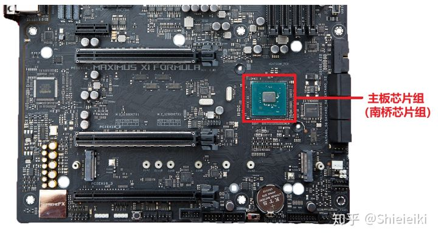

芯片组也叫主板南桥(PCH)南桥芯片主要是负责 I/O 接口等一些外设接口的控制、IDE 设备的控制及附加功能等等他的作用是联系主板上的各个接口比如 USB 硬盘相当于主板的数据中转站用于协调 CPU 与主板接口的联系.

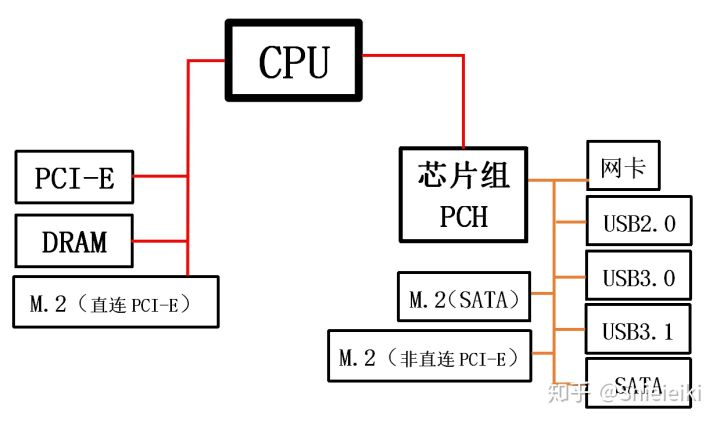

# 11 声卡

目前的所有的家用主板都会集成声卡的所以以后不要再问我要不买声卡这样的话了声卡的主要作用就是把数字信号变成模拟信号输出到音响上.

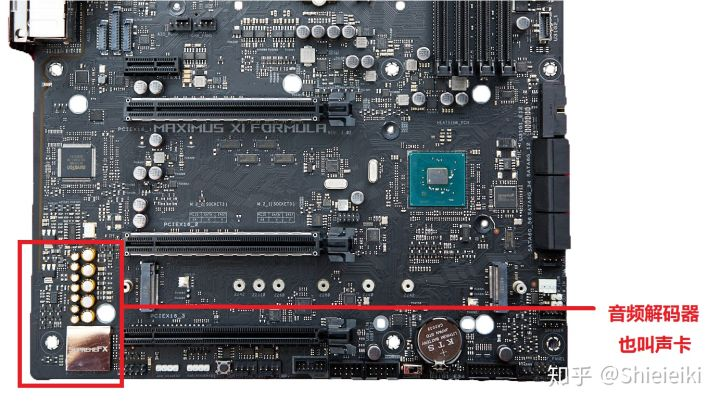

# 12 网卡模块

目前的家用主板都有有线网卡模块所以如果你是走有线网那么直接接上就能用高端主板都自带 wifi 模块如果你的主板没有 wifi 模块那么你自己买个无线网卡就能连无线网了.

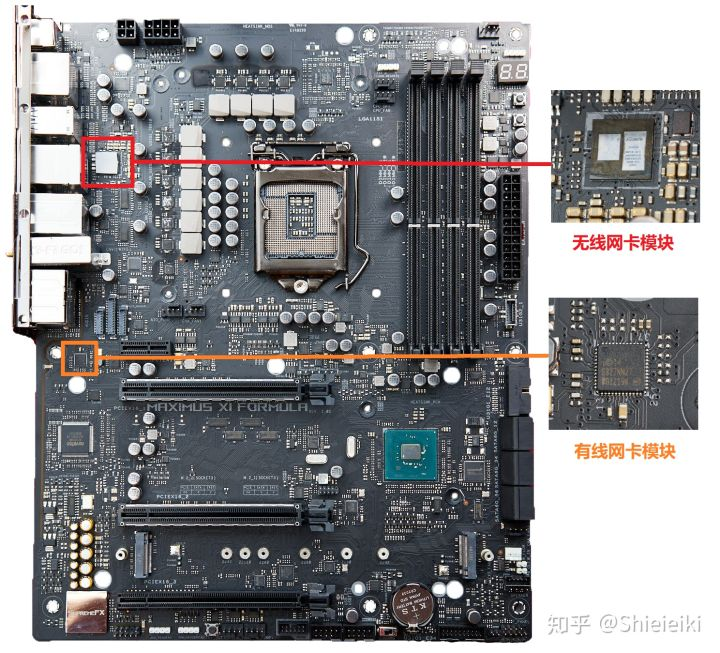

# 13 CMOS 电池

CMOS 电池的作用就是在你的电脑断电关机后储存 BIOS 信息用的 BIOS 的芯片里的数据如果断电就会重置到出厂状态那么有了这个电池就可以在断电后保留 BIOS 设置包括时间等信息同时这个电池还会给时钟计时器供电你可以发现你就算断电了再开机后时间也还是正确的并不会因为停电了电脑时间就暂停了这就是 CMOS 电池的作用. 拔掉电源拆下 CMOS 电池主板 BIOS 就会重置这是最基础的重置 BIOS 的方法.

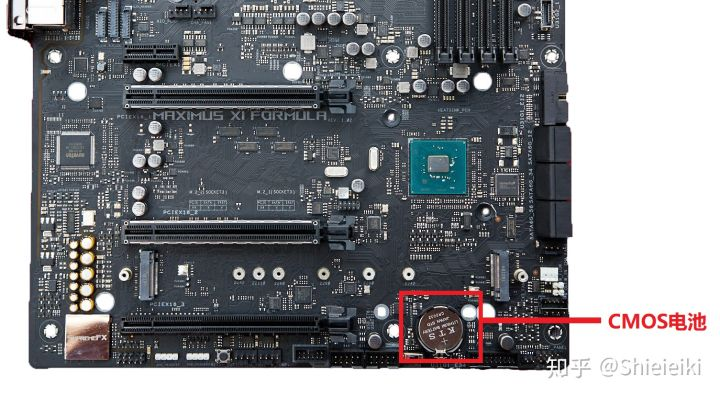

# 14 M.2 接口 M\-KEY

M.2 主要作用就是安装固态硬盘他也可以装 M.2 接口的无线网卡. M.2 接口的形状非常好认如果你想确定你的主板能装几个 M.2 固态只需要看一下主板的图片就知道了 M.2 固态接口分为 B-KEY 和 M-KEY 两种目前的绝大多数主板都是 M-KEY 的都是走 PCIEX4(PCH)通道的. 关于 B-KEY 和 M-KEY 的区别大家可以看这个文章: [Shieieiki: 【如何挑选一块合适的固态硬盘】](https://zhuanlan.zhihu.com/p/36900029)

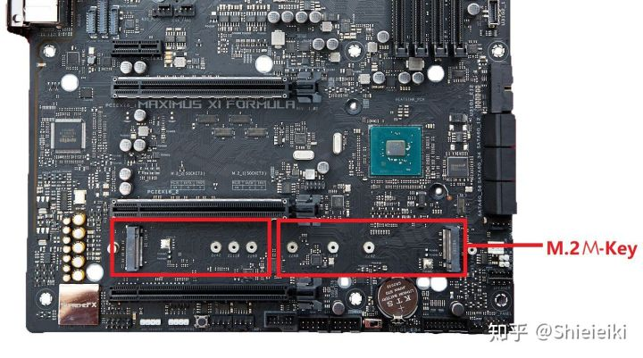

# 15 SATA 硬盘接口

这个接口主要就是接 SATA 接口的机械硬盘或者 SATA 接口的固态硬盘每个 SATA 都有自己的编号注意**有的 SATA 口**会和**M.2 接口冲突**一旦 M.2 上存在设备某个 SATA 就会被屏蔽所以这里如果你碰见机械盘读取不出来看看是不是发生了冲突这时候换个 SATA 接口就行.

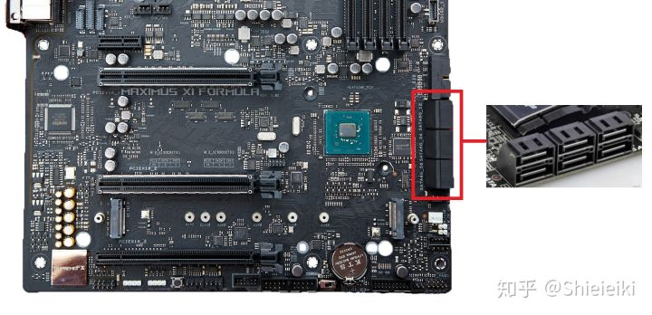

# 16 前面板跳线

在你的机箱前面都有开机按钮或者重启按钮还有各种 USB3.5mm 耳机接口这些接口就是通过线缆和主板链接的就接在下面图示的地方每个主板的位置可能会有细微变化具体还是参考你的说明书为准.

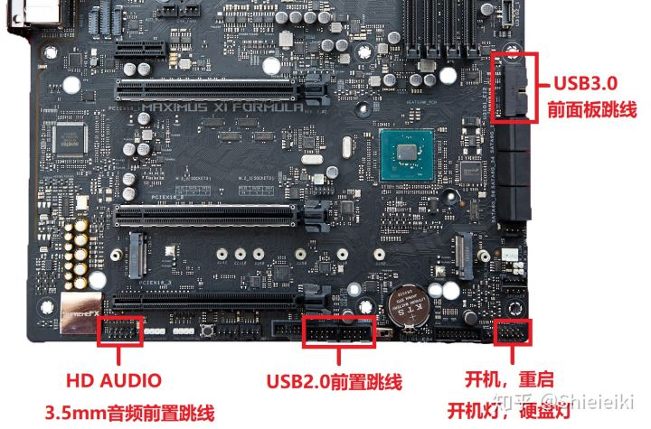

# 17 RGB 灯条接口

现在的机箱都喜欢搞侧透 RGB 而灯光效果是需要控制的 有利用无线遥控的也有控制器手动控制的也有的就是走主板控制的那么如果你希望你的灯条或者风扇灯板等等 RGB 部件能从系统里用软件控制那么你就需要把他们接入到这里但是注意千万别接错了 12V 和 5V 如果接错插口会直接烧掉你的 RGB 设备的.

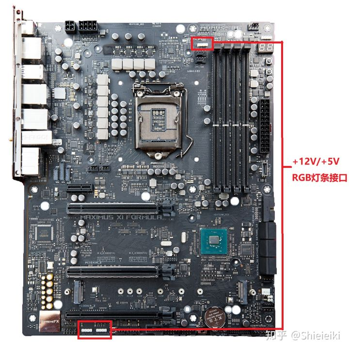

# 参考

- 主板上各种接口和附属部件科普: https://zhuanlan.zhihu.com/p/53379889