<!-- @import "[TOC]" {cmd="toc" depthFrom=1 depthTo=6 orderedList=false} -->

<!-- code_chunk_output -->

- [1 概述](#1-概述)
- [2 主板](#2-主板)
- [3 处理器](#3-处理器)
- [4 内存](#4-内存)
- [5 硬盘驱动器](#5-硬盘驱动器)
- [6 网络连接](#6-网络连接)
- [7 显示](#7-显示)
- [8 电源](#8-电源)
- [9 M.2 接口](#9-m2-接口)
- [10 USB2.0、USB3.0、USB3.1 接口](#10-usb20-usb30-usb31-接口)
- [11 主板芯片](#11-主板芯片)
- [12 PCI\-E 扩展插槽](#12-pci-e-扩展插槽)
- [13 主板电池](#13-主板电池)
- [9 参考](#9-参考)

<!-- /code_chunk_output -->

# 1 概述

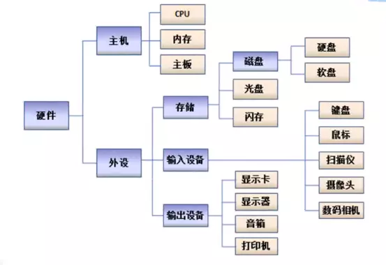

服务器也称伺服器是提供计算服务的设备. 由于服务器需要响应服务请求并进行处理因此一般来说服务器应具备承担服务并且保障服务的能力.

服务器的构成包括**处理器**、**硬盘**、**内存**、**系统总线**等和**通用的计算机架构类似**但是由于需要提供**高可靠的服务**因此在处理能力、稳定性、可靠性、安全性、可扩展性、可管理性等方面要求较高.

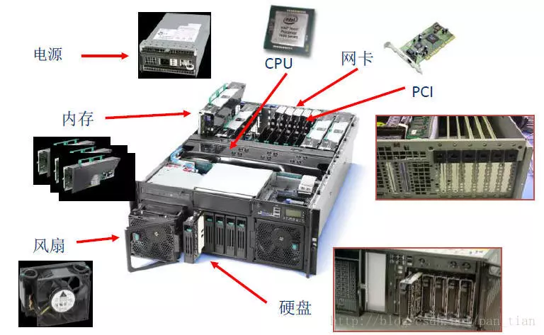

在**网络环境**下根据服务器提供的**服务类型**不同分为**文件服务器**, **数据库服务器**, **应用程序服务器**, **WEB 服务器**等.

# 2 主板

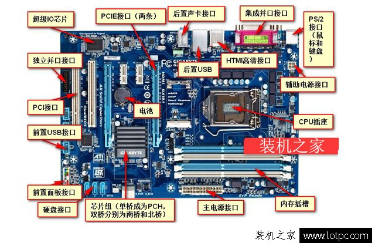

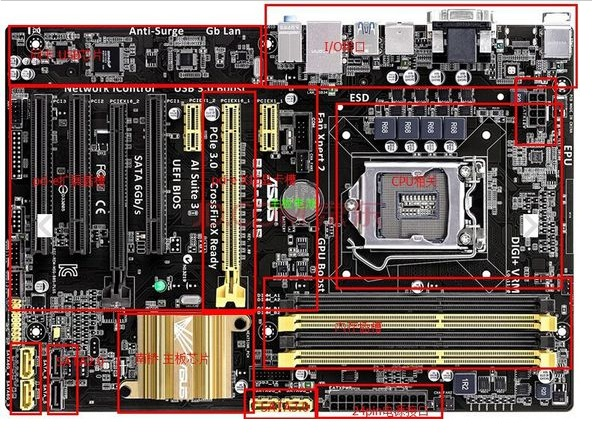

服务器的主板是存储电子电路的电路板. **服务器内**的 **其他所有组件！！！** 都连接到 **主板** 上.

在主板上有几个最主要的服务器部件: **处理器(CPU**)、**芯片组**、**硬盘驱动器控制器**、**扩展插槽**、**内存**和**端口**以支持使用外部设备如键盘.

此外主板可能包含**网络接口**、**磁盘控制器**和**图形适配器**.

华硕、技嘉、微星三大品牌

# 3 处理器

现在主流的处理器有 AMD 和 intel 所以**CPU 插槽的设计**依据的是这两个公司的**CPU**. 主板与处理器要匹配不匹配的主板与 CPU 是不能组装在一起的. **AMD**和**intel**平台的**处理器和主板是不能相互兼容**的此外就算都是**相同平台**有需要注意一下**接口的参数**比如酷睿 i5-7500 是 LGA 1151 接口的那么只能使用基于 LGA 1151 插槽的主板比如 B150、B250 等主板.

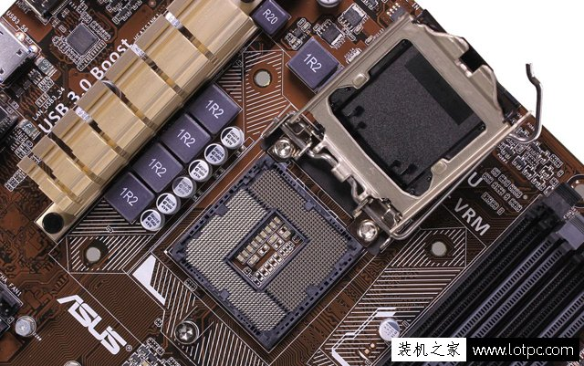

# 4 内存

在**选择内存条插槽**的时候首先要考虑的是内存条是否要组建**双通道**; 其次是**是否要扩充内存**如果考虑**后期扩充内存**那么需要 4 根内存插槽.

此外选择内存的时候也需要考虑**兼容性**, 主板支持 DDR4 内存那么必须是 DDR4 内存 DDR3 内存不能兼容的.

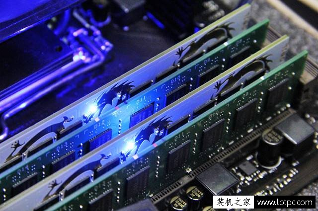

**内存插槽**中间有一个**防呆口**这个防呆口具有保证内存**安装方向正确**和保证**安装正确类型内存**两个作用所以在安装内存时绝对不可以使用蛮力现在有很多主板会提供额外的内存插槽例如**双通道主板**提供**四根内存插槽**一般主板厂商都采用**两根彩色**两根黑色的方式来标识. 如果只准备安装两根内存应该插在彩色插槽上.

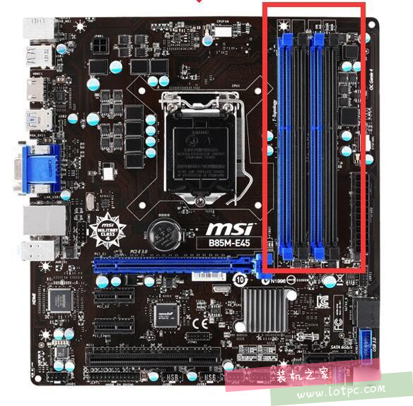

# 5 硬盘驱动器

客户机通常使用 IDE 驱动器. 另一方面服务器通常包含一个 SCSI 驱动器. 要优化服务器最好将驱动器与控制器卡配对. 另外 SATA 驱动器也用于服务器和客户端.

# 6 网络连接

通常服务器将有一个**网络适配器作为主板的一部分**. 如果不是则需要使用**网络适配器卡**.

# 7 显示

一般来说服务器**不需要安装显卡**. 显示器和视频卡不会改变网络的功能.

在台式机组装过程中**只需要一张独立的显卡**即可也就是需要一个**显卡插槽**现在主流的显卡插槽是 PCI\-E.

对于**主板上面**具有**多个显卡插槽**的在组装的时候应该分别对待. 下面这个组装中**三块显卡**整齐排列组成**N 卡 SLI**这是标准的发烧级游戏配置.

下图这张主板是专为发烧友组建多卡平台的选择可搭建多显卡平台主板.

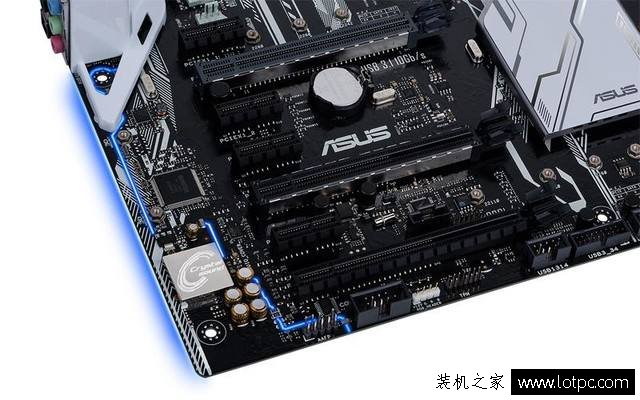

# 8 电源

需要一个足够好的电源特别是如果服务器包含大量的硬盘驱动器. 机房内的电源就必须保持二十四小时不断电供应

# 9 M.2 接口

M.2 接口是现在主流接口如果你需要搭配 M.2 接口的固态硬盘那么买电脑主板的时候需要判断下**主板是否有 M.2 接口**是一个应该注意的细节.

**M.2 接口**被广泛用于**高速固态硬盘**、intel**傲腾内存**. 主要是由于固态硬盘体积小传输速度高达**32Gbps**. 常见的**SATA3.0**接口**SSD**的传输速度是**6Gbps**所以更高速的 SSD 开始采用 M.2 接口.

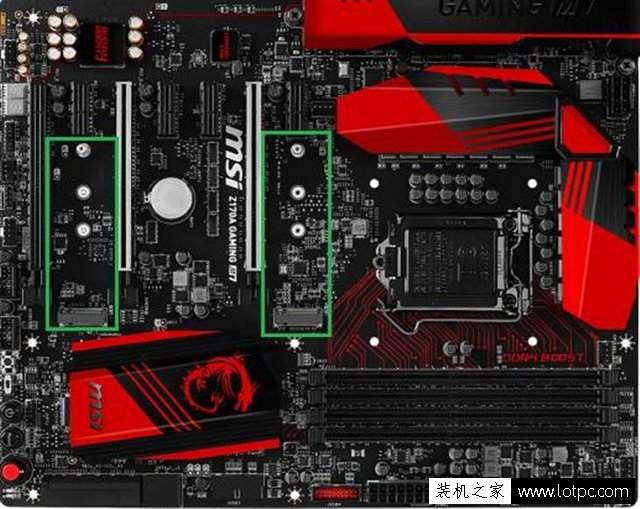

# 10 USB2.0、USB3.0、USB3.1 接口

USB2.0、USB3.0、USB3.1 指的是在主板上面鼠标与键盘的接口主要的区别是速度数字越大代表速度越快.

一般情况下 USB2.0 接口采用的是黑色 USB3.0 是蓝色的而 USB3.1 通常是红色的但是颜色只是一种参考如下图中的主板.

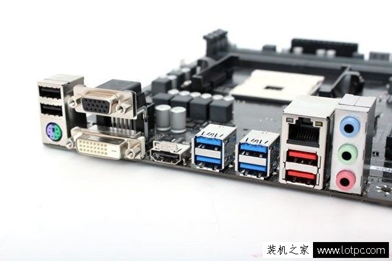

# 11 主板芯片

**芯片组！！！** 是主板最重要的一颗集成芯片他决定了 **主板可以使用什么 CPU！！！**可以具有多少原生接口和扩展能力(主板的扩展桥接芯片也要受到芯片组扩展能力的制约). 图为一颗 Z87 的主板芯片.

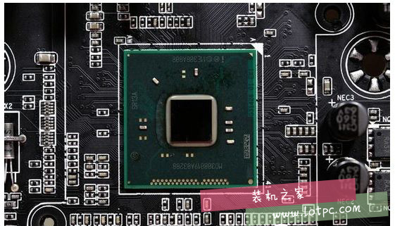

现在除了较为古老的**AM3\+接口的主板**外其他的主板均已经**取消了北桥**芯片组芯片就位于南桥位置. 一般来说 **主板型号！！！** 中都会在前半部分标明主板的**芯片组是什么！！！**.

**华硕 B85-PLUS 主板**(Intel B85/LGA 1150)的意思就是华硕品牌 Intel **B85 芯片组**, 适用于为 Intel 1150 针 CPU.

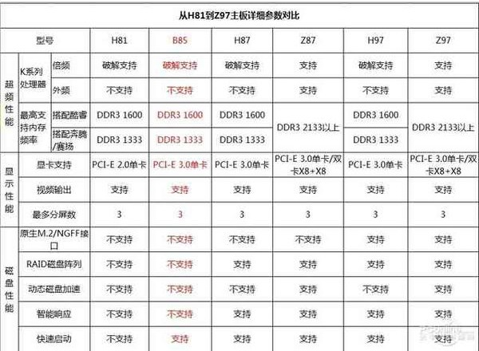

# 12 PCI\-E 扩展插槽

扩展插槽我们用的最多的就是**显卡插槽****一般** 最 **靠近 CPU！！！** 的那条就是 **pci\-e X16 显！！！**. H61/B75/H77/B81/B85/H87 并不支持 NVIDIA SLI/AMD CORSSFIRE 交火技术

# 13 主板电池

主板电池也是主板上一个比较重要的部件他的主要工作就是在**主板断电**后帮助主板的**CMOS**保存里面的设置.

所以当主板出现故障、超频失败、BIOS 设置错误等导致机器点不亮时最快的排障方法就是将 PC 的电源线拔掉拔掉电池三分钟后装回电池重新尝试开机. 这个时候 BIOS 的设置会被彻底清空. 至少有 60%的情况下可以用这个方法解决故障

# 9 参考

