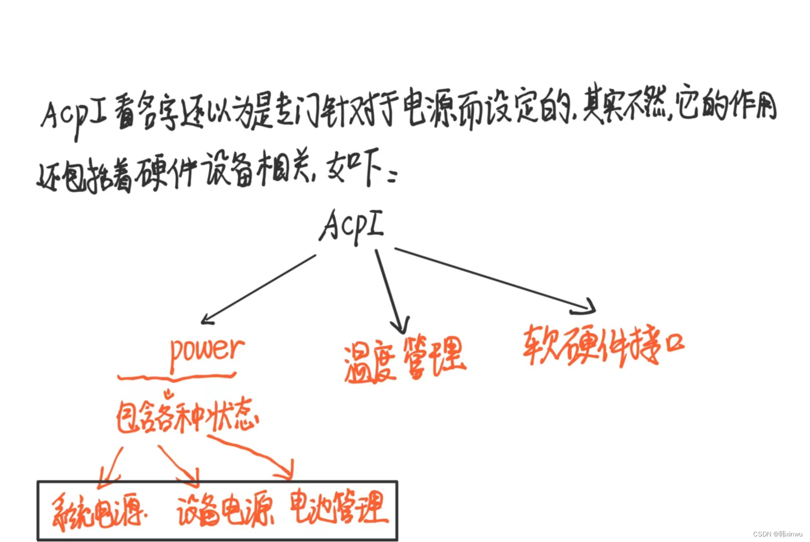
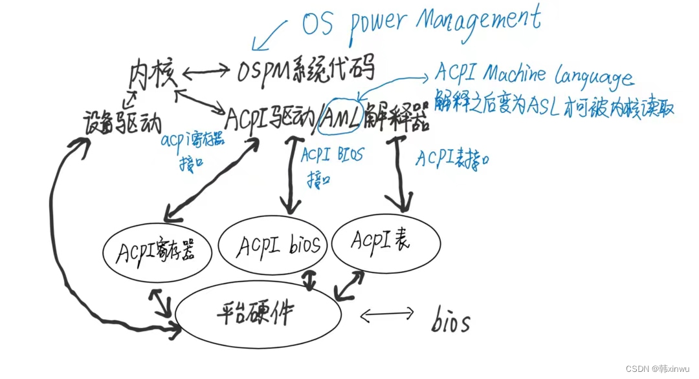
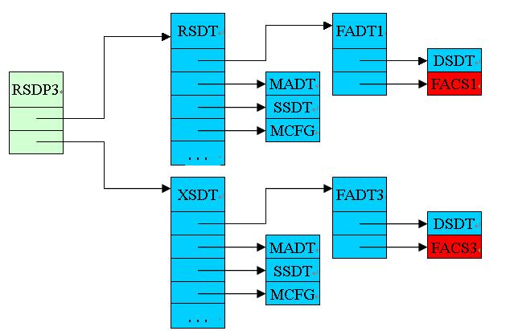
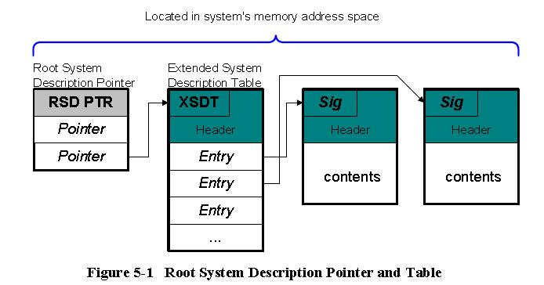
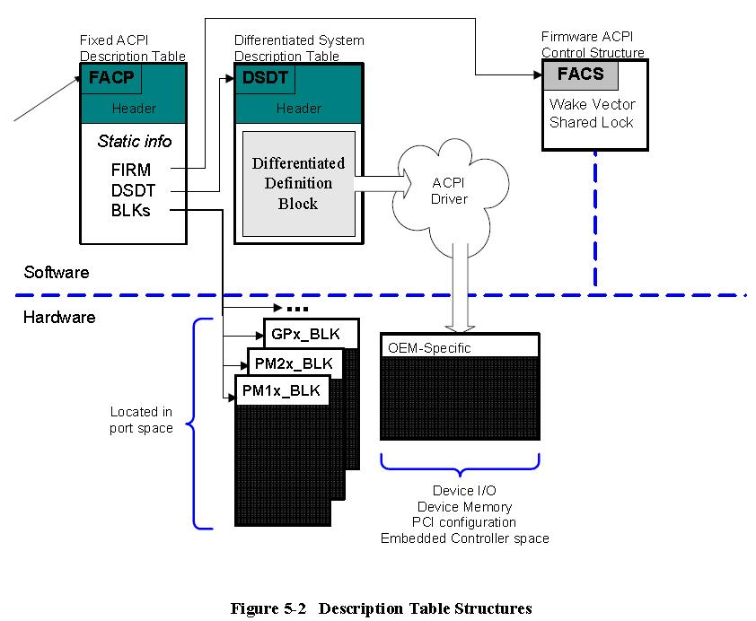
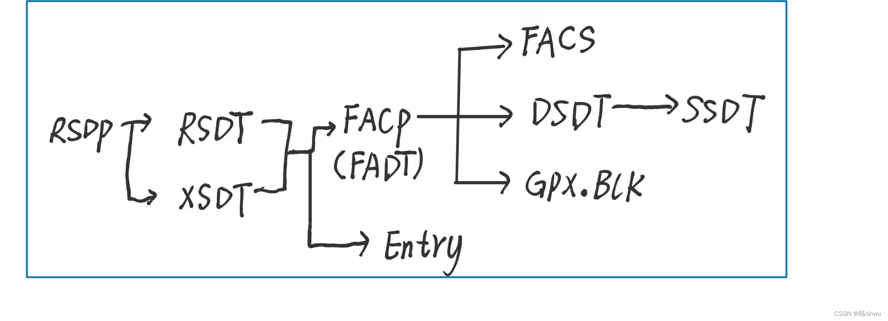
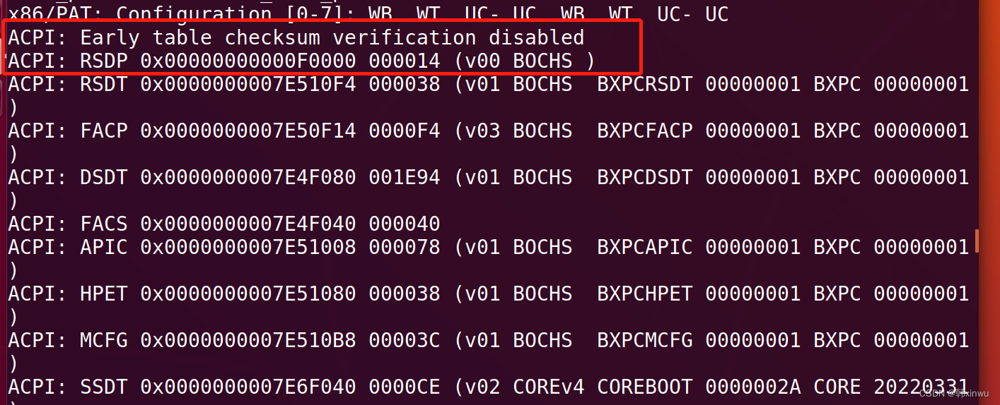

<!-- @import "[TOC]"{cmd="toc"depthFrom=1 depthTo=6 orderedList=false} -->

<!-- code_chunk_output -->

- [1. 概述](#1-概述)
- [2. ACPI 表](#2-acpi-表)
  - [2.1. ACPI 表加载](#21-acpi-表加载)
  - [2.2. RSDP](#22-rsdp)
  - [2.3. RSDT](#23-rsdt)
  - [2.4. XSDT](#24-xsdt)
  - [2.5. FADT](#25-fadt)
  - [2.6. FACS](#26-facs)
  - [2.7. DSDT](#27-dsdt)
  - [2.8. SSDT](#28-ssdt)
  - [2.9. MADT](#29-madt)
  - [2.10. SBST](#210-sbst)
  - [2.11. MCFG](#211-mcfg)
- [3. 小结](#3-小结)

<!-- /code_chunk_output -->

# 1. 概述

**ACPI**(`Advanced Configuration and Power Interface`) SPEC 定义了 `ACPI-compatible OS` 与 `BIOS/UEFI` 之间的接口. **ACPI Tables** 就是在 **系统启动阶段** 由 `BIOS/UEFI` **收集**系统**各方面信息**并创建的, 然后再由 `BIOS/UEFI` 提供给 OS 的硬件配置数据, 包括系统硬件的 **电源管理**, **配置管理** 以及 **硬件设备记录**.



acpi 的规范和结构大概是这样的:



尽管 ACPI 访问了软、硬件并且阐述了它们必须如何工作, 但是 **ACPI** 既不是一个软件规范, 也不是一个硬件规范, 而是一个**由软、硬件元素组成**的**接口规范**.

关于上述这幅图, acpi 规范是这么定义的:

ACPI 包含三个运行组件.

* **ACPI 系统描述表** —— 描述**硬件的接口**. 表的格式限制了在表中可以创建的内容(例如, 一些控制内嵌在固定寄存器块中, 而此表指定了寄存器块所在的地址).

然而, **大多数系统描述表**允许按照任何方式来**创建硬件**并且可以描述**硬件工作时**所需的任意**操作序列**. 包含**定义块**的 **ACPI 表**可以使用**伪代码类型的语句**. **OS** 负责对这些代码进行解释和执行. 也就是说, **OSPM** 包含和使用了一个**解释器**, 它执行采用**伪代码**语言编码并保存**在 ACPI 表中**的程序. 被称为 **AML**(`ACPI Machine Language`).

* **ACPI 寄存器** —— **硬件接口**中**受限制的部分**, 通过 **ACPI 系统描述表**进行描述(至少描述 ACPI 寄存器的**位置**).

* **ACPI 系统固件** —— **此代码启动机器**(与遗留 BIOS 所实现的功能相同)以及实现**睡眠**、**唤醒**和**重启**等操作所需的接口. 与遗留 BIOS 相比, 它很少被调用. ACPI 系统固件也提供了 **ACPI 系统描述表**.

所以 ACPI 系统描述表很重要, 那它有些什么表然后怎么去访问这些表以及表的目录结构是什么样的

# 2. ACPI 表

有哪些表:

* Generic Address Structure (GAS)
* Root System Description Pointer (RSDP)
* System Description Table Header
* Root System Description Table (RSDT)
* Extended System Description Table (XSDT)
* Fixed ACPI Description Table (FADT)
* Firmware ACPI Control Structure (FACS)
* Differentiated System Description Table (DSDT)
* Secondary System Description Table (SSDT)
* Multiple APIC Description Table (MADT)
* GIC CPU Interface (GICC) Structure
* Smart Battery Table (SBST)
* Extended System Description Table (XSDT)
* Embedded Controller Boot Resources Table (ECDT)
* System Locality Information Table (SLIT)
* System Resource Affinity Table (SRAT)
* Corrected Platform Error Polling Table (CPEP)
* Maximum System Characteristics Table (MSCT)
* ACPI RAS Feature Table (RASF)
* Memory Power State Table (MPST)
* Platform Memory Topology Table (PMTT)
* Boot Graphics Resource Table (BGRT)
* Firmware Performance Data Table (FPDT)
* Generic Timer Description Table (GTDT)
* NVDIMM Firmware Interface Table (NFIT)
* Heterogeneous Memory Attribute Table (HMAT)
* Platform Debug Trigger Table (PDTT)
* Processor Properties Topology Table (PPTT)

在最新的 ACPI 规范中, 一共可以看到这么多表, 学习了一下常见的表: RSDP、RSDT、XSDT、FACS、FADT(FACP)、DSDT、SSDT

## 2.1. ACPI 表加载

**BIOS** 在 POST 过程中, 将 **RSDP** 存在 `0xE0000 -- 0xFFFFF` 的内存空间中, 然后 Move RSDT/XSDT, FADT, DSDT 到 ACPI Recleam Area, Move FACS 到 ACPI NVS Area, 最后填好表的 Entry 链接和 Checksum.

控制权交给 OS 之后, 由 OS 来开启 ACPI Mode, 首先在内存中搜寻 ACPI Table, 然后写 ACPI_Enable 到 SMI_CMD, SCI_EN 也会被HW置起来.

ACPI Tables 根据存储的位置, 可以分为:

1) RSDP 位于 F 段, 用于 OSPM 搜索 ACPI Table, RSDP 可以定位其他所有ACPI Table

2) FACS 位于 ACPI NVS 内存, 用于系统进行 S3 保存的恢复指针, 内存为 NV Store

3) 剩下所有 ACPI Table 都位于 ACPI Reclaim 内存, 进入 OS 后, 内存可以释放

ACPI Table 根据版本又分为 1.0B, 2.0, 3.0, 4.0.

2.0 以后, 支持了 64-bit 的地址空间, 因此几个重要的 Table 会不大一样, 比如: RSDP, RSDT, FADT, FACS. 简单的列举一下不同版本的 ACPI Table:

1) ACPI 1.0B: RSDP1, RSDT, FADT1, FACS1, DSDT, MADT, SSDT, HPET, MCFG等

2) ACPI 3.0 : RSDP3, RSDT, XSDT, FADT3, FACS3, DSDT, MADT, HPET, MCFG, SSDT等

以系统支持 ACPI 3.0 为例子, 说明系统中 ACPI table 之间的关系如图:



其中绿色代表在内存F段, 蓝色是 ACPI Reclaim 内存, 红色是 NV store 内存

## 2.2. RSDP

RSDP: Root System Description Pointer

它是一个结构体, 其结构如下:

```cpp
typedef struct {
  UINT64  Signature;
  UINT8   Checksum;
  UINT8   OemId[6];
  UINT8   Revision;
  // rsdt, 32 位
  UINT32  RsdtAddress;
  UINT32  Length;
  // xsdt, 64 位
  UINT64  XsdtAddress;
  UINT8   ExtendedChecksum;
  UINT8   Reserved[3];
} EFI_ACPI_6_1_ROOT_SYSTEM_DESCRIPTION_POINTER;
```

其中提供了 **两个** 主要的**物理地址**, 一个是 **RSDT 表的**, 另一个是 **XSDT 表的**. os 系统怎么找到 acpi 表呢, 就是取决于 **RSDP** 这个指针, 而刚好这个指针可以通过 efi system table 进行调用.

而 OSPM 获得 **RSDP** 的方式:

a. 在 Legacy 系统下, 在 Memory Space `0xE0000---0xFFFFF` 中 Search RSDP的 **signature**: "`RSD PTR`".

b. 在 UEFI 系统下, 在 EFI System Table 里的 EFI Configuration Table 中 Search RSDP 的 GUID.



然后是 **RSDT** 和 **XSDT**.

## 2.3. RSDT

**RSDT** 表全称 `Root System Description Table`, 它存放了许多的指针, **指向其它的描述系统信息的表**. RSDT 的结构如下:

```cpp
typedef struct {
 EFI_ACPI_DESCRIPTION_HEADER Header;
 UINT32                      Entry;
} RSDT_TABLE;
```

它实际上是一个**可变数组**, 后面可以接很多的表项. 而该结构的前面部分又被定义为 `EFI_ACPI_DESCRIPTION_HEADER`:

```cpp
typedef struct {
  // 值是 'RSDT'
  UINT32  Signature;
  UINT32  Length;
  UINT8   Revision;
  UINT8   Checksum;
  UINT8   OemId[6];
  UINT64  OemTableId;
  UINT32  OemRevision;
  UINT32  CreatorId;
  UINT32  CreatorRevision;
} EFI_ACPI_DESCRIPTION_HEADER;
```

## 2.4. XSDT

**XSDT** 表全称 `Extended System Description Table`, 它的作用于 RSDT 一样, 区别在于两者包含的**指针地址**一个是 **32** 位的, 一个是 **64** 位的. 为了兼容ACPI1.0而存在, XSDT取代了RSDT的功能. 如果 XSDT 存在, ACPI-compatible OS **必须使用 XSDT**.

XSDT 中包含的描述表头部物理地址可以大于 32 位, XSDT 表结构如下:

```cpp
typedef struct {
 EFI_ACPI_DESCRIPTION_HEADER Header;
 UINT64                      Entry;
} XSDT_TABLE;
```

## 2.5. FADT

XSDT(RSDT) 指向的**第一张表**都是 **FADT**, Fixed ACPI Description Table.

这个表里面包含了 OS 直接管理的所有 ACPI **硬件相关寄存器**(`ACPI Hardware Register Blocks`), 比如 PM1a_EVT_BLK, PM1b_EVT_BLK, PM1a_CNT_BLK, PM1b_CNT_BLK, PM2_CNT_BLK, PM_TMR_BLK, GPE0_BLK, 和 GPE1_BLK 这些的 base address.

通过 FADT 可以找到 FACS 和 DSDT.



## 2.6. FACS

FACS 是在**可读、可写内存**中的一个数据结构. FACS 包含系统**上次启动**时的**硬件签名**(`hardware signature`)、固件唤醒矢量(`firmware waking vector`)和全局锁(`Global Lock`). BIOS 使用此结构来实现固件和 OS 之间的握手.

* hardware signature: 由 BIOS 搜集, 当系统从 S4 唤醒的时候, OSPM 通过比较当前的和已保存的 hardware signature 是否一致来确定系统能否恢复

* firmware waking vector: 在休眠之前, OSPM 来填写这一项, 在 POST 时, BIOS 来确定这一项是否不为空, 若不为空则通过 jump 到这个 Address 来把控制权交给 OSPM.

FACS 通过 **FADT** 传递给 **ACPI 兼容 OS**;

## 2.7. DSDT

而 **DSDT**(`Differentiated System Description Table`), 该表包含大量的**硬件信息**, 包含了**整个系统的实现**和**配置信息**. **OS** 在**系统启动**的过程中将 DSDT 的 information 插入到 **ACPI Namespace**, 而且从来**不会被移除**.

## 2.8. SSDT

**SSDT** 是 DSDT 的附加部分, 二级表可以不断增加, 可以有多个 SSDT 存在. OSPM 在 Load DSDT 时创建出 ACPI Namespace 之后, 会去逐个 Load SSDT. 注意: 附加的 tables 只能 add data, 而不能 override data.

## 2.9. MADT

`Multiple APIC Description Table`

描述 OS 支持 APIC/SAPIC 所必须的 information, 比如 IO-APIC address/Local-APIC address 等等.

## 2.10. SBST

`Smart Battery Table`

如果系统支持符合Smart Battery Specification V1.0 1.1的电池, 则SBST就会存在. 主要用来指明:

* Warning Energy Level: Warning时的Energy Level

* Low Energy Level: OSPM 即将进入Sleep状态时的Energy Level

* Critical Energy Level: OSPM 将要执行紧急关机时的Energy Level

## 2.11. MCFG

`PCI-Memory Mapped Configuration table and sub-table`

PCI Express memory mapped configuration space base address Description Table

# 3. 小结

最后, 一个较为完整的 OS 访问 acpi 的图如下:



在虚拟机里面进一步得到了确认.

查看系统 log




