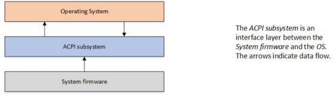
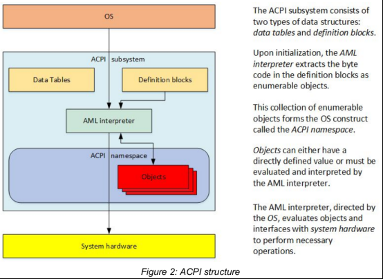
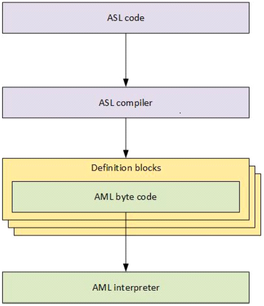
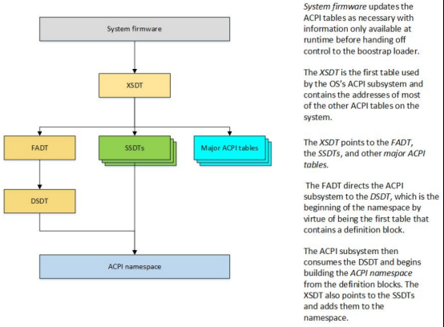
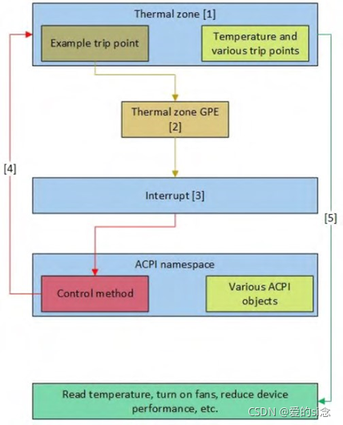

<!-- @import "[TOC]" {cmd="toc" depthFrom=1 depthTo=6 orderedList=false} -->

<!-- code_chunk_output -->

- [1. ACPI 历史](#1-acpi-历史)
- [2. 什么是 ACPI?](#2-什么是-acpi)
  - [2.1. 子系统](#21-子系统)
  - [2.2. 主要作用](#22-主要作用)
  - [2.3. 两种数据结构](#23-两种数据结构)
  - [2.4. ACPI 框架](#24-acpi-框架)
  - [2.5. ASL 和 AML](#25-asl-和-aml)
  - [2.6. AML 解释器](#26-aml-解释器)
  - [2.7. 命名空间和对象](#27-命名空间和对象)
  - [2.8. 运行时模型](#28-运行时模型)
- [3. ACPI 初始化](#3-acpi-初始化)
- [4. 运行时模型](#4-运行时模型)
- [5. 热事件的例子](#5-热事件的例子)
- [6. 总结](#6-总结)
- [7. reference](#7-reference)

<!-- /code_chunk_output -->

本章提供了高级配置和电源接口 ACPI (Advanced Configuration and Power Interface)的概述. 为了更容易理解 ACPI 本节重点讨论关于 ACPI 的广泛和一般的陈述而不是讨论每个可能的异常或关于 ACPI 的细节. ACPI 规范的其余部分提供了关于 ACPI 内部工作的更多细节建议使用 ACPI 的开发人员阅读.

# 1. ACPI 历史

ACPI 的历史 ACPI 是在 20 世纪 90 年代中期由 `Intel`, `Microsoft*` `Toshiba*` `HP*` 和 `Phoenix*` 合作开发的.

在**开发 ACPI 之前**操作系统主要使用 **BIOS** (`Basic Input/Output System`)**接口**进行**电源管理**、**设备发现**和**设备配置**.

**电源管理**的方法是利用**操作系统**调用系统 **BIOS** 的**能力**来进行电源管理.

**BIOS** 还用于根据**探测输入/输出**(`I/O`)来**发现系统设备**和**加载驱动程序**并尝试将**正确的驱动程序**匹配到**正确的设备**(即插即用).

**设备的位置**也可以在 **BIOS** 中**硬编码**, 因为平台本身是不可枚举的.

这些解决方案在三个关键方面存在问题.

* 首先, **操作系统应用程序**的行为可能会受到 **bios 配置**的电源管理设置的**负面影响**, 导致**系统**在演示期间或其他**不方便的时间**进入**睡眠**状态.

* 第二, **电源管理接口**是**每个系统**的**专有接口**. 这要求开发人员了解如何为每个单独的系统配置电源管理.

* 最后, 各种**设备的默认设置**也可能**相互冲突**导致**设备崩溃**、**行为不稳定**或变得**无法发现**.

ACPI 的开发就是为了解决这些问题和其他问题.

# 2. 什么是 ACPI?

## 2.1. 子系统

ACPI 首先可以理解为一个**独立于体系结构**的**电源管理和配置框架**, 它会在**主机 OS**中形成一个**子系统**.

该框架建立**一个硬件寄存器集**来定义**电源状态**(休眠、hibernate、唤醒等). 硬件寄存器集可以容纳**专用硬件**和**通用硬件**上的**操作**.

## 2.2. 主要作用

**标准 ACPI 框架**和**硬件寄存器集**的主要目的是启用**电源管理**和**系统配置**, 而**不需要**操作系统来**直接调用固件**.

ACPI 作为**系统固件**(`BIOS`)和**操作系统**(OS)之间的**接口层**, 如图 1 和图 2 所示, 有一定的限制和规则.

Figure 1: ACPI overview

## 2.3. 两种数据结构

从根本上说 ACPI 定义了**两种数据结构**, 这两种数据结构通过**ACPI 子系统**在**系统固件**和**操作系统**之间进行共享: **数据表**(`Data tables`)和**定义块**(`Definition blocks`).

这些数据结构是固件和操作系统之间的**主要通信机制**.

* **数据表**(`Data tables`): 存储**原始数据**, 它们被**设备驱动程序使用**;

* **定义块**(`Definition blocks`): 由**字节代码**(`byte code`)组成, 被**解释器**(`interpreter`)执行.

## 2.4. ACPI 框架

Figure 2: ACPI structure

**初始化**时, **AML 解释器**将**定义块**中的**字节代码**提取为**可枚举对象**.

* 这个**可枚举对象集合**形成了一个称为 **ACPI 名称空间**的操作系统结构.

* **ACPI 名称空间**中的**对象**可以是一个**直接定义的值**, 也可以**由 AML 解释器进行解析计算**.

* **AML 解释器**, 是由操作系统指导(direct), 会**对对象进行评估**, 然后与系统硬件进行接口以**执行必要的操作**.

## 2.5. ASL 和 AML

这个**定义块中的字节代码**是从 **ACPI 源语言**(`ASL`)代码编译而来的. ASL 是用来**定义 ACPI 对象**和**编写控制方法**的语言. **ASL 编译器**将 ASL 翻译成 **ACPI 机器语言**(`AML`)**字节码**. AML 是 ACPI AML 解释器处理的语言, 如图 3 所示.

Figure 3: ASL and AML

1. `ACPI Source Language` (ASL)代码用于定义对象和控制方法.

2. 然后 **ASL 编译器**将 `ASL` 转换为包含在 ACPI **定义块中**的 **ACPI 机器语言**(`ACPI Machine Language`, `AML`)**字节码**.

3. **定义块**由**标识表头**(`identifying table header`)和**字节码**(`byte code`)组成, **AML 解释器**(`AML interpreter`)执行**字节码**.

## 2.6. AML 解释器

**AML 解释器**执行字节码并计算**定义块**中的**对象**以允许**字节码**执行**循环构造**、**条件计算**、**访问已定义的地址空间**以及应用程序所需的**其他操作**.

AML 解释器对**已定义的地址空间**具有读/写访问权, 地址空间包括**系统内存**、**I/O**、**PCI 配置**等等. 它通过被称为**对象**的**入口点**来**访问**这些地址空间. 对象既可以是具有**直接定义的值**, 也可以由 AML 解释器进行计算和解释.

## 2.7. 命名空间和对象

这个**可枚举对象集合**是一个 OS 结构称为 **ACPI 命名空间**. 命名空间是**系统中 ACPI 设备的层次表示**.

**系统总线**是这些 **ACPI 设备枚举的根**. 在**其他总线上可枚举的设备**(如 PCI 或 USB 设备)通常**不在命名空间中枚举**. 相反它们**有自己的总线来枚举设备**并**加载驱动程序**.

然而, **所有可枚举的总线**都有一种**编码技术**, 从而允许 **ACPI** 对**设备**的**总线特定地址**进行编码**这样就可以**在 ACPI 中找到它们(这些设备), 尽管 **ACPI 通常不为这些设备加载驱动程序**.

通常,

* 具有 `_HID` 标识的对象(**硬件标识对象**)的**设备**会**被 ACPI 枚举**, 并**由 ACPI 加载其驱动程序**.

* 具有 `_ADR` 标识的对象(**物理地址对象**)的**设备**通常**不由 ACPI 枚举**通常, 也**不由 ACPI 加载驱动程序**.

`_ADR` 设备通常可以在**不涉及 ACPI** 的情况下**执行所有必要的功能**. 但是在**设备驱动程序不能执行某个功能**的情况下或者如果驱动程序需要与系统固件通信,  **ACPI 可以评估对象来执行所需的功能**.

一个例子, **PCI 不支持原生热插拔**. 然而, **PCI 可以使用 ACPI**来评估对象和定义方法, 这些方法允许 **ACPI 填充在 PCI 上执行热插拔所需的函数**.

## 2.8. 运行时模型

ACPI 的另一个方面是**运行时模型**, 它处理在**系统运行期间发生的任何 ACPI 中断事件**. ACPI 将继续评估处理这些事件所需的对象. 这个基于中断的运行时模型将在下面的运行时模型一节中进行更详细的讨论.

# 3. ACPI 初始化

**了解 ACPI 工作原理的最佳方法是按时间顺序排列**.

当用户**启动系统**时**系统固件**就完成了**设置、初始化和自我测试**.

然后在将控制传递给**引导加载程序**之前**系统固件**使用在固件初始化期间获得的**信息**根据需要使用各种平台配置和电源接口数据**更新 ACPI 表**. **扩展的根系统描述表**(`XSDT`)是 ACPI 子系统使用的第一个表它包含系统上**大多数其他 ACPI 表的地址**. XSDT 指向**固定的 ACPI 描述表**(`FADT`)以及**操作系统在初始化期间**处理的**其他主要表**. 在**操作系统初始化之后**, `FADT`将 ACPI 子系统定向到**差分系统描述表**(`DSDT`). DSDT 是名称空间的开始因为它是**包含定义块的第一个表**.

然后 **ACPI 子系统**处理 DSDT 并开始从 **ACPI 定义块**构建**名称空间**. XSDT 还指向**辅助系统描述表**(`SSDTs`)并将它们添加到名称空间.

**ACPI 表**向操作系统提供**关于系统硬件的原始数据**.

当**操作系统**从 **ACPI 表**构建了**名称空间**后它开始**遍历命名空间**并为它在命名空间中遇到的所有 `_HID` 设备**加载设备驱动程序**.

Figure 4: ACPI initialization

在上面的 ACPI 初始化图中在将控制权移交给引导加载程序之前, **系统固件**根据需要**使用仅在运行时可用的信息**更新 ACPI 表. XSDT 是操作系统的 ACPI 子系统使用的第一个表它包含系统上大多数其他 ACPI 表的地址. XSDT 指向 FADT、ssdt 和其他主要 ACPI 表. FADT 将 ACPI 子系统定向到 DSDT, DSDT 是名称空间的开始因为 DSDT 是包含定义块的第一个表. ACPI 子系统然后使用 DSDT 并开始从定义块构建 ACPI 名称空间. XSDT 还指向 ssdt 并将它们添加到名称空间.

# 4. 运行时模型

在**系统启动并运行之后****ACPI**与**操作系统**一起处理**通过中断发生的任何 ACPI 事件**. 此中断以两种一般方式之一调用 ACPI 事件: **固定事件**和**通用目的事件(GPEs)**.

固定事件是在 ACPI 规范中**具有预定义含义的 ACPI 事件**. 这些固定事件包括按下电源按钮或 ACPI 计时器溢出等操作. 这些事件由**操作系统处理程序**直接处理.

GPEs 是 **ACPI 规范没有预定义的 ACPI 事件**. 这些事件通常通过评估控制方法来处理这些方法是名称空间中的对象可以访问系统硬件. 当 ACPI 子系统使用**AML 解释器**评估控制方法时 GPE 对象根据操作系统的实现来处理事件. 通常这可能涉及向设备发出通知以**调用设备驱动程序**来执行某个函数.

下一节讨论运行时模型的一个例子

# 5. 热事件的例子

ACPI 包含一个热模型允许系统主动控制系统温度(通过执行打开风扇等操作)或通过减少系统使用的电量(通过执行控制处理器等操作)被动控制系统温度. 我们可以使用图 5 所示的通用热事件示例来演示 ACPI 运行时模型是如何工作的.

ACPI 热区包括读取当前系统温度和跳闸点的控制方法.

当操作系统最初在名称空间中找到一个热区域时它加载热区域驱动程序该驱动程序评估热区域以获得当前温度和跳点.

当系统组件的温度升高到足以触发跳闸点时就会出现一个热区 GPE.

GPE 导致中断. 当 ACPI 子系统接收到中断时它首先检查是否发生了任何固定的事件. 在本例中热区事件是一个 GPE 因此没有固定的事件发生.

ACPI 子系统然后在命名空间中搜索与中断的 GPE 号匹配的控制方法. 一旦找到它 ACPI 子系统就会评估控制方法然后可能访问硬件和/或通知热区处理程序.

操作系统的热区域处理程序然后采取任何必要的操作来处理事件包括可能的访问硬件.

ACPI 是一个非常健壮的接口实现. 热区跳点可以根据需要通知系统开启风扇、降低设备性能、读取温度、关闭系统或这些操作和其他操作的任何组合.

在整个系统中使用此运行时模型来管理在系统操作期间发生的所有 ACPI 事件.

# 6. 总结

ACPI 可以被描述为概念和接口的框架这些概念和接口被实现来形成主机操作系统中的子系统. ACPI 表、处理程序、解释器、名称空间、事件和中断模型共同构成 ACPI 的这个实现在主机操作系统中创建 ACPI 子系统. 从这个意义上说 ACPI 是系统硬件/固件与操作系统和操作系统应用程序之间的接口用于配置和电源管理. 这为各种操作系统提供了通过 ACPI 名称空间支持电源管理和配置的标准化方法.

ACPI 名称空间是系统上所有 ACPI 设备的可枚举的层次表示用于查找和加载系统上 ACPI 设备的驱动程序. 通过评估对象和实时发送中断命名空间可以是动态的所有这些都不需要操作系统调用本机系统固件代码. 这使得设备制造商能够将他们自己的指令和事件编码到设备中. 它还通过实现标准化的电源管理接口减少了不兼容性和不稳定性.

# 7. reference

https://uefi.org/specs/ACPI/6.4/Frontmatter/Overview/Overview.html