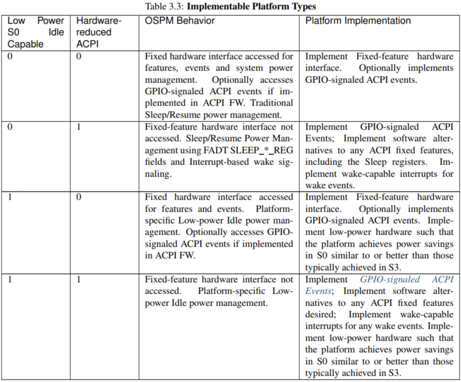

ACPI 定义了机制和模型来适应偏离传统 PC 的平台体系结构. ACPI 提供了对平台技术的支持, 支持更低功耗, 更低成本, 更灵活的设计和更多样化的设备. 这种支持将在下面的章节中进行描述, 并在后面的章节中进行详细说明.

# Hardware-reduced ACPI

ACPI 提供了一个替代的平台接口模型, 它消除了不实现 PC 架构的平台的 ACPI 硬件需求. 在 hardware-reduced ACPI 模型中, 去掉了第 4 章的 Fixed 硬件接口要求, 改用 Generic 硬件接口. 这提供了创新和区分低功耗硬件设计所需的灵活性, 同时支持多个操作系统.

硬件减少 ACPI 有以下要求:

* uefi 固件启动接口(不支持 Legacy BIOS)

* 仅在 ACPI 模式下启动(不支持 ACPI Enable, ACPI Disable, SMI_CMD 和 Legacy 模式)

* OSPM 不能与其他异步运行环境 (如 UEFIRuntime 服务, 系统管理模式) 共享硬件资源.(不支持全局锁)

* 不依赖操作系统的支持来维持跨处理器休眠状态的缓存一致性(不支持总线主加载和仲裁禁用)

* 不支持 gpe 块设备

不满足上述要求的系统必须实现 ACPI 固定硬件 (ACPI Fixed Hardware) 接口.

## 基于中断的唤醒事件

> Interrupt-based Wake Events

在 HW-reduced ACPI 平台上, 唤醒是连接中断的一个属性. 为唤醒处理器或整个平台而设计的中断被定义为具有唤醒能力. 具有唤醒能力的中断, 在 OSPM 使能的情况下, 当它们断言时唤醒系统.

# 低功耗 idle

> Low-Power Idle

平台架构可能支持硬件电源管理模型, 而不是传统的 ACPI Sleep/Resume 模型. 这些通常是在专有硬件中实现的, 能够提供低延迟, 连接空闲, 同时节省与 ACPI Sleep 状态一样多的能源. 为了支持硬件实现的多样性, ACPI 为平台提供了一种机制, 以向 OSPM 表明这种功能是可用的.

## 低功耗 S0 空闲 Capable 标志位

> Low Power S0 Idle Capable Flag

FADT 中的这个标志告诉 OSPM 一个平台是否具有高级的空闲电源能力, 例如 S0 空闲能实现类似或优于 S3 的节省. 通过这个标志, OSPM 可以使系统保持在 S0 空闲状态, 以实现低延迟响应和连通性, 而不是将系统过渡到无响应和连通性的休眠状态.

该标志支持多种平台实现: 传统的 Sleep/Resume 系统, 具有高级空闲电源的系统, 两者都不支持的系统, 以及可以同时支持两者的系统, 这取决于安装的操作系统的能力.

# 连接资源

通用 I/O (GPIO)和简单外围总线 (SPB) 控制器是硅解决方案中提供的硬件资源, 以实现广泛的系统设计的灵活配置. 这些控制器可以为系统中的任意设备提供输入, 输出, 中断和串行通信连接. 其中一个连接的功能取决于所涉及的具体设备和平台设计的需要. 为了支持这些平台技术, ACPI 为灵活连接定义了一个通用抽象.

为了保持与现有软件模型的兼容性, ACPI 将这些连接抽象为硬件资源.

连接资源抽象反映了 GPIO 和 SPB 控制器的硬件功能. 与其他资源一样, 这些连接在使用之前要进行分配和配置. 利用平台所描述的资源, OSPM 从设备驱动程序抽象出底层配置. 因此, 驱动程序可以只针对设备的功能编写, 并在该功能硬件上重用, 而不管它是如何集成到给定系统中的.

连接资源抽象的关键方面是:

* gpio 和 SPB 控制器被枚举为 ACPI 命名空间中的设备.

* 定义 gpio Connection 和 SPB Connection 资源类型.

* 连接到 GPIO 或 SPB 控制器的命名空间设备使用资源模板宏添加连接资源到它们的资源方法(_CRS, _SRS 等).

* gpio 连接资源可以被平台指定为使用 gpio 信号的 ACPI 事件.

* 连接资源可以被 AML 方法用于通过 GPIO 和 spb 操作区域访问引脚和外围设备.

# 支持的平台

HW-reduced ACPI 和低功耗 S0 Idle Capable 标志组合起来表示可以实现的 4 种平台类型. 下表列举了这些, 以及预期的 OSPM 行为和特定的平台需求.

Low Power S0 Idle Capable | Hardware-reduced ACPI | OSPM Behavior | Platform Implementation
---------|----------|---------|---------
 0 | 0 | 固定硬件接口访问功能, 事件和系统电源管理. 如果在 ACPI FW 中实现, 可选访问 gpio 信号的 ACPI 事件. 传统的睡眠 / 恢复电源管理. | 实现固定特征硬件接口. 可选地实现 gpio 信号的 ACPI 事件.
 0 | 1 | 固定功能硬件接口未被访问. 使用 FADT SLEEP_*_REG 字段和基于中断的唤醒信令的睡眠 / 恢复电源管理. | 实现 gpio 信号的 ACPI 事件; 实现任何 ACPI 固定功能的软件替代方案, 包括 Sleep 寄存器. 为唤醒事件实现具有唤醒能力的中断.
 1 | 0 | 固定硬件接口可访问功能和事件. 平台特定的低功耗空闲电源管理. 如果在 ACPI FW 中实现, 可选择访问 GPIO 信号 ACPI 事件 | 实现 gpio 信号的 ACPI 事件; 实现任何 ACPI 固定功能的软件替代方案, 包括 Sleep 寄存器. 为唤醒事件实现具有唤醒能力的中断.
 1 | 1 | **固定功能硬件接口**不可访问. 平台特定的低功耗空闲电源管理.  | 实现 gpio 信号的 ACPI 事件; 实现任何 ACPI 固定功能的软件替代方案, 包括 Sleep 寄存器. 为唤醒事件实现具有唤醒能力的中断.