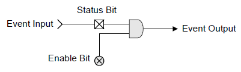
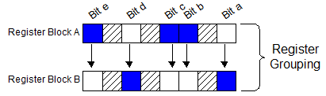
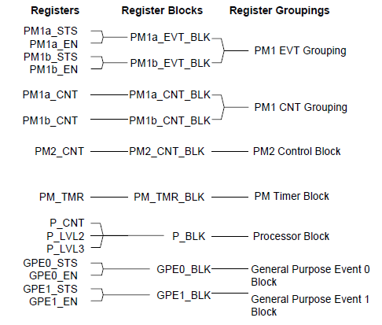
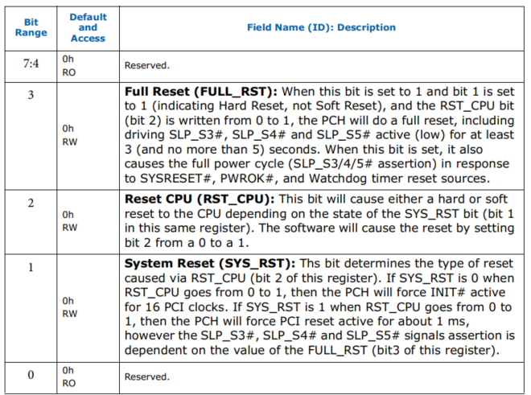
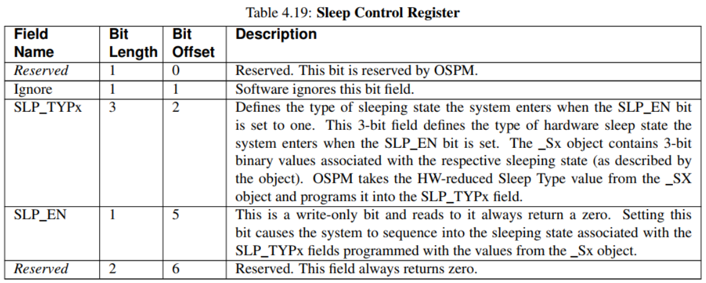
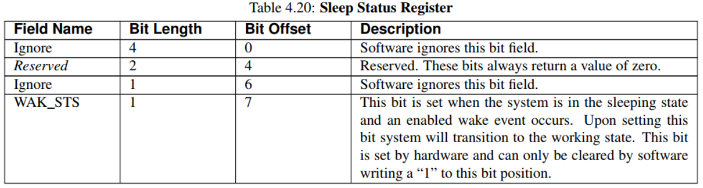

ACPI 硬件驻留在以下**六个地址空间**中的一个:

* `System I/O`, 系统 I/O
* System Memory, 系统内存
* PCI configuration, PCI 配置
* SMBus
* Embedded controller, 嵌入式控制器
* Functional Fixed Hardware, 固定功能硬件

不同的实现将导致不同的地址空间用于不同的功能. ACPI 规范由**固定硬件寄存器**(`fixed hardware registers`)和**通用硬件寄存器**(`generic hardware registers`)组成.

* **固定硬件寄存器**用来实现 ACPI 定义的接口;

* **增值硬件**(value-added)生成的任何事件都需要**通用硬件寄存器**.

ACPI 定义了**寄存器块**. 一个使用 ACPI 的系统会提供了一个 **ACPI 表**(`FADT`, 在启动时内置在内存中), 该表包含了一个**指针列表**, 用于指向 OSPM 使用的不同**固定硬件寄存器块**. 这些寄存器中的**位**具有为**给定寄存器块**定义的**属性**. ACPI 定义的**寄存器类型**有:

* **状态/使能** 寄存器(用于事件)
* **控制** 寄存器

如果一个寄存器块是 `状态/使能` 类型, 则它将包含一个**带有状态位的寄存器**和一个相应的**带有使能位的寄存器**. **状态位**和**使能位**有一个确切的实现定义, 这个实现定义是需要遵循的(除非另有说明), 如下图所示:

状态/使能单元格块图:

注意, **状态位**(在本例中由硬件设置的**事件输入**)只能通过**软件**向其 bit 位置**写入 1 来清除**. 同样, **使能位**对状态位的设置或重置没有影响; 它只确定 SET 状态位是否将生成一个"**事件输出**", 如果它的使能位被设置, 则在设置时生成一个 SCI.

ACPI 还定义了**寄存器分组**. **一个寄存器组**由**两个寄存器块**组成, **两个指针**指向两个不同的寄存器块, 其中**寄存器组中**的**每个位**位置是固定的, 不能改变. 一个寄存器组中的位具有固定的位位置, 可以在两个寄存器块之间分割. 这允许一个寄存器组中的位驻留在一个或两个寄存器块中, 促进了将**几个不同芯片**中的**位**映射到**同一个寄存器**的能力, 从而提供了具有单个寄存器组位结构的编程模型.

**OSPM** 将**一个寄存器分组**视为**一个单独的寄存器**; 但位于多个地方. 为了**读取**一个寄存器分组, OSPM 将读取"**A**"寄存器块, 然后再读取"**B**"寄存器块, 然后在逻辑上"OR"这两个结果(`SLP_TYP` 字段是这个规则的一个例外). 寄存器块中的**保留位**或**未使用位**对于读总是**返回 0**, 对于写没有副作用(这是必需的).

对于每个寄存器分组, `SLP_TYPx` 字段可以是不同的. 各自的休**眠对象** `\_Sx` 包含一个 `SLP_TYPa` 和一个 `SLP_TYPb` 字段. 也就是说, 该对象返回一个包, 其中包含**两个** 0-7 的整数值. OSPM 总是将 `SLP_TYPa` 值写入"**A**"寄存器块, 然后将字段中的 `SLP_TYPb` 值写入"**B**"寄存器块. 所有其他位将被写入相同的值. 另外, OSPM **不会读取** `SLP_TYPx` 值, 而是将其丢弃.

示例固定硬件功能寄存器分组:

作为一个例子, 上面的图代表了一个由**寄存器块 A** 和**寄存器块 B** 组成的**寄存器组**. Bit "a" 和 Bit "d" 是在寄存器块 b 中实现的, 并且寄存器块 A 对这些位返回一个零. Bit "b", "c" 和 "e" 在寄存器块 A 中实现, 寄存器块 b 对这些位返回一个零. 所有保留位或忽略位返回它们定义的 ACPI 值.

当**读**这个寄存器组时, OSPM 必须先**读 A 寄存器块**, 然后读 B 寄存器块, 然后对这两个寄存器做逻辑或, 然后对结果进行操作.

**写入**到该寄存器组时, OSPM 先将需要的值写入到 A 寄存器组, 再将**相同的值**写入到 B 寄存器组.

ACPI 定义了以下 Fixed Hardware 寄存器块. 每个寄存器块从 **FADT** 获得一个单独的指针. 这些地址由 **OEM** 设置为**静态资源**, 因此它们永远不会被更改 —— **OSPM 不能重新映射 ACPI 资源**. 定义了以下寄存器块:

寄存器块与寄存器分组:

PM1 EVT 寄存器分组由 `PM1a_EVT` 和 `PM1b_EVT` 寄存器块组成, 其中包含 Fixed Hardware feature event bit. 每个事件寄存器块(如果实现了)包含两个寄存器: 一个状态寄存器和一个启用寄存器. 每个寄存器组都有一个定义的不能更改的位位置; 但是, 位可以在寄存器块(A 或 B)中实现. 事件的 A 和 B **寄存器块**允许**芯片组**将**事件**划分为**两个或多个芯片**. 对于读操作, OSPM 将生成对关联的 A 和 B 寄存器的读操作, 或这两个值, 然后对这个结果进行操作. 对于写操作, OSPM 将值写入两个寄存器块中关联的寄存器. 因此, 在**实现事件寄存器**时需要遵循两个规则:

* **保留位**或**未实现位**总是**返回零**(控制或启用).

* 写入保留位或未实现位没有影响.

**PM1 CNT** 组包含 Fixed Hardware feature control bit, 由 `PM1a_CNT_BLK` 和 `PM1b_CNT_BLK` **寄存器块**组成. **每个寄存器块**与**单个控制寄存器**相关联. 每个寄存器组都有一个定义的**不能更改的位位置**; 然而, 位可以在寄存器块(A 或 B)中实现. 当实现 CNT 寄存器时, 有两个规则要遵循:

* 保留位或未实现位总是返回零(控制或启用).

* 写入保留位或未实现位没有影响.

`PM2_CNT_BLK` 寄存器块目前包含一个用于仲裁禁用功能的位. 通用事件寄存器包含通用特性的事件编程模型. 与固定事件一样, 所有通用事件都会生成 SCI. 一般的事件状态位可以驻留在任何地方;但是, 顶级通用事件驻留在一个通用寄存器块中. 任何不在通用目的寄存器空间中的通用特性事件状态都被视为子状态位或兄弟状态位, 其父状态位在通用目的事件寄存器空间中. 请注意, 在达到 GPE 事件状态之前, 可能有 N 级通用事件.

通用的事件寄存器由两个寄存器块描述: `GPE0_BLK` 或 `GPE1_BLK`. 每个寄存器块分别从 FADT 中指向. 每个寄存器块进一步分解为两个寄存器: `GPEx_STS` 和 `GPEx_EN`. 通用事件寄存器中的状态寄存器和启用寄存器遵循 Fixed Hardware 事件寄存器的事件模型.

# ACPI 寄存器总结

下面总结了 ACPI 寄存器

PM1 事件寄存器:

寄存器 | Size(字节) | 地址(相对于寄存器块)
---------|----------|---------
 PM1a_STS | PM1_EVT_LEN/2 | <PM1a_EVT_BLK>
 PM1a_EN | PM1_EVT_LEN/2 | <PM1a_EVT_BLK>+PM1_EVT_LEN/2
 PM1b_STS | PM1_EVT_LEN/2 | <PM1b_EVT_BLK>
 PM1b_EN | PM1_EVT_LEN/2 | <PM1b_EVT_BLK>+PM1_EVT_LEN/2

PM1 控制寄存器:

寄存器 | Size(字节) | 地址(相对于寄存器块)
---------|----------|---------
 PM1_CNTa | PM1_EVT_LEN/2 | <PM1a_CNT_BLK>
 PM1_CNTb | PM1_EVT_LEN | <PM1b_CNT_BLK>

...

## PM1 事件寄存器

> PM1 Event Registers

## PM1 控制寄存器

> PM1 Control Registers

**PM1 控制寄存器组**包含**两个寄存器块**: 当特定类的平台设计指南需要以下 ACPI 接口类别时, `PM1a_CNT_BLK` 是一个必需的寄存器块:

* SCI /SMI 路由控制 / 电源管理和通用事件的状态

* 处理器电源状态控制 / 状态

* 全局锁相关接口

* 系统电源状态控制(睡眠 / 唤醒控制)

`PM1b_CNT_BLK` 是一个**可选的寄存器块**. 每个寄存器块在固定 ACPI 表(FADT)中有一个唯一的 32 位指针, 以允许 PM1 事件位在两个芯片之间被分区. 如果 `PM1b_CNT_BLK` **不被支持**, 它的指针在 FADT 中包含**一个零值**.

**PM1 控制组**中的**每个寄存器块**包含**一个寄存器**: `PM1x_CNT`. 寄存器的长度是可变的, 由 FADT 中的 `PM1_CNT_LEN` 字段描述, 该字段以字节表示寄存器块的总长度. PM1 控制寄存器块的最小大小必须为 2 字节.

# 固定硬件寄存器

Fixed hardware registers

**固定硬件寄存器**由**OSPM 直接操作**. 以下各节介绍编程模型下的固定硬件功能. **OSPM** 拥有**所有固定硬件资源寄存器**; 这些寄存器 **不能** 被 **AML** 代码操纵. 寄存器可以使用任何宽度访问, 直到其寄存器宽度(字节粒度).

## PM1 事件组

> PM1 Event Grouping

## PM1 控制组

> PM1 Control Grouping

## 电源管理定时器

> Power Management Timer (PM_TMR)

## PM2 控制

> PM2 Control (PM2_CNT)

## 处理器寄存器块 (P_BLK)

> Processor Register Block (P_BLK)

## Reset 寄存器

> Reset Register

可选的 ACPI reset 机制指定了**一个标准机制**用来提供**一个完整系统 reset**. 实现时, 此机制必须 reset 整个系统. 这包括 **processors**、**core logic**、**所有总线**和**所有外设**. 从 OSPM 的角度来看, 断言 reset 机制在逻辑上等同于对系统进行电源循环. 在 reset 后获得控制权后, OSPM 将以与 **cold boot 类似**的方式执行操作.

reset 机制是通过 FADT 中 `RESET_REG` 描述的 8 位寄存器实现(始终通过 RESET_REG 中描述的自然对齐和大小进行访问). 要 reset 系统, 软件会将一个值(在 FADT 中 `RESET_VALUE` 中指示)写入 reset register. FADT 中的 RESET_REG 字段指示 reset register 的位置.

**reset 寄存器**可能仅存在于 I/O 空间、内存空间或总线 0 中 function 的 PCI 配置空间中.

因此, `RESET_REG` 中的 `Address_Space_ID` 值必须设置为 "系统 I/O 空间"、"系统内存空间"或 PCI 配置空间(总线编号为 0). 由于寄存器只有 8 位, 因此 `Register_Bit_Width` 必须为 8 位且 `Register_Bit_Offset` 必须为 0.

系统必须在写入此寄存器后立即 reset. OSPM 假定处理器不会执行超出写入指令的指令. **OSPM** 应在**写入此寄存器后**在系统中的 CPU 上执行**旋转循环**.

`RESET_VALUE` 是板子实现好的, 然后 os 从 ACPI table 读到这个, 要想 reset 就直接将它写入 `reset_reg`(也只能写这个值), 至于具体行为就取决于这个 chipset.

按理来讲, OS 是必须按照 ACPI table 中的这个值, 是不会随便写的, 但是 OS 如果不理 ACPI table, 自己随便写, 如果按照 chipset 的 spec 去写, 可能会处理, 但是该行为不能 assumption.

> 虚拟化下验证了一下, 确实如此

而在 intel 的 chipset(for 13th and 14th cpu) spec

> E 代表 1, 2, 3bit 都置上. 我们把它解释位 full reset
> 如果写的值只有 bit1 置上, 解释为 system reset, system reset 会保留内存

BIOS 可以按照该规范定义相应的值.

## 休眠控制和状态寄存器

> Sleep Control and Status Registers

**可选的 ACPI 睡眠寄存器** (`SLEEP_CONTROL_REG` 和 `SLEEP_STATUS_REG`) 为 `HW-Reduced ACPI` 系统上的系统睡眠状态条目指定了一种标准机制.

当实现时, **Sleep 寄存器**可以替代 `PM1_BLK` 中的 `SLP_TYP`, `SLP_EN` 和 `WAK_STS` 寄存器. 这些寄存器的使用由 OSPM 决定. OSPM 可以根据 `LOW_POWER_S0_IDLE_CAPABLE` 标志(FADT 中)来决定是否进入休眠状态. 即使实现了, OSPM 也可能使用**其他提供的选项**来休眠和关闭(例如 UEFI `ResetSystem()`).

`HW-reduced Sleep` 机制是通过两个 8 位寄存器实现的, 由 **FADT** 中的 `SLEEP_CONTROL_REG` 和 `SLEEP_STATUS_REG` 描述 (总是通过 `SLEEP_*_REG` 描述的自然对齐和大小访问). 为了使系统进入睡眠状态, 软件会将 `HW-reduced sleep Type` 值(从 **DSDT** 中的 `\_Sx` 对象获得) 和 `SLP_EN` 位写入**睡眠控制寄存器**(`SLEEP_CONTROL_REG`). 然后, OSPM 轮询 `SLEEP_STATUS_REG` 的 `WAK_STS` 位, 等待它为 1, 表明系统已经转换回 Working 状态.

**休眠寄存器**可能只存在于 I/O 空间, 内存空间, 或 PCI 配置空间上的功能在总线 0. 因此, `Address_Space_ID` 必须设置为 System I/O 空间, System Memory 空间或 PCI Configuration 空间(总线号为 0). 由于寄存器只有 8 位, 所以 `Register_Bit_Width` 必须为 8,`Register_Bit_Offset` 必须为 0.

Field Name | Bit Length | Bit Offset | Description
---------|----------|---------|---------
 Reserved | 1 | 0 | Reserved. This bit is reserved by OSPM.
 Ignore | 1 | 1 | Software ignores this bit field.
 SLP_TYPx | 3 | 2 | 定义当 SLP_EN 位设置为 1 时系统进入的休眠状态类型. 这个 3 位字段定义了当 SLP_EN 位被设置时, 系统进入的硬件休眠状态的类型._Sx 对象包含与各自睡眠状态相关的 3 位二进制值(由该对象描述).OSPM 从_SX 对象中获取 HW-reduced Sleep Type 值, 并将其编程到 SLP_TYPx 字段中.
 SLP_EN | 1 | 5 | 这是一个只写位, 读它总是返回 0. 设置这个位将导致系统进入与使用_Sx 对象的值编程的 SLP_TYPx 字段相关联的睡眠状态.
 Reserved | 2 | 6 | Reserved. This field always returns zero.

Field Name | Bit Length | Bit Offset | Description
---------|----------|---------|---------
 Ignore | 4 | 0 | Software ignores this bit field.
 Reserved | 2 | 4 | Reserved. This field always returns zero.
 Ignore | 1 | 6 | Software ignores this bit field.
 WAK_STS | 1 | 7 | 当系统处于睡眠状态并启用唤醒事件时设置此位. 设置后, 该位系统将过渡到工作状态. 这个位是由硬件设置的, 只能通过软件向这个位位置写入一个 "1" 来清除.
