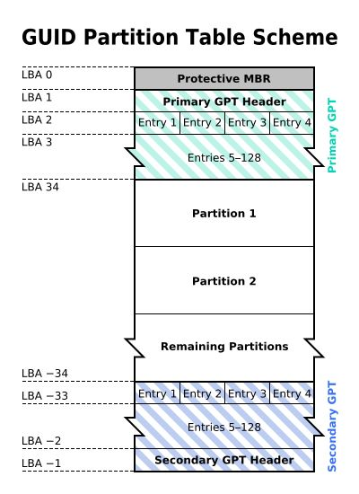
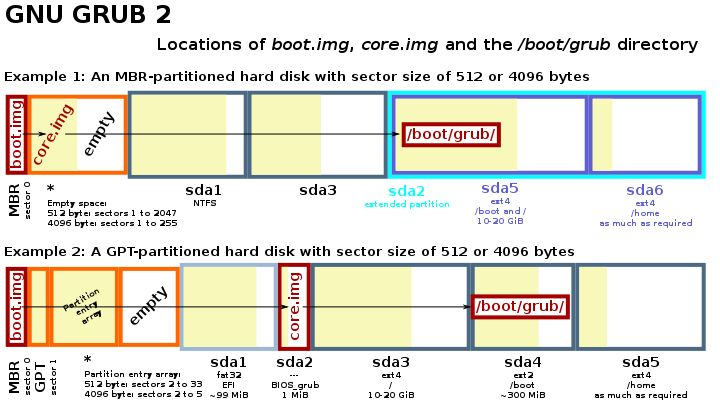

<!-- @import "[TOC]" {cmd="toc" depthFrom=1 depthTo=6 orderedList=false} -->

<!-- code_chunk_output -->

- [1. 固件接口标准](#1-固件接口标准)
  - [1.1. BIOS](#11-bios)
  - [1.2. EFI/UEFI](#12-efiuefi)
    - [1.2.1. UEFI 大事年表](#121-uefi-大事年表)
  - [1.3. 区别](#13-区别)
- [2. 启动方式](#2-启动方式)
  - [2.1. Legacy mode](#21-legacy-mode)
  - [2.2. UEFI mode](#22-uefi-mode)
  - [2.3. CSM mode](#23-csm-mode)
- [3. 分区表](#3-分区表)
  - [3.1. MBR 分区表](#31-mbr-分区表)
  - [3.2. EBR 分区表](#32-ebr-分区表)
  - [3.3. GPT 分区表](#33-gpt-分区表)
- [4. 分区](#4-分区)
  - [4.1. ESP(EFI 系统分区)](#41-espefi-系统分区)
  - [4.2. Windows 恢复分区](#42-windows-恢复分区)
- [5. 启动模式和分区表组合](#5-启动模式和分区表组合)
- [6. Bootloader](#6-bootloader)
  - [6.1. Grub](#61-grub)
  - [6.2. Windows Boot Manager](#62-windows-boot-manager)
  - [6.3. NTLDR](#63-ntldr)
- [7. 小结](#7-小结)

<!-- /code_chunk_output -->

# 1. 固件接口标准

## 1.1. BIOS

IBM 推出的业界标准的**固件接口**, 存储于主板的 `ROM`/`EEPROM`/`flash` 中, 提供的功能包括:

- 开机自检

- **加载引导程序**(**MBR**中的, 通常是 **bootloader** 的**第一级**)

- 向 OS 提供抽象的硬件接口

PS: **CMOS** 是 PC 上的另一个重要的**存储器**, 用于保存 BIOS 的设置结果, CMOS 是 RAM.

## 1.2. EFI/UEFI

`Unified Extensible Firmware Interface`,  **统一的可扩展固件接口**, 架设在**系统固件之上**的**软件接口**, 用于**替代 BIOS 接口**, EFI 是 UEFI 的前称. 这种接口用于操作系统自动从预启动的操作环境, 加载到一种操作系统上.

一般认为 UEFI 由以下几个部分组成:

- Pre-EFI 初始化模块
- EFI 驱动程序执行环境(DXE)
- EFI 驱动程序
- 兼容性支持模块(CSM)
- EFI 高层应用
- GUID 磁盘分区表(GPT)

通常

* **初始化模块**和 **DXE** 被集成在**一个 ROM** 中;

* **EFI 驱动程序**一般在设备的 **ROM** 中或者 **ESP** 中;

* **EFI 高层应用**一般在 **ESP** 中;

* **CSM** 用于给不具备 UEFI 引导能力的操作系统提供类似于**传统 BIOS** 的系统服务.

### 1.2.1. UEFI 大事年表

可扩展固件接口(Extensible Firmware Interface, EFI)是 Intel 为 PC 固件的体系结构、接口和服务提出的建议标准. 其主要目的是为了提供一组在 OS 加载之前(启动前)在所有平台上一致的、正确指定的启动服务, 被看做是有近 20 多年历史的 BIOS 的继任者.

UEFI 是由 EFI1.10 为基础发展起来的, 它的所有者已不再是 Intel, 而是一个称作 Unified EFI Form 的国际组织.

90 年代初: 传统 BIOS 的天下. 计算机系统的创新严重受限.

1997 年: 英特尔开始为安腾电脑设计 BIOS.

1999 年: EFI 1.0 推出.

2000 年: EFI 1.02 发布.

2002 年: EFI 1.10 发布.

2005 年: UEFI 论坛成立.

2006 年: UEFI 2.0 发布.

2007 年: UEFI 2.1

2008 年: UEFI 2.2

## 1.3. 区别

与 legacy BIOS(传统 BIOS)相比, UEFI 最大的几个区别在于:

1. 编码 99% 都是由 C 语言完成;

2. 一改之前的中断、硬件端口操作的方法, 而采用了 Driver/protocol 的新方式;

3. 将不支持 X86 实模式, 而直接采用 Flat mode(也就是不能用 DOS 了, 现在有些 EFI 或 UEFI 能用是因为做了兼容, 但实际上这部分不属于 UEFI 的定义了);

4. 输出也不再是单纯的二进制 code, 改为 Removable Binary Drivers;

5. OS 启动不再是调用 Int19, 而是直接利用 protocol/device Path;

6. 对于第三方的开发, 前者基本上做不到, 除非参与 BIOS 的设计, 但是还要受到 ROM 的大小限制, 而后者就便利多了.

7. 弥补 BIOS 对新硬件的支持不足的问题.

# 2. 启动方式

## 2.1. Legacy mode

即通过 `MBR/BIOS` 进行引导的传统模式, 流程如下:

1. BIOS 加电自检(Power On Self Test -- POST).

2. 读取**主引导记录**(MBR). BIOS 根据 **CMOS** 中的设置**依次检查启动设备**: 将相应启动设备的**第一个扇区**(也就是 **MBR 扇区**)读入内存.
    - 检查 MBR 的**结束标志位**是否等于 **55AAH**, 若不等于则转去尝试其他启动设备, 如果没有启动设备满足要求则显示"NO ROM BASIC"然后死机.
    - 当检测到有启动设备满足要求后, **BIOS** 将**控制权**交给相应**启动设备**的 **MBR**.
3. 根据 **MBR** 中的**引导代码**启动引导程序.

## 2.2. UEFI mode

UEFI 启动**不依赖**于 **Boot Sector**(比如 **MBR**), 大致流程如下:

1. `Pre-EFI` 初始化模块运行, **自检**;
2. 加载**DXE**(EFI 驱动程序执行环境), 枚举并加载 **EFI 驱动程序**(设备 **ROM** 或 **ESP** 中);
3. 找到 **ESP** 中的**引导程序**通过其引导操作系统.

## 2.3. CSM mode

UEFI 中的**兼容性支持模块**(Compatible Support Module), 提供了引导 **UEFI 固件**的 PC 上的**传统磁盘**(`MBR` 格式)的方法.

# 3. 分区表

目前所有 Windows 系统均支持 MBR, 而 **GPT 只有 64 位系统**才能支持. BIOS 只支持 MBR 引导系统, 而 GPT 仅可用 UEFI 引导系统. 正因为这样, 现在主板大多采用 BIOS 集成 UEFI, 或 UEFI 集成 BIOS, 以此达到同时兼容 MBR 和 GPT 引导系统的目的.

## 3.1. MBR 分区表

传统的**分区表类型**. 指的是 **512 字节**的 `Master Boot Record`(**MBR**, **主引导记录**)中的**分区表**, 由于大小限制, 其中只能存有**最多四个分区的描述符**(亦即**4 个主分区**).

最大的缺点则是不支持容量大于 2T 的硬盘(**0x80, 只有一个可引导分区**).

## 3.2. EBR 分区表

位于 `Extended Boot Record`(**EBR**, **扩展引导纪录**)中的**分区表**, 该分区表所描述的分区即**扩展分区**. 每个 EBR 仅表示了一个扩展分区, 该扩展分区紧接在它的 EBR 后. EBR 中的**四个分区描述符**中的第一个表示其描述的分你去, 第二个描述符则表示下一个扩展分区(如果是最后一个则为空)也就是说各个 EBR 串接成了一个 EBR 链表.

## 3.3. GPT 分区表

`GUID Partition Table`, 是 **EFI 标准的一部分**, 用于**替代 MBR 分区表**, 相较起来有**分区更大**、**数量更多**(没有 4 个主分区的限制)等优势.

最大支持 18EB 的硬盘, 是基于 UEFI 使用的磁盘分区架构.

GPT 格式的硬盘结构如下, 可以看到**首部 MBR 的位置**有个 `protective MBR`(用于防止不识别 GPT 的硬盘工具错误识别并破坏硬盘中的数据), 这个 MBR 中**只有一个**类型为 **0xEE** 的**分区**.

# 4. 分区

分区可以是文件系统, 启动 kernel image, bootloader 裸程序或者参数等各种数据.

MBR Partition ID(分区类型): https://en.wikipedia.org/wiki/Partition_type

## 4.1. ESP(EFI 系统分区)

EFI System Partition, FAT 格式, **在 MBR 的分区类型 ID 是 0xEF**. 主要目录是 EFI. `EFI/boot/bootx64.efi` 是 **EFI 默认的启动项**. 安装的操作系统会建立相应的目录 EFI/xxx, 并将自己的启动项复制为到 `EFI/boot/bootx64.efi` 作为缺省启动项.

UEFI 官网上注册的 EFI 的子目录: http://www.uefi.org/registry

比如:

* 安装 Windows 的时候, 会在 ESP 分区中建立 EFI/Microsoft 子目录, 并将 `EFI/Microsoft/bootmgr.efi` 复制到 `EFI/boot/bootx64.efi`.

* 安装 Ubuntu 的时候, 会在 ESP 分区中建立 EFI/Ubuntu 子目录并将 `EFI/ubuntu/grubx64.efi`(grub bootloader) 复制为 `EFI/boot/bootx64.efi`. 因为 Grub 本身会扫描磁盘上的分区并找到 windows 启动程序(`bootmgr.efi`)因此先装 windows 后装 ubuntu 仍能通过 grub 让 windows 启动.

Linux 也可以直接将编译出的 Kernel 及 initrd(打开 EFI Stub 编译选项)作为 efi 文件复制到 ESP 中直接启动.

也可以在 PC 的系统设置中添加启动项.

## 4.2. Windows 恢复分区

NTFS 格式的分区, 即 Windows Recovery Environment, WinPE + 工具集

# 5. 启动模式和分区表组合

**UEFI 模式**启动引导系统中, 对于设备启动项, 会查找设备中**第一个 FAT 分区**中的**引导文件**, 并没有并**没有指定分区表格式**. 所以 U 盘和移动硬盘可以用 **MBR 分区表**, 创建一个 **FAT 分区**放置**引导文件**, 从而达到可以**双模式启动**的目的. 但需要注意的是, **UEFI** 虽然**支持 MBR 启动**, 但**必须要有 UEFI 引导文件**存放在 FAT 分区下; **UEFI** 是**无法使用传统 MBR 引导**来启动系统的.

由于 GPT 分区表引导系统的方式与 MBR 分区表不同, 故而使用**传统系统安装办法**(如 Ghost、Win$Man 等)会导致出现**系统无法引导**的现象. 而且使用 GPT 引导系统的话, 必要时还得调整主板设置, 开启 UEFI(大部分主板默认开启 UEFI). 但是使用 UEFI 和 GPT, 只是支持大于容量 2T 的硬盘, 并不会带来质的提升(开机硬件自检会稍微快了那么 1、2 秒). 所以, 如果不用大于 2T 的硬盘做系统的话, 就没必要使用 UEFI.

**BIOS + MBR**: 这是最传统的, 系统都会支持; 唯一的缺点就是不支持容量大于 2T 的硬盘.

**BIOS + GPT**: BIOS 是可以使用 GPT 分区表的硬盘来作为资料盘的, 但**不能引导系统**; 若电脑同时带有容量小于 2T 的硬盘和容量大于 2T 的硬盘, 小于 2T 的可以用 MBR 分区表安装系统, 而大于 2T 的可以使用 GPT 分区表来存放资料. 但系统须使用 64 位系统.

**UEFI + MBR**: 可以把 **UEFI 设置成 Legacy 模式(传统模式)让其支持传统 MBR 启动**, 效果同 BIOS + MBR; 也可以建立 FAT 分区, 放置 UEFI 引导文件, 可应用在 U 盘和移动硬盘上实现双模式启动.

**UEFI + GPT**: 如果要把大于 2T 的硬盘作为系统盘来安装系统的话, 就必须如此. 而且系统须使用 64 位系统, 否则无法引导. 但系统又不是传统在 PE 下安装后就能直接使用的, 引导还得经过处理才行.

# 6. Bootloader

Bootloader 即上文中提到的引导程序, 用于**启动操作系统**或者**其它引导程序**(比如 Grub 启动 Windows Bootmgr)

## 6.1. Grub

GNU 的开源引导程序, 可以用于引导 Linux 等操作系统, 或者用于链式引导其它引导程序(比如 Windows Boot Manager), 分为三个部分, 分别称为**步骤 1**、**1.5**、**2**, 看名字就可以知道, 步骤 1.5 是可有可没有的, 这三个步骤对应的文件分别是:

- `Boot.img`: 步骤 1 对应的文件, 446 个字节大小, 步骤 1 可以引导 **步骤 1.5** 也可以引导 **步骤 2**. MBR 分区格式的磁盘中放在 MBR 里(446 也是为了符合 MBR 的启动代码区大小);  GPT 分区格式的磁盘中放在 Protective MBR 中.
- `Core.img`: 步骤 1.5 对应的文件, 32256 字节大小. MBR 分区格式的磁盘中放在紧邻 MBR 的若干扇区中; GPT 分区格式的磁盘中则放在 34 号扇区开始的位置(第一个分区所处的位置)而对应的 GPT 分区表中的第一个分区的 entry 被置空. 通常其中包含文件系统驱动以便 load 步骤 2 的文件.
- `/boot/grub`: 步骤 2 对应的文件目录放在系统分区或者单独的 Boot 分区中

## 6.2. Windows Boot Manager

是从 Windows Vista 开始引进的新一代开机管理程序用以取代 NTLDR.

当电脑运行完开机自检后传统型 BIOS 会根据引导扇区查找开机硬盘中标记"引导"分区下的 BOOTMGR 文件; 若是 UEFI 则是 Bootmgfw.efi 文件和 Bootmgr.efi 文件接着管理程序会读取开机配置数据库(BCD, Boot Configuration Database)下的引导数据接着根据其中的数据加载与默认或用户所选择的操作系统.

## 6.3. NTLDR

是微软的 Windows NT 系列操作系统(包括 Windows XP 和 Windows Server 2003)的引导程序. NTLDR 可以从硬盘以及 CD-ROM、U 盘等移动存储器运行并引导 Windows NT 系统的启动. 如果要用 NTLDR 启动其他操作系统则需要将该操作系统所使用的启动扇区代码保存为一个文件 NTLDR 可以从这个文件加载其它引导程序.

NTLDR 主要由两个文件组成这两个文件必须放在系统分区(大多数情况下都是 C 盘):

1. NTLDR 引导程序本身
2. boot.ini 引导程序的配置文件

# 7. 小结

**分区表**是在磁盘(存储介质)上的, 用于**描述该磁盘的分区情况**, 有**GPT 和 MBR** 两种格式.

**BIOS 和 UEFI**是**固件接口标准**功能包括开机自检、启动流程(如何找到引导程序)、给操作系统和引导程序提供系统服务等.

**MBR 是引导扇区**包括最多 446 个字节的引导程序(通常是引导程序的前部)和 MBR 分区表其中可以包括 4 个主分区.

启动方式是指如何主板上的固件在开机自检后如何找到引导程序有 Legacy 模式(BIOS + MBR)和 UEFI 模式(UEFI + GPT)

https://zhuanlan.zhihu.com/p/36976698

