<!-- @import "[TOC]" {cmd="toc" depthFrom=1 depthTo=6 orderedList=false} -->

<!-- code_chunk_output -->

- [1. 两种 BIOS](#1-两种-bios)
  - [1.1. 传统 BIOS](#11-传统-bios)
  - [1.2. UEFI](#12-uefi)
- [2. UEFI 的 DXE](#2-uefi-的-dxe)
  - [2.1. 文件系统驱动](#21-文件系统驱动)
  - [2.2. 设备驱动](#22-设备驱动)
  - [2.3. DXE 作用](#23-dxe-作用)
  - [2.4. 设备固件](#24-设备固件)
  - [2.5. 加载过程](#25-加载过程)
  - [2.6. 手动加载](#26-手动加载)
- [3. EFI 系统分区](#3-efi-系统分区)
- [4. 配置 UEFI 启动项](#4-配置-uefi-启动项)
  - [4.1. 文件启动项](#41-文件启动项)
  - [4.2. 设备启动项](#42-设备启动项)
  - [4.3. 举例](#43-举例)
- [5. Windows 的启动顺序](#5-windows-的启动顺序)
  - [5.1. BIOS](#51-bios)
  - [5.2. UEFI](#52-uefi)
- [6. Linux 启动过程](#6-linux-启动过程)
  - [6.1. UEFI 启动](#61-uefi-启动)
- [7. UEFI shell 操作](#7-uefi-shell-操作)
  - [7.1. 查看所有的 UEFI 启动项](#71-查看所有的-uefi-启动项)
  - [7.2. 手动执行某个启动项](#72-手动执行某个启动项)
  - [7.3. UEFI 的映射表](#73-uefi-的映射表)
  - [7.4. 添加一个启动项](#74-添加一个启动项)
- [8. Q&A](#8-qa)
  - [8.1. Ghost](#81-ghost)
  - [8.2. 无法定位分区](#82-无法定位分区)
  - [8.3. 无工具制作安装盘](#83-无工具制作安装盘)
  - [8.4. 无 U 盘安装](#84-无-u-盘安装)
  - [8.5. 默认 grub](#85-默认-grub)
  - [8.6. 安装在 MBR](#86-安装在-mbr)
- [9. 参考](#9-参考)

<!-- /code_chunk_output -->

# 1. 两种 BIOS

## 1.1. 传统 BIOS

一句话概括: **BIOS 只认识设备, 不认识分区, 不认识文件**.

BIOS 启动的时候按照 **CMOS** 设置里的顺序**挨个存储设备检查**: (此处不讨论 PXE 和光盘)

* 这个存储设备的前 512 字节是不是以 0x55 0xAA 结尾?

* 不是那就跳过. 找下一个设备.

* 是的话, 这个磁盘可以启动, **加载这 512 字节里的代码然后执行**.

* **执行之后后面的事几乎就跟 BIOS 没啥关系(那些代码可能会使用 BIOS 的一些中断**)了.

至于后面**启动什么系统**取决于这 512 字节里**存了谁家的代码**. 这个代码是**各家的系统安装程序**写进去的目的是启动自家系统.

* 比如你装了 Windows, 这里面就变成了 **Windows 的启动代码**.
* 比如你装了 Linux, 这里面就会变成 **Grub 的启动代码**.

顺便这 512 字节包含了 **MBR 分区表**的信息. 但是有人可能注意到, 上面半句没提 "系统装在哪个分区上"了, 硬盘有几个分区.

其实 **BIOS 并不认识分区表(不关心, BIOS 开始执行 512 字节代码就不管了)**. 哪怕磁盘上没有分区表, 没分过区, 只要前 512 字节有 0x55 0xAA 的结尾有合适的引导代码也是能启动的.

## 1.2. UEFI

(此处只讨论民用 64 位架构下的 UEFI.)

一句话概括: UEFI 认识**设备**, 还认识**设备 ROM**, 还认识**分区表**, 认识**文件系统**以及**文件**.

UEFI 启动的时候, 经过一系列初始化(SEC、CAR、DXE 什么的 SEC、CAR 不需要懂. 下一节里会说 DXE 阶段是干嘛的), 然后按照**设置里的顺序找启动项**.

启动项分两种:

- **文件启动项**, 大约记录的是**某个磁盘的某个分区的某个路径下的某个文件**. 对于文件启动项, **固件**会直接加载这个**EFI 文件**并执行. 类似于 DOS 下你敲了个 win.com 就执行了 Windows 3.2/95/98 的启动. 文件不存在则失败.

- **设备启动项**, 大约记录的就是"某个 U 盘"、"某个硬盘". (此处只讨论 U 盘、硬盘)对于设备启动项, UEFI 标准规定了**默认的路径** "`\EFI\Boot\bootX64.efi`". UEFI 会加载**磁盘**上的**这个文件(\EFI\Boot\bootX64.efi)**. 文件不存在则失败.

至于**这个 EFI 文件会干嘛主板是不管**的.

但是随着 Windows8.x 以及 UEFI 标准 2.x 推出了一个叫做 **SecureBoot**的功能. 开了 SecureBoot 之后, **主板会验证即将加载的 efi 文件的签名**, 如果开发者不是受信任的开发者, 就会拒绝加载.

比如 `CloverX64.efi` 就好像没有签名.

# 2. UEFI 的 DXE

## 2.1. 文件系统驱动

一个磁盘**分区**, 要**格式化**之后才能往里存**文件**. 格式化的时候又能选择不同的**文件系统**. 比如

* Win10 可以选 FAT32、NTFS、exFAT、ReFS 几种;

* Linux 可以选 ext2、ext3、ext4、vfat 等;

* macOS 可以选 FAT32、HFS+、APFS、exFAT 几种.

其实**每个操作系统**, 都先有**文件系统驱动**, 然后才能读取某种**文件系统**.

## 2.2. 设备驱动

**设备**也是一样的, 先有**设备驱动**然后才能**读取设备**.

* 原版的 WinXP 只带了 IDE 驱动, 没有 SATA 驱动;

* 原版 Win7 只带了 IDE 和 SATA 驱动, 没有 NVMe 驱动;

* Win8/Win10 则带了 IDE/SATA 和 NVMe 三种驱动;

* macOS10.12 带了 SATA 驱动以及苹果专用 NVMe 磁盘的驱动;

* macOS10.13 带了 SATA 和标准 NVMe 驱动.

先有设备驱动识别设备, 再文件系统驱动识别文件系统

## 2.3. DXE 作用

UEFI 作为一个模糊了**固件**和**操作系统界限**的东西, 作为一个设计之初就考虑到了**扩展性的东西**, 它也是**有驱动程序**的. 启动过程中的 **DXE 阶段**全称叫 `Driver eXecution Environment` 就是**加载驱动**用的.

## 2.4. 设备固件

首先各种 **PCI-E 的设备**(比如显卡, 比如 PCI-E NVMe)都有**固件**. 其中**支持 UEFI** 的设备(比如 10 系列的 Nvidia 显卡)**固件**里就会有**对应的 UEFI 的驱动**.

> 题外话: 浦科特的 NVMe 固态硬盘, UEFI 版固件是没有那个 Logo 的. 那个 Logo 是浦科特的 BIOS 版(Legacy 版)固件. 它被加载是因为主板默认为了兼容性, "StorageOptionROM" 选项默认是 Legacy 的. 改成 UEFI, 就见不到那个浦科特 Logo 页了.

## 2.5. 加载过程

1. UEFI 启动后, **进入了 DXE 阶段**, 就开始**加载设备驱动**(这里是设备驱动), 然后 UEFI 就会有**设备列表**了.

2. 对于其中的**磁盘设备**, UEFI 会**加载对应的设备驱动**, 解析其中的**分区表**(**GPT** 和 **MBR**). 然后 UEFI 就会有**所有分区的列表**了.

3. 然后 UEFI 就会用**内置的文件系统驱动**(这里是文件系统驱动), **解析**每个**分区**. 然后 UEFI 就会**认识分区里的文件**了. 比如 "`\EFI\BOOT\BOOTX64.EFI`"(**ESP** 分区).

## 2.6. 手动加载

作为 UEFI 标准里**钦定的文件系统**, `FAT32.efi` 是**每个主板！！！都会带的**. **所有 UEFI 的主板都认识 FAT32 分区**. 这就是 UEFI 的 Windows 安装盘为啥非得是 FAT32 的. 除此之外苹果的主板还会支持 hfs 分区.

如同 Windows 可以安装驱动一样, **UEFI 也能在后期加载驱动**. 比如 CloverX64.efi 启动之后会加载 `\EFI\Clover\drivers64UEFI` 下的所有驱动. 包括 VboxHFS.efi 等各种 efi. 网上你也能搜到 NTFS.efi. 再比如**UEFI Shell** 下你可以**手动执行命令加载驱动**.

再说一句, Apple 随着 macOS10.13 推出了 APFS, 很良心的放出了 apfs.efi, 广大 Hackintosh 用户的福音啊, 把这玩意放进 Clover 里就能识别 APFS 分区里的 HighSierra 了！

# 3. EFI 系统分区

UEFI 规范里, 在 **GPT 分区表**的基础上, 规定了一个 **EFI 系统分区**(`EFI System Partition`, ESP), ESP 分区要格式化成 **FAT32** 文件系统(Linux 下面是 vfat 文件系统), **EFI 启动文件**要放在"`\EFI\<厂商>`" 文件夹下面.

- 比如 Windows 的 UEFI 启动文件都在 "`\EFI\Microsoft`" 下面.
- 比如 Clover 的东西全都放在 "`\EFI\Clover`"下面.

但是 Apple 比较特殊它的主板直接去 HFS/APFS 分区找启动文件. 然而即便如此 Mac 的 ESP 里还是会有一堆 Apple 的文件.

Macbook 上的 ESP 分区里的 "\EFI\Apple" 文件夹:

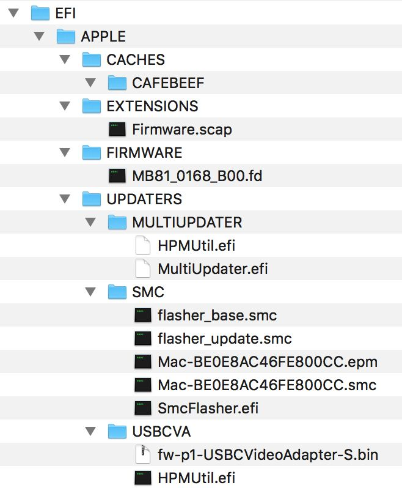

**UEFI 下启动盘是 ESP 分区跟 Windows 不是同一个分区**.

# 4. 配置 UEFI 启动项

**Windows** 的 **BCD** 命令可以**添加 UEFI 启动项**. 也可以用 EasyUEFI 来搞这些操作. 但是免费版的 EasyUEFI 不支持企业版 Windows.

Linux 通过 **UEFI SHELL** 相关命令.

## 4.1. 文件启动项

根据 UEFI 标准, 你可以把 U 盘里的 "`\EFI\Clover`" 文件夹拷贝到**硬盘里的 ESP 对应的路径**下. 然后把 "`\EFI\Clover\CloverX64.efi`" 添加为 **UEFI 的文件启动项**.

## 4.2. 设备启动项

"`\EFI\BOOT`" 这个文件夹**放谁家的程序都行**. 无论是 "`\EFI\Microsoft\Boot\Bootmgfw.efi`", 还是 "`\EFI\Clover\CloverX64.efi`", 只要放到 "`\EFI\BOOT`" 下并且**改名** "`BOOTX64.EFI`"(**设备启动项**), 就能在**没添加文件启动项**的情况下**默认加载对应的系统**.

## 4.3. 举例

举个例子: 一个 U 盘, 想做成 **Windows 安装盘 + Hackintosh 安装盘**该怎么做?

- 划分**两个分区**, 第一个分区格式化成 `FAT32`, 第二个分区 `HFS+`.
- 苹果系统下把第二个分区做成安装盘. 苹果启动盘做好了.
- 把 Windows 的 ISO 镜像里的文件拷贝到第一个分区. Windows 安装盘做好了.
- 然后 Clover 拷贝到第一个分区的 "`\EFI\Clover`" 文件夹下. Clover 的东西也做好了.
- 最后怎么让这个 U 盘插到任何电脑上都默认启动 Clover 呢?答案是把 "\EFI\Boot" 下的 "bootX64.efi" 换成 Clover 的就可以了. 那个文件夹放谁家的 efi 文件都要改名 "bootX64.efi".

# 5. Windows 的启动顺序

Windows 8/8.1/10 在 UEFI 和 BIOS 下各种启动文件的顺序

## 5.1. BIOS

BIOS 启动:

MBR->PBR->bootmgr->WinLoad.exe

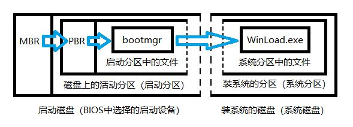

按照前文说的**BIOS 加载某个磁盘 MBR 的启动代码**这里特指 Windows 的引导代码这段代码会查找活动分区(**BIOS 不认识活动分区而是这段代码认识活动分区 0x80**)的位置加载并执行活动分区的 PBR(另一段引导程序).

Windows 的 PBR 认识 FAT32 和 NTFS 两种分区找到分区根目录的 bootmgr 文件加载、执行 bootmgr.

bootmgr 没了 MBR 和 PBR 的大小限制可以做更多的事. 它会加载并分析 BCD 启动项存储. 而且 bootmgr 可以跨越磁盘读取文件了. 所以无论你有几个磁盘你在多少块磁盘上装了 Windows 一个电脑只需要一个 bootmgr 就行了. bootmgr 会去加载某磁盘某 NTFS 分区的"\Windows\System32\WinLoad.exe"后面启动 Windows 的事就由 WinLoad.exe 来完成了.

重点来了为什么图中有两组虚线?

**因为"启动磁盘"和"装系统的磁盘"可以是同一个磁盘也可以不是同一个**. "启动分区"和"系统分区"可以是不同磁盘的不同分区也可以是相同磁盘的不同分区也可以是同一个分区.

这就解释了为什么有的时候 Windows 装在磁盘 2 上却要在 BIOS 里选磁盘 0 启动了. 因为 bootmgr 可能在磁盘 0 上.

## 5.2. UEFI

UEFI 启动:

UEFI 固件 -> bootmgfw.efi -> WinLoad.efi

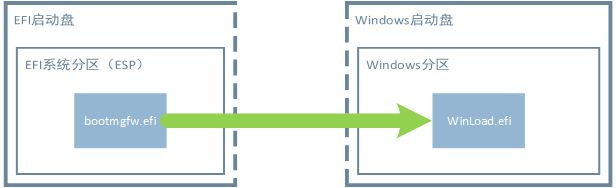

1. 主板 UEFI 进行初步初始化

2. 找到一个 UEFI 启动项. **UEFI 固件**有**所有启动项信息**, 然后会**根据配置的顺序**, 逐一尝试启动, 直到成功为止.

根据前文说的, **UEFI 启动项**分为**文件启动项**和**设备启动项**.

* 给 UEFI 指定特定的文件启动项(**某个设备某个分区某个文件**, 必要时候需要手动**加载设备驱动**和**文件系统驱动**);
* 直接**指定特定的设备**启动项(该设备必须**存在 FAT 分区**并且在里面必须是 `\EFI\BOOT\BOOTX64.EFI`), UEFI 查找**该设备分区**中第一个**FAT 分区**内的**引导文件**进行系统引导.

比如:

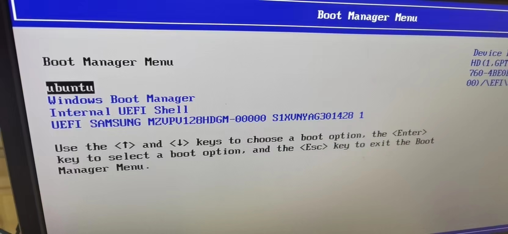

3. 假设第一个 "ubuntu" 不可用, 找到了 "Windows Boot Manager"

4. 里面写了 bootmgfw.efi 的位置. 固件加载 `bootmgfw.efi`(**ESPEFI 系统分区 FAT32 文件系统**). `bootmgfw.efi` 根据**BCD 启动项存储找到装 Windows 的磁盘的具体分区**加载其中的 WinLoad.efi. 由 WinLoad.efi 完成剩下的启动工作.

其中的虚线跟上面的一样意思是**Windows 启动盘和 EFI 启动盘可以是一个硬盘也可以是不同的硬盘**. 所以**对于 UEFI 来说启动盘是 bootmgfw.efi 所在的那个盘**.

# 6. Linux 启动过程

## 6.1. UEFI 启动

UEFI 固件 -> 文件启动项/BOOTX64.EFI -> grub

1. 主板 UEFI 进行初步初始化

2. **找到一个 UEFI 启动项**. **UEFI 固件**有**所有启动项信息**, 然后会**根据配置的顺序**, 逐一尝试启动, 直到成功为止.

根据前文说的, **UEFI 启动项**分为**文件启动项**和**设备启动项**.

* 给 UEFI 指定特定的文件启动项(**某个设备某个分区某个文件**, 必要时候需要手动**加载设备驱动**和**文件系统驱动**);
* 直接**指定特定的设备**启动项(该设备必须**存在 FAT 分区**并且在里面必须是 `\EFI\BOOT\BOOTX64.EFI`). UEFI 查找**该设备所有分区**中第一个 **FAT 分区**内的**引导文件**进行系统引导.

比如:

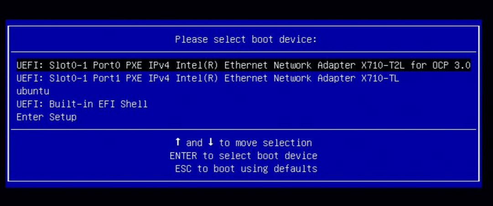

3. 如果是一个设备启动项, 那么就会根据前面 `2.5 加载驱动` 内容, 找到相应的 `BOOTX64.EFI` 文件并执行.

> 注: 设备启动项会查找设备中第一个 FAT 分区中的**引导文件**, 并没有并**没有指定分区表格式**. 所以 U 盘和移动硬盘可以用 **MBR 分区表**, 创建一个 **FAT 分区**放置**引导文件**, 从而达到可以**双模式启动**的目的.
>
> 但需要注意的是, **UEFI** 虽然**支持 MBR 启动**, 但**必须要有 UEFI 引导文件**存放在 FAT 分区下; **UEFI** 是**无法使用传统 MBR 引导**来启动系统的.

4. 如果是一个文件启动项, 则根据这个启动项的配置信息找到相应的 efi 文件并执行

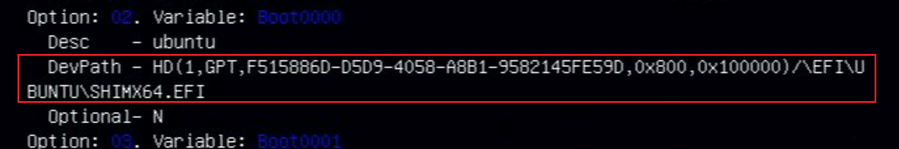

5. 这里的第一个和第二个都不可用, 而第三个可用, 并且它是一个文件启动项.

6. efi 文件一般是执行 grub 的内容, 启动内核菜单 -> 进入某个特定内核

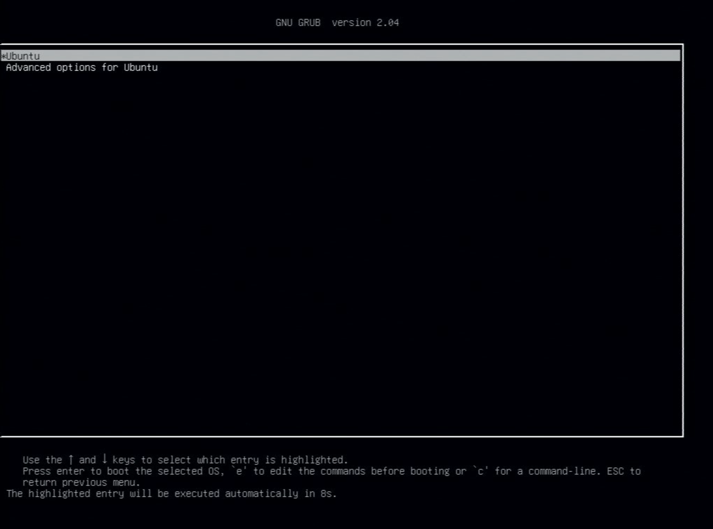

# 7. UEFI shell 操作

## 7.1. 查看所有的 UEFI 启动项

启动时候按特定按钮, 可以看到所有的 UEFI 启动项


通过 `bcfg boot dump` 查看所有启动项

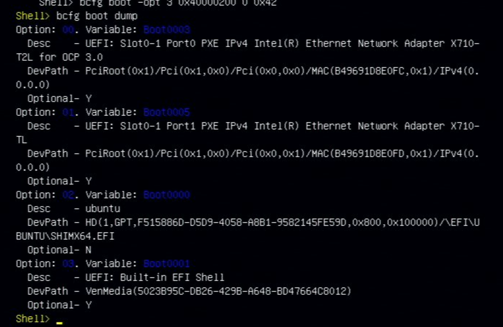

## 7.2. 手动执行某个启动项

可以看到 ubuntu 的 UEFI 启动项是 `\EFI\UBUNTU\SHIMX64.EFI`

所以可以通过下面命令进入 ubuntu 的这个启动项, 从而就能启动这个系统.

```
Shell> fs0:
FS0:> cd EFI/ubuntu/
FS0:/EFI/ubuntu/> shimx64.efi
```


这个操作和在启动阶段选择相应的 UEFI 启动项并执行的效果是一样的

## 7.3. UEFI 的映射表

这其实是 UEFI 自己的映射表

进入 `UEFI: Built-in EFI Shell`, 就会看到所有 mapping table, 当然通过 `map` 命令也能看到

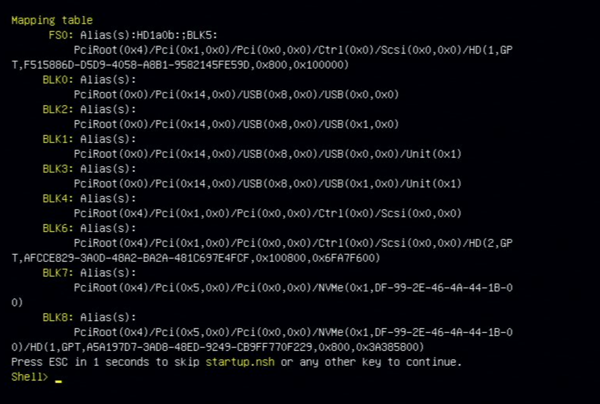

可以看到 `FS0:`, `HD1a0b:`, `BLK5:` 是一个意思

## 7.4. 添加一个启动项

结合上面的 mapping table 和 相应文件

```
Shell> bcfg boot add 4 FS0:\vtdchain.efi "Haiwei vtdchain"
Target = 0002.
bcfg: Add Boot0002 as 4
```

> 上面 `FS0:` 可以用 `HD1a0b:` 或者 `BLK5:` 替换

再次 `bcfg boot dump` 查看, 可以看到最后一项

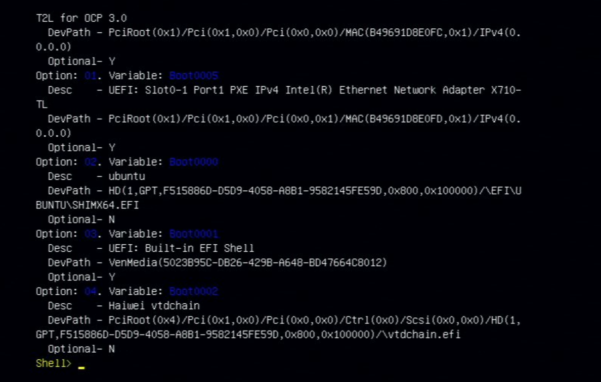

注意: 一定要通过 BIOS 保存(UEFI Shell 应该有自己的保存命令)

先从 UEFI Shell 退出

```
Shell> exit
```

然后选择下面的 "`Enter Setup`"


在 BIOS 的 "Save & Exit" 中保存并重启就能看到

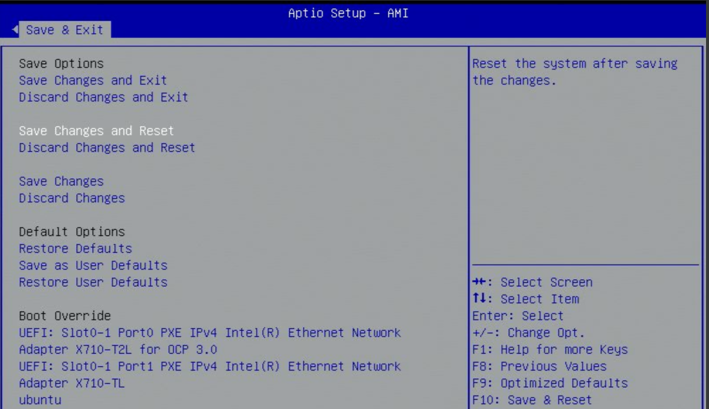


# 8. Q&A

## 8.1. Ghost

> 以前我一直装 Ghost 版的 WindowsUEFI 之后真的没法 Ghost 了么?

先说一句真不推荐用网上的 Ghost 版 Windows 安装盘来装系统了. 微软公开放出了官方的原版 Win10 下载链接而且还有启动盘制作程序. 链接在这: [下载 Windows 10](https://link.zhihu.com/?target=https%3A//www.microsoft.com/zh-cn/software-download/windows10). 写这个的原因是因为有时候自己做的 Ghost 备份还是挺好用的.

并不是不能 Ghost 了. 但是**传统的 Ghost 盘都是只 Clone 了 C 盘**没有考虑到"**UEFI 下启动盘是 ESP 分区(FAT32 文件系统)跟 Windows 不是同一个分区**"的事.

其次 Ghost 备份并**不能备份分区的 GUID**. 还原之后 ESP 分区里的 BCD 中记录的 Windows 在"某某 GUID 的分区上"就可能找不到对应的 GUID 了. 这时候需要用 bcdedit 命令或者 BCDBoot 命令修改 BCD 存储. 鉴于目前的 Ghost 盘很少基于 DOS 了如果是基于 WinPE 的 bcdedit 命令和 bcdboot 命令都是已经内置了的. 只要制作者在批处理文件里在 Ghost 之后调用 bcdedit 命令改一下 bcd 配置就行了.

而且即使没 Ghost 备份 ESP 分区你依然可以用**bcdboot 命令来生成 ESP 分区的内容**. 同样在 WinPE 下批处理文件里 Ghost 还原之后使用 BCDBoot 命令生成启动文件就行了.

总结一下 Ghost 还原 Windows 分区之后调用 BCDBoot 配置启动项即可.

## 8.2. 无法定位分区

> Windows 无法定位现有分区也无法

这种报错信息如果是**在 UEFI 模式下一般是因为你有多块硬盘而且超过一块硬盘上有 ESP 分区**. 只要把不想用的 ESP 分区删掉或者拔掉对应的硬盘保证装 Windows 的时候只有一个硬盘上有 ESP 分区即可.

如果实在做不到考虑用 DISM.exe 安装 Windows 吧. Win7 的 DISM.exe 真的太弱了. 尽量用 Win10 安装盘或者 Win10PE 里的 DISM.exe.

## 8.3. 无工具制作安装盘

> 不需要第三方工具就能做 UEFI 下的 Windows 安装盘?

确实啊根据上文说的**U 盘格式化成 FAT32**然后把 Windows 安装盘的 ISO 里面的东西拷贝到 U 盘就行了. (适用于 Win8/8.1/10 以及 WinServer2012/2012R2/2016. WinVista x64/Win7x64 以及 WinServer2008x64/2008R2 需要额外操作 WinVista x86/Win7x86/WinServer2008x86 不支持 UEFI)

打开 ISO 之后是这四个文件夹、四个文件拷贝到优盘.

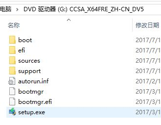

## 8.4. 无 U 盘安装

> 我电脑是 UEFI 的想装 Linux 但我手头没优盘听说也能搞定?

对搞个 FAT32 的分区把 Linux 安装盘的 iso 镜像里面的文件拷贝进去然后在 Windows 下用工具给那个分区的 BOOTx64.efi 添加为 UEFI 文件启动项开机时候选那个启动项就能启动到 Linux 安装盘了. 下面示意图是 Ubuntu 的. 记得查看一下你的 Linux 支不支持 SecureBoot 哦！如果你要装的 Linux 不支持 SecureBoot 记得**关掉主板的 SecureBoot 设置**哦.

Ubuntu 安装盘 ISO 镜像内的 UEFI 启动文件:

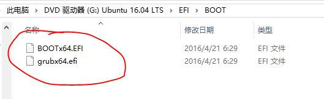

## 8.5. 默认 grub

> 装个 Linux 但我希望默认还是 Windows; 重装 Windows 可是我开机不再默认 Grub 怎么回 Linux?

如果是 UEFI 模式那就跟之前一样改启动项顺序就行了.

如果是传统 BIOS 的要么用 bootsect.exe 把 MBR 改成 Windows 的. 要么用工具把 MBR 刷成 Grub 的. 也可以考虑 Linux 下用 dd 命令备份 MBR 的前 446 字节到时候再还原回去.

## 8.6. 安装在 MBR

> 重装 Windows 提示我什么 MBR、GPT 不让装?

这个就是 Windows 安装程序的限制了. BIOS 模式下的 Windows 只允许被装在 MBR 分区表下面. UEFI 模式下的 Windows 只允许被装在 GPT 分区下.

但事实上 MBR 分区表也能启动 UEFI 模式下的 Windows.

# 9. 参考

本文来自: https://zhuanlan.zhihu.com/p/31365115