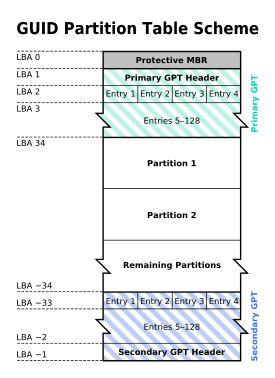
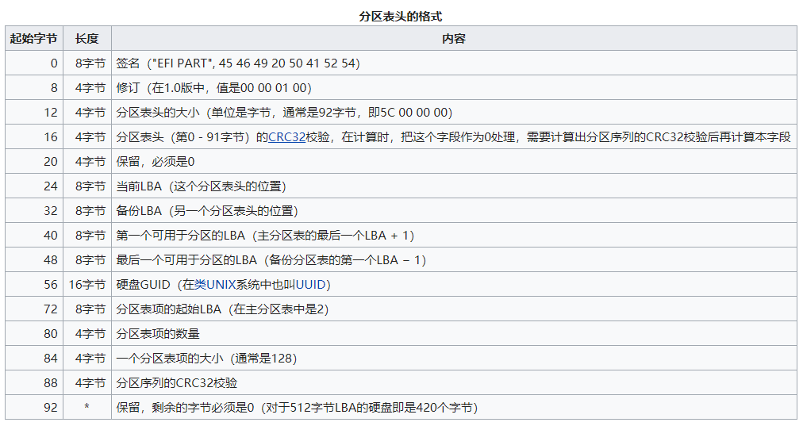
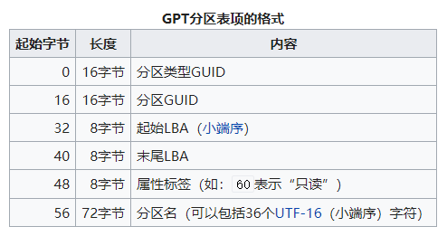

https://zh.wikipedia.org/wiki/GUID%E7%A3%81%E7%A2%9F%E5%88%86%E5%89%B2%E8%A1%A8

GUID 磁碟分割表(GUID Partition Table, 缩写: GPT)是一个**实体硬盘的分区表的结构布局**的标准. 它是可扩展固件接口(EFI)标准(被 Intel 用于替代个人计算机的 BIOS)的一部分, 被用于替代 BIOS 系统中的一 32bits 来存储逻辑块地址和大小信息的主启动记录(MBR)分区表.

- 对于那些扇区为 512 字节的磁盘, **MBR 分区表不支持容量大于 2.2TB(2.2×10\^12 字节)的分区(每个分区容量不大于 2.2TB)**, 然而, 一些硬盘制造商(诸如希捷和西部数据)注意到这个局限性, 并且将他们的容量较大的磁盘升级到**4KB 的扇区**, 这意味着 MBR 的有效容量上限**提升到 16TB**. 这个看似"正确的"解决方案, 在临时地降低人们对改进磁盘分配表的需求的同时, 也给市场带来关于在有较大的块(block)的设备上从 BIOS 启动时, 如何最佳的划分磁盘分区的困惑.

- GPT 分配 64bits(64 位)给逻辑块地址, 因而使得最大分区大小在 (2\^64)-1 个扇区成为可能. 对于每个扇区大小为 512 字节的磁盘, 那意味着可以有 9.4ZB(9.4×10\^21 字节)或 8 ZiB 个 512 字节(9,444,732,965,739,290,426,880 字节或 18,446,744,073,709,551,615((2\^64)-1)个扇区×512(2\^9)字节每扇区).

截止至 2010 年, 大多数操作系统对 GPT 均有所支持, 尽管包括 Mac OS X 和 Windows 在内的一些仅支持在 EFI 基础上自 GPT 分区启动, 见[#操作系统支持](https://zh.wikipedia.org/wiki/GUID%E7%A3%81%E7%A2%9F%E5%88%86%E5%89%B2%E8%A1%A8#%E6%93%8D%E4%BD%9C%E7%B3%BB%E7%BB%9F%E6%94%AF%E6%8C%81).

GPT 分区表的结构. 此例中, 每个逻辑块(LBA)为 512 字节, 每个分区的记录为 128 字节. 负数的 LBA 地址表示从最后的块开始倒数, −1 表示最后一个块.

1. 特点
2. 传统 MBR (LBA 0)
3. 分区表头(LBA 1)
4. 分区表项(LBA 2–33)
5. 操作系统支持
    5.1 类 Unix 操作系统
    5.2 32 位 Windows
    5.3 64 位 Windows
6. 分区类型 GUID
7. 参见
8. 外部链接
9. 备注
10. 参考资料

## 1. 特点

在 MBR 硬盘中, 分区信息直接存储于主引导记录(MBR)中(主引导记录中还存储着系统的引导程序). 但在 GPT 硬盘中, **分区表的位置信息储存在 GPT 头中**. 但出于兼容性考虑, **硬盘的第一个扇区仍然用作 MBR**, 之后才是 GPT 头.

跟现代的 MBR 一样, GPT 也使用逻辑区块地址(LBA)取代了早期的 CHS 寻址方式. **传统 MBR 信息存储于 LBA 0, GPT 头存储于 LBA 1, 接下来才是分区表本身**. 64 位 Windows 操作系统使用 16,384 字节(或 32 扇区)作为 GPT 分区表, 接下来的**LBA 34 是硬盘上第一个分区的开始**.

苹果公司曾经警告说: "不要假定所有设备的块大小都是 512 字节. "一些现代的存储设备如固态硬盘可能使用 1024 字节的块, 一些磁光盘(MO)可能使用 2048 字节的扇区(但是磁光盘通常是不进行分区的). 一些硬盘生产商在计划生产 4096 字节一个扇区的硬盘, 但截至 2010 年初, 这种新硬盘使用固件对操作系统伪装成 512 字节一个扇区.

使用英特尔架构的苹果机也使用 GPT.

为了减少分区表损坏的风险, GPT 在硬盘最后保存了一份分区表的副本.

## 2. 传统 MBR (LBA 0)

在 GPT 分区表的最开头, 出于兼容性考虑仍然存储了一份传统的 MBR, 用来防止不支持 GPT 的硬盘管理工具错误识别并破坏硬盘中的数据, 这个 MBR 也叫做**保护 MBR**. 在支持**从 GPT 启动的操作系统**中, 这里也用于存储第一阶段的启动代码. 在这个 MBR 中, **只有一个标识为 0xEE 的分区**, 以此来**表示这块硬盘使用 GPT 分区表, 这个分区类型是 PMBR**. 不能识别 GPT 硬盘的操作系统通常会识别出一个未知类型的分区, 并且拒绝对硬盘进行操作, 除非用户特别要求删除这个分区. 这就避免了意外删除分区的危险. 另外, 能够识别 GPT 分区表的操作系统会检查保护 MBR 中的分区表, 如果分区类型不是 0xEE 或者 MBR 分区表中有多个项, 也会拒绝对硬盘进行操作.

在使用 MBR/GPT 混合分区表的硬盘中, 这部分存储了 GPT 分区表的一部分分区(通常是前四个分区), 可以使不支持从 GPT 启动的操作系统从这个 MBR 启动, 启动后只能操作 MBR 分区表中的分区. 如 Boot Camp 就是使用这种方式启动 Windows.

## 3. 分区表头(LBA 1)

分区表头定义了**硬盘的可用空间**以及**组成分区表的项的大小和数量**. 在使用 64 位 Windows Server 2003 的机器上, 最多可以创建 128 个分区, 即分区表中保留了 128 个项, 其中每个都是 128 字节. (EFI 标准要求分区表最小要有 16,384 字节, 即 128 个分区项的大小)

分区表头还记录了这块硬盘的 GUID, 记录了分区表头本身的位置和大小(位置总是在 LBA 1)以及备份分区表头和分区表的位置和大小(在硬盘的最后). 它还储存着**它本身和分区表的 CRC32 校验**. 固件、引导程序和操作系统在启动时可以根据这个校验值来判断分区表是否出错, 如果出错了, 可以使用软件从硬盘最后的备份 GPT 中恢复整个分区表, 如果备份 GPT 也校验错误, 硬盘将不可使用. 所以 GPT 硬盘的分区表**不可以直接使用 16 进制编辑器修改**.

主分区表和备份分区表的头分别位于硬盘的第二个扇区(LBA 1)以及硬盘的最后一个扇区. 备份分区表头中的信息是关于备份分区表的.

## 4. 分区表项(LBA 2–33)

GPT 分区表使用简单而直接的方式表示分区. 一个分区表项的前 16 字节是分区类型 GUID. 例如, EFI 系统分区的 GUID 类型是{`C12A7328-F81F-11D2-BA4B-00A0C93EC93B`}. 接下来的 16 字节是该分区唯一的 GUID(这个 GUID 指的是该分区本身, 而之前的 GUID 指的是该分区的类型). 再接下来是分区起始和末尾的 64 位 LBA 编号, 以及分区的名字和属性.

