<!-- @import "[TOC]" {cmd="toc" depthFrom=1 depthTo=6 orderedList=false} -->

<!-- code_chunk_output -->

- [1. 工具准备](#1-工具准备)
  - [1.1. U 盘安装盘制作(可选)](#11-u-盘安装盘制作可选)
- [2. 启动设置](#2-启动设置)
- [3. 安装 Win10](#3-安装-win10)
- [4. 参考](#4-参考)

<!-- /code_chunk_output -->

# 1. 工具准备

1. win10 64 位系统镜像文件

2. **8G**的 U 盘一个, 格式化为**FAT32**(**UEFI**已具备**文件系统**的支持, 它能够**直接读取 FAT 分区中的文件**). 然后将 **win10 原版镜像**解压后**复制其中的所有文件到 U 盘根目录**. 确保 EFI 引导文件位于 `/efi/boot/bootx64.efi`. 也可制作 EFI 引导(1.1 内容)

3. 电脑支持 UEFI 启动

## 1.1. U 盘安装盘制作(可选)

https://www.baiyunxitong.com/jiaocheng/7081.html

1. 将 U 盘插到电脑上然后打开 UltraISO 软件, 点击文件打开你下载好的 Win10 光盘镜像 ISO 文件, 如下图;

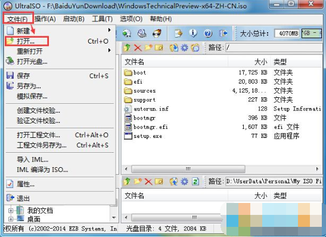

2. 打开 ISO 文件后, 点击工具栏上的"启动", 然后选择"写入硬盘镜像";

3. 这时会弹出"写入硬盘镜像"窗口, 确定好磁盘驱动器一项为你的 U 盘后, 点击写入, 中间出弹出格式化的提示, 我们确认一次就好了.

# 2. 启动设置

进入 BIOS 进行如下设置:

1. Secure Boot 设为 Disable [禁用启动安全检查]

2. OS Optimized 设置为 Others 或 Disabled [系统类型设置]

3. CSM(Compatibility Support Module) Support 设置为 Yes 或 Enabled

4. UEFI/Legacy Boot 选项选择成 UEFI only

# 3. 安装 Win10

1) 重启电脑, U 盘引导系统进入 Win10 安装程序

2) 进行设置, 下一步

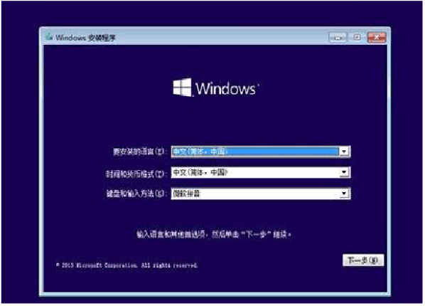

3) 版本选择, 自定义选择, 进入分区选择界面.

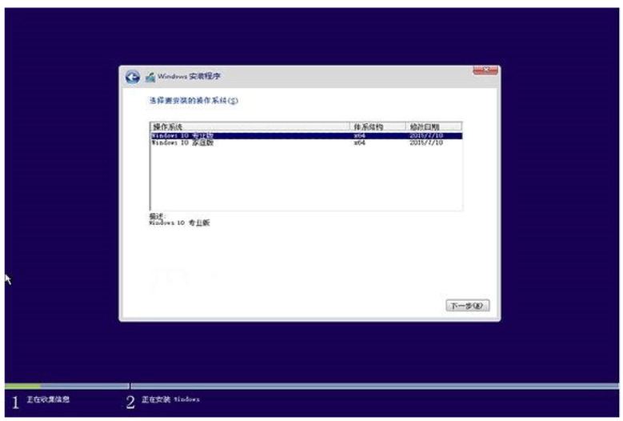

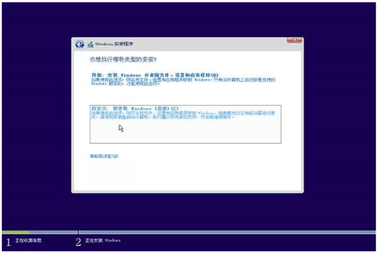

4) 如果你的**电脑硬盘已经为 GPT 分区结构**, 那么**直接选择目标分区**, 将其格式化, 然后选中目标分区点下一步即可.

5) 如果你的硬盘为**MBR 分区结构**, 会看到只能安装到 GPT 的提示, 如下图, 是因为原来的硬盘是 MBR 的, 而 UEFI 下, 系统只能安装到 GPT 分区的磁盘上.

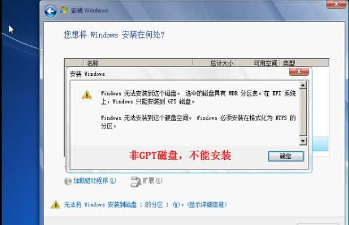

有两种方式转成 GPT 模式

方法 1. 删除所有分区, **删除硬盘上所有分区**使整个硬盘变成**一块未分配空间**. 然后使用**Win10 安装程序的分区功能重新分区**就可以**分区为 GPT 格式(自动会将硬盘转换为 GPT 分区**); (没有重要数据推荐使用该方法, 较简单)

整个硬盘已成为**一块未分配空间**. 点击"新建", 输入想要为系统安装分区分配的空间大小(推荐不小于 50G), 点击"应用".

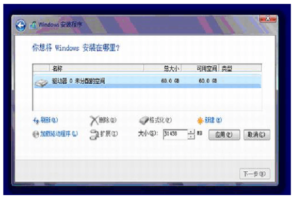

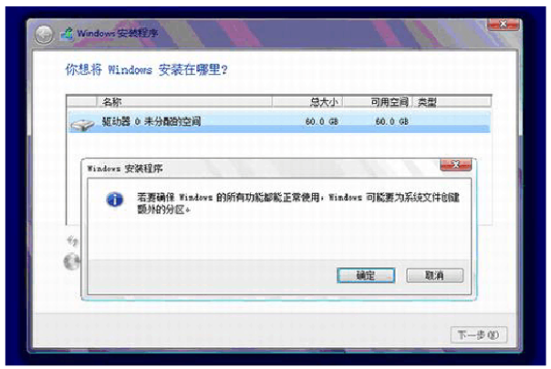

▲此时提示将**创建额外的分区**, 点击"确定". 之后**安装程序**会**自动将硬盘转换为 GPT 分区**.

创建完成后你将看到四个创建好的分区, 如下图所示. 然后再选中"未分配空间"点击"新建/应用", 完成整个硬盘的分区.

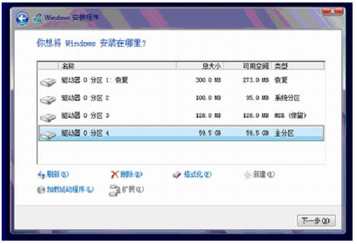

方法 2. 使用 CMD 命令转换成 GPT 分区:

在安装到下面页面, 按 Shift\+F10 或者 Shift+Fn+F10 会调出具有管理员权限的命令提示符窗口

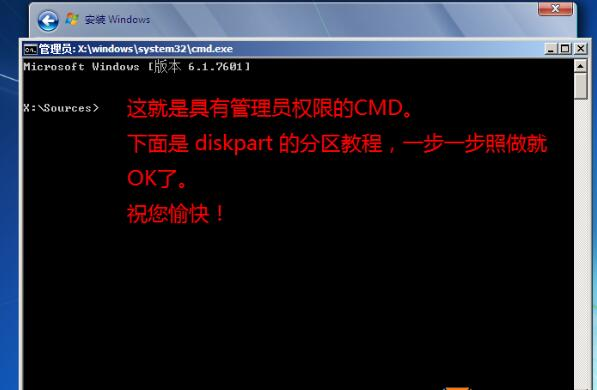

依次键入下面的命令(每条命令跟一个回车)即可完成转换:

1)、Diskpart ---(启动分区管理工具)

2)、List disk --- (列出连接到电脑的所有磁盘及其编号)

3)、Select disk x ---(选择需要转换分区的磁盘的编号)

4)、Clean ---(清除磁盘原有数据)

5)、Convert xxx---  (选择磁盘转换的类型)

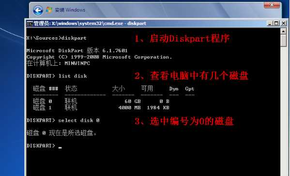

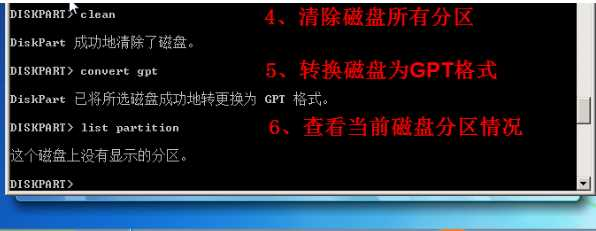

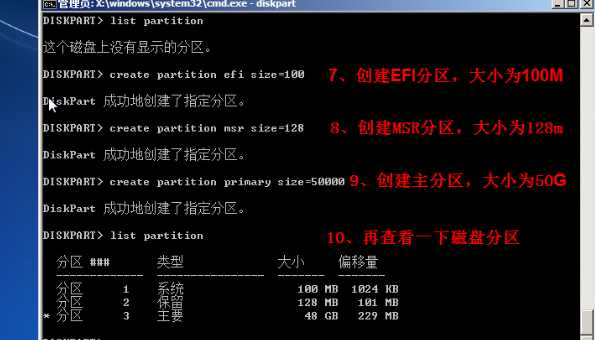

注: 运行第二条命令后, 会列出连接到电脑的所有硬盘/U 盘及其编号. 把第三条命令中的 x 代表你要转换的硬盘编号, 通常主硬盘编号都为 0. 最后一条命令中的 xxx 代表要转换的结果. **基本类型: Basic**; **动态类型: dynamic**; **MBR 磁盘: MBR**; **GPT 磁盘: GPT**. 例如, 要将 MBR 盘转换为 GPT 盘, 将 XXX 换成 GPT 即可, 其他情况同理.

已经转化为 GPT 模式了, 我们再连续输入两次 EXIT 退出

6) 当磁盘为 GPT 分区后, 我们就**可以选中主分区**进行安装

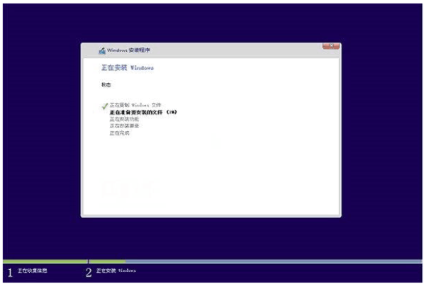

▲此后, Win10 安装程序要至少重启两次, 耐心等待 30 分钟左右将进入后续设置

6) 接下来就是下一步, 直到完成.

# 4. 参考

UEFI 安装 CentOS 7: https://stillwuyan.github.io/2017/02/04/install-centos7-in-uefi-mode/ , https://blog.csdn.net/weixin_41709624/article/details/108929270
