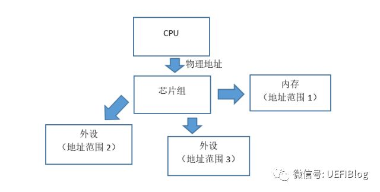
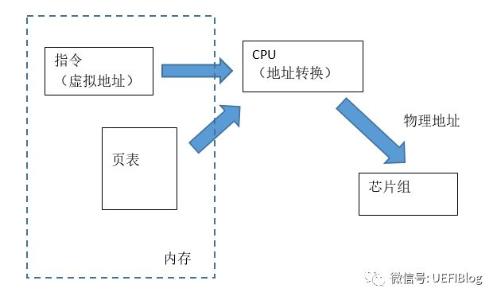
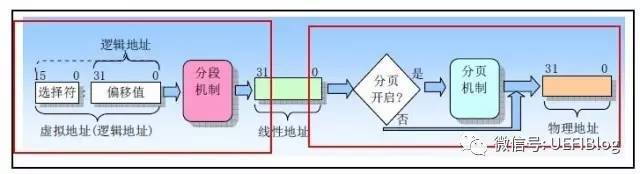
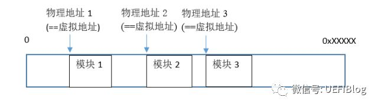
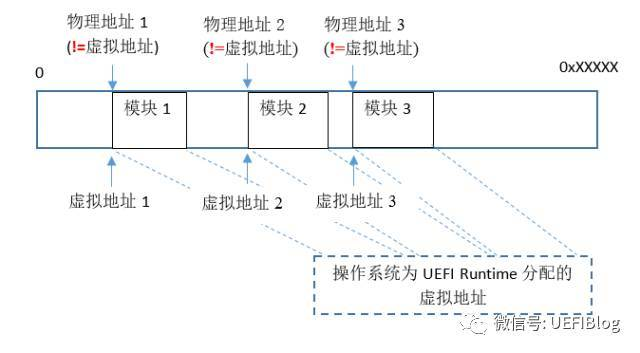
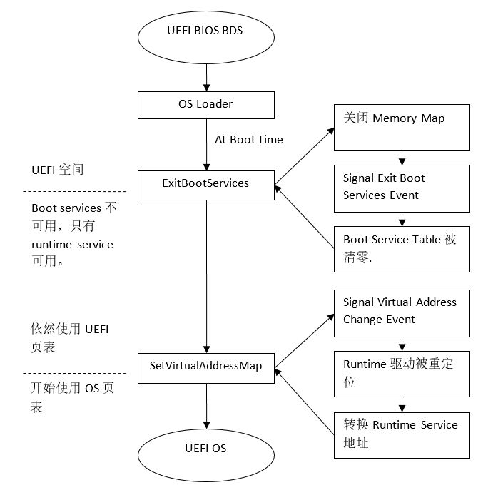

<!-- @import "[TOC]" {cmd="toc" depthFrom=1 depthTo=6 orderedList=false} -->

<!-- code_chunk_output -->

- [1. 物理地址与虚拟地址](#1-物理地址与虚拟地址)
- [2. X86 中的地址转换](#2-x86-中的地址转换)
- [3. UEFI 中的地址转换](#3-uefi-中的地址转换)

<!-- /code_chunk_output -->

https://zhuanlan.zhihu.com/p/26035864

> 大家一定对计算机系统的地址空间概念有所了解. 那么, UEFI 的地址空间是什么样的呢?UEFI 加载并把控制权交给操作系统时, 地址空间又发生了什么变化呢?在这篇文章中, 我们来一起探讨一下.

## 1. 物理地址与虚拟地址

首先, 我们来复习一下物理地址和虚拟地址的概念.

所谓物理地址, 就是从 CPU 发出的读写请求所引用的地址. 请注意, 物理地址并不一定指向内存, 它有可能指向一个芯片组的功能块, 也可能指向外设, 甚至什么也没有指到. 一个读写请求, 从 CPU 出发, 经由芯片组, 桥接设备, 及各种地址解码硬件配合工作, 被最终"引导"到目标设备, 从而完成一次读写操作.

所谓虚拟地址, 则是程序的指令所使用的地址 ( 包括指令本身所在的地址, 已及指令所读写的目标的地址 ) . 每当 CPU 遇到一个虚拟地址(可能是 CPU 从内存读入指令时, 也可能是 CPU 按指令要求读写操作数时), CPU 都会进行从虚拟地址到物理地址的转换 ( 简单起见这里只画出来页表 ) , 然后使用最终得到的物理地址发出读写请求.

为什么计算机设计者要引入两种不同的地址概念呢?事实上, 对虚拟地址和物理地址加以区分, 在操作系统中十分有用. 因为这样可以使每段程序都有自己"固定"的虚拟地址空间, 不随内存分配的调整(比如把程序在内存中移动或剔除)而变动, 这个特性在一段程序被多段程序调用时显得格外重要. 此外页表所提供的保护机制, 可以使操作系统更安全地管理整个内存, 也为在内存紧张时将部分内存换出到磁盘提供了可能.

## 2. X86 中的地址转换

> X86 体系结构从诞生到大放光彩, 其卓越的向后兼容性起了很大作用. 成也萧何, 败也萧何. 保证了用户一致性体验的同时, 也背上了沉重的历史包袱.

X86 体系架构对虚拟地址的支持有一个发展过程, 最早在 8086 中并没有虚拟地址的概念, 只有物理地址. 为了在 16 位 ALU 和 16 位代码和寄存器上寻址 20 位地址总线(2^20=1MB), Intel 想到了一个折中的办法: 把内存分段, 并设计了 4 个段寄存器, CS, DS, ES 和 SS, 分别用于指令、数据、其它和堆栈. 这样, 一个完整的物理内存地址就由两部分组成, 高 16 位的段基址和低 16 位的段内偏移量, 当然它们有 12 位是重叠的, 它们两部分相加在一起, 才构成完整的物理地址.

计划赶不上变化, 1982 年 80286 诞生了, 24 位的地址线催生了保护模式的产生, 线性地址概念和段描述符等等被启用. 线性地址通过 MMU 转化成物理地址, 即:

**线性地址=>物理地址**

同时实模式可以完全兼容 8086 的代码, 保护了现有的投资.

1985 年收到现代计算机体系结构的影响, 80386 又引入了页机制, 从而引入了虚拟地址, 从而地址转换又添加了一层

**逻辑地址(虚拟地址)=>线性地址=>物理地址**

而地址开启页模式也要经历开启段模式的过程, 过程十分繁复. 幸运的是, 从此以后, X86 在没有加入更多的层次, 只是在现有的基础上小修小补, 譬如页表变大些(4k->2M->1G),加入更多保护, 页表分层更多等等, 这里不再细表, 感兴趣的同学可以参看 IA32 硬件参考手册.

## 3. UEFI 中的地址转换

好了, 有了对虚拟地址和物理地址的了解, 我们来看看 UEFI 的地址空间吧. UEFI 并不是一个操作系统, 不需要先进的进程管理, 不会把已装载入内存的程序进一步移动, 所以 UEFI 采取了最简单的地址映射机制: **虚拟地址==物理地址**.

> 注: UEFI 固件在 resetvector 后是实模式, 在**SEC 开始就进入保护模式**并打开了段, 进入 Flat mode. 后期如果是 64 位的 UEFI 固件的话, 会在**PEI 末期 Dxeipl 打开页模式**. 但虚拟地址==物理地址总是有效的.

这样一来, **各个 UEFI 模块**(驱动程序或者应用程序)被逐一装入**内存的不同地址**, **共存于内存中**. 在每个模块装载过程中, 根据装载的首地址, 装载程序把这个模块内部各处对函数和数据的访问所使用的绝对地址重新改写一遍, 这个过程叫做重定位(relocation). 这样, 模块在自己的装载地址上就能够正确运行了. 请注意, 装载程序对模块中绝对地址的改写是有依据的, 它的依据是模块中的一张重定位表(relocation table), 这张表是模块生成时连接器自动生成的, 这张表指出了这个模块中哪些地方编译器生成了对绝对地址的引用.

这个系统运行得很好, 直到它装载了操作系统, 这时操作系统就会接管机器, 建立自己一整套全新的虚拟地址系统 ( 这时虚拟地址在绝大部分情况下不再等于物理地址 ), 即 OS 会换上一套自己的页表 . 这看上没有瑕疵. 但是我们要考虑到, 有一部分 UEFI 代码在操作系统运行时仍然发挥作用,  这就是 UEFI Runtime Services 所用到的代码(及数据). 前面已经说过, 这些代码已经在 UEFI 环境下被重定位过, 那么这些代码在操作系统环境下能否被直接调用呢?答案是否定的, 因为 UEFI 环境下的虚拟地址很可能和操作系统环境下的虚拟地址冲突, 比如, RuntimeServiceA()的 UEFI 虚拟地址可能是 0xCDEF0123, 而操作系统很可能已经把 0xCDEF0123 映射在了另一端代码或数据上了.

如何解决这个问题呢?聪明的你一定想到了, 那就是让操作系统的引导程序为 UEFI Runtime Services 专门指定一段虚拟地址空间, 然后请 UEFI 把 UEFI Runtime Services 所用到的代码根据新的地址空间再次重定位到指定的虚拟地址上. 于是, 这些再次重定位后的 Runtime Services 代码, 就可以在操作系统的虚拟地址环境中继续发光发热了！请注意重定位后的代码在物理内存中的位置是不需要变的, 只是虚拟地址变了. ( 详情请参阅 UEFI 规范中 SetVirtualAddressMap() )

我们的问题好像终于解决了:) 只是我们如果不够仔细的话, 我们很可能会忽视一个细节, 那就是, 一个 Runtime 模块为操作系统所做的重定位, 是否也是如它初始为 UEFI 所做的重定位一样, 完全依赖于连接器生成的重定位表呢 ( Relocation Table )?在继续往下看之前, 请先思考下 ......

好了, 答案出来了, 是否定的. 为操作系统做重定位时, 这个模块已经运行了一段时间, 它的状态已经发生了一定变化, 具体来说, 就是各个全局变量(包括局部静态变量)的内容可能已经包含了一些新的绝对地址, 比如指向了 UEFI 其他数据结或或新分配的内存. 这些变化的内容, 都是编译器和链接器无法预测的, 当然也就不可能反映在重定位表中. 同时, 有些绝对地址在 UEFI 中是一个常数(如 Memory Mapped IO 地址, 也就是设备的物理地址), 对这个常数地址的访问也不会出现在重定位表中, 而在操作系统环境下这个地址仍然要被访问. 如果存在这些情况, 为了让这些绝对地址在新的虚拟地中空间中也能指向正确的目标, UEFI Runtime Services 驱动程序需要额外写一些代码, 把这些指针根据操作系统的要求加以修正. (当然, 基于重定位表的重定位仍然是需要的, 这项工作 UEFI Core 会替我们做, 我们的额外代码做的是重定位表做不了的事. )请参考 UEFI 规范和开源 UEFI 代码中关于 VIRTUAL\_ADDRESS\_CHANGE event 和 ConvertPointer()的解释和使用.

这里尤其要注意的是:

1) 如果一个新地址指向了结构体, 而结构体内还有指针成员又指向了一个新地址, 那指向结构体的指针和成员指针都要修正;

2) 不要重复修正同一个指针. 比如, 一个动态分配的结构体里包含了指针, 而这个结构体被多个 UEFI Runtime 驱动共享, 那么每个驱动需要修正它指向该结构体的指针, 但必须且只能有一个驱动修正该结构体内部的指针. 为了防止出错, 建议尽量避免这样的 UEFI Runtime 数据共享方式.

3) 每段被修正的地址都必须具备 Runtime 属性. 这对于使用 EfiRuntimeServicesCode, EfiRuntimeServicesData 类型分配获取的内存是自然成立的. 但对于常数地址, 比如 Memory Mapped IO 地址, 需要采取特殊方法. 这可以先用 gDS->GetMemorySpaceDescriptor (BaseAddress, &MemorySpaceDescriptor); 取得这段地址的属性(Attributes), 然后 Attributes = MemorySpaceDescriptor.Attributes | EFI\_MEMORY\_RUNTIME; 最后用 gDS->SetMemorySpaceAttributes (..);  把 Runtime 属性设置回去. 请注意考察 MemorySpaceDescriptor 的 BaseAddress 和 Length 是否覆盖了所需要的地址范围, 如果不是, 需要对多段地址进行 Runtime 属性设置, 直到所需地址范围被覆盖. 相关函数的详细说明, 请参阅 UEFI Platform Initialization Specification.

地址转换的时间点如下图:

关于从 UEFI 到操作系统的虚拟地址转换就介绍到这里.