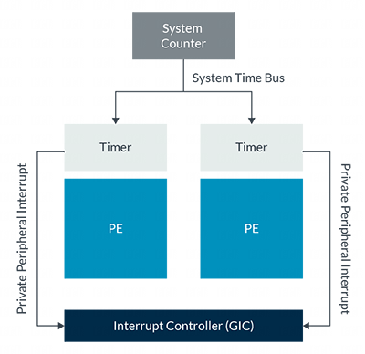

通用定时器为 Arm core 提供了一个标准化的定时器框架. 通用定时器包括**一个系统计数器**和一组 **per-core 的定时器**, 如下图所示:

**系统计数器**是一个**始终开启的设备**, 它提供一个**固定频率递增**的**系统计数值**. 系统计数值会广播到系统中的所有 core, 为 core 提供一个关于时间流逝的共同视图. 系统计数值的宽度在 56 位到 64 位之间. 从 `Armv8.6-A` 和 `Armv9.1-A` 开始, 计数的**频率固定**为 **1GHz**. 在 Armv8.6-A 之前, 计数频率是一个**系统设计选择**, 通常在 1MHz 到 50MHz 的范围内.

> **通用定时器**仅用于测量**时间的流逝**, 它**不会报告具体的时间或日期**. 通常, 一个系统芯片 (SoC) 还会包含一个**实时时钟**(RTC), 用于提供时间和日期信息.

每个 core 都有一组定时器. 这些定时器是**比较器**, 它们会与系统计数器提供的广播系统计数值进行比较. 软件可以配置定时器, 以便在未来的某个设定时间点生成中断或事件. 软件还可以使用系统计数值来添加时间戳, 因为系统计数值为所有 core 提供了一个共同的参考点.

在本指南中, 我们将解释定时器和系统计数器的操作和配置.
