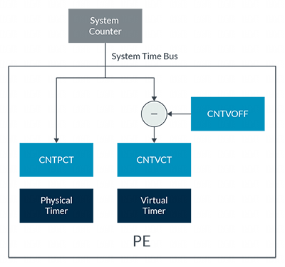

前面, 我们介绍了处理器中找到的不同定时器. 这些定时器可以分为两组: 虚拟定时器和物理定时器.

物理定时器, 例如 EL3 物理定时器 CNTPS, 与系统计数器提供的计数值进行比较. 这个值被称为物理计数, 由 CNTPCT_EL0 报告.

虚拟定时器, 例如 EL1 虚拟定时器 CNTV, 与虚拟计数进行比较. 虚拟计数的计算公式为:

```
Virtual Count = Physical Count - <offset>
```

偏移值在 CNTVOFF_EL2 寄存器中指定, 该寄存器仅可在 EL2 或 EL3 级别访问. 这种配置如下图所示:

<div align='center'>

</div>

> 如果未实现 EL2, 偏移值固定为 0. 这意味着虚拟计数值和物理计数值始终相同.

虚拟计数允许虚拟机监控程序 (Hypervisor) 向虚拟机 (VM) 显示虚拟时间. 例如, 当虚拟机未被调度运行时, Hypervisor 可以使用偏移值来隐藏这段时间内的计数. 这意味着虚拟计数可以表示虚拟机实际经历的时间, 而不是真实时间(wall clock time).
