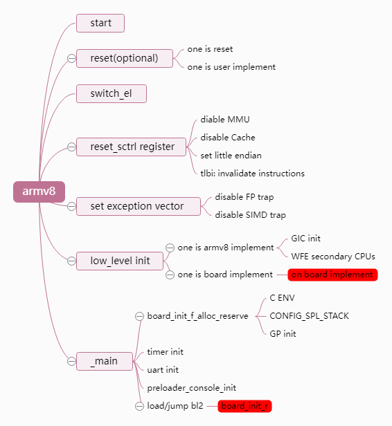

- [1. 背景](#1-背景)
- [2. secure and non-secure booting](#2-secure-and-non-secure-booting)
- [3. boot high-level](#3-boot-high-level)
  - [3.1. SoC ROM Bootloader](#31-soc-rom-bootloader)
  - [3.2. First stage bootloader (SPL/MLO)](#32-first-stage-bootloader-splmlo)
  - [3.3. Second Stage Bootloader](#33-second-stage-bootloader)
- [4. boot low-level](#4-boot-low-level)
  - [4.1. SoC ROM Bootloader](#41-soc-rom-bootloader)
    - [4.1.1. BootROM 的硬件支持](#411-bootrom-的硬件支持)
    - [4.1.2. BootROM 里面](#412-bootrom-里面)
      - [4.1.2.1. Public BootROM](#4121-public-bootrom)
      - [4.1.2.2. Secure BootROM](#4122-secure-bootrom)
    - [4.1.3. BootROM 初始化](#413-bootrom-初始化)
    - [4.1.4. Booting 过程](#414-booting-过程)
      - [4.1.4.1. memory booting](#4141-memory-booting)
      - [4.1.4.2. peripheral booting](#4142-peripheral-booting)
    - [4.1.5. 总结](#415-总结)
  - [4.2. First Stage Bootloader(SPL/MLO)](#42-first-stage-bootloadersplmlo)
    - [4.2.1. ARMv7 uboot-spl analysising](#421-armv7-uboot-spl-analysising)
      - [4.2.1.1. \_start](#4211-_start)
      - [4.2.1.2. reset](#4212-reset)
      - [4.2.1.3. cpu\_init\_cp15](#4213-cpu_init_cp15)
      - [4.2.1.4. cpu\_init\_crit](#4214-cpu_init_crit)
      - [4.2.1.5. \_main](#4215-_main)
      - [4.2.1.6. Jumping to BL2](#4216-jumping-to-bl2)
    - [4.2.2. ARMv8 uboot-spl analysising](#422-armv8-uboot-spl-analysising)
      - [4.2.2.1. ARMv8 uboot-spl entrypoint](#4221-armv8-uboot-spl-entrypoint)
      - [4.2.2.2. switch\_el and set register](#4222-switch_el-and-set-register)
      - [4.2.2.3. set vector](#4223-set-vector)
      - [4.2.2.4. lowlevel\_init](#4224-lowlevel_init)
      - [4.2.2.5. \_main](#4225-_main)
- [5. Ref](#5-ref)

ARMv7/v8 non-secure Boot Flow

# 1. 背景

从学习 uboot 开始, 就误以为一个板子的开启, 上电后的所有操作都是 **uboot** 来做的, 那时候只关注于 uboot 能把内核引导成功; 工作之后又接触到了 secure boot, 而在我们的 secure boot 设计中有好几级引导, 我知道了 boot 并不是只限于 uboot, 我们可以根据工程的需要设计多级的 boot; 再当学到 SoC 上面的知识的时候, 在 boot 阶段除了引导之外还有很多很多工作要做.

因此, 我决定把 boot 这块所有的相关的内容整理出来, 顺便把 secure boot 的一些做法写出来, 看看在 boot 哪个阶段, 我们可以用 secure boot.

# 2. secure and non-secure booting

我们在 [^9] 中介绍了 ARMv8 架构下面 ATF 启动的的过程. 实际上 **ATF** 是 arm 为了**增强系统安全性**引入的一种**可信性固件**.

我们要使用 ARMv7/v8 的**secure 安全 feature**, 就必须要使用 **ATF** 作为**先前引导**, 再由 ATF 引导 uboot 的启动.

而 uboot 嵌入式系统的通用引导程序, 其**历史比 ATF 更加久远**, 而且可以支持平台和架构更多. 在 ARM 架构上, **uboot** 在**默认**情况下并**不需要**与 **ATF** 共同启动, 而且 uboot 的自身设计就支持**完整的多级启动链**(包含 **SPL**, **TPL** 和 **uboot** 三个阶段), 但**无法使能 ARM 的 secure 执行状态**. 因此, **uboot 可以在不使用安全 feature 的情况下独立完成 ARMv7/v8 的启动引导工作**.

**non-secure** 的流程完整流程如图所示, 主要被分为 4 个部分:

<div align='center'>

</div>

* 第一个 **bootrom**(or XIP)阶段, 启动链一般由 bootrom 中的 SoC Bootloader 开始

* 接着加载 **SPL** 作为**第二级**启动镜像 BL2, 主要作用完成一些基础模块和 DDR 的初始化.

* **TPL** 是 **uboot** 引申出来的一级引导, 由于 SPL 是要被放到**SoC**里面的**SRAM**执行的, 但是**由于 SRAM 空间有限**, 故将 SPL 内部的功能进行拆分完成, (这个在 uboot 文档中介绍)主要给 **PowerPC** 这种**空间不足**的架构平台使用的, 而 ARM 平台**很少定义 TPL** [^10].

在 ARM 平台的流程如图所示:

<div align='center'>

</div>

当不需要支持 tpl, 则 uboot 的典型启动流程可精简为如下方式

* **Option A**(这也是 uboot 最常见的运行方式).

* 当然, 对于有些**启动速度要求较高**的场景, 还可以进一步简化其启动流程. 可将其设计为下面这种**跳过 uboot**, 直接通过 **SPL 启动操作系统**的方式, 此时其启动流程如 Option B.

对于 ATF 和 uboot 组合方式启动的方法和流程请参考 [^9]. 这篇文章核心点默认为 booting with non-secure 的流程.

# 3. boot high-level

<div align='center'>

</div>

boot 阶段整体的 overview 可以如上图所示, 我们把 boot 阶段分为两大部分:

* **Bootloader Phase**

* **Kernel Phase** (or Little Kernel Phase)

在 Bootloader 阶段我们又分为三个过程.

## 3.1. SoC ROM Bootloader

* **SoC ROM bootloader** [^6].

当一个处理器上电之后, 在 SoC ROM bootloader 中开始执行所谓的**上电第一段代码**, 主要工作就是

* 对 CPU 进行一系列的初始化, 包括: **CPU secure boot 初始化**, **栈的建立**, **MPU**, 还有各个子模块的**锁相环时钟的初始化**;

* 并且**读取 pin 引脚**决定从**哪个地方启动**,

* 除此之外还要根据硬件引脚**从哪里启动的配置**来加载 `First stage bootloader`(**第一阶段的 bootloader**) 到 **SoC internal RAM** (不是外部 RAM)

* 最后 **SoC ROM bootloader** 跳转到 **First stage bootloader**, 把控制权交由 First stage bootloader.

这里需要注意的是, **SoC ROM bootloader** 的**自己的引导程序**也是从 **BootROM** 中加载到内部的 **SoC internal RAM**(不是外部 RAM) 中执行的.

## 3.2. First stage bootloader (SPL/MLO)

**First stage bootloader** [^6][^7] (**第一阶段的启动器**), 也被称为 **SPL(Secondary Program Loader)** (**第二个程序的加载器**).

因为这部分的工作主要负责把 `Second Stage Bootloader` (**第二阶段的启动器**) 复制到 **external RAM** (外部 RAM) 中, 并且跳转到 `Second Stage Bootloader` 上, 所以也称为 **MLO(Memory Loader)**.

在 **ARMv8-A** 中启动 **secure boot**, **SPL** 负责加载 **arm-tf** 或者 **op-tee** 的启动[^4].

## 3.3. Second Stage Bootloader

* `Second Stage Bootloader`(**第二阶段的启动器**). uboot 在这里.

它的工作就比较多了, 而且由于在**外部的 RAM** 上有足够大的空间, 这部分**甚至**都可以支持**文件系统**来完成配置, 查找 Linux 内核和设备树, 最终完成**操作系统引导**(**通常 uboot 就在这一层次**).

在某些情况下, second stage bootloader 引导**嵌套引导**使用, 例如在 ARMv7 架构中, SPL 加载完 u-boot 之后, 可以选择使用 u-boot 再去 boot op-tee[^4].

# 4. boot low-level

我们以 TI 的 AM335x microprocessor(Cortex-A8)为例子, 其他的嵌入式设备大同小异.

注意, 我们讲述的角度是以 SoC 的角度来说明的, 因此这个层级和 boot 开发者不一致, 我们比 boot 开发者要多考虑一级, 比如 SoC 的初始化, 正常这部分是有**芯片厂家编写**, **boot 开发者**并**不需要关心**这部分, 但如果我们的产业层级就是芯片厂家, 那么这部分还是需要关注的. 如果你和 boot 开发者交流技术, 一定要注意他说的第一级的引导可能是你说的第二级引导.

## 4.1. SoC ROM Bootloader

### 4.1.1. BootROM 的硬件支持

<div align='center'>

</div>

上面是 AM335x 的结构[^1], 在 bootloader 比较关心的就是 **176KB** 的 **ROM**(里面**包含了**分配给我们的 **BootROM**), 还有 **64KB** 的 **CPU 载 RAM**, 及 **64KB** 的 SoC 内部 **shared RAM**.

<div align='center'>

</div>

在 [^2] 117 页找到关于芯片的 Memory Map 的章节, 可以看到 **BootROM 分配大小**是  `128KB + 48KB`, 刚好等于 **176KB 上图的大小**. 这个 BootROM 存储的就是**引导程序**. 对于这部分 ROM 的分配,

* **128KB** 是给 **secure booting** 的;

* **48KB** 是 **public boot ROM**.

如图所示[^2] 5022 页.

<div align='center'>

</div>

### 4.1.2. BootROM 里面

#### 4.1.2.1. Public BootROM

我们来看一下 TI 的设计, 图片展示的是在 **48KB 的 public bootrom** 中的软件架构图,

<div align='center'>

</div>

可以看出 Public BootROM 是一个比较大和丰富的程序, 并不是想象中一个精简的程序.

* High-level 主要就是封装了 **clocks**, **booting**, 还有**文件系统**等等等等接口

* driver 中就是 UART, USB, SPI 这些外设的支持;

* TI 也采用 **HAL 层**来**隔离硬件和软件**.

**这些代码是由 TI 来写的, 在制作 SoC 之前, 就会被固化到芯片中, 后续量产并无法修改**.

这里还需要注意 `SEC_ENTRY`, 在 ARM 架构上面根据 trustzone 技术的要求, **BootROM 的执行模式**需要在 **EL3** 特权等级. 从 TI 的文档中可以猜测, 这部分 `SEC_ENTRY` 是一个**开启异常**的操作, 需要在**异常处理机制**中来**处理 secure boot**.

#### 4.1.2.2. Secure BootROM

由于 **MPU**(`memory protection unit`)[^3]的要求, 所以 **SoC 在启动的时候总是被要求以安全模式启动**.

> 哪怕是 non secure mode.

**TI 在这里并没有给出 secureboot 如何设计的**.

**Secure ROM 代码**是在 **reset handler 异常处理机制**中实现的(**trustzone 要求**), 当通过了 **Secure ROM 的代码**之后, 才会从 **0x20000** 地址再启动 **public ROM boot** 程序.

如下图展示(ROM Code Startup Sequence), SoC ROM 阶段的实际上也分为两个, 一个 **secure SoC ROM 阶段**, 还有一个是 **Public SoC ROM 阶段**.

### 4.1.3. BootROM 初始化

<div align='center'>

</div>

在 TI-AM335X 的参考设计里面

* **CPU 上电**最开始执行 **128KB** 的 **secure BootROM** 中的 **secure boot** 程序(哪怕是 non secure 启动?), 验证通过之后跳入 **public bootrom** 程序. **TI 在这里并没有给出 secureboot 如何设计的**.

* public bootrom 的程序对系统进行初始化, 建立**栈空间**, **看门狗**, **配置模块的时钟**, 接着开始 Booting 过程.

在 Secure SoC ROM 阶段, Secure ROM 中的 Secure Boot 程序会被加载到 SoC 内的 secure RAM 中执行.(通常 Secure Boot 程序包含 **Manifest**/**Pubkey HASH**/**加密后的 images**), 而且在 ARMv8 组织架构中, secure boot 要求, "**secure ROM**" + "**Root of Trust in OTP**" + "**ATF**" 组成一个**完整的授权链**.

<div align='center'>

</div>

我们再参考一下 `IMX.8`[^8] 130 页. 关于 secure boot 这块, 在 SoC 等级每家芯片厂商并不是一样的.

<div align='center'>

</div>

### 4.1.4. Booting 过程

TI 的设计是采用**遍历模式**, 基于**用户的配置**或者 **SYSBOOT** 的引脚, 列出所有设备, 进行遍历初始化, 如果发现是 memory booting 就进入到 memory booting 的流程, 发现是 periphera booting, 就进入到相应的流程.

* memory 设备是 (NOR, NAND, MMC 或者 SPI-EEPROM);

* 而 peripheral 设备是 (Ethernet, usb, UART) 等.

<div align='center'>

</div>

#### 4.1.4.1. memory booting

<div align='center'>

</div>

**memory boot** 之后就开始进入到 **image 的读取**的过程. 注意这里有个 **XIP** 的识别, XIP 是一种**不需要拷贝到 RAM** 中, 直接在 XIP 上运行程序的一种东西.

#### 4.1.4.2. peripheral booting

<div align='center'>

</div>

### 4.1.5. 总结

**我们来总结一下关于 SoC boot ROM:**

*  **初始化 SoC 时钟, 电源, 还有外设.**

*  **选择引导媒介(U 盘, TF 卡, 或者 FLASH 等)**

*  **从引导媒介中读取 SPL 级引导程序, 并且把这个部分程序加载到 SRAM 中.**

*  **如果使能了 Secure Boot, 会验证 SPL 的签名和解密 SPL 程序** (该篇重点讲 non secure boot 的流程)

*  **跳转 SPL**

## 4.2. First Stage Bootloader(SPL/MLO)

通常状况的 SPL 是一个**非常小的程序** (**64KB 以下**), 运行在 **SoC 内部的 SRAM** 上面.

SPL 通常存储在**启动媒介里面**(**XIP** 或者 **BootROM**), **因此这部分程序并不是由 soc 厂家负责开发的**. 放在启动媒介的原因是, **SPI-FLASH**, **NAND FLASH** 这些外部存储器, 都需要**相应的程序驱动**, 在 **boot 阶段**是**没有这些驱动**的, 因此 cpu 执行的第一段启动程序都是 SoC 厂家固化到启动媒介中的. 在 SPL 阶段现代处理器可以选择性的选择**引导媒介**如 **U 盘**, **TF 卡**, 相应的在 SPL 阶段还需要 load 这些**存储驱动**, 并且需要把存储媒介中的引导程序加载到 SPL 中.

补充一句, 在嵌入式板子上面经常有拨码开关用于选择从哪个地方引导 SD 卡, 从 NANDFLASH 等, 这部分代码实际上是在 BootROM 中控制, 换句话说, BootROM 也需要支持这些驱动, 而需要从存储媒介中加载的则是 SPL 和 UBOOT 两个阶段的程序.

从 uboot 工程上来看, **SPL** 复用的是 **uboot 里面的代码**[^12], 通过 `CONFIG_SPL_BUILD` 宏定义来隔离, 复用 uboot 的代码, 因此可以见得, SPL 和 uboot 本身功能有一些重复的. SPL 的编译是 uboot 的一部分, 和 `uboot.bin` 是两条编译流程, 正常来说, 会编译主题的 uboot.bin, 然后在编译 `uboot-spl`, 也就是 `uboot-spl.bin`[^13](编译过程也可以参考文献 [^13]).

本章主要参考两个文献, 文献 A<[uboot] (第三章)uboot 流程——uboot-spl 代码流程>[^14]基于 ARMv7 架构的分析, 以及文献 B <聊聊 SOC 启动 (七) SPL 启动分析>[^11] 基于 ARMv8 架构的分析.

### 4.2.1. ARMv7 uboot-spl analysising

**对于 ARMv7 在 uboot-spl 上面主要做的事情**[^14]:

* 关闭中断, 进入 SVC 模式
* 协处理的初始化 CP15
* SoC 级, 板级的初始化操作:
	* IO 初始化
	* 时钟初始化
	* 内存初始化
	* 串口 / nandflash
* 加载 BL2
* 跳转到 BL2(uboot)

我们可以注意一下 ARMv7 的整体 spl 流程如图所示:

<div align='center'>

</div>

#### 4.2.1.1. _start

armv7 架构的入口在:(https://github.com/ARM-software/u-boot/blob/master/arch/arm/cpu/u-boot-spl.lds)

`ENTRY(_start)`

```assembly
_start:
#ifdef CONFIG_SYS_DV_NOR_BOOT_CFG
    .word   CONFIG_SYS_DV_NOR_BOOT_CFG
#endif
    b   reset
```

#### 4.2.1.2. reset

https://github.com/ARM-software/u-boot/blob/master/arch/arm/cpu/armv7/start.S#L38 :

```assembly
/*************************************************************************
 *
 * Startup Code (reset vector)
 *
 * Do important init only if we don't start from memory!
 * Setup memory and board specific bits prior to relocation.
 * Relocate armboot to ram. Setup stack.
 *
*************************************************************************/

reset:
	/* Allow the board to save important registers */
	b	save_boot_params
save_boot_params_ret:
#ifdef CONFIG_ARMV7_LPAE
/*
 * check for Hypervisor support
 */
	mrc	p15, 0, r0, c0, c1, 1		@ read ID_PFR1
	and	r0, r0, #CPUID_ARM_VIRT_MASK	@ mask virtualization bits
	cmp	r0, #(1 << CPUID_ARM_VIRT_SHIFT)
	beq	switch_to_hypervisor
switch_to_hypervisor_ret:
#endif
	/*
	 * disable interrupts (FIQ and IRQ), also set the cpu to SVC32 mode,
	 * except if in HYP mode already
	 */
	mrs	r0, cpsr
	and	r1, r0, #0x1f		@ mask mode bits
	teq	r1, #0x1a		@ test for HYP mode
	bicne	r0, r0, #0x1f		@ clear all mode bits
	orrne	r0, r0, #0x13		@ set SVC mode
	orr	r0, r0, #0xc0		@ disable FIQ and IRQ
	msr	cpsr,r0

/*
 * Setup vector:
 * (OMAP4 spl TEXT_BASE is not 32 byte aligned.
 * Continue to use ROM code vector only in OMAP4 spl)
 */
#if !(defined(CONFIG_OMAP44XX) && defined(CONFIG_SPL_BUILD))
	/* Set V=0 in CP15 SCTLR register - for VBAR to point to vector */
	mrc	p15, 0, r0, c1, c0, 0	@ Read CP15 SCTLR Register
	bic	r0, #CR_V		@ V = 0
	mcr	p15, 0, r0, c1, c0, 0	@ Write CP15 SCTLR Register

#ifdef CONFIG_HAS_VBAR
	/* Set vector address in CP15 VBAR register */
	ldr	r0, =_start
	mcr	p15, 0, r0, c12, c0, 0	@Set VBAR
#endif
#endif

	/* the mask ROM code should have PLL and others stable */
#ifndef CONFIG_SKIP_LOWLEVEL_INIT
#ifdef CONFIG_CPU_V7A
	bl	cpu_init_cp15
#endif
#ifndef CONFIG_SKIP_LOWLEVEL_INIT_ONLY
	bl	cpu_init_crit
#endif
#endif

	bl	_main
```

#### 4.2.1.3. cpu_init_cp15

cpu_init_cp15, cpu_init_cp15 主要用于对 **cp15 协处理器**进行初始化, 其主要目的就是关闭其 MMU 和 TLB, 如下: https://github.com/ARM-software/u-boot/blob/master/arch/arm/cpu/armv7/start.S#L139

该过程包含:
* 使 L1 的 caches 失效, 并且使用内存屏障等待完成
* 关闭 MMU 和 Caches
* 一些 ARM 的 errata 的处理

```assembly
ENTRY(cpu_init_cp15)
	/*
	 * Invalidate L1 I/D
	 */
	mov	r0, #0			@ set up for MCR
	mcr	p15, 0, r0, c8, c7, 0	@ invalidate TLBs
	mcr	p15, 0, r0, c7, c5, 0	@ invalidate icache
	mcr	p15, 0, r0, c7, c5, 6	@ invalidate BP array
	mcr     p15, 0, r0, c7, c10, 4	@ DSB
	mcr     p15, 0, r0, c7, c5, 4	@ ISB

	/*
	 * disable MMU stuff and caches
	 */
	mrc	p15, 0, r0, c1, c0, 0
	bic	r0, r0, #0x00002000	@ clear bits 13 (--V-)
	bic	r0, r0, #0x00000007	@ clear bits 2:0 (-CAM)
	orr	r0, r0, #0x00000002	@ set bit 1 (--A-) Align
	orr	r0, r0, #0x00000800	@ set bit 11 (Z---) BTB
#ifdef CONFIG_SYS_ICACHE_OFF
	bic	r0, r0, #0x00001000	@ clear bit 12 (I) I-cache
#else
	orr	r0, r0, #0x00001000	@ set bit 12 (I) I-cache
#endif
	mcr	p15, 0, r0, c1, c0, 0

#ifdef CONFIG_ARM_ERRATA_716044
	mrc	p15, 0, r0, c1, c0, 0	@ read system control register
	orr	r0, r0, #1 << 11	@ set bit #11
	mcr	p15, 0, r0, c1, c0, 0	@ write system control register
#endif

	@.....

	mov	pc, r5			@ back to my caller
ENDPROC(cpu_init_cp15)

```

#### 4.2.1.4. cpu_init_crit

cpu_init_crit, 进行一些关键的初始化动作, 也就是平台级和板级的初始化. 其代码核心就是 lowlevel_init, 如下: https://github.com/ARM-software/u-boot/blob/master/arch/arm/cpu/armv7/start.S#L324

```assembly
ENTRY(cpu_init_crit)
	/*
	 * Jump to board specific initialization...
	 * The Mask ROM will have already initialized
	 * basic memory. Go here to bump up clock rate and handle
	 * wake up conditions.
	 */
	b	lowlevel_init		@ go setup pll,mux,memory
ENDPROC(cpu_init_crit)
```

lowlevel_init 一般是由板级代码自己实现的. 但是对于某些平台来说, 也可以使用通用的 lowlevel_init, 其定义在 [arch/arm/cpu/lowlevel_init.S](https://github.com/ARM-software/u-boot/blob/master/arch/arm/cpu/armv7/lowlevel_init.S) 中, 以 tiny210 为例, 在移植 tiny210 的过程中, 就需要在 board/samsung/tiny210 下, 也就是板级目录下面创建 lowlevel_init.S, 在内部实现 lowlevel_init.(其实只要实现了 lowlevel_init 了就好, 没必要说在哪里是实现, 但是通常规范都是创建了 lowlevel_init.S 来专门实现 lowlevel_init 函数).

arm 在默认实现中, 使用 `WEAK(lowlevel_init)` 弱符号进行定义, 用法为若其它的地方定义了同名的函数或全局变量, 则会使用重定义的值, 否则就使用 WEAK 标号中的定义. 实际上它是一个很有用的特性, 如我们可以为某个函数定义一个默认的定义, 并将其用 WEAK 关键字修饰, 当调用该函数的用户希望其使用自己定义的特殊实现时, 就可以在其它的文件中重新定义一个非 WEAK 的同名函数, 此时链接器链接时就会链接新的定义, 而自动忽略掉用 WEAK 修饰的定义, 从而可以实现函数功能的扩展, 或者用于一些 debug 操作等. 可以参考 C 实验[^15].

类似于三星平台, 会在自己 board 目录下面做自己的初始化操作:

https://github.com/ARM-software/u-boot/blob/402465214395ed26d6fa72d9b6097c7adbf6a966/board/samsung/smdkc100/lowlevel_init.S

包含了一些工作:

* 检查一些复位状态
* 关闭看门狗
* 系统时钟的初始化
* 内存, DDR 的初始化
* 串口初始化(可选)
* Nand flash 的初始化

#### 4.2.1.5. _main

spl 的 main 的主要目标是调用 board_init_f 进行先前的板级初始化动作, 在 tiny210 中, 主要设计为, 加载 BL2 到 DDR 上并且跳转到 BL2 中. DDR 在上述 lowlevel_init 中已经初始化好了.**由于 board_init_f 是以 C 语言的方式实现, 所以需要先构造 C 语言环境**. 注意:**uboot-spl 和 uboot 的代码是通用的, 其区别就是通过 CONFIG_SPL_BUILD 宏来进行区分的.** 所以以下代码中, 我们只列出 spl 相关的部分, 也就是被 CONFIG_SPL_BUILD 包含的部分.

https://github.com/ARM-software/u-boot/blob/v2018.09/arch/arm/lib/crt0.S#L66

`_main` 处理包含:

* C 语言环境, 首先设置堆栈 (only intermediate)
* 设定中间环境 (SP 和 global data)
* 重新分配向量表
* 清理. bss 段
* LED 灯显示
* 调用 `board_init_f`

```assembly
ENTRY(_main)

/*
 * Set up initial C runtime environment and call board_init_f(0).
 */

#if defined(CONFIG_SPL_BUILD) && defined(CONFIG_SPL_STACK)
	ldr	r0, =(CONFIG_SPL_STACK)
#else
	ldr	r0, =(CONFIG_SYS_INIT_SP_ADDR)
#endif
	bic	r0, r0, #7	/* 8-byte alignment for ABI compliance */
	mov	sp, r0
	bl	board_init_f_alloc_reserve
	mov	sp, r0
	/* set up gd here, outside any C code */
	mov	r9, r0
	bl	board_init_f_init_reserve

	mov	r0, #0
	bl	board_init_f

#if ! defined(CONFIG_SPL_BUILD)

/*
 * Set up intermediate environment (new sp and gd) and call
 * relocate_code(addr_moni). Trick here is that we'll return
 * 'here' but relocated.
 */

	ldr	r0, [r9, #GD_START_ADDR_SP]	/* sp = gd->start_addr_sp */
	bic	r0, r0, #7	/* 8-byte alignment for ABI compliance */
	mov	sp, r0
	ldr	r9, [r9, #GD_BD]		/* r9 = gd->bd */
	sub	r9, r9, #GD_SIZE		/* new GD is below bd */

	adr	lr, here
	ldr	r0, [r9, #GD_RELOC_OFF]		/* r0 = gd->reloc_off */
	add	lr, lr, r0
#if defined(CONFIG_CPU_V7M)
	orr	lr, #1				/* As required by Thumb-only */
#endif
	ldr	r0, [r9, #GD_RELOCADDR]		/* r0 = gd->relocaddr */
	b	relocate_code
here:
/*
 * now relocate vectors
 */

	bl	relocate_vectors

/* Set up final (full) environment */

	bl	c_runtime_cpu_setup	/* we still call old routine here */
#endif
#if !defined(CONFIG_SPL_BUILD) || defined(CONFIG_SPL_FRAMEWORK)
# ifdef CONFIG_SPL_BUILD
	/* Use a DRAM stack for the rest of SPL, if requested */
	bl	spl_relocate_stack_gd
	cmp	r0, #0
	movne	sp, r0
	movne	r9, r0
# endif
	ldr	r0, =__bss_start	/* this is auto-relocated! */

#ifdef CONFIG_USE_ARCH_MEMSET
	ldr	r3, =__bss_end		/* this is auto-relocated! */
	mov	r1, #0x00000000		/* prepare zero to clear BSS */

	subs	r2, r3, r0		/* r2 = memset len */
	bl	memset
#else
	ldr	r1, =__bss_end		/* this is auto-relocated! */
	mov	r2, #0x00000000		/* prepare zero to clear BSS */

clbss_l:cmp	r0, r1			/* while not at end of BSS */
#if defined(CONFIG_CPU_V7M)
	itt	lo
#endif
	strlo	r2, [r0]		/* clear 32-bit BSS word */
	addlo	r0, r0, #4		/* move to next */
	blo	clbss_l
#endif

#if ! defined(CONFIG_SPL_BUILD)
	bl coloured_LED_init
	bl red_led_on
#endif
	/* call board_init_r(gd_t *id, ulong dest_addr) */
	mov     r0, r9                  /* gd_t */
	ldr	r1, [r9, #GD_RELOCADDR]	/* dest_addr */
	/* call board_init_r */
#if CONFIG_IS_ENABLED(SYS_THUMB_BUILD)
	ldr	lr, =board_init_r	/* this is auto-relocated! */
	bx	lr
#else
	ldr	pc, =board_init_r	/* this is auto-relocated! */
#endif
	/* we should not return here. */
#endif

ENDPROC(_main)

```

设定 C 语言环境阶段, 使用了 2 个函数, 分别是:
* board_init_f_alloc_reserve
* board_init_f_init_reserve

代码在这个位置, 是一个 C 语言的函数:

https://github.com/ARM-software/u-boot/blob/v2018.09/common/init/board_init.c

顾名思义, 这两个函数都是为了 board_init_f 做一些储备性质的工作准备. 从 "top" 地址分配保留空间用作 "globals", 并返回所分配空间的 "bottom" 地址.

这里就不得不提一下关于 global data structure 了, 简称 GD, 可以简单理解为 uboot 的全局变量都要放在这里. 关于 GD 的结构体定义如下[^16]:

https://github.com/ARM-software/u-boot/blob/v2018.09/include/asm-generic/global_data.h

>Globally required fields are held in the global data structure. A pointer to the structure is available as symbol gd. The symbol is made available by the macro %DECLARE_GLOBAL_DATA_PTR.

```C
ulong board_init_f_alloc_reserve(ulong top)
{
    /* Reserve early malloc arena */
    /* LAST : reserve GD (rounded up to a multiple of 16 bytes) */
    top = rounddown(top-sizeof(struct global_data), 16);
	// 现将 top(也就是 r0 寄存器, 前面说过存放了暂时的指针地址), 减去 sizeof(struct global_data), 也就是预留出一部分空间给 sizeof(struct global_data)使用.
	// rounddown 表示向下 16 个字节对其

    return top;
	// 到这里, top 就存放了 GD 的地址, 也是 SP 的地址
	// 把 top 返回, 注意, 返回后, 其实还是存放在了 r0 寄存器中.
}

void board_init_f_init_reserve(ulong base)
{
    struct global_data *gd_ptr;
    int *ptr;
    /*
     * clear GD entirely and set it up.
     * Use gd_ptr, as gd may not be properly set yet.
     */

    gd_ptr = (struct global_data *)base;
	// 从 r0 获取 GD 的地址
    /* zero the area */
    for (ptr = (int *)gd_ptr; ptr < (int *)(gd_ptr + 1); )
        *ptr++ = 0;
	// 对 GD 的空间进行清零
}
```
其实 GD 在 spl 中没什么使用, 主要是用在 uboot 中, 但在 uboot 中的时候还需要另外分配空间.

#### 4.2.1.6. Jumping to BL2

在 SPL 处理流程的最后, 需要跳转到板级前期的初始化函数中, 如下代码:

`bl board_init_f`

board_init_f 需要由板级代码自己实现. 在这个函数中, tiny210 主要是实现了从 SD 卡上加载了 BL2 到 ddr 上, 然后跳转到 BL2 的相应位置上 tiny210 的实现如下: [arch/arm/mach-rockchip/rk3036-board-spl.c](https://github.com/ARM-software/u-boot/blob/v2018.09/arch/arm/mach-rockchip/rk3036-board-spl.c) 这个是 ARM 的仓库里面的 uboot, 在一些 SoC 厂商订制的 uboot 中, 会在 board 目录下面增加自己的 board_init_f 的实现, 例如, 三星 tiny210 主要是实现了 SD 卡上加载 BL2 到 ddr 上, 然后跳转到 BL2 的相应位置上的操作.

```C
#ifdef CONFIG_SPL_BUILD
void board_init_f(ulong bootflag)
{
    __attribute__((noreturn)) void (*uboot)(void);
    int val;
#define DDR_TEST_ADDR 0x30000000
#define DDR_TEST_CODE 0xaa
    tiny210_early_debug(0x1);
    writel(DDR_TEST_CODE, DDR_TEST_ADDR);
    val = readl(DDR_TEST_ADDR);
    if(val == DDR_TEST_CODE)
        tiny210_early_debug(0x3);
    else
    {
        tiny210_early_debug(0x2);
        while(1);
    }
	// 先测试 DDR 是否完成
    copy_bl2_to_ddr();
	// 加载 BL2 的代码到 ddr 上
    uboot = (void *)CONFIG_SYS_TEXT_BASE;
	// uboot 函数设置为 BL2 的加载地址上
    (*uboot)();
	// 调用 uboot 函数, 也就跳转到 BL2 的代码中
}
#endif
```

关于 copy_bl2_to_ddr 的实现, 也就是如何从 SD 卡或者 nand flash 上加载 BL2 到 DDR 上的问题, 到此, SPL 的任务就完成了, 也已经跳到了 BL2 也就是 uboot 里面去了.

### 4.2.2. ARMv8 uboot-spl analysising

**对于 ARMv8 在 uboot-spl 上面主要做的事情**[^11]:

* 设置 CPU 的状态, 如 cache, MMU, 大小端设定

* 准备 C 语言环境, 包括设定栈指针, 清空 BSS 段

* 为 GD 分配空间

* 初始化 DRAM, 并将代码拷贝到 DRAM 中执行.

* 加载 BL2

* 跳转到 BL2(uboot)

实际上 ARMv7 和 ARMv8 整体的需要做的事情基本相同, 除了一些 SoC 级别的差异外.

我们可以注意一下 ARMv8 的整体 spl 流程如图所示:

<div align='center'>

</div>

#### 4.2.2.1. ARMv8 uboot-spl entrypoint

armv8 架构的入口在:(https://github.com/ARM-software/u-boot/blob/master/arch/arm/cpu/armv8/u-boot-spl.lds#L21)

`ENTRY(_start)`

armv8 架构下的 SPL 入口函数位于 `arch/arm/cpu/armv8/start.S` 文件的_start, 它的定义如下: https://github.com/ARM-software/u-boot/blob/v2018.09/arch/arm/cpu/armv8/start.S#L19

```assembly
.globl  _start
_start:
#ifdef CONFIG_ENABLE_ARM_SOC_BOOT0_HOOK
/*
 * Various SoCs need something special and SoC-specific up front in
 * order to boot, allow them to set that in their boot0.h file and then
 * use it here.
 */
#include <asm/arch/boot0.h>
#else
    b   reset
#endif
```

它有两种情况, 一种是某些平台会定义自己特殊的启动代码, 此处我们看通用的情况, 即 else 的分支中, 它直接跳转到了 reset 处. 它的定义如下:

```assembly
reset:
    /* Allow the board to save important registers */
    b   save_boot_params
.globl  save_boot_params_ret
save_boot_params_ret:

#ifdef CONFIG_SYS_RESET_SCTRL
    # 操作 sctrl 的值, 以配置相关设置
    bl reset_sctrl
#endif
```

此处也是一处跳转指令, 它会跳转到 save_boot_params 处, 它的定义如下:

```assembly
WEAK(save_boot_params)
    b   save_boot_params_ret    /* back to my caller */
ENDPROC(save_boot_params)
```

#### 4.2.2.2. switch_el and set register

其后根据是否配置了 `CONFIG_SYS_RESET_SCTRL` 参数决定是否执行 `reset_sctrl` 的内容. 我们看下它的实现如下:

```assembly
#ifdef CONFIG_SYS_RESET_SCTRL
reset_sctrl:
    switch_el x1, 3f, 2f, 1f
3:
    mrs x0, sctlr_el3
    b   0f
2:
    mrs x0, sctlr_el2
    b   0f
1:
    mrs x0, sctlr_el1
0:
    ldr x1, =0xfdfffffa
    and x0, x0, x1

    switch_el x1, 6f, 5f, 4f
6:
    msr sctlr_el3, x0
    b   7f
5:
    msr sctlr_el2, x0
    b   7f
4:
    msr sctlr_el1, x0
7:
    dsb sy
    isb
    b   __asm_invalidate_tlb_all
    ret
#endif
```

它首先调用 switch_el 函数, 该函数的定义位于[arch/arm/include/asm/macro.h](https://github.com/ARM-software/u-boot/blob/v2018.09/arch/arm/include/asm/macro.h#L70), 我们先看下它的功能. mrs 是 arm 读取系统寄存器内容的指令, 此处它会读取 CurrentEL 寄存器的值, 该寄存器存放了 cpu 当前所处的异常等级. 它将读到的值与 0xc 比较, 该比较指令会根据比较结果设置 NZCV 标志位. 若他们的值相等, 则会设置 Z 标志位. 根据 Z 标志位判断寄存器的值是否等于 0xc, 若相等则跳转到 el3_label, 即第二个参数处, 否则继续比较, 根据相应的值跳转到不同分支.

我们再回到 reset_sctrl 的内容, 它含有 0 - 7 一共 8 个标号, 为了描述方便, 后面涉及到 EL 的分支时, 我们都以 EL1 为例描述. 在标号 1 处会将 stlr_el1 的内容读到 x0 寄存器, 然后将立即数 0xfdfffffa 加载到 x1 寄存器, 并将 x0 和 x1 执行位与操作, 即它会清除 sctlr_el1 的 bit0,bit2 和 bit24.sctlr_el1 及各 bit 的定义如下图, 从中可以看到 bit0 用于关 MMU,bit2 用于关 cache,bit24 用于选择大小端. 接下来的 switch_el 继续根据当前异常等级选择不同的分支, 在 EL1 时会执行标号 4, 该操作即是将修改好的值写回到 sctlr_el1 寄存器中.

后面是两个内存屏障的操作, 内存屏障主要用于同步内存的访问顺序, 其中 dsb 是数据内存屏障, isb 是指令内存屏障. 接下来将执行__asm_invalidate_tlb_all, 它定义在 arch/arm/cpu/armv8/tlb.S 中, 代码如下:

```assembly
ENTRY(__asm_invalidate_tlb_all)
    switch_el x9, 3f, 2f, 1f
3:  tlbi    alle3
    dsb sy
    isb
    b   0f
2:  tlbi    alle2
    dsb sy
    isb
    b   0f
1:  tlbi    vmalle1
    dsb sy
    isb
0:
    ret
ENDPROC(__asm_invalidate_tlb_all)
```

首先根据当前的 el 等级跳转到不同的标号, 我们还是看 EL1 的情况, 它执行了一条 tlbi 指令, 用于失效 tlb 中的内容, 然后执行了两条内存屏障操作并返回. tlb 是物理地址和虚拟地址转换表的高速缓存, 因为页表是存放在内存中的, 若没有 tlb 则每次虚拟地址到物理地址的转换都需要通过访问内存来获取转换信息, 显然这个速度是非常缓慢的, 因此在内存和 cpu 之间添加了一个 tlb 缓存, 用于存储最近的一些内存转换信息, 以加速对虚拟地址的操作. 与 cache 的情况类似, tlb 的内容也可能和实际的页表出现不一致, 如在页表建立之前, tlb 中的内容其实都是无效数据, 还有在进程上下文切换时, 由于每个进程的页表是独立的, 因此 tlb 中的内容也将会不一致, 因此, 在这些操作中都需要将老的 tlb 内容失效掉以防出现数据不一致的问题.

#### 4.2.2.3. set vector

代码返回到 reset_sctrl 之后的位置, 接下来会设置异常向量表, 并 disable trap 的功能, 代码如下:

```assembly
    adr x0, vectors
    switch_el x1, 3f, 2f, 1f
3:  msr vbar_el3, x0
    mrs x0, scr_el3
    orr x0, x0, #0xf            /* SCR_EL3.NS|IRQ|FIQ|EA */
    msr scr_el3, x0
    msr cptr_el3, xzr           /* Enable FP/SIMD */
#ifdef COUNTER_FREQUENCY
    ldr x0, =COUNTER_FREQUENCY
    msr cntfrq_el0, x0          /* Initialize CNTFRQ */
#endif
    b   0f
2:  msr vbar_el2, x0
    mov x0, #0x33ff
    msr cptr_el2, x0            /* Enable FP/SIMD */
    b   0f
1:  msr vbar_el1, x0
    mov x0, #3 << 20
    msr cpacr_el1, x0           /* Enable FP/SIMD */
0:
```

首先将 vectors 变量的值加载到 x0 寄存器中, vectors 定义在 arch/arm/cpu/armv8/exceptions.S 中, 代码如下, 即其定义了 cpu 的异常向量表. 对于 arm 处理器, 在发生异常时就会跳转到预先定义好的异常向量表处执行, 比如若发生了外部中断, 中断控制器 GICvx 会设置 irq 中断线引起 cpu 的 irq 异常, 此时 cpu 就会跳转到异常向量表中 irq 相关项的偏移处执行该条指令, 如此处的 `b _do_bad_irq`.     

cpu 是如何知道自己将要跳转到哪里的呢? 这就是接下来代码所做的工作了. 我们回到上面的代码中, 当异常向量表的首地址 vectors 被加载到 x0 寄存器之后, 就根据当前的异常等级跳转到相应标号处执行, 在 EL1 时会将 x0 的值写入系统寄存器 vbar_el1 中,

```assembly
    .align  11
    .globl  vectors
vectors:
    .align  7
    b   _do_bad_sync    /* Current EL Synchronous Thread */

    .align  7
    b   _do_bad_irq /* Current EL IRQ Thread */

    .align  7
    b   _do_bad_fiq /* Current EL FIQ Thread */

    .align  7
    b   _do_bad_error   /* Current EL Error Thread */

    .align  7
    b   _do_sync    /* Current EL Synchronous Handler */

    .align  7
    b   _do_irq     /* Current EL IRQ Handler */

    .align  7
    b   _do_fiq     /* Current EL FIQ Handler */

    .align  7
    b   _do_error   /* Current EL Error Handler */

_do_bad_sync:
    exception_entry
    bl  do_bad_sync
    b   exception_exit

_do_bad_irq:
    exception_entry
    bl  do_bad_irq
    b   exception_exit

_do_bad_fiq:
    exception_entry
    bl  do_bad_fiq
    b   exception_exit
    ...
```

vbar_el1 寄存器的定义如图 , 该寄存器用来保存 vector 的基地址, 因此 cpu 发生异常后就可以根据保存在该寄存器中的地址值找到相应的异常向量表了.

接下来将立即数 3 左移 20 位后写入 cpacr_el1 中, 该寄存器及其 bit20/bit21 的定义如下, 设置这两位会关闭在 EL0 和 EL1 中 SVE,SIMD 和 FP 指令的 trap 功能.

#### 4.2.2.4. lowlevel_init

代码会执行 lowlevel_init, 它在 start.s 和 lowlevel_init.S 中都有定义, 其中 start.s 中定义为 weak 类型, 其代码如下. 而 lowlevel_init.S 中是强符号定义, 我们再看 arch/arm/cpu/armv8/Makefile, 其中有一句 obj-$(CONFIG_ARCH_SUNXI) += lowlevel_init.o, 即只有在 SUNXI 架构下才会使用该定义, 其余架构下都是使用如下的 weak 定义的函数.

```text
WEAK(lowlevel_init)
    mov x29, lr         /* Save LR */                      (1)

#if defined(CONFIG_GICV2) || defined(CONFIG_GICV3)
    branch_if_slave x0, 1f                                 (2)
    ldr x0, =GICD_BASE                                     (3)
    bl  gic_init_secure                                    (4)
1:
#if defined(CONFIG_GICV3)
    ldr x0, =GICR_BASE                                     (5)
    bl  gic_init_secure_percpu                             (6)
#elif defined(CONFIG_GICV2)
    ldr x0, =GICD_BASE                                     (7)
    ldr x1, =GICC_BASE                                     (8)
    bl  gic_init_secure_percpu
#endif
#endif

#ifdef CONFIG_ARMV8_MULTIENTRY                             (9)
    branch_if_master x0, x1, 2f

    /*
     * Slave should wait for master clearing spin table.
     * This sync prevent salves observing incorrect
     * value of spin table and jumping to wrong place.
     */
#if defined(CONFIG_GICV2) || defined(CONFIG_GICV3)
#ifdef CONFIG_GICV2
    ldr x0, =GICC_BASE
#endif
    bl  gic_wait_for_interrupt
#endif

    /*
     * All slaves will enter EL2 and optionally EL1.
     */
    adr x4, lowlevel_in_el2
    ldr x5, =ES_TO_AARCH64
    bl  armv8_switch_to_el2

lowlevel_in_el2:
#ifdef CONFIG_ARMV8_SWITCH_TO_EL1
    adr x4, lowlevel_in_el1
    ldr x5, =ES_TO_AARCH64
    bl  armv8_switch_to_el1

lowlevel_in_el1:
#endif

#endif /* CONFIG_ARMV8_MULTIENTRY */

2:
    mov lr, x29         /* Restore LR */                     (10)
    ret
ENDPROC(lowlevel_init)
```

(1)该函数首先将链接寄存器的值 lr 保存到 x29 中, 然后根据中断控制器的型号分别处理. 假设我们系统中的中断控制器为 GICV3, 则会执行第二步.     
(2)branch_if_slave 定义在 rch/arm/include/asm/macro.h 中, 代码如下. 它会读取控制寄存器 mpidr_el1 的值, 然后测试它的相应字段, 以确定其是否 slave.mpidr_el1 寄存器用于在多处理器系统中标识不同的处理器, 此处就是通过对该值的判断来确定当前处理器是否为 master 的. 为了介绍方便, 后面我们都假设当前 cpu 为 master.     
(3)若当前 cpu 为 master, 则先将 GICD_BASE 的基地址加载到 x0 寄存器中     
(4)跳转到 gic_init_secure 宏中, 该宏的定义位于 arm/lib/gic_64.S 中, 它的作用是为了初始化中断控制器 gic. 我们知道 arm 处理器的外设中断是通过 irq 和 fiq 中断线触发的, 实际上在 arm 和外设之间还有一个处理中断的设备 GIC, 外设中断线连接到 GIC 上, 当其中断线触发中断时 GIC 就会接收到中断事件, 然后它根据配置情况将该中断分发给 cpu, 此时 cpu 才进入 irq 或 fiq 异常处理中断.     
(5)和 (6) 设置 GIC 对每个 cpu 相关的配置     
(9)arm 的多处理器相关的设置, 主要是 slave cpu 和 master cpu 同步相关的操作    
(10)恢复前面保存的 lr 值, 并返回

```text
.macro  branch_if_slave, xreg, slave_label
#ifdef CONFIG_ARMV8_MULTIENTRY
    /* NOTE: MPIDR handling will be erroneous on multi-cluster machines */
    mrs \xreg, mpidr_el1
    tst \xreg, #0xff        /* Test Affinity 0 */
    b.ne    \slave_label
    lsr \xreg, \xreg, #8
    tst \xreg, #0xff        /* Test Affinity 1 */
    b.ne    \slave_label
    lsr \xreg, \xreg, #8
    tst \xreg, #0xff        /* Test Affinity 2 */
    b.ne    \slave_label
    lsr \xreg, \xreg, #16
    tst \xreg, #0xff        /* Test Affinity 3 */
    b.ne    \slave_label
#endif
.endm
```

接下来就是 start.S 中的最后一段代码如下:

```text
#if defined(CONFIG_ARMV8_SPIN_TABLE) && !defined(CONFIG_SPL_BUILD)          (1)
    branch_if_master x0, x1, master_cpu
    b   spin_table_secondary_jump
    /* never return */
#elif defined(CONFIG_ARMV8_MULTIENTRY)                                      (2)
    branch_if_master x0, x1, master_cpu

    /*
     * Slave CPUs
     */
slave_cpu:
    wfe
    ldr x1, =CPU_RELEASE_ADDR
    ldr x0, [x1]
    cbz x0, slave_cpu
    br  x0          /* branch to the given address */
#endif /* CONFIG_ARMV8_MULTIENTRY */
master_cpu:                                                                (3)
    bl  _main
```

(1)它只有在非 spl 时才执行.

(2)它只有在多处理器时才执行, 若当前 cpu 为 master, 则直接跳到 (3), 否则若为 slave cpu, 则执行 wfe(wait for event) 指令, 该指令会让 cpu 休眠进入低功耗模式, 此后该 cpu 将不再活动, 直到 SEV 或 SEVL 指令唤醒它为止. 因此, 此后将只有 master cpu 会执行, 而其它的 cpu 都进入休眠模式了.
    
(3)跳转到 _main 处执行, 该函数的定义位于 `arch/arm/lib/crt0_64.S` 中. 它主要是初始化 c 语言的执行环境, crt 的意思即为 c run time.

#### 4.2.2.5. _main

`_main` 的代码如下:

```text
ENTRY(_main)

/*
 * Set up initial C runtime environment and call board_init_f(0).
 */
#if defined(CONFIG_TPL_BUILD) && defined(CONFIG_TPL_NEEDS_SEPARATE_STACK)      (1)
    ldr x0, =(CONFIG_TPL_STACK)
#elif defined(CONFIG_SPL_BUILD) && defined(CONFIG_SPL_STACK)
    ldr x0, =(CONFIG_SPL_STACK)
#else
    ldr x0, =(CONFIG_SYS_INIT_SP_ADDR)
#endif
    bic sp, x0, #0xf    /* 16-byte alignment for ABI compliance */             (2)
    mov x0, sp                                                                 (3)
    bl  board_init_f_alloc_reserve                                             (4)
    mov sp, x0                                                                 (5)
    /* set up gd here, outside any C code */
    mov x18, x0                                                                (6)
    bl  board_init_f_init_reserve                                              (7)

    mov x0, #0                                                                 (8)
    bl  board_init_f                                                           (9)

#if !defined(CONFIG_SPL_BUILD)                                                 (10)
/*
 * Set up intermediate environment (new sp and gd) and call
 * relocate_code(addr_moni). Trick here is that we'll return
 * 'here' but relocated.
 */
    ldr x0, [x18, #GD_START_ADDR_SP]    /* x0 <- gd->start_addr_sp */
    bic sp, x0, #0xf    /* 16-byte alignment for ABI compliance */
    ldr x18, [x18, #GD_BD]      /* x18 <- gd->bd */
    sub x18, x18, #GD_SIZE      /* new GD is below bd */

    adr lr, relocation_return
    ldr x9, [x18, #GD_RELOC_OFF]    /* x9 <- gd->reloc_off */
    add lr, lr, x9  /* new return address after relocation */
    ldr x0, [x18, #GD_RELOCADDR]    /* x0 <- gd->relocaddr */
    b   relocate_code

relocation_return:

/*
 * Set up final (full) environment
 */
    bl  c_runtime_cpu_setup     /* still call old routine */
#endif /* !CONFIG_SPL_BUILD */
#if defined(CONFIG_SPL_BUILD)                                               (11)
    bl  spl_relocate_stack_gd           /* may return NULL */               (12)
    /*
     * Perform 'sp = (x0 != NULL) ? x0 : sp' while working
     * around the constraint that conditional moves can not
     * have 'sp' as an operand
     */
    mov x1, sp                                                              (13)
    cmp x0, #0                                                              (14)
    csel    x0, x0, x1, ne                                                  (15)
    mov sp, x0                                                              (16)
#endif

/*
 * Clear BSS section
 */
    ldr x0, =__bss_start        /* this is auto-relocated! */               (17)
    ldr x1, =__bss_end          /* this is auto-relocated! */
clear_loop:                                                                 (18)
    str xzr, [x0], #8                                                       (19)
    cmp x0, x1                                                              (20)
    b.lo    clear_loop                                                      (21)

    /* call board_init_r(gd_t *id, ulong dest_addr) */
    mov x0, x18             /* gd_t */                                      (22)
    ldr x1, [x18, #GD_RELOCADDR]    /* dest_addr */                         (23)
    b   board_init_r            /* PC relative jump */                      (24)

    /* NOTREACHED - board_init_r() does not return */

ENDPROC(_main)
```

(1)将配置文件中设置的栈指针地址加载到 x0 寄存器中, 在 spl 中应该是 CONFIG_SPL_STACK 的值, 它一般位于 include/configs/xxx 中.


(2)将 x0 寄存器中的值清除低 4 位, 使其 16 字节对齐, 然后将它存入栈指针寄存器 sp 中, 在 armv8 中栈指针寄存器为 x31.

(3)由于 sp 中的值是做过对齐操作的, 因此将其保存到 x0 中作为函数传参, 在 armv8 中 x0 - x7 寄存器可以用于函数传参, 其中 x0 为第一个参数.

(4)调用 board_init_f_alloc_reserve 函数, 它定义在 common/init/board_init.c 中, 代码如下. 即若定义了 early malloc 功能, 则为 malloc 预留一些内存, 其中 top 就是通过 x0 传入的参数, 由于栈是向低地址伸展的, 因此将高地址留给 early malloc, 只需要将栈地址往下移即可. 在保留过之后, 继续将新的指针做 16 字节对齐. 该函数是一个 c 语言实现, 由于 c 语言需要栈的支持, 而上面的第二步已经设置了栈指针, 因此调用该函数不会有问题.

```c
ulong board_init_f_alloc_reserve(ulong top)
{
    /* Reserve early malloc arena */
#if CONFIG_VAL(SYS_MALLOC_F_LEN)
    top -= CONFIG_VAL(SYS_MALLOC_F_LEN);
#endif
    /* LAST : reserve GD (rounded up to a multiple of 16 bytes) */
    top = rounddown(top-sizeof(struct global_data), 16);

    return top;
}
```

(5)将新的指针地址保存到 SP 中, 以更新栈指针

(6)将 x0 的值暂存到 x18 中, 以腾出 x0 寄存器. 由于栈是向低地址伸展, 而步骤 7 介绍的 gd 是向高地址伸展的, 因此它是栈顶指针, 同时也是 gd 的基地址. 因此, 后续若需要使用 gd, 则可以直接从 x18 寄存器中取得它的指针.

(7)board_init_f_init_reserve 也是定义在 common/init/board_init.c 中, 代码如下. base 参数由 x0 传入, 即当前的栈指针, 将它作为 gd 的基地址, 然后将 gd 到 gd + sizeof(gd)之间的地址分配给 global data 并清空该段内存. 将 base 指针更新为 (align 16)(gd + sizeof(gd)) 的位置.

我们知道, 若前面保留了 early malloc 地址, 则 gd 就被分配到 early malloc 的最低地址处, 否则它会被分配到以 sp 为基地址的位置, 因此若定义了 early malloc, 则需要更新 malloc 指针. 因此这步的主要工作是在 early malloc 区域或者 sp 以上的区域为 gd 保留并清空一段内存空间, 若是从 early malloc 中分配的, 则随之更新 malloc 指针, 更新后的内存布局如下图所示.

<div align='center'>

</div>

```c
void board_init_f_init_reserve(ulong base)
{
    struct global_data *gd_ptr;

    /*
     * clear GD entirely and set it up.
     * Use gd_ptr, as gd may not be properly set yet.
     */

    gd_ptr = (struct global_data *)base;
    /* zero the area */
    memset(gd_ptr, '\0', sizeof(*gd));
    /* set GD unless architecture did it already */
#if !defined(CONFIG_ARM)
    arch_setup_gd(gd_ptr);
#endif
    /* next alloc will be higher by one GD plus 16-byte alignment */
    base += roundup(sizeof(struct global_data), 16);

    /*
     * record early malloc arena start.
     * Use gd as it is now properly set for all architectures.
     */

#if CONFIG_VAL(SYS_MALLOC_F_LEN)
    /* go down one 'early malloc arena' */
    gd->malloc_base = base;
    /* next alloc will be higher by one 'early malloc arena' size */
    base += CONFIG_VAL(SYS_MALLOC_F_LEN);
#endif
}
```

(8)将立即数 0 放入 x0 寄存器, 作为参数传给 board_init_f 函数     
(9)执行 board_init_f 函数, 该函数的定义在 arch/arm/lib/spl.c 中, 代码如下:

```c
void __weak board_init_f(ulong dummy)
{
}

```

该函数是一个空函数, 但也带有__weak 关键字. 与我们上面分析的一样, 它是一个弱函数, 因此各平台可以根据自己的实际需求对其进行重定义. 我们选取位于 arch/arm/cpu/armv8/fsl-layerscape/spl.c 中的定义为例, 代码如下:

```c
void board_init_f(ulong dummy)
{
    /* Clear global data */
    memset((void *)gd, 0, sizeof(gd_t));                                   (a)
    board_early_init_f();                                                  (b)
    timer_init();                                                          (c)
#ifdef CONFIG_ARCH_LS2080A                                                 (d)
    env_init();
#endif
    get_clocks();                                                          (e)

    preloader_console_init();                                              (f)

#ifdef CONFIG_SPL_I2C_SUPPORT                                              (g)
    i2c_init_all();
#endif
    dram_init();                                                           (h)
}
```

该函数主要做一些 board 基本功能相关的初始化. 如清空 gd 内存, 定时器的初始化, 获取系统时钟, 总线时钟频率, console 的初始化以及 ddr 的初始化等. 下面对各步骤做一简要介绍:

(a)清空 gd 的内存. 其中 gd 的定义位于 arch/arm/include/asm/global_data.h 中, 它会从 x18 寄存器中获取 gd 指针, 具体代码比较简单, 这里不贴了.

(b)这个函数是每个 board 特定的一些初始化操作.

(c)定时器的初始化, 对于 fsl-layerscape 平台其定义位于 arch/arm/cpu/armv8/fsl-layerscape/cpu.c 中, 感兴趣的同学可以自行参阅.

(d)与特定的配置相关

(e)获取时钟频率, 该函数的定义位于 arch/arm/cpu/armv8/fsl-layerscape/fsl_lsch2_speed.c(fsl_lsch3_speed.c)中, 它的主要功能是获取处理器 0 的 cpu 时钟频率, 总线时钟频率和 ddr 时钟频率等.

(f)该函数用于初始化串口, 其定义位于 common/spl/spl.c 中, 代码如下. 它首先根据配置信息设置串口的波特率, 然后调用 serial_init 函数初始化串口, 初始化完成后串口就可以输出信息了, 此时设置 gd 的 have_console 标志, 后续的代码可以通过判断该标志来确定当前串口是否可用, 最后若设置了相关配置, 则打印一些 spl 相关的信息.

```cpp
void preloader_console_init(void)
{
    gd->baudrate = CONFIG_BAUDRATE;

    serial_init();      /* serial communications setup */

    gd->have_console = 1;

#if CONFIG_IS_ENABLED(BANNER_PRINT)
    puts("\nU-Boot" SPL_TPL_NAME ""PLAIN_VERSION" ("U_BOOT_DATE" - "U_BOOT_TIME" "U_BOOT_TZ")\n");
#endif
#ifdef CONFIG_SPL_DISPLAY_PRINT
    spl_display_print();
#endif
}
```

(g)与特定配置相关, 不做介绍.     
(h)ddr 相关的初始化, 对于 fsl-layerscape 平台会获取 dram 的 size, 并将其存放到 gd->ram_size 中

回到_main 中, 步骤 (10) 是 uboo 重定位流程, 其在 SPL 时不执行, 故此处对其不做分析. 因为 start.s 和 crt0_64.s 都是 spl 和 uboot 共用的, 故相关函数只是通过相应的宏定义来控制代码的执行流程.

(12)spl_relocate_stack_gd, 该函数定义在 common/spl/spl.c 中. 前面我们说过 spl 一般是运行在 sram 中, 且此时的栈和 gd 数据都存放在 sram 中. 但是现在 ddr 已经初始化完成, 这时 ddr 已经可用, 我们可以将其栈和 gd 重定位到 ddr 中. 重定位的主要过程就是将栈指针, gd 指针, malloc 指针等设置到位于 ddr 中的新地址处, 然后将老的 gd 数据等拷贝到新地址处.

(13)-(16)注释写的很清楚, 将 x0 和立即数 0 比较, 若其不等于 0(NULL), 则将 sp 设置为等于 x0, 否则保持原来的值不变, 即根据上面步骤 (12) 的结果来确定是否更新栈指针.

(17)-(21)将 bss 段的内容清空. 其中 bss 段的起始地址 bss_start 和结束地址 bss_end 定义在 spl 的链接脚本 arch/arm/cpu/armv8/u-boot-spl.lds 中. 其中循环的执行步骤为:     
str xzr, [x0], #8 :xzr 为 0 寄存器(x zero register), 任何读该寄存器的操作都会返回 0,. 因此这条指令的含义是将 0 写入 x0 寄存器中内容为地址的内存中, 然后 x0 = x0 + 8.. 由于 xzr 是 64 位寄存器, 因此每次可以操作 8 个字节.

cmp x0, x1: 比较 x0 和 x1 寄存器的内容, 用来判断循环的退出条件
b.lo clear_loop: 实际执行判断, 当 x0 小于 x1, 即若未执行到 bss 段的结束地址 (__bss_end) 时, 继续跳转到 clear_loop 标号处执行循环, 否则结束循环.     

(22)该操作将 gd 指针放入 x0 寄存器中, 以作为参数传给 board_init_r 函数.     
(23)将 x18 + GD_RELOCADDR 地址的内容加载到 x1 中     
(14)调用 board_init_r 函数, 此处跳转命令为 b, 而不是 bl, 因此它不会再返回.

board_init_r 定义在 common/spl/spl.c 中, 主要作用是进行一些必要的初始化工作, 然后根据相关的配置情况, 加载并启动下一阶段的镜像(一般为 uboot). 由于该部分代码逻辑比较清晰, 此处不再过多赘述.

# 5. Ref

[^1]:[AM335x Sitara Processors datasheet.pdf](https://github.com/carloscn/doclib/blob/master/man/arm/ti/AM335x%20Sitara%20Processors%20datasheet.pdf)

[^2]:[**AM335x and AMIC110 Sitara Processors TRM.pdf**](https://github.com/carloscn/doclib/blob/master/man/arm/ti/AM335x%20and%20AMIC110%20Sitara%20Processors%20TRM.pdf)

[^3]:[**armv8m_architecture_memory_protection_unit_100699_0100_00_en.pdf**](https://github.com/carloscn/doclib/blob/master/man/arm/armv8/armv8m_architecture_memory_protection_unit_100699_0100_00_en.pdf)

[^4]:[OP-TEE 基本的从芯片设计到给客户的安全问题浅析](https://blog.csdn.net/zxpblog/article/details/107410971)

[^5]:[An Exploration of ARM TrustZone Technology](https://genode.org/documentation/articles/trustzone)

[^6]:[U-Boot 之五 详解 U-Boot 及 SPL 的启动流程](https://blog.csdn.net/ZCShouCSDN/article/details/121925283)

[^7]:[Embedded Linux Booting Process (Multi-Stage Bootloaders, Kernel, Filesystem)](https://www.youtube.com/watch?v=DV5S_ZSdK0s)

[^8]:[**i.MX 8QuadMax Applications Processor Reference Manual.pdf**](https://github.com/carloscn/doclib/blob/master/man/embedded/nxp/i.MX%208QuadMax%20Applications%20Processor%20Reference%20Manual.pdf)

[^9]:[# 02_ARMv8 ATF Secure Boot Flow (BL1/BL2/BL31)](https://github.com/carloscn/blog/issues/65)

[^10]:[uboot-REAMD.TPL](https://github.com/ARM-software/u-boot/blob/master/doc/README.TPL)

[^11]:[# 聊聊 SOC 启动(七) SPL 启动分析](https://zhuanlan.zhihu.com/p/520189611)

[^12]:[# U-boot 中 SPL 功能和源码流程分析](http://t.zoukankan.com/dylancao-p-8621789.html)

[^13]:[# [uboot] (第二章)uboot 流程——uboot-spl 编译流程](https://blog.csdn.net/ooonebook/article/details/52949584)

[^14]:[# [uboot] (第三章)uboot 流程——uboot-spl 代码流程](https://blog.csdn.net/ooonebook/article/details/52957395?spm=1001.2014.3001.5502)

[^15]:[test_strong_weak_symbol](https://github.com/carloscn/clab/tree/master/macos/test_strong_weak_symbol)

[^16]:[Develop U-Boot - Global data](https://u-boot.readthedocs.io/en/latest/develop/global_data.html)

[^17]:[]()
[^18]:[]()
[^19]:[]()


