- [1. 背景](#1-背景)
- [2. boot high-level](#2-boot-high-level)
	- [2.1. boot overview](#21-boot-overview)
	- [2.2. exception switching](#22-exception-switching)
	- [2.3. memory layout](#23-memory-layout)
- [3. SoC BL1 Booting](#3-soc-bl1-booting)
	- [3.1. el3\_entrypoint\_common flow](#31-el3_entrypoint_common-flow)
		- [3.1.1. sctlr\_el3 config](#311-sctlr_el3-config)
		- [3.1.2. cold\_boot and warm\_boot](#312-cold_boot-and-warm_boot)
		- [3.1.3. PIE dealing](#313-pie-dealing)
		- [3.1.4. exception config](#314-exception-config)
			- [3.1.4.1. exception vector](#3141-exception-vector)
			- [3.1.4.2. reset handler](#3142-reset-handler)
		- [3.1.5. platform level init](#315-platform-level-init)
		- [3.1.6. secondary cpu](#316-secondary-cpu)
		- [3.1.7. memory init](#317-memory-init)
		- [3.1.8. C env init](#318-c-env-init)
		- [3.1.9. 运行栈设置](#319-运行栈设置)
	- [3.2. bl1\_setup](#32-bl1_setup)
		- [3.2.1. bl1\_early\_platform\_setup](#321-bl1_early_platform_setup)
		- [3.2.2. bl1\_plat\_arch\_setup](#322-bl1_plat_arch_setup)
	- [3.3. bl1\_main](#33-bl1_main)
		- [3.3.1. bl1\_arch\_setup](#331-bl1_arch_setup)
		- [3.3.2. secure boot init](#332-secure-boot-init)
		- [3.3.3. bl1\_platform\_setup](#333-bl1_platform_setup)
		- [3.3.4. load image](#334-load-image)
			- [3.3.4.1. get image id](#3341-get-image-id)
			- [3.3.4.2. bl2 image load](#3342-bl2-image-load)
			- [3.3.4.3. next stage image preparing](#3343-next-stage-image-preparing)
	- [3.4. el3\_exit](#34-el3_exit)
- [4. SoC BL2 Booting](#4-soc-bl2-booting)
	- [4.1. bl2 init](#41-bl2-init)
		- [4.1.1. parameters](#411-parameters)
		- [4.1.2. exception setting](#412-exception-setting)
		- [4.1.3. set sctlr\_el1 register](#413-set-sctlr_el1-register)
		- [4.1.4. C env and stack](#414-c-env-and-stack)
	- [4.2. bl2 platform setup](#42-bl2-platform-setup)
	- [4.3. bl2 image load](#43-bl2-image-load)
		- [4.3.1. before  load](#431-before--load)
		- [4.3.2. behind load](#432-behind-load)
		- [4.3.3. params settings](#433-params-settings)
	- [4.4. bl1 handle next-image](#44-bl1-handle-next-image)
- [5. SoC BL31 Booting](#5-soc-bl31-booting)
	- [5.1. bl31 init](#51-bl31-init)
		- [5.1.1. params saving](#511-params-saving)
	- [5.2. bl31 common](#52-bl31-common)
	- [5.3. bl31 main](#53-bl31-main)
		- [5.3.1. bl31\_early\_platform\_setup2](#531-bl31_early_platform_setup2)
		- [5.3.2. bl31\_plat\_arch\_setup](#532-bl31_plat_arch_setup)
		- [5.3.3. bl31\_platform\_setup](#533-bl31_platform_setup)
		- [5.3.4. ehf init](#534-ehf-init)
		- [5.3.5. 运行时服务初始化](#535-运行时服务初始化)
- [6. bl32 start](#6-bl32-start)
- [7. bl33 booting](#7-bl33-booting)
- [8. Ref](#8-ref)

# 1. 背景

嵌入式设备启动一般从bootrom开始, 逐级加载 spl, uboot, linux, 应用程序

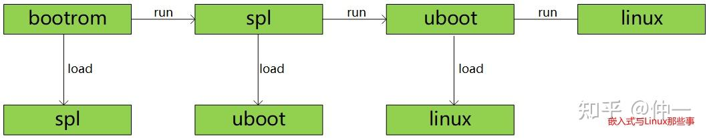

如果以上流程未执行 secure boot, 则镜像一旦被恶意攻击者替换掉 , 那么最终系统上将会运行被攻击者篡改过的固件.

假设 linux 和 rootfs 被替换掉以后, 那么启动后整个系统都将掌握在攻击者的手里. 从而导致在操作系统之上构建的所有安全机制都形同虚设.

---

ARMv8 ATF Secure Boot Flow (BL1/BL2/BL31)

ARMv7 和 ARMv8 在引导流程上面**完全不同的思路**. ARMv8 要兼容 **secure boot**, 需要在不同的异常等级做相应的处理, 而且还需要给 SoC 厂商一些可配的灵活度, 所以在 boot 上会引入不同的概念, 相应的, 比 ARMv7(及以前)设计层面的复杂度要高很多.

# 2. boot high-level

在 ARMv8 里面 boot 程序是由 **trustzone-firmware** 执行引导, 参考: https://github.com/carloscn/arm-trusted-firmware/ 里面设计 boot armv8 的所有流程.

## 2.1. boot overview

ARMv8 流程相比如 ARMv7 要的多, 包含了多个新引入的阶段, 包含 **BL1**, **BL2**, **BL3**(`BL31/32/33`), 这些阶段可以适当的进行剪裁或者添加, 并可以被编译成**独立的启动镜像**.

<div align='center'>
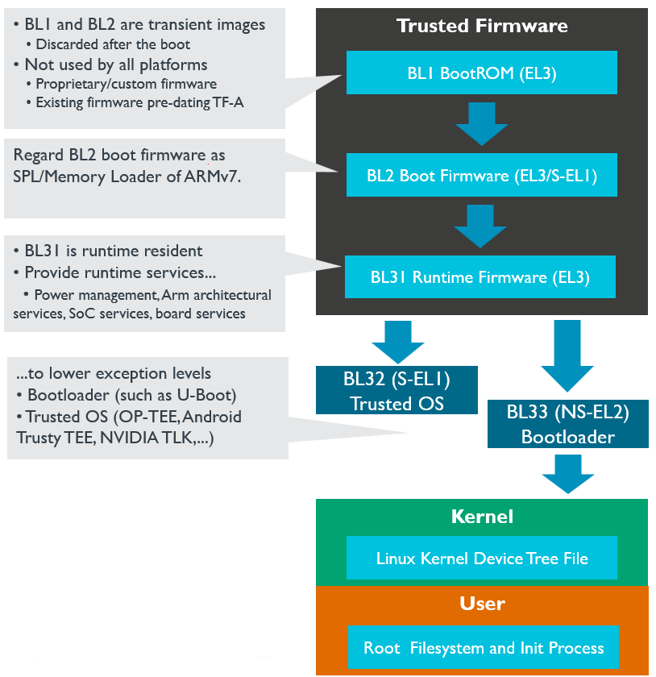
</div>

* `[BL1- BootROM]`: (boot level 1: bootrom stage) 被定义为 ARMv8 的 SoC 的启动第一阶段.

  * 若芯片支持 **XIP** 技术, 可以被存储到**片外的存储介质**上面(norflash).

  * 若 **不支持 XIP 技术**, 则需要存储在芯片的**片内 BootROM** 中(存储在 BootROM 中的代码需要在 SoC 厂商在流片的时候固化, 无法做任何修改).

  若芯片支持 secure boot, 则需要在 BootROM 中**存储**启动时候的**信任根**, 比如 **OTP** 的 **public key hash**.

  在 **BL1** 阶段, ARMv8 的异常等级为最高 **EL3** 等级. 除此之外, BL1 还需要将 BL2 的 image 并跳转. (在 BootROM 中执行, 不需要 RAM)

* `[BL2 - Boot Firmware]`: 可视为 ARMv7 SPL 的流程

	此时 **DDR 还没有初始化**, 这一步总需要被加载到**片内的 SRAM 执行**, 一般在这个阶段会**完成 DDR 的初始化**, 因此**后面的 image 可以被加载到 DDR** 中. BL3x 所有的 image 都是**由 BL2 加载**的, `BL31/BL32` 是可选的配置. 若**没有 trusted os** 可以**没有 BL2**, 若不支持 EL3 异常等级及 secure monitor, 则可以去掉 **BL31**.

	<div align='center'>
	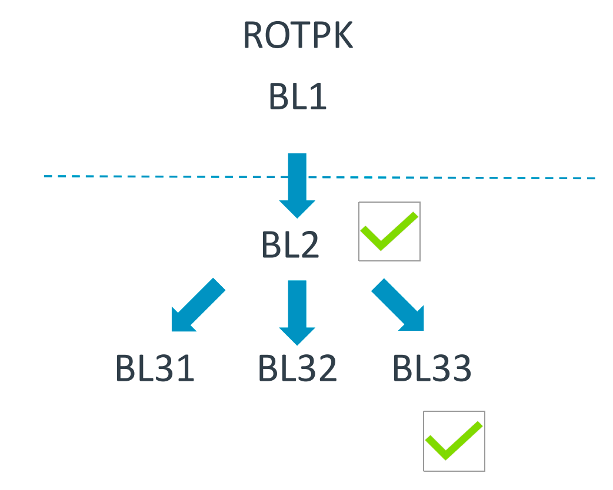
	</div>

* `[BL33 - bootloader]`: 等同于 ARMv7 的 **second stage bootloader**, 通常是 **uboot**, 由 uboot 启动 kernel. 这个步骤 SoC 处于 `EL2-non-secure` **模式**.

## 2.2. exception switching

ARMv8 关于启动的时候异常等级的切换如下所示, 假定该系统支持最高的异常等级 **EL3**, 且支持 **secure monitor** 和 **Trusted OS**, 同时 **BL2** 运行在 **Secure E1**, **EL33** 运行在 **non-seucre EL1** 的状态.

<div align='center'>
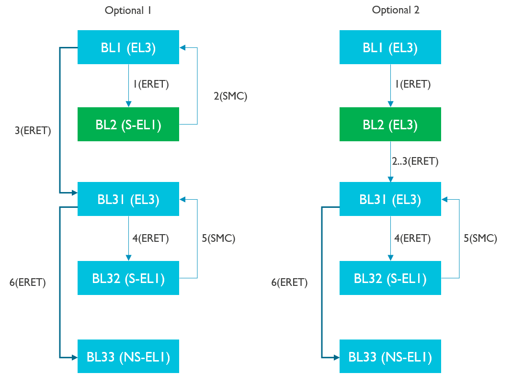
</div>

* (1) 由于 ARMv8 规定, ARM core **复位**之后进入到当前系统支持**最高的异常等级**, 因此 **BL1** 运行在 **EL3**, 它执行完毕之后会通过 **ERET** 的方式跳转到 **BL2**, 当前 BL2 处于 **S-EL1** 异常等级, 可以见得, 从 `BL1->BL2` 这个过程, 属于**降权**过程 `EL3->S.EL1`(**越过了 EL2 等级**)

* (2/3) **BL1** 引导 **BL2** 的时候根据不同的应用场景有两个形式, 这两种形式影响着 Boot 的引导模式和配置.

  * 第一种是 **BL2** 处于 `Secure-EL1` 异常等级, 在这种模式下就涉及 ARM core 的异常等级的切换.

    * 在 BL1 处于最高权限 EL3, 要进入 BL2-Secure-EL1 这种状态需要使用 **ERET** 指令, 但若要进一步引导 BL31, BL31 又回到了 EL3, **S-EL1** 只能通过 **SMC** 指令进入更高的 **EL3** 等级;

    * 而且需要注意的是, 由于 **BL31** 在这个时候还**没有注册异常处理**, 无法支持处理该异常, 因此就需要在 **BL1** 程序中初始化该异常, 帮忙**代理**处理 **BL31** 的异常处理.

    * 因此 **BL1** 在**退出之前**先设置 **smc 异常处理函数**, **BL2** 触发 **smc** 启动 **BL31** 时, **BL1** 捕获该异常并根据 **BL2** 传入的**参数**设置 **BL31** 的**入口地址**和**系统初始状态**, 并通过 **ERET** 跳转到 **BL31** 的入口地址处执;

  * 第二种, 若 **BL2** 在 **EL3** 这种应用场景, 直接通过 **ERET** 路由到 **BL31**, 前几种状态都是 EL3, 并没有涉及异常等级的切换.

* (4/5/6) **BL32** 阶段会**引导 trusted os 启动**, 它运行于 **EL1** 异常等级, **BL31** 可根据其**镜像加载信息**设置**入口地址**和**其他状态**, 完成跳转. BL32 加载完成后通过 SMC 返回到 BL31, 和 BL2 引导 BL31 的情景一致, 需要 BL31 代理处理权限变换的异常.

## 2.3. memory layout

通常的 SoC 包含 (**ROM**, **SRAM**, **DDR**), 其中

* **ROM** 和 **SRAM** 位于 SoC 内部;

* DRAM 位于 SoC 外部[^1].

它们的特点如下:

(1) ROM 中的内容断电后不会消失, 不仅可用于**代码执行**, 还可以用于**镜像存储**, 但其只有**只读权限**

(2) SRAM 和 DDR 中的内容在断电后都会消失, 因此只能被用于代码的动态执行, 而不能用于镜像存储

(3) **ROM** 和 **SRAM** 都是**直接连接总线**上, 系统上电后即可直接执行. 而 **DDR** 需要通过 **DDR phy** 和 **DDR controller** 连接到总线上, 因此使用之前必须要**先对其执行初始化操作**

根据上述各种内存的特点和前面镜像加载启动流程的需求, 在**内存规划中**我们需要考虑以下几个问题:

(1) 由于 **BL1** 需要固化到 **ROM** 中, 且是系统最先执行的, 因此 **ROM 地址**需要被映射到 cpu 的**重启地址**处

(2) 由于 ROM 是只读的, **BL1** 镜像除了**代码段**和**只读数据段**之外还包含**可读写数据段**, 这部分数据在 **BL1 启动时**需要从 ROM **重定位**到 **SRAM** 中

(3) 由于 BL1 被固化在 ROM 中, 芯片出产后就不能更改, 因此 **DDR 初始化代码不能集成到 BL1** 中. 故 **BL2** 需要被加载到 **SRAM** 中执行, 且在 **BL2** 中执行 **DDR 初始化**流程

(4) **BL2 之后的其它镜像**既可以运行于 **SRAM** 中, 也可以运行于 **DDR** 中

(5) 从前面的镜像启动流程可知, 若 **BL2** 运行于 **secure EL1** 下, 当其执行完成后, 需要通过 **smc** 再次陷入 **BL1** 去执行 **BL31** 流程, 因此 BL2 和 BL1 的地址不能有重叠

(6) BL31 除了执行启动流程外, 在系统运行过程中还会以 secure monitor 的方式驻留, 为 normal 空间的 smc 异常提供服务历程, 以及为 normal os 和 trust os 之间提供消息转发, 中断路由转发等功能. 因此, BL31 镜像需要永久驻留内存, 在系统启动完成后不能被回收

(7) 与 BL31 类似, BL32 在启动后需要驻留内存为系统提供安全相关服务, 因此为其所分配的内存也不能被回收

(8) 除此之外, BL1,BL2 和 BL33(一般为 uboot)的内存在系统启动完成后都可以被释放给操作系统使用

根据以上内存规划原则, qemu virt machine 各启动阶段的内存规划如下:

| 类型  | 起始地址    | 结束地址     | 长度  | 是否 secure 内存 | 作用           |
| ---- | ---------- | ----------- | ---- | -------------- | -------------- |
| ROM  | 0x00000000 | 0x00020000  | 128k | Yes            | BL1(bootrom)   |
| SRAM | 0x0e04e000 | 0x0e060000  | 72k  | Yes            | Bl1(rw data)   |
| SRAM | 0x0e000000 | 0x0e001000  | 4k   | Yes            | Shared ram     |
| SRAM | 0x0e01b000 | 0x0e040000  | 148k | Yes            | BL2            |
| SRAM | 0x0e040000 | 0x0e060000  | 128k | Yes            | BL31           |
| SRAM | 0x0e001000 | 0x0e040000  | 252k | YES            | BL32           |
| DDR  | 0x60000000 | 0x100000000 | 2.5G | NO             | BL33           |

# 3. SoC BL1 Booting

[^2]

BL1 是 SoC 系统启动的第一个阶段, 其主要目的是**初始化系统环境**和**启动第二阶段镜像 BL2**.

在 Trust zone firmware 里面被定义为 `Architectural initialization`,`platform initaliztion`, `firmware update detection and execution` 阶段 [^12], 顾名思义, 在这个阶段需要对整个 SoC 完成初始化. 需要包含以下流程:

* Architectural initialization
  * Exception vectors 初始化异常向量表
  * CPU initializtion CPU 初始化
  * Control register setup for aarch64 控制寄存器配置
* platform initaliztion
  * Enable the Trusted watchdog 使能看门狗
  * initialze the console 初始化控制台
  * configure the interconnect to enable hardware coherency 配置使能硬件一致性维护机制
  * enable MMU and map the memory it needs to access 使能 MMU, 映射内存
  * configure any required platform storage to load the next bootloader image(BL2) load bl2
* firmware update detection and execution

在 `bl1/bl1.ld.S` 中通过 ENTRY 标号定义为:

```cmake
OUTPUT_FORMAT(PLATFORM_LINKER_FORMAT)
OUTPUT_ARCH(PLATFORM_LINKER_ARCH)
ENTRY(bl1_entrypoint)
```

`bl_entrypoint`( https://github.com/carloscn/arm-trusted-firmware/blob/master/bl1/aarch64/bl1_entrypoint.S#L22 ) 总结的思维导图:

<div align='center'>
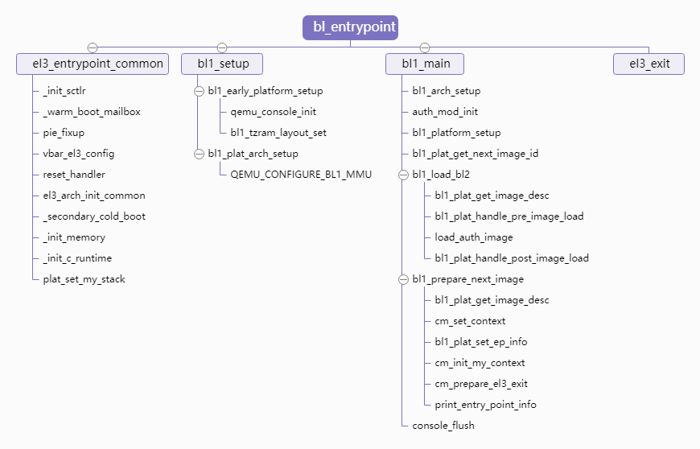
</div>

## 3.1. el3_entrypoint_common flow

```assembly
// bl1/aarch64/bl1_entrypoint.S
/* ---------------------------------------------------------------------
	* If the reset address is programmable then bl1_entrypoint() is
	* executed only on the cold boot path. Therefore, we can skip the warm
	* boot mailbox mechanism.
	* ---------------------------------------------------------------------
	*/
el3_entrypoint_common					\
	_init_sctlr=1					\
	_warm_boot_mailbox=!PROGRAMMABLE_RESET_ADDRESS	\
	_secondary_cold_boot=!COLD_BOOT_SINGLE_CPU	\
	_init_memory=1					\
	_init_c_runtime=1				\
	_exception_vectors=bl1_exceptions		\
	_pie_fixup_size=0
```

该宏所有需要在 EL3 下执行的镜像共享, 如 BL1 和 BL31 都会在入口处调用该函数, 只是传入的参数有所区别. 其主要完成的功能如下:

* 初始化 sctlr_el3 寄存器, 以初始化系统控制参数. (sctlr_el3 **系统控制寄存器**)
* 判断当前启动方式是冷启动还是热启动, 并执行相应的处理.
* PIE 相关的处理
* 设置异常向量表
* 特定 cpu 相关的 reset 处理
* 了架构相关的 el3 的初始化
* 冷启动时 secondary cpu 的处理
* c 运行环境初始化
* 初始化运行栈

### 3.1.1. sctlr_el3 config

> EL3 系统控制寄存器

关于寄存器引用一下说明[^13]:

sctlr_el3 系统控制寄存器 layout 如下, 主要提供系统 high-level 层级的状态控制信息.

<div align='center'>
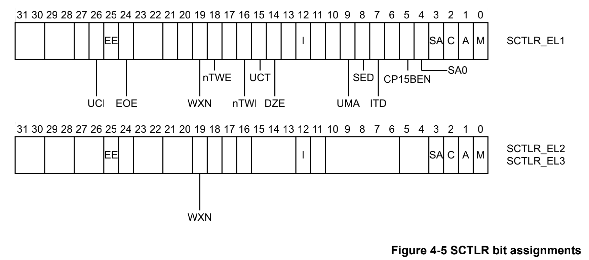
</div>

* M: 用于设置系统是否使能 EL3 下面的 MMU
* A: 用于设置是否使能 EL3 的对齐检查
* C: 用于设置 EL3 下面 d-cache
* I: 用于设置 EL3 下面的 i-cache
* WXN: 用于设置 EL3 下写权限内存是否不可执行.
* EE: 配置 EL3 的大小端

这个实现被定义在:

```assembly
// include/arch/aarch32/el3_common_macros.S
.if \_init_sctlr
	/* -------------------------------------------------------------
		* This is the initialisation of SCTLR and so must ensure that
		* all fields are explicitly set rather than relying on hw. Some
		* fields reset to an IMPLEMENTATION DEFINED value.
		*
		* SCTLR.TE: Set to zero so that exceptions to an Exception
		*  Level executing at PL1 are taken to A32 state.
		*
		* SCTLR.EE: Set the CPU endianness before doing anything that
		*  might involve memory reads or writes. Set to zero to select
		*  Little Endian.
		*
		* SCTLR.V: Set to zero to select the normal exception vectors
		*  with base address held in VBAR.
		*
		* SCTLR.DSSBS: Set to zero to disable speculation store bypass
		*  safe behaviour upon exception entry to EL3.
		* -------------------------------------------------------------
		*/
	ldr     r0, =(SCTLR_RESET_VAL & ~(SCTLR_TE_BIT | SCTLR_EE_BIT | \
			SCTLR_V_BIT | SCTLR_DSSBS_BIT))
	stcopr	r0, SCTLR
	isb
.endif /* _init_sctlr */
```

在 el1 层级主要设定包含:

* 系统的大小端
* 禁止了对齐错误, 栈对齐错误检查
* 以及禁止了可写内存的执行权限
* 其他值沿用 SCTLR_RESET_VAL 的定义

### 3.1.2. cold_boot and warm_boot

冷启动和热启动的最大区别是: **冷启动**需要**完整的系统初始化流程**, 而热启动在启动之前保存了相关的状态, 因此可以跳过这些阶段, 从而加速启动速度.

```assembly
.if \_warm_boot_mailbox
	/* -------------------------------------------------------------
		* This code will be executed for both warm and cold resets.
		* Now is the time to distinguish between the two.
		* Query the platform entrypoint address and if it is not zero
		* then it means it is a warm boot so jump to this address.
		* -------------------------------------------------------------
		*/
	bl	plat_get_my_entrypoint
	cbz	x0, do_cold_boot
	br	x0

do_cold_boot:
.endif /* _warm_boot_mailbox */
```

先通过 `plat_get_my_entrypoint` 从特定的平台获取启动地址, 若获取地址成功之后直接执行热启动流程. 若地址获取失败, 该函数会返回 0, 此时表明本次启动是冷启动, 因此需要执行冷启动启动流程.

### 3.1.3. PIE dealing

在计算机领域中, **地址无关代码** (`position-independent code`, PIC), 又称**地址无关可执行文件** (`position-independent executable`, PIE) , 是指可在 [主存储器](https://baike.baidu.com/item / 主存储器 / 10635399) 中任意位置正确地运行, 而不受其绝对地址影响的一种机器码[^14]. 在 ELF 文件中, 标定了代码段, 数据段和符合表这些地址, 而代码的执行或者访问数据的时候是需要访问这些地址的, 而加载地址和链接地址并不是同一个地址, 这个时候寻址就会失败. PIE 就是为了解决该问题.

```assembly
#if ENABLE_PIE
		/*
		 * ------------------------------------------------------------
		 * If PIE is enabled fixup the Global descriptor Table only
		 * once during primary core cold boot path.
		 *
		 * Compile time base address, required for fixup, is calculated
		 * using "pie_fixup" label present within first page.
		 * ------------------------------------------------------------
		 */
	pie_fixup:
		ldr	x0, =pie_fixup
		and	x0, x0, #~(PAGE_SIZE_MASK)
		mov_imm	x1, \_pie_fixup_size
		add	x1, x1, x0
		bl	fixup_gdt_reloc
#endif /* ENABLE_PIE */
	.endif /* _pie_fixup_size */
```

程序中的函数调用和数据读写, 若其可以转换为相对寻址的, 则将其用相对寻址方式代替绝对地址. 如 ARM64 的 adr 执行, 通过 pc+offset 的方式寻址(缺陷是寻址范围).

若地址不能转换为相对寻址, 则将其放在一个独立的段内 Global Descriptor Table(GDT), 并在镜像启动时通过实际加载地址调整这些地址值. 因此, PIE 的实现需要编译和加载的共同完成, 在构建时候添加如下选项 `-fpie`, 链接是添加选项 `-pie`. 在加载时需要对 GDT 表中内容进行调整, 以上代码就是处于这个目的.

### 3.1.4. exception config

#### 3.1.4.1. exception vector

将 **bl1** 的**异常向量表**加载到 **el3** 的**向量表基地址寄存器**(`vbar_el3`)中, 代码如下:

```assembly
	/* ---------------------------------------------------------------------
	 * Set the exception vectors.
	 * ---------------------------------------------------------------------
	 */
	adr	x0, \_exception_vectors
	msr	vbar_el3, x0
	isb
```

异常向量表在: https://github.com/carloscn/arm-trusted-firmware/blob/master/bl1/aarch64/bl1_exceptions.S

#### 3.1.4.2. reset handler

reset handler 用于执行特定 cpu 的 reset 处理函数, 这些处理函数在定义的时候会被放在一个特殊的段中, 在执行 `reset_handler` 函数时候就从该段中查找操作函数的函数指针, 并且执行相应的回调函数. 以 cortex-a53 为例子, 其 cpu ops 的定义流程如下: https://github.com/carloscn/arm-trusted-firmware/blob/master/lib/cpus/aarch64/cortex_a53.S

```assembly
lib/cpus/aarch64/cortex_a53.S:
declare_cpu_ops cortex_a53, CORTEX_A53_MIDR, \
	cortex_a53_reset_func, \
	cortex_a53_core_pwr_dwn, \
	cortex_a53_cluster_pwr_dwn

-->

include/lib/cpus/aarch64/cpu_macros.S:
.macro declare_cpu_ops _name:req, _midr:req, _resetfunc:req, \
		_power_down_ops:vararg
		declare_cpu_ops_base \_name, \_midr, \_resetfunc, 0, 0, 0, \
			\_power_down_ops
.endm

-->

include/lib/cpus/aarch64/cpu_macros.S:
.macro declare_cpu_ops_base _name:req, _midr:req, _resetfunc:req, \
                _extra1:req, _extra2:req, _e_handler:req, _power_down_ops:vararg
        .section cpu_ops, "a"
        .align 3
        .type cpu_ops_\_name, %object
        .quad \_midr
#if defined(IMAGE_AT_EL3)
        .quad \_resetfunc
#endif
        .quad \_extra1
        .quad \_extra2
        .quad \_e_handler
…
.endm
```

其中 `cpu_ops` 段的地址定义在链接脚本头文件 `include/common/bl_common.ld.h` 中, 即该地址位于 `__CPU_OPS_START__` 到 `__CPU_OPS_END__` 之间

```assembly
	/* -------------------------------------------------
	 * The CPU Ops reset function for Cortex-A53.
	 * Shall clobber: x0-x19
	 * -------------------------------------------------
	 */
func cortex_a53_reset_func
	mov	x19, x30
	bl	cpu_get_rev_var
	mov	x18, x0


#if ERRATA_A53_826319
	mov	x0, x18
	bl	errata_a53_826319_wa
#endif

#if ERRATA_A53_836870
	mov	x0, x18
	bl	a53_disable_non_temporal_hint
#endif

#if ERRATA_A53_855873
	mov	x0, x18
	bl	errata_a53_855873_wa
#endif

	/* ---------------------------------------------
	 * Enable the SMP bit.
	 * ---------------------------------------------
	 */
	mrs	x0, CORTEX_A53_ECTLR_EL1
	orr	x0, x0, #CORTEX_A53_ECTLR_SMP_BIT
	msr	CORTEX_A53_ECTLR_EL1, x0
	isb
	ret	x19
endfunc cortex_a53_reset_func
```

reset_handler 的流程比较简单, 就是查找 `__CPU_OPS_START__` 到 `__CPU_OPS_END__` 之间的 cpu_ops 结构体, 并调用其 reset_func 回调函数, 具体流程不再赘述. 对于 cortex-a53 平台, 其 reset 函数定义如下, 该流程主要是执行一些 cpu 相关的 errata 操作, 以及使能 SMP 位.

### 3.1.5. platform level init

该流程主要执行一些系统寄存器相关的配置, 以设置系统的状态. 其 aarch64 架构流程如下:

```assembly
.macro el3_arch_init_common
	mov	x1, #(SCTLR_I_BIT | SCTLR_A_BIT | SCTLR_SA_BIT)                           (1)
	mrs	x0, sctlr_el3
	orr	x0, x0, x1
	msr	sctlr_el3, x0
	isb

#ifdef IMAGE_BL31
	bl	init_cpu_data_ptr
#endif /* IMAGE_BL31 */
	mov_imm	x0, ((SCR_RESET_VAL | SCR_EA_BIT | SCR_SIF_BIT) \
			& ~(SCR_TWE_BIT | SCR_TWI_BIT | SCR_SMD_BIT))                       (2)
#if CTX_INCLUDE_PAUTH_REGS
	orr	x0, x0, #(SCR_API_BIT | SCR_APK_BIT)                                        (3)
#endif
	msr	scr_el3, x0
		mov_imm	x0, ((MDCR_EL3_RESET_VAL | MDCR_SDD_BIT | \
		      MDCR_SPD32(MDCR_SPD32_DISABLE) | MDCR_SCCD_BIT | \
		      MDCR_MCCD_BIT) & ~(MDCR_SPME_BIT | MDCR_TDOSA_BIT | \
		      MDCR_TDA_BIT | MDCR_TPM_BIT))                                    (4)

	msr	mdcr_el3, x0
	mov_imm	x0, ((PMCR_EL0_RESET_VAL | PMCR_EL0_LP_BIT | \
		      PMCR_EL0_LC_BIT | PMCR_EL0_DP_BIT) & \
		    ~(PMCR_EL0_X_BIT | PMCR_EL0_D_BIT))                                 (5)

	msr	pmcr_el0, x0
		msr	daifclr, #DAIF_ABT_BIT                                                  (6)
	mov_imm x0, (CPTR_EL3_RESET_VAL & ~(TCPAC_BIT | TTA_BIT | TFP_BIT))           (7)
	msr	cptr_el3, x0

	mrs	x0, id_aa64pfr0_el1
	ubfx	x0, x0, #ID_AA64PFR0_DIT_SHIFT, #ID_AA64PFR0_DIT_LENGTH                 (8)
	cmp	x0, #ID_AA64PFR0_DIT_SUPPORTED
	bne	1f
	mov	x0, #DIT_BIT
	msr	DIT, x0
1:
	.endm
```

* 使能 i-cache, 地址 \ 栈对齐检查
* secure 寄存器的相关配置, 主要用于设置某些操作是否路由到 EL3 执行, 如果设置 SCR_EA_BIT 会将所有的异常等级下的 external abort 和 serror 路由到 EL3 来处理.
* API 和 APK 配置用于使能指针签名特性 PAC. 由于 armv8 的虚拟地址没有完全使用, 48 位虚拟地址, 其高 16 位是空闲的, 完全可以用于存储一些其他信息. 因此 arm 支持了指针签名技术, 它通过密钥和签名算法对指针进行签名, 并将截断后的签名保存到虚拟地址的高位, 在使用该指针时则对高签名进行验证, 以确保没有被篡改. 它主要是保护栈中的数据安全, 防御 ROP JOP 攻击.
* mdcr_el3 寄存器用于设置 debug 和 performance monitor 的相关功能
* 用于设置 performance monitor 配置, 如一些性能事件计数器的行为
* 用于使能 serror 异常, 此后 bl1 能够接受 serror 异常, 并处理 SMC 调用
* 设置一些特定时间是否要陷入 EL3
* 设置 DIT 特性, 使能了 DIT, 则 DIT 相关的指令执行时间与数据不相关. 由侧道攻击可以利用某些敏感指令的执行时间和功耗来推断出数据的内容.

### 3.1.6. secondary cpu

由于启动代码不支持并发, 因此在 smp 系统中只有一个 cpu(primary cpu)执行启动流程, 而其他 cpu(scondary cpu)需要将自身设定为一个安全状态, 等待 primary cpu 启动完成之后通过 spintable 或 psci 等方式启动他们.

```assembly
bl	plat_is_my_cpu_primary                          (1)
		cbnz	w0, do_primary_cold_boot                (2)
		bl	plat_secondary_cold_boot_setup            (3)
		bl	el3_panic
do_primary_cold_boot:
```

* (1) 当前 CPU 是否为 primary CPU
* (2) 若其为 primary CPU, 继续执行 cold boot 流程
* (3) 若为 secondary CPU, 执行平台定义的 secondary CPU 启动设置函数.

### 3.1.7. memory init

执行平台的 `platform_mem_init`

### 3.1.8. C env init

C 语言运行需要依赖 stack 和 bss 段, 因此在跳转到 c 函数之前需要设置他们. 而且由于 bl1 的镜像一般烧写在 rom 中, 因此需要将其可写数据段从 rom 重定位到 ram 中. 以下代码实现:

```assembly
		adrp	x0, __RW_START__
		add	x0, x0, :lo12:__RW_START__                                    (1)
		adrp	x1, __RW_END__
		add	x1, x1, :lo12:__RW_END__
		sub	x1, x1, x0                                                     (2)
		bl	inv_dcache_range                                               (3)
        …
		adrp	x0, __BSS_START__
		add	x0, x0, :lo12:__BSS_START__
		adrp	x1, __BSS_END__
		add	x1, x1, :lo12:__BSS_END__
		sub	x1, x1, x0
		bl	zeromem                                                       (4)
        …
#if defined(IMAGE_BL1) || (defined(IMAGE_BL2) && BL2_AT_EL3 && BL2_IN_XIP_MEM)
		adrp	x0, __DATA_RAM_START__
		add	x0, x0, :lo12:__DATA_RAM_START__
		adrp	x1, __DATA_ROM_START__
		add	x1, x1, :lo12:__DATA_ROM_START__
		adrp	x2, __DATA_RAM_END__
		add	x2, x2, :lo12:__DATA_RAM_END__
		sub	x2, x2, x0
		bl	memcpy16                                                      (5)
#endif
```

* (1) 计算数据段的起始位置, 由于 adrp 指令加载地址会将低 12bit mask 掉, 使其 4k 对齐. 因此需要加上其低 12bit 的数据, 恢复其原始值.
* (2) 计算段的长度
* (3) 失效这段 sram 内存的 dcache
* (4) 获取 bss 段的起始地址, 并计算长度, 清零
* (5) 获取 bl1 可读写数据段在 rom 中的地址, 以及将要被重定位的 ram 地址, 计算数据长度, 并执行重定位操作.

### 3.1.9. 运行栈设置

C 语言的函数调用返回地址, 上层栈指针地址, 局部变量以及参数传递都可能用到栈. 本函数通过设定运行栈指针, 为跳转到 c 语言执行做准别, 其代码如下:

```assembly
msr	spsel, #0                                      (1)
		bl	plat_set_my_stack                      (2)
#if STACK_PROTECTOR_ENABLED
	.if \_init_c_runtime
	bl	update_stack_protector_canary                (3)
	.endif
#endif
```

* (1)使用 sp_el0 作为栈指针寄存器
* (2)设置运行栈, 该函数会获取一个定义好的栈指针, 并将其设置到当前栈指针寄存器 sp 中
* (3)在栈顶设置一个 canary 值, 用于检测栈溢出.

## 3.2. bl1_setup

这部分是关于平台初始化的代码, 主要调用的子函数:

* `bl1_early_platform_setup` 函数

* `bl1_plat_arch_setup` 函数

### 3.2.1. bl1_early_platform_setup

这部分代码都是平台相关部分的实现, 我们从 arm-trusted-firmware 中搜寻到这部分代码的实现, 全部都是在 plat 目录, 而且这部分在文档中也提出了要求.

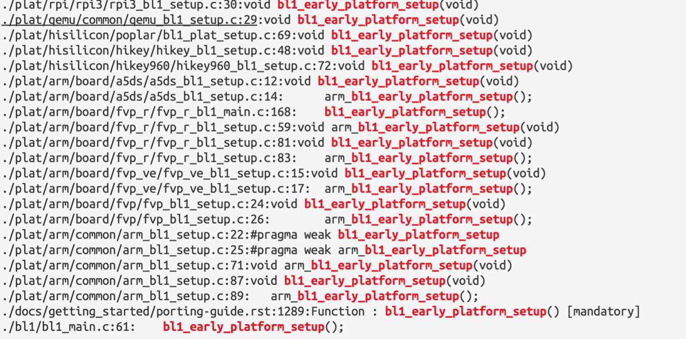

```tex
Function : bl1_early_platform_setup() [mandatory]
~~~~~~~~~~~~~~~~~~~~~~~~~~~~~~~~~~~~~~~~~~~~~~~~~
::
    Argument : void
    Return   : void
This function executes with the MMU and data caches disabled. It is only called
by the primary CPU.
On Arm standard platforms, this function:
-  Enables a secure instance of SP805 to act as the Trusted Watchdog.
-  Initializes a UART (PL011 console), which enables access to the ``printf``
   family of functions in BL1.
-  Enables issuing of snoop and DVM (Distributed Virtual Memory) requests to
   the CCI slave interface corresponding to the cluster that includes the
   primary CPU.
```

我们来参考一下 marvell 的:

```c
/*
 * BL1 specific platform actions shared between Marvell standard platforms.
 */
void marvell_bl1_early_platform_setup(void)
{
	/* Initialize the console to provide early debug support */
	marvell_console_boot_init();

	/* Allow BL1 to see the whole Trusted RAM */
	bl1_ram_layout.total_base = MARVELL_BL_RAM_BASE;
	bl1_ram_layout.total_size = MARVELL_BL_RAM_SIZE;
}
```

这部分的实现就是:

* 控制台初始化
* 设置 secure ram 的内存地址范围.

### 3.2.2. bl1_plat_arch_setup

同样的 bl1_plat_arch_setup 也是需要交给平台来 porting 的代码, 在 trusted firmware 内部, 要求的是:

>Function : bl1_plat_arch_setup() [mandatory]
>
>This function performs any platform-specific and architectural setup that the
>platform requires. Platform-specific setup might include configuration of
>memory controllers and the interconnect.
>
>In Arm standard platforms, this function enables the MMU.
>
>This function helps fulfill requirement 2 above.

```c
/*
 * Perform the very early platform specific architecture setup shared between
 * MARVELL standard platforms. This only does basic initialization. Later
 * architectural setup (bl1_arch_setup()) does not do anything platform
 * specific.
 */
void marvell_bl1_plat_arch_setup(void)
{
	marvell_setup_page_tables(bl1_ram_layout.total_base,
				  bl1_ram_layout.total_size,
				  BL1_RO_BASE,
				  BL1_RO_LIMIT,
				  BL1_RO_DATA_BASE,
				  BL1_RO_DATA_END
#if USE_COHERENT_MEM
				, BL_COHERENT_RAM_BASE,
				  BL_COHERENT_RAM_END
#endif
				);
	enable_mmu_el3(0);
}
```

该函数用于为所有 bl1 需要访问地址建立 MMU 页表, 并且使能 d-cache. 注意, bl1 中的物理地址和虚拟地址属于恒等映射, 之所以开启 MMU 主要是为了开启 D-cache, 以加快后面 BL2 镜像加载速度.

## 3.3. bl1_main

`bl1_main` 函数属于真正意义的进入到了 bl1 的启动流程, 前面都是做一些准备工作. `bl1_main` 需要做的工作是:

* 合法性检查, 包括一些寄存器的配置, cache writeback granule
* Ensure that MMU/Caches and coherency are turned on
* Perform remaining generic architectural setup from EL3
* Initialize authentication module
* Initialize the measured boot
* Perform platform setup in BL1.
* Get the image id of next image to load and run.
* Teardown the measured boot driver

```cpp
// bl1/bl1_main.c
/*******************************************************************************
 * Function to perform late architectural and platform specific initialization.
 * It also queries the platform to load and run next BL image. Only called
 * by the primary cpu after a cold boot.
 ******************************************************************************/
void bl1_main(void)
{
	unsigned int image_id;

	/* Announce our arrival */
	NOTICE(FIRMWARE_WELCOME_STR);
	NOTICE("BL1: %s\n", version_string);
	NOTICE("BL1: %s\n", build_message);

	INFO("BL1: RAM %p - %p\n", (void *)BL1_RAM_BASE, (void *)BL1_RAM_LIMIT);

	print_errata_status();

#if ENABLE_ASSERTIONS
	u_register_t val;
	/*
	 * Ensure that MMU/Caches and coherency are turned on
	 */
#ifdef __aarch64__
	val = read_sctlr_el3();
#else
	val = read_sctlr();
#endif
	assert((val & SCTLR_M_BIT) != 0);
	assert((val & SCTLR_C_BIT) != 0);
	assert((val & SCTLR_I_BIT) != 0);
	/*
	 * Check that Cache Writeback Granule (CWG) in CTR_EL0 matches the
	 * provided platform value
	 */
	val = (read_ctr_el0() >> CTR_CWG_SHIFT) & CTR_CWG_MASK;
	/*
	 * If CWG is zero, then no CWG information is available but we can
	 * at least check the platform value is less than the architectural
	 * maximum.
	 */
	if (val != 0)
		assert(CACHE_WRITEBACK_GRANULE == SIZE_FROM_LOG2_WORDS(val));
	else
		assert(CACHE_WRITEBACK_GRANULE <= MAX_CACHE_LINE_SIZE);
#endif /* ENABLE_ASSERTIONS */

	/* Perform remaining generic architectural setup from EL3 */
	bl1_arch_setup();

	crypto_mod_init();

	/* Initialize authentication module */
	auth_mod_init();

	/* Initialize the measured boot */
	bl1_plat_mboot_init();

	/* Perform platform setup in BL1. */
	bl1_platform_setup();

#if ENABLE_PAUTH
	/* Store APIAKey_EL1 key */
	bl1_apiakey[0] = read_apiakeylo_el1();
	bl1_apiakey[1] = read_apiakeyhi_el1();
#endif /* ENABLE_PAUTH */

	/* Get the image id of next image to load and run. */
	image_id = bl1_plat_get_next_image_id();

	/*
	 * We currently interpret any image id other than
	 * BL2_IMAGE_ID as the start of firmware update.
	 */
	if (image_id == BL2_IMAGE_ID)
		bl1_load_bl2();
	else
		NOTICE("BL1-FWU: *******FWU Process Started*******\n");

	/* Teardown the measured boot driver */
	bl1_plat_mboot_finish();

	bl1_prepare_next_image(image_id);

	console_flush();
}
```

### 3.3.1. bl1_arch_setup

```C
void bl1_arch_setup(void) {
	write_scr_el3(read_scr_el3() | SCR_RW_BIT);
}
```

该函数的作用为将**下一个异常等级**的**执行状态**设置为 **aarch64**

### 3.3.2. secure boot init

Secure boot 用于校验镜像的合法性, 它通常需要一个包含镜像签名信息的镜像头. 签名信息可在打包时完成, 一般包括计算镜像的 hash 值, 然后使用非对称算法 (如 RSA 或 ECDSA) 对该 hash 值执行签名操作, 并将签名信息保存到镜像头中. 在系统启动时, 需要校验该签名是否合法, 若不合法表明镜像被破坏或被替换了, 因此系统需要停止启动流程.

这部分包含两个为空的实现,**一个是对加密引擎的初始化操作 crypto_mod_init, 还有 secboot 的 auth_mod_init**. 需要用户来实现这部分. 我们的 secure boot 的 bl1 的初始化就在这个位置.

### 3.3.3. bl1_platform_setup

>Function : bl1_platform_setup() [mandatory]
>
>This function executes with the MMU and data caches enabled. It is responsible
>for performing any remaining platform-specific setup that can occur after the
>MMU and data cache have been enabled.
>
>if support for multiple boot sources is required, it initializes the boot
>sequence used by plat_try_next_boot_source().
>
>In Arm standard platforms, this function initializes the storage abstraction
>layer used to load the next bootloader image.
>
>This function helps fulfill requirement 4 above.

这部分需要 SoC 厂商实现自己的平台初始化. 并声明到这里, MMU 和 d-cache 已经被打开了. 需要注意这些问题.

### 3.3.4. load image

剩下就是获取 image 的 id 和对 bl2 的镜像的加载了, 镜像加载流程包含了镜像从 storage 中的加载以及镜像合法性验证两部分, 这部分就进入到了 secboot 的真正的逻辑部分.

#### 3.3.4.1. get image id

这部分由自己 soc 厂商负责, 这个实现是 hikey, 作为一种参考.

```c
/*
 * The following function checks if Firmware update is needed,
 * by checking if TOC in FIP image is valid or not.
 */
unsigned int bl1_plat_get_next_image_id(void)
{
	int32_t boot_mode;
	unsigned int ret;

	boot_mode = mmio_read_32(ONCHIPROM_PARAM_BASE);
	switch (boot_mode) {
	case BOOT_USB_DOWNLOAD:
	case BOOT_UART_DOWNLOAD:
		ret = NS_BL1U_IMAGE_ID;
		break;
	default:
		WARN("Invalid boot mode is found:%d\n", boot_mode);
		panic();
	}
	return ret;
}
```

#### 3.3.4.2. bl2 image load

```c
desc = bl1_plat_get_image_desc(BL2_IMAGE_ID);                                          (1)
info = &desc->image_info;
err = bl1_plat_handle_pre_image_load(BL2_IMAGE_ID);                                     (2)
if (err != 0) {
	ERROR("Failure in pre image load handling of BL2 (%d)\n", err);
	plat_error_handler(err);
}
err = load_auth_image(BL2_IMAGE_ID, info);                                              (3)
if (err != 0) {
	ERROR("Failed to load BL2 firmware.\n");
	plat_error_handler(err);
}
	err = bl1_plat_handle_post_image_load(BL2_IMAGE_ID);                                     (4)
if (err != 0) {
	ERROR("Failure in post image load handling of BL2 (%d)\n", err);
	plat_error_handler(err);
}
```

它主要包含以下几部分内容:

* 获取待加载镜像描述信息. 在 atf 中, 镜像描述信息主要包含镜像 id, 镜像加载器使用的信息 image_info 和镜像跳转时使用的信息 ep_info, 其结构如下:

	<div align='center'>
	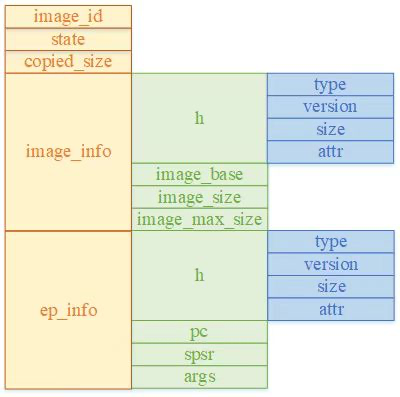
	</div>

* `bl1_plat_get_image_desc` 用于获取 bl2 镜像的信息;

* 加载之前的处理, 它由平台函数 `bl1_plat_handle_pre_image_load` 处理, qemu 平台未对其做任何处理

* 从 storage 中加载镜像, 它会根据先前获取到的 bl2 镜像描述信息, 从 storage 中将镜像数据加载到给定地址上. qemu 支持 fip 和 semihosting 类型的加载方式

* 加载之后的处理, 它主要用于设置 bl1 向 bl2 传递的参数, 上面结构体中的 args 即用于该目的, 它一共包括 8 个参数, 在 bl1 跳转到 bl2 之前会分别被设置到 x0 – x7 寄存器中. bl1 只需通过 x1 寄存器向 bl2 传送其可用的 secure 内存 region 即可. 以下为其代码主体流程:

    ```c
    image_desc = bl1_plat_get_image_desc(BL2_IMAGE_ID);
    ep_info = &image_desc->ep_info;                                        (a)
    bl1_secram_layout = bl1_plat_sec_mem_layout();                            (b)
    bl2_secram_layout = (meminfo_t *) bl1_secram_layout->total_base;
    bl1_calc_bl2_mem_layout(bl1_secram_layout, bl2_secram_layout);              (c)
    ep_info->args.arg1 = (uintptr_t)bl2_secram_layout;                           (d)
    ```

    >a 获取 bl2 的 ep 信息
    >b 获取 bl1 的 secure 内存 region
    >c 将总的内存减去 bl1 已使用的 sram 内存, 作为 bl2 的可用内存
    >d 将 bl2 的可用内存信息保存到参数传递信息中

#### 3.3.4.3. next stage image preparing

在 atf 中定义了一个异常等级切换相关的 cpu context 结构体, 该结构体包含了切换时所需的所有的信息, 如 (gp 寄存器的值, el1, el2 系统寄存器以及 el3 状态的值)等. 由于 armv8 包含 secure 和 non secure 两种安全状态, 因此在 el3 中为这两种状态分别保留了一份独立的上下文信息, 我们在执行上下文切换准备工作时, 实际上就是填充对应 security 状态的结构体内容. 以下是该结构体的定义:

```c
typedef struct cpu_context {
	gp_regs_t gpregs_ctx;
	el3_state_t el3state_ctx;
	el1_sysregs_t el1_sysregs_ctx;
#if CTX_INCLUDE_EL2_REGS
	el2_sysregs_t el2_sysregs_ctx;
#endif
#if CTX_INCLUDE_FPREGS
	fp_regs_t fpregs_ctx;
#endif
	cve_2018_3639_t cve_2018_3639_ctx;
#if CTX_INCLUDE_PAUTH_REGS
	pauth_t pauth_ctx;
#endif
} cpu_context_t;
```

`bl1_prepare_next_image` 的主要工作就是初始化 primary cpu 的 `cpu_context` 上下文, 并填充该结构体的相关信息, 其主要流程如下:

```c
desc = bl1_plat_get_image_desc(image_id);
	next_bl_ep = &desc->ep_info;                                                             (1)
	security_state = GET_SECURITY_STATE(next_bl_ep->h.attr);                                  (2)

	if (cm_get_context(security_state) == NULL)
		cm_set_context(&bl1_cpu_context[security_state], security_state);                             (3)

	if ((security_state != SECURE) && (el_implemented(2) != EL_IMPL_NONE)) {                     (4)
		mode = MODE_EL2;
	}
	next_bl_ep->spsr = (uint32_t)SPSR_64((uint64_t) mode,
		(uint64_t)MODE_SP_ELX, DISABLE_ALL_EXCEPTIONS);                                (5)

	bl1_plat_set_ep_info(image_id, next_bl_ep);
	cm_init_my_context(next_bl_ep);                                                            (6)
	cm_prepare_el3_exit(security_state);                                                          (7)
	desc->state = IMAGE_STATE_EXECUTED;
```

(1) 获取 bl2 的 ep 信息

(2) 从 bl2 的 ep 信息中获取其 security 状态

(3) 若 context 内存未分配, 则为其分配内存

(4) 默认的下一阶段镜像异常等级为其支持的最高等级, 即若支持 el2, 则下一异常等级为 EL2

(5) 计算 spsr 的值, 即异常等级为 step 4 计算的值, 栈指针使用 sp_elx, 关闭所有 DAIF 异常

(6) 该函数为待切换异常等级初始化上下文, 如 scr_el3,scr_el3,pc,spsr 以及参数传递寄存器 x0 – x7 的值

(7) 将 context 中参数设置到实际的寄存器中

## 3.4. el3_exit

该函数执行实际的**异常等级切换**流程, 包括设置 (scr_el3, spsr_el3, elr_el3) 寄存器, 以及执行 eret 指令跳转到 elr_el3 设定的 bl2 入口函数处执行. 其定义如下:

```assembly
func el3_exit
	mov	x17, sp                                                                    (1)
	msr	spsel, #MODE_SP_ELX                                                      (2)
	str	x17, [sp, #CTX_EL3STATE_OFFSET + CTX_RUNTIME_SP]                       (3)

	ldr	x18, [sp, #CTX_EL3STATE_OFFSET + CTX_SCR_EL3]
	ldp	x16, x17, [sp, #CTX_EL3STATE_OFFSET + CTX_SPSR_EL3]                      (4)
	msr	scr_el3, x18
	msr	spsr_el3, x16
	msr	elr_el3, x17                                                                 (5)

#if IMAGE_BL31
	ldp	x19, x20, [sp, #CTX_EL3STATE_OFFSET + CTX_CPTR_EL3]
	msr	cptr_el3, x19

	ands	x19, x19, #CPTR_EZ_BIT
	beq	sve_not_enabled

	isb
	msr	S3_6_C1_C2_0, x20 /* zcr_el3 */
sve_not_enabled:
#endif

#if IMAGE_BL31 && DYNAMIC_WORKAROUND_CVE_2018_3639
	ldr	x17, [sp, #CTX_CVE_2018_3639_OFFSET + CTX_CVE_2018_3639_DISABLE]
	cbz	x17, 1f
	blr	x17
1:
#endif
	restore_ptw_el1_sys_regs

	bl	restore_gp_pmcr_pauth_regs                                                      (6)
	ldr	x30, [sp, #CTX_GPREGS_OFFSET + CTX_GPREG_LR]

#if IMAGE_BL31 && RAS_EXTENSION
	esb
#else
	dsb	sy
#endif
#ifdef IMAGE_BL31
	str	xzr, [sp, #CTX_EL3STATE_OFFSET + CTX_IS_IN_EL3]
#endif
	exception_return                                                                  (7)
endfunc el3_exit
```

(1)将 sp_el0 栈指针暂存到 x17 寄存器中
(2)将栈指针切换到 sp_el3, 其中 sp_el3 指向前面 context 的 el3state_ctx 指针, 即它被用于保存 el3 的上下文
(3)将 sp_el0 的值保存的 el3 context 中
(4)从 el3 context 中加载 scr_el3,spsr_el3 和 elr_el3 寄存器的值
(5)设置 scr_el3,spsr_el3 和 elr_el3 寄存器
(6)恢复 gp 寄存器等寄存器的值
(7)执行 eret 指令, 此后 cpu 将离开 bl1 跳转到 bl2 的入口处执行了

# 4. SoC BL2 Booting

[^3]

在 ARM 的而每一个启动阶段都是单独的一个镜像, BL2 boot stage 也一样. BL2 启动流程类似于 bl1, 流程上比较简单, 但需要加载更多的 image, 由于 BL31 和 BL32 是可选的配置, 因此在 BL2 stage 还需要注意配置选项, 是否启动了 BL31 和 BL32, 还是直接引导 BL33 阶段. 另外, 还需要注意, **BL2** 可以在 **secure-EL1 层级**, 也可以被配置为 **EL3 层级**, 他们的入口函数和处理流程肯定会有一些区别, 本章参考[^3], 选取常见的 secure-EL1 的方式, 其总体执行流程:

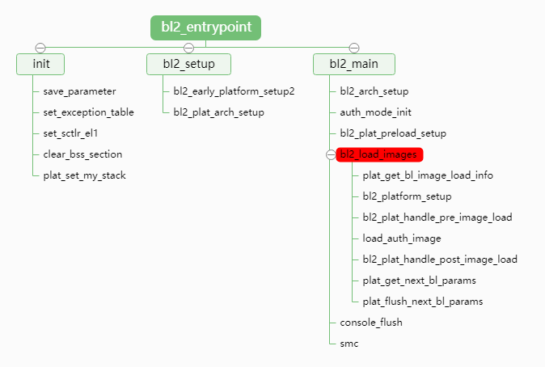

## 4.1. bl2 init

在 bl2 init 流程包包含以下过程:
* 保存参数
* 异常设置
* 设置 sctlr_el1 寄存器(EL1 系统控制寄存器)
* 初始化 bss 段
* 栈的初始化

### 4.1.1. parameters

```assembly
func bl2_entrypoint
	/*---------------------------------------------
	 * Save arguments x0 - x3 from BL1 for future
	 * use.
	 * ---------------------------------------------
	 */
	mov	x20, x0
	mov	x21, x1
	mov	x22, x2
	mov	x23, x3
```
BL1 通过 x0-x3 四个通用寄存器传递参数过来, 从这里可以看出, boot 不同的阶段并没有对寄存器的值进行 reset.bl1 阶段实际上定义了 x0~x7 寄存器向 bl2 传递参数.

### 4.1.2. exception setting

```assembly
	/* ---------------------------------------------
	 * Set the exception vector to something sane.
	 * ---------------------------------------------
	 */
	adr	x0, early_exceptions
	msr	vbar_el1, x0
	isb

	/* ---------------------------------------------
	 * Enable the SError interrupt now that the
	 * exception vectors have been setup.
	 * ---------------------------------------------
	 */
	msr	daifclr, #DAIF_ABT_BIT
```
该流程是设定 el1 异常向量表的基地址, 其定义位于 `common/aarch64/early_exceptions.S#L17` . 从其定义可知, 从定义上为空可以知道, 不会对其进行实际的处理, 而只是打印出相应的异常信息, 然后设定系统为 panic 状态.

异常向量表设定完成之后, bl2 使能 serror 和 external abort 异常, 显然这些异常一般意味着系统出现未定义指令, 空指针等严重错误, 因此需要捕获异常将系统设定为安全状态.

### 4.1.3. set sctlr_el1 register

```assembly
	/* ---------------------------------------------
	 * Enable the instruction cache, stack pointer
	 * and data access alignment checks and disable
	 * speculative loads.
	 * ---------------------------------------------
	 */
	mov	x1, #(SCTLR_I_BIT | SCTLR_A_BIT | SCTLR_SA_BIT)
	mrs	x0, sctlr_el1
	orr	x0, x0, x1
	bic	x0, x0, #SCTLR_DSSBS_BIT
	msr	sctlr_el1, x0
	isb

	/* ---------------------------------------------
	 * Invalidate the RW memory used by the BL2
	 * image. This includes the data and NOBITS
	 * sections. This is done to safeguard against
	 * possible corruption of this memory by dirty
	 * cache lines in a system cache as a result of
	 * use by an earlier boot loader stage.
	 * ---------------------------------------------
	 */
	adr	x0, __RW_START__
	adr	x1, __RW_END__
	sub	x1, x1, x0
	bl	inv_dcache_range
```
这部分和 bl1 很像, 配置如下:

* 使能 i-cache

* 对齐检查

* 栈对齐检查

### 4.1.4. C env and stack

```assembly
	/* ---------------------------------------------
	 * Zero out NOBITS sections. There are 2 of them:
	 * - the .bss section;
	 * - the coherent memory section.
	 * ---------------------------------------------
	 */
	adrp	x0, __BSS_START__
	add	x0, x0, :lo12:__BSS_START__
	adrp	x1, __BSS_END__
	add	x1, x1, :lo12:__BSS_END__
	sub	x1, x1, x0
	bl	zeromem

#if USE_COHERENT_MEM
	adrp	x0, __COHERENT_RAM_START__
	add	x0, x0, :lo12:__COHERENT_RAM_START__
	adrp	x1, __COHERENT_RAM_END_UNALIGNED__
	add	x1, x1, :lo12:__COHERENT_RAM_END_UNALIGNED__
	sub	x1, x1, x0
	bl	zeromem
#endif

	/* --------------------------------------------
	 * Allocate a stack whose memory will be marked
	 * as Normal-IS-WBWA when the MMU is enabled.
	 * There is no risk of reading stale stack
	 * memory after enabling the MMU as only the
	 * primary cpu is running at the moment.
	 * --------------------------------------------
	 */
	bl	plat_set_my_stack

	/* ---------------------------------------------
	 * Initialize the stack protector canary before
	 * any C code is called.
	 * ---------------------------------------------
	 */
#if STACK_PROTECTOR_ENABLED
	bl	update_stack_protector_canary
#endif
```

C 语言运行环境是有要求的, 我们需要注意的是:

* 对于 bss 段的初始化, 对这段空间的空间分配和清零

* 如果使用 coherent mem 区域[^15], 需要对这个区域清零 (coherent memory 是对任何硬件 GPU 或者 DMA 可见的内存地址, 一旦有一方对这个区域进行了写操作, 所有观察者都可以看见)

* 初始化 stack 区域(设定栈指针寄存器, 并把栈指针存储在 SP 里面)

* 设定 canary 值 (checksec linux 工具可以查看是否开启了 canary)

## 4.2. bl2 platform setup

它主要执行参数处理和平台初始化流程, 后面的分析我们仍然以 qemu 平台为例. 参数处理流程如下(`plat/qemu/common/qemu_bl2_setup.c`):

```cpp
meminfo_t *mem_layout = (void *)arg1;               (1)
qemu_console_init();                            	(2)
bl2_tzram_layout = *mem_layout;                     (3)
plat_qemu_io_setup();                               (4)
```

* (1)从 x1 参数中获取 bl2 的内存 layout 信息
* (2)初始化串口控制台
* (3)设置 bl2 的内存 layout 信息
* (4)初始化 qemu 的 storage 加载驱动

qemu 平台初始化主要是为 bl2 内存建立 MMU 页表, 并启动 MMU 和 dcache, 其主要目的是加快后面镜像加载的速度. 其代码如下:

```cpp
	QEMU_CONFIGURE_BL2_MMU(bl2_tzram_layout.total_base,
			      bl2_tzram_layout.total_size,
			      BL_CODE_BASE, BL_CODE_END,
			      BL_RO_DATA_BASE, BL_RO_DATA_END,
			      BL_COHERENT_RAM_BASE, BL_COHERENT_RAM_END);
```

## 4.3. bl2 image load

每一个 boot stage 实际上都有个 image load, 这个地方正好是我们 secure boot 运行的入口.

### 4.3.1. before  load

在镜像加载前需要做一些平台的准备, 因为 C 语言环境已经准备完成, 这部分已经可以运行 C 语言, 所以你看到的都是 C 代码. aarch64 架构下使能 fp 和 simd 寄存器访问权限, 其代码如下:

```C
 write_cpacr(CPACR_EL1_FPEN(CPACR_EL1_FP_TRAP_NONE));
```

剩下就是对于 secure boot 和加密引擎的初始化. auth_mod_init

### 4.3.2. behind load

Bl2 需要加载的镜像信息由平台定义, 对于 qemu 平台其定义位于 `plat/qemu/common/qemu_bl2_mem_params_desc.c` 中, 以下代码选取了其在 aarch64 架构下只加载 bl31 和 bl33 的典型配置:

```cpp
static bl_mem_params_node_t bl2_mem_params_descs[] = {
#ifdef __aarch64__
	{ .image_id = BL31_IMAGE_ID,

	  SET_STATIC_PARAM_HEAD(ep_info, PARAM_EP, VERSION_2,
				entry_point_info_t,
				SECURE | EXECUTABLE | EP_FIRST_EXE),
	  .ep_info.pc = BL31_BASE,
	  .ep_info.spsr = SPSR_64(MODE_EL3, MODE_SP_ELX,
				  DISABLE_ALL_EXCEPTIONS),
# if DEBUG
	  .ep_info.args.arg1 = QEMU_BL31_PLAT_PARAM_VAL,
# endif
	  SET_STATIC_PARAM_HEAD(image_info, PARAM_EP, VERSION_2, image_info_t,
				IMAGE_ATTRIB_PLAT_SETUP),
	  .image_info.image_base = BL31_BASE,
	  .image_info.image_max_size = BL31_LIMIT - BL31_BASE,

# ifdef QEMU_LOAD_BL32
	  .next_handoff_image_id = BL32_IMAGE_ID,
# else
	  .next_handoff_image_id = BL33_IMAGE_ID,
# endif
	},
#endif /* __aarch64__ */
	{ .image_id = BL33_IMAGE_ID,
	  SET_STATIC_PARAM_HEAD(ep_info, PARAM_EP, VERSION_2,
				entry_point_info_t, NON_SECURE | EXECUTABLE),
# ifdef PRELOADED_BL33_BASE
	  .ep_info.pc = PRELOADED_BL33_BASE,

	  SET_STATIC_PARAM_HEAD(image_info, PARAM_EP, VERSION_2, image_info_t,
				IMAGE_ATTRIB_SKIP_LOADING),
# else /* PRELOADED_BL33_BASE */
	  .ep_info.pc = NS_IMAGE_OFFSET,

	  SET_STATIC_PARAM_HEAD(image_info, PARAM_EP, VERSION_2, image_info_t,
				0),
	  .image_info.image_base = NS_IMAGE_OFFSET,
	  .image_info.image_max_size = NS_IMAGE_MAX_SIZE,
# endif /* !PRELOADED_BL33_BASE */

	  .next_handoff_image_id = INVALID_IMAGE_ID,
	}
};
```

该结构和 bl1 镜像描述比较类似, 只是多了下一个阶段的镜像 id, 以及加载参数链表的节点信息. 该结构体定义完成后需要通过以下接口注册到系统中:

```
REGISTER_BL_IMAGE_DESCS(bl2_mem_params_descs)
```

 在启动阶段, 可通过 plat_get_bl_image_load_info 获取以上镜像加载信息, 此后启动代码将遍历这些接在信息, 并分别执行以下流程分别加载和处理这些镜像

(1) `bl2_platform_setup`: 该函数用于 bl2 平台相关的设置, 如 security 设置, timer 设置以及 dtb 设置等

(2) `bl2_plat_handle_pre_image_load`: 镜像加载前平台可以执行一些其特定的流程

(3) `load_auth_image`: 该接口用于实际的镜像加载流程, 其与 bl1 的镜像加载流程完全一样

(4) `bl2_plat_handle_post_image_load`: 该接口用于设置镜像加载相关信息, qemu 平台代码如下(`plat/qemu/common/qemu_bl2_setup.c`):

```cpp
static int qemu_bl2_handle_post_image_load(unsigned int image_id)
{
	int err = 0;
	bl_mem_params_node_t *bl_mem_params = get_bl_mem_params_node(image_id);
	…
	switch (image_id) {
	case BL32_IMAGE_ID:
        …                                                                               (a)
	case BL33_IMAGE_ID:
#if ARM_LINUX_KERNEL_AS_BL33
		bl_mem_params->ep_info.args.arg0 =
			(u_register_t)ARM_PRELOADED_DTB_BASE;
		bl_mem_params->ep_info.args.arg1 = 0U;
		bl_mem_params->ep_info.args.arg2 = 0U;
		bl_mem_params->ep_info.args.arg3 = 0U;                                          (b)
#else
		bl_mem_params->ep_info.args.arg0 = 0xffff & read_mpidr();                       (c)
#endif
		bl_mem_params->ep_info.spsr = qemu_get_spsr_for_bl33_entry();                   (d)
		break;
	default:
		break;
	}

	return err;
}

```

a bl32 用于加载 trust os, 在启动流程中不是必须的, 此处暂时不讨论

b 若由 bl2 直接启动 linux, 则设置 linux 的启动参数. 我们知道 armv8 架构的 linux 启动参数都是通过 dtb 传递的, 因此这里将 dtb 地址设置为其启动参数

c 对于其它类型的 bl33(如 uboot), 则将当前处理器的 affinity 信息作为其启动参数

d 设置 bl33 的 spsr

### 4.3.3. params settings

bl2 可能会加载 bl31, bl32, bl33 镜像, 因此其需要将这些被加载镜像的信息传给下一阶段. Bl2 通过链表方式来组织这些参数, 其中每一级镜像是链表的一个节点, 其具体结构如下图所示:

<div align='center'>
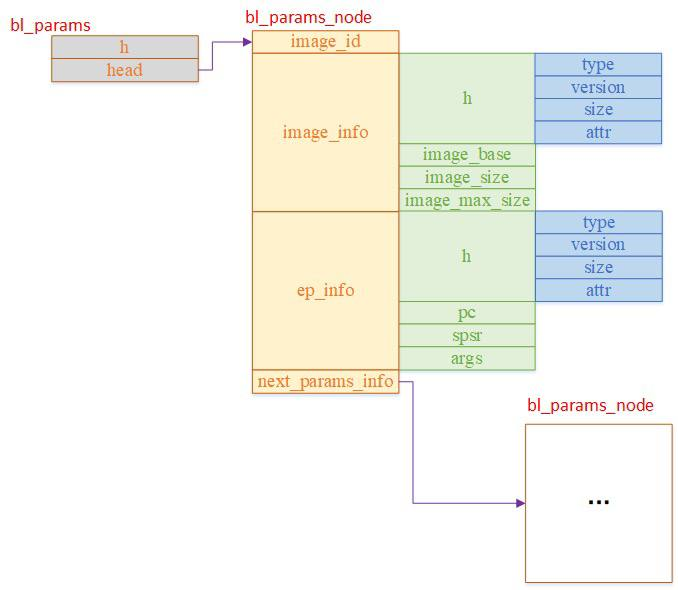
</div>

bl2 若运行在 S-EL1 下, 则镜像加载完成并准备好参数后, 需要通过 smc 异常再次进入 bl1, 由 bl1 的 smc 处理函数来执行实际的镜像切换流程. 在执行 smc 命令之前, 我们需要为其设置好参数, 上面的 bl_params->head->ep_info 会设置为 smc 的调用参数, 同时 bl_params 还需要被设置为第一级镜像的 arg0 参数, 即在启动第一级镜像 (如 bl31) 时, 通过其 x0 寄存器传给它的也是 bl_params 指针, 从而使 bl31 可以继续启动其后的镜像.

由于 bl_params 位于 sram 内存中, 而 bl2 开启了 dcache, 因此在跳转到 smc 之前, 需要将这部分数据从 cache 刷到 sram 中. 最后我们就可以调用下面的 smc 指令返回 bl1 了 :

`smc(BL1_SMC_RUN_IMAGE, (unsigned long)next_bl_ep_info, 0, 0, 0, 0, 0, 0);`

## 4.4. bl1 handle next-image

bl1 的 smc 处理流程如下:

```cpp
vector_entry SynchronousExceptionA64                -->
smc_handler64
```

其中 smc_handler64 会判断 bl2 传入的命令, 若命令为 `BL1_SMC_RUN_IMAGE`, 则从 x1 寄存器中获取下一阶段镜像的 ep_info, 执行上下文切换的准备, 并最终跳转到下一阶段镜像的入口执行. 其代码流程如下:

```assembly
func smc_handler64
	mov	x30, #BL1_SMC_RUN_IMAGE
	cmp	x30, x0
	b.ne	smc_handler                                                      (1)

	mrs	x30, scr_el3
	tst	x30, #SCR_NS_BIT                                                     (2)
	b.ne	unexpected_sync_exception

	ldr	x30, [sp, #CTX_EL3STATE_OFFSET + CTX_RUNTIME_SP]
	msr	spsel, #MODE_SP_EL0
	mov	sp, x30                                                              (3)

	mov	x20, x1                                                              (4)

	mov	x0, x20
	bl	bl1_print_next_bl_ep_info                                            (5)

	ldp	x0, x1, [x20, #ENTRY_POINT_INFO_PC_OFFSET]
	msr	elr_el3, x0
	msr	spsr_el3, x1                                                         (6)
	ubfx	x0, x1, #MODE_EL_SHIFT, #2
	cmp	x0, #MODE_EL3                                                        (7)
	b.ne	unexpected_sync_exception
    …
	mov	x0, x20
	bl	bl1_plat_prepare_exit                                                (8)

	ldp	x6, x7, [x20, #(ENTRY_POINT_INFO_ARGS_OFFSET + 0x30)]
	ldp	x4, x5, [x20, #(ENTRY_POINT_INFO_ARGS_OFFSET + 0x20)]
	ldp	x2, x3, [x20, #(ENTRY_POINT_INFO_ARGS_OFFSET + 0x10)]
	ldp	x0, x1, [x20, #(ENTRY_POINT_INFO_ARGS_OFFSET + 0x0)]                  (9)
	exception_return                                                          (10)
endfunc smc_handler64
```

(1)判断通过 x0 寄存器传入的 smc 命令是否为 BL1_SMC_RUN_IMAGE, 若不是则执行 smc_handler, 否则继续执行下面的镜像跳转流程

(2)判断 scr_el3 的 secure 位是否为 0. 该值表示 EL0 – EL2 等级的 secure 状态, 因此实际指的是 smc 跳转之前的执行状态. 所以该值为 0 就表示 smc 跳转前 bl2 执行在 secure 状态, 否则表示 bl2 执行在 non secure 状态. 在 atf 架构中, 为了系统的安全性 bl2 必须要运行在 secure 状态(因为通常在 bl2 需要执行一些 secure 相关的设置, 如 tzasc,tzma,tzpc 等)

(3)从 sp_el3 栈中获取先前 el3_exit 流程中保存的运行时栈的值, 将其恢复回 sp_el0, 并将栈指针切换回 sp_el0

(4)获取 smc 指令通过 x1 寄存器传入的 next_bl_ep_info 参数

(5)打印参数信息

(6)从 next_bl_ep_info 参数中获取 bl1 的入口地址和 spsr 寄存器值, 分别将其设置到 elr_el3 和 spsr_el3, 为跳转到下一阶段镜像做准备

(7)判断下一阶段镜像是否运行于 el3, 若不是则出错

(8)平台相关的跳转前自定义流程, 该函数默认什么都不做

(9)通过 x0 – x7 设置跳转参数, 在 bl2 中只向 arg0 设置了 bl_params 指针这一个参数, 因此 bl2 传给 bl31 的参数为描述镜像信息的 bl_params 指针

(10)通过 eret 跳转到下一阶段镜像入口函数处执行

# 5. SoC BL31 Booting

[^4]

bl31 属于已经进入到 **runtime 阶段**, 提供 runtime 阶段的一些服务(系统启动完成之后继续**驻留在系统中**, 并处理来自**其他异常等级的 SMC 异常**), 比如(**电源管理**, **arm 架构服务**和 **SoC 服务**), 甚至是 **board 级的服务**.

这部分有两种启动路径:

* 由 BL31 引导 BL32(Trusted - OS)启动, 再由 Trusted OS 返回到 BL31 启动 BL33

* 还有一种是直接启动 BL33(没有 trusted os)

bl31 启动流程主要包含以下工作:

* CPU 初始化

* C 运行环境初始化

* 基本硬件初始化, 如 (GIC, 串口, timer) 等

* **页表创建**和 **cache 使能**

* 启动后级 image 以及新 image 的跳转

* 若 bl3 支持 el3 中断, 则需要初始化中断处理框架

* 运行不同的 secure 状态的 smc 处理, 以及异常等级切换上下文的初始化

* 用于处理 smc 命令的运行服务注册

<div align='center'>
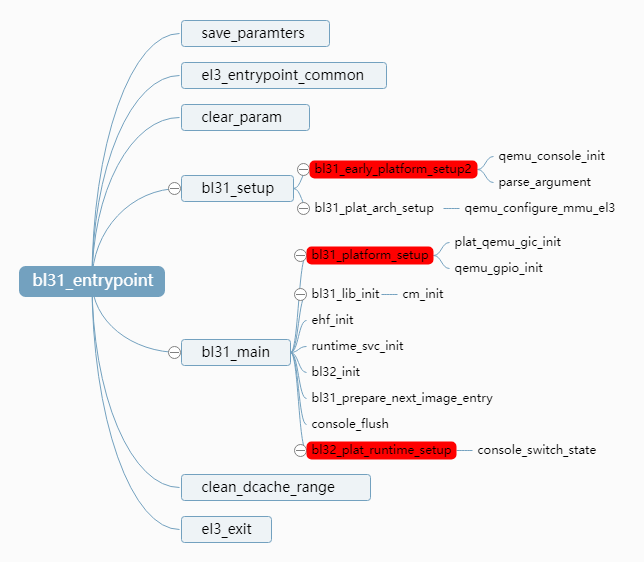
</div>

## 5.1. bl31 init

bl31 的初始化包含:

* 保存参数(x0-x3 来自于 bl2 的参数)
* common 函数
* 做一些清理工作

### 5.1.1. params saving

```assembly
mov	x20, x0
mov	x21, x1
mov	x22, x2
mov	x23, x3
```

与 bl1 进入 bl2 相同, 将 bl2 传递的参数从 caller 寄存器保存到 callee 的寄存器中.

## 5.2. bl31 common

```assembly
//
#if !RESET_TO_BL31
	/* ---------------------------------------------------------------------
	 * For !RESET_TO_BL31 systems, only the primary CPU ever reaches
	 * bl31_entrypoint() during the cold boot flow, so the cold/warm boot
	 * and primary/secondary CPU logic should not be executed in this case.
	 *
	 * Also, assume that the previous bootloader has already initialised the
	 * SCTLR_EL3, including the endianness, and has initialised the memory.
	 * ---------------------------------------------------------------------
	 */
	el3_entrypoint_common					\
		_init_sctlr=0					\
		_warm_boot_mailbox=0				\
		_secondary_cold_boot=0				\
		_init_memory=0					\
		_init_c_runtime=1				\
		_exception_vectors=runtime_exceptions		\
		_pie_fixup_size=BL31_LIMIT - BL31_BASE
#else

	/* ---------------------------------------------------------------------
	 * For RESET_TO_BL31 systems which have a programmable reset address,
	 * bl31_entrypoint() is executed only on the cold boot path so we can
	 * skip the warm boot mailbox mechanism.
	 * ---------------------------------------------------------------------
	 */
	el3_entrypoint_common					\
		_init_sctlr=1					\
		_warm_boot_mailbox=!PROGRAMMABLE_RESET_ADDRESS	\
		_secondary_cold_boot=!COLD_BOOT_SINGLE_CPU	\
		_init_memory=1					\
		_init_c_runtime=1				\
		_exception_vectors=runtime_exceptions		\
		_pie_fixup_size=BL31_LIMIT - BL31_BASE
```

从上面的代码可知, 根据是否设置了 `RESET_TO_BL31`, 该函数有两套不同的调用参数. 这是因为 ATF 支持两种启动方式:

* (1)启动从 bl1 开始执行, 这是 atf 默认的启动方式. 此时由于 bl1 已经执行过 el3_entrypoint_common 函数, 系统基本配置都已经设置完成. 因此像设置 sctlr 寄存器, 热启动跳转处理, secondary cpu 处理, 以及内存初始化流程在 bl1 中都已经完成, bl31 中就可以跳过它们了

* (2)支持从 bl31 开始启动的基础是 armv8 支持动态设置 cpu 的重启地址, armv8 架构提供了 RVBAR(reset vector base address register)寄存器用于设置 reset 时 cpu 的启动位置. 该寄存器一共有三个: RVBAR_EL1,RVBAR_EL2 和 RVBAR_EL3, 根据系统实现的最高异常等级确定使用哪一个. 我们知道 armv8 重启总是从最高异常等级开始执行, 因此我们只需要设置最高异常等级的 RVBAR 寄存器即可. 由于 bl31 运行在 el3 下, 故若我们需要支持启动从 bl31 开始, 就可通过将地址设置到 RVBAR_EL3 寄存器实现.

若启动从 bl31 开始, 则由于它是第一级启动镜像, 因此 el3_entrypoint_common 需要从头设置系统状态, 因此该函数中的 sctlr 寄存器, 启动跳转处理, secondary cpu 处理, 以及内存初始化流程等都需要执行.
虽然 el3_entrypoint_common 需要做的工作有点多, 但这种方式直接跳过了 bl1 和 bl2 两级启动流程, 相比于第一种方式其启动速度要更快, 这也是它的最大优势.
最后这种方式将参数保存寄存器 x20 – x23 的值清零也非常好理解, 因为此时 bl31 是启动的第一级镜像, 自然就没有前级镜像传递的参数, 此时将这些值清零可避免后面参数解析时出现问题.

## 5.3. bl31 main

### 5.3.1. bl31_early_platform_setup2

该函数先初始化 qemu 控制台, 然后解析 bl2 传入的镜像描述链表参数, 并将解析到的 bl32 和 bl33 镜像 ep_info 保存到全局变量中. 其主要流程如下:
```C
qemu_console_init();                                 (1)
bl_params_t *params_from_bl2 = (bl_params_t *)arg0;  (2)
		…
bl_params_node_t *bl_params = params_from_bl2->head; (3)
while (bl_params) {                                  (4)
	if (bl_params->image_id == BL32_IMAGE_ID) {
		bl32_image_ep_info = *bl_params->ep_info;    (5)
	}

	if (bl_params->image_id == BL33_IMAGE_ID){
		bl33_image_ep_info = *bl_params->ep_info;    (6)
	}

	bl_params = bl_params->next_params_info;
}
if (!bl33_image_ep_info.pc)          (7)
	panic();
```

(1)控制台初始化
(2)获取 arg0 传入的镜像描述参数指针
(3)获取镜像链表头节点
(4)遍历镜像链表
(5)若该链表中含有 bl32 镜像描述符, 则将其 ep_info 保存到全局变量
(6)多该链表中含有 bl33 镜像描述符, 同样将其 ep_info 保存到全局变量
(7)校验 bl33 镜像的入口地址

### 5.3.2. bl31_plat_arch_setup

该函数用于为 bl31 相关内存创建页表, 并使能 MMU 和 dcache, 其代码如下:
```C
void bl31_plat_arch_setup(void)
{
	qemu_configure_mmu_el3(BL31_BASE, (BL31_END - BL31_BASE),
	BL_CODE_BASE, BL_CODE_END,
	BL_RO_DATA_BASE, BL_RO_DATA_END,
	BL_COHERENT_RAM_BASE, BL_COHERENT_RAM_END);
}
```

### 5.3.3. bl31_platform_setup

该函数是平台相关的, qemu 平台的实现如下:
```C
void bl31_platform_setup(void)
{
	plat_qemu_gic_init();                (1)
	qemu_gpio_init();                    (2)
}
```
(1)初始化 gic, 包括 gic 的 distributor,redistributor,cpu interface 等的初始化. 关于 bl31 gic 和中断处理的详细流程.
(2)初始化 qemu 平台的 gpio, 即为其设置 gpio 基地址和操作相关的回调函数

### 5.3.4. ehf init

ehf 用于初始化 el3 中断处理相关的功能. 在 gicv3 中中断被分为三个 group:group0,secure group1 和 non secure group 1, 它们根据 scr_el3 的 irq 和 fiq 位配置不同可分别路由到不同的异常等级处理. Ehf 用于处理 group0 中断, 这种中断总是以 fiq 形式触发, 通过设置 scr_el3 将其路由到 el3 处理就可以在 bl31 中处理这种类型中断了.
ehf 初始化流程主要就是设置 group 0 的路由方式, 并为其设置一个总的中断处理函数. 其主要流程如下:
```c
void __init ehf_init(void)
{
	unsigned int flags = 0;
	int ret __unused;
    …
	set_interrupt_rm_flag(flags, NON_SECURE);
	set_interrupt_rm_flag(flags, SECURE);                              (1)

	ret = register_interrupt_type_handler(INTR_TYPE_EL3,
			ehf_el3_interrupt_handler, flags);                 (2)
	assert(ret == 0);
}
```

(1)计算中断路由相关的 flag

(2)设置 EL3 类型 (group 0) 中断的中断路由方式和 bl31 总的中断处理函数

bl31 中断处理函数 ehf_el3_interrupt_handler 会由异常向量表处理流程调用, 它会继续根据中断优先级调用实际每个优先级对应的处理函数. 中断优先级对应处理函数的注册流程分为以下共有两步, 以下是中断注册流程的示例:

```C
ehf_pri_desc_t plat_exceptions[] = {
#if RAS_EXTENSION
	EHF_PRI_DESC(PLAT_PRI_BITS, PLAT_RAS_PRI),
#endif
#if SDEI_SUPPORT
	EHF_PRI_DESC(PLAT_PRI_BITS, PLAT_SDEI_CRITICAL_PRI),
	EHF_PRI_DESC(PLAT_PRI_BITS, PLAT_SDEI_NORMAL_PRI),
#endif
#if SPM_MM
	EHF_PRI_DESC(PLAT_PRI_BITS, PLAT_SP_PRI),
#endif
#ifdef PLAT_EHF_DESC
	PLAT_EHF_DESC,
#endif
};

EHF_REGISTER_PRIORITIES(plat_exceptions, ARRAY_SIZE(plat_exceptions), PLAT_PRI_BITS);
```

上面的例子中注册了 RAS,SDEI 等中断, 并为它们分配了不同的优先级, 但是此时只是为中断处理函数占了一个位, 而并未实际定义. 它们实际上要在驱动中通过 `ehf_register_priority_handler` 注册. 如对于 sdei, 其注册流程如下:

```C
void sdei_init(void)
{
	…
	ehf_register_priority_handler(PLAT_SDEI_CRITICAL_PRI,
			sdei_intr_handler);
	ehf_register_priority_handler(PLAT_SDEI_NORMAL_PRI,
			sdei_intr_handler);
}
```
当 ehf_register_priority_handler 注册完成后, 理论上 bl31 就可以接收和处理 el3 中断了. 但是实际上 bl31 正在执行时, PSTATE 的 irq 和 fiq 中断掩码都是被 mask 掉的, 即 el3 中断只有在 cpu 运行于低于 EL3 异常等级的时候才能真正被触发和处理.

### 5.3.5. 运行时服务初始化

前面我们提到 bl31 在系统初始化完成后还需要驻留系统, 并处理来自低异常等级的 smc 异常, 其异常处理流程被称为运行时服务. Arm 为它们的使用场景定义了一系列的规范, 分别用于处理类型不同的任务, 如 cpu 电源管理规范 PSCI, 代理 non secure world 处理中断的软件事件代理规范 SDEI, 以及用于 trust os 相关调用的 SPD 等. 显然这些服务被使用之前, 其服务处理函数需要先注册到 bl31 中, 运行时服务初始化流程即是用于该目的.
在分析运行时服务初始化流程之前, 我们先看下其注册方式. 以下是其注册接口 DECLARE_RT_SVC 的定义:
```c
#define DECLARE_RT_SVC(_name, _start, _end, _type, _setup, _smch)	\
	static const rt_svc_desc_t __svc_desc_ ## _name			\                 (1)
		__section("rt_svc_descs") __used = {			\                 (2)
			.start_oen = (_start),				\
			.end_oen = (_end),				\
			.call_type = (_type),				\
			.name = #_name,					\
			.init = (_setup),				\
			.handle = (_smch)				\
		}
typedef struct rt_svc_desc {
    uint8_t start_oen;-------------------service 内部启动 oen
    uint8_t end_oen;---------------------service 内部末尾 oen
    uint8_t call_type;-------------------smc 类型, 是 fast call 还是 standard call
    const char *name;--------------------service 名称
    rt_svc_init_t init;------------------service 初始化函数
    rt_svc_handle_t handle;-------------- 对应 function id 的调用函数
} rt_svc_desc_t;
```

该接口定义了一个结构体__svc_desc_ ## _name, 并将其放到了一个特殊的段 rt_svc_descs 中. 这段的定义位于链接脚本头文件 include/common/bl_common.ld.h 中, 其定义如下:

```C
#define RT_SVC_DESCS                                    \
        . = ALIGN(STRUCT_ALIGN);                        \
        __RT_SVC_DESCS_START__ = .;                     \
        KEEP(*(rt_svc_descs))                           \
        __RT_SVC_DESCS_END__ = .;
```

即这些被注册的运行时服务结构体都被保存到以 `__RT_SVC_DESCS_START__` 开头,`__RT_SVC_DESCS_END__` 结尾的 rt_svc_descs 段中.

因此若需要获取这些结构体指针, 只需遍历这段地址就可以了. 运行时服务初始化函数 runtime_svc_init 流即是如此, 其定义如下:

```c
void __init runtime_svc_init(void)
{
	…
	rt_svc_descs = (rt_svc_desc_t *) RT_SVC_DESCS_START;                 (1)
	for (index = 0U; index < RT_SVC_DECS_NUM; index++) {                 (2)
		rt_svc_desc_t *service = &rt_svc_descs[index];

		rc = validate_rt_svc_desc(service);                  (3)
		if (rc != 0) {
			ERROR("Invalid runtime service descriptor %p\n",
				(void *) service);
			panic();
		}

		if (service->init != NULL) {
			rc = service->init();                                 (4)
			if (rc != 0) {
				ERROR("Error initializing runtime service %s\n",
						service->name);
				continue;
			}
		}
		…
	}
}
```

(1)获取 rt_svc_descs 段的起始地址 RT_SVC_DESCS_START

(2)遍历该段中所有已注册 rt_svc_desc_t 结构体相应的运行时服务

(3)校验运行时服务有效性

(4)调用该服务对应的初始化回调, 该回调函数是在 DECLARE_RT_SVC 注册宏中通过参数_setup 传入的.

# 6. bl32 start

这部分可以结合参考:[09_OPTEE-OS_内核之(一)ARM 核安全态和非安全态的切换](https://github.com/carloscn/blog/issues/99) 里面涉及 ARMv8 的安全状态切换处理过程.

Bl32 主要用于运行 trust os, 它主要用来保护用户的敏感数据(如密码, 指纹, 人脸等), 以及与其相关的功能模块, 如加解密算法, ta 的加载与执行, secure storage 等. 各个厂家的 trust os 实现都有所不同, 但基本思路是类似的, 下面分析中涉及到具体的 trust os 时, 我们将选取开源框架 optee 为例.
启动流程中 bl32 运行流程如下:
```C
	if (bl32_init != NULL) {
		INFO("BL31: Initializing BL32\n");

		int32_t rc = (*bl32_init)();

		if (rc == 0)
			WARN("BL31: BL32 initialization failed\n");
	}
```
它首先判断 bl32_init 是否已注册, 若已注册则通过调用该函数执行实际的 bl32 运行流程. 我们先看下 optee 架构下 bl32_init 注册流程(services/spd/opteed):
```c
DECLARE_RT_SVC(
	opteed_fast,

	OEN_TOS_START,
	OEN_TOS_END,
	SMC_TYPE_FAST,
	opteed_setup,                                                 (1)
	opteed_smc_handler
);
static int32_t opteed_setup(void)
{
	…
	bl31_register_bl32_init(&opteed_init)                          (2)
	return 0;
}
void bl31_register_bl32_init(int32_t (*func)(void))
{
	bl32_init = func;                                              (3)
}
```
(1)通过 DECLARE_RT_SVC 设置 optee 的初始化回调 opteed_setup
(2)将 opteed_init 函数注册为 bl32 的启动函数
(3)实际的回调注册
因此 optee 的 bl32 启动函数为 opteed_init, 它的流程与我们先前 bl1 启动 bl2 的跳转方式类似, 其流程图如下:

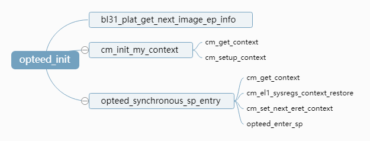

它先获取先前保存的 secure 镜像 ep 信息(即 bl32 的 ep 信息), 然后用其初始化异常等级切换的上下文, 设置 secure el1 的系统寄存器, spsr_el3 和 elr_el3 等. 然后调用 opteed_enter_sp 函数跳转到 bl32. 这里有个问题, bl31 除了启动 bl32 后, 还需要继续启动 bl33, 因此 bl32 启动完成后还需要跳转回 bl31 并继续执行 bl33 启动流程. 由于 bl32 在 secure EL1 执行, 其同步进入 bl31 只能使用 smc 方式, 因此需要在 smc 处理流程中跳转到原先的断点处. Armv8 中 c 语言的 lr 寄存器为 x30, 因此若我们在跳转之前保存 x30 及运行上下文, 然后再 smc 处理流程中恢复这些上下文即可以实现恢复断点处执行了. 以下为 opteed_enter_sp 函数的上下文保存流程:
```assembly
func opteed_enter_sp
	mov	x3, sp
	str	x3, [x0, #0]
	sub	sp, sp, #OPTEED_C_RT_CTX_SIZE

	stp	x19, x20, [sp, #OPTEED_C_RT_CTX_X19]
	stp	x21, x22, [sp, #OPTEED_C_RT_CTX_X21]
	stp	x23, x24, [sp, #OPTEED_C_RT_CTX_X23]
	stp	x25, x26, [sp, #OPTEED_C_RT_CTX_X25]
	stp	x27, x28, [sp, #OPTEED_C_RT_CTX_X27]
	stp	x29, x30, [sp, #OPTEED_C_RT_CTX_X29]

	b	el3_exit
endfunc opteed_enter_sp
```
在该函数中上下文会被保存到全局变量 opteed_sp_context 中, optee 初始化完成后返回 smc 处理的流程如下(services/spd/opteed/opteed_main.c):
```c
uintptr_t opteed_smc_handler(…)
{
optee_context_t *optee_ctx = &opteed_sp_context[linear_id];
    …
	switch (smc_fid) {
	case TEESMC_OPTEED_RETURN_ENTRY_DONE:                             (1)
		assert(optee_vector_table == NULL);
		optee_vector_table = (optee_vectors_t *) x1;
		…
		opteed_synchronous_sp_exit(optee_ctx, x1);                 (2)
		break;
    …
	}
}
```
(1)表明本次 smc 调用是 bl32 启动完成后返回
(2)调用该函数恢复进入 bl32 之前保存的上下文, 返回断点处继续执行. 该函数的定义如下:
```assembly
func opteed_exit_sp
	mov	sp, x0                                                                  (1)

	ldp	x19, x20, [x0, #(OPTEED_C_RT_CTX_X19 - OPTEED_C_RT_CTX_SIZE)]
	ldp	x21, x22, [x0, #(OPTEED_C_RT_CTX_X21 - OPTEED_C_RT_CTX_SIZE)]
	ldp	x23, x24, [x0, #(OPTEED_C_RT_CTX_X23 - OPTEED_C_RT_CTX_SIZE)]
	ldp	x25, x26, [x0, #(OPTEED_C_RT_CTX_X25 - OPTEED_C_RT_CTX_SIZE)]
	ldp	x27, x28, [x0, #(OPTEED_C_RT_CTX_X27 - OPTEED_C_RT_CTX_SIZE)]
	ldp	x29, x30, [x0, #(OPTEED_C_RT_CTX_X29 - OPTEED_C_RT_CTX_SIZE)]            (2)

	mov	x0, x1
	ret                                                                              (3)
endfunc opteed_exit_sp
```
(1)恢复进入 bl32 之前保存在 context 中的栈
(2)恢复进入 bl32 之前保存的 callee 寄存器
(3)返回断点处继续执行, 兜兜转转一圈, 我们好不容易又返回到 bl31_main 函数了

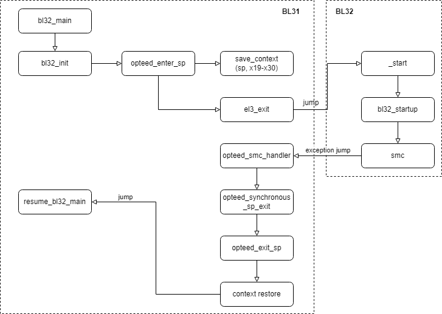

# 7. bl33 booting

bl33 启动流程与前面各级镜像启动流程, 类似, 也是根据 ep_info 设置 bl33 的上下文, 入口地址和参数, 然后跳转到入口执行. 大家有兴趣可以自行根据代码分析一下, 这里不再赘述. 好了, atf 启动流程总算走完了, 接下来我们将跳转到 bl33(uboot)的世界, 一切的准备都是为了 uboot 启动 kernel 那一刻的美好!

# 8. Ref

[^1]:[聊聊 SOC 启动(一)armv8 启动总体流程 ](https://zhuanlan.zhihu.com/p/520039243)

[^2]:[聊聊 SOC 启动(二) ATF BL1 启动流程](https://zhuanlan.zhihu.com/p/520039243)

[^3]:[聊聊 SOC 启动(三) ATF BL2 启动流程](https://zhuanlan.zhihu.com/p/520039243)

[^4]:[聊聊 SOC 启动(四) ATF BL31 启动流程](https://zhuanlan.zhihu.com/p/520052961)

[^5]:[聊聊 SOC 启动(五) uboot 启动流程一](https://zhuanlan.zhihu.com/p/520060653)

[^6]:[聊聊 SOC 启动(六) uboot 启动流程二](https://zhuanlan.zhihu.com/p/520087511)

[^7]:[聊聊 SOC 启动(七) SPL 启动分析](https://zhuanlan.zhihu.com/p/520189611)

[^8]:[聊聊 SOC 启动(八) uboot 启动流程三](https://zhuanlan.zhihu.com/p/520575102)

[^9]:[聊聊 SOC 启动(九) 为 uboot 添加新的 board](https://zhuanlan.zhihu.com/p/521069920)

[^10]:[聊聊 SOC 启动(十) 内核启动先导知识](https://zhuanlan.zhihu.com/p/522195519)

[^11]:[聊聊 SOC 启动(十一) 内核初始化](https://zhuanlan.zhihu.com/p/522991248)

[^12]:[ARM Trusted Firmware Design ](https://chromium.googlesource.com/external/github.com/ARM-software/arm-trusted-firmware/+/v1.4-rc0/docs/firmware-design.md#bl1-architectural-initialization)

[^13]:[SCTLR_EL3, System Control Register (EL3) ](https://developer.arm.com/documentation/ddi0601/2022-03/AArch64-Registers/SCTLR-EL3--System-Control-Register--EL3-?lang=en)

[^14]:[地址无关代码 ](https://baike.baidu.com/item/%E5%9C%B0%E5%9D%80%E6%97%A0%E5%85%B3%E4%BB%A3%E7%A0%81/22702477?fr=aladdin)

[^15]:[coherent memory](https://blog.csdn.net/denglin12315/article/details/120291393)


