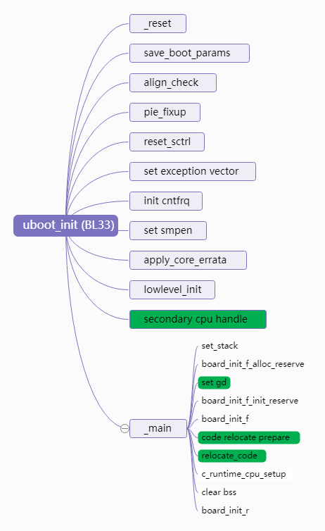
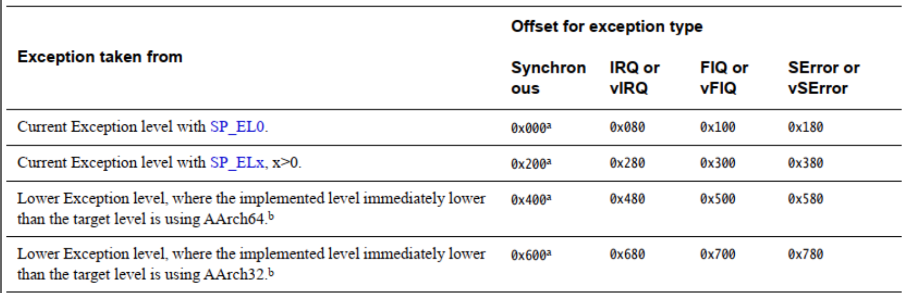
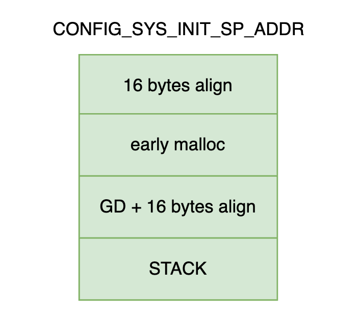

ARMv8 BL33 Uboot Booting Flow

ARM 上电后会从 BootROM(或 XIP)启动第一段程序, BootROM/XIP 固化着 SoC 厂商自己写的驱动程序, 这部分代码除了一些 ARM 公司规定的必要启动流程, SoC 厂商根据自己的 SoC 设计内置一些初始化的操作, 我们把这一阶段称为 `SoC BootROM booting` 阶段. 由于 BootROM 内部的程序没有办法重新烧写, 因为在芯片的流片的之前, 这部分程序必须要确定下来且经过质量测试, 一旦流片这部分程序将无法重新烧写, 因此是重中之重的一环. 在一些 Secure Boot 设计中, 这部分程序要固化初试的根信任信息.

SoC BootROM 之后的阶段, 有多种叫法, 中文称作 ` 第二级程序引导 `, 缩写为 SPL, 一些公司例如德州仪器也会将这个引导的名字称为 MLO. 引入 SPL 的原因是因为 SRAM 的空间比较小, 我们需要在正式引导之前有一个加载的程序, 可以将正式的引导导入到 DDR 中. 在某些架构下从 SPL 延伸出 TPL 的概念, 我们从整个 boot 的过程中也将其视为 SPL 阶段. SPL 在 uboot 可以找到其身影, 这部分代码 SoC 厂商会根据自己的平台编写好自己的程序, 并合入到 uboot 的代码仓库中. 对于 OEM 厂可以对这部分代码根据需求进行订制和修改.

ARMv8 上提供了 ATF 固件, ATF 固件可以 cover 整个 boot 流程. 若我们在 ARMv8 上面使用安全 feature, 必然要使用 ATF 固件作为整个引导的主导程序. 当然, 强大 uboot 也会和 ATF 功能有所重叠, 在不使用 ATF 情况下, uboot 也可以挑起启动的重任, 但是无法使用其安全 feature.

SPL 之后, 将会引导 OEM 厂最熟悉的 uboot 或者其他品牌的引导程序. 关于整个 ARMv7/v8 的非安全和安全启动, 可以参考:#65[^2] 和 #61[^1]

本节的重点关注于 ARMv8 的 BL33 阶段的 uboot booting 过程:

* uboot 的初始化

* uboot 的驱动模型

* uboot 的 board_init_x

* uboot 的内核映像的封装

# 1. uboot 的初始化

[^3]

在 BL33 阶段的 uboot 初始化部分很多功能化和 SPL 是共用的, 如下图所示为 uboot 整体的流程, 其中标注为绿色的是 BL33 uboot 特有的部分, 其他没有标注的, 可以参考( https://github.com/carloscn/blog/issues/61  2.2.2 ARMv8 uboot-spl analysising)[^1]

<div align='center'>

</div>

该流程主要包含了以下部分:

***save_boot_params**保存上一级镜像传入的参数, 该函数由平台自行定义

* 若支持 pie 则检查代码段是否为 4k 对齐(因为由于指令集中操作数长度的限制, adr 等类型指令的寻址范围是需要 4k 对齐的)

***pie_fixup 为 pie 重定位全局地址相关的. rela.dyn 段内容**

* reset_sctrl 根据配置确定是否重设 sctlr 寄存器

* 为 uboot 设置异常向量表. spl 和 uboot 异常向量表设置有以下不同:

  * spl 在设置了配置选项**CONFIG_ARMV8_SPL_EXCEPTION_VECTORS**, 则会为其设置异常向量表, 否则不为其设置异常向量表 ;

  * uboot 默认情况就会设置异常向量表, armv8 的异常向量表格式如下:

	

	根据中断触发时 cpu 正在运行的异常等级, 使用的栈寄存器类型以及运行状态, armv8 会跳转到不同的中断向量. **由于 spl 和 uboot 在启动流程中不会执行比当前更低异常等级的代码**, 因此只需要实现当前异常等级下的 8 个异常向量即可. 其对应的向量表定义在 arch/arm/cpu/armv8/exceptions.S 中. 由于根据不同的配置, spl 或 uboot 可运行在 el1 – el3 异常等级下, 因此需要根据**当前实际的异常等级来选择异常向量表基地址寄存器**.

* 若配置了**COUNTER_FREQUENCY 选项**, 则根据当前正在运行的异常等级, 确定是否要设置 cpu 的 system counter 的频率. 由于 system counter 的频率是所有异常等级共享的, 为了确保该频率不被随意修改, 因此约定只有运行于最高异常等级时才允许修改该寄存器.

* 若设置了配置选项 CONFIG_ARMV8_SET_SMPEN, 则设置 S3_1_c15_c2_1 以使能 cpu 之间的数据一致性.

* apply_core_errata 用于处理 cpu 的 errata.

* lowlevel_init 流程可参考 spl 启动分析.

## 1.1 SMP 多核启动

soc 在启动阶段除了一些特殊情况外(如为了加快启动速度, 在 bl2 阶段通过并行加载方式同时加载 bl31,bl32 和 bl33 镜像), 一般都没有并行化需求. 因此只需要一个 cpu 执行启动流程即可, 这个 cpu 被称为 primary cpu, 而其它的 cpu 则统一被称为 secondary cpu. 为了防止 secondary cpu 在启动阶段的执行, 它们在启动时必须要被设置为一个特定的状态. 当 primary cpu 完成操作系统初始化, 调度系统开始工作后, 就可以通过一定的机制启动 secondary cpu. 显然 secondary cpu 不再需要执行启动流程代码, 而只需直接跳转到内核中执行即可. 故其启动的关键是如何将内核入口地址告知 secondary cpu, 以使其能跳转到正确的执行位置[^5].

随着 aarch64 架构电源管理需求的增加(如 cpu 热插拔, cpu idle 等),arm 设计了一套标准的电源管理接口协议 psci. 该协议可以支持所有 cpu 相关的电源管理接口, 而且由于电源相关操作是系统的关键功能, 为了防止其被攻击, 该协议将底层相关的实现都放到了 secure 空间, 从而可提高系统的安全性[^5].

armv8 的从 cpu 启动包含**psci 和 spintable**两种方式[^4].spin-table 是一个比较简单的启动方法, 差不多意思就是单核启动, 其他核睡去的顺序执行; 而 psci 是一个相对比较复杂的启动方法, 且 psci 方式需要由 bl31 处理.

### spin-table

[^7]

**spin-table 启动方法**

一个系统的启动的基本流程是先 bootloader 然后运行 kernel. 当对所有 CPU 上电后, 那么所有的 CPU 都会从 bootrom 里面开始执行代码, 为了防止并发的一些问题, 有必要将除了 primary cpu 以外的 cpu 拦截下来. 使 boot 的过程是顺序的, 而不是并发的.

在启动的过程中, bootloader 中有一道栅栏, 它拦住了除了 cpu0 外的其他 cpu.**cpu0 直接往下运行, 进行设备初始化以及运行 Linux Kernelk, 而其他 cpu 则在栅栏外进入睡眠状态.**cpu0 在初始化 smp 的时候, 会在 cpu-release-addr 里面填入一个地址并唤醒其他 cpu. 这时候, 在睡眠的这个 cpu 接受到了信号, 醒来的时候先检查下 cpu-release-addr 这个地址里面的数据是不是不等于 0. 如果不等于 0, 意味着主 cpu 填入了地址, 该它上场了. 它就会直接填入该地址执行.

```assembly
#if defined(CONFIG_ARMV8_SPIN_TABLE) && !defined(CONFIG_SPL_BUILD)          (1)
	branch_if_master x0, x1, master_cpu                                 (2)
	b	spin_table_secondary_jump                                   (3)
#elif defined(CONFIG_ARMV8_MULTIENTRY)                                      (4)
	branch_if_master x0, x1, master_cpu                                 (5)
slave_cpu:
	wfe                                                                 (6)
	ldr	x1, =CPU_RELEASE_ADDR                                       (7)
	ldr	x0, [x1]
	cbz	x0, slave_cpu                                               (8)
	br	x0                                                          (9)
#endif
master_cpu:
	bl	_main

@@@@@@@@@@@@@@@@@@@@@@@@@@@@@@@@@@@@@@@@@@@@@@@@@@@@@@@@@@@@@@@@@@@@@@@@@@@@

ENTRY(spin_table_secondary_jump)
.globl spin_table_reserve_begin
spin_table_reserve_begin:
0:      wfe                                                  (a)
        ldr     x0, spin_table_cpu_release_addr              (b)
        cbz     x0, 0b                                       (c)
        br      x0                                           (d)
.globl spin_table_cpu_release_addr
        .align  3
spin_table_cpu_release_addr:                                 (e)
        .quad   0
.globl spin_table_reserve_end
spin_table_reserve_end:
ENDPROC(spin_table_secondary_jump)
```
* (1)若当前从 cpu 为 spin table 启动方式, 且当前执行的是 uboot 时. 则从 cpu 将通过 wfe 进入自旋状态, 并等待内核向给定地址填入其启动入口函数, 该流程如下:
	 * a 从 cpu 进入 wfe 睡眠模式
	 * b 若该 cpu 被唤醒, 则读取 spin_table_cpu_release_addr 的值
	 * c 若内核未向该地址写入其启动的入口函数, 则继续返回睡眠
	 * d 否则, 跳转到读取到的入口处开始从 cpu 的启动流程
	 * e 定义保存从 cpu 入口函数的内存地址, 该地址在 uboot 启动时会被填入设备树 spintable 节点的属性中. 内核启动从 cpu 时, 则通过向解析到地址写入入口函数, 并唤醒 secondary cpu, 从而完成其启动
* (2)若当前 cpu 为主 cpu, 继续执行冷启动流程
* (3)若当前 cpu 为从 cpu, 则进入 step 1 的 spin 模式
* (4)若未配置 spintable, 则从 cpu 需要 spin 在一个系统预先定义的地址上, 并等待 uboot 在合适的时机向该地址填入入口函数
* (5)若当前 cpu 为主 cpu, 则继续执行冷启动流程
* (6 - 9)该流程与 spintable 方式类似, 也是 cpu 通过 wfe 进入睡眠模式, 并在唤醒后查询给定地址的值是否已被填入. 若被填入则跳转到入口函数开始执行, 否则继续进入睡眠模式.

### 1.1.2 psci

除了 spin-table 的方式, 还有 psci 可以供选择作为 secondary cpu 的启动[^7]. 在 arm 的 uboot 源程序里面使用 Kconfig 的 `ARMV8_SPIN_TABLE` 标签可以使能 `SPIN_TABLE`, 如果禁止那么则是 PSCI 启动模式[^8].PSCI 方式依托于 ARM64 的 PSCI 架构, PSCI 架构不仅仅用于启动, 还用于提供的一套电源管理接口, 只不过启动被包含在这个架构之中[^6]. 本文重点在 uboot 启动流程, 关于 SMP 多核启动流程, uboot 部分和 kernel 部分有很强的关联, 故我们将这部分放在 LinuxKernel 专题来讲解, 请参考 [# 02_LinuxKernel_内核的启动(二)SMP 多核处理器启动过程分析 #66](https://github.com/carloscn/blog/issues/66)

## 1.2 `_main` 流程分析

### 1.2.1 gd 及内存规划

在进入 c 语言之前, 我们需要为其准备好运行环境, 以及做好内存规划, 这其中除了**栈和堆内存**之外,**还需要为 gd 结构体分配内存空间**.gd 是 uboot 中的一个 global_data 类型全局变量, 该变量包含了很多全局相关的参数, 为各模块之间参数的传递和共享提供了方便. 由于该变量在跳转到 c 流程之前就需要准备好, 此时堆管理器尚未被初始化, 所以其内存需要通过手工管理方式分配. 以下为 uboot 内存规划相关代码:
```assembly
#if defined(CONFIG_TPL_BUILD) && defined(CONFIG_TPL_NEEDS_SEPARATE_STACK)
	ldr	x0, =(CONFIG_TPL_STACK)
#elif defined(CONFIG_SPL_BUILD) && defined(CONFIG_SPL_STACK)
	ldr	x0, =(CONFIG_SPL_STACK)
#elif defined(CONFIG_INIT_SP_RELATIVE)
#if CONFIG_POSITION_INDEPENDENT
	adrp	x0, __bss_start
	add	x0, x0, #:lo12:__bss_start
#else
	adr	x0, __bss_start
#endif
	add	x0, x0, #CONFIG_SYS_INIT_SP_BSS_OFFSET
#else
	ldr	x0, =(CONFIG_SYS_INIT_SP_ADDR)                         (1)
#endif
	bic	sp, x0, #0xf                                           (2)
	mov	x0, sp
	bl	board_init_f_alloc_reserve                             (3)
	mov	sp, x0                                                 (4)
	mov	x18, x0                                                (5)
	bl	board_init_f_init_reserve                              (6)
```

* (1)以上部分根据不同的配置情况获取 uboot 的初始栈地址
* (2)为了遵循 ABI 规范, 栈地址需要 16 字节对齐, 该指令将地址做对齐以后设置到栈指针寄存器中, 以为系统设置运行栈
* (3)该函数为 gd 和 early malloc 分配内存, 其代码如下:
	```C
	ulong board_init_f_alloc_reserve(ulong top)
	{
	#if CONFIG_VAL(SYS_MALLOC_F_LEN)
	        top -= CONFIG_VAL(SYS_MALLOC_F_LEN);                         (a)
	#endif
	        top = rounddown(top-sizeof(struct global_data), 16);         (b)
	        return top;
	}
	```
	* a 为早期堆管理器预留内存
	* b 为 gd 预留内存
* (4)将预留后的内存地址设置为新的栈地址, 此时各部分的地址如下:

	<div align='center'>
	
	</div>

* (5)将 gd 地址保存到 x18 寄存器中, 其可用被于后续 gd 指针的获取
* (6)该流程主要用于初始化 gd, 和设置 early malloc 的堆管理器基地址, 其代码如下:

	```C
	void board_init_f_init_reserve(ulong base)
	{
	        struct global_data *gd_ptr;

	        gd_ptr = (struct global_data *)base;
	        memset(gd_ptr, '\0', sizeof(*gd));                    (a)
	#if !defined(CONFIG_ARM)
	        arch_setup_gd(gd_ptr);                                 (b)
	#endif
	        if (CONFIG_IS_ENABLED(SYS_REPORT_STACK_F_USAGE))
	                board_init_f_init_stack_protection_addr(base); (c)
	        base += roundup(sizeof(struct global_data), 16);
	#if CONFIG_VAL(SYS_MALLOC_F_LEN)
	        gd->malloc_base = base;                               (d)
	#endif
	        if (CONFIG_IS_ENABLED(SYS_REPORT_STACK_F_USAGE))
	                board_init_f_init_stack_protection();         (e)
	}
      #ifdef CONFIG_ARM64
      #define DECLARE_GLOBAL_DATA_PTR register volatile gd_t *gd asm ("x18")
      #else
      #define DECLARE_GLOBAL_DATA_PTR register volatile gd_t *gd asm ("r9")
      #endif
	```
	* a 获取 gd 指针, 并清空 gd 结构体内存
	* b 该函数用于非 arm 架构的 gd 指针获取, armv8 架构则通过前面设置的 x18 寄存器获取 gd 指针, 其定义如下(arch/arm/include/asm/global_data.h)
	* c 该函数用于获取该栈溢出检测的地址
	* d 设置 early malloc 的基地址
	* e 初始化栈溢出检测的 canary 值, 该值被设置为 SYS_STACK_F_CHECK_BYTE

### 1.2.2 重定位

一般的启动流程会由 spl 初始化 ddr,**然后将 uboot 加载到 ddr 中运行**. 但这并不是必须的, uboot 自身其实也可以作为 bl1 或 bl2 启动镜像, 此时 uboot 最初的启动位置不是位于 ddr 中(如 norflash). 由于 norflash 的执行速度比 ddr 要慢的多, 因此在完成 ddr 初始化后就需要将其搬移到 ddr 中, 并切换到新的位置继续执行, 这个流程就叫做 uboot 的重定位.

#### 1.2.2.1 重定位的前提

uboot 重定位依赖于位置无关代码技术, 因此需要在编译和重定位时添加以下支持:
* (1)编译时添加 - fpie 选项
* (2)**在链接时添加 - pie 选项, 它使得链接器会产生. rel.dyn 和. dynsym 段的 fixup 表**.
* (3)链接脚本中添加. rel.dyn 和. dynsym 段定义, 并为重定位代码访问这些段的数据提供符号信息
* (4)在重定位过程中需要根据新的地址 fixup .rel.dyn 和. dynsym 段的数据

#### 1.2.2.2 重定位基本流程

由于**内核需要从内存的低地址开始运行**, 为了防止内核三件套 (**kernel,dtb 和 ramdisk**) 的加载地址与 uboot 运行地址重叠, 因此**uboot 的重定位地址需要被设置到内存顶端附近**. 同时我们还需要为一些特定模块预留一些内存空间(比如页表空间, framebuffer 等), 下图就是 uboot 规划的重定位后内存布局:

<div align='center'>

</div>

该图中橙色部分都是需要执行重定位操作的, 如 uboot 的代码段, 数据段, 以及 gd, 设备树等, 它们都是在 board_init_r 阶段还需要使用的. 对于 gd 和 dtb 等纯数据的重定位, 只需要将数据拷贝到新的地址, 并将其基地址指针切换到新地址即可. 但对于代码段的重定位我们还需要考虑以下问题:
* (1)位置无关代码需要调整. rel.dyn 和. dynsym 段
* (2)栈指针需要切换到新的位置
* (3)重定位完成后如何完成 pc 的平滑切换

**Note**:
* armv8 代码重定位准备相关的源码, 其位于 arch/arm/lib/crt0_64.S 中 ( https://github.com/ARM-software/u-boot/blob/v2018.09/arch/arm/lib/crt0_64.S#L92 )
* armv8 的代码重定位流程位于 arch/arm/lib/relocate_64.S 中 ( https://github.com/ARM-software/u-boot/blob/v2018.09/arch/arm/lib/relocate_64.S#L22 )

### 1.2.3 board_init_f

board_init_f 是 uboot 重定位前的流程, 它包括一些基础模块的初始化和重定位相关的准备工作. 以下为该函数在 armv8 架构下可能的执行流程, 图中灰色框表示该流程是可配置的, 黄色框表示是必选的.


### 1.2.4 board_init_r

board_init_r 是 uboot 重定位后需要执行的流程, 它包含基础模块, 硬件驱动以及板级特性等的初始化, 并最终通过 run_main_loop 启动 os 会进入命令行窗口.


# 2. uboot 的驱动模型

uboot 在初始化完成后会为用户提供一个**命令行交互接口**, 用户可通过该接口执行 uboot 定义的命令, 以用于查看系统状态, 设置环境变量和系统参数等. 为了方便对硬件和驱动的管理, uboot 还**引入了类似 linux 内核的设备树和驱动模型特性**. 当然, 为了增加系统的可配置性, 可调试性以及可跟踪性等, 它还支持**环境变量, log 管理, bootstage 统计以及简单的 ftrace 等功能**. 下面我们将对这些特性做一简单的介绍.

## 2.1 设备树

设备树是一种通过**dts 文件来描述 SoC 属性**, 通过将设备的具体配置信息与驱动分离, 以达到利用一份代码适配多款设备的机制. dts 文件包含了一系列层次化结构的节点和属性, 它可以通过 dtc 编译器编译成适合设备解析的二进制 dtb 文件.

uboot 设备树的使用包含以下流程: 为**目标板添加 dts 文件, 选择一个运行时使用的 dtb 文件, 使能设备树**.

**如何为目标板添加一个 dts 文件**

在 `arch/<arch>/dts` 目录下, 添加一个 xxx.dts 文件, 该文件可以从内核拷贝, 或者在 uboot dts 目录下选择一个其它目标板的 dts 为基础, 再根据实际需求进行修改. 修改完成后, 在 arch/arm/dts/Makefile 中为其添加编译选项:

````text
dtb-$(CONFIG_yyy) +=xxx.dtb
````

其中 yyy 为使用该 dts 的目标板

**如何为目标板选择 dts 文件**?

uboot 的设备树文件位于 `arch/<arch>/dts` 目录下, 可通过以下选项为目标板选择一个默认的 dts 文件:

```text
CONFIG_DEFAULT_DEVICE_TREE="xxx"
```

这是因为与内核不一样, uboot 最终的镜像会和 dtb 打包在一个镜像文件中, 因此在编译流程中就需要知道最终被使用的 dtb. 关于 uboot 镜像与 dtb 之间的关系将在 3. uboot 的 kernel 封装 介绍.

**通过编译命令指定 dts**

有时在编译时希望使用一个不是默认指定的 dts, 则可以通过在编译命令中添加 DEVICE_TREE=zzz 方式指定新的 dts 文件, 其示例如下:

```text
make DEVICE_TREE=zzz
```

**如何使能设备树**

通过配置 CONFIG_OF_CONTROL 选项即可使能设备树的支持, uboot 与 dtb 可以有以下几种打包组合方式:

* (1)若定义了 CONFIG_OF_EMBED 选项, 则在链接时会为 dtb 指定一个以__dtb_dt_begin 开头的单独的段, dtb 的内容将被直接链接到 uboot.bin 镜像中. 官方建议这种方式只在开发和调试阶段使用, 而不要用于生产阶段
* (2)若定义了 CONFIG_OF_SEPARATE 选项, dtb 将会被编译为 u-boot.dtb 文件, 而 uboot 原始镜像被编译为 u-boot-nodtb.bin 文件, 并通过以下命令将它们连接为最终的 uboot.bin 文件,`cat u-boot-nodtb.bin u-boot.dtb >uboot.bin`

## 2.2 驱动模型 DM

Uboot 根据 Linux 的驱动模型架构, 也引入了 Uboot 的驱动模型(**driver model :DM**).Uboot 驱动模型与**linux 的设备模型**比较类似, 利用它可以将**设备与驱动分离**. 对上可以为同一类设备提供统一的操作接口, 对下可以为驱动提供标准的注册接口, 从而提高代码的可重用性和可移植性. 同时, 驱动模型通过树形结构组织 uboot 中的所有设备, 为系统对设备的统一管理提供了方便.

### 2.2.1 驱动模型结构

#### driver 结构体
驱动模型主要用于管理系统中的驱动和设备, uboot 为它们提供了以下描述结构体:

driver 结构体用于表示一个驱动, 其定义如下:

```c
struct driver {
	char *name;
	enum uclass_id id;
	const struct udevice_id *of_match;
	int (*bind)(struct udevice *dev);
	int (*probe)(struct udevice *dev);
	int (*remove)(struct udevice *dev);
	int (*unbind)(struct udevice *dev);
	int (*of_to_plat)(struct udevice *dev);
	int (*child_post_bind)(struct udevice *dev);
	int (*child_pre_probe)(struct udevice *dev);
	int (*child_post_remove)(struct udevice *dev);
	int priv_auto;
	int plat_auto;
	int per_child_auto;
	int per_child_plat_auto;
	const void *ops;	/* driver-specific operations */
	uint32_t flags;
#if CONFIG_IS_ENABLED(ACPIGEN)
	struct acpi_ops *acpi_ops;
#endif
}
```

驱动可以通过以下接口注册到系统中:

```c

#define U_BOOT_DRIVER(__name)						\
	ll_entry_declare(struct driver, __name, driver)

// 其中 ll_entry_declare 的定义如下:

#define ll_entry_declare(_type, _name, _list)				\
	_type _u_boot_list_2_##_list##_2_##_name __aligned(4)		\
			__attribute__((unused))				\
			__section(".u_boot_list_2_"#_list"_2_"#_name)
```

即其会定义一个 struct driver 类型的 `_u_boot_list_2_driver_2_#_name` 变量, 该变量在链接时需要被放在 `u_boot_list_2_driver_2_#_name` 段中. 我们再看下这些 section 在链接脚本中是如何存放的, 以下为 armv8 架构链接脚本 arch/arm/cpu/armv8/u-boot.lds 中的定义:
```text
 .u_boot_list : {
     KEEP(*(SORT(.u_boot_list*)));
 }
```
从定义可看到这些以. u_boot_list 开头的 section 都会被保存在一起, 且它们会按照 section 的名字排序后再保存. 这主要是为了便于遍历这些结构体, 如我们需要遍历所有已经注册的 driver, 则可通过以下代码获取 driver 结构体的起始地址和总的 driver 数量.

```c
struct driver *drv = ll_entry_start(struct driver, driver); // 获取已注册 driver 的起始地址
int n_ents = ll_entry_count(struct driver, driver); // 获取已注册 driver 的数量
```
其中 ll_entry_start 和 ll_entry_coun 的定义如下:
```c
#define ll_entry_start(_type, _list)					\
({									\
	static char start[0] __aligned(CONFIG_LINKER_LIST_ALIGN)	\
		__attribute__((unused))					\
		__section(".u_boot_list_2_"#_list"_1");			\              (1-3)
	(_type *)&start;						\
})

#define ll_entry_end(_type, _list)					\
({									\
	static char end[0] __aligned(4) __attribute__((unused))		\
		__section(".u_boot_list_2_"#_list"_3");			\               (1-4)
	(_type *)&end;							\
})

#define ll_entry_count(_type, _list)					\
	({								\
		_type *start = ll_entry_start(_type, _list);		\
		_type *end = ll_entry_end(_type, _list);		\
		unsigned int _ll_result = end - start;			\               (1-5)
		_ll_result;						\
	})
```
(1-3)定义一个 `.u_boot_list_2_"#_list"_1` 的段, 若需要遍历 driver, 则该段的名字为 `.u_boot_list_2_driver_1`, 即它位于所有实际 driver section 之前的位置;
(1-4)定义一个 `.u_boot_list_2_"#_list"_3` 的段, 若需要遍历 driver, 则该段的名字为 `.u_boot_list_2_driver_3`, 即它位于所有实际 driver section 之后的位置;
(1-5)通过以上两个标号就可以很方便地获取驱动的起止地址和计算已注册驱动的总数.

#### uclass_driver 结构体

uclass_driver 结构体用于表示一个 uclass 驱动, 其定义如下:
```c
struct uclass_driver {
	const char *name;
	enum uclass_id id;
	int (*post_bind)(struct udevice *dev);
	int (*pre_unbind)(struct udevice *dev);
	int (*pre_probe)(struct udevice *dev);
	int (*post_probe)(struct udevice *dev);
	int (*pre_remove)(struct udevice *dev);
	int (*child_post_bind)(struct udevice *dev);
	int (*child_pre_probe)(struct udevice *dev);
	int (*child_post_probe)(struct udevice *dev);
	int (*init)(struct uclass *class);
	int (*destroy)(struct uclass *class);
	int priv_auto;
	int per_device_auto;
	int per_device_plat_auto;
	int per_child_auto;
	int per_child_plat_auto;
	uint32_t flags;
};
```

其注册和遍历方式与 driver 完全相同, 只是结构体类型和 section 名有所不同, 以下为其定义:

```c
#define UCLASS_DRIVER(__name)						\
	ll_entry_declare(struct uclass_driver, __name, uclass_driver)
```

#### udevice 结构体
udevice 在驱动模型中用于表示一个与驱动绑定的设备, 其定义如下:
```c
struct udevice {
	const struct driver *driver;
	const char *name;
	void *plat_;
	void *parent_plat_;
	void *uclass_plat_;
	ulong driver_data;
	struct udevice *parent;
	void *priv_;
	struct uclass *uclass;
	void *uclass_priv_;
	void *parent_priv_;
	struct list_head uclass_node;
	struct list_head child_head;
	struct list_head sibling_node;
#if !CONFIG_IS_ENABLED(OF_PLATDATA_RT)
	u32 flags_;
#endif
	int seq_;
#if !CONFIG_IS_ENABLED(OF_PLATDATA)
	ofnode node_;
#endif
#ifdef CONFIG_DEVRES
	struct list_head devres_head;
#endif
#if CONFIG_IS_ENABLED(DM_DMA)
	ulong dma_offset;
#endif
}
```

udevice 在驱动模型中用于表示一个与驱动绑定的设备, 其定义如下:

```c
struct udevice {
	const struct driver *driver;
	const char *name;
	void *plat_;
	void *parent_plat_;
	void *uclass_plat_;
	ulong driver_data;
	struct udevice *parent;
	void *priv_;
	struct uclass *uclass;
	void *uclass_priv_;
	void *parent_priv_;
	struct list_head uclass_node;
	struct list_head child_head;
	struct list_head sibling_node;
#if !CONFIG_IS_ENABLED(OF_PLATDATA_RT)
	u32 flags_;
#endif
	int seq_;
#if !CONFIG_IS_ENABLED(OF_PLATDATA)
	ofnode node_;
#endif
#ifdef CONFIG_DEVRES
	struct list_head devres_head;
#endif
#if CONFIG_IS_ENABLED(DM_DMA)
	ulong dma_offset;
#endif
}
```
系统中所有的 udevice 结构体可以通过 parent,child_head 和 sibling_node 连接在一起, 并且最终挂到 gd 的 dm_root 节点上, 这样我们就可以通过 gd->dm_root 遍历所有的 udevice 设备. 下图是 udevice 的连接关系, 其中每个节点的 parent 指向其父节点, sibling 指向其兄弟节点, 而 child 指向子节点.

<div align='center'>

</div>

由于每个 udevice 都属于一个 uclass, 因此除了被连接到 gd->dm_root 链表之外, udevice 还会被挂到 uclass 的链表中. 它们之间的连接关系将在下面介绍 uclass 时给出. udevice 是在驱动模型初始化流程中根据扫描到的设备动态创建的, 在 uboot 中实际的设备可以通过以下两种方式定义:
* (3-1)devicetree 方式: 这种方式通过 devicetree 维护设备信息, uboot 在驱动模型初始化时, 通过解析设备树获取设备信息, 并完成其与驱动等的绑定
* (3-2)硬编码方式: 这种方式可通过下面的宏定义一个设备:

```c
 #define U_BOOT_DRVINFO(__name)						\
		ll_entry_declare(struct driver_info, __name, driver_info)
```

#### uclass 结构体

uclass 用于表示一类具有相同功能的设备, 从而可以为其抽象出统一的设备访问接口, 方便其它模块对它的调用. 以下为 uclass 的定义:
```c
struct uclass {
	void *priv_;
	struct uclass_driver *uc_drv;
	struct list_head dev_head;
	struct list_head sibling_node;
}
```

uclass 将所有属于该类的设备挂到其 dev_head 链表上, 同时系统中所有的 uclass 又会被挂到一张全局链表 gd->uclass_root 上.

### 2.2.2 驱动模型初始化

驱动模型初始化主要完成 udevice,driver 以及 ucalss 等之间的绑定关系, 其主要包含以下部分:
* (1)udevice 与 driver 的绑定
* (2)udevice 与 uclass 的绑定
* (3)uclass 与 uclass_driver 的绑定

该流程通过 dm_init_and_scan 函数实现, 它会分别扫描由 U_BOOT_DRVINFO 以及 devicetree 定义的设备, 为它们分配 udevice 结构体, 并完成其与 driver 和 uclass 之间的绑定关系等操作. 需要注意的是该函数在 board_init_f 和 board_init_r 中都会被调用, 其中 board_init_f 主要是为了解析重定位前需要使用的设备节点, 这种类型节点在 devicetree 中会增加 u-boot,dm-pre-reloc 属性.

## 2.3 环境变量与命令行

### 2.3.1 环境变量

环境变量可以为 uboot 提供在运行时动态配置参数的能力, 如在命令行通过修改环境变量 bootargs 可以改变内核的启动参数. 它以 env=value 格式存储, 其中每条环境变量之间以'\0'结尾. 根据系统的配置参数, uboot 在 include/env_default.h 中为系统定义了一份默认的环境变量:

```c
#ifdef DEFAULT_ENV_INSTANCE_EMBEDDED
env_t embedded_environment __UBOOT_ENV_SECTION__(environment) = {
#ifdef CONFIG_SYS_REDUNDAND_ENVIRONMENT
	1,
#endif
	{
#elif defined(DEFAULT_ENV_INSTANCE_STATIC)
static char default_environment[] = {
#elif defined(DEFAULT_ENV_IS_RW)
uchar default_environment[] = {
#else
const uchar default_environment[] = {
#endif
#ifndef CONFIG_USE_DEFAULT_ENV_FILE
#ifdef	CONFIG_ENV_CALLBACK_LIST_DEFAULT
	ENV_CALLBACK_VAR "=" CONFIG_ENV_CALLBACK_LIST_DEFAULT "\0"
#endif
#ifdef	CONFIG_ENV_FLAGS_LIST_DEFAULT
	ENV_FLAGS_VAR "=" CONFIG_ENV_FLAGS_LIST_DEFAULT "\0"
#endif
#ifdef	CONFIG_USE_BOOTARGS
	"bootargs="	CONFIG_BOOTARGS			"\0"
#endif
#ifdef	CONFIG_BOOTCOMMAND
	"bootcmd="	CONFIG_BOOTCOMMAND		"\0"
#endif

…

#ifdef	CONFIG_EXTRA_ENV_SETTINGS
	CONFIG_EXTRA_ENV_SETTINGS
#endif
	"\0"
#else
#include "generated/defaultenv_autogenerated.h"
#endif
#ifdef DEFAULT_ENV_INSTANCE_EMBEDDED
	}
#endif
};
```

在该环境变量中, board 可通过重新定义 CONFIG_EXTRA_ENV_SETTINGS 的值设置其自身的默认环境变量, 如对于 qemu 平台, 其定义位于 include/configs/qemu-arm.h:

```c
#define CONFIG_EXTRA_ENV_SETTINGS \
	"fdt_high=0xffffffff\0" \
	"initrd_high=0xffffffff\0" \
	"fdt_addr=0x40000000\0" \
	"scriptaddr=0x40200000\0" \
	"pxefile_addr_r=0x40300000\0" \
	"kernel_addr_r=0x40400000\0" \
	"ramdisk_addr_r=0x44000000\0" \
		BOOTENV
```

环境变量被修改后可以保存到固定的存储介质上(如 flash,mmc 等), 以便下一次启动后加载最新的值. Uboot 通过 U_BOOT_ENV_LOCATION 宏定义环境变量的存储位置, 例如对于 mmc 其定义如下(env/mmc.c):

```c
U_BOOT_ENV_LOCATION(mmc) = {
	.location	= ENVL_MMC,
	ENV_NAME("MMC")
	.load		= env_mmc_load,
#ifndef CONFIG_SPL_BUILD
	.save		= env_save_ptr(env_mmc_save),
	.erase		= ENV_ERASE_PTR(env_mmc_erase)
#endif
}
```

环境变量在 mmc 中的具体存储位置可通过配置选项或 devicetree 设置, 如对于 mmc:
* devicetree 方式可在 / config 节点中设置以下属性:
	* u-boot,mmc-env-partition: 指定环境变量存储的分区, 环境变量会被存储在在该分区的结尾处;
	* u-boot,mmc-env-offset: 若未定义 u-boot,mmc-env-partition 属性, 则该参数用于指定环境变量在 mmc 裸设备上的偏移;
	* u-boot,mmc-env-offset-redundant: 指定备份环境变量在 mmc 设备上的偏移.
* 通过配置参数设置
	* CONFIG_ENV_OFFSET: 与 u-boot,mmc-env-offset 含义相同;
	* CONFIG_ENV_OFFSET_REDUND: 与 u-boot,mmc-env-offset-redundant 含义相同.

下面的选项用于配置环境变量的长度及其保存的设备:
* CONFIG_ENV_SIZE: 环境变量的最大长度
* CONFIG_ENV_IS_IN_XXX(如 CONFIG_ENV_IS_IN_MMC): 环境变量保存的设备类型
* CONFIG_SYS_MMC_ENV_DEV: 环境变量保存的设备编号

uboot 对保存在固定介质中的环境变量会使用 crc32 校验数据的完整性, 若数据被破坏了则会使用默认环境变量重新初始化环境变量的值.

### 2.3.2 命令行

uboot 在初始化完成后可以通过按键进入命令行窗口, 在该窗口可以执行像设置环境变量, 下载镜像文件, 启动内核等命令, 这些命令的支持大大方便了 uboot 和内核启动相关流程的调试. uboot 提供了很多内置命令, 如 md,mw,setenv,saveenv,tftpboot,bootm 等, uboot 提供了以下宏用于命令定义(include/command.h):

#### U_BOOT_CMD

它用于定义一个 uboot 命令, 其定义如下:

```text
#define U_BOOT_CMD(_name, _maxargs, _rep, _cmd, _usage, _help)		\
		U_BOOT_CMD_COMPLETE(_name, _maxargs, _rep, _cmd, _usage, _help, NULL)
```
其中参数含义如下:
* _name: 命令名
* _maxargs: 最多参数个数
* _rep: 命令是否可重复. cmd_rep 回调会输出自身是否可重复(按下回车之后, 上条被执行的命令再次被执行则是可重复的)
* _cmd: 命令处理函数
* _usage: 使用信息, 执行 help 时显示的简短信息
* _help: 帮助信息(执行 help name 时显示的详细使用信息)

#### U_BOOT_CMD_WITH_SUBCMDS

它用于定义一个带子命令的 uboot 命令, 子命令可以避免主命令处理函数中包含过多的逻辑, 还可以为每个子命令可以定义自身的_rep 参数, 以独立处理其是否可被重复执行的功能.

以下为其定义:
```C
#define U_BOOT_CMD_WITH_SUBCMDS(_name, _usage, _help, ...)		\
	U_BOOT_SUBCMDS(_name, __VA_ARGS__)				\
	U_BOOT_CMDREP_COMPLETE(_name, CONFIG_SYS_MAXARGS, do_##_name,	\
			       _usage, _help, complete_##_name)
```
其固定参数如下:
*  _name: 主命令名
* _usage: 使用信息, 执行 help 时显示的简短信息
* _help: 帮助信息(执行 help name 时显示的详细使用信息)

#### U_BOOT_SUBCMD_MKENT
可变参数部分可用于定义子命令 U_BOOT_SUBCMD_MKENT, 其定义如下:
```c
#define U_BOOT_SUBCMD_MKENT(_name, _maxargs, _rep, _do_cmd)		\
	U_BOOT_SUBCMD_MKENT_COMPLETE(_name, _maxargs, _rep, _do_cmd,	\
				     NULL)
```
子命令的参数如下:
* _name: 子命令名
* _axargs: 子命令的最大参数个数
* _rep: 该子命令是否可重复执行
* _do_cmd: 子命令的命令处理函数

以 wdt 命令为例(cmd/wdt.c), 其定义了主命令 wdt, 并且定义了子命令 list,dev,start 等

```c
static char wdt_help_text[] =
	"list - list watchdog devices\n"
	"wdt dev [<name>] - get/set current watchdog device\n"
	"wdt start <timeout ms> [flags] - start watchdog timer\n"
	"wdt stop - stop watchdog timer\n"
	"wdt reset - reset watchdog timer\n"
	"wdt expire [flags] - expire watchdog timer immediately\n";

U_BOOT_CMD_WITH_SUBCMDS(wdt, "Watchdog sub-system", wdt_help_text,
	U_BOOT_SUBCMD_MKENT(list, 1, 1, do_wdt_list),
	U_BOOT_SUBCMD_MKENT(dev, 2, 1, do_wdt_dev),
	U_BOOT_SUBCMD_MKENT(start, 3, 1, do_wdt_start),
	U_BOOT_SUBCMD_MKENT(stop, 1, 1, do_wdt_stop),
	U_BOOT_SUBCMD_MKENT(reset, 1, 1, do_wdt_reset),
	U_BOOT_SUBCMD_MKENT(expire, 2, 1, do_wdt_expire));
```
若我们需要自定义一个命令, 可参考如下流程(以 test_cmd 命令为例):
* a 在 cmd 目录下创建一个源文件 test_cmd.c
* b 在该目录的 Makefile 中添加编译规则:

```text
   　obj-$(CONFIG_CMD_TEST_CMD) += test_cmd.o
```
* c 在该目录下的 Kconfig 文件中添加相应的配置项 CONFIG_CMD_TEST_CMD
* d 在 test_cmd.c 中根据签名的命令定义宏添加命令, 并实现其命令处理函数

# 3. uboot 的 kernel 封装

uboot 主要用于启动操作系统, 以 armv8 架构下的 linux 为例, 其启动时需要包含 kernel,dtb 和 rootfs 三部分. uboot 镜像都是以它们为基础制作的, 因此在介绍 uboot 镜像格式之前我们需要先了解一下它们的构成.

## 3.1 内核的几种镜像
### 3.1.1 vmlinux 镜像

linux 内核编译完成后会在根目录生成原始的内核文件为 vmlinux, 使用 readelf 工具可看到其为 elf 文件格式:
```
`readelf -h vmlinux`
ELF Header:
  Magic:   7f 45 4c 46 02 01 01 00 00 00 00 00 00 00 00 00
  Class:                             ELF64
  Data:                              2's complement, little endian
  Version:                           1 (current)
  OS/ABI:                            UNIX - System V
  ABI Version:                       0
  Type:                              DYN (Shared object file)
  Machine:                           AArch64
  Version:                           0x1
  Entry point address:               0xffff800010000000
  Start of program headers:          64 (bytes into file)
  Start of section headers:          13681696 (bytes into file)
  Flags:                             0x0
  Size of this header:               64 (bytes)
  Size of program headers:           56 (bytes)
  Number of program headers:         3
  Size of section headers:           64 (bytes)
  Number of section headers:         29
  Section header string table index: 28
```

**由于 uboot 引导的镜像不能包含 elf 头, 因此该镜像不能直接被 uboot 使用**.

### 3.1.2 image 和 zImage 镜像

Image 镜像是 vlinux 经过 objcopy 去头后生成的纯二进制文件, 对于 armv8 架构其编译的 Makefile 如下:
```text
OBJCOPYFLAGS_Image := -O binary -R .note -R .note.gnu.build-id -R .comment –S   (1)
targets := Image Image.bz2 Image.gz Image.lz4 Image.lzma Image.lzo
$(obj)/Image: vmlinux FORCE
        $(call if_changed,objcopy)                                               (2)

$(obj)/Image.bz2: $(obj)/Image FORCE
        $(call if_changed,bzip2)                                                 (3)

$(obj)/Image.gz: $(obj)/Image FORCE
        $(call if_changed,gzip)                                                  (4)

$(obj)/Image.lz4: $(obj)/Image FORCE
        $(call if_changed,lz4)                                                   (5)

$(obj)/Image.lzma: $(obj)/Image FORCE
        $(call if_changed,lzma)                                                  (6)

$(obj)/Image.lzo: $(obj)/Image FORCE
        $(call if_changed,lzo)
```

* (1)objcopy 命令使用的 flag 定义
* (2)以 vmlinux 为原始文件, 通过 objcopy 命令制作 Image 镜像:
	* 其命令可扩展如下:`aarch64-linux-gnu-objcopy -O binary -R .note -R .note.gnu.build-id -R .comment -S vmlinux Image`
	* `–O` binary: 将输出二进制镜像, 即会去掉 elf 头
	*  `–R` .note:-R 选项表示去掉镜像中指定的 section, 如这里会去掉. note,.note.gnu.build-id 和. comment 段
	* `–S`: 去掉符号表和重定位信息, 它与 - R 选项的功能类似, 都是为了减小镜像的 size
　　因此, 执行该命令后生成的 Image 镜像是去掉 elf 头, 去掉. note 等无用的 section, 以及 strip 过的二进制镜像. 它可以被 uboot 的 booti 命令直接启动. 但若要使用 bootm 启动, 则还需要将其进一步封装为后面介绍的 uimage 或 bootimg 镜像
* (3 – 7)以 Image 为源文件, 调用不同的压缩算法, 对镜像进行压缩. 若调用 gzip 命令, 则可将其压缩为我们熟悉的 zImage 镜像. 与 Image 一样, 压缩后的镜像也是可以被 booti 直接启动, 且经过封装以后可以被 bootm 启动的

## 3.2 设备树
设备树是设备树 dts 源文件经过编译后生成的, 其目标文件为二进制格式的 dtb 文件. 其示例编译命令如下:
```text
dtc -I dts -O dtb -o example.dtb example.dts
```
(1) –I: 指定输入文件格式
(2)–O: 指定输出文件格式
(3)–o: 指定输出文件名

设备树还支持**dtb overlay 机制**, 即可以向设备提供一个基础 dtb 和多个 dtbo 镜像, 并在启动前将它们 merge 为最终的 dtb. 在嵌入式 Linux 下, 设备树 (device tree) 用来描述硬件平台的各种资源, Linux 内核在启动过程中, 会解析设备树, 获取各种硬件资源来初始化硬件[^12]. 设备树的**overlay 功能是指可以在系统运行期间动态修改设备树**.


一般情况下, 如上图所示, 设备树经过 DTC 编译器编译为二进制的 hello.dtb 文件, 加载到内存, 随 Linux 内核一起启动后, 一般就无法更改了. 如果我们想修改设备树, 需要修改 hello.dts 文件文件, 重新编译成二进制文件: hello.dtb, 然后重新启动内核, 重新解析.**有了设备树的 overlay 功能, 省去了设备树的重新编译和内核重启, 我们可以直接编写一个设备树插件: overlay.dts, 编译成 overlay.dtbo 后, 直接给设备树 "打补丁", 在运行期间就可以动态添加节点, 修改节点**.

设备树的 overlay 功能, 在很多场合都会用得到, 会让我们的开发更加方便:
-   外界插拔设备, 无法在设备树中预先描述: 耳机
-   树莓派 + FPGA 开发板
-   基于 I2C 的温度传感器
-   管脚的重新配置: PIN multiplexing
-   修改 bootcmd, 分区

**dtb overlay 测试**可以参考文献[^11].

## 3.3 根文件系统

linux 可以支持多种形式的根文件系统, 如 initrd,initramfs, 基于磁盘的根文件系统等. 站在启动镜像的角度看其实它们都是制作好的文件系统镜像, 内核可以从特定的位置获取并挂载它们. 以下是它们在启动时的基本特性:

(1)**initrd**: 它是一种内存文件系统, 需要由 bootloader 预先加载到内存中, 并将其内存地址传递给内核. 如 uboot 将 initrd 加载到地址 $initrd_addr 处, 则 bootm 参数如下:`bootm  $kernel_addr  $initrd_addr  $fdt_addr`
(2)**initramfs**:  initramfs 也是一种内存文件系统, 但与 initrd 不同, 它是与内核打包在一起的. 因此不需要通过额外的参数
(3)**磁盘 rootfs**: 磁盘根文件系统会被刷写到 flash,mmc 或 disk 的分区中, 在内核启动时可在 bootargs 添加下面格式的参数, 以指定根文件系统的位置 `root=/dev/xxx`

因此, 以上这些 rootfs 只有 initrd 是需要 uboot 独立加载的, 故只有当 rootfs 为 initrd 时, uboot 镜像打包流程才需要在镜像打包时为其单独考虑. 参考[^12]

## 3.4 uImage
### 3.4.1 Legacy uimage 格式
uboot 最先支持 legacy uimage 格式的镜像, 它是在内核镜像基础上添加一个 64 字节 header 生成的. 该 header 信息用于指定镜像的一些属性, 如内核的类型, 压缩算法类型, 加载地址, 运行地址, crc 完整性校验值等. 其格式如下:
```c
typedef struct image_header {
	uint32_t	ih_magic;	/* Image Header Magic Number	*/
	uint32_t	ih_hcrc;	/* Image Header CRC Checksum	*/
	uint32_t	ih_time;	/* Image Creation Timestamp	*/
	uint32_t	ih_size;	/* Image Data Size		*/
	uint32_t	ih_load;	/* Data	 Load  Address		*/
	uint32_t	ih_ep;		/* Entry Point Address		*/
	uint32_t	ih_dcrc;	/* Image Data CRC Checksum	*/
	uint8_t		ih_os;		/* Operating System		*/
	uint8_t		ih_arch;	/* CPU architecture		*/
	uint8_t		ih_type;	/* Image Type			*/
	uint8_t		ih_comp;	/* Compression Type		*/
	uint8_t		ih_name[IH_NMLEN];	/* Image Name		*/
} image_header_t;
```
uboot 的 bootm 命令会解析镜像头中的信息, 并根据这些信息执行镜像校验, 解压和启动等流程. 以下是创建 uImage 的命令示例:`mkimage -A arm64 -O linux -C none -T kernel -a 0x80008000 -e 0x80008040 -n Linux_Image -d zImage uImage`

但是它也有着一些缺点, 如:
(1)加载流程比较繁琐, 如需要分别加载内核, initrd 和 dtb;
(2)启动参数较多, 需要分别制定内核, initrd 和 dtb 的地址;
(3)在支持 secure boot 的系统中对 secure boot 的支持不足.
为此, uboot 又定义了一种新的镜像格式 fit uimage, 用于解决上述问题.

### 3.4.2 Fit uimage 格式

Fit uimage 是使用 devicetree 语法来定义 uimage 镜像描述信息以及启动时的各种属性, 这些信息被写入一个后缀名为 its 的源文件中. 以下是一个 its 文件的示例:
```text
/dts-v1/;

/ {
	description = "Various kernels, ramdisks and FDT blobs";
	#address-cells = <1>;

	images {
		kernel-1 {
			description = "vanilla-2.6.23";              (1)
			data = /incbin/("./vmlinux.bin.gz");         (2)
			type = "kernel";                             (3)
			arch = "ppc";                                (4)
			os = "linux";                                (5)
			compression = "gzip";                        (6)
			load = <00000000>;                           (7)
			entry = <00000000>;                          (8)
			hash-1 {
				algo = "md5";                        (9)
			};
			hash-2 {
				algo = "sha1";
			};
		};

		kernel-2 {
			description = "2.6.23-denx";
			data = /incbin/("./2.6.23-denx.bin.gz");
			type = "kernel";
			arch = "ppc";
			os = "linux";
			compression = "gzip";
			load = <00000000>;
			entry = <00000000>;
			hash-1 {
				algo = "sha1";
			};
		};

		kernel-3 {
			description = "2.4.25-denx";
			data = /incbin/("./2.4.25-denx.bin.gz");
			type = "kernel";
			arch = "ppc";
			os = "linux";
			compression = "gzip";
			load = <00000000>;
			entry = <00000000>;
			hash-1 {
				algo = "md5";
			};
		};

		ramdisk-1 {
			description = "eldk-4.2-ramdisk";
			data = /incbin/("./eldk-4.2-ramdisk");
			type = "ramdisk";
			arch = "ppc";
			os = "linux";
			compression = "gzip";
			load = <00000000>;
			entry = <00000000>;
			hash-1 {
				algo = "sha1";
			};
		};

		ramdisk-2 {
			description = "eldk-3.1-ramdisk";
			data = /incbin/("./eldk-3.1-ramdisk");
			type = "ramdisk";
			arch = "ppc";
			os = "linux";
			compression = "gzip";
			load = <00000000>;
			entry = <00000000>;
			hash-1 {
				algo = "crc32";
			};
		};

		fdt-1 {
			description = "tqm5200-fdt";
			data = /incbin/("./tqm5200.dtb");
			type = "flat_dt";
			arch = "ppc";
			compression = "none";
			hash-1 {
				algo = "crc32";
			};
		};

		fdt-2 {
			description = "tqm5200s-fdt";
			data = /incbin/("./tqm5200s.dtb");
			type = "flat_dt";
			arch = "ppc";
			compression = "none";
			load = <00700000>;
			hash-1 {
				algo = "sha1";
			};
		};

	};

	configurations {
		default = "config-1";

		config-1 {
			description = "tqm5200 vanilla-2.6.23 configuration";
			kernel = "kernel-1";
			ramdisk = "ramdisk-1";
			fdt = "fdt-1";
		};

		config-2 {
			description = "tqm5200s denx-2.6.23 configuration";
			kernel = "kernel-2";
			ramdisk = "ramdisk-1";
			fdt = "fdt-2";
		};

		config-3 {
			description = "tqm5200s denx-2.4.25 configuration";
			kernel = "kernel-3";
			ramdisk = "ramdisk-2";
		};
	};
};
```
它包含 images 和 configurations 两个顶级节点, images 指定该 its 文件会包含哪些镜像, 以及这些镜像的属性信息. configurations 用于定义一系列镜像组合信息, 如在本例中包含了 config-1,config-2 和 config-3 三种镜像组合方式. Its 使用 default 属性指定启动时默认采用的配置信息, 若启动时不希望使用默认配置, 则可通过在启动参数中动态指定配置序号. 下面我们通过 kernel-1 节点看下 image 属性的含义:
(1)镜像的描述信息
(2)镜像文件的路径
(3)镜像类型, 如 kernel,ramdisk 或 fdt
(4)支持的架构
(5)支持的操作系统
(6)其使用的压缩算法
(7)加载地址
(8)运行地址
(9)完整性校验使用的 hash 算法
configurations 的属性比较简单, 就是指定某个配置下使用哪一个 kernel,dtb 和 ramdisk 镜像. Fit image 除了支持完整性校验外, 还可支持 hash 算法 + 非对称算法的 secure boot 方案, 如以下例子:

```text
kernel {
			data = /incbin/("test-kernel.bin");
			type = "kernel_noload";
			arch = "sandbox";
			os = "linux";
			compression = "none";
			load = <0x4>;
			entry = <0x8>;
			kernel-version = <1>;
			signature {
				algo = "sha1,rsa2048";        (1)
				key-name-hint = "dev";       (2)
			};
		};
```

(1)指定 sha1 为 secure boot 签名使用的 hash 算法, rsa2048 为其使用的签名算法
(2)可能使用的验签密钥名

与设备树类似, its 文件可以通过 mkimage 和 dtc 编译生成 itb 文件. 镜像生成方式如下:`mkimage -f xxx.its xxx.itb`

xxx.itb 文件可以直接传给 uboot, 并通过 bootm 命令执行, 如 xxx.itb 被加载到 0x80000000, 则其命令如下:`bootm 0x80000000`

若需要选择非默认的镜像配置, 则可通过指定配置序号实现, 例如:`bootm 0x80000000#config@2`

## 3.5 boot image

boot image 是 android 定义的启动镜像格式, 到目前为止一共定义了三个版本(v0 – v2), 其中 v0 版本包含 andr_img_hdr,kernel,ramdisk 和 second stage,v1 版本增加了 recovery dtbo/acpio,v2 版本又增加了 dtb. 在这些镜像中 second stage 是可选的, 而 recovery dtbo 只有在使用 recovery 分区的非 AB 系统中才需要, 且它们都需要 page 对齐(通常为 2k). 以下是 boot image 镜像的基本格式:

<div align='center'>

</div>

andr_img_hdr 镜像头用于描述这些镜像的信息, 如其长度, 加载地址等, 其定义如下:

```c
struct andr_img_hdr {
    /* Must be ANDR_BOOT_MAGIC. */
    char magic[ANDR_BOOT_MAGIC_SIZE];

    u32 kernel_size; /* size in bytes */
    u32 kernel_addr; /* physical load addr */

    u32 ramdisk_size; /* size in bytes */
    u32 ramdisk_addr; /* physical load addr */

    u32 second_size; /* size in bytes */
    u32 second_addr; /* physical load addr */

    u32 tags_addr; /* physical addr for kernel tags */
    u32 page_size; /* flash page size we assume */

    u32 header_version;
    u32 os_version;

    char name[ANDR_BOOT_NAME_SIZE]; /* asciiz product name */

    char cmdline[ANDR_BOOT_ARGS_SIZE];

    u32 id[8]; /* timestamp / checksum / sha1 / etc */

    char extra_cmdline[ANDR_BOOT_EXTRA_ARGS_SIZE];

    u32 recovery_dtbo_size;   /* size in bytes for recovery DTBO/ACPIO image */
    u64 recovery_dtbo_offset; /* offset to recovery dtbo/acpio in boot image */
    u32 header_size;

    u32 dtb_size; /* size in bytes for DTB image */
    u64 dtb_addr; /* physical load address for DTB image */
} __attribute__((packed));
```

可以使用 mkbootimg.py 脚本制作 boot image 镜像, 该脚本参数比较简单, 就是指定与镜像头中定义的相关参数. 例如:

```text
mkbootimg.py \
    	--base aaa \
        --kernel kernel/arch/arm64/boot/Image.gz \
        --kernel_offset bbb \
        --second kernel/arch/arm64/boot/ccc.dtb \
        --second_offset ddd \
        --board test_board \
        -o boot.img
```


## 3.6 boot flow
bootm 是 uboot 用于启动操作系统的命令, 它的主要流程包括根据镜像头获取镜像信息, 解压镜像, 以及启动操作系统. 以下为其主要执行流程:

以上流程最终会调用特定 os 的启动函数, 例如需要启动 armv8 架构的 linux, 则其调用的接口为 arch/arm/lib/bootm.c 中的 do_bootm_linux. 以下为其执行流程:


# Reference
[^1]:[01_Embedded_ARMv7/v8 non-secure Boot Flow #61](https://github.com/carloscn/blog/issues/61)
[^2]:[02_Embedded_ARMv8 ATF Secure Boot Flow (BL1/BL2/BL31) #65](https://github.com/carloscn/blog/issues/65)
[^3]:[# 聊聊 SOC 启动(五) uboot 启动流程一](https://zhuanlan.zhihu.com/p/520060653)
[^4]:[arm64 中的 spin-table 和 psci 两种启动多核流程分析](https://blog.csdn.net/eric43/article/details/81154430)
[^5]:[# linux cpu 管理(二) spin-table 启动](https://zhuanlan.zhihu.com/p/537049863)
[^6]:[# linux cpu 管理(三) psci 启动](https://zhuanlan.zhihu.com/p/537381492)
[^7]:[ARM 多核处理器启动过程分析](https://blog.csdn.net/qianlong4526888/article/details/27695173)
[^8]:[[2/2] arm64: add better spin-table support](https://patches.linaro.org/project/u-boot/patch/1466167909-15345-2-git-send-email-yamada.masahiro@socionext.com/)
[^9]:[u-boot kconfig](https://github.com/u-boot/u-boot/blob/master/arch/arm/cpu/armv8/Kconfig#L40)
[^10]:[# Linux 内核编程 12 期: 设备树 overlay 与 ConfigFS 文件系统](https://blog.csdn.net/zhaixuebuluo/article/details/124825619)
[^11]:[# 树莓派设备树覆盖(dtb overlay)](https://blog.csdn.net/abc4764/article/details/112759220)
[^12]:[# ramfs,rootfs,initramfs,initrd](https://blog.csdn.net/rikeyone/article/details/52048972)
https://stackoverflow.com/questions/65732440/how-to-get-into-xilinx-zcu102-u-boot-prompt
