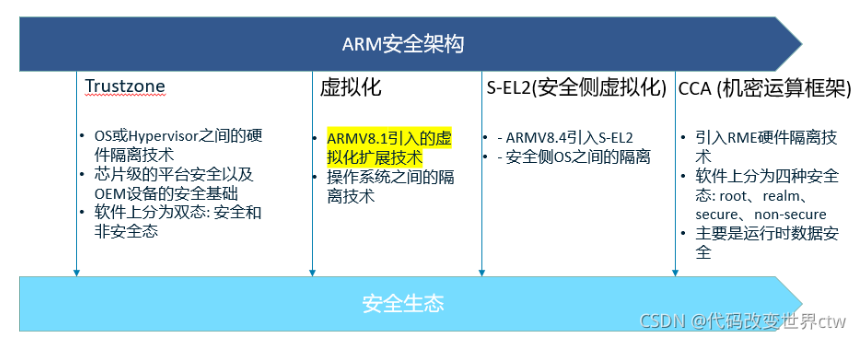
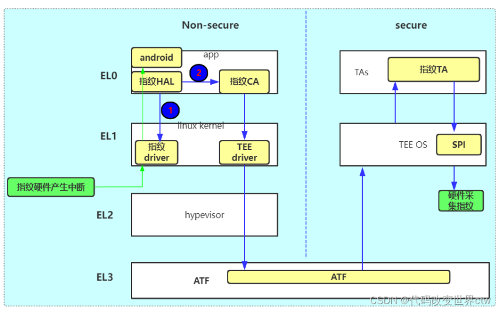
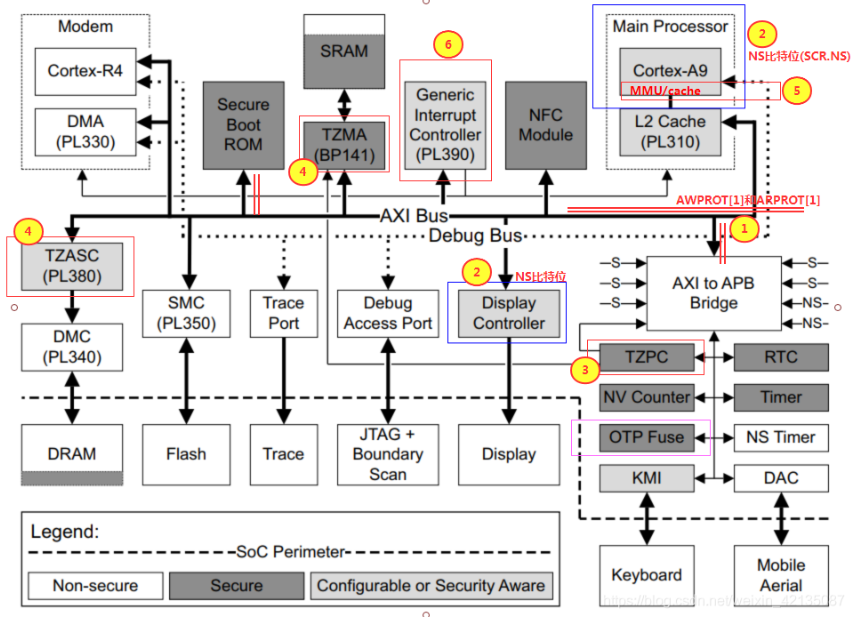
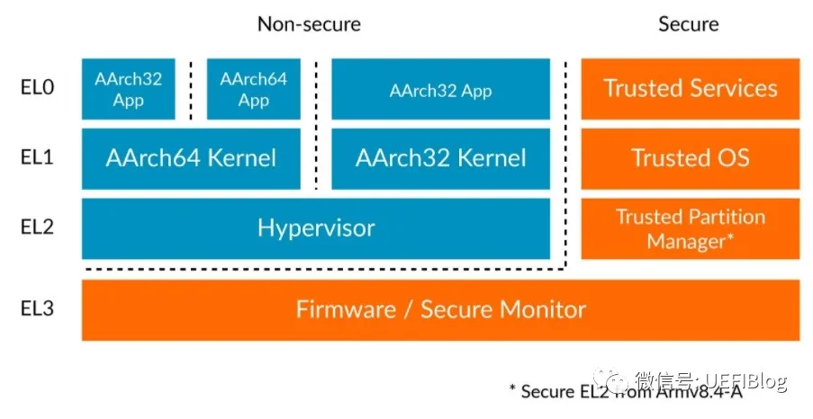
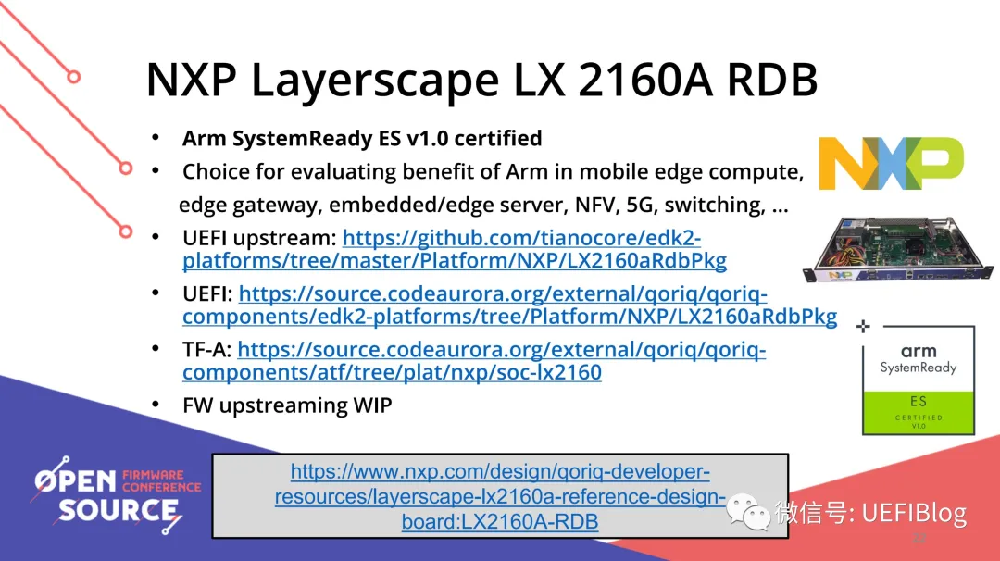
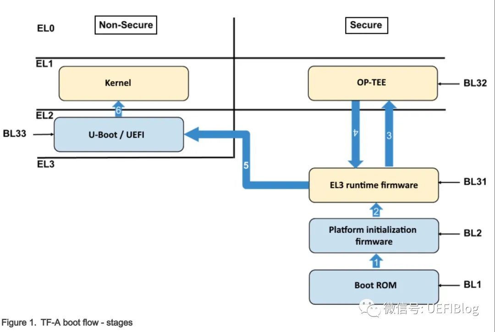

随着时代的发展, 科技的进步, 安全需求的趋势也越来越明显, ARM 也一直在调整和更新其新架构, 很多都是和安全相关的. 如下列出了一些和安全相关的架构



基于 Trust Zone 技术, 硬件被静态隔离, 可预先分配硬件归属于关键应用域或非关键应用域, 不需要 hypervisor 的支持, 相关系统可以同时并行的访问硬件资源. 这种方案的优点是可以消除 Hypervisor 引入的性能延迟, 由于双系统间实现了物理隔离, 多系统间相互影响小, 稳定性及安全性在多系统方案中都达到最高标准, 而且系统间交互通过底层模块保证, 对于系统应用的开发难度较低.

Trustzone 做为 ARM 安全架构的一部分, 从 2008 年 12 月 ARM 公司第一次 release Trustzone 技术白皮书. 2013 年 Apple 推出了第一款搭载指纹解锁的 iPhone:iPhone 5s, 用以保证指纹信息安全的 Secure Enclave 技术据分析深度定制了 ARM trustzone 架构, 印象中这大概是 Trustzone 技术第一次走进大众视线. 到如今 Trustzone 技术已经成为移动安全领域的重要基础技术, 你也许不了解它的技术原理, 但它一直默默为你守护你的指纹信息, 账户密码等各种敏感数据. 如下也列出了一张在 Trustzone 架构下的一张指纹的框图, 这也是这些年 (2015 - 至今) 比较流行的一张软件框图.



# ARM Trustzone 的安全扩展简介

从上文我们已经知道, ARM Trustzone 不具体指一个硬件, 也不是一个软件, 而是一个技术架构. 只有支持 Trust Zone 技术的 ARM 核配合安全扩展组件, 才能为整个系统提供芯片硬件级别的保护和隔离. 在支持 ARM Trustzone 的 SOC 中, 需按照 ARM Trustzone 技术对各个子模块进行设计. 如下便展示了一个 SOC 的 Trustzone 架构下的设计框图



Trust Zone 技术之所以能提高系统的安全性, 是因为对外部资源和内存资源的硬件隔离. 这些硬件隔离包括中断隔离, 片上 RAM 和 ROM 的隔离, 片外 RAM 和 ROM 的隔离, 外围设备的硬件隔离, 外部 RAM 和 ROM 的隔离等. 实现硬件层面的各种隔离, 需要对整个系统的硬件和处理器核做出相应的扩展. 这些扩展包括:


# ATF 的由来

TF(Trusted Firmware) 是 ARM 在 Armv8 引入的安全解决方案, 为安全提供了整体解决方案. 它包括启动和运行过程中的特权级划分, 对 Armv7 中的 TrustZone(TZ) 进行了提高, 补充了启动过程信任链的传导, 细化了运行过程的特权级区间. TF 实际有两种 Profile, 对 ARM Profile A 的 CPU 应用 TF-A, 对 ARM Profile M 的 CPU 应用 TF-M. 我们一般接触的都是 TF-A, 又因为这个概念是 ARM 提出的, 有时候也缩写做 ATF(ARM Trusted Firmware), 所以本文对 ATF 和 TF-A 不再做特殊说明, ATF 也是 TF-A, 对 TF-M 感兴趣的读者可以自行查询官网 (https://www.trustedfirmware.org/).

有些同学混淆了 ATF 和 TZ 的区别. 实际上, TZ 更多的是和 Intel 的 SGX 概念对应, 是在 CPU 和内存中区隔出两个空间: Secure 空间和 Non-Secure 空间. 而 ATF 中有个 Firmware 概念, 它实际上是 Intel 的 Boot Guard, 特权级和提高版的 TZ 的混合体. 它在保有 TZ 的 Secure 空间和 Non-Secure 空间的同时, 划分了 EL0(Exception level 0) 到 EL3 四个特权级:



其中 EL0 和 EL1 是 ATF 必须实现的, EL2 和 EL3 是可选的. 实际上, 没有 EL2 和 EL3, 整个模型就基本退化成了 ARMv7 的 TZ 版本. 从高 EL 转低 EL 通过 ERET 指令, 从低 EL 转高 EL 通过 exception, 从而严格区分不同的特权级. 其中 EL0,EL1,EL2 可以分成 NS-ELx(None Secure ELx) 和 S-ELx(Secure ELx) 两种, 而 EL3 只有安全模式一种.

ATF 带来最大的变化是信任链的建立 (Trust Chain), 整个启动过程包括从 EL3 到 EL0 的信任关系的打通, 过程比较抽象. NXP 的相关文档 (https://www.nxp.com.cn/docs/en/user-guide/LSDKUG_Rev20.04_290520.pdf) 比较充分和公开, 它的源代码也是开源的 (https://zhuanlan.zhihu.com/p/391101179#ref_3). 我们结合它的文档和源代码来理解一下.

# ATF 启动流程

ARM 开源了 ATF 的基本功能模块, 大家可以在这里下载:

git clone  https://github.com/ARM-software/arm-trusted-firmware.git

里面已经包含了不少平台, 但这些平台的基础代码有些是缺失的, 尤其是和芯片部分和与 UEFI 联动部分. 这里我推荐它的一个分支: NXP 的 2160A 芯片的实现.

ARM 推出了 System Ready 计划, 效果相当不错, 关于它我们今后再单独讲. 2020 年底, ARM 在 OSFC 推出新的一批 System Ready 机型 (https://zhuanlan.zhihu.com/p/391101179#ref_4),NXP 2160A 名列其中:



ATF 代码下载可以用:

```
git clone https://source.codeaurora.org/external/qoriq/qoriq-components/atf -b LX2160_UEFI_ACPI_EAR3
```

UEFI 代码下载可以用图片上的地址. 我们可以把参考资料 2 和这些代码对照来看, 加深理解.
支持 ATF 的 ARM 机器, 启动过程如下



注意蓝色箭头上的数字, 它是启动顺序. 一切起源于在 EL3 的 BL1.

## BL1:Trusted Boot ROM

启动最早的 ROM, 它可以类比 Boot Guard 的 ACM,

什么是 Boot Guard? 电脑启动中的信任链条解析

不过它是在 CPU 的 ROM 里而不是和 BIOS 在一起, 是一切的信任根. 它的代码在这里:


ARM Trusted Firmware(ATF) 是用于 ARM 架构设备的开源可信固件实现, 旨在为基于 ARM 的系统提供一个安全的执行环境.

# 基本概念

ARM 架构将系统分为普通世界 (Normal World) 和安全世界 (Security World). 普通世界运行常规的操作系统和应用程序, 而安全世界则用于处理对安全性要求极高的任务. ARM Trusted Firmware 就运行在安全世界, 作为安全世界的初始软件层, 为系统提供安全基础服务和安全启动等关键功能.

# 主要功能

## 1. 安全启动

-** 代码认证 **: 在系统启动过程中, ATF 会对加载的各个组件 (如引导加载程序, 操作系统内核等) 进行严格的认证. 它会验证这些组件的数字签名, 确保其来源可靠且未被篡改. 只有通过认证的代码才能被执行, 从而防止恶意软件在系统启动阶段入侵.

-** 启动流程控制 **:ATF 负责管理安全启动的整个流程, 从最初的上电复位到最终将控制权交给普通世界的操作系统. 它会按照预定的顺序依次加载和验证各个启动组件, 保证系统启动的安全性和稳定性.

## 2. 安全监控模式管理

-** 世界切换 **: 安全监控模式是普通世界和安全世界之间的过渡层. ATF 管理着这种世界切换机制, 当普通世界的代码需要执行安全敏感操作 (如密钥管理, 加密解密等) 时, 会通过特定的指令请求进入安全世界. ATF 会处理这些请求, 确保安全地切换到安全世界, 并在操作完成后再安全地切换回普通世界.

-** 上下文保存与恢复 **: 在进行世界切换时, ATF 需要保存和恢复系统的上下文信息, 包括寄存器状态, 内存映射等. 这样可以保证在切换过程中不会丢失数据, 并且能够正确地恢复执行状态.

## 3. 可信操作系统支持

-** 硬件初始化 **: ATF 会对安全世界所需的硬件资源进行初始化, 如安全内存区域, 加密引擎等. 它会配置这些硬件的参数, 确保其正常工作, 并为可信操作系统提供一个稳定的硬件环境.

-** 系统服务提供 **: 为运行在安全世界的可信操作系统 (如 OP - TEE) 提供底层的系统服务, 如中断处理, 内存管理等. 这些服务使得可信操作系统能够高效地运行, 并且与普通世界进行安全交互.

# 软件架构

ARM Trusted Firmware 通常由多个阶段的固件组成, 常见的有 BL1,BL2,BL31 和 BL33 等:

-**BL1(Primary Bootloader)**: 这是启动过程中的第一个阶段, 通常存储在芯片的内部 ROM 中. BL1 负责进行基本的硬件初始化, 并加载和验证 BL2.

-**BL2(Secondary Bootloader)**:BL2 进一步完成硬件初始化工作, 并加载和验证 BL31 和 BL33. 它可以存储在外部存储设备 (如闪存) 中.

-**BL31(Trusted Execution Environment (TEE) Firmware)**:BL31 是 ATF 的核心部分, 运行在安全世界. 它负责管理安全监控模式, 处理世界切换请求, 并为可信操作系统提供支持.

-**BL33(Normal World Bootloader)**:BL33 是普通世界的引导加载程序, 如 U - Boot. 它在通过 ATF 的安全验证后被加载和执行, 最终启动普通世界的操作系统.

# 应用场景

-** 移动设备 **: 在智能手机, 平板电脑等移动设备中, ATF 用于保护用户的敏感信息, 如指纹识别数据, 支付信息等. 当用户进行指纹解锁或移动支付时, 相关的安全操作会在安全世界中执行, 由 ATF 提供安全保障.

-** 物联网设备 **: 物联网设备通常面临着各种安全威胁, ATF 可以增强设备的安全性, 防止设备被攻击和篡改. 例如, 智能家居设备, 工业物联网传感器等可以利用 ATF 来保护设备的通信和数据安全.

-** 汽车电子 **: 在汽车电子系统中, 如车载信息娱乐系统, 自动驾驶控制单元等, ATF 可以确保系统的安全性和可靠性. 它可以防止恶意软件对汽车系统的攻击, 保障行车安全.


# reference

https://zhuanlan.zhihu.com/p/391101179
