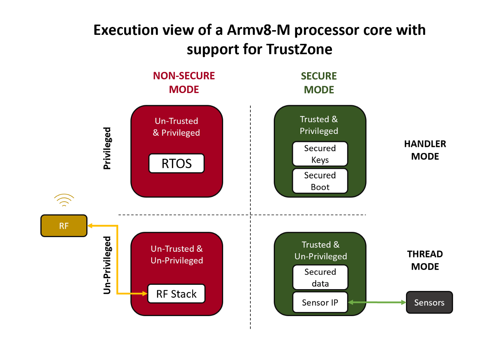

- [1. 背景](#1-背景)
- [2. TEE 如何保障数据安全](#2-tee-如何保障数据安全)
- [3. TEE 解决方案](#3-tee-解决方案)
- [4. 手机领域的 TEE](#4-手机领域的-tee)
- [5. 物联网领域的 TEE](#5-物联网领域的-tee)
- [6. OP-TEE](#6-op-tee)
- [7. Ref](#7-ref)

# 1. 背景

在没有集成 trustzone 的环境有一个风险就是当获取 root 权限之后, 就可以随心所欲访问所有的数据, 这样的操作就十分的危险. 为了保障这一部分数据在 root 权限下不被轻松截获, 因此在硬件层级引入了 trustzone 技术提供了(Trusted Execution Environment - TEE).

# 2. TEE 如何保障数据安全

ARM 从 **ARMv6** 的架构开始引入了 **TrustZone** 技术. TrustZone 技术将 CPU 的工作状态分为了**正常世界状态**(Normal World Status, NWS)和**安全世界状态** (Secure World Status, SWS).

支持 TrustZone 技术的芯片提供了对外围硬件资源的**硬件级别**的**保护和安全隔离**.

* 当 **CPU** 处于**正常世界状态**时, 任何应用都**无法访问安全硬件设备**, 也**无法访问**属于**安全世界状态下的内存**, **缓存** (Cache) 以及**其他外围安全硬件设备**.

**TEE** 是基于 TrustZone 技术提供**可信运行环境**, 还为开发人员**提供了 API**, 以方便他们开发实际应用程序.

在整个系统的软件层面, 一般的操作系统 (如 Linux, Android, Windows 等) 以及应用运行在**正常世界状态**中, TEE 运行在**安全世界状态**中, 正常世界状态内的开发资源相对于安全世界状态较为丰富, 因此通常称运行在**正常世界状态**中的环境为**丰富执行环境** (`Rich Execution Environment`, **REE**), 而**可信任的操作系统**以及**上层的可信应用**(`Trusted Application`, **TA**) 运行于**安全世界状态**, 运行在安全世界状态中的系统就是前文提到的 **TEE**.

对 CPU 的工作状态区分之后, 处于**正常世界状态**中的 **Linux** 即使**被 root** 也**无法**访问**安全世界状态**中的任何资源, 包括操作安全设备, 访问安全内存数据, 获取缓存数据等.

这是因为 **CPU** 在访问**安全设备**或者**安全内存地址空间**时, **芯片级别**的**安全扩展组件**会去**校验** CPU 发送的**访问请求**的**安全状态读写信号位**(`Non-secure bit`, NS bit)是 0 还是 1, 以此来判定当前 CPU 发送的资源访问请求是安全请求还是非安全请求. 而处于**非安全状态**的 **CPU** 将**访问指令**发送到**系统总线**上时, 其访问请求的安全状态读写信号位都会**被强制设置成 1**, 表示**当前 CPU** 的访问请求为**非安全请求**. 而非安全请求试图去访问安全资源时会被**安全扩展组件**认为是**非法访问**的, 于是就禁止其访问安全资源, 因此该 CPU 访问请求的返回结果要么是访问失败, 要么就是返回无效结果, 这也就实现了对系统资源硬件级别的安全隔离和保护.

在**真实环境**中, 可以将**用户的敏感数据**保存到 **TEE** 中, 并由**可信应用** (`Trusted Application`, **TA**) 使用重要算法和处理逻辑来完成对数据的处理. 当需要使用用户的敏感数据做身份验证时, 则通过在 **REE** 侧定义具体的**请求编号** (IDentity, ID) 从 TEE 侧获取验证结果. 验证的整个过程中用户的**敏感数据**始终处于 TEE 中, REE 侧无法查看到任何 TEE 中的数据. 对于 **REE** 而言, TEE 中的 TA 相当于一个黑盒, 只会接受有限且提前定义好的**合法调用**(**TEEC**), 而至于这些合法调用到底是什么作用, 会使用哪些数据, 做哪些操作在 REE 侧是无法知晓的. 如果在 REE 侧发送的调用请求是非法请求, TEE 内的 TA 是不会有任何的响应或是仅返回错误代码, 并不会暴露任何数据给 REE 侧.

# 3. TEE 解决方案

TEE 是一套完整的安全解决方案, 主要包含:

* **正常世界状态**的**客户端应用**(`Client Application`, CA)
* **安全世界状态**的**可信应用**, **可信硬件驱动**(`Secure Driver`, SD)
* **可信内核系统**(`Trusted Execution Environment Operation System`, TEE OS),

其**系统配置**, **内部逻辑**, **安全设备**和**安全资源**的**划分**是与 CPU 的**集成电路** (Integrated Circuit, IC) **设计**紧密挂钩的, **使用 ARM 架构设计的不同 CPU,TEE 的配置完全不一样**. 国内外针对不同领域的 CPU 也具有不同的 TEE 解决方案.

国内外各种 TEE 解决方案一般都**遵循 GP(Global Platform)规范**进行开发并实现相同的 API. GP 规范规定了 TEE 解决方案的架构以及供 TA 开发使用的 API 原型, 开发者可以使用这些规定的 API 开发实际的 TA 并能使其正常运行于不同的 TEE 解决方案中.

# 4. 手机领域的 TEE

各家 TEE 解决方案的内部操作系统的逻辑会不一样, 但都能提供 GP 规范规定的 API, 对于二级厂商或 TA 开发人员来说接口都是统一的. 这些 TEE 解决方案在智能手机领域主要用于实现**在线支付**(如 微信支付, 支付宝支付), **数字版权保护**(DRM, Winevine Level 1, China DRM), **用户数据安全保护**, **安全存储**, **指纹识别**, **虹膜识别**, **人脸识别**等其他安全需求. 这样可以降低用户手机在被非法 root 之后带来的威胁.

Google 规定在 Android M 之后所有的 Android 设备在使用指纹数据时都需要用 TEE 来进行保护, 否则无法通过 Google 的 CTS 认证授权, 另外 Android 也 建议使用**硬件 Keymaster** 和 **gatekeeper** 来强化系统安全性.

# 5. 物联网领域的 TEE

物联网 (Internet of Thing, IoT) 领域和车载系统领域将会是未来 TEE 方案使用的另外一个重要方向, 大疆无人机已经使用 TEE 方案来保护无人机用户的私人数据, 航拍数据以及关键的飞控算法.

ARM 的 M 系列也开始支持 TrustZone 技术, 如何针对资源受限的 IoT 设备实现 TEE 也是未来 TEE 的重要发展方向之一.

而在**车载领域 NXP 芯片**已经集成 **OP-TEE** 作为 TEE 方案, **MediaTek 的车载芯片**也已集成了 **Trustonic** 的 **TEE** 方案, 相信在车载系统领域 TEE 也将渐渐普及.

参考[^1][^2]

# 6. OP-TEE

**OP-TEE** 是由非营利的开源软件工程公司 **Linaro** 开发的, 从 git 上可以获取 OP-TEE 的所有源代码, 且 OP-TEE 支 持的芯片也越来越多, 相信未来 OP-TEE 将有可能是 TEE 领域的 Linux, 并得到更加广泛的运用.

OP-TEE 是按照 GP 规范开发的, 支持 QEMU, Hikey(Linaro 推广的 96Board 系列平台之一, 使用 Hisilicon 处理器)以及其他通用的 ARMv7/ARMv8 平台, 开发环境搭建方便, 便于开发者开发自有的 上层可信应用, 且 OP-TEE 提供了完整的软件开发 工具包(Software Development Kit, SDK), 方便编译 TA 和 CA. OP-TEE 遵循 GP 规范, 支持各种加解密和电子签名验签算法以便实现 DRM, 在线支付, 指纹和虹膜识别功能. OP-TEE 也支持在芯片中集成第三方的硬件加解密算法. 除此之外, 在 IoT 和车载芯片领域也大都使用 **OP-TEE** 作为 **TEE 解决方案**.

OP-TEE 由 Linaro 组织负责维护, 安全漏洞补丁更新和代码迭代速度较快, 系统的健壮性也越来越好, 所以利用 OP-TEE 来研究 TrustZone 技术的实现并开发 TA 和 CA 将会是一个很好的选择.

# 7. Ref

[^1]:[Overview of the OP-TEE open source projec](https://wiki.stmicroelectronics.cn/stm32mpu/wiki/OP-TEE_overview)

[^2]:[Demystifying ARM TrustZone for Microcontrollers (and a Note on Rust Support)](https://medium.com/swlh/demystifying-arm-trustzone-for-microcontrollers-and-a-note-on-rust-support-54efc62c290)
