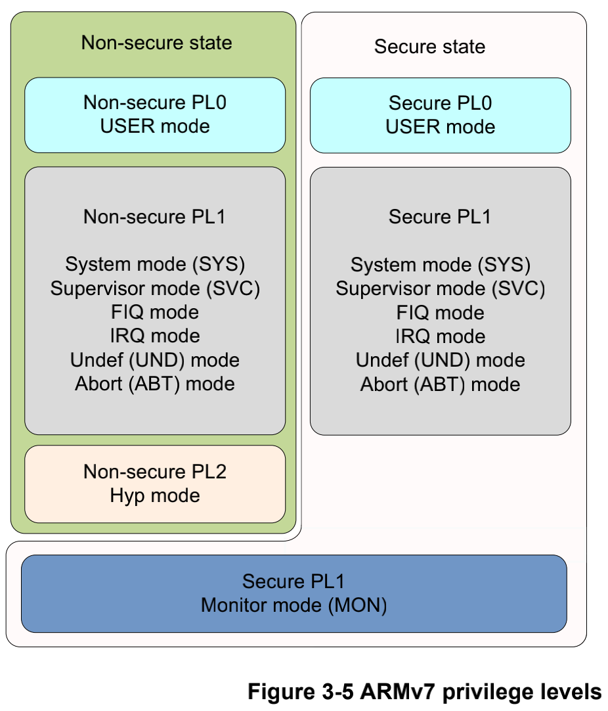

- [1. 简介](#1-简介)
- [2. TrustZone](#2-trustzone)
  - [2.1. 一个支持 TZ 的 SoC 设计](#21-一个支持-tz-的-soc-设计)
    - [2.1.1. ARMv7 的 TZ](#211-armv7-的-tz)
    - [2.1.2. ARMv8 的 TZ](#212-armv8-的-tz)
- [3. ARM 安全扩展组件](#3-arm-安全扩展组件)
  - [3.1. AXI 总线上安全状态位的扩展](#31-axi-总线上安全状态位的扩展)
  - [3.2. AXI-to-APB 桥的作用](#32-axi-to-apb-桥的作用)
    - [3.2.1. 实现外围设备隔离](#321-实现外围设备隔离)
  - [3.3. TZ 地址空间控制组件(TZASC)](#33-tz-地址空间控制组件tzasc)
    - [3.3.1. 实现片外 DRAM 的隔离](#331-实现片外-dram-的隔离)
  - [3.4. TZ 内存适配组件(TZMA)](#34-tz-内存适配组件tzma)
    - [3.4.1. 实现片上 RAM 和片上 ROM 隔离](#341-实现片上-ram-和片上-rom-隔离)
  - [3.5. TZ 保护控制器组件(TZPC)](#35-tz-保护控制器组件tzpc)
  - [3.6. TZ 中断控制器(TZIC)](#36-tz-中断控制器tzic)
    - [3.6.1. VIC](#361-vic)
    - [3.6.2. GIC](#362-gic)
  - [3.7. Cache 和 MMU 扩展](#37-cache-和-mmu-扩展)
    - [3.7.1. MMU 扩展](#371-mmu-扩展)
    - [3.7.2. Cache 扩展](#372-cache-扩展)
    - [3.7.3. TLB 扩展](#373-tlb-扩展)
  - [3.8. 调试和跟踪](#38-调试和跟踪)
  - [3.9. 其他设备](#39-其他设备)
- [4. ATF](#4-atf)
  - [4.1. 为什么使用 ATF](#41-为什么使用-atf)
  - [4.2. ATF 的主要功能](#42-atf-的主要功能)
  - [4.3. ATF 与 TEE 的关系](#43-atf-与-tee-的关系)
- [5. REF](#5-ref)

# 1. 简介

TrustZone 的原理以及在 ARMv7 和 ARMv8 架构下 TrustZone 技术实现的差异. TrustZone 对系统实现了硬件隔离, 将系统资源划分成安全和非安全两种类型, 同时在系统总线上增加安全读写信号位, 通过读取安全读写信号位电平来确定当前处理器的工作状态, 从而判断是否具有该资源的访问权限. 因此, TrustZone 从硬件级别实现了对系统资源的保护.

ARM 可信任固件 (ARM Trusted Firmware, ATF) 是由 ARM 官方提供的底层固件, 该固件统一 了 ARM 底层接口标准, 如**电源状态控制接口**(Power Status Control Interface, PSCI), **安全启动需求**(Trusted Board Boot Requirements, TBBR), **安全世界状态**(SWS) 与**正常世界状态**(NWS)**切换**的安全监控模式调用 (secure monitor call,smc) 操作等. ATF 旨在将 ARM 底层的操作统一使代码能够重用和便于移植.

# 2. TrustZone

我们来了解一下 TrustZone 在硬件上提供了哪些支持, 能够实现物理的隔离. ARM 早在 ARMv6 架构中就引入了 TrustZone 技术, 且在 ARMv7 和 ARMv8 中得到增强, TrustZone 技术能提供芯片级别对硬件资源的保护和隔离, 当前在手机芯片领域已被广泛应用.

## 2.1. 一个支持 TZ 的 SoC 设计

一个完整的片上系统(System on Chip,SoC) 由 ARM 核, 系统总线, 片上 RAM, 片上 ROM 以及其他外围设备组件构成. 只有支持 TrustZone 技术的 ARM 核配合安全扩展组件, 才能为整个系统提供芯片硬件级别的保护和隔离. 如下图所示, 为一个使能了 TZ 的 SoC 系统.

**对于 TZ 我们需要关注的是, 在硬件上 TrustZone 要起到下面的作用**:

* 隔离功能(安全状态和非安全状态)

* 外设和内存(物理上分开)

* 总线请求

支持 TrustZone 技术的 ARM 核在运行时将工作状态划分为两种: **安全状态和非安全状态**. 当处理器核处于**安全状态**时**只能运行 TEE 侧的代码**, 且具有 **REE** 侧地址空间的**访问权限**. 当处理器核处于**非安全状态**时只能运行 REE 侧的代码, 且只能通过**事先定义好的客户端接口**来获取 **TEE** 侧中特定的数据和调用特定的功能.

系统通过调用**安全监控模式调用** (`secure monitor call`, **smc**) 指令 (或者**依靠中断**) 实现**ARM 核的安全状态与非安全状态之间的切换**. 而 ARM 核对系统资源的访问请求是否合法, 则由 **SoC 上的安全组件**通过判定 ARM 核发送到 SoC 系统总线上的访问请求中的安全 状态读写信号位 (`Non-secure bit`, **NS bit**) 来决定. 只有当 ARM 核处于安全状态 (`NS bit=0`) 时发送到系统总线上的读写操作才会被识别为安全读写操作, 对应 TEE 侧的数据资源才能被访问. 反之, 当 ARM 核处于非安全状态 (NS bit=1) 时, ARM 核发送到系统总线上的读写操作请求会被作为非安全读写操作, **安全组件会根据对资源的访问权限配置来决定是否响应该访问请求**. 这也是 TrustZone 技术能实现对系统资源硬件级别的保护和隔离的根本原因.

### 2.1.1. ARMv7 的 TZ

ARMv7 架构中使用了 TrustZone 技术的系统软件层面的框图[^1]:

在 ARMv7 架构中 CPU 在运行时具有不同的特权等级, 分别是 PL0(USR),PL1(FIQ/IRQ, SYS,ABT,SVC,UND 和 MON)以及 PL2(Hyp), 即 ARMv7 架构在原有七种模式之上扩展了**Monitor 模式和 Hyp 模式**.Hyp 模式是 ARM 核用于实现虚拟化技术的一种模式. 系统只有在 Monitor 模式下才能实现安全状态和非安全状态的切换.

当系统在 REE 侧或者 TEE 侧运行时, 系统执行 `SMC`(**安全监控模式调用**)指令进入 Monitor 模式, 通过判定系统 SCR 寄存器中对应的值来确定请求来 源 (REE/TEE) 以及发送目标(REE/TEE), 相关寄存器中的值只有当系统处于安全态时才可以更改. 具体如何转变可以参考: `09. [内核]ARM核安全态和非安全态的切换.md`

### 2.1.2. ARMv8 的 TZ

在 ARMv8 架构中改用**执行等级**(Execution Level, EL) `EL0～EL3` 来定义 ARM 核的运行等级, 其中 EL0～EL2 等级分为**安全态**和**非安全态**.

ARMv8 架构与 ARMv7 架构中 ARM 核运行权限的对应关系如图所示[^2]:

ARMv7 架构中的

* PL0(USR)对应 ARMv8 架构中的 EL0;

* PL1(SVC/ABT/IRQ/FIQ/UND/SYS)对应 ARMv8 架构中的 EL1;

* ARMv7 架构中的 Hyp 模式对应 ARMv8 架构中的 EL2;

* ARMv7 架构中的 Mon(Monitor)则对应于 ARMv8 架构中的 EL3.

ARMv8 架构同样也是使用**安全监控模式调用指令**(SMC)使处理器进入 EL3, 在 **EL3** 中运行的**代码**负责**处理器安全状态**和**非安全状态**的**切换**, 其中关于 TEE 和 REE 切换的处理方式与 ARMv7 架构中 Monitor 模式下的处理方式类似, 具体如何转变可以参考: `09. [内核]ARM核安全态和非安全态的切换.md`

# 3. ARM 安全扩展组件

ARM 安全扩展组件, 相当于对于 TZ 的实现, 就类似于我们实现温湿度测量仪, 必须要实现温度传感器采集, 湿度传感器采集还有显示面板这些子模块的功能. 对于 TZ 也是一样, 实现 TZ 在 ARM 上必然要进行安全扩展组件的支持, 以支撑 TZ 的实现.

TrustZone 技术之所以能提高系统的安全性, 是因为对**外部资源**和**内存资源**的**硬件隔离**. 这些硬件隔离包括**片内内存隔离**(**中断隔离**, **片上 RAM 和 ROM 的隔离**, **片外 RAM 和 ROM 的隔离**), **外围设备的硬件隔离**, **外部 RAM 和 ROM 的隔离**等.

实现硬件层面的各种隔离, 需要对整个系统的**硬件和处理器核**做出相应的**扩展**. 这些扩展包括:

* 对**处理器核的虚拟化**, 也就是将 ARM 处理器的运行状态分为**安全态**和**非安全态**.

* 对**总线的扩展**, 增加**安全位读写信号线**.

* 对**内存管理单元 (Memory Management Unit, MMU) 的扩展**, 增加**页表的安全位**. [14_ARMv8_内存管理(二)-ARM 的 MMU 设计](https://github.com/carloscn/blog/issues/54)

* 对**缓存 (Cache) 的扩展**, 增加安全位. [17_ARMv8_高速缓存(二)ARM cache 设计](https://github.com/carloscn/blog/issues/58)

* 对**快表 (TLB) 的扩展**, 增加安全位. [19_ARMv8_TLB 管理(Translation Lookaside buffer)](https://github.com/carloscn/blog/issues/60)

* 对其他**外围组件进行了相应的扩展**, 提供安全操作权限控制和安全操作信号.

我们围绕这几项来阐述一下 ARM 的扩展组件设计, 加深对于安全访问的理解.

**必选组件**:

-   AMBA3 AXI **总线**: 安全机制基础设施.

-   ARMv8A Core El2: 虚拟安全和非安全核.

-   TZASC(`Trust Zone Address Space Controller`): 将**内存**分成**多个区域**, **每个区域**可以单独配置为**安全**或**非安全区域**. 只能用于**内存设备**, 不能用于块设备.

-   **TZPC**(`TrustZone Protection Controller`): 根据需要控制**外设安全特性**.

**可选组件**:

-   **TZMA**(`TrusztZone Memory Adapter`): 将片上 **RAM** 和 **ROM** 分成不同安全和非安全区域.

-   `AXI-to-APB bridge`: **桥接 APB 总线**, 配合 TZPC 使 APB 总线外设支持 TrustZone 安全特性.

## 3.1. AXI 总线上安全状态位的扩展

为了支持 TrustZone 技术, 控制处理器在不同状态下对硬件资源访问的权限, ARM 对**先进可扩展接口** (`Advanced eXtensible Interface`, **AXI**) **系统总线**进行了扩展.

在原有 AXI 总线基础上对每一个**读写信道**增加了一个**额外的控制信号位**, 用来表示当前的读写操作是安全操作还是非安全操作, 该信号位称为**安全状态位** (`NS bit`) 或者**非安全状态位** (`Non-Secure bit`).

* `AWPROT[1]`: **总线写事务** —— **低位**表示**安全写**事务操作, **高位**表示**非安全写**事务操作.

* `ARPROT[1]`: **总线读事务** —— **低位**表示**安全读**事务操作, **高位**表示**非安全读**事务操作.

当**主设备**通过**总线**发起**读写操作**时, **从设备**或者**外围资源**同时也需要将对应的 PROT 控制信号发送到总线上. **总线**或者**从设备**的**解码逻辑**必须能够解析该 PROT 控制信号, 以便保证安全设备在非安全态下不被非法访问. **所有的非安全主设备**必须将**安全状态位置成高位**, 这样就能够保证**非安全主设备无法访问到安全从设备**.

如果一个**非安全主设备** 试图访问一个**安全从设备**, 将会在总线或者从设备上触发一个**错误操作**, 至于该错误如何处理就依赖于**从设备的处理逻辑**和**总线的配置**. 通常这种非法操作最终将产生一个 **SLVERR**(`slave error`)或者 **DECERR**(`decode error`).

简单来说, **AXI 总线**能够识别对于安全和非安全设备的访问(**读写粒度**的识别).

**主控**告知访问权限, **内存系统决定**是否允许访问. **内存系统权限检查**一般是通过**互联总线**. 比如 NIC-400 可以设置如下属性:

-  **安全**: 仅安全访问可以通过, 互联总线对非安全访问产生异常, 非安全访问不会抵达设备.

-  **非安全**: 仅非安全访问可以通过, 互联总线对安全访问产生异常, 安全访问不会抵达设备.

-  **启动可配置**: 系统初始化时可以**配置设备**为安全或非安全. 默认是安全.

-  **TrustZone aware**: 互联总线**允许所有访问通过**, 连接的**设备自身负责隔离**.

**A 系列处理器**都是 **TrustZone aware** 的, 每次总线访问发送争取的安全状态. 但还存在一些**非处理器**的**总线主控**, 比如 GPU, DMA 等.

因此将**总线主控**分为两种:

-   **TrustZone aware**: 每次总线访问都能提供合适安全信息.

-   **Non-TrustZone aware**: 此类主设备访问总显示无法提供安全信息, 或每次都是同样安全信息.

对于 **Non-Trusted-aware** 需要采取的措施有:

-   设计时固定地址: 给设备**固定的访问地址**.

-   可配逻辑单元: 为主设备访问添加安全信息逻辑单元.

-   SMMU: 对于一个可信主设备, SMMU 可以像安全状态下的 MMU 一样处理.

## 3.2. AXI-to-APB 桥的作用

TrustZone 同样能够保护外围设备的安全, 例如: 中断控制, 时钟, I/O 设备, 因此 Trust-Zone 架构还 能用来解决更加广泛的安全问题. 比如一个安全中断控制器和安全时钟允许一个非中断的安全任务来监控系统, 能够为 DRM 提供可靠的时钟, 能够为用 户提供一个安全的输入设备从而保证用户密码数据不会被恶意软件窃取.

AMBA3 规范包含了一个低门数, 低带宽的外设总线, 被称作**外设总线**(`Advanced Peripheral Bus`, APB), APB 通过 `AXI-to-APB` 桥连接到系统总线上.

而 **APB 总线**并**不具有安全状态位**, 为实现 APB 外设与 TrustZone 技术相兼容, **APB-to-AXI 桥**将负责管理 APB 总线上**设备的安全**. `APB-to-AXI` 桥会拒绝不匹配的安全事务设置, 并且不会将该事务请求发送给外设.

### 3.2.1. 实现外围设备隔离

**其他外围设备**都会挂载到 **APB 总线**上, 然后通 过 **AXI-to-APB 桥**连接到 AXI 总线上, `AXI-to-APB` 结合 **TZPC 组件**的 **TZPCDECROT** 的值及**访问请求的 PROT 信号**来判定**该访问是否有效**. 当**处理器**需要 访问**外围设备**时, 会将地址和 PROT 信号发送到 AXI 总线上.

AXI-to-APB 桥会对接收到的请求进行解析, 获取需要访问的所需外围设备, 然后通过查询 TZPCDECROT 的值来判断外设的安全类型, 再根据 PROT 信号就能判定该请求的安全类型. 如果该请求是非安全请求, 但需要访问的外围设备属于安全设备, 则 AXI-to-APB 会判定该访问无效.

通过对 TZPC 中的 TZPCDECROT 寄存器进行编程能够设置外设的安全类型, 从而做到外设在硬件层面的隔离.

## 3.3. TZ 地址空间控制组件(TZASC)

**TrustZone 地址空间控制组件** (`TrustZone Address Space Controller`, TZASC)[1] 是 **AXI 总线**上的一个主设备, TZASC 能够将**从设备**全部的**地址空间**分割成一系列的**不同地址范围**.

在安全状态下, 通过编程 TZASC 能够将这一系列分割后的地址区域设定成安全空间或者是非安全空间. 被配置成安全属性的区域将会拒绝非安全的访问请求.

使用 TZASC 主要是将**一个 AXI 从设备**分割成**几个安全设备**, 例如 off-Soc, DRAM 等.

* ARM 的**动态内存控制器** (`Dynamic Memory Controller`, DMC) 并**不支持安全和非安全分区**的功能.

* 如果将 **DMC** 接到 **TZASC** 上, 就能实现 DRAM 支持安全区域和非安全区域访问的功能.

需要注意的是, TZASC 组件**只支持存储映射设备**对安全和非安全区域的划分与扩展, 但**不支持**对**块设备**(如 EMMC, NAND flash 等) 的安全和非安全区域的划分与扩展.

下图是使用 TZASC 组件的例子[^3]:

The TZASC example system contains:

* an AXI to APB bridge restricting APB traffic to the TZASC to secure only

* a TZASC

* AXI bus masters:

  * an ARM processor

  * a Digital Signal Processor (DSP)

* AXI infrastructure component

* a Dynamic Memory Controller (DMC)

TZASC能提供以下几个功能:

* 能够为每个地址区域编程安全访问权限

* 仅当AXI事务的安全状态与其地址的内存区域的安全设置匹配时, 才允许主服务器和从服务器之间传输数据

* 在 secure_boot_lock 后阻止对各种寄存器的写入访问。

主控告知访问权限, 内存系统决定是否允许访问. 内存系统权限检查一般是通过互联总线. 比如 NIC-400 可以设置如下属性, 对于 **DDR**, 需要将**整个区域**划分为若干安全和非安全区域. 通过 TZASC 可实现:

### 3.3.1. 实现片外 DRAM 的隔离

一个完整的系统必然会有片外 RAM, 对片外 RAM 的隔离是通过 TZASC 组件实现的, **ARM 本身的 DMC** 可以将 DRAM 分割成不同的区域, 这些区域是没有安全和非安全分类.

将 DMC 与 TZASC 相连 后再挂到总线上, 通过**对 TZASC 组件进行编程**可以将 **DRAM** 划分成**安全区域**和**非安全区域**.

当**主设备** 访问 DRAM 时, 除需要提供物理地址之外, 还会发送 **PROT 信号**. TZASC 组件首先会判定主设备需要访问的 DARM 地址是属于安全区域还是非安全区域, 然后再结合接收到的 PROT 信号来判定该次访问是否有效. 如果 PROT 信号为非安全访问操作, 且访问的 DRAM 地址属于安全区域, 则 TZASC 就不会响应这次访问操作, 这样就能实现 DRAM 中安全区域和非安全区域的隔离.

## 3.4. TZ 内存适配组件(TZMA)

**TrustZone 内存适配器组件** (TrustZone Memory Adapter, TZMA)允许对**片上静态内存**(`on-SoC Static Memory`) 或者**片上 ROM** 进行安全区域和非安全区域的划分.

TZMA 支持**最大 2MB 空间**的片上静态 RAM 的划分, 可以将 2MB 空间划分成两个部 分, 高地址部分为非安全区域, 低地址部分为安全区域, 两个区域必须按照 **4KB** 进行对齐.

分区的具体大小通过 TZMA 的输入信号 R0SIZE 来控制, 该信号来自 TZPC 的输出信号 TZPCR0SIZE. 即通过编程 TZPC 可以动态地配置片上静态 RAM 或者 ROM 的大小.. 使用 TZMA 组件的链接框图如图所示[^4]:

仅有安全访问可以配置 TZASC 的寄存器. 比如 TZC-400 可以支持 9 个区域的配置.

### 3.4.1. 实现片上 RAM 和片上 ROM 隔离

**芯片内部**存在**小容量**的 RAM 或者 ROM, 以供**芯片上电时**运行芯片 **ROM** 或者存放**芯片自身相关的数据**. TrustZone 架构对该部分也进行了隔离操作. 隔离操作通过使用 TZMA 和 TZPC 组件来实现.

TZMA 用来将片上 RAM 或者 ROM 划分成安全 区域和非安全区域, **安全区域的大小**则由接入的 **TZPCR0SIZE** 信号来决定. 而 TZPCR0SIZE 的值可以通过**编程 TZPC 组件**中的 **TZPCR0SIZE 寄存器**来实现.

当处理器核访问片上 RAM 或者 ROM 时, TZMA 会判定访问请求的 PROT 信号是安全操作还是非安全操作, 如果处理器发出的请求为非安全请求而该请求又尝试去访问安全区域时, TZMA 就会认为该请求为非法请求. 这样就能实现片上 RAM 和 ROM 的隔离, 达到非安全态的处理器核无法访问片上安全区域的 RAM 和 ROM.

## 3.5. TZ 保护控制器组件(TZPC)

TrustZone 保护控制器组件 (TrustZone Protection Controller, TZPC) 是用来设定 **TZPCDECPROT** 信号和 **TZPCR0SIZE** 等相关控制信号的.

* 这些 **TZPCDECPROT** 信号用来告知 `APB-to-AXI` 对应的外设是安全设备还是非安全设备;

* 而 **TZPCR0SIZE** 信号用来控制 TZMA 对片上 RAM 或片上 ROM 安全区域大小的划分.

TZPC 包含**三组通用寄存器** `TZPCDECPROT[2:0]`, **每组通用寄存器**可以产生 **8 种 TZPCDECPROT 信号**, 也就是 TZPC 最多可以将 **24 个外设**设定成**安全外设**. TZPC 组件还包含一个 **TZPCR0SIZE** 寄存器, 该寄存器用来为 TZMA 提供分区大小信息. TZPC 组件的接口示意如图所示:

当上电初始化时, TZPC 的 TZPCDECPROT 寄存器中的位会被**清零**, 同时 TZPCR0SIZE 寄存器会被设置成 **0x200**, 表示接入到 TZMA 上的**片上 RAM** 或者 **ROM** 的安全区域大小为 2MB. 通过修改 TZPC 的寄存器配置的值可实现用户对资源的特定配置. TZPC 的使用例子如图所示:

## 3.6. TZ 中断控制器(TZIC)

### 3.6.1. VIC

在原来的 ARM 芯片中, 使用 **向量中断控制器** (`Vector Interrupt Controller`, VIC) 来对外部中断源进行控制和管理.

支持 TrustZone 后, ARM 添加了 **TrustZone 中断控制器** (TrustZone Interrupt Controller, TZIC), TZIC 的作用是让处理器处于**非安全态**时**无法捕获到安全中断**.

在芯片设计时, 该组件是**第一级中断源控制器**, 控制**所有的外部中断源**(所有的中断源都需要接到 TZIC 上). 通过编程 TZIC 组件的相关寄存器来设定**每个接入的中断源**的中断类型. 当有中断时, TZIC 会根据配置来判断产生的中断类型:

* 如果是**安全中断源 FIQ**, 以 **nTZICFIQ 信号**直接发送到**处理器**, 在安全世界状态中进行处理.

* 如果是普通中断请求(`Interrupt Request`, IRQ)将会被先发送到非安全的**向量中断控制器** (Vector Interrupt Controller, VIC) 后以 **nIRQ 信号**发送到处理器.

如果在 VIC中将接收到的中断源设定成FIQ, 则该中断源 会被反馈给TZIC组件

TZIC 具有众多寄存器, 细节说明可以参考相关 ARM 的文档. 在 TZIC 中用来设置中断源类型的寄存器为 **TZICIntSelect**, 如果 TZICIntSelect 中的某一位被设置成 1, 则该相应的中断源请求会被设置成**快速中断请求**(Fast Interrupt Request, FIQ). 如果某一位被设置成 0, 则该中断源的中断 请求会被交给 VIC 进行处理. 如果 VIC 的 IntSelect 将 获取到的中断源设置成 FIQ, 那么该中断源会被再次反馈给 TZIC 进行处理[^5].

### 3.6.2. GIC

GIC 支持 TrustZone, **每个中断源**, 即 GIC 规格中的 **INTID**, 可被配置成如下**一种中断组**:

-   **Group 0**: 安全中断, 即 **FIQ**.

-   Secure Group 1: 安全中断, IRQ 或者 FIQ.

-   Non-secure Group 1: 非安全中断, IRQ 或者 FIQ.

可以通过 `GIC[D|R]_IGROUP[D|R]` 和 `GIC[D|R]_IGRPMODR<n>` 寄存器来配置**中断类型**. 这些寄存器**仅在安全状态**下可配置.

* 安全中断仅能被安全访问修改;

* 非安全总线访问读取安全中断寄存器返回全 0.

**EL3** 软件处理 **Group 0** 中断, **Secure Group 1 中断**被 `S.EL1/2` 软件处理.

处理器包括两种中断异常:**IRQ 和 FIQ**.

GIC 产生**何种中断**异常取决于: **中断所属中断组**和**处理器当前安全状态**.

<table border="1">
<tr>
  <th>所属中断组</th>
  <th>当前安全状态</th>
  <th>产生中断异常的类型</th>
  <th>处理者</th>
</tr>
<tr>
  <td rowspan="2">Group 0</td>
  <td>Secure</td>
  <td rowspan="2">FIQ</td>
  <td rowspan="2">EL3 Firmware</td>
</tr>
<tr>
  <td>Non-secure</td>
</tr>
<tr>
  <td rowspan="2">Secure Group 1</td>
  <td>Secure</td>
  <td>IRQ</td>
  <td>TOS(S.EL1)</td>
</tr>
<tr>
  <td>Non-secure</td>
  <td>FIQ</td>
  <td>EL3 Firmware</td>
</tr>
<tr>
  <td rowspan="2">Non-secure Group 1</td>
  <td>Secure</td>
  <td>FIQ</td>
  <td>EL3 Firmware</td>
</tr>
<tr>
  <td>Non-secure</td>
  <td>IRQ</td>
  <td>Linux(NS.EL1)</td>
</tr>
</table>

-   **Group 0** 中断无论发生在 Secure 还是 Non-secure, 都产生 FIQ, 在 EL3 处理.
-   **Secure Group 1** 发生在 Secure 状态中断为 IRQ, 由 `S.EL1` 处理.
-   Secure Group 1 发生在 Non-secure 状态中断为 FIQ, 由 EL3 处理.
-   Non-secure Group 1 发生在 Secure 状态中断为 FIQ, 由 EL3 处理.
-   Non-secure Group 1 发生在 Non-secure 状态中断为 IRQ, 由 `NS.EL1` 处理.

如下图 Non-secure 和 Secure 各有一个 **IRQ vector**, EL3 有一个 **FIQ vector**; 并且 `SCR_EL3.FIQ=1`, `SCR_EL3.IRQ=0`. 左边中断表示发生在非安全世界, 右边表示发生在安全世界.

## 3.7. Cache 和 MMU 扩展

### 3.7.1. MMU 扩展

在支持 TrustZone 的 SoC 上, 会对 **MMU** 进行虚拟化, 使得寄存器 **TTBR0**, **TTBR1**, **TTBCR** 在**安全状态**和**非安全状态**下是**相互隔离**的, 因此两种状态下的**虚拟地址转换表**是**独立**的. 存放在MMU 中的**每一条页表描述符**都会包含**一个安全状态位**, 用以表示被映射的内存是属于安全内存还是非安全内存.

>**安全与非安全**
>
>[14_ARMv8_内存管理(二)-ARM 的 MMU 设计](https://github.com/carloscn/blog/issues/54):
>
>从安全和非安全的角度来看, arm 定义了两个物理地址空间, 安全地址空间和非安全地址空间. 在理论上, 两个地址空间应该是相互平行和独立, **一个系统**也应该**被设计**出**隔离两个空间**的属性. 然而在**大部分真实的系统**中, 指示把**安全**和**非安全**作为**一个访问属性**, 而非两个真实的隔离的空间, 所以安全和非安全的概念是**逻辑上的**, 而**不是物理上的**. 我们设定, normal world 只能够访问被标记为非安全的空间, 而 secure world 有着更高的权限, 既可以访问安全的空间, 又可以访问非安全空间. 实现这个控制, 是在页表上做的手脚.
>
>在安全世界和非安全世界也有 **cache 一致性**的问题. 例如, 由于**安全地址 0x8000** 和**非安全地址 0x8000** 是逻辑上**不同的地址**, 但是他们可能会**在 cache 中共存**. 有一个理想的手段就是禁止安全和非安全的互相访问, 但实际上我们只要**禁止非安全向安全的访问**就可以. 为了避免安全世界的冲突, 必须使用非安全访问非安全的空间, 在安全的页表中加上非安全的映射.
>
>
>
>**在 Page Descriptor 中(页表 entry 中)**, 有 NS 比特位(BIT[5]), 表示当前的映射的内存属于安全内存还是非安全内存:
>
>
>

### 3.7.2. Cache 扩展

Cache 也同样进行了扩展, Cache 中的**每一项**都会按照**安全状态**和**非安全状态**打上对应的**标签**, 在不同的状态下, 处理器只能使用**对应状态下的 Cache**.

如下所示, 以为 cortex-A78 为例, **L1 Data Cache TAG** 中 , 有一个 NS 比特位(`BIT[33]`), 表示当前缓存的 cacheline 是 secure 的还是 non-secure 的:

以 Cortex-a72 为例子, 我们可以找到这个 **L1-D Tag**, 第 30 位来表示这个物理地址是安全或者是非安全.

### 3.7.3. TLB 扩展

虚拟化的 MMU 共享**转换监测缓冲区**(Translation Lookaside Buffer, TLB), 同样**TLB** 中的**每一项**也会打上**安全状态位标记**, 只不过该标记是用来表示该条转换是**正常世界状态转化的**还是**安全世界状态转化的**.

以为 cortex-A78 为例, L1 Data TLB entry 中 , 有一个 NS 比特位(BIT[35]), 表示当前缓存的 entry 是 secure 的还是 non-secure 的. Arm ® Cortex ®-A78 Core - Technical Reference Manual

## 3.8. 调试和跟踪

不同的用户有不同的调试需求, 可以通过如下信号配置:

-   DBGEN: 顶层调试总开关, 控制所有状态调试.

-   SPIDEN: 安全调试开关, 控制安全状态调试.

三种使用场景:

-   芯片开发人员: DBGEN=1 和 SPIDEN=1, 完全外部调试功能.

-   OEM 开发: DBGEN1 但 SPIDEN=0, 仅可在非安全状态调试.

-   产品发布: DBGEN0 和 SPIDEN=0, 禁止安全和非安全调试. 应用程序仍可调试.

## 3.9. 其他设备

一个实际 TrustZone 系统中还需要包括如下设备:

-   OTP 或者 EFuses

-   Non-volatile counter

-   Trusted RAM 和 Trusted ROM

# 4. ATF

## 4.1. 为什么使用 ATF

**ARM 可信任固件** (`ARM Trusted Firmware`, **ATF**) 是由 ARM 官方提供的**底层固件**, 该固件统一了 **ARM 底层接口标准**, 如**电源状态控制接口**(`Power Status Control Interface`, **PSCI**), **安全启动需求**(`Trusted Board Boot Requirements`, **TBBR**), 安全世界状态(SWS) 与正常世界状态 (NWS)**切换**的**安全监控模式调用** (`secure monitor call`, smc) 操作等.

ATF 旨在将 ARM 底层的操作统一使代码能够重用和便于移植.

## 4.2. ATF 的主要功能

ATF 的源代码共分为 **bl1**, **bl2**, **bl31**, **bl32**, **bl33** 部分, 其中

* **bl1**, **bl2**, **bl31** 部分属于**固定的固件**;

* **bl32** 和 **bl33** 分别用于加载 **TEE OS** 和 **REE 侧**的镜像.

整个加载过程可配置成**安全启动**的方式, **每一个镜像文件**在被加载之前都会**验证镜像文件的电子签名**是否合法.

ATF 主要完成的功能如下:

* 初始化**安全世界状态**运行环境, **异常向量**, **控制寄存器**, **中断控制器**, **配置平台的中断**.

* 初始化 ARM **通用中断控制器**(General Interrupt Controller, GIC)2.0 版本和 3.0 版本的**驱动初始化**.

* 执行 ARM 系统 **IP 的标准初始化操作**以及**安全扩展组件**的基本配置.

* **安全监控模式调用** (Secure Monitor Call, SMC) 请求的**逻辑处理代码**(Monitor 模式/EL3).

* 实现**可信板级引导**功能, 对引导过程中加载的**镜像文件**进行**电子签名检查**.

* 支持**自有固件**的**引导**, 开发者可根据具体需求将自有固件添加到 ATF 的引导流程中.

Trusted Firmware 提供了满足 ARM 安全规格的**参考代码**, 包括 **TBBR**(`Trusted Board Boot Requirements`)和 **SMCC**.

SMC Dispatcher: 处理**非安全世界**的 **SMC 请求**, 决定

* 哪些 SMC 由 Trusted Firmware **在 EL3 处理**;

* 哪些**转发**给 **TEE** 进行处理.

Trusted Firmware 处理 PSCI 任务, 或者 SOC 相关工作. 一个典型的基于 TrustZone 系统**软件调用栈**关系图:

* **安全世界**的 **Trusted OS** 提供一系列**安全服务**, 比如 **key 管理**或 **DRM**. **非安全世界**应用需要使用这些服务, 但是又无法直接使用. 通过使用一些**库中 API** 来获取这些能力, 比如 `libDRM.so`.

* 这些**库**和 **Trusted service** 之间**通信**往往通过 **message queue** 或者 **Mailbox**. 他们之间通信所用内存往往被称为 **WSM**(`World Shared Memory`). 这些内存必须能够被 Trusted service 和库访问, 这就意味着这些内存是非安全内存.

* **应用**通过**库**发送**一个请求**到 **Mailbox** 或 **message queue**, 然后触发内核(normal world 中)中 **TrustZone 驱动**.

* **TrustZone 驱动**负责**和 TEE 部分交互**, 包括为 message queue 申请内存和注册这些内存. 由于**安全**和**非安全**运行在**两个虚拟地址空间**, 所以**无法通过虚拟地址**进行通信.

* **TrustZone 驱动**通过调用 **SMC** 进入**安全状态**, 控制权通过 **EL3** 的 Secure Monitor 传递到 TEE 中的 TOS. TOS 从 **message queue 内存**中获取内容给 **Trusted service** 进行处理.

  -  **Trusting the message**: 由于 message 是从**非安全世界**传递的, 所以需要安全世界需要**对这些内容**进行一些**认证**.

  -  **Scheduling**: 对于 PSCI 类型快速处理并且不频繁请求, 进入 **EL3** 处理完后**退出到非安全状态**. 对于一些需要 **TOS** 处理的任务, 不能被**非安全中断**打断, 避免造成安全服务不可用.

  -  **OP-TEE**: **OP-TEE 内核**运行在 `S.EL1`, **可信应用**运行在 `S.EL0`.

**非安全世界**的 App 一般**不直接**使用 **TEE Client API**, 而是中间 Service API 提供一类服务. TEE Client API 和内核中 OP-TEE 驱动交互, OP-TEE 驱动 SMC 处理底层和 OP-TEE 内核的通信.

EL3 Firmware/Secure Monitor 做 SMC 处理, 根据需要将安全请求发送到 OP-TEE 内核处理.

## 4.3. ATF 与 TEE 的关系

为规范和简化 TrustZone OS 的集成, 在 ARMv8 架构中, ARM 引入 **ATF** 作为底层固件并开放了源码, 用于完成系统中 **BootLoader**, **Linux 内核**, **TEE OS** 的加载和启动以及正常世界状态和安全世界状态的**切换**.

ATF 将**整个启动过程**划分成**不同的启动阶段**, 由 BLx 来表示. 例如, **TEE OS** 的加载是由 ATF 中的 **bl32** 来完成的, 安全世界状态和正常世界状态之间的**切换**是由 **bl31** 来完成的. 在加载完 TEE OS 之后, TEE OS 需要返回**一个处理函数的接口结构体变量**给 **bl31**. 当在 REE 侧触发安全监控模式调用指令时, bl31 通过查询该结构体变量就可知需要将安全监控模式调用指令请求发送给 TEE 中的那个接口并完成正常世界状态到安全世界状态的切换.

# 5. REF

[^1]:[# ARM Cortex-A Series Programmer's Guide for ARMv7-A - ## TrustZone hardware architecture](https://developer.arm.com/documentation/den0013/d/Security/TrustZone-hardware-architecture)
[^2]:[10_ARMv8_异常处理(一) - 入口与返回, 栈选择, 异常向量表](https://github.com/carloscn/blog/issues/47)
[^3]:[# CoreLink TrustZone Address Space Controller TZC-380 Technical Reference Manual r0p1](https://developer.arm.com/documentation/ddi0431/c?lang=en)
[^4]:[## PrimeCell Infrastructure AMBA 3 AXI TrustZone Memory Adapter (BP141) Revision: r0p0 Technical Overview](https://developer.arm.com/documentation/dto0017/a/?lan)
[^5]:[# AMBA 3 TrustZone Interrupt Controller (SP890) Technical Overview](https://developer.arm.com/documentation/dto0013/b/?lang=en)
[^6]:[How to run OP-TEE on QEMU ArmV8/V7](https://blooggspott.blogspot.com/2022/04/op-tee-3.html)
[^7]:
[^8]:
[^9]:
[^10]:
[^11]:
[^12]:
[^13]:
[^14]:
[^15]:
[^16]:
[^17]:
[^18]:
[^19]:
[^20]:
