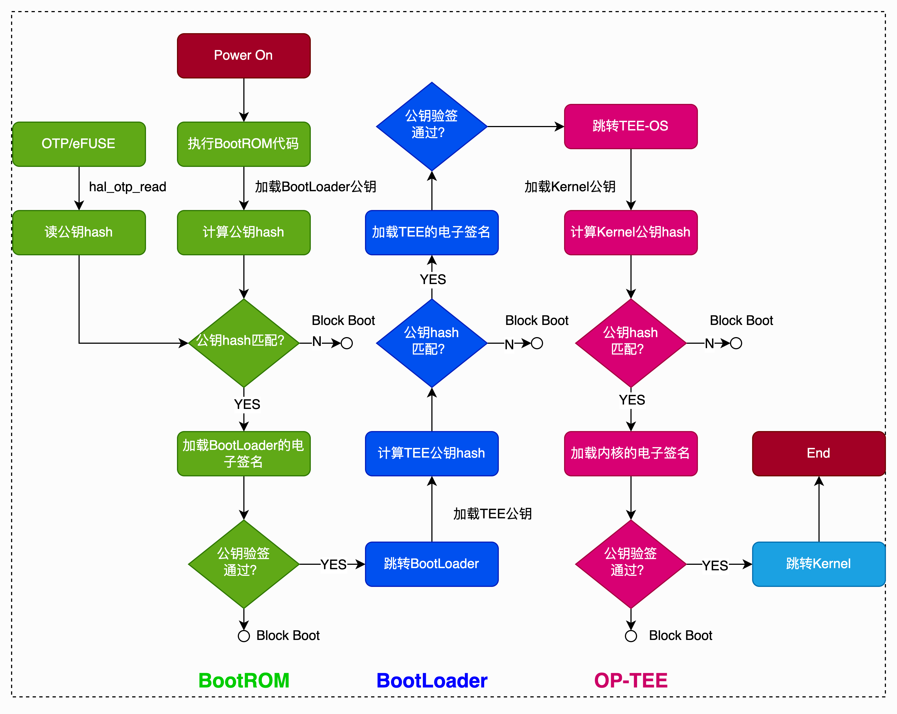
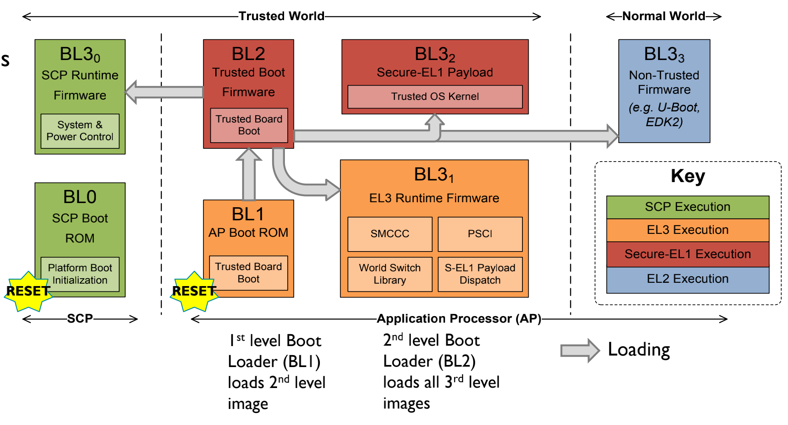
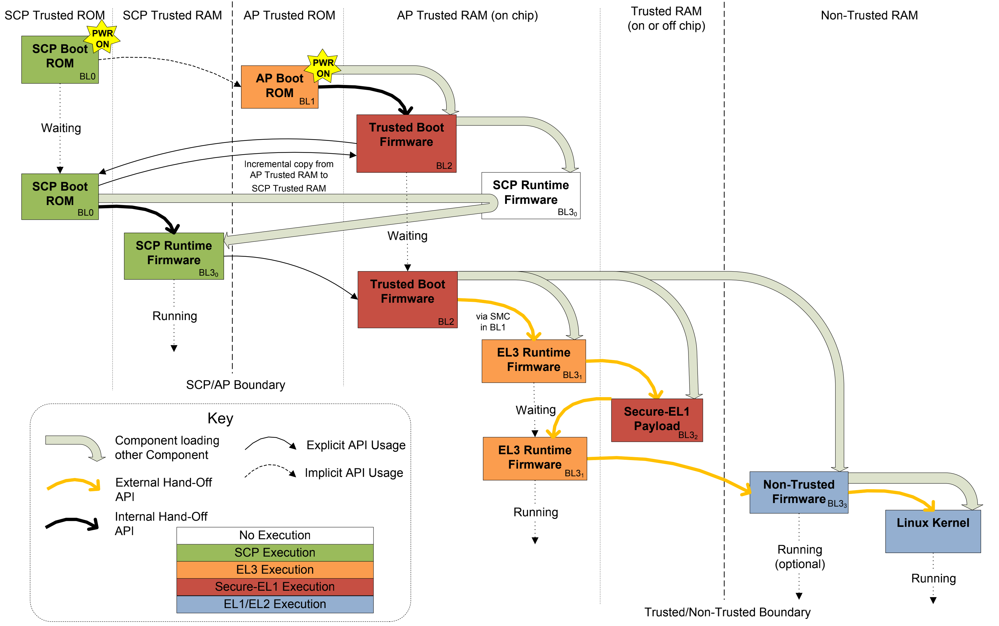

# 1. 整体介绍

ATF 作为最底层固件, **OP-TEE OS**, **BootLoader**, **Linux 内核**的加载都是由 ATF 来完成的, 而且 **ATF 实现了安全引导的功能**.

**bl31** 运行于 **EL3**, 待系统启动完成后, 在 **REE** 侧或 **TEE** 侧触发的**安全监控模式调用** (smc) 都会进入 **bl31** 中被处理.

**OP-TEE 启动完成后**会返回一个包含用于处理各种类型的安全监控模式调用的函数指针结构体变量, 该变量会被添加到 bl31 的 handle 中, 用于处理 REE 侧触发的安全监控模式调用.

bl2 启动时通过触发安全监控模式调用通知 bl1 将 CPU 控制权限交给 bl31, bl31 通过解析特定段中是否存在 OP-TEE 的入口函数指针来确定是否需要加载 OP-TEE. OP-TEE 启动后会触发安全监控模式调用重新进入到 bl31 中继续执行. bl31 通过查询链表的方式获取下一个需要被加载 REE 侧的镜像文件, 并设定好 REE 侧运行时 CPU 的状态和运行环境, 然后退出 EL3 进入 REE 侧镜像文件的启动, 一般第一个 REE 侧镜像文件为 BootLoader, BootLoader 会加载 Linux 内核.

# 2. 安全引导原理

安全引导功能的原理就是采用**链式验签**的方式启动系统, 也就是在系统启动过程中, 在加载**下一个阶段的镜像之前**都会对需要被加载的**镜像文件**进行**电子验签**, 只有验签操作通过后, 该镜像才能被加载到内存中, 然后系统才会跳转到下一个阶段继续执行, 整个验签链中的任何一环验签失败都会导致**系统挂死**.

系统启动过程中的**第一级验签**操作是由 **ChipRom**(**BootROM**)来完成的. 只要芯片一出厂, 用户就无法修改固化在芯片中的这部分代码, 因此**无法**通过**修改第一级验签结果**来关闭安全引导功能. 而且验签操作使用的 RSA 公钥或者哈希值将会被保存在 `OTP/efuse` 中, 该区域中的数据一般只有 **ChipRom**(**BootROM**)和 **TEE** 能够**读取且无法被修改**. RSA 公钥或者哈希值将会在产品出厂之前被写入到 OTP/efuse 中, 而且不同厂商使用的密钥会不一样.

在**谷歌**的**安全引导功能白皮书**中提出了安全引导功能实现方案的设计建议. 谷歌建议将镜像文件 的**电子签名信息**和验签使用的 **RSA 公钥**保存在**电子证书**中,

* 系统在启动的过程中首先会**验证电子证书的合法性**;

* 如果验证通过则需从电子证书中获取签名信息和 RSA 公钥, 然后再利用它们对镜像文件进行验证.

* 整个验证过程就是先验证证书, 验证证书通过后再去验证镜像文件的合法性.

但是在**实际实现**过程中, 大多数芯片厂商是将**签名信息**与需要被验签的**镜像文件**打包在一起, 而 **RSA 公钥**则会被打包到**执行验证操作**的**镜像文件**中.

不同厂商可能会对镜像文件进行加密操作, 使保存在设备中的镜像文件都是以密文的形式存在. 在启动过程中, 首先会验证密文镜像文件的合法性然后再进行解密镜像文件的操作, 这些都完成后才会将明文的镜像文件加载到内存中然后再执行跳转操作.

## 2.1. ARMv7 安全引导过程

对于安全引导功能的实现和验证过程各家**芯片公司的方案都不一样**, 这是由该芯片的启动流程以及启动所需镜像文件来决定的, 但都会遵循**链式验签启动**的原则.

ARMv7 架构并**没有使用 ATF**, 系统的启动流程与以前一样使用 **BootLoader** 来引导 Linux 内核和 TEE OS.

## 2.2. ARMv8 安全引导过程

ARMv8 架构之后 ARM 提供了 **ATF**, (**BootLoader**, **TEE 镜像文件**, **Linux 内核镜像文件**, **recovery 镜像文件**)都是由 **ATF** 来进行**引导和加载**, 而**不是**由 ChipRom(**BootROM**)成的.

ChipRom(**BootROM**)只会去验证 **ATF** 中 **bl1** 的**合法性**, 后续引导过程同样也是按照链式验签的方式进行, 符合 **TBBR 规范**.

在 ARMv8 架构中整个安全引导的流程如图所示.

BootRom -> ATF-bl1 -> ATF-bl2 -> ATF-bl31 -> ATF-bl32(OPTEE) -> ATF-bl31 -> ATF-bl33(BootLoader 镜像) -> Linux

ARMv8 架构中引入了 ATF, 同时在 ATF 中提供了安全引导的功能, (BootLoader 镜像, Linux 内核, recovery 镜像和 TEE OS 镜像文件)的签名方式都**由 ATF 决定**. 当然开发者也可以对 ATF 进行**定制化**, 修改 ATF 中的验签过程, 但是修改后的验签方案需要符合 TBBR 规范.

# 3. ATF 启动过程

ATF 的启动过程根据 ARMv8 的运行模式 (AArch32/AArch64) 会有所不同, 但基本一致. 在 **AArch32** 中是**不会**去加载 **bl31**, 而是将 EL3 或者 Monitor 模式的运行代码保存在 bl32 中执行.

在 AArch64 中, ATF 的完整启动流程如图所示.

在上述启动过程中, 从一个镜像跳转到另外一个镜像文件执行的方式各不相同, 以下为镜像跳转的过程和方式说明.

## 3.1. bl1 跳转到 bl2

在 bl1 完成了

* 将 bl2 镜像文件加载到 RAM 中的操作

* **中断向量表的设定**以及**其他 CPU 相关设定**

后, `bl1_main` 函数会解析出 bl2 镜像文件的描述信息, 获取入口地址, 并设定下一个阶段的 cpu 上下文.

这些操作完成之后, 调用 `el3_exit` 函数来实现 bl1 到 bl2 的跳转, 进入 bl2 中开始执行.

## 3.2. bl2 跳转到 bl31

在 bl2 中将会加载 **bl31**、**bl32**、**bl33** 的镜像文件到**对应权限的内存**中, 并将该**三个镜像文件的描述信息**组成**一个链表**保存起来, 以备 bl31 启动 bl32 和 bl33 使用.

在 AArch64 中, **bl31** 为 **EL3** 的执行软件, 其运行时的主要功能是对**安全监控模式调用**(smc) 指令和**中断处理**, 运行在 ARM 的 Monitor 模式中.

**bl32** 一般为 **TEE OS 镜像文件**.

**bl33** 为 **正常世界状态的镜像文件**, 例如 uboot, EDK2 等. 当前该部分为 BootLoader 部分的镜像文件, 再由 BootLoader 来启动 Linux 内核镜像.

从 bl2 跳转到 bl31 是通过**带入 bl31 的入口点信息**作为**参数**, 然后调用**安全监控模式调用指令**, 触发在 **bl1** 中设定的安全监控模式**调用请求**, 该请求处理完成后会将中央处理器的执行权限交给 **bl31**, 并跳转到 bl31 中去执行.

## 3.3. bl31 跳转到 bl32

在 **bl31** 中会执行 `runtime_service_init` 函数, 该函数会调用注册到 EL3 中所有服务的初始化函数, 其中有一个服务项就是 **TEE 服务**, 该服务项的初始化函数会将 TEE OS 的初始化函数赋值给 `bl32_init` 变量, 当所有服务项执行完初始化后, 在 bl31 中会调用 `bl32_init` 执行的函数来**跳转到 TEE OS 中**并开始执行 TEE OS 的启动.

## 3.4. bl31 跳转到 bl33 执行

当 TEE-OS 镜像启动完成后会触发一个 ID 为 `TEESMC_OPTEED_RETURN_ENTRY_DONE` 的**安全监控模式调用**, 该调用是用来告知 **EL3 TEE OS** 镜像已经完成了初始化, 然后将 CPU 的状态恢复到 `bl31_init` 的位置继续执行.

**bl31** 通过遍历在 bl2 中记录的所有镜像信息的链表来找到需要执行的 bl33 的镜像. 然后通过获取到 bl33 镜像的信息, 设定下一个阶段的 CPU 上下文, 退出 el3 后进入到 bl33 镜像中开始执行.

ATF 具体过程参考: `Architecture\04. CPU\ARM\Boot\2. ARMv8 ATF Secure Boot Flow (BL1 BL2 BL31) .md`

