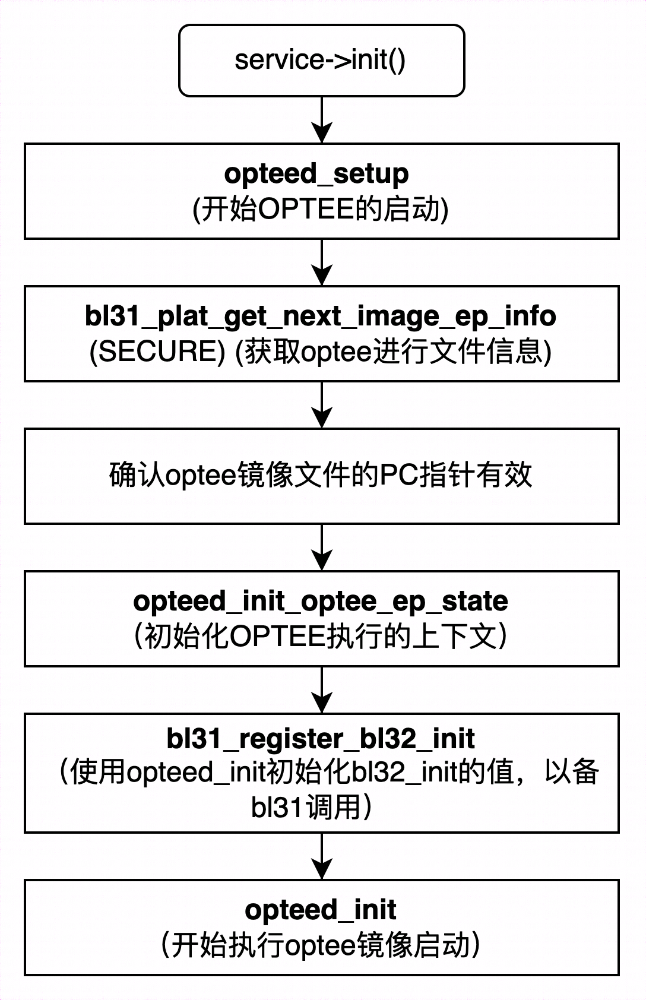
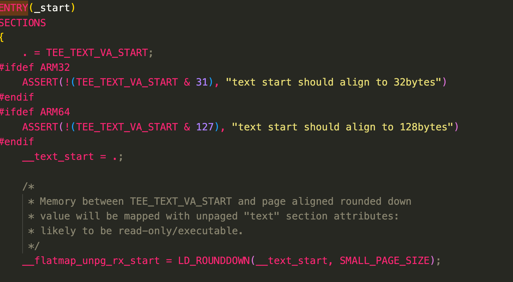
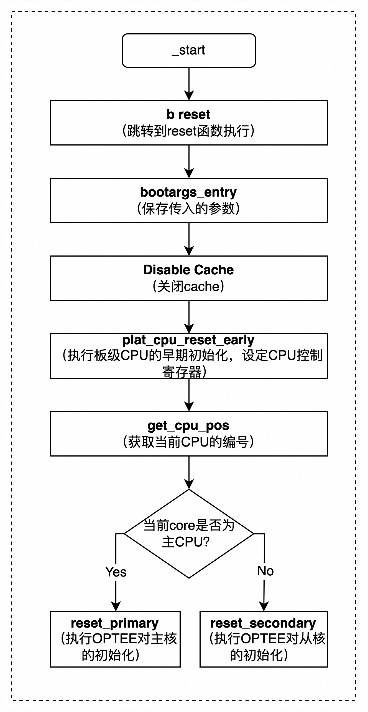
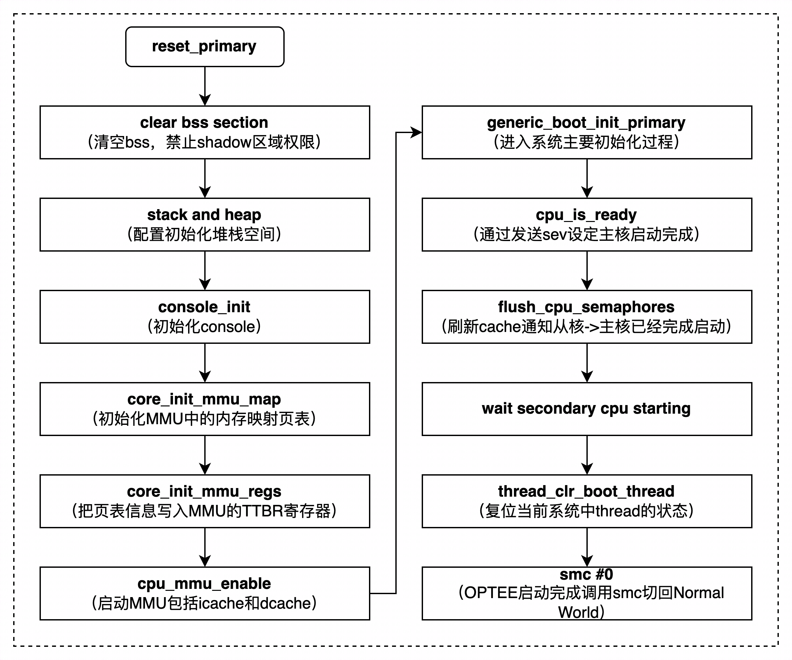
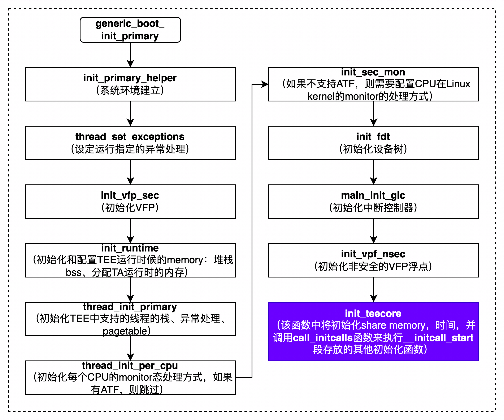

# ATF -> OPTEE

我们来总结一下关于 ATF 启动各个步骤的目的, 由此引出 OPTEE 的启动过程.

* **BootROM(EL3)**: 加载**ATF 的 bl1**的二进制文件到 flash(可能有对二进制格式的解析), 引导 bl1

* **ATF-bl1(EL3/S-EL1)**: 初始化 CPU, 设定异常向量, 将 bl2 的镜像加载到安全 RAM 中, 跳转到 bl2

* **ATF-bl2(EL3)**: bl2 镜像将为后续镜像的加载执行相关的初始化操作, 主要是内存, MMU, 串口以及 EL3 软件运行环境的设置, 并且**加载 bl31/bl32/bl32**的镜像到内存中.

* **ATF-bl31(EL3)**: 在 bl2 中触发安全监控模式调用后会跳转到 bl31 中执行, bl31 最主要的作用是**建立 EL3 运行态的软件配置, 在该阶段会完成各种类型的安全监控模式调用 ID 的注册和对应的 ARM 核状态的切换**,bl31 运行在 EL3.

* **ATF-bl32(S-EL1)**:bl31 中的 `runtime_svc_init` 函数会初始化 OP-TEE 对应的服务, 通过调用该服务项的初始化函数来完成 OP-TEE 的启动. 对于 OP-TEE 的服务项会通过 DECLARE_RT_SVC 宏在编译时被存放到**rt_svc_des**段中. 该段中的 init 成员会被初始化成 opteed_setup 函数, 由此开始进入到 OP-TEE OS 的启动. 如图所示为 ATF 对于 optee 镜像启动的初始化过程.

<div align='center'>

</div>

# 1. OP-TEE 的入口函数

OP-TEE 镜像的入口函数是在编译 OP-TEE OS 时通过**链接文件**来确定的, OP-TEE 在编译时是按照 `optee_os/core/arch/arm/kernel/kern.ld.S` 文件链接生 成 OP-TEE OS 的镜像文件, 在 kern.ld.S 文件中通过 ENTRY 宏来指定 OP-TEE OS 的入口函数, 在 OP- TEE 中指定的入口函数是_start, 对于 ARM32 位系统, 该函数定义在 `optee_os/core/arch/arm/generic_entry_a32.S` 文件中, 对于 ARM64 位系统而言, 该函数定义在 `optee_os/core/arch/arm/generic_entry_a64.S` 文件中.



`_start` 入口函数在 `generic_entry_a64.S`, 参考: https://github.com/carloscn/user-optee-os/blob/master/core/arch/arm/kernel/entry_a64.S


## OP-TEE 的内核初始化过程

`_start` 会调用 reset 函数进入 OP-TEE OS 的启动过程. 由于对称多处理 (Symmetrical Multi-Processing,SMP) 架构的原因, 在 reset 函数中会对 主核和从核进行不同的启动操作, 分别调用 `reset_primary` 函数和 `reset_secondary` 函数来完成.

ARM64 的 OP-TEE 的_start 函数定义在 generic_entry_a64.S 文件中, 而且该函数不像 ARM32 位系统一样会进入 reset 中去执行 OP-TEE 启 动, 而是直接在_start 函数中就完成整个启动过程, 在进行初始化操作之前会注册一个异常向量表, 该异常向量表会在唤醒从核阶段被使用, 当主核通知唤醒从核时, 从核会查找该异常向量表, 然后命中对应的处理函数并执行从核的启动操作.**ARM64 的 OP-TEE 的启动过程与 ARM32 的 OP-TEE 的启动过程几乎一样**.

### reset 入口函数执行内容 (32 位)

reset 函数是主核和从核启动的第一个函数, 该函数的执行流程如图:

<div align='center'>

</div>

进入到 reset 函数后, 系统会将 `_start` 的地址写入 `VBAR` 寄存器作为中断向量表的起始地址使用, 在启动从核时, 从核知道会到该地址去获取应该执行代码来完成从核的启动.(从这个地方也可以看到, 从核的启动是依赖于 ARM 的异常处理的 handler)

以下图片是 Linux 启动多核的时候的图片, 我们可以借鉴以下思路[^1]:


所以启动从核的时候要把从核的入口函数写到异常向量表, 当异常发生的时候调用调用这个函数.

```Assembly
LOCAL_FUNC reset , :
UNWIND( .fnstart)
UNWIND( .cantunwind)
    bootargs_entry // 获取启动带入的参数, 主要是启动地址, device tree 地址等
    /* 使能对齐检查并禁用数据和指令缓存 */
    read_sctlr r0 // 读取 sctlr 中的数据, 获取当前 CPU 控制寄存器中的值
#if defined(CFG_SCTLR_ALIGNMENT_CHECK)
    orr r0, r0, #SCTLR_A // 设定对齐校验
#else
    bic r0, r0, #SCTLR_A
#endif
    bic r0, r0, #SCTLR_C // 关闭数据 cache
    bic r0, r0, #SCTLR_I // 关闭指令 cache
#if defined(CFG_HWSUPP_MEM_PERM_WXN) && defined(CFG_CORE_RWDATA_NOEXEC)
    orr r0, r0, #(SCTLR_WXN | SCTLR_UWXN)
#endif
    write_sctlr r0 // 将 r0 写入到 sctlr 中, 用于关闭 cache
    isb
    /* 早期 ARM 核安全监控模式态的特殊配置 */
    bl plat_cpu_reset_early // 执行 CPU 早期初始化
    ldr r0, =_start // 设定 r0 寄存器的值为_start 函数的地址
    write_vbar r0 // 将_start 函数的地址写入 VBAR 寄存器中, 用于启动时使用
#if defined(CFG_WITH_ARM_TRUSTED_FW)
    b reset_primary // 支持 ATF 时跳转到 reset_primary 中执行
#else
    bl get_core_pos // 判定当前 CPU CORE 的编号
    cmp r0, #0 // 将获得的 CPU 编号与 0 对比
    beq reset_primary // 如果当前 core 是主核, 则使用 reset_primary 进行初始化
    b reset_secondary // 如果当前 core 是从核, 则使用 reset_secondary 进行初始化
#endif
UNWIND( .fnend)
END_FUNC reset
```

- `plat_cpu_reset_early` 函数将会设定 SCR 寄存器中的安全标志位, 用于标记当前 CPU 是处于安全世界状态中, 并且将 `_start` 地址写入 `VBAR` 寄存器, 用于 在需要启动从核时系统能找到启动代码的入口地址.
- `reset_primary` 函数是主核启动代码的入口函数, 该函数将会启动主核的基本初始化, 配置运行环境, 然后再开始执行唤醒从核的操作.
-**对于从核的唤醒操作, 如果系统支持 PSCI, 从核的唤醒是在 REE OS 启动时, 发送 PSCI 给 EL3 或 Monitor 模式的代码来启动从核**;
-**如果不使用 PSCI, 而是选择在 OP-TEE 中使能 `CFG_SYNC_BOOT_CPU`, 则 OP-TEE 会在主核启动结束后唤醒从核**.

>PSCI, 是 Power State Coordination Interface 的缩写, 是由 ARM 定义的电源管理接口规范, ARM 也提供了官方的设计文档 < Arm Power State Coordination Interface Platform Design Document>

### reset_primary

本小节以 `CONFIG_BOOT_SYNC_CPU`(也就是不支持 PSCI 的, 使能为例, 在使能 PSCI 系统中, 不需要使能此宏).reset_primary 函数是 OP-TEE 对 CPU 主核进行初始化操作的函数, 该函数会初始化系统的 MMU, 并调用 `generic_boot_init_primary` 函数完成 OP-TEE 运行环境的建立, 然后触发 sev 操作来唤醒从核, 待所有 CPU 核都启动完成之后, OP-TEE 会触发安全监控 模式调用(smc), 通知系统 OP-TEE 启动已完成并将 CPU 的状态切换回到正常世界状态, 该函数的执行流程如图:

<div align='center'>

</div>

代码可以参考: https://github.com/carloscn/user-optee-os/blob/master/core/arch/arm/kernel/entry_a32.S#L364

这里要特别注意的是:`generic_boot_init_primary` 函数是 OP-TEE 建立系统运行环境的入口函数, 该函数会进行建立线程运行空间, 初始化 OP-TEE 内核组件等操作.

### _generic_boot_init_primary

`generic_boot_init_primary` 函数会调用 `init_primary_helper` 函数来完成系统运行环境的建立, 如果系统支持 ATF, 则该函数会返回 OP-TEE 的处理句柄, 该处理句柄主要包含各种安全监控模式调用的处理函数, 安全世界状态 (SWS) 的中断以及其他事件的处理函数, ATF 中的 bl31 解析完安全监控模式调用或中断请求后会在安全世界状态调用该处理句柄来处理对应的事件.

<div align='center'>

</div>

### call_initcalls 函数

init_teecore 函数通过调用 call_initcalls 来启动系统的服务以及安全驱动的挂载, 该函数的内容如下:

这个函数是一个弱符号的定义,


在执行 call_initcalls 函数之前, 系统已完成了 memory,CPU 相关设置, 中断控制器, 共享内存, 线程堆栈设置, TA 运行内存的分配等操作. 所以这里 call_initcalls 以 C 语言函数的形式呈现. call_initcalls 是通过遍历 OP-TEE 镜像文件的_initcall 段中从_initcall_start 到_initcall_end 之间的所有函数. 这个技术我们可以学习一下.

OP-TEE 镜像文件中 `_initcalls` 段的内容是通过使 用 `__define_initcall` 宏来告知编译器的, 在编译时会将使用该宏定义的函数保存到 OP-TEE 镜像文件的 `_initcall` 段中. 该宏定义如下:


- initcall_t: 是一个函数指针类型(typedef int(*initcall_t)(void)).
- SCA.... 本质是个__attribute__((__section__()): 将 fn 对象放在一个由括号中的名称指定的 section 中.

例如:`__define_initcall("1", init_operation)`

则该宏的作用是声明一个名称为 __initcall_init_operation 的函数指针, 将该函数指针初始化为 init_operation, 并在编译时将该函数的内容存放在名称为 ".initcall1" 的段中. core/arch/arm/kernel/kern.ld.S 文件中存在如下内容:

```
__initcall_start = .;
KEEP(*(.initcall1))
KEEP(*(.initcall2))
KEEP(*(.initcall3))
KEEP(*(.initcall4))
__initcall_end = .;
```

即在 `__initcall_start` 到 `__initcall_end` 之间保存的 是 initcall1 到 initcall4 之间的内容, 而在整个 OP-TEE 源代码的 `core/include/initcall.h` 文件中, __define_initcall 宏被使用的情况如下:

```C
#define __define_initcall(level, fn) \
#define service_init(fn) __define_initcall("1", fn)
#define service_init_late(fn) __define_initcall("2", fn)
#define driver_init(fn) __define_initcall("3", fn)
#define driver_init_late(fn) __define_initcall("4", fn)
```

所以遍历执行从 `__initcall_start` 到 `__initcall_end` 之间的内容就是启动 OP-TEE 的服务以及完整安全驱动的挂载.

## OP-TEE 服务项的启动

OP-TEE 服务项的启动分为:`service_init` 以及 `service_init_late`, 需要被启动的服务项通过使用这两个宏, 在编译时, 相关服务的内容将会被保存到 initcall1 和 initcall2 中.

### service_init

在 OP-TEE 使用中使用 service_init 宏定义的服务项如下:
```C
service_init(register_supplicant_user_ta);
service_init(verify_pseudo_tas_conformance);
service_init(tee_cryp_init);
service_init(tee_se_manager_init);
```
如果开发者有实际需求, 可以将自己希望添加的服务项功能按照相同的方式添加到系统中. 在当前的 OP-TEE 中默认是启动上述四个服务, 分别定义在以下文件:

|service|path|
|----|----|
|register_supplicant_user_ta|core/arch/arm/kernel/ree_fs_ta.c|
|verify_pseudo_tas_conformance|core/arch/arm/kernel/pseudo_ta.c|
|tee_cryp_init|core/tee/tee_cryp_utl.c|
|tee_se_manager_init| core/tee/se/manager.c|

#### register_supplicant_user_ta

该操作主要是注册 OP-TEE 加载 REE 侧的 TA 镜像时需要使用的操作接口, 当 REE 侧执行 open session 操作时,**TEE 侧会根据 UUID 的值在 REE 侧的文件系统中查找该文件**, 然后通过 RPC 请求通知 tee_supplicant 从 REE 的文件系统中读取与 UUID 对应的 TA 镜像文件的内容并传递到 TEE 侧.

#### verify_pseudo_tas_conformance

该函数主要是用来校验 OP-TEE 中静态 TA 的合法性, 需要检查 OP-TEE OS 中静态 TA 的 UUID, 函数指针以及相关的 flag.


OP-TEE OS 镜像文件中的 `__start_ta_head_section` 与 `__stop_ta_head_section` 之间保存的是 OP-TEE 所有静态 TA 的内容, 其值的定义见 `core/arch/arm/kernel/kern.ld.S` 文件, 分别表示 `ta_head_section` 段的起始地址和末端地址.

在编译 OP-TEE 的静态 TA 时, 使用 `pseudo_ta_register` 宏来告知编译器将静态 TA 的内容保存到 `ta_head_section` 段中, 该宏定义在 core/arch/arm/include/kernel/pseudo_ta.h 文件中, 内容如下:


共有六个静态 TA 在 OP-TEE 编译时会被打包进 OP-TEE 的镜像文件中, 分别如下:

|ta|path|
|--------|-------|
|gprof| core/arch/arm/pta/gprof.c |
|interrupt_tests.ta| core/arch/arm/pta/Iiterrupt_tests.c |
|stats.ta| core/arch/arm/pta/stats.c |
|se_api_self_tests.ta| core/arch/arm/pta/se_api_self_tests.c|
|socket| core/arch/arm/tee/pta_socket.c |
|invoke_tests.pta| core/arch/arm/pta/pta_invoke_test.c|

#### tee_crypt_init

该部分主要完成 OP-TEE 提供的密码学接口功能的初始化操作, 调用 crypto_ops 结构体中的 init 进 行初始化操作, 该结构体变量定义在 core/lib/libtomcrypt/src/tee_ltc_provider.c 文件中, 变量中定义了各种算法的操作函数指针. 完成注册后, TA 就可以通过调用该变量中的对应函数指针来实现 OP-TEE 中各种密码学算法接口的调用.

#### tee_se_manager_init

该部分主要完成对 SE(secure engine)模块的管理, 为上层提供对 SE 模块的操作接口.

### service_init_late

`service_init_late` 宏定义的内容将会在编译时被 链接到 OP-TEE 镜像文件的 initcall2 段中, OP-TEE 中使用该宏来定义 OP-TEE 中使用的**密钥管理操作**, 在 `core/tee/tee_fs_key_manager.c` 文件中, 使用该宏来将 `tee_fs_key_manager` 函数保存到 `initcall2` 段中, 在 OP-TEE 启动时被调用, 用来生成或读取 OP-TEE 在使用时会使用到的 key, 该函数内容如下:


这些 key 将会在使用安全存储功能时用到, 用于生成加密, 解密安全文件的 FEK, 其中 `tee_otp_get_hw_unique_key` 函数可根据不同的平台进行修改, 只要保证读取到的值的唯一性且安全即可, 当前一般做法是读取一次性编程区域 (One Time Programmable,OTP) 或 efuse 中的值, 该值将在芯片生产或者工厂整机生产时烧录到 OTP 中, 当然也有其他的实现方式.

## OP-TEE 驱动的挂载

安全设备在使用之前都需要执行一定的配置和初始化, 而该部分操作是在 OP-TEE 启动时执行的. OP-TEE 编译时通过使用 `driver_init` 宏和 `driver_init_late` 宏来实现将安全设备驱动编译到 OP- TEE OS 镜像文件中, 使用这两个宏定义设备驱动后, 安全设备驱动的初始化操作将会被编译到 OP- TEE 镜像文件的 `initcall3` 和 `initcall4` 段中, 以 Hikey 为例, 其使用了 `driver_init` 宏来定义 `peripherals_init` 的初始化操作, 所以在使用 hikey 运行 OP-TEE 时会去挂载外围安全设备并执行相关的初始化.


# Ref

[^1]:[Booting ARM Linux on MPCore](https://medium.com/@srinivasrao.in/booting-arm-linux-on-mpcore-95db62dabf50)
[^2]:[]()
[^3]:[]()
[^4]:[]()
[^5]:[]()
[^6]:[]()
[^7]:[]()
[^8]:[]()
[^9]:[]()
[^10]:[]()
[^11]:[]()
[^12]:[]()
[^13]:[]()
[^14]:[]()
[^15]:[]()
[^16]:[]()
[^17]:[]()
[^18]:[]()
[^19]:[]()
[^20]:[]()