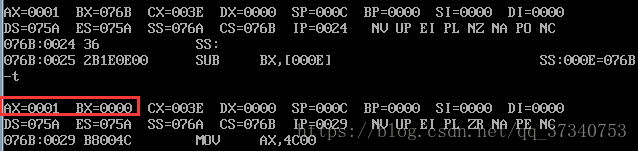
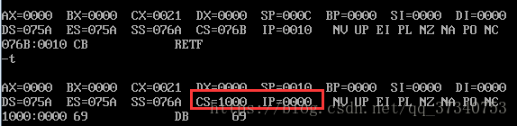

<!-- @import "[TOC]" {cmd="toc" depthFrom=1 depthTo=6 orderedList=false} -->

<!-- code_chunk_output -->

- [1. call 指令](#1-call-指令)
  - [1.1. 依据标号进行转移的 call 指令](#11-依据标号进行转移的-call-指令)
    - [1.1.1. 检测点](#111-检测点)
  - [1.2. 依据目的地址在指令中的 call 指令](#12-依据目的地址在指令中的-call-指令)
    - [1.2.1. 检测点](#121-检测点)
  - [1.3. 转移地址在寄存器中的 call 指令](#13-转移地址在寄存器中的-call-指令)
    - [1.3.1. 检测点](#131-检测点)
  - [1.4. 转移地址在内存中的 call 指令](#14-转移地址在内存中的-call-指令)
    - [1.4.1. 检测点](#141-检测点)
- [2. ret 指令和 retf 指令](#2-ret-指令和-retf-指令)
  - [2.1. 检测点](#21-检测点)
- [3. call 和 ret 的配合使用](#3-call-和-ret-的配合使用)
  - [3.1. 问题](#31-问题)
- [4. mul 指令](#4-mul-指令)
- [5. 参考](#5-参考)

<!-- /code_chunk_output -->


call、ret 指令本质上还是汇编『跳转指令』它们都用于修改 IP 或同时修改 CS 和 IP; 这两个指令经常被用来实现子程序的设计

call 和 ret 指令都是转移指令它们都修改 IP 或同时修改 CS 和 IP. 它们经常被共同用来实现子程序的设计.

# 1. call 指令

当执行**call 指令**时进行两步操作:

1) 将**当前的 IP**或 **CS 和 IP**压入栈中

2) 转移

call 指令**不能实现短转移**它的书写格式同**jmp 指令**

## 1.1. 依据标号进行转移的 call 指令

语法格式: call 标号(将当前的 IP 压栈后转到标号处执行指令)

汇编解释: (1) push IP (2) jmp near ptr 标号

```
1. (sp)=(sp)−2(sp)=(sp)−2
2. ((ss)∗16+(sp))=(IP)((ss)∗16+(sp))=(IP)
3. (IP)=(IP)+16 位位移
```

### 1.1.1. 检测点

下面的程序执行后**ax**中的数值为多少?

内存地址 | 机器码 | 汇编指令 | ax
-----|-----|------|---
1000:0 | b8 00 00 | mov ax,0 | ax=0000h
1000:3 | e8 01 00 | call s | ip=0006h
1000:6 | 40 | inc ax | 没有执行
1000:7 | 58 | s:pop ax | ax=0006h

发现**push**的**IP**是执行**指令后的 IP！！！**.


## 1.2. 依据目的地址在指令中的 call 指令

语法格式: call far ptr 标号, 实现段间转移

汇编解释: (1) push CS (2) push IP (3) jmp far ptr 标号

```
1. (sp)=(sp)−2(sp)=(sp)−2
2. ((ss)∗16+(sp))=(CS)((ss)∗16+(sp))=(CS)
3. (sp)=(sp)−2(sp)=(sp)−2
4. ((ss)∗16+(sp))=(IP)((ss)∗16+(sp))=(IP)
5. (CS)=标号所在段的段地址(CS)=标号所在段的段地址
6. (IP)=标号在段中的偏移地址
```

### 1.2.1. 检测点

下面的程序执行后 ax 中的数值为多少?

内存地址 | 机器码 | 汇编指令 | ax
-----|-----|------|---
1000:0 | b8 00 00 | mov ax,0 | ax=0000h
1000:3 | 9A 09 00 00 10 | call far ptr s | cs=1000h,ip=0008h
1000:8 | 40 | inc ax | 没有执行
1000:9 | 58 | s: pop ax | ax=0008h
1000:10 | pop ax | ax=1000h |

## 1.3. 转移地址在寄存器中的 call 指令

语法格式: call 16 位 reg

汇编解释: (1) push IP (2) jmp 16 位 reg

```
1. (sp)=(sp)−2
2. ((ss)∗16+(sp))=(IP)
3. (IP)=(16 位 reg)
```

### 1.3.1. 检测点

内存地址 | 机器码 | 汇编指令 | ax
-----|-----|------|---
1000:0 | b8 06 00 | mov ax,6 | ax=0006h
1000:2 | ff d0 | call ax | ip=0005h
1000:5 | 40 | inc ax | 没有执行
1000:6 | 8b ec | mov bp,sp | bp=sp
1000:8 | 03 36 00 | add ax,[bp] | ax=000Ah

注意最后一条指令是 add 指令.

## 1.4. 转移地址在内存中的 call 指令

语法格式一: call word ptr 内存单元地址

汇编解释一: (1) push IP (2) jmp word ptr 内存单元地址

语法格式二: call dword ptr 内存单元地址

汇编解释二: (1) push CS (2) push IP (3) jmp dword ptr 内存单元地址

### 1.4.1. 检测点

(1) 下面的程序执行后 ax 中的数值为多少?(注意: 用 call 指令的原理来分析不要在 Debug 中单步跟踪来验证你的结论. 对于此程序在 Debug 中单步跟踪的结果不能代表 CPU 的实际执行结果)

```assembly
assume cs:code
stack segment
    dw 8 dup(0)
stack ends
code segment
    start:
        mov ax,stack                ;ax=stack
        mov ss,ax                   ;ss=ax
        mov sp,16                   ;sp=16
        mov ds,ax                   ;ds=ax
        mov ax,0                    ;ax=0
        call word ptr ds:[0EH]      ;push ip AND jmp ds:[0eh]
        inc ax                      ;上面的应该是这条指令的 ip,jmp ds:[0eh]应该
                                    ;转跳这条指令,那么 ax=1

        inc ax                      ;ax=2
        inc ax                      ;ax=3
        mov ax,4c00h
        int 21h
code ends
end start
```

这真的很奇怪的程序会懵！

(2)下面的程序执行后 ax 和 bx 中的数值为多少?

```assembly
assume cs:code
data segment
    dw 8 dup(0)
data ends
code segment
    start:
        mov ax,data                     ;ax=data
        mov ss,ax                       ;ss=ax
        mov sp,16                       ;sp=16
        mov word ptr ss:[0],offset s    ;ss:[0]=s 的地址
        mov ss:[2],cs                   ;ss:[2]=cs
        call dword ptr ss:[0]           ;call (cs):(s 的地址)
        nop                             ;ss:[0ch]=这条指令的地址
                                        ;ss:[0eh]=cs
    s:
        mov ax,offset s                 ;ax=s 的地址
        sub ax,ss:[0ch]                 ;ax=ax-ss:[0ch] = 1
        mov bx,cs                       ;bx=cs
        sub bx,ss:[0eh]                 ;bx=bx-cs=0
        mov ax,4c00h
        int 21h
code ends
end start
```

实验结果如下:



# 2. ret 指令和 retf 指令

- **ret 指令**用栈中的数据修改**IP**的内容从而实现**近转移**
- **retf**指令用栈的数据修改**CS 和 IP**的内容从而实现**远转移**

CPU 执行**ret 指令**时, 进行下面 2 步操作(相当于 pop IP):

```
pop IP
```

或者:

```
(IP)=((ss)∗16+(sp))
(sp)=(sp)+2
```

CPU 执行**retf 指令**时进行下面 4 步操作(相当于 pop IP AND pop CS): :

```
(IP)=((ss)∗16+(sp))(IP)=((ss)∗16+(sp))
(sp)=(sp)+2(sp)=(sp)+2
(CS)=((ss)∗16+(sp))(CS)=((ss)∗16+(sp))
(sp)=(sp)+2
```

或者:

```
pop IP
pop CS
```

## 2.1. 检测点

补全程序实现从内存`1000:0000`处开始执行指令.

```
assume cs:code
stack segment
    db 16 dup(0)
stack ends

code segment
    start:
        mov ax,stack
        mov ss,ax
        mov sp,16
        ;补全下面一条指令
        mov ax,1000h

        push ax
        ;补全下面一条指令
        mov ax,0h
        push ax
        retf
code ends
end start
```

实验结果如下:



# 3. call 和 ret 的配合使用

现在来看一下如何将它们配合使用来实现子程序的机制.

## 3.1. 问题

下面程序返回前 bx 中的值是多少?

```
assume cs:code
code segment
    start:
        mov ax,1        ;1.ax=1
        mov cx,3        ;2.cx=3
        call s          ;3.push 下一条指令的 IP,jmp s 处
        mov bx,ax       ;6.(bx)=8
        mov ax,4c00h
        int 21h
    s:
        add ax,ax
        loop s          ;4.ax=2^3 次方,后结束这个 loop
        ret             ;5.pop ip,就返回到 6 处
code ends
end start
```

具有子程序的源程序框架如下:

```
assume cs:code
code segment
    main:
            ..
            ..
            call sub1    ;调用子程序 sub1
            ..
            mov ax,4c00h
            int 21h

    sub1:
            ..           ;子程序 sub1 开始
            call sub2    ;调用子程序 sub2
            ..
            ret          ;sub1 子程序返回
    sub2:
            ..           ;子程序 sub2 开始
            ..
            ret          ;sub2 子程序返回
code ends
end main
```

# 4. mul 指令


# 5. 参考

https://blog.csdn.net/qq_37340753/article/details/81585083 (未完)