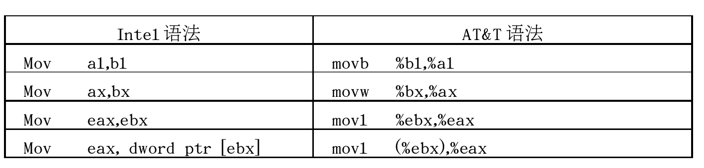
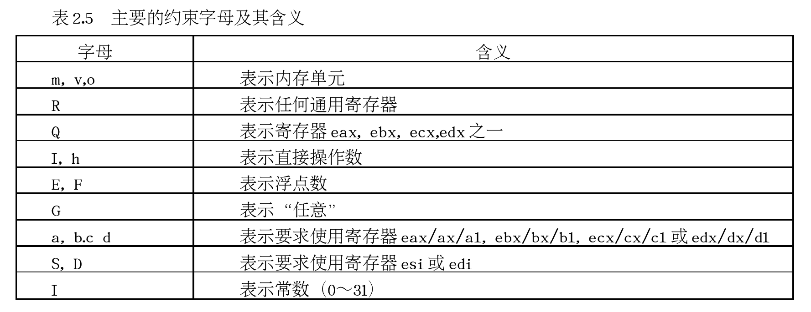

<!-- @import "[TOC]" {cmd="toc" depthFrom=1 depthTo=6 orderedList=false} -->

<!-- code_chunk_output -->

- [1. 简介](#1-简介)
  - [1.1. Linux 下汇编代码形式](#11-linux-下汇编代码形式)
- [2. Linux 汇编语法格式](#2-linux-汇编语法格式)
  - [2.1. 寄存器名前缀](#21-寄存器名前缀)
  - [2.2. 立即数前缀](#22-立即数前缀)
  - [2.3. 操作数的方向](#23-操作数的方向)
  - [2.4. 操作数字长](#24-操作数字长)
  - [2.5. 绝对跳转和绝对调用指令的操作数](#25-绝对跳转和绝对调用指令的操作数)
  - [2.6. 远程转移和远程跳转指令](#26-远程转移和远程跳转指令)
  - [2.7. 内存单元操作数](#27-内存单元操作数)
  - [2.8. 间接寻址方式](#28-间接寻址方式)
- [3. Hello World!](#3-hello-world)
- [4. Linux 汇编工具](#4-linux-汇编工具)
  - [4.1. 汇编程序和链接程序](#41-汇编程序和链接程序)
    - [4.1.1. 汇编器](#411-汇编器)
    - [4.1.2. 链接器](#412-链接器)
  - [4.2. GCC 一步完成](#42-gcc-一步完成)
  - [4.3. 调试器](#43-调试器)
- [5. 系统调用](#5-系统调用)
- [6. 命令行参数](#6-命令行参数)
- [7. GCC 内联汇编](#7-gcc-内联汇编)
  - [7.1. 内联汇编的完整格式](#71-内联汇编的完整格式)
- [8. IA32 寄存器](#8-ia32-寄存器)
  - [8.1. 通用寄存器](#81-通用寄存器)
- [9. 函数调用过程](#9-函数调用过程)
- [10. 小结](#10-小结)
- [11. 参考](#11-参考)

<!-- /code_chunk_output -->

以下内容皆为 32 位系统

# 1. 简介

现代情况下汇编语言仅仅在驱动程序嵌入式系统等对性能要求苛刻的领域才能见到它们的身影.

汇编语言直接同计算机的底层软件甚至硬件进行交互它具有如下一些优点:

- 能够直接访问与硬件相关的存储器或 I/O 端口;
- 能够不受编译器的限制对生成的二进制代码进行完全的控制;
- 能够对关键代码进行更准确的控制避免因线程共同访问或者硬件设备共享引起的死锁;
- 能够根据特定的应用对代码做最佳的优化提高运行速度;
- 能够最大限度地发挥硬件的功能.

## 1.1. Linux 下汇编代码形式

Linux 下用汇编语言编写的代码具有两种不同的形式.

第一种是**完全的汇编代码**指的是整个程序全部用汇编语言编写. 尽管是完全的汇编代码**Linux** 平台下的汇编工具也吸收了 C 语言的长处使得程序员可以使用 `#include`、`#ifdef` 等**预处理指令**并能够通过宏定义来简化代码.

第二种是**内嵌的汇编代码**指的是可以嵌入到 C 语言程序中的汇编代码片段. 虽然 ANSI 的 C 语言标准中没有关于内嵌汇编代码的相应规定但各种实际使用的 **C 编译器**都做了这方面的扩充这其中当然就包括 Linux 平台下的 **GCC**.

# 2. Linux 汇编语法格式

绝大多数 Linux 程序员以前只接触过 `DOS/Windows` 下的汇编语言这些汇编代码都是 **Intel 风格**的.

但在 Unix 和 Linux 系统中更多采用的还是 **AT&T 格式**两者在语法格式上有着很大的不同:

## 2.1. 寄存器名前缀

1. 在 AT&T 汇编格式中寄存器名要加上 '%' 作为前缀; 而在 Intel 汇编格式中寄存器名不需要加前缀.

例如:


## 2.2. 立即数前缀

2. 在 AT&T 汇编格式中用 '$' 前缀表示一个立即操作数; 而在 Intel 汇编格式中立即数的表示**不用带任何前缀**.

在 AT&T 汇编中, 十六进制立即数前冠以 "0x", 在 Intel 的语法中十六进制和二进制立即数后缀分别冠以 "h" 和 "b".

例如:


## 2.3. 操作数的方向

3. AT&T 和 Intel 格式中的**源操作数**和**目标操作数**的位置正好相反.

在 AT&T 汇编格式中第一个数是源操作数第二个数是目的操作数.

在 Intel 汇编格式中第一个操作数是目的操作数第二个操作数源操作数.

例如:


## 2.4. 操作数字长

4. 在 AT&T 汇编格式中**操作数的字长**由**操作符**的**最后一个字母**决定后缀'b'、'w'、'l'分别表示操作数为字节(byte8 比特)、字(word16 比特)和长字(long32 比特);

在 Intel 汇编格式中操作数的字长是用"byte ptr"、"word ptr"和"dword ptr"等前缀来表示的, "dword"对应"long".

例如:




## 2.5. 绝对跳转和绝对调用指令的操作数

5. 在 AT&T 汇编格式中绝对转移和调用指令(jump/call)的**操作数**前要加上'*'作为前缀而在 Intel 格式中则不需要.

## 2.6. 远程转移和远程跳转指令

6. 远程转移指令和远程子调用指令的操作码

在 AT&T 汇编格式中为 "ljump" 和 "lcall"

在 Intel 汇编格式中则为 "jmp far" 和 "call far"

即:


与之相应的远程返回指令则为:


## 2.7. 内存单元操作数

在 AT&T 中用"()"括起来.

在 Intel 的语法中基寄存器用"[]"括起来.

AT&T, `movl 5(%ebx), %eax`

Intel, `mov eax, [ebx+5]`

## 2.8. 间接寻址方式

7. 在 AT&T 汇编格式中**内存操作数的寻址方式**是

```
%section:disp(base, index, scale)
```

在 Intel 汇编格式中内存操作数的寻址方式为:

```
section:[base + index*scale + disp]
```

其中:
* index/scale/disp/section 全部是可选的完全可以简化掉.
* 如果没有指定 scale 而指定了 index 则 scale 的缺省值为 1.
* **sction 段寄存器**依赖于指令以及应用程序是运行在实模式 还是保护模式下在实模式下它依赖于指令而在保护模式下 section 是多余的.
* 在 AT&T 中当立即数用在 scale/disp 中时不应当在其前冠以"$"前缀

这种寻址方式常常用在访问数据结构**数组**中**某个特定元素内**的**一个字段**其中 base 为数组的起始地址 scale 为每个数组元素的大小 index 为下标. 如果**数组元素还是一个结构**则 disp 为具体字段在结构中的位移.

由于 Linux 工作在**保护模式**下用的是 **32 位线性地址**所以在计算地址时**不用**考虑**段基址**和**偏移量**而是采用如下的地址计算方法:

```
base + index * scale + disp
```

下面是一些内存操作数的例子:


# 3. Hello World!

Linux 是一个运行在保护模式下的 32 位操作系统采用 flat memory 模式目前最常用到的是 ELF 格式的二进制代码. 一个 ELF 格式的可执行程序通常划分为如下几个部分: .text、.data 和 .bss 其中 .text 是只读的代码区.data 是可读可写的数据区而 .bss 则是可读可写且没有初始化的数据区. 代码区和数据区在 ELF 中统称为 section 根据实际需要你可以使用其它标准的 section 也可以添加自定义 section 但一个 ELF 可执行程序至少应该有一个 .text 部分.  下面给出我们的第一个汇编程序用的是 AT&T 汇编语言格式:

AT&T 格式:

```
#hello.s
.data                    # 数据段声明
        msg : .string "Hello, world!\\n" # 要输出的字符串
        len = . - msg                   # 字串长度
.text                    # 代码段声明
.global _start           # 指定入口函数

_start:                  # 在屏幕上显示一个字符串
        movl $len, %edx  # 参数三: 字符串长度
        movl $msg, %ecx  # 参数二: 要显示的字符串
        movl $1, %ebx    # 参数一: 文件描述符(stdout)
        movl $4, %eax    # 系统调用号(sys_write)
        int  $0x80       # 调用内核功能

                         # 退出程序
        movl $0,%ebx     # 参数一: 退出代码
        movl $1,%eax     # 系统调用号(sys_exit)
        int  $0x80       # 调用内核功能
```

Intel 风格:

```
; hello.asm
section .data            ; 数据段声明
        msg db "Hello, world!", 0xA     ; 要输出的字符串
        len equ $ - msg                 ; 字串长度
section .text            ; 代码段声明
global _start            ; 指定入口函数
_start:                  ; 在屏幕上显示一个字符串
        mov edx, len     ; 参数三: 字符串长度
        mov ecx, msg     ; 参数二: 要显示的字符串
        mov ebx, 1       ; 参数一: 文件描述符(stdout)
        mov eax, 4       ; 系统调用号(sys_write)
        int 0x80         ; 调用内核功能
                         ; 退出程序
        mov ebx, 0       ; 参数一: 退出代码
        mov eax, 1       ; 系统调用号(sys_exit)
        int 0x80         ; 调用内核功能
```

上面代码语法风格不一样但功能都是调用 Linux 内核提供的 sys\_write 来显示一个字符串然后再调用 sys\_exit 退出系统. 在 Linux 内核源文件 include/asm-i386/unistd.h 中可以找到所有系统调用的定义.

# 4. Linux 汇编工具

在 Linux 源代码中以.S 为扩展名的文件是"纯"汇编语言的文件.

Linux 平台下汇编工具很多最基本的仍是汇编器、链接器和调试器.

当编写了一个程序后, 需要对齐进行汇编(assembly)和链接. Linux 下有两种方式, 一种是使用**汇编程序**(`GAS`)和**链接程序**(`LD`), 一种是使用**gcc**.

## 4.1. 汇编程序和链接程序

### 4.1.1. 汇编器

汇编器(assembler)作用是将**汇编源码**(.S)转换成**二进制形式**的**目标代码**(.o).

Linux 平台的标准汇编器是**GAS**它是 GCC 依赖的后台汇编工具通常包含在**binutils 软件包**中.

**GAS**使用标准的**AT&T 汇编语法**可以用来汇编用 AT&T 格式的程序.

```
as -o hello.o hello.s -m32
```

**Linux 平台**另一个常用的**汇编器**是**NASM**它提供很好的宏指令功能并能**支持相当多的目标代码格式****包括 bin、a.out、coff、elf、rdf**等.

NASM 采用人工编写的语法分析器因而比 GAS 速度快很多更重要使用**Intel 汇编语法**可用来编译**Intel 语法格式**编写的汇编程序:

```
nasm -f elf32 hello.asm
```

### 4.1.2. 链接器

由**汇编器**产生的**目标代码**是**不能直接在计算机上运行**的它必须经过**链接器**处理才能生成**可执行文件**.

链接器用来将**多个目标代码**链接成**一个可执行代码**这样可以先将**整个程序**分为**几个模块单独开发**然后才将它们链接成一个应用程序.

Linux 使用**ld**作为**标准链接程序**它同样在 binutils 软件包中.

汇编程序在成功通过**GAS**或**NASM**的编译成目标代码后就可以通过 ld 进行链接成可执行文件:

```
ld -m elf_i386 -o hello hello.o
```

通过`ld -V`可以查看仿真的模式

```
[root@tsinghua-pcm nasm]# ld -V
GNU ld version 2.25.1-32.base.el7_4.1
  支持的仿真:
   elf_x86_64
   elf32_x86_64
   elf_i386
   i386linux
   elf_l1om
   elf_k1om
```

## 4.2. GCC 一步完成

使用 GNC 的 C 编译器 gcc 就可以一步完成汇编和连接.

```
gcc -o example example.S
```

这里**example.S** 是你的**汇编程序**输出文件(可执行文件)名为 example.

其中**扩展名必须为大写的 S！！！**这是因为大写的 S 可以使 **gcc 自动识别汇编程序中的 C 预处理命令**像#include、#define、#ifdef、 #endif 等也就是说使用 **gcc 进行编译**你可以在 汇编程序中使用 **C 的预处理命令**.

注: 也可单独一次一次调用, 参照`GCC/编译和链接那点事`

## 4.3. 调试器

Linux 下调试汇编代码既可以用**GDB**、**DDD**这类通用的调试器也可以使用专门用来**调试汇编代码**的**ALD**(Assembly Language Debugger).

从调试角度来看使用**GAS**的好处是可以在**生成的目标代码**中包含**符号表**(symbol table)这样就可以使用**GDB**和**DDD**来进行**源码级调试**了.

要在生成的可执行程序中包含符号表可以采用下面的方式进行编译和链接:

```
# as --gstabs -o hello.o hello.s -32
# nasm -g -o hello.o -f elf32 hello.asm
# ld -m elf_i386 -o hello hello.o
```

执行**as 命令**时带上参数`--gstabs`可以告诉**汇编器**在生成的**目标代码**中加上**符号表**同时需要注意的是在用**ld 命令**进行链接时**不要**加上`-s`参数否则目标代码中的符号表在链接时将被删除.

在 GDB 和 DDD 中调试汇编和调试 C 一样.

# 5. 系统调用

程序都是要用到诸如输入、输出和退出等操作而要进行这些操作则需要调用操作系统所提供的服务也就是系统调用. 除非你的程序只进行加减乘除等数学运算否则将很难避免使用系统调用事实上除了系统调用不同之外各种操作系统的汇编编程往往很类似.

Linux 有两种方式使用系统调用: **利用 C 库(libc**)或通过**汇编直接调用**.

其中通过**汇编**来直接调用系统调用是最高效地使用 Linux 内核服务的方法因为最终生成的程序不需要与任何库进行链接而是**直接和内核通信**.

与 DOS 一样 Linux 下的**系统调用**也是通过**中断(int 0x80**)来实现的. 在执行 int 80 指令时**寄存器 eax**中存放的是系统调用的**功能号**而传给系统调用的**参数**则必须按照顺序放到寄存器**ebx****ecx****edx****esi****edi**中当系统调用完成后**返回值**可以在**寄存器 eax**中获得.

所有的系统调用功能号都可以在文件`/usr/include/bits/syscall.h`中找到(号码定义不同架构不同文件例如 x86 是`/usr/include/x86\_64-linux-gnu/asm/unistd\_32.h`x86\_64 是`/usr/include/x86\_64-linux-gnu/asm/unistd\_64.h`)为方便使用它们是用`SYS_<name>`这样的宏来定义如 SYS\_write、SYS\_exit 等. 例如经常用到的 write 函数是如下定义:

```cpp
ssize_t write(int fd, const void *buf, size_t count);
```

该函数功能最终是通过 SYS\_write 这一系统调用来实现的. 根据上面约定参数 fb、buf 和 count 分别存在寄存器 ebx、ecx 和 edx 中而系统调用号`SYS_write`则放在寄存器 eax 中当 int 0x80 指令执行完毕后返回值可以从寄存器 eax 中获得.

进行系统调用时至少只有 5 个寄存器能够用来保存参数难道所有系统调用的参数个数都不超过 5 吗?当然不是例如 mmap 函数就有 6 个参数这些参数最后都需要传递给系统调用 SYS_mmap:

```cpp
void  *  mmap(void *start, size_t length, int prot , int flags, int fd, off_t offset);
```

当一个系统调用所需的参数个数大于 5 时执行 int 0x80 指令时仍需将系统调用功能号保存在寄存器 eax 中所不同的只是**全部参数应该依次放在一块连续的内存区域里同时在寄存器 ebx 中保存指向该内存区域的指针**. 系统调用完成之后返回值仍将保存在寄存器 eax 中.

由于只是需要一块连续的内存区域来保存系统调用的参数因此完全可以像普通的函数调用一样使用栈(stack)来传递系统调用所需的参数. 但要注意一点 Linux 采用的是 C 语言的调用模式这就意味着所有参数必须以相反的顺序进栈即最后一个参数先入栈而第一个参数则最后入栈. 如果采用栈来传递系统调用所需的参数在执行 int 0x80 指令时还应该将栈指针的当前值复制到寄存器 ebx 中.

# 6. 命令行参数

在 Linux 操作系统中当一个可执行程序通过命令行启动时其所需的参数将被保存到栈中: 首先是 argc 然后是指向各个命令行参数的指针数组 argv 最后是指向环境变量的指针数据 envp. 在编写汇编语言程序时很多时候需要对这些参数进行处理下面的代码示范了如何在汇编代码中进行命令行参数的处理:

处理命令行参数:

```assembly
# args.s
.text
.globl _start

_start:
        popl    %ecx        # argc
vnext:
        popl    %ecx        # argv
        test    %ecx, %ecx      # 空指针表明结束
        jz  exit
        movl    %ecx, %ebx
        xorl    %edx, %edx
strlen:
        movb    (%ebx), %al
        inc %edx
        inc %ebx
        test    %al, %al
        jnz strlen
        movb    $10, -1(%ebx)
        movl    $4, %eax        # 系统调用号(sys_write)
        movl    $1, %ebx        # 文件描述符(stdout)
        int $0x80
        jmp vnext
exit:
        movl    $1,%eax         # 系统调用号(sys_exit)
        xorl    %ebx, %ebx      # 退出代码
        int     $0x80

        ret
```

# 7. GCC 内联汇编

将汇编指令嵌入到 C 语言程序中, GCC 提供"asm"功能, 这不是标准 C 定义的形式, 而是 gcc 对 C 语言的扩充.

例如, 在`include/asm-i386/system.h`中定义的, 读控制寄存器 CR0 的一个宏`read_cr0()`:

```cpp
#define read_cr0() ({ \
          unsigned int __dummy; \
          __asm__( \
                  "movl %%cr0,%0\n\t" \
                  :"=r" (__dummy)); \
          __dummy; \
})
```

例如:

```cpp
__asm__("nop");
```

如果需要同时执行**多条汇编语句**则应该用`\n\t`将各个语句分隔开例如:

```cpp
__asm__( "pushl %%eax \n\t"
         "movl $0, %%eax \n\t"
         "popl %eax");
```

## 7.1. 内联汇编的完整格式

通常嵌入到 C 代码中的汇编语句很难做到与其它部分没有任何关系因此更多时候需要用到完整的内联汇编格式:

```cpp
__asm__ __volatile__ ("<asm routine>" : output : input : modify);
```

其中`__asm__`表示汇编代码的开始其后可以跟`__volatile__`(这是可选项)其含义是避免"asm"指令被删除、移动或组合; 然后就是小括弧括弧中的内容是我们介绍的重点.

插入到 C 代码中的汇编语句是以":"分隔的**四个部分**其中**第一部分**就是**汇编代码本身**通常称为**指令部**其格式和在汇编语言中使用的格式基本相同. 指令部分是必须的而其它部分则可以根据实际情况而省略.

在将汇编语句嵌入到 C 代码中时**操作数**如何与**C 代码中的变量相结合**是个很大的问题. GCC 采用如下方法来解决这个问题: 程序员提供**具体的指令**而**对寄存器的使用**则只需给出"**样板**"和**约束条件**就可以了具体如何将寄存器与变量结合起来完全由 GCC 和 GAS 来负责.

* `<asm routine>`为**汇编指令部分**例如`movl %%cr0,%0\n\t`.

在 GCC 内联汇编语句的**指令部**中加上**前缀'%'的数字**(如%0%1)表示的就是**需要使用寄存器的"样板"操作数**. **指令部**中使用了**几个样板操作数**就表明有**几个变量**需要**与寄存器相结合**这样 GCC 和 GAS 在**编译**和**汇编**时会根据后面给定**输出部分**和**输入部分**的约束条件进行恰当的处理. 可以使用的**操作数总数**取决于**具体 CPU** 中**通用寄存器的数量**如 Intel 可以有 8 个.

由于**样板操作数**使用'%'作为前缀因此在涉及到**具体的寄存器**时寄存器名前面应该加上**两个**'%'以免产生混淆.

* 输出部分(output)

紧跟在指令部后面的是**输出部**是规定**输出变量**(**目标操作数**)如何与**样板操作数**进行结合的条件**每个条件**称为一个"**约束**"必要时可以包含多个约束相互之间用**逗号分隔**开就可以了. **每个输出约束**都**以'='号开始**然后紧跟一个对**操作数类型**进行说明的字母后最后是**如何与变量相结合**的**约束**.

例如, 上面:

```cpp
:"=r"(__dummy)
```

"=r"表示相应的**目标操作数**(指令部分的`%0`)可以使用**任何一个通用寄存器**并且变量`__dummy`存放在这个寄存器中但如果是:

```cpp
:"=m"(__dummy)
```

"=m"就表示**相应的目标操作数**是存放在**内存单元**`__dummy`中.

表示约束条件的字母很多表 2-5 给出几个主要的约束字母及其含义:



凡是与输出部中说明的操作数相结合的寄存器或操作数本身在执行完嵌入的汇编代码后均不保留执行之前的内容这是 GCC 在调度寄存器时所使用的依据.

* 输入部分(input)

输出部后面是输入部输入约束的格式和输出约束相似但不带'='号. 如果一个输入约束要求使用寄存器则 GCC 在预处理时就会为之分配一个寄存器并插入必要的指令将操作数装入该寄存器. 与输入部中说明的操作数结合的寄存器或操作数本身在执行完嵌入的汇编代码后也不保留执行之前的内容.

有时在进行某些操作时除了要用到进行数据输入和输出的寄存器外还要使用多个寄存器来保存中间计算结果这样就难免会破坏原有寄存器的内容. 在 GCC 内联汇编格式中的最后一个部分中可以对将产生副作用的寄存器进行说明以便 GCC 能够采用相应的措施.


下面是一个内联汇编的简单例子:

```cpp
/* inline.c */
int main()
{
    int a = 10, b = 0;
    __asm__ __volatile__("movl %1, %%eax;\\n\\r"
                         "movl %%eax, %0;"
                         :"=r"(b)      /* 输出 */
                         :"r"(a)       /* 输入 */
                         :"%eax");     /* 不受影响的寄存器 */

    printf("Result: %d, %d\\n", a, b);
}
```

上面的程序完成将变量 a 的值赋予变量 b 有几点需要说明:

- 变量 b 是输出操作数通过%0 来引用而变量 a 是输入操作数通过%1 来引用.

- 输入操作数和输出操作数都使用 r 进行约束表示将变量 a 和变量 b 存储在寄存器中. 输入约束和输出约束的不同点在于输出约束多一个约束修饰符'='.

- 在内联汇编语句中使用寄存器 eax 时寄存器名前应该加两个'%'即%%eax. 内联汇编中使用%0、%1 等来标识变量任何只带一个'%'的标识符都看成是操作数而不是寄存器.

- 内联汇编语句的最后一个部分告诉 GCC 它将改变寄存器 eax 中的值 GCC 在处理时不应使用该寄存器来存储任何其它的值.

- 由于变量 b 被指定成输出操作数当内联汇编语句执行完毕后它所保存的值将被更新.

在内联汇编中用到的操作数从输出部的第一个约束开始编号序号从 0 开始每个约束记数一次指令部要引用这些操作数时只需在序号前加上'%'作为前缀就可以了. 需要注意的是内联汇编语句的指令部在引用一个操作数时总是将其作为 32 位的长字使用但实际情况可能需要的是字或字节因此应该在约束中指明正确的限定符:


# 8. IA32 寄存器

## 8.1. 通用寄存器

顾名思义通用寄存器是那些你可以根据自己的意愿使用的寄存器但有些也有特殊作用 IA32 处理器包括 8 个通用寄存器分为 3 组

1) 数据寄存器

EAX 累加寄存器常用于运算; 在乘除等指令中指定用来存放操作数另外所有的 I/O 指令都使用这一寄存器与外界设备传送数据.

EBX 基址寄存器常用于地址索引

ECX 计数寄存器常用于计数; 常用于保存计算值如在移位指令,循环(loop)和串处理指令中用作隐含的计数器.

EDX 数据寄存器常用于数据传递.

2) 变址寄存器

ESI 源地址指针

EDI 目的地址指针

3) 指针寄存器

EBP 为基址指针(Base Pointer)
寄存器**存储当前栈帧的底部地址**.

ESP 为堆栈指针(Stack Pointer)寄存器一直记录栈顶位置不可直接访问 push 时 ESP 减小 pop 时增大.

# 9. 函数调用过程

函数调用时的具体步骤如下:

1. 调用函数将被调用函数参数入栈入栈顺序由调用约定规定包括 cdeclstdcallfastcallnaked call 等 c 编译器默认使用 cdecl 约定参数从右往左入栈.

2. 执行 call 命令.

call 命令做了两件事情. 先将 EIP 寄存器内的值压入栈中称为返回地址函数完成后还要到这个地址继续执行程序; 然后将被调用函数第一条指令地址存入 EIP 中由此进入被调函数.

3. 被调函数开始执行先准备当前栈帧的环境分为 3 步

- pushl %ebp 保存调用函数(前一个函数)的基址到栈中

- movl %esp, %ebp **设置 EBP 为当前被调用函数的基址指针即当前栈顶**

- subl $xx, %esp **为当前函数分配 xx 字节栈空间用于存储局部变量**

4. 执行被调函数主体

5. 被调函数结束返回恢复现场第 3 步的逆操作由 leave 和 ret 两条指令完成

leave 主要恢复栈空间相当于

- movl %ebp, %esp 释放被调函数栈空间

- popl %ebp 恢复 ebp 为调用函数基址

ret 与 call 指令相对等于 pop %EIP

6. 返回到调用函数从下一条语句继续执行

我们来看两个具体例子第一个求数组和

```cpp
int ArraySum(int *array, int n){
  int t = 0;
  for(int i=0; i<n; ++i) t += array[i];
  return t;
}

int main() {
  int a[5] = {1, 2, 3, 4, 5 };
  int sum = ArraySum(a, 5);
  return sum;
}
```

编译成汇编代码

```
gcc -std=c99 -S -o sum.s sum.c -m32
```

gcc 加入了很多汇编器和连接器用到的指令与我们讨论的内容无关简化汇编代码如下:

```
ArraySum:
    pushl    %ebp
    movl    %esp, %ebp
    subl    $16, %esp  //分配 16 字节栈空间
    movl    $0, -8(%ebp)  //初始化 t
    movl    $0, -4(%ebp)  //初始化 i
    jmp    .L2
.L3:
    movl    -4(%ebp), %eax
    sall    $2, %eax  //i<<2, 即 i*4, 一个 int 占 4 字节
    addl    8(%ebp), %eax  //得到 array[i]地址 array+i*4
    movl    (%eax), %eax   //array[i]
    addl    %eax, -8(%ebp) //t+=array[i]
    addl    $1, -4(%ebp)
.L2:
    movl    -4(%ebp), %eax
    cmpl    12(%ebp), %eax  //比较 i<n
    jl    .L3
    movl    -8(%ebp), %eax //return t; 默认 eax 存函数返回值
    leave
    ret

main:
.LFB1:
    pushl    %ebp
    movl    %esp, %ebp
    subl    $40, %esp
    movl    $1, -24(%ebp) //初始化 a[0]
    movl    $2, -20(%ebp) //初始化 a[1]
    movl    $3, -16(%ebp) //初始化 a[2]
    movl    $4, -12(%ebp) //初始化 a[3]
    movl    $5, -8(%ebp)   //初始化 a[4]
    movl    $5, 4(%esp)    //5 作为第二个参数传给 ArraySum
    leal    -24(%ebp), %eax  //leal 产生数组 a 的地址
    movl    %eax, (%esp)   //作为第一个参数传给 ArraySum
    call    ArraySum
    movl    %eax, -4(%ebp)  //返回值传给 sum
    movl    -4(%ebp), %eax  //return sum
    leave
    ret
```

栈变过程如下:


# 10. 小结

Linux 操作系统是用 C 语言编写的汇编只在必要的时候才被人们想到但它却是减少代码尺寸和优化代码性能的一种非常重要的手段特别是在与硬件直接交互的时候汇编可以说是最佳的选择. Linux 提供了非常优秀的工具来支持汇编程序的开发使用 GCC 的内联汇编能够充分地发挥 C 语言和汇编语言各自的优点.

# 11. 参考

https://www.ibm.com/developerworks/cn/linux/l-assembly/index.html
