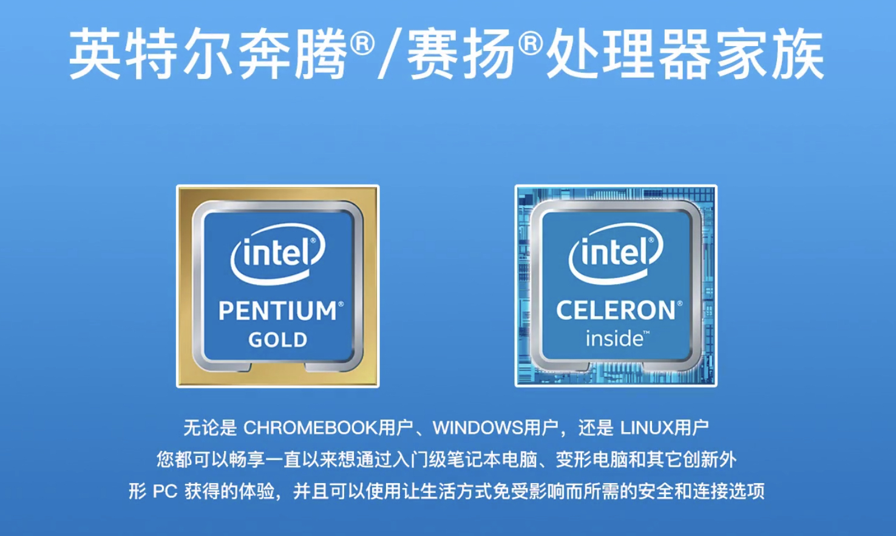

bilibili AV44270790

目前市场上 CPU 主要是两种: Intel 和 AMD

# CPU 参数的认知

英特尔® 处理器名称和编号: https://www.intel.cn/content/www/cn/zh/processors/processor-numbers.html

CPU 的参数主要有: 系列、核心、频率、架构、缓存

## 系列

### Intel

Intel 常见的系列有: 凌动 ATOM、奔腾 PENTIUM、赛扬 CELERON、酷睿 CORE、至强 XEON

Intel 凌动®️处理器, 主要是低功耗频率低, 有 X3、X5、X7 系列, 主要应用在移动端设备上

奔腾®️/赛扬®️, 主要应用在入门级的电脑设备, 一般都是品牌机里比较常见, 例如联想和惠普, 适用于简单的办公处理和网页浏览.

酷睿®️, 主流消费市场的 CPU, 有 i3、i5、i7、i9 系列. i3 系列定位入门级, 用于简单的基础办公、浏览网页和影音娱乐之类的场景, 适合日常家用; i5 系列定位在中端级别, 同样适用于 i3 上面的使用场景, 还能做一些设计类和简单视频剪辑工作, 能玩中大型之类的游戏, 适合一般游戏用户; i7 系列定位在高端级别, 同样适用 i5 的使用场景, 能处理大型的工作需求, 需要用到强大的多线程性能, 3D 渲染、剪辑、硬件测试、软件多开、大型游戏玩家之类的用户; i9 系列, 2017 年 5 月在"台北国际电脑展"上发布, 目前为止最多可以有 18 个核, 主要面向高级游戏玩家和高性能需求者.

酷睿系列产品型号

比如 i7\-8700K, 全称是 intel®️Core™ i7\-8700K processor, 表示为"第八代英特尔酷睿 i7\-8700K 处理器". 其中 intel®️代表品牌名称, Core™代表品牌系列, i7 代表品牌系列的等级, 四位数字 8700 中第一位"8"代表第八代酷睿处理器, 后面三位数字可理解为型号(SKU 编号), 后缀字母 K 则代表不锁倍频且更高性能, 通常来说就是可以超频, processor 是处理器英文

常见的一些后缀解释, 如图所示.

 

英特尔的字母 u 表示低电压版本. 具体其他说明去英特尔官方去看.

至强系列, 定位高端市场, 有**E、W、D、Platinum 四个系列**, 主要应用于服务器和工作站级别, 针对不同种类的企业服务器、功能强大的移动工作站、入门级工作站、存储服务器、云工作站等应用.

### 1.1.2 AMD

AMD 处理器分为 5 个类, 分别是锐龙(RYZEN)、速龙(ATHLON)、APU(A\-SERIES)、打桩机(FX\-SERIES)、霄龙

主要说明主流消费市场的锐龙系列处理器, 2017 年 2 月 21 日发布, 分别是 R3、R5、R7 以及线程撕裂者 THREADRIPPER 系列, 前三款分别对标 Intel 的 i3、i5、i7 系列. 线程撕裂者, 2990WX, 高达 32 核心 64 线程, 面对专业的剪辑、渲染、特效等专业工作, 甚至开发了一个专门玩游戏的 GAME MODE 模式, 开启之后规格会变成 8 核 16 线程, 游戏兼容性更友好.

锐龙系列的产品型号

以 R7\-2700X 为例, 英文 AMD Ryzen 2700X, 中文第二代 AMD 锐龙 R7 2700X 处理器, AMD 是品牌名称, R7 是品牌系列, 2700X 中的四位数字第一位"2"代表第二代锐龙, 后三位可以理解为产品型号(SKU 编号), 后缀字母 X 代表支持自动超频, 支持 AMD SenseMI 技术和 XFR 技术.

AMD 处理器后缀带 x 的表示支持新的一种技术, 可以见到其说明, 通俗的来讲就是支持自动超频. 如果后面**没 x**, 表示会以**默频工作**, 想超频, 请手动. AMD 处理器后面带 g 的还有以前老早的 A8 A10 架构的处理器, 这些处理器大部分都带显卡集成在 CPU 里的.

速龙系列处理器, 速龙 200GE 仿佛为奔腾而生的, 也是应用在入门级别的电脑设备. 速龙 x4 系列已经基本淘汰.

APU 系列曾被广泛应用在笔记本上, 其自带的核心显卡和独显双卡交火, 现在也是基本淡出视野.

## 1.2 核心

CPU 常见核心如下

## 1.3 频率

常听到的 CPU 的主频、睿频、超频以及基准时钟频率和最大加速时钟频率.

用 i5 8600K 来说明, 主频 3.6GHz, 睿频 4.3GHz, 简单理解**主频**就是日常**轻度使用电脑**中所运行的频率, 睿频就是 CPU 处理任务需求高的时候, 比如玩大型游戏视频渲染等, 会自动提高到一个频率, 以保障程序流畅运行. 同理 R5 2600X 的 3.6GHz 基准时钟频率, 和 4.2GHz 的最大时钟频率也是如此. 而超频就是手动提升 CPU 原有的频率, 以此来获得更高的频率和性能, 同时也会带来更大的发热量和能耗.

超线程技术是指当一个程序正在运行时, 任务那就好比处理器要这些数据进行排队. 如果有超线程技术, 就可以把这个程序后续相关用到的数据直接调入前面来, 相当于直接插队. 如果取消超线程技术, 那么就需要更高的主频来解决效率的问题. 比如 9 代的 i9 系列就是如此解决的.

## 1.3 架构

架构相当于一个环境, 每一代新发布的 CPU 都会更新一个架构, 同时也在不断提升 CPU 的性能, 英特尔从曾经的奔腾 3 Tualatin 架构, 到现在第 9 代的 Coffee Lake\-Refresh 架构, 制程工艺也从 130nm 到现在的 14nm+++, 但是从 2014 年第五代 broadwell 架构开始, 14nm 制程工艺似乎阻挡了英特尔的脚步, 下图是英特尔架构图

AMD 架构如下图

在 2019 年年初的 CES2019AMD 展会上, Lias 苏透露了 7nm 制程工艺的 zen2 架构的锐龙处理器将会 2019 年中左右发布, Intel 也在 CES 上放出了 10nm 制程工艺的 Sunnycove 微架构的处理器.

不仅如此, 部分 CPU 架构还关系到主板的插槽底座, 如市面上常见的英特尔的 LGA1151 1150 及 1155 的接口, 还有 AMD 的 AM4 AM3+ FM2+的接口

**不同接口需要对应相应的主板！！！**

## 1.4 缓存