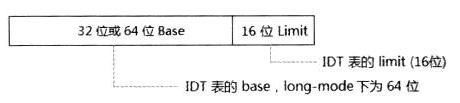

<!-- @import "[TOC]" {cmd="toc" depthFrom=1 depthTo=6 orderedList=false} -->

<!-- code_chunk_output -->

- [加载 IDTR 寄存器](#加载-idtr-寄存器)

<!-- /code_chunk_output -->

10.5.4.4.8 中已经看到了 IDTR 寄存器的结构



作用如下:

1) 提供 IDT(中断描述符表)或 IVT(中断向量表)的线性基地址

2) 提供 IDT 或 IVT 的段 limit

实模式下, IDTR.base 是 IVT 的地址, 在保护模式下 IDTR.base 是 IDT 的地址. 处理器在 power\-up 或 RESET 后 IDTR.base 值为 0, 因此实模式下 IVT 初始化在 0 地址上.

# 加载 IDTR 寄存器

软件在 CPL=0 权限下使用 LIDT 指令来加载 IDTR 寄存器.

```x86asm
db 66h                  ; 实模式下使用 32 位 operand size
 lidt [IDT_POINTER]     ; 加载 IDTR 寄存器

 ... ...

; 定义 IDT pointer
IDT_POINTER:
IDT_LIMIT   dw  IDT_END - IDT -1    ; IDT limit
IDT_BASE    dd  IDT
```

LIDT 指令操作数是 memory 操作数, 低 16 位存放 IDT 的 limit 值, 32 位 operands\-size 下高 32 位存放 IDT 的 32 位 base 线性地址. 使用 64 位 operand\-size 时, **高 64 位存放 64 位线性地址**.

当使用 16 位 operand\-size 时, 32 位 base 地址只有低 24 位有效.