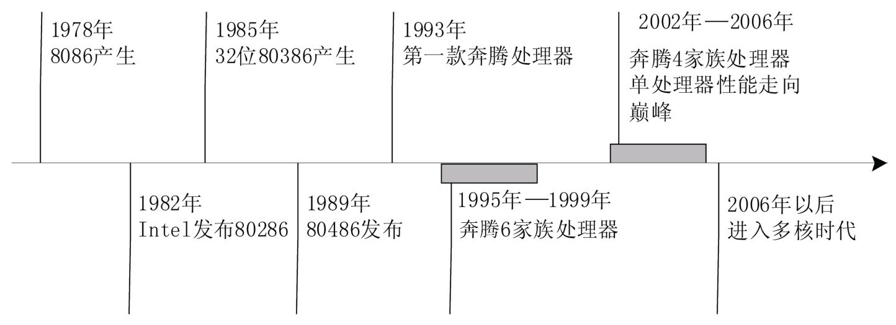

<!-- @import "[TOC]" {cmd="toc" depthFrom=1 depthTo=6 orderedList=false} -->

<!-- code_chunk_output -->

- [1. x86 的历史](#1-x86-的历史)
  - [1.1. x86 的发展历程](#11-x86-的发展历程)
  - [1.2. x86_64](#12-x86_64)
    - [1.2.1. AMD 64](#121-amd-64)
    - [1.2.2. Intel 64](#122-intel-64)
- [2. 操作系统概述](#2-操作系统概述)

<!-- /code_chunk_output -->

# 1. x86 的历史

从 1978 年**8086/8088 处理器**的问世到现在的 Core 2 Duo 和 Core 2 Quad, 以及 Xeon 5300 和 7300 系列处理器, Intel x86 体系接口已经经历了整整 30 年的历史.

## 1.1. x86 的发展历程

Intel 公司是世界上最大的 CPU 制造厂商占据了 80%以上的 CPU 市场份额. 本节以 Intel 公司的处理器为例介绍 x86 的发展历程如图 1-1 所示.

x86 的发展历程:

1978 年最早的 x86 处理器 8086 初次登场. 8086 是 16 位的处理器这个**位数**指的是**CPU GPR(General\-Purpose Register 通用寄存器**)的**数据宽度**为**16 位**. 8086 处理器拥有**16 位的寄存器**和**16 位的外部数据总线**使用**20 位地址寻址**(拥有**1MB 的地址空间**).

在 20 世纪 80 年代初 IBM 选择了 8086 的衍生产品 8088 作为 IBM PC 的处理器. IBM 的这一举动给 x86 带来了巨大的发展机遇并且帮助它成为行业的标准直到今天.

**1982**年, Intel 发布**80286**处理器, 引入了**保护模式**的概念.

**1985 年**后, Intel 公司发布了 x86 体系结构下的**第一款 32 位处理器 80386**, 并且引入**虚拟内存**.

1989 年, **80486**发布, 采用了**5 级流水线机制**, 并且引入了**片上一级缓存和能量管理**.

当时数字不能作为商标, 1993 年, Intel 公司发布第一款**奔腾处理器**(Pentium), 此款处理器在**80486**基础上, 进一步**增大一级缓存**, 并将其分成**指令缓存**和**数据缓存**两部分, 进一步加快处理器对主存的访问时间. 同时, 奔腾处理器还引入了**MMX 技术**, 使得处理器对**多媒体处理**的支持进一步增强.

1995 到 1999 年, Intel 发布一系列基于 x86 体系结构的处理器, 这一系列被称为**P6 家族处理器**, 包括**奔腾 Pro(Pentium Pro**), **奔腾 2(Pentium Ⅱ**), **奔腾 2 至强(Pentium Ⅱ Xeon**), **赛扬(Celeron**), **奔腾 3(Pentium Ⅲ**)以及**奔腾 3 至强(Pentium Ⅲ Xeon**)处理器. P6 家族采用了**超标量(Superscalar**)技术, 以**乱序执行**的方式进一步增强了处理器的速度.

从 2002 年开始到 2006 年, **奔腾 4(Pentium 4)家族处理器(！！！一系列！！！**)占据了主导地位. 奔腾 4 家族的处理器基于**NetBurst 微处理结构**, 在提升性能同时, 进一步增强了对**多媒体处理**的支持, 并引入**超线程的概念(Hyper\-Threading**), 引领**单核处理器**的性能走向极致. 与此同时, 在**奔腾 4 的 672 和 662 处理器**上 Intel 还首次加入了**虚拟化**支持, 即**Intel VT 技术**. 也是在这段时期由于 AMD 发展的 64 位扩充技术的刺激 Intel 公司开始推出 64 位版 x86.

从 2006 年起, 处理器进入**多核时代(Multicore**), Intel 相继发布 Core Duo 和 Core 2 Duo 系列处理器.

至此, x86 体系结构走过 30 年历程.

## 1.2. x86_64

x86\-64 是 x86 架构的延伸产品是一种 64 位微处理器架构及其相应的指令集.
在 x86\-64 出现以前 Intel 与惠普联合推出 IA\-64 架构此架构不与 x86 兼容且市场反应冷淡. 于是与 x86 兼容的 x86\-64 架构应运而生. 1999 年 AMD 首次公开 64 位集为 IA\-32 提供扩展称为 x86\-64(后来改名为**AMD64**). 此架构后来也为 Intel 所采用也就是现在的 Intel 64.

x86\-64 能有效地把 x86 架构移植到 64 位环境并且兼容原有的 x86 应用程序市场前景广阔. 外界使用**x84\-64**或者**x64**称呼这个 64 位架构以保持中立不偏袒任何一家厂商.

### 1.2.1. AMD 64

AMD 64 指令集被应用在 Athlon 64、Athlon 64 FX、Athlon 64 X2、Turion 64、Turion 64 X2、Opteron 及较新款的 Sempron 和 Phenom 处理器上.

其主要特点有: 支持 64 位通用寄存器、64 位整数及逻辑运算和 64 位虚拟地址. AMD 64 架构相比之前的 32 位架构有如下重大改进.

- 新增寄存器.

- 地址宽度加长.

- 新增扩充指令集 SSE2、SSE3.

- 新增"禁止运行"位(No\-ExecuteNX bit): 此位的设置可以防止蠕虫病毒的缓存溢出攻击.

### 1.2.2. Intel 64

Intel 64 指令集被应用于 Pentium 4、Pentium D、Pentium Extreme Edition、Celeron D、Xeon、Intel Core 2、Intel Core 2 Quad、Intel Core i3、Intel Core i5 及 Intel Core i7 处理器上.

Intel 64 架构加入了额外的寄存器和其他改良的指令集可使处理器直接访问超过 4GB 的存储器允许运行更大的应用程序. 通过**64 位的存储器地址上限**其理论存储器容量上限达**16 000 000TB(16EB**)但大多数操作系统和应用程序在可见的未来都用不到如此巨大的地址空间在**初期的应用**上并**未支持完整的 64 位地址**. Intel 64 架构相比之前的 32 位架构有如下重大改进.

- **新增寄存器**.
- **地址宽度加长**.
- **新增改良指令集**.
- 新增"**禁止运行**"位(eXecute DisableXD bit): 相当于 AMD 64 的 NX bit 通过设置此位可以**防止蠕虫病毒的缓存溢出攻击**.

# 2. 操作系统概述

操作系统对下负责管理平台硬件, 对上向应用程序提供标准接口. 操作系统中最重要的部分称为操作系统内核, 运行在 CPU 最高的特权级上, 可访问系统的一切资源, 称内核运行的状态是内核态. 应用程序通常运行在 CPU 最低的特权级上, 只能访问部分资源, 此种状态称为用户态.

操作系统利用**平台架构提供的各种功能**, 使用**硬件资源**, 其实现和平台架构紧密相关.