<!-- @import "[TOC]" {cmd="toc" depthFrom=1 depthTo=6 orderedList=false} -->

<!-- code_chunk_output -->

- [1. 基本概念](#1-基本概念)
  - [1.1. Segment Selector (段选择子/段选择符)](#11-segment-selector-段选择子段选择符)
  - [1.2. Segment Selector Register (段寄存器)](#12-segment-selector-register-段寄存器)
  - [1.3. Descriptor Table (描述符表)](#13-descriptor-table-描述符表)
  - [1.4. Segment Descriptor (段描述符)](#14-segment-descriptor-段描述符)
- [2. 分段数据结构](#2-分段数据结构)
  - [2.1. IA-32 和 IA-32e 系统级寄存器和数据结构](#21-ia-32-和-ia-32e-系统级寄存器和数据结构)
  - [2.2. 内存管理寄存器](#22-内存管理寄存器)
  - [2.3. 分段和分页](#23-分段和分页)
  - [2.4. 逻辑地址到线性地址的翻译](#24-逻辑地址到线性地址的翻译)
  - [2.5. 段选择子](#25-段选择子)
  - [2.6. 32 位段描述符](#26-32-位段描述符)
  - [2.7. 32 位调用门描述符](#27-32-位调用门描述符)
  - [2.8. 64 位调用门描述符](#28-64-位调用门描述符)
  - [2.9. 32 位 IDT 门描述符](#29-32-位-idt-门描述符)
  - [2.10. 64 位中断/陷阱门](#210-64-位中断陷阱门)
  - [2.11. 32 位 TSS](#211-32-位-tss)
  - [2.12. 64 位 TSS/LDT 描述符](#212-64-位-tssldt-描述符)
  - [2.13. 全局描述符和局部描述符](#213-全局描述符和局部描述符)
  - [2.14. 描述符表描述符格式](#214-描述符表描述符格式)
- [3. 示例](#3-示例)

<!-- /code_chunk_output -->

https://blog.csdn.net/firas/article/details/17207353

翻译自《Intel® 64 and IA-32 Architectures Software Developer Manuals》

# 1. 基本概念

## 1.1. Segment Selector (段选择子/段选择符)

段选择符是逻辑地址的一个组成部分, 用于索引段描述符表以获得该段对应的段描述符.

Segment Selector 结构是 16 位(恒 16 位！！！)它是一个段的标识符结构如下.

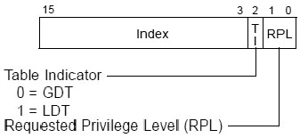

- RPL(Requested Privilege Level): 请求**访问者**所使用的权限级别**从 0 到 3 级**.
- TI(Table Indicator): 描述符表索引位. 当**TI=0**时从**GDT**查找; 当**TI=1**时从**LDT**查找.
- Index(Descriptor Index): 这是 Descriptor 在 GDT/LDT 中的序号根据 TI 的值在相应的描述表中查找 descriptor.

注意**段选择子不是段寄存器不能混为一谈 段选择子是一个数值只有 16 位段寄存器是寄存器 128 位或 96 位, 其可见部分等于段选择子(！！！**)

由图上可以看到通过段选择子只能选择 LDT 或 GDT, **不会包括 IDT**.

段选择子是**逻辑地址的一部分**, **对程序是可见**的. 但通常**段描述符的修改**和**分配**由**连接器**和**加载器完成**, 而**不是应用程序本身(！！！**).

## 1.2. Segment Selector Register (段寄存器)

为了使 CPU 能快速获得段选择符, x86 架构提供了 6 个段寄存器(segment register)用于存放**当前程序**的**各个段的段选择符**. 分别是:

- DS(data\-segment, 数据段): 存放数据段的段选择子.
- CS(code\-segment, 代码段): 存放代码段的段选择子.
- SS(Stack\-segment, 栈段): 存放栈的段选择子.
- ES、FS、GS: 供程序自由使用, 可以存放额外的 3 个数据段的段选择符.

通常程序只使用 CS、DS、SS 这三个段寄存器.

段寄存器有时被表述为**段选择子寄存器**, **恒 16 位**, 包括两大部分: **visible(可视部分**)与**invisible(不可视部分**).

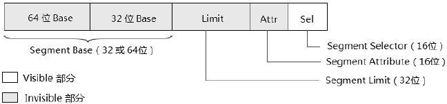

如图所示灰色部分是不可视部分**只有 Selector 域是可视部分**. 不可视部分隐藏在寄存器内部只有处理器可用有时也被称为 Cache 部分, 为了加速段描述符的访问.

当段寄存器被加载了一个新的段选择子后, CPU 自动将该段选择符索引的段描述符加载到不可见部分.

**段寄存器的 base 域**在**64 位**模式下被扩展为**64 位**对于**CS、ES、SS 和 DS(！！！**)寄存器来说这个 64 位的基值没什么意义. 在**64 位模式**下这些**段的基值都被强制为 0 值(！！！一旦往这几个段寄存器加载 selector 发现是这几个寄存器, 不读取 GDT 或 LDT, 直接加载 base 位 0！！！**).

**64 位的段基值**对于**FS 和 GS 寄存器**来说才有意义**FS 和 GS 寄存器(！！！**)可以由**软件设置非 0 的 64 位值**.

**使用代码段或数据段描述符(！！！这两种描述符在 64 位下还是 8 字节大小 base 还是 32 位！！！**)的加载方法只能加载一个**32 位的 base 值**在 x64 体系中新增了**两个 MSR 寄存器**: **IA32_FS_BASE** 和 **IA32_GS_BASE**. 它们分别映射到 **FS.base** 和 **GS.base**.

## 1.3. Descriptor Table (描述符表)

**Segment Selector**用于在**Descriptor Table(描述符表**)里查找**descriptor(描述符**)在 x86 中有**三类描述符表**: **GDT(Global Descriptor Table**)**LDT(Local Descriptor Table**)和**IDT(Interrupt Descriptor Table**).

系统中至少有一个 GDT 可被所有进程访问. 相应的, 系统中可以有一个或多个 LDT, 可以被某个进程私有, 也可被多个进程共享. GDT 仅仅是内存中一个数据结构, 可把它看做一个数组. 与之相反, LDT 是一个段, 它需要一个段描述符来描述它. LDT 的段描述符存放在 GDT 中, 当系统中有多个 LDT 时, GDT 中必须有对应数量的段描述符.

为加速对 GDT 和 LDT 的访问, 这些 descriptor table 由**descriptor table register(描述符表寄存器**)进行定位因此**三种描述符表**就对应着**三种描述符表寄存器**: **GDTR**, **LDTR**和**IDTR**.

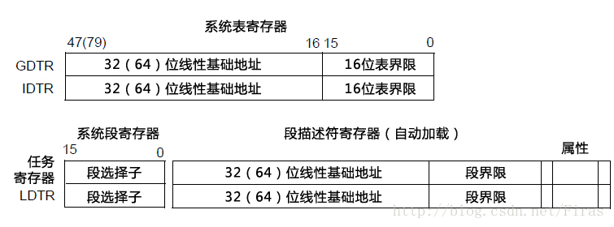

- GDTR: 包含一个 32 位/64 位的基地址(BASE)和一个 16 位长度(LIMIT)
- LDTR: 结构同段寄存器(包括对程序不可见的段描述符寄存器)

由 2.1 的图可知, 所有的**描述符表寄存器！！！**存放的**描述符表的地址**都是**线性地址(！！！**), 应该是由于历史原因为了兼容.

可以使用 LGDT/SGDT 指令对 GDTR 进行读取/存储, 可以使用 LLDT/SLDT 对 LDTR 进行操作. 通常在进程切换时, LDTR 中会被切换成新进程对应的 LDT 的段描述符.

系统通过 LLDT 指令显式加载, 或在任务切换时隐式从 TSS 段中加载. 通过在 GDT 中查找 LDT 描述符, 然后填充 LDTR 寄存器.


## 1.4. Segment Descriptor (段描述符)

段描述符只是众多描述符中的一类描述符有**两大类**: **Segment Descriptor(段描述符**)和**Gate Descriptor(门描述符**). 按**系统性质**来分可以分为: **System Descriptor(系统描述符**)和**Code/Data Descriptor(非 system 描述符**).

下面是笔者对 Descriptor 按系统性质的分类.

- **System descriptor(系统描述符**).
    - **System Segment descriptor(系统段描述符**): 包括**LDT descriptor**和**TSS descriptor**.
    - **Gate descriptor(门描述符**): 包括**Call\-gate**, **Interrupt\-gate**, **Trap\-gate**以及**Task\-gate descriptor**.
- **Non\-system segment descriptor(非系统描述符**).
    - **Code segment descriptor(代码段描述符**).
    - **Data segment descriptor(数据段描述符**).

Descriptor 的**S 域**指示了**描述符的类型**当**S=0**时属于**系统级的描述符**, **S=1**时属于**Code/Data 类描述符**.

在**legacy 模式**下**每个描述符**是**8 字节 64 位宽(！！！**)在**long mode**(包括**compatibility 模式**)下**所有的 gate 描述符**是**16 字节 128 位宽**而**Code/Data 段描述符**依然是**8 字节宽(！！！**).

- **LDT/TSS 描述符**在**64 位模式**下是**16 字节 128 位宽(！！！**)而在**compatibility 模式**下依然是**8 字节 64 位宽(！！！**).

**LDT 和 TSS**在系统中可能有**很多个**, 所以需要在**GDT**中添加**每个 LDT**和**每个 TSS 的描述符**, 用来查找. 而**IDT 是没有描述符**的, 因为**IDT 在系统中就只有一个**, **IDTR 指向**就可以, 永远不变,  **不需要在 GDT 中存在一个 IDT 的描述符**.

当要使用这些**LDT**时可以用它们的**选择子(32 位下 TSS 中有一个 LDT 段选择符！！！**)来访问 GDT 将**LDT 描述符**加载到 LDTR 寄存器.

- **所有 gate 描述符**在 64 位模式下都是**16 字节 128 位宽**的. 包括**Call\-gate descriptor**, **Interrupt\-gate descriptor**和**Trap\-gate descriptor**. **在 Interrupt/Trap\-gate 描述符里增加了一个 IST 域**可以为 interrupt handler 提供**额外的 stack 指针**当**IST 值为非 0**时 IST 值用来在**当前 TSS 块**里查找**相应的 stack 指针值**. 值得注意的是在**long\-mode**下并**不存在 Task\-gate 描述符**基于**TSS 的任务切换机制将不再支持**.

**中断门和陷阱门描述符都只允许存放在 IDT 内(！！！**)**任务门可以位于 GDT、LDT 和 IDT 中(！！！**)

通过**中断门进入中断服务程序**时 cpu 会**自动将中断关闭**也就是将**cpu 中 eflags 寄存器中 IF 标志复位**防止嵌套中断的发生, 返回后恢复; 而通过**陷阱门进入服务程序**时则维持**IF 标志不变**.  这是**中断门与陷阱门的唯一区别(！！！**)

- **Code segment descriptor(代码段描述符**)和**Data segment descriptor(数据段描述符**)在 64 位模式下仍然是**8 字节 64 位宽(！！！**), 不过**大部分域或属性无效**.

各种描述符选择的触发方式很复杂, 详见相关文章.

# 2. 分段数据结构

## 2.1. IA-32 和 IA-32e 系统级寄存器和数据结构

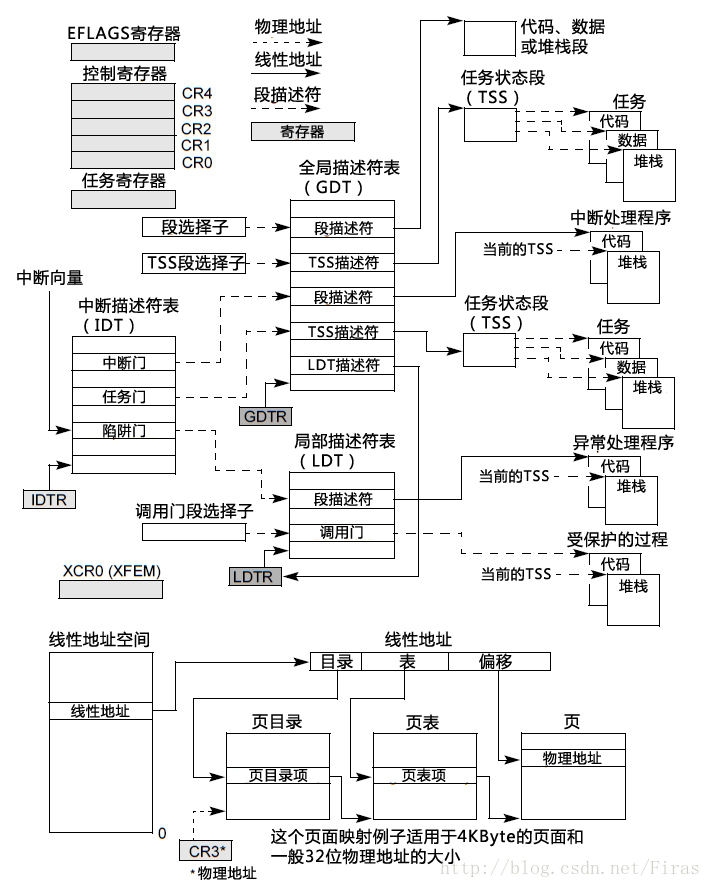

IA-32e:

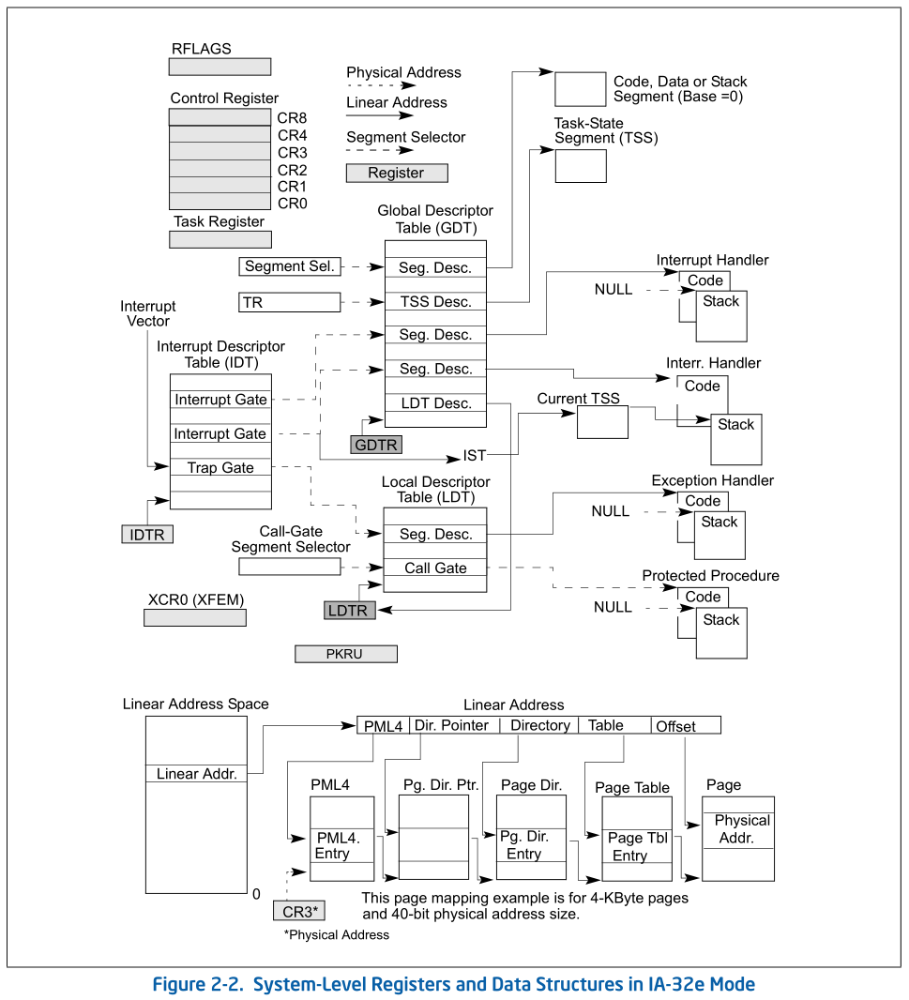

## 2.2. 内存管理寄存器


## 2.3. 分段和分页

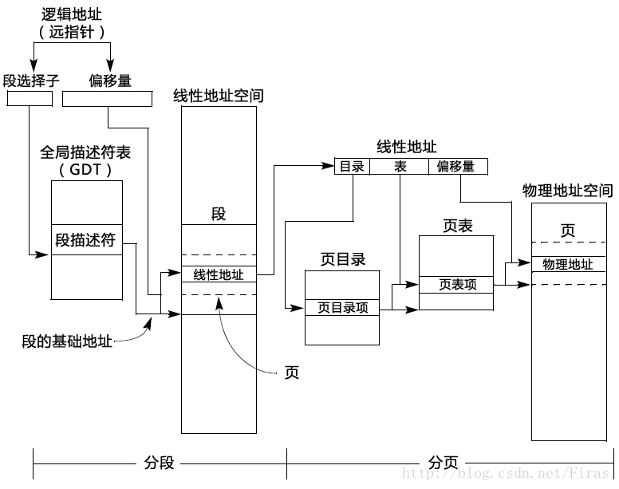

## 2.4. 逻辑地址到线性地址的翻译

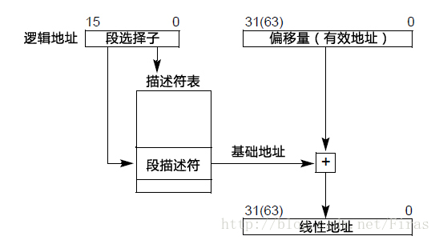

## 2.5. 段选择子

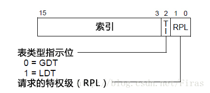

## 2.6. 32 位段描述符

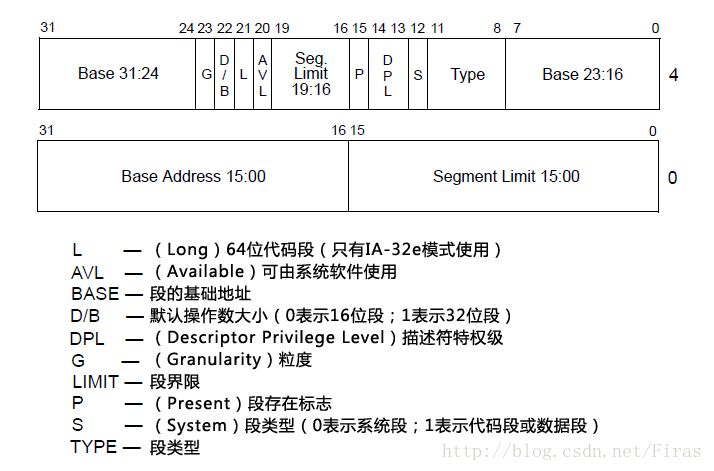

## 2.7. 32 位调用门描述符

**使用描述符中的 offset 域, 不使用指令中给出的偏移量(！！！**)

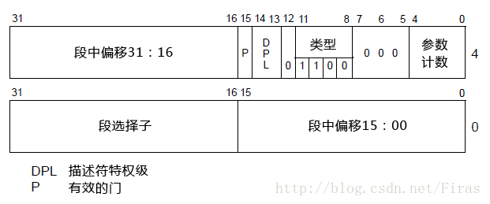

## 2.8. 64 位调用门描述符

**使用描述符中的 offset 域, 不使用指令中给出的偏移量(！！！**)

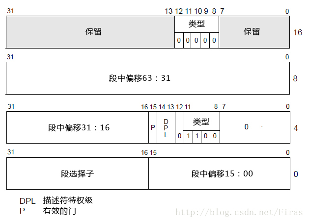

## 2.9. 32 位 IDT 门描述符

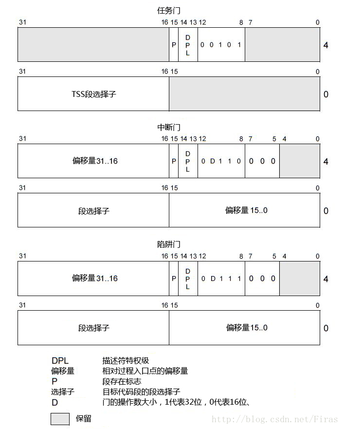

## 2.10. 64 位中断/陷阱门

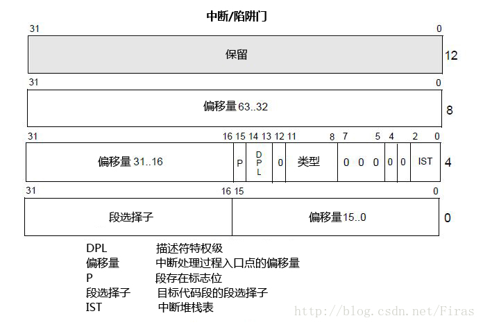

## 2.11. 32 位 TSS

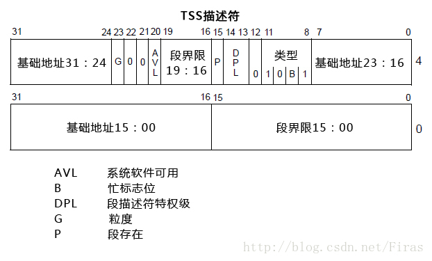

## 2.12. 64 位 TSS/LDT 描述符

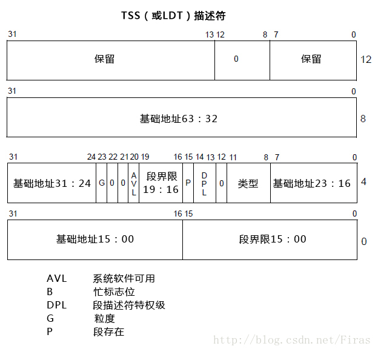

## 2.13. 全局描述符和局部描述符

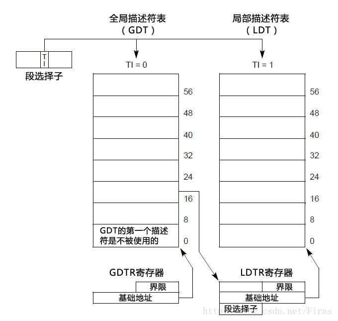

## 2.14. 描述符表描述符格式

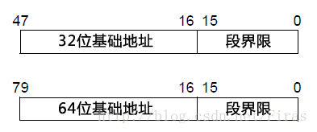

# 3. 示例

假设程序中某条语句访问了数据段, 例如:

```cpp
int a = 100; //全局变量
int func(){
    int b;
    b = a;
}
```

程序从加载到变量 a 的逻辑地址转换为线性地址过程如下.

1. 程序加载

⓵ 通过**该进程 LDT 的段选择符！！！**索引**GDT**, 获得 LDT 的段描述符, 被加载到 LDTR 寄存器中.

⓶ 该进程的 CS、DS、SS 被加载到了相应的段选择符. 同时, CPU 根据段选择符的 TI 字段, 索引 GDT/LDT, 获得相应的段描述符并加载到 CS、DS、SS 对应的不可见部分.

2. 程序执行到 b = a, 需要从 a 所在的内存中取值, 必须先把 a 的逻辑地址转换成线性地址,

⓵ 进行必要的属性、访问权限检查

⓶ 从 DS 对应的段描述符寄存器获得该段的基地址

⓷ 将变量 a 的 32 位偏移量和描述符中的基地址相加, 获得变量 a 的线性地址.

