<!-- @import "[TOC]" {cmd="toc" depthFrom=1 depthTo=6 orderedList=false} -->

<!-- code_chunk_output -->

- [1. 概述](#1-概述)
  - [1.1. 页表](#11-页表)
  - [1.2. TLB](#12-tlb)
  - [1.3. 线性地址转换为物理地址的过程](#13-线性地址转换为物理地址的过程)
- [2. 32 位分页](#2-32-位分页)
  - [2.1. 4KB 页面线性地址翻译](#21-4kb-页面线性地址翻译)
  - [2.2. 4MB 页面线性地址翻译](#22-4mb-页面线性地址翻译)
  - [2.3. CR3 和分页结构项](#23-cr3-和分页结构项)
  - [2.4. 物理地址组成](#24-物理地址组成)
    - [2.4.1. CR3 生成 PDT 物理基地址](#241-cr3-生成-pdt-物理基地址)
    - [2.4.2. 4KB 页 PDE 生成 PT 的物理基地址](#242-4kb-页-pde-生成-pt-的物理基地址)
    - [2.4.3. 4KB 页 PTE 生成页面的物理基地址](#243-4kb-页-pte-生成页面的物理基地址)
    - [2.4.4. 4MB 页 PDE 生成页面的物理基地址](#244-4mb-页-pde-生成页面的物理基地址)
    - [2.4.5. 最终物理地址的生成](#245-最终物理地址的生成)
- [3. PAE 分页](#3-pae-分页)
  - [3.1. 4KB 页面线性地址翻译](#31-4kb-页面线性地址翻译)
  - [3.2. 2MB 页面线性地址翻译](#32-2mb-页面线性地址翻译)
  - [3.3. CR3 和分页结构项](#33-cr3-和分页结构项)
  - [3.4. 物理地址组成](#34-物理地址组成)
    - [3.4.1. CR3 生成 PDPT 物理基地址](#341-cr3-生成-pdpt-物理基地址)
    - [3.4.2. PDPTE 生成 PDT 的物理基地址](#342-pdpte-生成-pdt-的物理基地址)
    - [3.4.3. 4KB 页 PDE 生成 PT 的物理基地址](#343-4kb-页-pde-生成-pt-的物理基地址)
    - [3.4.4. 4KB 页 PTE 生成页面的物理基地址](#344-4kb-页-pte-生成页面的物理基地址)
    - [3.4.5. 2MB 页 PDE 生成页面的物理基地址](#345-2mb-页-pde-生成页面的物理基地址)
    - [3.4.6. 最终物理地址的生成](#346-最终物理地址的生成)
- [4. IA-32e 分页](#4-ia-32e-分页)
  - [4.1. 4KB 页面线性地址翻译](#41-4kb-页面线性地址翻译)
  - [4.2. 2MB 页面线性地址翻译](#42-2mb-页面线性地址翻译)
  - [4.3. 1GB 页面线性地址翻译](#43-1gb-页面线性地址翻译)
  - [4.4. CR3 和分页结构项](#44-cr3-和分页结构项)
  - [4.5. 物理地址组成](#45-物理地址组成)
    - [4.5.1. CR3 生成 PML4T 物理基地址](#451-cr3-生成-pml4t-物理基地址)
    - [4.5.2. PML4E 生成 PDPT 的物理基地址](#452-pml4e-生成-pdpt-的物理基地址)
    - [4.5.3. 4KB 页和 2MB 页 PDPTE 生成 PDT 的物理基地址](#453-4kb-页和-2mb-页-pdpte-生成-pdt-的物理基地址)
    - [4.5.4. 1GB 页 PDPTE 生成页面的物理基地址](#454-1gb-页-pdpte-生成页面的物理基地址)
    - [4.5.5. 4KB 页 PDE 生成 PT 的物理基地址](#455-4kb-页-pde-生成-pt-的物理基地址)
    - [4.5.6. 4KB 页 PTE 生成页面的物理基地址](#456-4kb-页-pte-生成页面的物理基地址)
    - [4.5.7. 2MB 页 PDE 生成页面的物理基地址](#457-2mb-页-pde-生成页面的物理基地址)
    - [4.5.8. 最终物理地址的生成](#458-最终物理地址的生成)
- [5. 分页错误代码](#5-分页错误代码)
- [6. 参考](#6-参考)

<!-- /code_chunk_output -->

# 1. 概述

分页是更加粒度化的内存管理机制, 分页是用粒度化的单位"页"来管理线性地址空间和物理地址空间. x86 下一个典型的页大小是 4KB, 则一个 4GB 的**虚拟地址空间**可以**划分为 1024X1024 个页面**. **物理地址空间的划分同理**. x86 允许大于 4KB 的页面大小, 这里只介绍 4KB 页面.

同时, **分页机制**让操作系统中的**虚拟内存机制**称为可能. **一个页面**可以存在于**物理内存(！！！**)中, 也可以存放在**磁盘的交换区域！！！**(如**Linux 下的 Swap 分区！！！**, **Windows 的虚拟内存文件！！！**)中, 程序可以使用比机器**物理内存更大的内存区域！！！**.

分页机制的核心思想是通过**页表**将**线性地址转换为物理地址**, 并配合**旁路转换缓冲区(Translation Lookaside Buffer, TLB！！！**)来加速地址转换过程. **操作系统**在**启动过程**中, 通过将**CR0 寄存器**的**PG 位置 1**来启动**分页机制**.

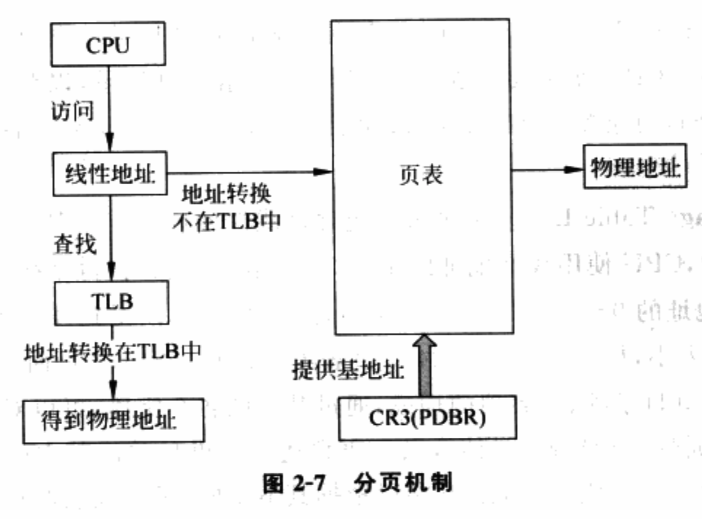

从图中看到, 分页机制主要由页表、CR3 和 TLB 三个部件构成. 下面以 4KB 页面的 32 位分页为例进行讲解.

## 1.1. 页表

**页表(Page Table**)是用于将**线性地址转换成物理地址**的主要数据结构. **一个地址对齐到页边界(！！！**)后的值称为**页帧号**, 它实际是**该地址所在页面的基地址**. **线性地址对应的页帧号！！！**即**虚拟页帧号(Virtual Frame Number, VFN！！！**), **物理地址对应的页帧号！！！**即**物理页帧号(Physical Frame Number, PFN！！！**)或**机器页帧号(Machine Frame Number**). 页表就是存储 VFN 到 PFN 映射的数据结构.

4KB 的 32 位分页使用两级页表, 如图.

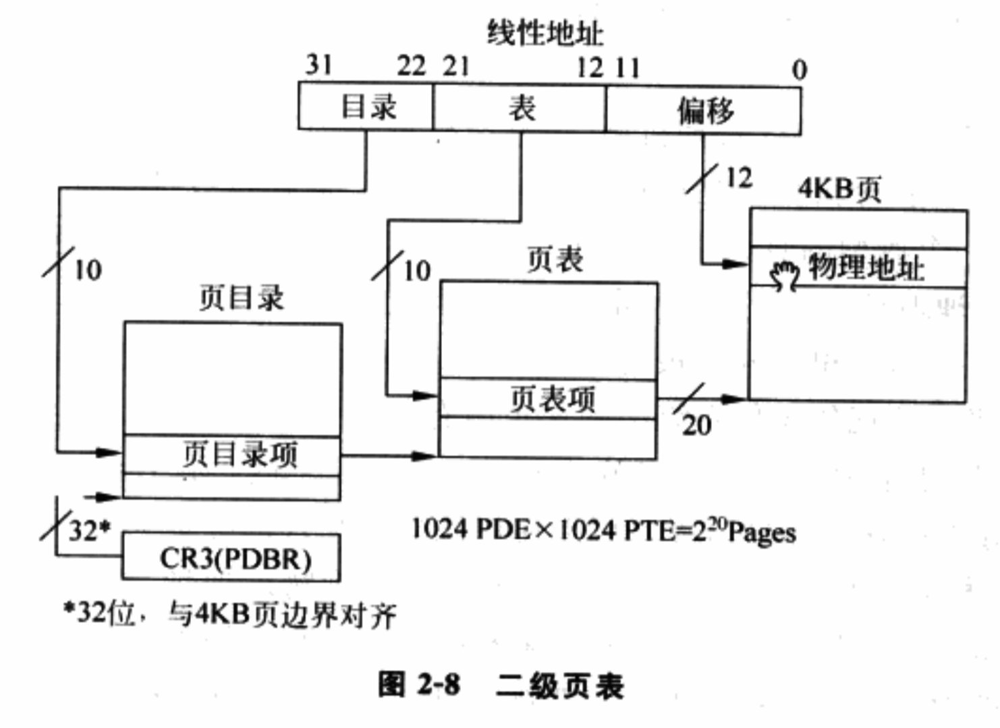

⓵ **页目录项(Page Directory Entry**): 包含**页表的物理地址(！！！不是线性地址！！！**). **页目录项**存放在**页目录(Page Directory, 也称为页目录表 PDT！！！**)中, CPU 使用线性地址的 22\~31 位(高 10 位)索引页目录, 以获得该线性地址对应的页目录项. 每个页目录项为 4B 大小, 故页目录占用 4KB 大小的物理页面, 共包含 1024 的页目录项.

⓶ 页表项(Page Table Entry): 页表项包含**该线性地址对应的 PFN(！！！物理地址页帧号！！！**). **页表项**存放在**页表(Page Table**)中, CPU 使用线性地址的**12\~21 位**索引页表, 获得该**线性地址**对应的**页表项**. 通过将**线性地址**的**0\~11 位**偏移量和**基地址**相加, 就可以得到线性地址对应的物理地址. 页表项为 4B 大小, 故页表包含 1024 个页表项, 占用一个 4KB 页面.

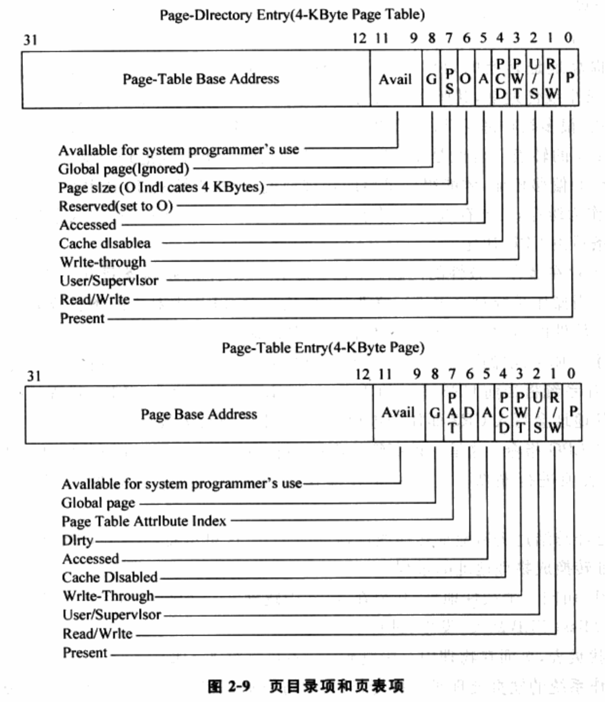

图 2\-9 显示了页目录项、页表项的构成, 通过其中的各个字段, 可以对页面访问权限, 缓存机制, 全局页等属性进行控制. 这里只关注 P(Present)字段, 该字段使虚拟内存的实现成为可能. P 根据其值不同, 可以代表两种情况:

1. P=1: 物理页面存在于物理内存中, CPU 完成地址转换后, 可以直接访问该页面.
2. P=0: **页面不在物理内存**中, 当 CPU 访问该页面时会产生一个**缺页错误(Page Fault**)并交由**操作系统**的**缺页错误处理程序处理**. 通常**操作系统**会将**存放在磁盘上的页面(！！！**)调入**物理内存**, 使访问可以继续. **P=0**时, **页目录项**、**页表项格式**变成图 2-10 中的格式. 此时**1\~31 位**供操作系统使用以记录物理页面在磁盘上的信息, 通常是**物理页面在磁盘上的位置！！！**.

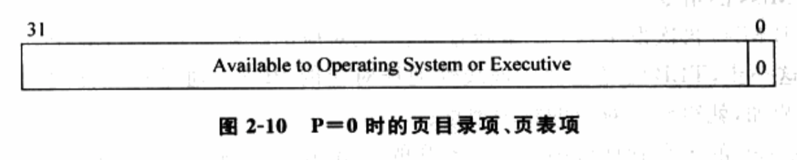

CPU 在**索引页目录**前, 必须知道**页目录所在的物理地址**, 该**物理地址**存放在**CR3(Control Register 3)寄存器**中, 也称为**页目录基地址寄存器(Page\-directory base register, PDBR**). 一个**进程在运行前(！！！**), 必须将**其页目录的基地址存入 CR3**. 页目录的基地址必须**对齐到 4K 边界**.

## 1.2. TLB

为提高地址转换效率, x86 架构使用 TLB 对最近用到的页面映射进行缓存, 当 CPU 访问某个线性地址, 其所在页面的映射存在于 TLB 中, 无须查找页表即可进行地址转换. 注意, 很多资料说 TLB 存放的是线性地址到物理地址的转换, 准确来说应该是: **VFN 到 PFN 的转换！！！**. 即, **CPU 从 TLB**获得一个**线性地址对应的 PFN**后, 仍然要**和线性地址的偏移相加**, 才能得到**最后的物理地址**, 而**非直接从 TLB 中获取物理地址**.

TLB 作为缓存, 其能存放的映射条目有限, 当 TLB 中没有空闲条目可用时, 替换哪一个旧条目由 CPU 决定.

**TLB**也有**缓存一致性**的问题这主要是指**TLB 中的映射条目(！！！**)和**页表中的映射条目(！！！**)的一致性. 当**操作系统**对**页表进行修改**要**负责对 TLB 中对应条目或整个 TLB 进行刷新(！！！**). 从**软件的角度**来看, x86 提供了**两种方式刷新 TLB**:

⓵ **更新 CR3**: 此操作可以**导致 TLB 被整体刷新**, TLB 中**所有映射条目失效**(**全局 TLB 除外**). 操作系统将**当前 CR3 中的值**重新写会**CR3**以**刷新整个 TLB**. 进程切换时, 新进程的页目录基地址会写入 CR3 而使老进程在 TLB 中的条目失效.

⓶ **INVLPG 指令**: 这是一种更细粒度的刷新, **操作系统**用它对**TLB**中**单独的页目录项**、**页表项**进行刷新. 这通常是在**操作系统修改页表**后进行的(例如**分配/释放页面！！！**).

## 1.3. 线性地址转换为物理地址的过程

⓵ CPU 访问一个线性地址, 映射在 TLB 中跳到⓺. 如映射不存在于 TLB 中, 称为 TLB Miss 发生, 进行下一步.

⓶ **查找页表**, **页面在物理内存！！！** 中跳到⓸, 不会再进行下一步.

⓷ 操作系统的缺页处理函数接管, 通常进行如下操作: a)将页面从磁盘复制到物理内存中; b)更改对应页表项, 设置 P 为 1, 并对其他字段相应设置; c)**刷新 TLB 中对应的页表项**; d)从缺页错误处理函数中返回.

⓸ 到这一步, **页面**已经存在于**物理内存**中, 并且**页表**已经**包含了该映射**. 此时, 重新执行引发 TLB Miss 的指令.

⓹ **TLB Miss 再次发生(！！！**), **CPU 重新查页表**, 把**相应的映射插入到 TLB**中.

⓺ 到这一步, **TLB**已经包含了**该线性地址对应的 PFN**. 通过将**线性地址**中的**偏移部分和 PFN 相加**, 就得到了**对应的物理地址**.

翻译自《Intel® 64 and IA\-32 Architectures Software Developer Manual Volume 3A》

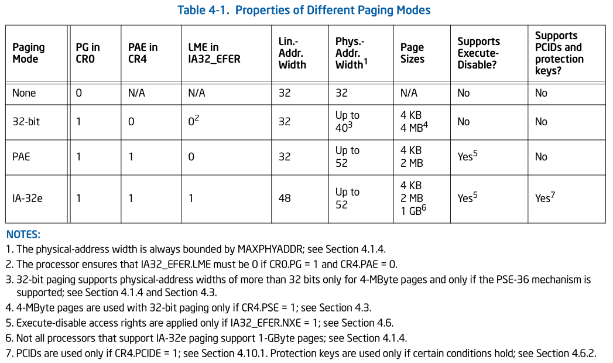

每个 table 里的 entry(表项)分别被称为**PTE(Page Table Entry**)、**PDE(Page Directory Table Entry**)、**PDPE(Page Directory Pointer Table Entry**)和**PML4E(Page\-Map Leve\-4 Table Entry**).

注: CR3 存放的是物理地址, 表项中也是物理地址.

# 2. 32 位分页

**线性地址是 32 位宽**, 采用一级或两级页转换表.

**每个表项**大小是**4 字节**宽, 32 位.

**CR3**使用**32 位**.

## 2.1. 4KB 页面线性地址翻译

使用 PDT(page directory table 页目录表)和 PT(page table 页表)两级表格.

用 32 位分页的到一个 4KB 页面的线性地址翻译

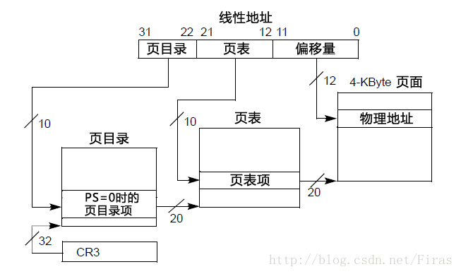

**4KB 页面线性地址构成: 10(PDT 索引, 1024 个项) \+ 10(PT 索引, 1024 个项) \+ 12(Page offset, 4KB 页**)

一个 table 的大小:

- 一个 PDT 有 1024 项(2^10); 占用空间: 1024 x 4 字节 = 4KB.
- 一个 PT 有 1024 项(2^10); 占用空间: 1024 x 4 字节 = 4KB.

一个进程一次性全部表示需要的页表结构内存:

- PDTE 可能共有: 1024(2\^10) 个; 占用空间: 1024 x 4 字节 = 4KB.
- PTE 可能共有: 1024(2^10) x 1024(2\^10) 个; 占用空间: 1024 x 1024 x 4 字节 = 4MB.

## 2.2. 4MB 页面线性地址翻译

使用 PDT(page directory table)一级表格.

用 32 位分页的到一个 4MB 页面的线性地址翻译

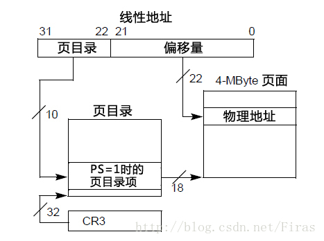

**4MB 页面线性地址构成: 10(PDT 索引, 1024 个项) \+ 22(Page offset, 4MB 页**)

一个 table 的大小:

- 一个 PDT 有 1024 项(2^10), 占用空间: 1024 x 4 字节 = 4KB.

一个进程一次性全部表示需要的页表结构内存:

- PDTE 可能共有: 1024(2\^10) 个; 占用空间: 1024 x 4 字节 = 4KB.

## 2.3. CR3 和分页结构项

32 位分页的 CR3 和分页结构项的格式

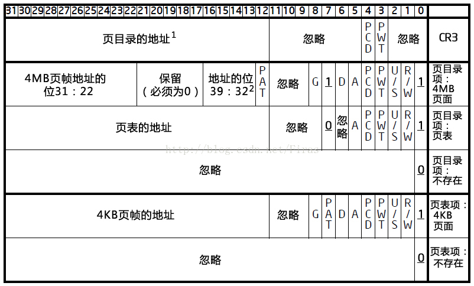

## 2.4. 物理地址组成

32 位 paging 下**最高为 40 位物理地址(！！！**)(依赖于**PSE\-36**与**MAXPHYADDR**值). 如果**不使用 PSE\-36 机制**, 那么**最高为 32 位物理地址(！！！**).

4K 页面能映射的**物理地址最高是 32 位(！！！**)

### 2.4.1. CR3 生成 PDT 物理基地址

在 32 位 paging 模式下 CR3 使用**低 32 位**(在**Intel64 或 AMD64 机器上 64 位, 只使用低 32 位！！！**)CR3 的**Bit 31 到 Bit 12 位**提供**20 位的 Page Directory Table 的物理基地址(物理基地址！！！高 20 位！！！**).

那么以**36 位的物理基地址**为例它是这样形成的.

1) `base of PDT[35: 32]`=`0`值(**高 4 位 Bit 35 到 Bit 32 为 0 值！！！如果是 40 位物理地址高位也会是补 0！！！**).

2) `base of PDT[31: 12]`=`CR3[31: 12]`(**中间 20 位**由**CR3 的 Page Driectory base 域**提供).

3) `base of PDT[11: 00]`=`0`值(**低 12 位补 0！！！**).

因此 CR3 提供的**PDT 物理基地址(！！！**)是**4K 边界对齐(！！！**)的. **和 4KB 分页的物理地址形成方式一致(！！！**).

### 2.4.2. 4KB 页 PDE 生成 PT 的物理基地址

32 位 paging 模式的 4K 页面里能映射的**物理地址最高是 32 位(！！！4K 页最高 32 位物理地址！！！**)下一级**32 位的 page table 物理地址**形成如下.

1) `base of PT[31: 12]`(**高 20 位**)=`PDE[31: 12]`它是**PDE 的高 20 位值**.

2) `base of PT[11: 0]`(**低 12 位**)=`0`值 32 位地址的**低 12 位补 0**.

因此 PDE 里提供的**PT 物理基地址(！！！**)是**4K 边界对齐(！！！由 PT 物理基地址组成决定的！！！**)的.

### 2.4.3. 4KB 页 PTE 生成页面的物理基地址

在 32 位 paging 模式下**4K 页面**使用的是**32 位的最高映射物理地址(！！！只能使用最高 32 位物理地址！！！**). 因此 page frame 的形成如下.

1) `page base[31: 12]`=`PTE[31: 12]`PTE 的**高 20 位**对应**物理页面的高 20 位**.

2) `page base[12: 0]`=`0`值. **物理页面的低 12 位补 0**.

所以**物理页面在 4KB 边界对齐**.

### 2.4.4. 4MB 页 PDE 生成页面的物理基地址

4MB 页面**没有 PT**, **PDE 直接指向页面**.

**4MB 页面**的**PDE 结构**提供**4MB 页面的物理基地址**, 地址组成方式如下:

1) 当处理器**不支持 PSE\-36**功能时 4M page frame 只能映射到**32 位的物理地址空间(！！！**)上`PDE[31: 22]`是 4M `page base[31: 22]`(**高 10 位**), 这时候`PDE[21: 13]`共**9 位是保留位**必须设置为 0 值.

2) 当**MAXPHYADDR**值为**36**位时`PDE[16: 13]`是`4M page base[35: 32]`位(高 4 位)`PDE[31: 22]`是`4M page base[31: 22]`(**中间 10 位**), 而`PDE[21: 17]`是保留位必须设置为 0 值.

3) 当 MAXPHYADDR 值为**40 位**时`PDE[20: 13]`是`4M page base[39: 32]`位(高 8 位), `PDE[31: 22]`是`4M page base[31: 22]`(**中间 10 位**)而`PDE[21]`位是保留位必须设置为 0 值.

4) 当 MAXPHYADDR 值为**52 位**时也**仅能使用 40 位的物理地址(！！！**)同3).

因此 4M page frame 的基地址形成除上述所说外**36 位或 40 位的物理地址低 22 位将补 0(！！！**)物理页面将在**4M 边界上对齐(！！！**).

### 2.4.5. 最终物理地址的生成

上面可以看到, 所有页面基地址都是 4KB 或 4MB 边界对齐的, 再加上线性地址低位的偏移 offset, 生成最终的物理地址.

# 3. PAE 分页

**线性地址 32 位宽**, 使用两级或三级页转换表.

**每个表项 8 字节宽**.

新 CR3 仍然 32 位宽, 但只使用了 27 位, 拼凑了 32 位 PDPT 物理地址.

## 3.1. 4KB 页面线性地址翻译

使用`PDPT`(page directory pointer table 页目录指针表)`PDT`和`PT`.

用 PAE 分页的到一个 4KB 页面的线性地址翻译

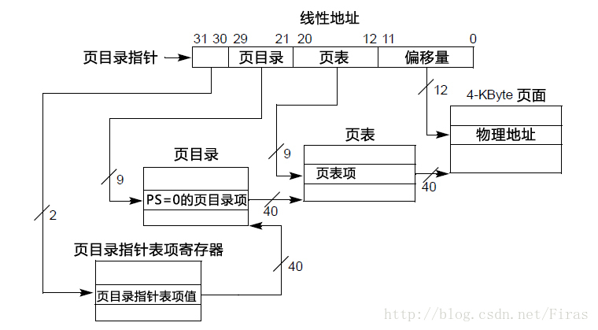

**4KB 页面线性地址构成: 2(PDPT 索引, 4 个项) \+ 9(PDT 索引, 512 个项) \+ 9(PT 索引, 512 个项) \+ 12(Page offset, 4KB 页**)

一个 table 的大小:

- 一个 PDPT 有 4 项(2\^2); 占用空间: 4 x 8 字节 = 32 字节.
- 一个 PDT 有 512 项(2^9); 占用空间: 512 x 8 字节 = 4KB.
- 一个 PT 有 512 项(2^9); 占用空间: 512 x 8 字节 = 4KB.

一个进程一次性全部表示需要的页表结构内存:

- PDPTE 可能共有: 4(2\^2) 个; 占用空间: 4 x 8 字节 = 32 字节.
- PDE 可能共有: 4(2\^2) x 512(2\^9) 个; 占用空间: 4 x 512 x 8 字节 = 16KB.
- PTE 可能共有: 4(2\^2) x 512(2\^9) x 512(2\^9) 个; 占用空间: 4 x 512 x 512 x 8 字节 = 8MB.

## 3.2. 2MB 页面线性地址翻译

使用`PDPT`和`PDT`.

用 PAE 分页的到一个 2MB 页面的线性地址翻译

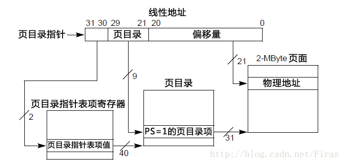

**2MB 页面线性地址构成: 2(PDPT 索引, 4 个项) \+ 9(PDT 索引, 512 个项) \+ 21(Page offset, 2MB 页**)

一个 table 的大小:

- 一个 PDPT 有 4 项(2\^2); 占用空间: 4 x 8 字节 = 32 字节.
- 一个 PDT 有 512 项(2^9); 占用空间: 512 x 8 字节 = 4KB.

一个进程一次性全部表示需要的页表结构内存:

- PDPTE 可能共有: 4(2\^2) 个; 占用空间: 4 x 8 字节 = 32 字节.
- PDE 可能共有: 4(2\^2) x 512(2\^9) 个; 占用空间: 4 x 512 x 8 字节 = 16KB.

## 3.3. CR3 和分页结构项

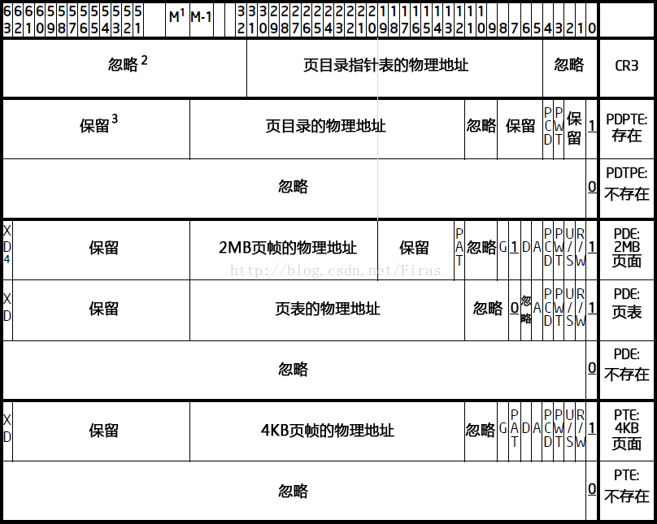

## 3.4. 物理地址组成

PAE 下, **线性地址仍然 32 位宽(！！！**), **CR3 还是 32 位宽**,  支持**最高 52 位的物理地址**依赖于**MAXPHYADDR 值**. 当 MAXPHYADDR 为**36**时只能映射到**36 位的物理地址**以此类推.

### 3.4.1. CR3 生成 PDPT 物理基地址

**CR3 低 5 位被忽略**提供**27 位的 PDPT 基地址**.

**32 位的 PDPT 物理地址**形成如下:

1) `base of PDPT[31: 5]`=`CR3[31: 5]`**高 27 位由 CR3**提供.

2) `base of PDPT[4: 0]`=`0`值**低 5 位补 0**.

如果是**36 位或更大物理地址**, 则进行**高位补 0**.

因此 PDPT 的基地址是**32 字节边界对齐(2\^5！！！**)的.

### 3.4.2. PDPTE 生成 PDT 的物理基地址

4KB 页和 2MB 页这是一致的

在**PDT(page directory table)物理基地址**上它的地址为**52 位(最高支持**)、**40 位或是 36 位**它的形成如下.

1) 当 MAXPHYADDR 为**52 位**时`base of PDT[51: 12]`=`PDPTE[51: 12]`由 PDPTE 结构的`[51: 12]`提供 PDT 的**高 40 位**.

2) 当 MAXPHYADDR 为**40 位**时`base of PDT[39: 12]`=`PDPTE[39: 12]`由 PDPTE 结构的`[39: 12]`提供**PDT 的高 28 位**. 此时`PDPTE[51: 40]`是保留位必须为 0 值.

3) 当 MAXPHYADDR 为**36 位**时`base of PDT[35: 12]`=`PDPTE[35: 12]`由 PDPTE 结构的`[35: 12]`提供 PDT 的**高 24 位**. 此时`PDPTE[51: 36]`是保留位必须为 0 值.

**PDT 的低 12 位(！！！)将补 0 值**因此**PDT 物理基地址**将在**4K 边界上对齐(！！！**).

### 3.4.3. 4KB 页 PDE 生成 PT 的物理基地址

`PDE[51: 12]`(**最多 30 位, 加上 12 位 0, 最大 52 位物理地址**)提供**PT 的物理基地址高位** **低 12 位全部补 0**, PT 地址为**4K 边界对齐**.

如果物理地址比较小, **bit 51 往下减少**.

### 3.4.4. 4KB 页 PTE 生成页面的物理基地址

`PTE[51: 12]`提供**4K 页面的高物理地址位(最多 40 位**),  **低 12 位全部补 0**,  **页面地址 4K 边界对齐**.

如果物理地址比较小, **bit 51 往下减少**.

### 3.4.5. 2MB 页 PDE 生成页面的物理基地址

2MB 页面**没有 PT**, **PDE 直接指向页面**.

1) MAXPHYADDR 为**52 位**时`2M page frame`地址的`[51: 21]`(**高 31 位**)由`PDE[51: 21]`提供.

2) MAXPHYADDR 为**40 位**时`2M page frame`地址的`[39: 21]`(**高 19 位**)由`PDE[39: 21]`提供此时`PDE[51: 22]`为保留位必须为 0.

3) MAXPHYADDR 为**36 位**时`2M page frame`地址的`[35: 21]`(**高 15 位**)由`PDE[35: 21]`提供此时`PDE[51: 36]`为保留位必须为 0

`2M page frame`地址的`[20: 0]`(**低 21 位！！！)补 0**因此**2M 页面**的地址**在 2M 边界上对齐**.

### 3.4.6. 最终物理地址的生成

上面可以看到, 所有页面基地址都是 4KB 或 2MB 边界对齐的, 再加上线性地址低位的偏移 offset, 生成最终的物理地址.

# 4. IA-32e 分页

线性地址 48 位宽, 使用两级到四级的页转换表.

**每个表项都是 8 字节宽**.

CR3 是 64 位宽, 针对是否支持 PCIDE 功能, CR3 使用不一样.

## 4.1. 4KB 页面线性地址翻译

使用`PML4T`(page map level-4 table 四层映射表)`PDPT``PDT`和`PT`.

用 IA\-32e 分页的到一个 4KB 页面的线性地址翻译

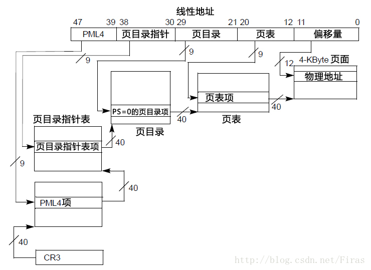

**4KB 页面线性地址构成: 9(PML4T 索引, 512 个项) \+ 9(PDPT 索引, 512 个项) \+ 9(PDT 索引, 512 个项) \+ 9(PT 索引, 512 个项) \+ 12(Page offset, 4KB 页**)

一个 table 的大小:

- 一个 PML4T 有 512 项(2\^9); 占用空间: 512 x 8 字节 = 4KB.
- 一个 PDPT 有 512 项(2\^9); 占用空间: 512 x 8 字节 = 4KB.
- 一个 PDT 有 512 项(2^9); 占用空间: 512 x 8 字节 = 4KB.
- 一个 PT 有 512 项(2^9); 占用空间: 512 x 8 字节 = 4KB.

一个进程一次性全部表示需要的页表结构内存:

- PML4E 可能共有: 512(2\^9)个; 占用空间: 512 x 8 字节 = 4KB.
- PDPTE 可能共有: 512(2\^9) x 512(2\^9) 个; 占用空间: 512 x 512 x 8 字节 = 2MB.
- PDE 可能共有: 512(2\^9) x 512(2\^9) x 512(2\^9) 个; 占用空间: 512 x 512 x 512 x 8 字节 = 1GB.
- PTE 可能共有: 512(2\^9) x 512(2\^9) x 512(2\^9) x 512(2\^9)个; 占用空间: 512 x 512 x 512 x 512 x 8 字节 = 512GB.

## 4.2. 2MB 页面线性地址翻译

使用`PML4T``PDPT`和`PDT`.

用 IA\-32e 分页的到一个 2MB 页面的线性地址翻译

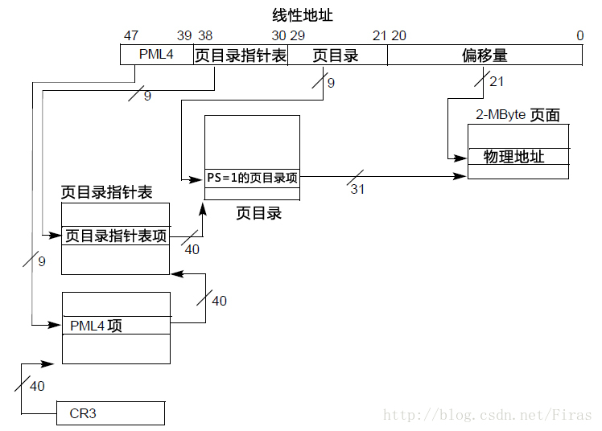

**2MB 页面线性地址构成: 9(PML4T 索引, 512 个项) \+ 9(PDPT 索引, 512 个项) \+ 9(PDT 索引, 512 个项) \+ 21(Page offset, 2MB 页**)

一个 table 的大小:

- 一个 PML4T 有 512 项(2\^9); 占用空间: 512 x 8 字节 = 4KB.
- 一个 PDPT 有 512 项(2\^9); 占用空间: 512 x 8 字节 = 4KB.
- 一个 PDT 有 512 项(2^9); 占用空间: 512 x 8 字节 = 4KB.

一个进程一次性全部表示需要的页表结构内存:

- PML4E 可能共有: 512(2\^9)个; 占用空间: 512 x 8 字节 = 4KB.
- PDPTE 可能共有: 512(2\^9) x 512(2\^9) 个; 占用空间: 512 x 512 x 8 字节 = 2MB.
- PDE 可能共有: 512(2\^9) x 512(2\^9) x 512(2\^9) 个; 占用空间: 512 x 512 x 512 x 8 字节 = 1GB.

## 4.3. 1GB 页面线性地址翻译

使用`PML4T`和`PDPT`.

用 IA\-32e 分页的到一个 1GB 页面的线性地址翻译

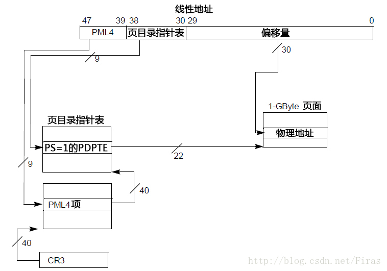

**1GB 页面线性地址构成: 9(PML4T 索引, 512 个项) \+ 9(PDPT 索引, 512 个项) \+ 30(Page offset, 1GB 页**)

一个 table 的大小:

- 一个 PML4T 有 512 项(2\^9); 占用空间: 512 x 8 字节 = 4KB.
- 一个 PDPT 有 512 项(2\^9); 占用空间: 512 x 8 字节 = 4KB.

一个进程一次性全部表示需要的页表结构内存:

- PML4E 可能共有: 512(2\^9)个; 占用空间: 512 x 8 字节 = 4KB.
- PDPTE 可能共有: 512(2\^9) x 512(2\^9) 个; 占用空间: 512 x 512 x 8 字节 = 2MB.

## 4.4. CR3 和分页结构项

IA\-32e 分页的 CR3 和分页结构项的格式

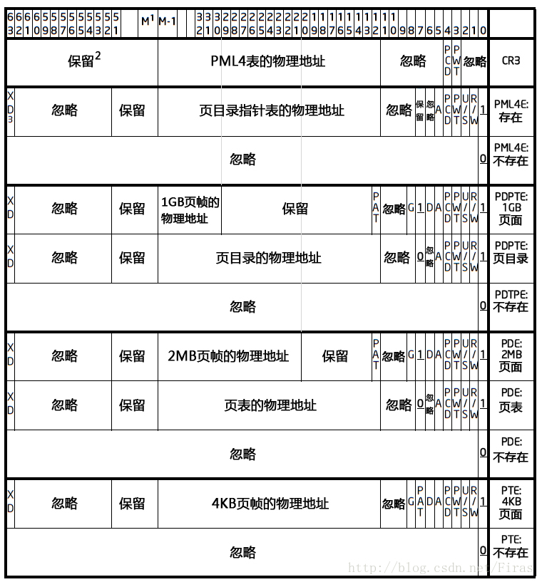

## 4.5. 物理地址组成

**线性地址 48 位宽(！！！**), **CR3 已经是 64 位宽**,  支持**最高 52 位的物理地址**依赖于**MAXPHYADDR 值**. 当 MAXPHYADDR 为**36**时只能映射到**36 位的物理地址**以此类推.

### 4.5.1. CR3 生成 PML4T 物理基地址

`CR3[51: 12]`提供**PML4T 的物理地址高位(最多 40 位**), **低 12 位全部补 0**,  **PML4T 地址 4K 边界对齐**.

如果物理地址比较小, **bit 51 往下减少**.

### 4.5.2. PML4E 生成 PDPT 的物理基地址

`PML4E[51: 12]`提供**PDPT 的物理地址高位(最多 40 位**),  **低 12 位全部补 0**,  **PDPT 地址 4K 边界对齐**.

如果物理地址比较小, **bit 51 往下减少**.

### 4.5.3. 4KB 页和 2MB 页 PDPTE 生成 PDT 的物理基地址

`PDPTE[51: 12]`提供**PDT 的物理地址高位(最多 40 位**),  **低 12 位全部补 0**,  **PDT 地址 4K 边界对齐**.

如果物理地址比较小, **bit 51 往下减少**.

### 4.5.4. 1GB 页 PDPTE 生成页面的物理基地址

1GB 页面**没有 PDT**, **没有 PT**, **PDPTE 直接指向页面**.

`PDPTE[51: 30]`提供**PDT 的物理地址高位(最多 22 位**),  **页面地址低 30 位全部补 0**,  **页面地址 1GB 边界对齐**.

如果物理地址比较小, **bit 51 往下减少**.

### 4.5.5. 4KB 页 PDE 生成 PT 的物理基地址

`PDE[51: 12]`提供**PT 的物理地址高位(最多 40 位**),  **页表 PT 地址低 12 位全部补 0**,  **页表 PT 地址 4K 边界对齐**.

如果物理地址比较小, **bit 51 往下减少**.

### 4.5.6. 4KB 页 PTE 生成页面的物理基地址

`PTE[51: 12]`提供**页面的物理地址高位(最多 40 位**),  **页面地址低 12 位全部补 0**,  **页面地址 4K 边界对齐**.

如果物理地址比较小, **bit 51 往下减少**.

### 4.5.7. 2MB 页 PDE 生成页面的物理基地址

2MB 页面**没有 PT**, **PDE 直接指向页面**.

`PDE[51: 21]`提供**页面的物理地址高位(最多 31 位**),  **页面地址低 21 位全部补 0**,  **页面地址 2MB 边界对齐**.

如果物理地址比较小, **bit 51 往下减少**.

### 4.5.8. 最终物理地址的生成

上面可以看到, 所有页面基地址都是 4KB, 2MB 或 1GB 边界对齐的, 再加上线性地址低位的偏移 offset, 生成最终的物理地址.

# 5. 分页错误代码

# 6. 参考

https://blog.csdn.net/Firas/article/details/17207813