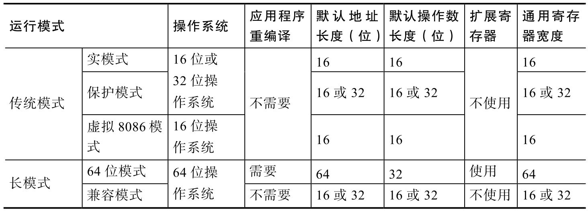
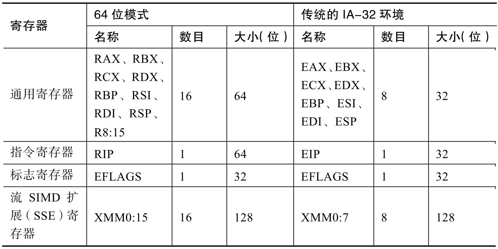

<!-- @import "[TOC]" {cmd="toc" depthFrom=1 depthTo=6 orderedList=false} -->

<!-- code_chunk_output -->

- [1. 基本模式](#1-基本模式)
  - [1.1. IA-32 模式](#11-ia-32-模式)
  - [1.2. IA-32e 模式](#12-ia-32e-模式)
- [2. 基本寄存器组](#2-基本寄存器组)
- [3. 权限控制](#3-权限控制)
  - [3.1. 段保护](#31-段保护)
  - [3.2. 页保护](#32-页保护)

<!-- /code_chunk_output -->

从 CPU 角度来看, **程序**就是**一组指令**并按**编译时生成的顺序执行**. 执行的过程中会从**内存中取值(！！！**)并在**寄存器中操作(！！！**), 以得到期望的结果. 此外, 还有一些特殊的寄存器对 CPU 的状态和行为进行控制.

# 1. 基本模式

实际上, x86 有五种运行模式: 实模式、保护模式、长模式、SMM 模式和虚拟 8086 模式.

具有**64 位扩展技术的处理器**可以运行在**传统的 IA\-32 模式**和**IA\-32e 模式**下而这些模式也都有自己的**子模式**在此对它们进行简要介绍以方便读者理解 x86 CPU 的工作.

## 1.1. IA-32 模式

**传统的 IA\-32 模式**下 x86 有三种运行模式: **实模式**、**保护模式**和**虚拟 8086 模式**.

- **实模式**: 是 Intel 8086 处理器工作的模式. 在该模式下逻辑地址转换后就是物理地址**操作系统**或**BIOS**通常在该**模式**下准备**必要的数据结构**和**初始化关键的寄存器**然后再切换入保护模式.
- **保护模式**: 操作系统运行时最常用的模式. 在该模式下 CPU 的所有功能几乎都能得到使用可以访问架构允许的**所有物理地址空间**.
- **虚拟 8086 模式**: 该模式让 CPU 在**保护模式**下为 8086 程序虚拟**实模式**的运行环境使这些程序在执行时**无须**从保护模式切换到实模式.

## 1.2. IA-32e 模式

IA\-32e 模式是 x86 在运行 64 位操作系统的时候使用的一种模式. 带有 64 位扩展技术的处理器初始进入传统的页式地址保护模式然后 PAE 模式被使能. IA\-32e 模式只能在装载 64 位操作系统的情况下进入它包含两个子模式: **64 位模式**和**兼容模式**.

1)**64 位模式**用于运行在 **64 位操作系统**上的 **64 位应用程序**. 它支持的特性如下:

- **64 位线性地址结构**.

- 现有的**通用寄存器！！！** 被加宽到**64 位**(RAX、RBX、RCX、RDX、RSI、RDI、RBP、RSP).

- **新增了 8 个通用寄存器**(**R8~R15**).

- 新增了**8 个 128 位流 SIMD 扩展寄存器**(**XMM8~XMM15**).

- 一个**64 位的指令指针(RIP**)和一个**新的 RIP 相关数据寻址模式**.

- 对单一的代码、数据和栈空间能用**平板地址空间**.

- **扩展指令**和**新指令**.

- 支持**大于 64GB 的物理地址**.

- 新的**中断优先级控制机制**.

2)**兼容模式**允许传统的 **16 位**和 **32 位应用程序**无须重新编译便运行在 64 位操作系统下然而**虚拟 8086 模式！！！**、**任务切换！！！** 和**栈参数复制特性！！！** 在**兼容模式**下**不被支持！！！**.

表 1-1 列出了目前 x86\-64 所支持的模式及这些模式的特点.

表 1-1 x86\-64 所支持模式的特点总结

根据表 1\-1 我们可以看出在**传统模式**下 x86\-64 的 CPU 工作模式与传统的 IA\-32 完全相同.

在长模式下 x86\-64 对 16 位和 32 位代码进行了兼容(即兼容模式). 即使 CPU 上运行 64 位操作系统传统的 16 位和 32 位代码也能在操作系统上运行. 而且由于 x86\-64 兼容 IA\-32 指令这些代码在兼容模式下运行基本没有性能损耗.

# 2. 基本寄存器组

以 32 位为例介绍, 寄存器是软件操作 CPU 的最基本的部件, x86 架构的寄存器可粗略分为下面几类.

⓵ **通用寄存器**: 共**8 个**32 位**通用寄存器**, 用来保存程序运行时的临时变量、栈指针等数据.

⓶ **内存管理寄存器**: 包含段寄存器和描述符表寄存器.

⓷ **EFLAGS 寄存器**: 32 位的寄存器, 用来保存**程序运行**中的一些**标志位信息**, 如**溢出**、**开启中断与否**、**分支跳转**等信息

⓸ **EIP 寄存器**: 32 位的寄存器, 用来保存**指向当前指令的地址**. 通常称为**PC 指针**.

⓹ **浮点运算寄存器**: 对于**浮点运算(！！！**), x86 指令会通过一个**浮点运算协处理器(！！！**)来处理. 协处理器包含**8 个 80 位的浮点数据寄存器**, **1 个 16 位的控制寄存器**, **1 个 16 位的状态寄存器**, **1 个 16 位的标志寄存器**, **1 个 11 位的指令码寄存器**, **1 个 48 位浮点指令指针寄存器**和**1 个 48 位的浮点数据指针寄存器**. 这些浮点运算寄存器为浮点运算提供一个基本运行环境.

⓺ **控制寄存器**: x86 提供了 5 个控制寄存器, 分别是**CR0\~CR4 寄存器**. 这些控制寄存器决定了 CPU 运行的模式和特征等. x86\-64 的 64 位模式引入了**CR8**它被定义为**任务优先级寄存器(TPR！！！**)操作系统能够基于中断的优先级别使用**TPR**来控制**是否**允许**外部中断**来**中断处理器**.

⓻ **其它寄存器**: x86 还提供了其它的一些寄存器, 包括**8 个调试寄存器(DR0\~DR7**)、**内存区域类型寄存器(MTRR**)、**机器检查寄存器(Machine Check Registers**)以及**性能监控寄存器**.

表 1\-2 对运行在 64 位模式下的应用程序和运行在传统的 IA\-32 环境下的应用程序中的一些**寄存器数据结构**进行对比分析. 传统的 IA\-32 环境包括那些存在于现有 IA\-32 处理器中的传统模式、支持 64 位扩展技术的处理器中的兼容模式.

表 1-2 x86-64 的寄存器组

# 3. 权限控制

权限控制是指 CPU 对资源进行分类, 使不同权限的程序只能访问自身权限允许访问的资源. 操作系统的用户态和内核态是最常见的权限控制, 内核态程序具有最高权限, 用户态程序具有最低权限. x86 有两种权限控制机制: 段保护和页保护. 这两种机制分别对应了内存管理中的段机制和分页机制.

## 3.1. 段保护

三种属性

⓵ 当前权限级别(Current Privilege Level, CPL): CPL 代表当前运行的代码的权限. 通过**CS 的 0、1 位**记录代码的 CPL 值, CPL 可以有 0\~3 共 4 个级别. Ring0 对应 CPL=0, 具有最高权限, 操作系统内核运行在该权限; Ring3 对应 CPL=3, 用户程序运行在 Ring3. CPL 值越高权限越低.

⓶ 描述符权限级别(Descriptor Privilege Level, **DPL**): DPL 代表**段和门所具有的权限**. 代表了代码访问某个段或某个门时所需的**最低权限！！！**. 例如, 某个数据段描述符有 DPL=2, 则只有 CPL=0、1、2 的代码可以访问该数据段, CPL=3 的不能访问.

⓷ 所要求的的权限级别(Requested Privilege Level, RPL): RPL 比较特殊, 存在于**段寄存器的 0\~1 位**(注意, CS 寄存器的 0\~1 位是 CPL)

## 3.2. 页保护

思想比较简单, 通过在**页目录项**、**页表项**中引入了一个**User/Supervisor 位**, 将**页面(或整个页目录项**)分为**User**和**Supervisor**两个特权级.

- 该位为**0**时表示**Supervisor 模式**, 对应**CPL=0、1、2**的情况;
- 为**1**表示**User 模式**, 对应**CPL=3**的情况.

当程序运行在**CPL=0、1、2**, 也就是**Supervisor 模式**下时, 可以访问**所有页面**; 运行在**CPL=3**下的程序处于**User 模式**, 只能访问**User 页面**.

段保护和页保护是可以混用的, 从而带来更为灵活的保护机制.

