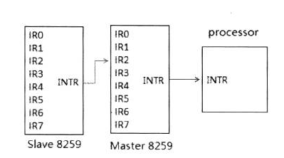
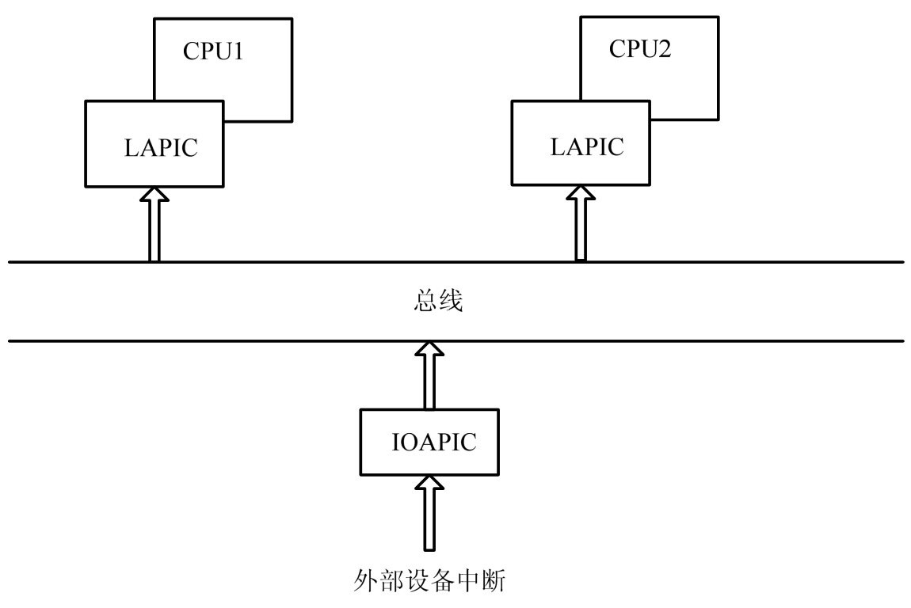
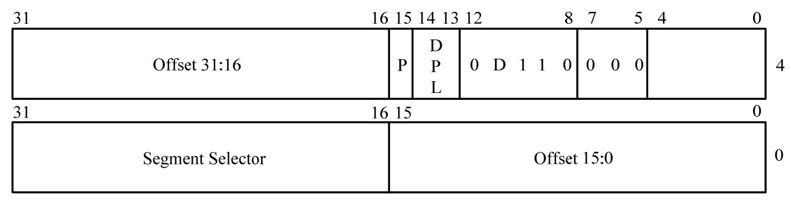
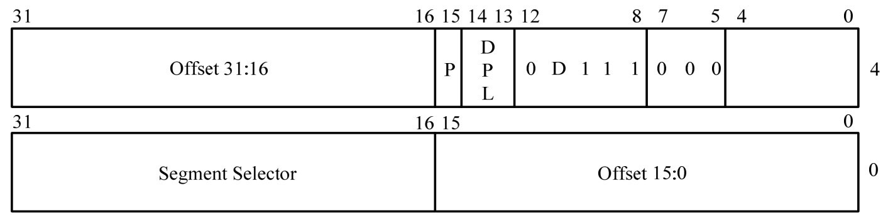
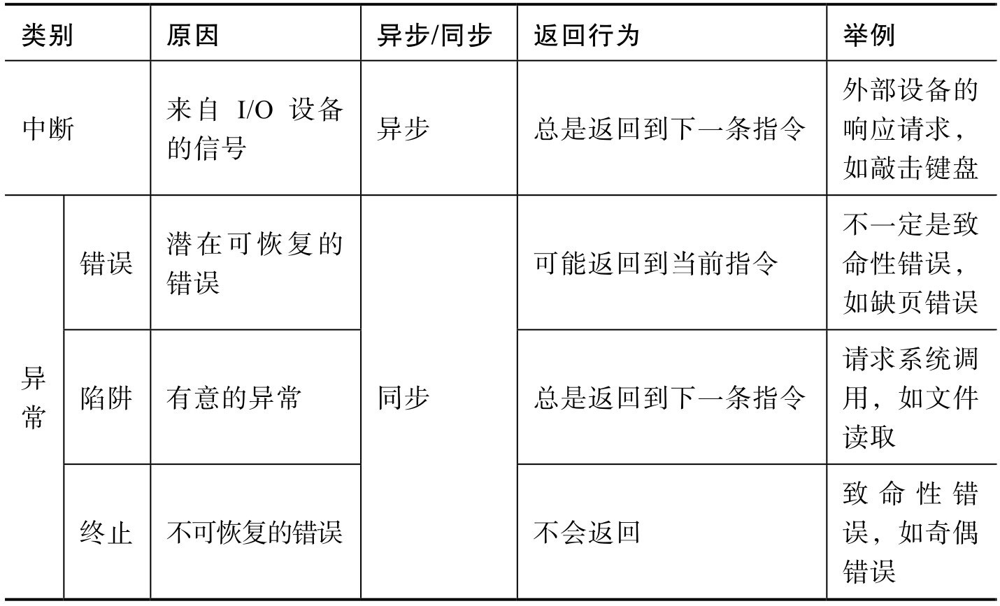

<!-- @import "[TOC]" {cmd="toc" depthFrom=1 depthTo=6 orderedList=false} -->

<!-- code_chunk_output -->

- [基本概念](#基本概念)
- [1. 中断架构](#1-中断架构)
  - [1.2. PIC](#12-pic)
  - [1.3. APIC](#13-apic)
  - [1.4. 处理器间中断](#14-处理器间中断)
  - [1.5. MSI](#15-msi)
  - [1.6. 中断的重要概念](#16-中断的重要概念)
    - [1.6.1. 中断的分类](#161-中断的分类)
    - [1.6.2. 中断触发方式](#162-中断触发方式)
    - [1.6.3. IRQ、GSI 和中断向量](#163-irq-gsi-和中断向量)
    - [1.6.4. 中断的优先级](#164-中断的优先级)
    - [1.6.5. 中断的屏蔽](#165-中断的屏蔽)
    - [1.6.6. IDT 表](#166-idt-表)
    - [1.6.7. 中断门](#167-中断门)
- [2. 异常架构](#2-异常架构)
- [3. 中断与异常总结](#3-中断与异常总结)
- [4. 操作系统对中断/异常的处理流程](#4-操作系统对中断异常的处理流程)

<!-- /code_chunk_output -->

# 基本概念

# 1. 中断架构

从某种意义上, **现代计算机架构**是由**大量的中断事件驱动(！！！**)的. **中断**提供给**外部硬件设备**一种"**打断 CPU 当前执行任务, 并响应自身服务！！！**"的手段.

**中断**从设备发送到 CPU 需要由被称为"**中断控制器！！！** "的部件**转发**(MSI 除外). 中断控制器发展至今, 经历了**PIC**(Programmable Interrupt Controller, 可编程中断控制器)和**APIC**(Advanced Programmable Interrupt Controller, 高级可编程中断控制器)两个阶段.

## 1.2. PIC



最老的中断控制芯片就是**8259A**了也就是 PIC 芯片.

PIC 由**2 个 i8259**进行"级联"一个为 master 一个为 slave**每个 i8259**有**8 个 PIN**(**salve**的**INT 输出线**连接到**master**的**IRQ2 引脚**上,所以实际可用的**IRQ 数目为 15**).

**IRQ = 起始 base 号 + pin**. **接收到设备中断**后通过**拉高引脚**通知**CPU**CPU 收到中断发送**两个 INT ACK**到**INTA**第二个 INTA 期间 PIC 向 CPU 提交中断 vector.

8259A 芯片就是常说的 PIC, 它具有`IR0~IR7`共**8 个中断管脚**连接外部设备. 中断管脚具有**优先级**, 其中**IR0 优先级最高**, **IR7 最低**.

PIC 有三个重要的寄存器.

⓵ **IRR**(Interrupt Request Register, 中断请求控制器): 共 8 位, 对应**IR0\~IR7 这 8 个中断管脚**. 某位**置 1**代表**收到对应管脚的中断**但还**未提交到 CPU**.

⓶ **ISR**(Interrupt Service Register, 中断服务寄存器): 共 8 位. 某位置 1 代表**对应管脚的中断**已经**提交到了 CPU 处理**, 但**CPU 还未处理完**.

⓷ **IMR**(Interrupt Mask Register, 中断屏蔽寄存器): 共 8 位. 某位置 1 对应的中断**管脚被屏蔽**.

除此之外, PIC 还有一个**EOI 位**, 当**CPU 处理完一个中断**时, 通过**写该位**告知 PIC**中断处理完成**.

PIC 向 CPU 递交中断的流程如下.

⓵ **一个**或**多个 IR**管脚上产生**电平信号**, 若**对应的中断没有被屏蔽**, **IRR**中相应的位被**置 1(！！！所有收到的 IR 管脚的电平信号！！！**).

⓶ **PIC 拉高 INT**管脚**通知 CPU**中断发生.

⓷ **CPU**通过**INTA 管脚**应答**PIC**, 表示**中断请求收到**.

⓸ **PIC**收到**INTA 应答**后, 将**IRR**中具有**最高优先级(！！！因为有多个！！！**)的位清 0, 并设置**ISR 中对应的位**.

⓹ CPU 通过**INTA 管脚**第二次发出**脉冲**, **PIC 收到后**计算**最高优先级中断的 vector**, 并将它提交到**数据线**上.

⓺ 等待 CPU 写 EOI. 收到 EOI 后, ISR 中最高优先级的位被清 0. 若 PIC 处于 AEOI 模式, 当第二个 INTA 脉冲收到后, ISR 中最高优先级的位自动清 0.

PIC 处理中断流程

1) 当 IRQ 线上发生中断请求时, 8259 内核的**IRR 对应的位将置位**, 这个中断请求可以是**edge 或 level 模式触发**

2) 如果这个中断请求是允许的(**没被屏蔽, 通过 IMR**), 则提交到处理器 INTR pin 上

3) 处理器将以**interrupt acknowledge cycle(中断响应周期**)作为**回复(走的是系统总线！！！**), 这个**cycle**被**host bridge(CPU 到 PCI 桥**)传送到**PCH(Platform Controller Hub**)上

4) PCH 将这个 cycle**转化**为 8259 可以响应的两个 interrupt acknowledge pulse(**中断响应脉冲**)出现在 master 和 slave 8259**控制器**的**INTA\#pin**上.

5) 在接收到**第 1 个 INTA\#脉冲**后, 8259 进行**优先级的仲裁**, 最高的中断请求得到响应, **ISR 寄存器相应的位置位**, **IRR 寄存器**对应的位被**清 0(控制器接收了请求后就将相应的 IRR\<中断请求状态>寄存器位清 0**).

6) 如果如果**slave 8259**赢了**中断仲裁**(即**slave 上有优先级别高的中断请求**)则 master 8259 通过一条**3 位宽的内部线**向 slave 8259 传送一个 slave identification code(**从片标识码**)slave 8259 会对这个 code 进行检查决定是否在**第 2 个 INTA#脉冲**时**回复一个 interrupt vector**当这个 code 与 slave 8259 内的**identification code**相符时(初始化时设置)slave 8259 必须回复一个**interrupt vector**通过**data bus**给 processor.

7) 如果**master 8259**赢了中断仲裁则 master 8259 在**第 2 个 INTA\#脉冲**时会回复一个**interrupt vector**通过**data bus(数据总线**)给 processor.

8) **中断完成**后在**AEOI(Automatic End of Interrupt)模式**里 8259 在**第 2 个 INTA\#结束后**自动**清 ISR 相应的位**. 否则必须发送一个**EOI 命令给 8259**.

## 1.3. APIC

PIC 可以在 UP(单处理器)平台上工作, 但无法用于 MP(多处理器)平台. 因此, APIC 应运而生.

APIC 由位于**CPU 中**的**本地高级可编程中断控制器**(Local Advanced Programmable Interrupt Controller, **LAPIC**)和位于**主板南桥**中**I/O 高级可编程中断控制器**(`I/O Advanced Programmable Interrupt Controller`, **IOAPIC**)两部分构成.



LAPIC 每 CPU 一个; IO APIC 可以一个系统里面有多个但是 KVM 中只实现了一个可以根据自己的需要进行添加. 设备发送中断发送到 IO APIC; IO APIC 中存在着一个 PRT 表每个 PRT 的表项成为 RTERTE 是每个引脚一个 IOAPIC 引脚收到中断消息后根据 RTE 得到目标 LAPIC 并格式化出一个中断消息发送给 LAPIC 同时置位 remote irr(level).

中断控制器目前主要有**APIC**这种架构下**设备控制器**通过**某种触发方式**通知**IO APIC****IO APIC**根据**自身维护**的**重定向表 pci irq routing table**格式化出**一条中断消息**把中断消息发送给**local APIC**local APIC 局部于 CPU 即**每个 CPU 一个**local APIC 具备**传统中断控制器的相关功能**以及各个寄存器中断请求寄存器 IRR 中断屏蔽寄存器 IMR 中断服务寄存器 ISR 等针对这些关键部件的虚拟化是中断虚拟化的重点.

LAPIC 接受到中断消息后提取其中的 VECTOR 并设置 IRR 后进行中断的选取取得优先级最高的中断后清除 IRR 设置 ISR 提交 CPU 进行中断处理 CPU 处理完中断后写 LAPIC 的 EOI 通知 IOAPIC 清除 remote irr(level 且 deassert).


IOAPIC 通常有**24 个不具有！！！优先级的管脚**, 用于**连接外部设备**, LAPIC 位与 CPU 内部.

当**IRQ 线(连接的外设线！！！**)上有中断请求发生时**I/O APIC**在**redirection table(通常是操作系统设定的**)里找到管脚对应的**RTE(redirection table entry 或者说 redirection table 寄存器**)读取**RTE**内的**中断消息内容**, 通过其各个字段, 格式化出一条包含该中断所有信息的中断消息, 再经由**system bus(！！！老式的通过专门的 APIC 总线**)发送给 LAPIC.

System Bus 是广播总线, 特定 CPU 上的 Local APIC 先判断是否属于中断消息的目标对象.

在**LAPIC**内部, 也有**IRR**、**ISR**和**EOI 寄存器**, 其中 IRR、ISR 为 256 位, EOI 为 32 位, 注意: **没有了 IMR 寄存器**, 通过**mask 位实现**.

APIC 系统中, 中断的发起大致流程如下.

⓵ **IOAPIC**收到**某个管脚**产生的**中断信号**

⓶ 查找 PRT 表获得该管脚对应的 RTE. 根据 RTE 各字段格式化出一条中断消息, 并确定发送给哪个(或多个)CPU 的 LAPIC.

⓷ 通过系统总线或 APIC 总线发送中断消息

⓸ LAPIC 收到中断消息, 判断是否由自己接收

⓹ 如确定接收, 将 IRR 中对应的位置 1. 同时确定此时是否将该中断交给 CPU 处理.

⓺ 如确定提交中断给 CPU 处理, 从 IRR 获取最高优先级的中断, 将 ISR 中对应的位置 1, 并提交中断. 对于 edge 触发, IRR 中对应位此时清 0.

⓻ CPU 处理完中断, 软件写 EOI 寄存器告知中断处理完成, 对于 level 触发的中断, IRR 中对应位清 0. LAPIC 可提交下一个中断.

## 1.4. 处理器间中断

在 MP(多处理器)平台上, 多个 CPU 要协同工作, 处理器间中断(Inter\-processor Interrupt, IPI)提供 CPU 之间相互通信的手段. CPU 可以通过 LAPIC 的 ICR(Interrupt Command Register, 中断命令寄存器)向指定的一个/多个 CPU 发送中断.

操作系统通常使用 IPI 来完成诸如**进程转移**、**中断平衡**和**TLB 刷新**等工作.

## 1.5. MSI

后来又出来的 MSI 中断设备直接如果支持 MSI 的话直接构造出 MSI 消息 MSI 有个字段**Address**标明了**中断目标地址**然后**设备直接发送中断给 LAPIC**提交 CPU 这种方式下直接**绕过了 IOAPIC**效率更高.

## 1.6. 中断的重要概念

### 1.6.1. 中断的分类

中断可以从很多方面分类, 从中断源角度看, 可以分为如下几类.

⓵ 外部中断: 指连接在 IOAPIC 上设备产生的中断、LAPIC 上连接的设备或 LAPIC 内部中断源产生的中断以及处理器间中断.

⓶ 可屏蔽中断: 指可以通过某种方式(例如 CLI 指令、TPR)进行屏蔽的中断. 与之对应的是不可屏蔽中断.

⓷ 软件产生中断: 只通过 INT n 指令产生的中断.

这样分类不是绝对, 例如外部中断通常是可屏蔽中断, 但也可能属于不可屏蔽中断. 通常, 根据外部中断的触发方式, 又把它们分为如下几类.

⓵ edge 触发中断: 指中断边沿方式触发(例如上升沿). ISA 设备、时钟设备多使用这种触发方式.

⓶ level 触发中断: 指中断以电平方式触发, 在中断程序应答设备前, 该电平一直有效. PCI 设备使用这种触发方式.

### 1.6.2. 中断触发方式

中断触发方式分为电平触发和边沿触发 level 触发和 edge 触发;

- **level 触发**就是一直将**引脚**保持在**高电平**(电平为**1**)直到**中断完成**现在**PCI/PCIE 设备**都是**level 触发**;
- **edge**就是通过**一个电平边缘跳变**来触发的中断, 电平**从 0 到 1**或者**从 1 到 0**原来的**ISA 设备**都是**edge 触发**在**kvm**中通过发送**level = 0**和**level = 1**的两个中断来**模拟一个 edge 中断**.

**isa 设备**大多数采用**边沿触发****pci 设备**采用**电平触发**.

### 1.6.3. IRQ、GSI 和中断向量

在**现代操作系统**中, 有几个概念和 vector 常联系在一起使用, 简单介绍下.

⓵ **IRQ**: PIC 时代的产物, 由于 ISA 设备通常是连接到**固定 PIC 管脚**, 所以说一个设备的 IRQ 实际是指它连接的 PIC 管脚号.

**IRQ 暗示着中断优先级**, 例如 IRQ0 比 IRQ3 有着更高的优先级. .

进入到 APIC 时代后, 仍**习惯**用**IRQ**来表示**一个设备的中断号**, 但对于**16 以下的 IRQ**, 它们可能**不再与 IOAPIC 的管脚对应！！！**例如 PIT 此时接的是 2 号管脚.

Pin 是管脚号通常它表示**IOAPIC 的管脚**(前面说了 PIC 时代我们用 IRQ). Pin 的最大值受**IOAPIC 管脚数限制**目前取值范围是`[0,23]`.

⓶ **GSI**(Global System Interrupt): **ACPI 引入的概念**, 它为系统中**每个中断源**指定了一个**唯一的中断号**.

IRQ 和 GSI 在 APIC 系统中常被混用, 实际上对于**15 以上的 IRQ**, 它**和 GSI 相等**.

注: ACPI Spec 规定**PIC 的 IRQ 号**必须对应到`GSI 0 -GSI 15`上. kvm 默认支持最大 1024 个 GSI.

如果 GSI base 为 0 每个管脚的 GSI=GSI base + pin**15 以上的 GSI 号和 IRQ 值相等**但是`[0~15]`是**按照 ACPI 规范！！！映射**的其实试试 GSI 2 映射到了 IRQ 0 上了在 KVM 中引脚号就是 IRQ 号.

这里, GSI 和 IRQ 可以看作等同的概念, 表示**某个设备的中断号**. 它们与**vector 的关系**由操作系统决定, 通常是在**设备驱动注册中断处理程序**时由**操作系统分配**.

⓷ 中断向量 vector 是针对逻辑 CPU 的概念用来表示中断在**IDT 表的索引号**每个 IRQ(或者 GSI)最后都会被定向到某个 Vecotor 上.

对于**PIC**上的中断中断向量 vector = 32(start vector) + IRQ 号. 在 IOAPIC 上的中断被分配的中断向量则是由**操作系统分配**.

中断和异常会打断顺序执行的程序流, 转而进入一条完全不同的执行路径.

### 1.6.4. 中断的优先级

在使用**PIC**的系统中, PIC 的**管脚**决定了**中断的优先级**, 连接**IR0**的设备具有**最高优先级**, 连接**IR7**的设备**优先级最低**.

在**APIC**系统中, **IOAPIC 的管脚**不再具备优先级, 设备的优先级由它所连接管脚对应**RTE 中的 vector 字段**决定. **vector**是 x86 架构用于索引**IDT 表的下标**, 范围从 0\~255, **值越大优先级越高**. 其中, **32\~255**可供外部中断使用.

### 1.6.5. 中断的屏蔽

无论是在 PIC 收到中断信号后, 还是**LAPIC！！！收到中断消息**后, 并不一定都是马上交给 CPU 处理的, 这还要取决于**CPU 当前是否屏蔽中断**(不可屏蔽中断除外).

当**CPU 屏蔽中断**时, **中断会被依附(pending)在 PIC/LAPIC 的 IRR 寄存器(！！！**)中, **一旦 CPU 开启中断**, 会在第一时间响应 PIC/LAPIC 所依附(pending)的中断. CPU 可通过下面几种方式屏蔽/开启中断.

⓵ **CLI/STI 指令**: 这是操作系统最常用的屏蔽/开启中断的方法. CLI 指令将本 CPU 的 EFLAGS 寄存器的 IF 位清 0, 阻止接收中断; STI 指令将 IF 位置 1, 允许接收中断. 这两条指令支队当前 CPU 起作用.

⓶ **TPR(Task Priority Register)寄存器**: 根据该寄存器值代表的优先级, 部分屏蔽外部中断.

⓷ **PIC/IOAPIC**的中断屏蔽位:

- PIC 可以通过 IMR 寄存器屏蔽对应管脚.

- IOAPIC 可通过**RTE 中的 mask 位**屏蔽对应管脚. 该方法不会讲中断依附(pengding)到 IRR, 而是直接忽略, 对于 edge 触发中断可能导致中断丢失.

### 1.6.6. IDT 表

IDT 实际上就是个大数组, 用于存放各种"门"(中断门、陷阱门、任务门). 这些门是中断和异常通往各自处理函数的入口. 当一个中断或异常发生, CPU 用它们对应的 vector 号索引 IDT 表以获得对应的"门".

**IDT 表**的**基地址**存放在**IDTR 寄存器**中该寄存器与 GDTR 类似由一个**基地址**字段(Base)和**长度**字段(Limit)构成.

### 1.6.7. 中断门

"门"是入口, 中断门就是中断的入口. 中断门实际上是一种段描述符, 称为**系统描述符**, 由**段描述符的 S 位控制**. 格式如图.



其中, 段选择符、偏移量字段可以看作是一个逻辑地址, 通过索引 GDT 将该逻辑地址转换为中断处理函数入口的线性地址. 这里特别要注意的是 DPL 字段, 很多操作系统会将门的**DPL 设为 0**. 那么有一个问题: 程序在**用户态**时(CPL=3)发生**中断**, 岂不是不能过一个 DPL=0 的中断门? 实际上, 中断门和陷阱门的**DPL**只在使用**INT n 指令**引起中断/异常时才**检查**, **硬件产生的中断/异常不检查**. P 字段代表中断门是否有效, 清 0 无效.

通常**操作系统的中断都用了中断门**, 没有使用陷阱门. 中断门和陷阱门唯一区别在于程序通过中断门跳转后, EFLAGS 寄存器的 IF 位自动清 0, 中断关闭. 而陷阱门没有.

# 2. 异常架构

和中断相比, 异常最大的不同在于它是在程序的执行过程中同步发生的. 例如下面

```c
void main()
{
    int a = 10;
    a = a/0;
}
```

程序运行到 a=a/0 一句必然引起一个**除 0 异常**, 但不能预料该程序在执行时是否会发生中断. 异常根据产生的原因和严重程度可分为如下三类.

⓵ 错误(Fault): 由某种错误情况引起, 一般可以被错误处理程序纠正. 错误发生时, 处理器将控制权转移给对应的处理程序, 修正后重新**回到产生异常的指令继续执行**. 例如, 常见的缺页错误就属于此类.

⓶ 陷阱(Trap): 指在执行了一条特殊指令后引起的异常, 处理器允许**忽略异常**继续往下执行. 在异常处理程序里不必修正错误, 回到发生异常指令的下一条指令继续执行. 陷阱是**有意的异常**陷阱最重要的用途是在**用户程序**和**内核**之间提供一个像过程一样的接口(即**系统调用**). 例如, Linux 32 用于实现**系统调用**的`INT 80`指令就属于此类.

⓷ 终止(Abort): 指严重的不可恢复的错误, 将导致程序终止的异常. 例如 MCA(Machine Check Architecture).

和中断门一样, 陷阱门存放在 IDT 表中. 异常发生后, CPU 用该异常的 vector 号索引对应的陷阱门. **x86 架构**将**vector 0\~19**预留给**各个异常**.

陷阱门格式如图.



# 3. 中断与异常总结



# 4. 操作系统对中断/异常的处理流程

各个操作系统对于中断/异常处理实现不同, 但基本流程如下.

一个中断/异常发生, 打断正在执行的任务.

(1) CPU 通过 vector 索引 IDT 表得到对应的"门", 并获得其处理函数的入口地址.

(2) 程序跳到处理函数执行, 由于处理函数存放在 CPL=0 的代码段, 程序可能会发生权限提升. 处理函数通常执行以下步骤.

⓵ 保存被中断任务的上下文, 并开始执行处理函数.

⓶ 如果是中断, 处理完成后需要写 EOI 寄存器(伪中断不需要)应答, 异常不需要.

⓷ 恢复被打断的任务的上下文, 准备返回

(3) 从中断/异常的处理函数返回, 恢复被打断的任务, 使其继续执行.

目前, 新的中断方式: MSI(Message Signalled Interrupt)已经被广泛应用, 这里先不介绍.


