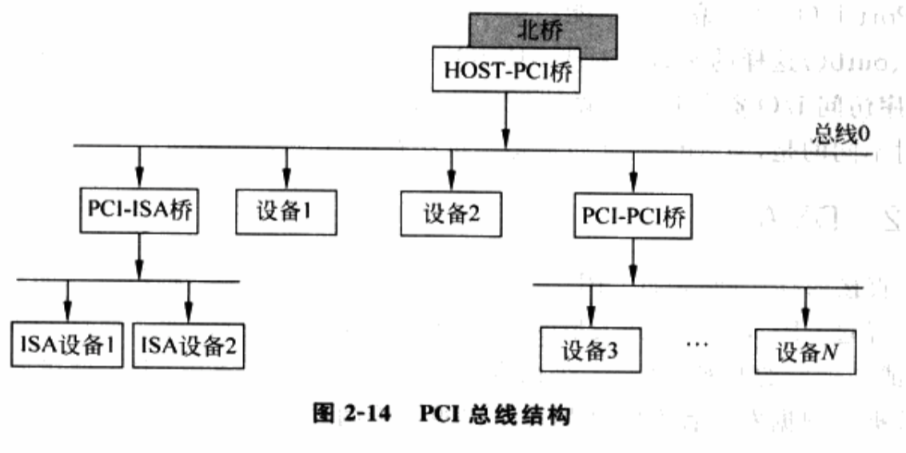

<!-- @import "[TOC]" {cmd="toc" depthFrom=1 depthTo=6 orderedList=false} -->

<!-- code_chunk_output -->

- [x86 的 I/O 架构](#x86-的-io-架构)
- [DMA](#dma)
- [PCI 设备](#pci-设备)
  - [PCI 总线架构](#pci-总线架构)
  - [设备标识符](#设备标识符)
  - [PCI 配置空间](#pci-配置空间)
    - [PCI 配置空间的访问](#pci-配置空间的访问)
  - [PCI 设备枚举过程](#pci-设备枚举过程)
- [PCI Express](#pci-express)
  - [PCI Express 架构](#pci-express-架构)
  - [PCIe 的优点](#pcie-的优点)

<!-- /code_chunk_output -->

将计算机的任务进行一个粗略的分类, 其实只有两种: **CPU 运算**和**I/O 操作**.

# x86 的 I/O 架构

I/O 是 CPU 访问外部设备的方法.

**设备**通常通过**寄存器**和**设备 RAM**将自身的功能展现给 CPU, **CPU 读写这些寄存器和 RAM(！！！**)即可完成对设备的访问和操作. 通过**访问方式的不同**, 可以将 x86 架构的 I/O 分为如下两类.

⓵ **Port I/O(端口 I/O**): 即通过 **I/O 端口**访问**设备寄存器**.

**x86** 有 **65536(`2^16`)个 8 位的 I/O 端口(！！！**), 编号为 0x0000 \~ 0xFFFF. 如果将**端口号**看作**访问设备端口的地址**, 那么这 65536 个端口就构成了**64KB 的地址空间**, 称为 **I/O 端口地址空间**. 与前面说的线性地址空间和物理地址空间不同, I/O 端口地址空间是**独立的**, 也就说它并**不是线性地址空间或物理地址空间的一部分(！！！**). 使用**IN/OUT 指令访问端口**时, **CPU**通过一个**特殊的管脚**标识这是一次**I/O 端口访问**, 于是芯片组知道地址线上的地址是 I/O 端口号并进行相应操作. 此外, **2 个**或**4 个连续的 8 位 I/O 端口**, 可以组成**16 位**或**32 位的 I/O 端口**.

⓶ MMIO(Memory Map I/O, 内存映射 I/O): 即通过**内存访问**的形式访问**设备寄存器或设备 RAM**.

x86 架构下, **MMIO**和**Port I/O**最大不同在于**MMIO 要占用 CPU 的物理地址空间**. 它把设备的寄存器或设备 RAM 映射到物理地址空间某段地址, 使用**MOV 这样的访存指令**访问此段地址**即可访问到映射的设备**. 很多 CPU 架构都没有 `Port I/O`, 采用统一的 MMIO 方式. 由此可见, MMIO 是一种更先进的 I/O 访问方式.

对于**Port I/O**, 由于**编译器不能产生 IN/OUT 指令(！！！**), **操作系统**通常会把**汇编指令**封装成类似**inb()、outb()这样的函数**.

对于**MMIO**. 由于**整个物理地址空间**都会被映射到**线性地址空间**, 程序访问**I/O 资源**时也要做**线性地址到物理地址的转换(！！！**). 与普通物理地址到线性地址的映射不同, **MMIO 地址**通常是**不可缓存的(un\-cacheable！！！**).

# DMA

**DMA(直接内存访问**)是将**CPU 从 I/O 操作中解放出来(！！！**)的一种技术. 如果**设备向内存复制数据**都**经过 CPU**, 则会**消耗大量的 CPU 时间(大量中断负载**), **不利于系统性能**. **中断过程**中, CPU 对其他任务来讲**无法使用**, 不利于系统性能的提高.

通过 DMA**CPU**只负责**初始化这个传输动作**而**传输动作本身**由 **DMA 控制器**(后文简称为 DMAC)来实行和完成. 在实现 DMA 传输时由 **DMAC 直接控制总线**在**DMA 传输前****CPU** 要把**总线控制权**交给 **DMAC**结束 DMA 传输后**DMAC**立即把**总线控制权交回给 CPU**.

一个完整的 DMA 传输过程的基本流程如下.

1) **DMA 请求**: **CPU**对**DMAC**进行**初始化**并向**I/O 端口**发出**操作命令** **I/O 端口**提出**DMA 请求**.

2) **DMA 响应**: **DMAC**对 DMA 请求进行**优先级判别**和**屏蔽判别**然后向**总线裁决逻辑**提出**总线请求**. **CPU**执行完**当前总线周期**后**释放总线控制权**. 此时**总线裁决逻辑**发出**总线应答**表示 DMA 已被响应并通过**DMAC**通知**I/O 端口**开始**DMA 传输**.

3) **DMA 传输**: DMAC 获得**总线控制权**后 CPU 即可**挂起**或**只执行内部操作**由**DMAC**发出**读/写命令**直接控制**RAM 与 I/O 端口**进行**DMA 传输**.

4) **DMA 结束**: 当完成规定的**成批数据传送**后**DMAC 释放总线控制权**并向 **I/O 端口**发出**结束信号**. 当 I/O 端口接收到**结束信号**后停止 I/O 设备的工作并向 CPU 提出**中断请求**使 **CPU** 执行一段**检查本次 DMA 传输操作正确性**判断的代码并从不介入的状态退出.

由此可见 DMA**无须 CPU 直接控制传输**也**没有**中断处理方式那样**保留现场**和**恢复现场**的过程通过**硬件(DMAC**)为 **RAM** 与 **I/O 设备**开辟了一条直接传送数据的通路极大地提高了 CPU 效率. 需要注意的是 DMA 操作访问的**必须是连续的物理内存**. DMA 传输的过程如图 1-15 所示.

图 1-15 DMA 传输示意图:

通过**DMA**, **驱动程序(！！！**)可以**事先(或在需要的时候！！！**)设定一个**内存地址！！！**, **设备**就可以**绕开 CPU 直接向内存中复制(或读取)数据(！！！**).

根据**发起者不同**, DMA 可以被分为两种.

⓵ 同步 DMA: 是指**DMA 操作由软件发起**. 一般流程是**设备驱动**在**设定**好需要被 DMA 访问的**内存地址**后, **写某个寄存器**来**通知设备发起 DMA**. 此时, **设备**会**直接从该内存地址读取内容并操作**. 典型例子就是**声卡**, 当**播放一段音频时**, **驱动**将该**音频存放的地址**通知**声卡**, **设备**从内存**直接读取数据**并播放, 完成后以一个**中断**通知驱动操作完成.

⓶ 异步 DMA: 是指 DMA 操作由**设备发起**. 一般流程是**设备**将**数据直接复制**到一个**事先设定好的内存地址**, 再通过一个**中断**通知驱动程序. 典型例子是**网卡收包**, 当网卡接收到数据包后, 会直接**复制**到驱动程序设定的内存地址去, 并以中断形式通知网络包的到来.

设备的**DMA 操作**都是使用**物理地址访问内存！！！**, **不经过线性地址到物理地址的转换！！！**. 但**IOMMU**出现后, 这个情况就被改变了, 后面说明.

从**驱动的角度**看, 它要提供一片**内存区域供设备访问**, **DMA**要求这段内存区域在 **物理上是连续！！！** 的.

**现代设备**支持一种称为"**分散 \- 聚合(Scatter \- gather**)"DMA 的机制, 允许驱动向设备提供**不连续的物理内存**. 实际上, **驱动**是将**一组(！！！**)以"**起始地址 \- 长度**"为属性的**内存描述符**提供给设备, **每个描述符**描述了一块**连续的物理内存**, 但**连续两个描述符**描述的**内存不需要连续**的. 从**宏观上**看, 通过这组内存描述符可以向设备提供一片不连续的内存区域; 但从微观角度看, **DMA 操作访问**的仍然是**连续的物理内存**.

# PCI 设备

在 PCI 总线之前, 各种平台都拥有自己特定的总线, 例如 x86 的 ISA 总线、Power PC 的 VME 总线. PCI 出现后, 由于速度快, 具有动态配置功能和独立于 CPU 架构等特点, 迅速被接收, 成为一种通用的总线架构.

## PCI 总线架构

PCI 总线是一种典型的树结构. 把北桥中 HOST\-PCI 桥看作根, 总线中其它 PCI\-PCI 桥、PCI\-ISA 桥(ISA 总线转 PCI 总线桥)等桥设备和直接接 PCI 总线的设备看作节点, 整个 PCI 架构可概括成图 2\-14 所示.

通过桥, **PCI 总线**可以很容易被**扩展**, 并且**与其它总线互相挂接**, 构成**整个系统的总线网络**. 与**HOST\-PCI 相连的总线被称为总线 0！！！**, **其它层次总线的编号！！！**, 是在**BIOS(或操作系统)枚举设备时确定！！！**的.

## 设备标识符

设备标识符可以看作是设备在 PCI 总线上的地址, 格式如图 2\-15.

其中,

- 8 位的 Bus 字段代表设备所在的总线号, 故系统中最多有 256 条总线.
- Device 字段表示设备号, 代表在 Bus 所表示总线上的某个设备.
- Function 字段表示功能号, 标识具体设备上的某个功能单元. "功能单元"可以理解为逻辑设备.

举一个简单的例子, **一块 PCI 卡**, 它上面有**两个独立的设备**, 这两个设备共享了一些电子线路, 那么这**两个设备**就是**这块 PCI 卡**的**两个功能单元**. 但从软件角度看, 它们和两个独立接入 PCI 总线的设备无异. 如同 Function 字段长度描述的, 一个独立的 PCI 设备上最多能有 8 个功能单元. **Device**和**Function**两个字段一般**合起来使用**, 表示**一条总线**上最多有**256 个设备**. 通常, 用设备标识符三个字段的缩写 BDF 来代表它.

当**程序**通过**BDF**访问**某个设**备, 先通过**Bus 字段**选定**特定的总线**, 再根据**Device 字段**选定**特定的设备**, 最后通过**Function 字段**就可以选定**特定的功能单元(逻辑设备**)了.

## PCI 配置空间

对于程序员来说, 不需要了解 PCI 设备电路实现细节, 只需要了解操作它的接口. PCI 配置空间就是这样一个接口, 其结构如图.

**PCI 设备规范**规定, 设备的**配置空间**最多**256 个字节**, 其中**前 64 个字节**的格式和用途是统一的, 如图. 各字段的具体含义参见"PCI Local Bus Specification Revision 3.0"的第 6 章, 这里只关心对程序员最重要的 Base Address Registers 和 Interrupt Pin、Interrupt Line.

(1) Base Address Registers: **基地址寄存器**, 也就是常说的**PCI Bar！！！**.

它报告**设备寄存器！！！**或**设备 RAM！！！**在**I/O 端口地址空间！！！**(或**物理地址空间！！！**中)的地址. 地址是由**软件(BIOS 或操作系统)动态配置！！！**的, 这就一改**ISA 设备通过跳线进行配置！！！** 的不灵活的特点.

通常**枚举 PCI 设备的软件(BIOS 或操作系统！！！**)会在获得平台**所有 PCI 设备**后, 根据**设备数量**, 依照**固定的算法！！！**为**每个设备的 PCI Bar**分配**I/O 端口(或物理地址**).

**设备的电子线路(非软件！！！**)负责将**这些端口(或地址**)映射到**自身的寄存器(设备 RAM**)上, 这样, CPU 就可以通过端口号(Port I/O 方式)、物理地址(MMIO)方式访问到设备了.

使用哪种方式访问, 由**PCI Bar**的**最后一位**表示.

- 当该位为**1**时, 表示是**I/O 端口**;
- 该位为**0**时, 表示是**MMIO 端口**.

某些架构没有 Port I/O, 只有 MMIO.

根据**访问目标性质**不同, PCI Bar 又可以划分为如下**两种类型**.

⓵ **可预取(Prefetchable**)类型: 主要是**设备 RAM**. 由于 RAM 具有在每次读操作后内容不自动改变的性质, 所以可以使用**预读机制**. 例如, 程序在读第 N 个字节的内容时, 总线可能已经读出了第 N+1 个字节的内容. 当预读出的内容不需要时, 只要简单的抛弃就行, 不会有什么影响.

⓶ 不可预取类型(Un\-Prefetchable): 主要指设备寄存器. 寄存器和 RAM 有不同的性质, 有些寄存器本身就是设备的 FIFO 队列的接口. 很可能当一次读操作完成后, 寄存器的值就改变了. 如果使用预读机制, 例如程序本身只读了寄存器的第一个字节, 而总线却连续读了 4 个字节, 那么后面 3 个字节的内容可能就会改变, 下次程序真正访问时得到的就是错误的值. 对于 PCI Bar 是否为可预取类型, 可以根据该 PCI Bar 的第 3 个位判断, 1 为可预取, 否则不可预取.

(2) **Interrupt Pin**: **中断针脚**.

PCI**中断线**的标准设计是 4 条: **INTA、INTB、INTC 和 INTD**, 分别对应值 0\~3. 该寄存器的**值**表示**设备连接的是哪个中断针脚**.

(3) **Interrupt Line**: 设备的**中断线**.

该寄存器只起一个**保存作用**, **BIOS**和**操作系统**可以自由使用它. BIOS 通常用它来保存设备**所连**的**PIC/IOAPIC**的**管脚号**.

### PCI 配置空间的访问

x86 架构把**I/O 端口地址空间**中的**0xCF8\~0xCFF 段**预留给了**PCI 总线**, 用于**访问设备的配置空间！！！**. 其中,

- **前 32 位**的寄存器为"**地址寄存器！！！**",
- **后 32 位**为"**值寄存器！！！**".

**软件！！！** 通过把**设备的 BDF！！！** 和**要访问的配置空间的字节偏移！！！** 写入"**地址寄存器！！！**"中, 就可以通过"**值寄存器！！！**"读写该配置空间了.

## PCI 设备枚举过程

**PCI 设备的枚举和资源分配(即配置 PCI 配置空间**)通常是由**BIOS！！！** 完成的, 并提供**特殊的 PCI 设备枚举接口！！！** 供**保护模式**下的**操作系统**使用, 这些**接口**称为**PCIBIOS**. 由于某些平台, 例如嵌入式, 是**没有 BIOS**的, 并且操作系统厂商对 BIOS 的可靠性也不信任, 某些**操作系统！！！**也实现了自己的**PCI 设备枚举接口**. 无论是 BIOS, 还是操作系统, 其枚举设备过程遵循一般规律.

从前面的 PCI 总线概要图, **PCI 设备**和**总线**一起构成了**树结构**, 其中**PCI\-PCI 桥**(或 PCI\-ISA 等其它桥, 这里只关心 PCI\-PCI 桥)是**子树的根节点**, 设备枚举过程就是要在内存中建立一棵和实际总线情况相符合的设备树. 枚举过程中**最关键的步骤！！！**就是**发现 PCI\-PCI 桥！！！**, 这个可以通过**PCI 配置空间**的**Header Type 字段**判断, 该字段为 1 表示为**桥设备**.

**PCI\-PCI 桥！！！** 主要有三个属性.

- **Primary Bus**: 表示该桥**所属的根总线**.
- **Secondary Bus**: 表示以该桥为根节点的子总线.
- Subordinate Bus: 表示该桥为根的子树中, 最大的总线号.

利用图 2\-17 说明三者关系

如图, 对于"PCI\-PCI 桥 1", 其 Primary Bus 是总线 0, Secondary Bus 是总线 1, 而以它为根的总线中最大的总线号是 2, 所以其 Subordinate Bus 为总线 2.

设备枚举从根节点 HOST\-PCI 桥开始, 首先探测**总线 0**上的各个设备. 当探测到**第一个桥设备(！！！**)时, 为其分配 Primary Bus 号和 Secondary Bus 号, 其中**Secondary Bus 号为 1**(即当前系统中最大总线号加 1), Subordinate Bus 暂定为和 Secondary Bus 相同, 当在子树中发现新总线后会动态调整该值. 接着以该桥为根节点, 继续探测其下属总线, 其过程和前面相同, 发现第一个桥设备后则以其为根继续往下探测.

当 PCI\-PCI 桥收到写入 0xCF8 中的 BDF 后, 会将 Bus 字段与自身的 Secondary Bus 相比, 相符则在下属总线上搜寻设备; 如不相符, 但 Bus 值落在 Subordinate Bus 范围内, 则把该地址传递给下属总线中各桥.

通过这种方式, BIOS 或操作系统能枚举出总线上所有设备并为之分配资源, 一旦 PCI 配置空间设定好, 软件就能直接通过 PCI Bar 访问设备了.

# PCI Express

PCI Express 设计目标是代替 PCI、PCI\-X 和 AGP 等总线标准.

## PCI Express 架构

PCIe 抛弃了**PCI**采用的**多个设备共享的并行的总线结构**, 转而使用了**与网络协议**类似的**点对点的串行通信机制**.

**多个 PCIe 设备(Endpoint**)通过**交换器(Switch**)互相连接. 与 PCI 总线中的桥设备类似, 通过 Switch(交换器), 可以搭建一个树形的 PCIe 的拓扑结构.

标准 PCIe 拓扑如图 2\-18. **树的根节点**是**Root Complex**, 用来连接**处理器**、**内存系统**和**IO 系统**, 作用类似于**PCI 总线树**中的**Host\-PCI 桥**.

## PCIe 的优点

PCIe 比 PCI 总线拥有**更高的带宽**. **串行通信机制**可以让物理链路工作在很高的频率. **点对点的通信方式**使得**链路两端的设备！！！** 可以**独占通信带宽**, 并且**多个链路**可以**并发传输数据**.

PCIe 在与 PCI 总线两个**硬件基础完全不同**, 构建了与 PCI 总线完全兼容的软件接口. PCIe 定义了基于**数据包**的**分层通信协议**, 包括**物理层(Physical Layer**)、**数据链路层(Data Link Layer**)和**事物层(Transaction Layer**). 在**事物层协议**中, PCIe 定义了**内存读写**、**IO 读写**、**配置空间读写**和**消息事务**. 通过这些事务的定义, PCIe 可实现**所有 PCI 总线事务**.

**PCIe**将**PCI 总线**的**配置空间！！！**从**256 字节**扩展到了**4KB 字节**, 解决了 PCI 配置空间过小的问题, 可容纳更多的设备功能配置. PCIe 还增加了一种**新的 MMIO 方法**来**访问扩充过的配置空间**. 为保持兼容性, **4KB 字节配置空间**的**前 256 字**节仍然可以使用原来的方式访问.

PCIe 除了保留了 PCI 总线的优点外, 还增加了诸如**QoS 服务**(服务质量, Quality of Service)、**高级错误报告机制**(AER)等新特性. **软件**可以通过 PCIe 提供的**软件接口**来配置和使用这些新的功能.

此外, PCIe 标准具有良好的扩充性. **PCI\-SIG！！！**的**SRIO\-V 标准！！！**在**PCIe 基础**上做了扩展, 支持该标准的设备可以**动态地生成新的逻辑设备！！！**. **DMA 重映射**可以利用 PCI Express**内存读写事务数据包**中所包含的**设备标识符**和**地址信息**, 为**每个逻辑设备**提供**独立的地址转换**.