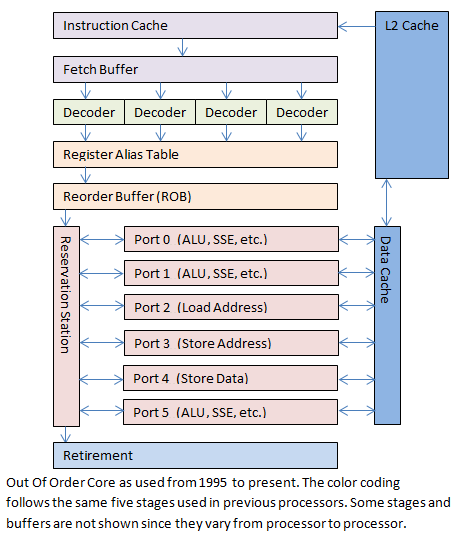

<!-- @import "[TOC]" {cmd="toc" depthFrom=1 depthTo=6 orderedList=false} -->

<!-- code_chunk_output -->

- [1 什么是 isa](#1-什么是-isa)
- [2 CPU 架构](#2-cpu-架构)
- [参考](#参考)

<!-- /code_chunk_output -->

# 1 什么是 isa

isa, instruction set architecture. 中文就是指令集合架构. 在计算机里面什么是 isa 呢?就是 xx 定义的一个**指令集**这里的 xx 可以指任何东西. 比如你只会做加法你就定义一个叫假发 isa(不是假发是桂)这个指令集只做加法这也是一个 isa. 任何一个 isa 对于另外一个 isa 都没有根本意义上的"先进"isa 之间的对比是非常复杂的. 你只会做加法我只会做乘法你说我们谁先进?我见得比较多的是争吵 x86 isa 比 arm isa 先进的我往往一脸懵逼好像他们比我懂我是不是不应该插一腿进去...

**x86 isa**现在是**Intel**和**AMD**共同拥有也就是说如果你要开新的 x86cpu 公司你必须向这两者付版权费用而且必须两者都同意你才能获得完整的 isa 如果你只获得一部分不完整的 isa 那就和完全没拿到 isa 一样. **ISA**在 cpu 里面就像是**字典**用厨房的比喻就是菜谱菜谱定义了你这个厨房会做什么菜这个菜做出来是什么样什么味道那么顾客在这家连锁店的任何一间都能叫到相同的菜吃到相同的味道.

ARM isa 当然是 ARM 公司所有的当时 ARM 公司是定菜单的并且给出试菜的人说你们每家店都要做出这个味才算 ARM. 而做店的则是不同的公司像 qualcomn 啦他们中间喜欢怎么做菜是他们的自由但是必须会那几道菜必须做出这个味.

各家的菜单都一样所以顾客不需要知道是谁做的菜只要是这个菜单做出来肯定一个味. 因为操作系统根本不需要知道你 cpu 是怎么设计的操作系统只要知道我需要运行这些指令你知道怎么运行就行了每个不同牌子的 cpu 只要你运行出来结果都一样就行了. 如果 isa 定义 1+1=9 那么这个是定义下来的所有人都这样错就没错. 如果 isa 定义了 1+1=9 你要纠正他我的 cpu 是 1+1=2 那么你做出来的 cpu 虽然数学上正确但是所有软件系统就突然不知道怎么办了. 你说这么愚蠢的错误 cpu 不可能犯是吧?自行百度一下苹果 75-37.5 bug(虽然不一定是 cpu 或者 isa 上的错误也许是软件上的)

然后又有人说 ISA 是铁定下来的 x86 的良好生态环境是因为他的 ISA 一直有 legacy 支持. legacy 直接翻译就是遗产. x86 的 legacy 支持的意思就是世界上第一个 x86cpu 支持的东西今年你发明的 x86 cpu 也支持以后的也要支持. 的确从某个角度上来说农企和 Intel 都非常努力的去支持很多已经没什么人的东西就是餐馆里菜谱里面有些菜基本上你都不会去试的. 你说你都不用了农企 Intel 还在那里浪费设计是吧?你不用不代表没人用啊 X 国很多军用的设备还是 Windows95 啊甚至还是服役中的 Windows3.1 啊银行的 atm 还有用 Windows98 的. 别问我为什么他们要那样如果他们肯花钱找些软件工程师重新写那些程序就可以用最新的东西很多没有注释现在没有人学的语言或者算法诡异的程序很多军事设备还在用啊. 原因大概是: 这种语言连学都没人学我自己都看不懂我看你怎么破解我的坦克系统！

但是实际上 x86 又不是完全 100%legacy 支持的至少 isa 上面没有这样定义农企和 Intel 也没有官方明文定义. x86 里面有一个指令叫 cpuid 系统/编译器运行它的时候它会给出一些数据就是告诉系统/编译器这个 cpu 支持什么东西这个 cpu 有些什么新东西之类的. 所以理论上可以设计一个 cpu 不支持那些非常少用的指令以降低 cpu 的设计复杂程度也更省电省事. (对不起你想吃的这个菜我们不卖了你找另外一家试试)

# 2 CPU 架构

如果你有编程经验你有没有想过你写的代码是怎么运行的?我当初就是由于这个原因而对 cpu 感兴趣然后不知不觉进了这一行. 我和知乎某 czh 用户(据说已成教)是某理工大学同学我的编程能力远不及他. 但是我是这样的一个人我看到轮子转我就想知道轮子是怎么转的我就想拆开马达拆开电线然后学物理学磁感线然后知道是什么让轮子转. 后来由于各种原因我有缘接触汇编 cpu 架构之后对比起编程我对 cpu 的运行原理非常兴趣我是兴趣使动的然后就花时间去研究了. 其实 UIUC 对于半导体 EE 那边的研究更多更有趣但是那边的教授的所有课让我对 computer architecture 的有浓厚兴趣. 我学习过程是这样的怎么写 c->c 怎么编译会汇编语言->汇编语言怎么在 cpu 里面运行->cpu 的组成->transistor 的原理->半导体的电子学应用->半导体的工业使用. 在学习半导体的时候对各种光学半导体也曾经非常感兴趣没有继续学下去的原因是设备太贵了里面的数学太难了(对说的就是数学很多方程都没有解答方法很多是以前的数学家通过直接观察式子然后试答案试出来的所以很多 differential equation 要单纯靠记忆我对背书非常非常不在行如果有哪一天有数学家发现了可以怎么算我学了算法也许还能去学一点)！后来就去研究 cpu 怎么才能提高效率.

回归正题代码是怎样运行的呢?给纯来看科普的读者的厨房比喻你要组织一个宴会然后你说了要弄些什么你就是软件. 然后有个人专门根据你你要求弄成一份菜单他就是编译器. 然后把这份菜单给厨房基本上就是: 读菜单拿食材(instruction fetch)切菜(decode)煮菜(execute)上盘出餐(load store and writeback). 然后前面就一读菜单后面就一直工作.

举个例子 c:

```cpp
int func(){

...

int a = 1;

a = a +3;

...

}
```

这段编译后大概就是

```
sub sp, 4 ; stack point increase 变量都在函数栈里留一个位置因为是 int 所以留 4

mov ebx, 1 ; ebx 用来存 1 就是你定义 a 了 a=1

; mov [sp], ebx ;有时候如果需要就把 ebx 是值存到刚刚预留的栈里

; mov ebx, [sp] ;需要用的时候再读出来不是必然会发生的但是这两步可能发生

add ebx, 3 ; ebx = ebx+3, 当然你可以用其他 register

...
```

你不需要读得懂因为我手打的分分钟错给你看. 然后这些东西就会跑到内存没错你运行软件的时候代码是先去到内存如果想了解他们怎么从硬盘跑到内存这是另外一个主题我这里先不讨论然后缓存又会把这些代码读取缓存就已经在 SoC 里面的 cpu 在从缓存里面读取别问为什么这么麻烦读这么多次都是为了省钱和稍微加快速度.

由于是举例子我就随便乱说个 decode. 这个是 Intel 公布的 manual 问我为什么不用本家农企是吧?因为我拿到农企那个不是对外公布的公布版我还要上网找.

Opcode Instruction Op/ En 64-bit Mode Compat/ Leg Mode D

05 id ADD EAX, imm32 I Valid Valid Add imm32 to EAX.

在 cacheline 里面看起来大概是这样的 0x05__02___00000003

里面的_代表其他位不详细讲的大概这个翻译成机械码就是 要做 05(ADD 加法)在 02(ebx 实际上我印象中 ebx 是 02 然而 eax 是 00 不是 01 这些编码乱七八糟的 Intel 决定的别问我)后面的 00000003 就是 32 为 imm32 就是 add, ebx 03

cpu 读了这条 cacheline 叫 instruction fetch 然后下一步就是把它 decode 解释成 add, ebx 03,再下一步就是把运行(execute 没错这么麻烦之后最后终于要算了)把算得的结果存到 ebx 上然后再看看需不需要存回去 cacheline 或者内存里面(load/store writeback). 这个就是 cpu 的基本运行原理.

CPU pipeline

有时候会听到 cpu 流水线如果按照上面的做法没一个指令都要通过这几部来预算那么只有一部分电子器件在用的时候其他部分都在发呆浪费电. 就像是厨房里面从取菜到上盘全部都一个人做肯定要累死那个人但是你炒菜的时候是不是想如果有人已经帮你切好菜我就一直炒菜好了这样我们厨房工作效率就高了 cpu 也是这样.



转自 A Journey Through the CPU Pipeline
让你们失望了这张图不是猫咪. 这是一个经典的 cpu 运行流水线. 换成厨房理论就是一个人专门去食材一个人专门切菜一个人专门炒菜一个人专门上盘一个人专门给客人下单上菜是不是现代化很多呢！然而这样不能满足我们 cpu 的工程师我们还有 branch prediction 什么叫 branch prediction 呢?程序黎里面最耗时间的一个就是 branch 就像 c 里面的 if 你得到答案之前不知道是继续往下走还是进去 if 里面的括号. 就像下单的小哥那些犹豫不决而改菜单的人最讨厌了. 于是 cpu 里面有了这个东西他是怎么用的呢. 下单的小哥也不是笨蛋顾客 a 来了 100 多次了有 80 次都改单把猪肉改成鸡肉那么他下单时候小哥就先说了改鸡肉如果顾客 a 觉得还是猪肉吧就再抄如果顾客 a 真的改单那么厨房以及开始做了而且有 80%的几率啊小哥还是挺聪明的吧. cpu 也大概是这样根据每个 loop 的地址(顾客)来训练出一个未卜先知的系统.

上图里面还有 OOO(out of order)x86 里面 real mode 可以用的 general register 只有 8 个 eaxebx 之类的 64 位之后增加了 8 个. 流水线工作如果

mov eax1;

add eax1;

sub eax2;

你们发现问题了没 eax 用了再用但是流水线做 add 的时候 eax 是 1sub 在等 add retire 之前是不能做的那么你就不得不等. 那么流水线的效率就体现不出来了. 因为这里有一个 write after write 的 dependency 就是同一个 register 你两个 pipeline stage 要用同一个 register 而且 x86 在传统模式只有 8 个 registereax,ebx 等等 64 位模式增加了一些. 所以这中情况是非常常见的. 为了解决这个问题就有了 out of order execute in order commit. 就是不按顺序来运行指令但是按顺序完成指令.

用厨房理论解释就是有这么一道菜(或者说两道菜)鸡要先煮了然后炸你煮熟鸡之前不能炸否则炸了再煮口感就不同了顾客肯定骂死你但是后面又有其他菜在等锅你是有的所以在煮鸡的时候你先做后面的菜然后鸡煮好了再炸. 出餐的时候你还是先出了这道鸡肉再出后的菜那样顾客就不会投诉出餐的顺序不按菜单了.

# 参考

https://zhuanlan.zhihu.com/p/20731557?utm_source=ZHShareTargetIDMore&utm_medium=social&utm_oi=50718148919296

A Journey Through the CPU Pipeline --Bryan Wagstaff: https://www.gamedev.net/articles/programming/general-and-gameplay-programming/a-journey-through-the-cpu-pipeline-r3115

http://www.intel.com/content/dam/www/public/us/en/documents/manuals/64-ia-32-architectures-software-developer-instruction-set-reference-manual-325383.pdf -- intel isa manual