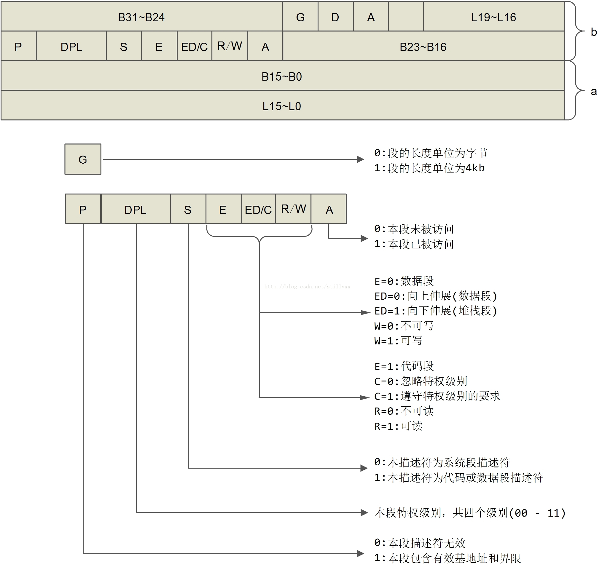
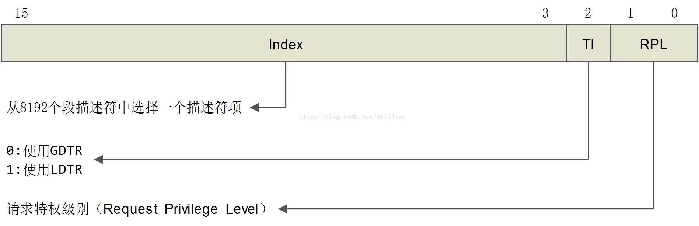

参考:
http://blog.csdn.net/stillvxx/article/details/40707437

我们说一个 CPU 是 16 位的或 32 位的或 64 位的指定是 CPU 中的 ALU 单元(算术逻辑单元)的宽度通常也就是**数据总线**的宽度. 那么地址总线呢?自然的从程序设计的角度我们希望其与数据总线的宽度一致这样一个地址也就是一个指针其与整数同宽在进行指针运算时直接拿整数运算指令就可了不需要专门的"指针运算指令".

在 8086 时代当时数据总线的宽度是 16 位的不出意外的话**地址总线也是 16 位的**也就是可以访问 64k 的内存空间. 但在当时 intel 的设计师预计到了内存需求的变化决定将内存空间扩大. 扩大到多少呢?决定扩大到 1M. 1M 的内存空间需要 20bit 来表示于是**地址总线扩展到 20 位**. 可是我们的 ALU 仍然是 16 位的也就是说可以直接拿来运算的指针的长度也是 16 位的超过 16 位就溢出了(我们可以想象下当时的整型是 16 位 20 位的数是无法表示和计算的)那怎么填补这个空白?方法有很多种比如增设 20 位的指令专用于地址运算与操作但那样又会造成 CPU 内部结构体的不均匀性. intel 设计师采用一种巧妙的办法即分段的方法.

8086 中设置四个段寄存器: CS/DS/SS/ES 分别表示代码段、数据段、堆栈段和其他段. **每个段都是 16 位的用作地址总线的高 16 位**. 每条访存指令中的"**内部地址**"都是 16 位的再将内部地址送到地址总线之前要与对应的段寄存器进行拼接形成 20 位的地址然后再送到地址总线上去寻址. 地址拼接的操作为: 送往地址总线上的地址 = 段基址 << 4 + 内部地址.

这种寻址方式给坏分子可乘之机. 首先**修改段寄存器内容的指令不是特权指令这样谁都可以更改段基址**; 其次**段基址一旦确定一个进程就能所以访问从此开始的 64k(2^16)内存**. 这样一来谁都可以访问内存空间中的任何一个内存单元这是很危险的. 8086 这种寻址方式缺乏对内存空间的保护为了区别于后来的"保护模式"就称为"实地址模式".

显然在"实地址模式"是无法构筑现代的操作系统的.

到了 386 时代数据总线和地址总线都扩展到 32 位了可以寻址 4GB 的内存空间了. 按照我们的想法 intel 该重新来过可以摒弃段式内存管理了. 但是为了兼容依然采用段式内存管理. 并且需要在段式内存管理的基础实现保护模式即对内存空间的保护. 为了对内存空间进行保护这样几项工作必须要做:

1、由段寄存器"确定"的基址不要透漏给用户即用户无从读取段基址

2、修改段基址的指令必须是特权指令

3、每个段上必须加权限控制权限不够不许对内存进行访问

有了这 3 个要求 286 时代的"根据段寄存器确定段基址"方法已经行不通了我们需要的不仅仅是基址还需要访问权限等额外的信息而且我们不想把具体的基址暴露给用户.

为了解决这些问题 intel 引入一个中间结构体段描述符. 并增设了两个寄存器: GDTR(global descriptor talbe register)指向全局段描述符数组(表); LDTR(localdescriptor table register)执行局部段描述符数组(表). 而 6 个段寄存器 CS/DS/SS/ES 包括后来的 FS/GS 其内容不在用作基址而是用作索引去段描述符数组中查找对应的段描述符.

段描述符占 8 个字节其定义以及其中各个标志位的定义如下:

通过段描述符我们能够得到如下信息:

1)段的**基址**由 B31-B24/B23-B16/B15-B0 构成一共**32 位****基址可以是 4GB 空间中任意地址**;

2)段的**长度**由 L19-L16/L15-L0 构成一共 20 位. 如果 G 位为 0 表示段的长度单位为字节则段的最大长度是 1M 如果**G 位为 1**表示段的长度单位为**4kb**则段的最大长度为 1M*4K=**4G**. 假定我们把段的基地址设置为 0 而将段的长度设置为 4G 这样便构成了一个从 0 地址开始覆盖整个 4G 空间的段. 访存指令中给出的"逻辑地址"就是放到地址总线上的"物理地址"intel 称其为 flat 地址即平面地址 linux 内核采用的就是平面地址.

3)段的类型代码段还是数据段可读还是可写

**描述符表**存储在由操作系统维护着的特殊数据结构中并且由处理器的内存管理硬件来引用. 这些特殊结构应该保存在仅由操作系统软件访问的**受保护的内存区域**中以防止应用程序修改其中的地址转换信息. 同时为了避免每次访问内存时都通过段寄存器去查表、去读和解码一个段描述符每次更改段寄存器的内容时 CPU 将段寄存器指向的段描述符中的段基址、长度以及访问控制信息等加载到**CPU**中的"**影子结构**"中缓存起来. 后续对该段的访问控制都通过"影子结构体"来进行.

但是如果可以修改 GDTR 和 LDTR 的内容呢?我们不就可以随便指定 GDTR 到我们自己伪造的段描述数组从而掌控程序吗?为了解决这个问题 intel 将访问这两个寄存器的专门指令设为**特权指令**(**LGDT/LLDT,SGDT/SLDT**)这些指令只有当 CPU 处于系统状态(即在操作系统内核中)才能使用**用户空间**无法访问寄存器的内容.

这样一来工作 1-2 就完成了.

16 位段寄存器中的内容称之为段选择符除了高 13 位用作段描述符数组的索引外(因此理论上段描述符数组最多可以 8192 个元素)低 3 位有其他的用途如下所示:

由于有两个描述符数组所以 TI(Table Index)位用来确定从哪个数组中索引.

在前面的段描述符结构中我们看到了**特权级别字段**(DPL 段描述符中)为什么还需要在这里设置一个特权字段(RPL 段选择符中)呢?

intel 的 CPU 有四种特权级别 0 级最高 3 级最低. **每条指令都有其适用级别**如前述的 LGDT 指令要求 0 级特权通常用户的应用程序都是 3 级. linux 中对 CPU 特权进行了简化只区分用户级别和系统级别分别对应 3 级和 0 级这是后话. 一般**应用程序的当前级别**由其代码段的**局部段描述符**(即段寄存器 CS 索引 LDTR 指向的局部描述符项)**中的 dpl**(descriptor privilege level)决定当然**每个段描述符的 dpl 都是在 0 级状态下由内核设定的**. **而全局段描述符中的 dpl 有所不同它表示所需的级别**. 段选择符中的 rpl 也表示请求级别. 这样当我们需要改变某个段寄存器(比如数据段 DS)中的内容(段选择符)来访问一款新段空间时 CPU 要做权限检查:

1)当前程序有权访问新的段吗?比较当前程序的当前级别与新段描述符中的 dpl

2)新的段选择符有权访索引新的段吗?比较新的段选择符中的 rpl 与新段描述符的 dpl.

当然具体的权限检查比这要复杂设计到段描述符中 C 位的取值详情情况请参考其他资料.

至此工作 1-3 都完成了保护模式已经建立了我们来看看当访存指令给出"逻辑地址"时 CPU 如何将其转换为"物理地址"送往地址总线:

1)根据指令性质确定该使用哪个段寄存器如跳转指令则目标地址在代码段 CS 取数据的指令目标地址在数据段;

2)根据段寄存器的内容找到对应的段描述符. 其实这一步不用找前面介绍过了段寄存器对应的段描述符已经在 CPU 的"影子结构"中了.

3)从段描述符中获得基址

4)将指令中的"逻辑地址"与段的长度比较确定是否越界

5)根据指令的性质和段描述符中的访问权限确定是否越权

6)将指令中的"逻辑地址"作为位移与基地址相加得到实际的"物理地址"