<!-- @import "[TOC]" {cmd="toc" depthFrom=1 depthTo=6 orderedList=false} -->

<!-- code_chunk_output -->

- [1. 计算机的内部构成](#1-计算机的内部构成)
  - [1.1. 数据总线](#11-数据总线)
  - [1.2. 地址总线](#12-地址总线)
- [2. 寄存器和算术逻辑部件](#2-寄存器和算术逻辑部件)
- [3. 内存储器](#3-内存储器)
- [4. 指令和指令集](#4-指令和指令集)
- [5. 古老的 Intel 8086 处理器](#5-古老的-intel-8086-处理器)
  - [5.1. 8086 的通用寄存器](#51-8086-的通用寄存器)
  - [5.2. 程序的重定位难题](#52-程序的重定位难题)
  - [5.3. 内存分段机制](#53-内存分段机制)
  - [5.4. 8086 的内存分段机制](#54-8086-的内存分段机制)
- [6. 习题](#6-习题)

<!-- /code_chunk_output -->

借助一款早已淘汰的处理器 Intel 8086 了解处理器、内存和指令三者的关系.

# 1. 计算机的内部构成

一台计算机的内部架构可以拆分为三部分: CPU、内存以及输入输出设备.

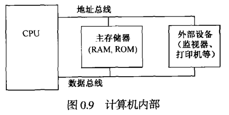

总线在内部将数据从一个地方运输到另一个地方. 计算机中存在三类总线: 地址总线、数据总线和控制总线. CPU 所识别的**每一个设备(存储器和输入输出设备)都要被分配一个地址, 分配的地址必须是唯一的(地址总线)**.

**CPU 将二进制形式的地址放在地址总线上, 然后译码线路会找到对应的设备. 之后, CPU 使用数据总线从该设备取得数据, 或者向它传送数据. 控制总线用于向设备提供读信号或写信号, 以此表明 CPU 是请求获得数据或发送数据. 地址总线和数据总线决定了处理能力**.

## 1.1. 数据总线

数据总线是双向的. 计算机的处理性能和数据总线位数有关. 下图很重要！！！

## 1.2. 地址总线

地址总线决定了所能通信的地址的多少. 地址总线是单向的, CPU 使用地址总线来发出地址.

# 2. 寄存器和算术逻辑部件

如图, 处理器在四周有大量的引脚, 可以接受从外面来的电信号, 或向外发出电信号. 每个引脚都有相应的作用, 在往电路板上安装的时候, 不能接错. 图 2-2 中的处理器, 故意缺一个角.

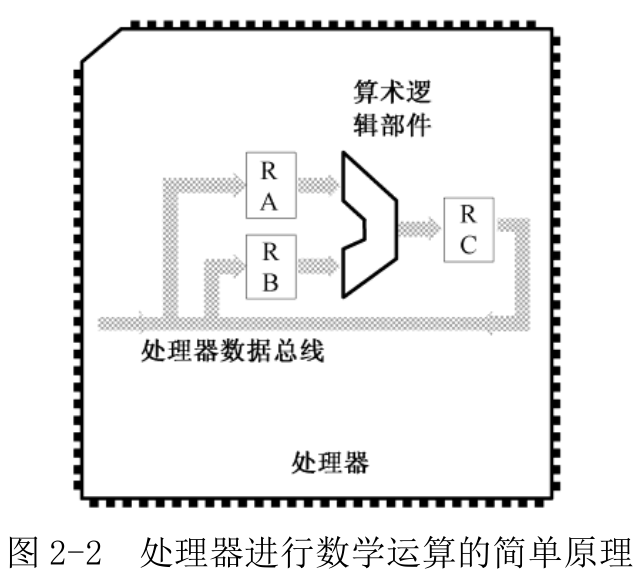

处理器的引脚很多, 其中一部分用于将参与计算的数字送到处理器内部. 有些引脚是复用的, 假如现在要进行加法运算, 那么要重复使用这些引脚, 来依次将被加数和加数送入.

一旦被加数通过引脚送入处理器, 代表这个二进制数字的一组电信号就会出现在与引脚相连的内部线路上. 这是一排**高低电平**的组合, 代表着二进制数中的一个. 这时必须用一个称为寄存器(register)的电路锁住. 因为相同的引脚和线路马上还要用于输入加数. 正是这个原因, 这些内部线路称为处理器内部总线.

同样, 加数也要锁进另一个寄存器中. 如图 2-2, 寄存器 RA 和 RB 将分别锁存参与运算的被加数和加数. 此后, RA 和 RB 中的内容不再受外部数据线的影响.

寄存器是双向器件, 可以在一端接受输入并加以锁存, 同时, 它也会在另一端产生一模一样的输出. 与寄存器 RA 和 RB 相连的, 是算术逻辑单元, 或算术逻辑部件(Architectic Logic Unit, ALU), 也就是图 2-2 中的桶形部分. 它是专门负责运算的电路, 可以计算加法、减法或乘法, 也可做**逻辑运算**.

做一次加法, 一旦寄存器 RA 和 RB 锁存了参与运算的两个数, 算术逻辑部件就会输出相加的结果, 这个结果可以临时用另一个寄存器 RC 锁存, 稍后再通过处理器数据总线送到处理器外面, 或者再次送入 RA 和 RB.

处理器内部有一个控制器(图中没有), 在指令的执行过程中, 它负责给各个部件发送控制信号, 使得**各个部件在某个正确时间点上执行某个动作**. 同时, 它还负责决定在某个时间点上哪个部件有权使用总线, 以免冲突.

早期处理器, 它寄存器只能保存 4 位、8 位或 16 位. 现在的处理器, 寄存器一般都是 32 位、64 位甚至更多.

# 3. 内存储器

内存第一个字节的地址是 0000H, 其他依次类推. 内存容量是 65536 字节, 所以最后一个字节的地址是 FFFFH.

为访问内存, 处理器需要给出**一个地址**. 访问包含读和写, 为此, 需要指明是**读访问还是写访问**. 如果是写访问, 则还要给出待写入的数据.

8 位处理器包含 8 位的寄存器和算术逻辑部件, 16 位处理器拥有 16 位寄存器和算术逻辑部件, 64 位的是 64 的. 内存的最小组成单元是字节, 但是, 经过设计, 它能够按字节、字、双字和四字进行访问. 换句话说, 仅通过单次访问就能处理 8 位、16 位、32 位或 64 位的二进制数. 注意, **单次访问**, 不是一个一个取出每个字节, 然后加以组合.

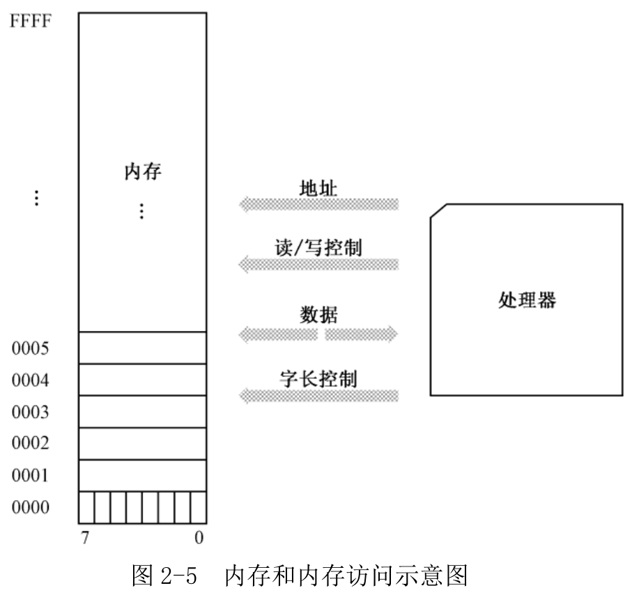

如上图, 处理器**发出字长控制信号**, 以指示本次访问的字长是 8、16、32 还是 64. 如果字长是 8, 而且给出的地址是 0002H, 那么本次访问只会影响到内存的一字节; 如果字长是 16, 给出的地址依然是 0002H, 那么实际访问的将是地址 0002H 处的一个字, 低 8 位在 0002H 中, 高 8 位在 0003H 中.

# 4. 指令和指令集

**指令由操作码和操作数构成**.

指令长度不定, 短的仅有一个字节, 长的可能达到 15 字节.

如图 2-6, 从内存地址 0000H 开始, 连续存放一些指令. 同时, 假定执行这些指令的是一个 16 位处理器, 拥有两个 16 位的寄存器 RA 和 RB.

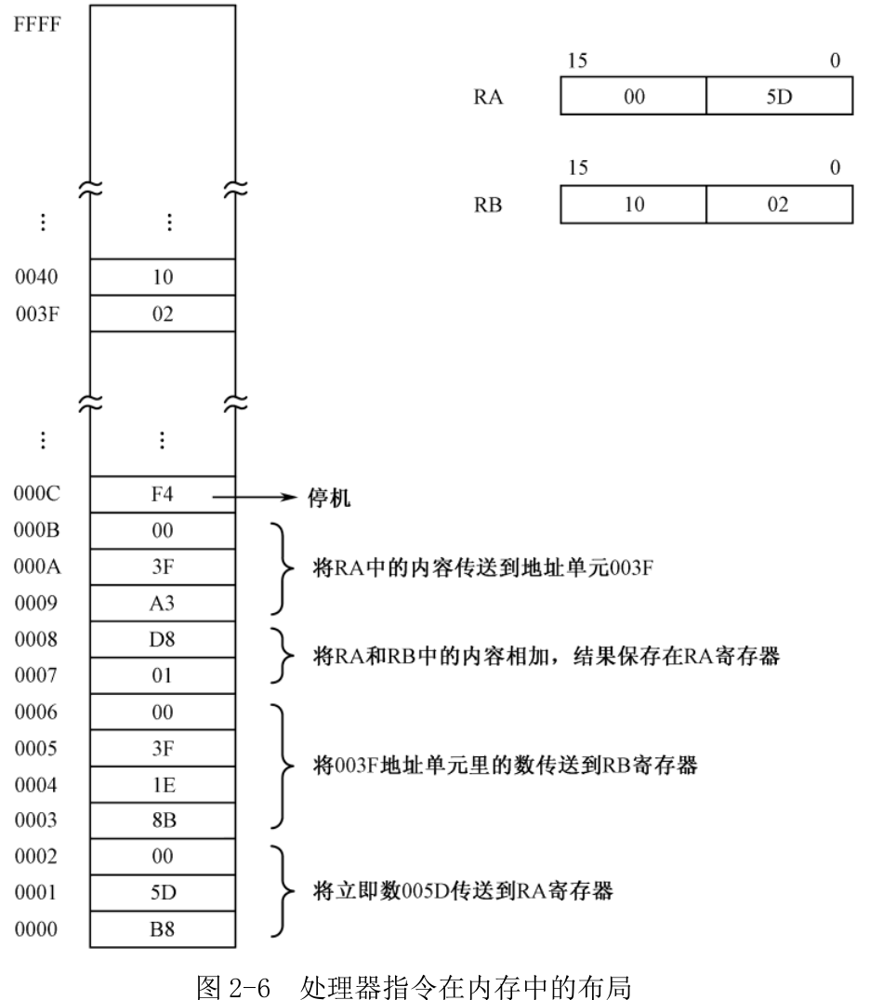

第一条指令的操作码是 B8, 该指令是一条传送指令, 第一个操作数是寄存器, 第二个操作数是直接包含在指令中的, 紧跟在操作码之后, 可以立即从指令中取得, 所以叫立即数(Immediate Operand). 同时, **操作码还直接指出该寄存器是 RA**. RA 是 16 位寄存器, 这条指令按字进行操作. 所以, 当这条指令执行后, 该指令的操作数(立即数)005DH 就被传送到 RA 中.

既然**操作码**中隐含了这么多的信息, 那么, **处理器就可以"知道"每条指令的长度**. 这样, 当它执行第一条指令 B8 5D 00 的时候, 就已经知道, 这是一个 3 字节指令, 下一条指令位于 3 个字节之后, 即内存地址 0003H 处.

注意字数据在内存中的存放特点. 地址 0001H 和 0002H 里的内容分别是 5D 和 00, 如果每次读一个字节, 则从地址 0001H 里读出的是 5D, 从 0002H 里读出的是 00. 但如果以字的方式来访问地址 0001H, 读到的就会是 005DH. 这种差别, 跟处理器和内存之间的数据线连接方式有关. 对于 Intel 处理器来说, **如果访问内存中的一个字, 那么, 它规定高字节位于高地址部分, 低字节位于低地址部分, 这称为低端字节序(小端模式, Little Endian)**. 至于其他公司的处理器, 则可能情况正好相反, 称为高端字节序.

复杂指令, 1 个字节的**操作码**(操作码！！！)可能不够用. 所以, 第 2 条指令的操作码为 8B 1E, 它隐含的意思是, 这是一条传送指令, 第一个操作数是寄存器, 而且是 RB 寄存器, 第二个操作数是内存地址, 要传送到 RB 寄存器中的数存放在该地址中. 同时, 这是一个字操作指令, 应当从第二个操作数指定的地址中取出一个字.

**疑问**: 操作码 8B1E 在内存存放的顺序是 8B1E 还是 1E8B???

**解答**: 这个问题涉及到 CPU 怎么识别指令, CPU 通过 CS:IP 定位到指令所在位置, 然后会获取当前字节的数据, 然后, 根据指令规范, 判断该操作码是不是由多个字节组成, 如果是, 那么继续获取内存中更多字节的数据, 组成操作码, 然后操作码本身就包含完整的指令信息, 包含指明了有没有使用操作数, 以及操作数字节数. 如果有操作数的话, 继续获取操作数, CPU 会将操作码与操作数组成完整指令. 而大小端只是针对 CPU 往内存中存放数据或者解析内存中机器码时的方式.

比如, 机器码转指令, 内存中代码段有段数据, 从低地址到高地址分别是 88 16 32 7D(也就是机器码 8816327D). CS:IP 指向了 88 所在的地址, CPU 先获取第一个字节 88, 根据某个标志位或其他指令规范发现该指令的操作码由 2 位组成, 所以拿到了操作码 8816, 然后解析操作码, 该操作码是传送 dl 寄存器数据到一个 16 位逻辑地址, 该操作需要两个字节的数据表明目的逻辑地址(真正执行的时候必须加上 DS 寄存器), 所以获取两个字节的操作数 327D. 解析该机器码, 8816 是操作码, 327D 是操作数, CPU 是小端模式, 该操作符的实际意义是数值 0x7D32. NASM 汇编(Intel 风格)的代码是 mov [0x7d32],dl. 有些机器码, 比如 26C6061D0004(对应的汇编指令是 mov byte [es:0x1d],0x4, 其中 es 值是 0xb800), 这个其实就没有使用 DS 段寄存器, 因为这条指令的操作码指明了使用绝对地址.

比如, 指令转机器码, 指令 mov [0x7d32],dl, 作用是传送 dl 寄存器数据到 16 位的逻辑地址(执行时候需要使用 DS 寄存器), 操作码是 8816(操作码本身就说明了 dl 寄存器), 逻辑地址是 7d32, 将该数据存放到内存中, 由于小端模式, 先存 32, 再存 7d. 所以机器码是 8816327D.

该指令的操作数部分是 3F 00, 指定了一个内存地址 003FH. 它相当于高级语言里的指针, 当处理器执行这条指令时, 会再次用 003FH 作为地址去访问内存, **从那里取出一个字(1002H)**, 然后将它传送到寄存器 RB. 注意, "传送"这个词带有误导性. 其实, 传送的意思更像是"复制", 传送之后, 003FH 单元里的数据还保持原样.

如果这个数已经在指令中给出了, 不需要**再次访问内存(操作码以及操作数(两个合称指令)运行都是在内存中)**, 那这个数就是立即数, 比如第一条指令中的 005DH; 相反, 如果指令中给出的是地址, 真正的数还需要用这个地址访问内存才能得到, 那它就不能称为立即数, 比如第二条指令中的 003FH.

如果一开始内存地址 003FH 中存放的是 1002H, 那么, 当所有这些指令执行完后, 003FH 里就是最终的结果 105FH.

**指令和非指令的普通二进制数是一模一样的**, 在组成内存的电路中, 都是一些高低电平的组合. 因为处理器是自动按顺序取指令并加以执行的, **在指令中混杂了非指令的数据会导致处理器不能正常工作**. 为此, **指令和数据要分开存放**, 分别位于内存中的不同区域, 存放指令的区域叫代码区, 存放数据的区域叫数据区. 为了让处理器正确识别和执行指令, 技术人员必须精心安排, 并告诉处理器要执行的指令位于内存中的什么位置.

还是那句话, 并非每一个二进制数都代表着一条指令. 每种处理器在设计的时候, 也只能拥有有限的指令, 从几十条到几百条不等. 一个处理器能够识别的指令的集合, 称为该处理器的指令集.

# 5. 古老的 Intel 8086 处理器

8086 是 Intel 公司第一款 16 位处理器. 是整个 Intel 32 位架构处理器(IA-32)的开山鼻祖.

## 5.1. 8086 的通用寄存器

8086 处理器内部有 8 个 16 位的通用寄存器, 分别被命名为 AX、BX、CX、DX、SI、DI、BP、SP. "通用"即大部分都可以根据需要用于多种目的.

如图, 因为这 8 个寄存器都是 16 位的, 所以通常用于进行 16 位的操作. 比如寄存器之间互相传数据、算术逻辑运算; 寄存器和内存单元之间 16 位数据传送或算术逻辑运算.

如图, 前 4 个, 即 AX、BX、CX 和 DX, 又各自可以拆分成两个 8 位的寄存器来使用, 总共可以提供 8 个 8 位的寄存器 AH、AL、BH、BL、CH、CL、DH 和 DL. 这样, 寄存器和寄存器, 或者寄存器和内存单元之间进行 8 位的数据传送或者算术逻辑运算时就方便. 一个 16 位寄存器当成两个 8 位寄存器用, 互相数据不影响.

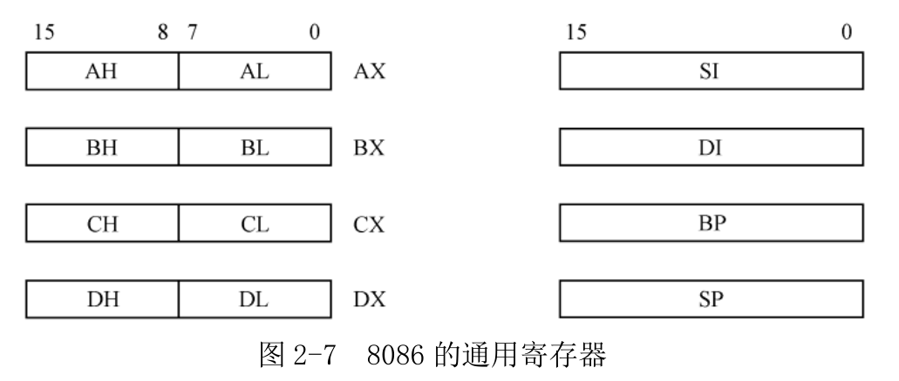

## 5.2. 程序的重定位难题

处理器是自动化的器件, 给出起始地址, 将从这个地址开始, 自动地取出每条指令并加以执行. 只要每条指令都正确无误, 它就能准确地知道下一条指令的地址. 这就意味着, 完成某个工作的所有指令, 必须集中在一起, 处于内存的某个位置, 形成一个段, 叫做**代码段**. 要是指令并没有一条挨着一条存放, 中间夹杂了其他非指令的数据, 处理器将因为不能识别而出错.

同理, 程序操作的大量的数据, 也应该集中起来, 形成一个段, 叫**数据段**.

假定 16 个数要相加, 都是 16 位二进制数, 分别是 0005H、00A0H、00FFH、.... 先在内存中定义一个数据段, 将这些数字写进去. 数据段可以起始于内存中的任何位置, 我们将它定在 0100H 处. 这样, 第一个要加的数位于地址 0100H, 第二个要加的数位于地址 0102H, 最后一个数的地址是 011EH.

定义数据段后, 我们就知道了每个数的内存地址. 然后, 我们定义代码段. 数据段和代码段是不需要连续的.

代码段从内存地址 0120H 处开始, 第一条指令是 A1 00 01(**指令是由操作码和操作数构成, 两部分！！**), 其功能是将内存单元 0100H
里的字传送到 AX 寄存器. 指令执行后, AX 的内容为 0005H.

第二条指令是 03 06 02 01, 功能是将 AX 中的内容和内存单元 0102H 里的字相加, 结果在 AX 中. 由于 AX 的内容为 0005H, 而内存地址 0102H 里的数是 00A0H, 这条指令执行后, AX 的内容为 00A5H.

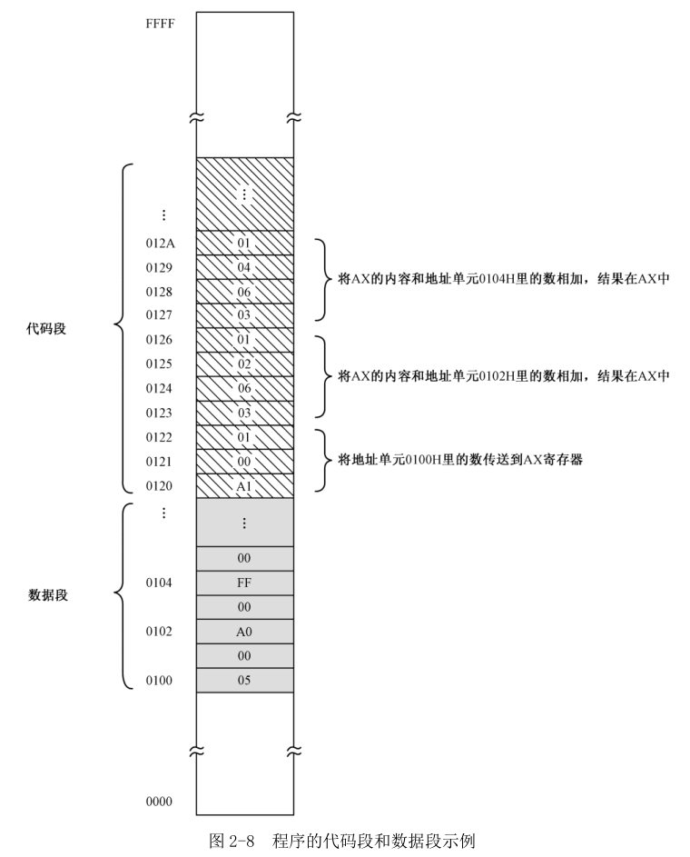

在内存中定义了数据段和代码段之后, 我们就可以命令处理器从内存地址 0120H 处开始执行. 当所有的指令执行完后, 就能在 AX 寄存器中得到最后的结果.

这里有一个难题.

例子中, 所有在执行时需要访问内存单元的指令, 使用的都是真实的内存地址. 比如 A1 00 01, 这条指令(操作码和操作数)的意思是从地址为 0100H 的内存单元里取出一个字, 并传送到寄存器 AX. 在这里, 0100H 是一个真实的内存地址, 又称物理地址.

整个程序(包括代码段和数据段)在内存中的位置, 是由我们自己定的. 我们把数据段定在 0100H, 把代码段定在 0120H.

问题是, 多数情况下, 整个程序(包括代码段和程序段)在内存中位置不能我们决定.

如图 2-9, 数据段从 1000H 开始, 代码段从 1020H 开始. 这时候, 指令 A1 00 01, 从地址 0100H 处取得字, 传到寄存器 AX, 实际数处于 1000H, 这就不是我们想要的结果.

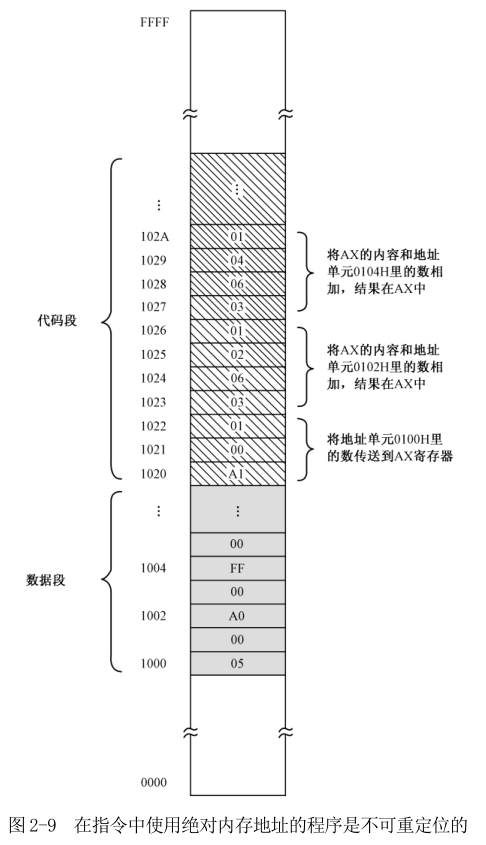

因为指令中使用了绝对内存地址(物理地址), 这样程序是无法重定位的. 有好几种解决办法, 在 8086 上, 这个问题特别容易解决, 处理器访问内存使用了分段机制.

## 5.3. 内存分段机制

如图 2-10, 图中分段起始于地址 A532H 的内存单元处, 这个起始地址就是段地址.

这个分段包含了 6 个存储单元. 在分段之前, 它们在整个内存空间里的物理地址分别是 A532H、A533H、A534H、A535H、A536H、A537H. 分段策略之后, 一个内存单元的地址实际上就可以用"段: 偏移"或者"段地址: 偏移地址"来表示, 这就是通常所说的逻辑地址.

图中, 段内第 1 个存储单元的地址为 A532H:0000H, 第 3 个存储单元的地址为 A532H:0002H, 而本段最后一个存储单元的地址则是 A532H:0005H.

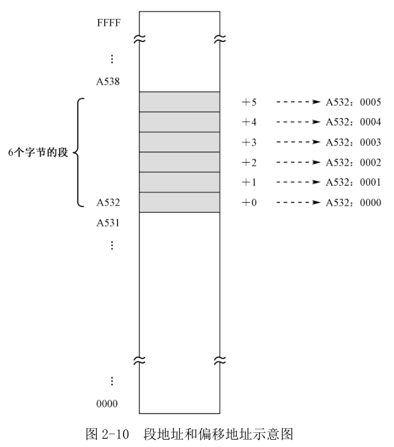

为了在硬件一级提供对"段地址: 偏移地址"内存访问模式的支持, 处理器至少要提供两个段寄存器, 分别是代码段(Code Segment, CS)寄存器和数据段(Data Segment, DS)寄存器.

对 CS 内容的改变将导致处理器从新的代码段开始执行. 同样, 在开始访问内存中的数据之前, 也必须首先设置好 DS 寄存器, 使之指向数据段.

除此之外, 最重要的是, 当处理器访问内存时, 它把指令中指定的内存地址看成是段内的偏移地址, 而不是物理地址. 这样, 一旦处理器遇到一条访问内存的指令, 它将把 DS 中的数据段起始地址和指令中提供的段内偏移相加, 来得到访问内存所需要的物理地址.

如图 2-11, 代码段的段地址是 1020H, 数据段的段地址为 1000H. 在代码段中有一条指令 A1 02 00, 它的功能是将地址 0002H 处的一个字传送到寄存器 AX. 在这里, 处理器将 0002H 看成是段内的偏移地址, 段地址在 DS 中, 应该在执行这条指令之前就已经用别的指令传送到 DS 中了.

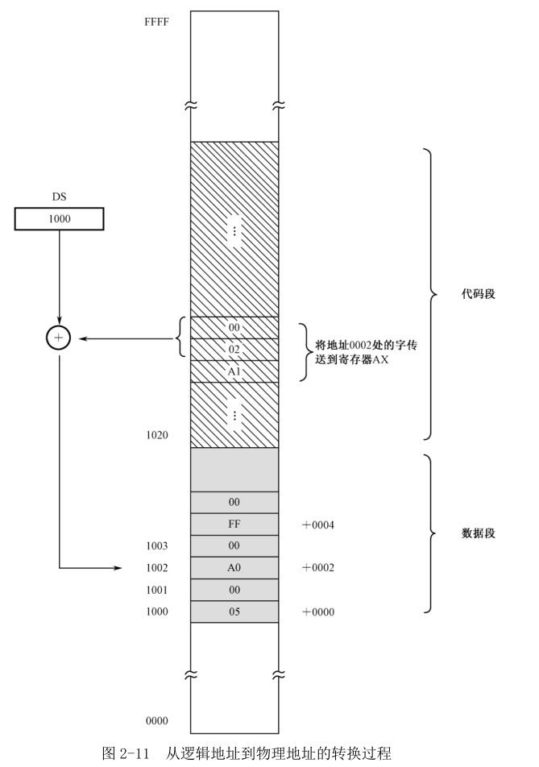

当执行指令 A1 02 00 时, 处理器将把 DS 中的内容和指令中指定的地址 0002H 相加, 得到 1002H. 这是一个物理地址, 处理器用它来访问内存, 就可以得到所需要的数 00A0H.

如果一下次执行这个程序时, 代码段和数据段在内存中的位置发生了变化, 只要把它们的段地址分别传送到 CS 和 DS, 它也能够正确执行.

## 5.4. 8086 的内存分段机制

由于 8086 自身的局限性, 它的做法还要复杂一些.

如图 2-12 , 8086 有 8 个 16 位的通用寄存器, 分别是 AX、BX、CX、DX、SI、DI、BP、SP. 其中, 前四个寄存器中的每一个, 都还可以当成两个 8 位的寄存器来使用, 分别是 AH、AL、BH、BL、CH、CL、DH、DL.

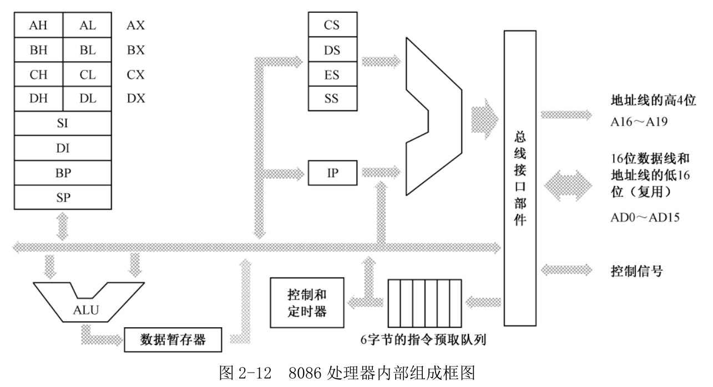

**在进行数据传送或者算术逻辑运算的时候, 使用算术逻辑部件(ALU)**. 比如, 将 AX 的内容和 CX 的内容相加, 结果仍在 AX 中, 那么, 在相加的结果返回到 AX 之前, 需要通过一个叫**数据暂存器的寄存器**中转.

处理器能够自动运行, 是控制器. 为了加快指令执行速度, 8086 内部有一个 6 字节的**指令预取队列**, 在处理器忙着执行那些不需要访问内存的指令时, **指令预取部件**可以趁机访问内存预取指令. 这时, 多达 6 个字节的指令流可以排队等待解码和执行.

**8086 内部有 4 个段寄存器**. 其中, **CS 是代码段寄存器**, **DS 是数据段寄存器**, **ES 是附加段(Extra Segment)寄存器**. 附加段的意思是, 它是额外赠送的礼物, 当需要在程序中同时使用**两个数据段**时, **DS 指向一个, ES 指向另一个**. 可以在指令中指定使用 DS 和 ES 中的哪一个, 如果没有指定, 则默认是使用 DS. **SS 是栈段寄存器**, 以后会讲到, 而且非常重要.

IP 是指令指针(Instruction Pointer)寄存器, 它只和 CS 一起使用, 而且**只有处理器才能直接改变它的内容**. 当一段代码开始执行时, CS 指向代码段的起始地址, IP 则指向段内偏移. 这样, 由 CS 和 IP 共同形成逻辑地址, 并由总线接口部件变换成物理地址来取得指令. 然后, 处理器会自动根据**当前指令(操作码和操作数)的长度**来改变 IP 的值, 使它指向下一条指令.

当然, **指令执行中需要访问内存单元, 处理器将使用 DS 的值和指令中的偏移地址来形成访问内存的物理地址**.

8086 的段寄存器和 IP 寄存器都是 16 位的, 如果按照原先的方式, 把段寄存器的内容和偏移地址直接相加来形成物理地址的话, 也只能得到 16 位的物理地址. 麻烦的是, **8086 却提供了 20 根地址线**. 换句话说, 它提供的是 20 位的物理地址.

8086 处理器在形成物理地址时, 先将**段寄存器**的内容左移 4 位(相当
于乘以十六进制的 10, 或者十进制的 16), 形成 20 位的段地址, 然后再同 16 位的偏移地址相加, 得到 20 位的物理地址. 比如, 对于逻辑地址 F000H:052DH, 处理器在形成物理地址时, 将段地址 F000H 左移 4 位, 变成 F0000H, 再加上偏移地址 052DH, 就形成了 20 位的物理地址 F052DH.

因为段寄存器是 16 位的, 在段不重叠的情况下, 最多可以将 1MB 的内存分成 65536(2\^16)个段, 段地址分别是 0000H、0001H、0002H、0003H, ......, 一直到 FFFFH. 在这种情况下, 如图 2-13 所示, 每个段正好 16 个字节, 偏移地址从 0000H 到 000FH.

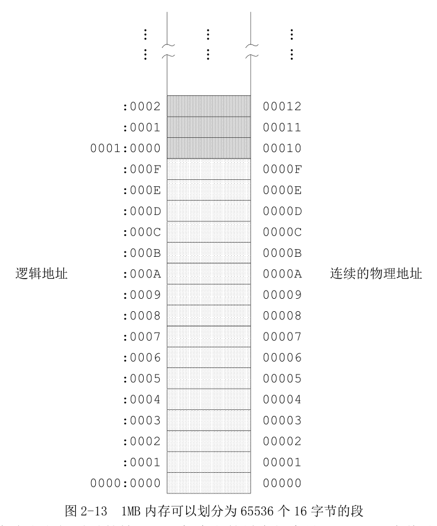

同样在不允许段之间重叠情况下, **每个段最大长度是 64KB, 因为偏移地址也是 16 位**, 从 0000H 到 FFFFH. 1M 内存最多能划分成 16 个段.

8086 处理器的逻辑分段, 起始地址都是 16 的倍数, 这称为是按 16 字节对齐的.

# 6. 习题

1. 数据段寄存器 DS 的值为 25BCH 时, 计算 Intel 8086 可以访问的物理地址范围.

答: 8086 是 20 位地址总线, 16 位数据总线. 偏移地址 16 位, DS 是 25BCH, 左移 4 位, 可访问范围是 25BC0H ~ 35BBFH(25BC0H + FFFFH).
