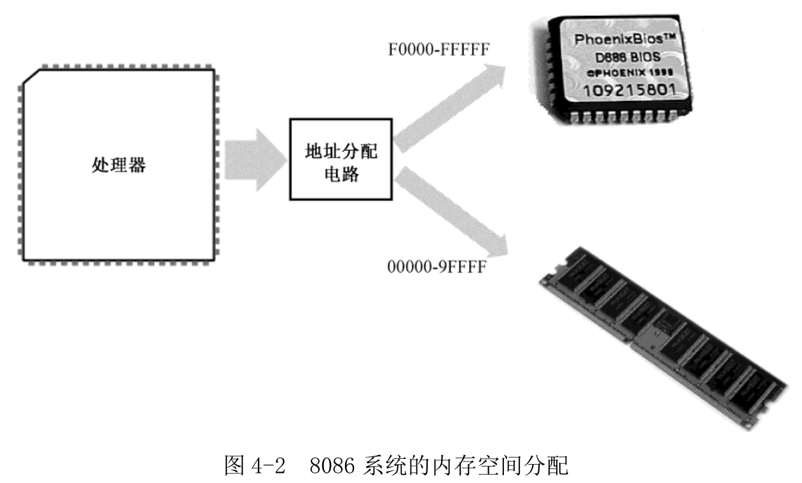
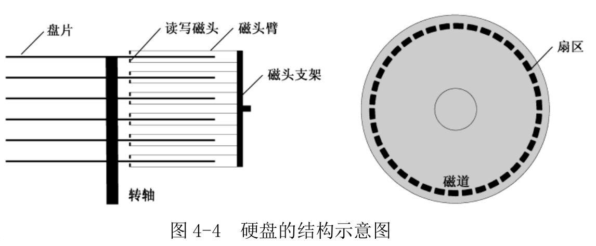

<!-- @import "[TOC]" {cmd="toc" depthFrom=1 depthTo=6 orderedList=false} -->

<!-- code_chunk_output -->

- [1. 如何将编译好的程序提交给处理器](#1-如何将编译好的程序提交给处理器)
- [2. 计算机的加电和复位](#2-计算机的加电和复位)
  - [2.1. 基本输入输出系统](#21-基本输入输出系统)
  - [2.2. 硬盘及其工作原理](#22-硬盘及其工作原理)
  - [2.3. 主引导扇区](#23-主引导扇区)
- [3. 参考](#3-参考)

<!-- /code_chunk_output -->

# 1. 如何将编译好的程序提交给处理器

每种操作系统都对它所管理的程序提出了种种格式上的要求. 比如, 它要求编译好的程序必须在文件的开始部分包含编译日期, 是针对哪种操作系统编译的, 程序的版本, 第一条指令从哪里开始, 数据段从哪里开始、有多长, 代码段从哪里开始、有多长, 等等.

# 2. 计算机的加电和复位

在处理器的引脚中, 有一个是 RESET, 用于接受复位信号. 每当处理器加电, 或者 RESET 引脚的电平由低变高时, 处理器都会执行一个硬件初始化, 以及一个**可选的内部自测试**(Build-in Self-Test, BIST), 然后将内部所有寄存器的内容初始到一个预置的状态.

对于 Intel 8086 来说, **复位将使代码段寄存器(CS)的内容为 0xFFFF**, **其他**所有寄存器的内容都为**0x0000**, 包括指令指针寄存器(IP). 8086 之后的处理器**并未延续**这种设计.

处理器主要功能是取指和执行, 加电或复位后, 会立即尝试这么做. 不过这时, 内存中没有有意义的指令和数据, 处理器怎么办?

先看下内存的特点.

在内存中, **每个比特的存储**都是靠一个极其微小的晶体管, 外加一个同样极其微小的电容来完成的. 可以想象, 这样微小的电容, 其泄漏电荷的速度当然也非常快. 所以, 个人计算机中使用的内存需要定期补充电荷, 这称为刷新, 所以这种存储器也称为**动态随机访问存储器**(Dynamic Random Access Memory, DRAM). 随机访问的意思是, **访问任何一个内存单元的速度和它的位置(地址)无关**. 举个例子来说, 从头至尾在一盘录音带上找某首歌曲, 它越靠前, 找到它所花的时间就越短. 但内存就不一样, 读写地址为 0x00001 的内存单元, 和读写地址为 0xFFFF0 的内存单元, 所需要的时间是一样的.

在内存刷新期间, 处理器将无法访问它. 最麻烦的是, 在它断电之后, 所有保存的内容都会统统消失. 所以, 每当处理器加电之后, 它无法从内存中取得任何指令.

## 2.1. 基本输入输出系统

Intel 8086 可以访问 1MB 的内存空间, 地址范围为 0x00000 到 0xFFFFF. 计算机系统的设计者将这 1MB 的内存空间从物理上分为几个部分.

8086 有 20 根地址线, 但并非全都用来访问 DRAM. 事实上, 这些地址线经过分配, 大部分用于访问 DRAM, 剩余的部分给了**只读存储器 ROM 和外围的板卡**, 如图 4-2 所示.



与 DRAM 不同, 只读存储器(Read Only Memory, ROM)**不需要刷新**, 它的内容是**预先写入的**, **掉电也不会消失**, 但也很难改变. 这个特点很有用, 比如, 可以将一些程序指令固化在 ROM 中, 使处理器在每次加电时都自动执行. (BIOS??)

在以**Intel 8086**为处理器的系统中, ROM 占据着整个内存空间顶端的 64KB, 物理地址范围是 0xF0000~0xFFFFF, 里面固化了开机时要执行的指令(不是使用了内存条, 而是 I/O 端口的内存映射, 现代系统也将这个物理地址范围分给 ROM, 可以通过 cat /proc/iomem 查看); DRAM 占据着较低端的 640KB, 地址范围是 0x00000~0x9FFFF; 中间还有一部分, 分给了其他外围设备, 这个以后再说. 因为 8086 加电或者复位时, CS=0xFFFF, IP=0x0000, 所以, 它取的第一条指令位于物理地址 0xFFFF0, 正好位于 ROM 中, 那里固化了开机时需要执行的指令.

处理器取指令执行的自然顺序是从内存的低地址往高低地址推进. 如果从 0xFFFF0 开始执行, 这个位置离 1MB 内存的顶端(物理地址 0xFFFFF)只有 16 个字节的长度, 一旦 IP 寄存器的值超过 0x000F, 比如 IP=0x0011, 那么, 它与 CS 一起形成的物理地址将因为溢出而变成 0x00001, 这将回绕到 1MB 内存的最低端.

所以, ROM 中位于物理地址 0xFFFF0 的地方, 通常是一个跳转指令, 它通过改变 CS 和 IP 的内容, 使处理器从 ROM 中的较低地址处开始取指令执行. 在 NASM 汇编语言里, 一个典型的跳转指令像这样:

```
jmp 0xf000:0xe05b
```

0xf000 是要跳转到的段地址, 用来改变 CS 寄存器的内容; 0xe05b 是目标代码段内的偏移地址, 用来改变 IP 寄存器的内容.

ROM 芯片主要是进行硬件的诊断、检测和初始化. 最后, 它还负责提供一套软件例程, 让人们在不必了解硬件细节的情况下**从外围设备(比如键盘)获取输入数据**, 或者**向外围设备(比如显示器)输出数据**. 设备很多, 所以 ROM 芯片只针对那些最基本的、对于使用计算机而言最重要的设备, 而它所提供的软件例程, 也只包含最基本、最常规的功能. 正因为如此, 这块芯片又叫基本输入输出系统(Base Input & Output System, BIOS)ROM. ROM-BIOS 的工作相关知识将会分散在各个章节里讲解.

**ROM-BIOS** 的容量是有限的, 当它完成自己的使命后, 最后所要做的, 就是从辅助存储设备读取指令数据, 然后转到那里开始执行.

## 2.2. 硬盘及其工作原理

硬盘的结构如图:



硬盘可能有多个盘片. 每个盘片都有两个磁头(Head), 上下各一个, 经常使用磁头来代指盘面. 磁头都有编号, 第一个盘片, 上面的磁头编号 0, 下面的磁头编号 1, 依次类推.

每个磁头不是单独移动的. **所有磁头**都通过磁头臂固定在同一个支架上, 由步进电动机带动着**一起移动**. 也就是同进退的.

因为所有磁头都是联动的, 所以每个盘面上的同一条磁道(Track)又可以形成一个虚拟的圆柱, 即柱面(Cylinder).

磁道, 或柱面, 也要编号. 编号是从盘面最边缘的磁道开始, 向圆心方向, 从 0 开始编号.

柱面是一个用来优化数据读写的概念. 初看, 用硬盘记录数据, 应该先将一个盘面填满, 再填写另一个盘面. 实际上, 移动磁头相对于处理器是个很慢的动作, 这就是寻道时间. 为加速数据在硬盘上的读写, 最好不要移动磁头. 这样, 当 0 面(盘面, 不是柱面！！)的磁道不足写数据时, 应将剩余部分写在 1 面的同一磁道上. 还不够, 写在 2 面的同一磁道上. 换句话说, 硬盘上, **数据访问是以柱面来组织的**.

实际上, 数据读写的最小单位不是磁道, 而是扇区.

每条磁道能划分为几个扇区, 取决于磁盘的制造者, 但通常为 63 个. 而且每个扇区都有一个编号, 与磁头和磁道不同, 扇区的编号是从 1 开始的, 而且并**不是连续编号**.

扇区互相之间以间隙(空白)间隔开, 每个扇区以**扇区头开始**, 然后是**512 字节的数据区**. 扇区头包含扇区自己的信息, 主要有本扇区的磁道号、磁头号和扇区号, 用来供硬盘定位使用. 现代硬盘还会包含一些指示扇区是否健康的标志, 以及用来替换该扇区的扇区地址. 用于替换扇区的, 是一些保留和隐藏的磁道.

注: 我们不关心具体物理扇区位置, 所有物理扇区都会被统一编址, 称为逻辑扇区, 操作针对逻辑扇区. 它把硬盘上所有可用的扇区都一一从 0 编号, 而不管它位于哪个盘面, 也不管它属于哪个柱面. 具体见后面内容.

## 2.3. 主引导扇区

前面说到, 当 ROM-BIOS 完成自己使命之前, 最后要做的是从外存储设备读取更多指令来交给处理器执行.

硬盘第一个扇区是 0 面(盘面)0 道(磁道)1 扇区, 或者说 0 头(磁头)0 柱(柱面)1 扇区, 这个扇区称为主引导扇区. 若计算机设置从硬盘启动, 那么, ROM-BIOS 将读取硬盘主引导扇区内容, 并加载到内存地址 0x0000:0x7c00 处(即物理地址 0x7c00), 然后调用 jmp 指令跳转到那里执行:

```
jmp 0x0000:0x7c00
```

7c00 这个地址没有特殊意思, 只是最初这么约定的.

通常, 主引导扇区的功能是继续从硬盘的其他部分读取更多的内容加以执行.

# 3. 参考

参考: Operating System/计算机如何启动的