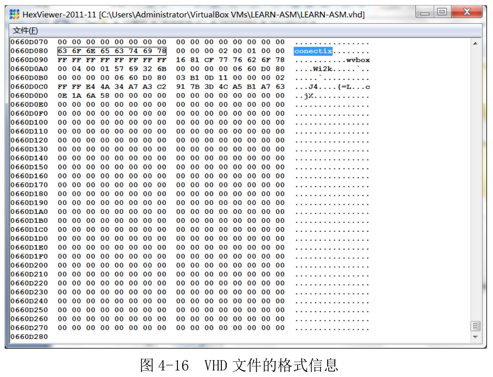

# 虚拟机是软件

# 下载安装 Oracle VM VirtualBox

使用 Oracle VM VirtualBox, 虚拟硬盘使用固定尺寸的 VHD.

VHD 规范最早起源于 Connectix 公司的虚拟机软件 Connectix Virtual PC, 2003 年, 微软公司收购了它并改名为 Microsoft Virtual PC. 2006 年, 微软公司正式发布了 VHD 虚拟硬盘格式规范.

VDI 是 VirtualBox 自己的虚拟硬盘规范, VMDK 是 VMware 的虚拟硬盘规范. 本书例子使用"VHD(Virtual Hard Disk)".

VHD 也分为两种类型: 固定尺寸和动态分配的. 本书使用固定尺寸的 VHD.

## 虚拟硬盘简介

采用**固定尺寸的 VHD 虚拟硬盘**, 因为其**简单性**. 它**仅包含两部分**, 前面是**数据区**, 用来**模拟实际的硬盘空间**, 后面跟一个**512 字节的结尾**. (2004 年前规范是 511 字节)

要**访问硬盘**, 运行中的程序必须至少向**硬盘控制器**提供**4 个参数**, 分别是**磁头号**、**磁道号**、**扇区号**, 以及**访问意图(读还是写**).

磁盘读写以**扇区**为**最小单位**. 所以读写数据, **至少是 1 个扇区**.

再 VHD 规范中, **每个扇区**是**512 字节**.

**VHD 文件**一开始的**512 字节**, 就对应着**物理硬盘**的**0 面 0 道 1 扇区**. 然后, VHD 文件的第二个 512 字节, 对应着 0 面 0 道 2 扇区, 后面的依次类推, 一直对应到 **0 面 0 道 n 扇区**. 这里, n 等于每磁道的扇区数.

再往后, 因为**硬盘的访问**是按**柱面进行！！！** 的, 所以, 在 VHD 文件中, 紧接着前面的数据块, **下一个数据块**对应的是**1 面 0 道 1 扇区**, 就这样一直往后排列, 当把**第一个柱面全部对应完**后, 再从**第二个柱面**开始对应.

注: 看硬盘原理

如图 4\-7 所示, 为了**标志**一个文件是**VHD 格式**的**虚拟硬盘**, 并为使用它的虚拟机提供该硬盘的参数, 在 VHD 文件的**结尾**, 包含了**512 字节的格式信息**. Windows 下查看可以使用 HexView.

如图 4-7 所示, **文件信息**是以一个**字符串**"**conectix**"开始的. 这个标志用来告诉试图打开它的虚拟机, 这的确是一个**合法的 VHD 文件**. 该标志称为 VHD 创建者标识, 就是说, 该公司(conectix)创建了 VHD 文件格式的最初标准.

从这个标志开始, **后面的数据**包含了诸如文件的创建日期、VHD 的版本、创建该文件的应用程序名称和版本、创建该文件的应用程序所属的操作系统、该虚拟硬盘的参数(磁头数、每面磁道数、每磁道扇区数)、VHD 类型(固定尺寸还是动态增长)、虚拟硬盘容量等.

......