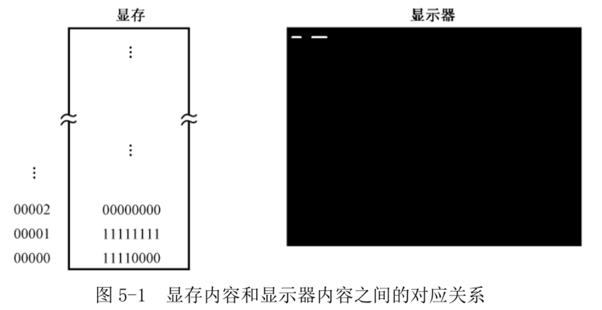
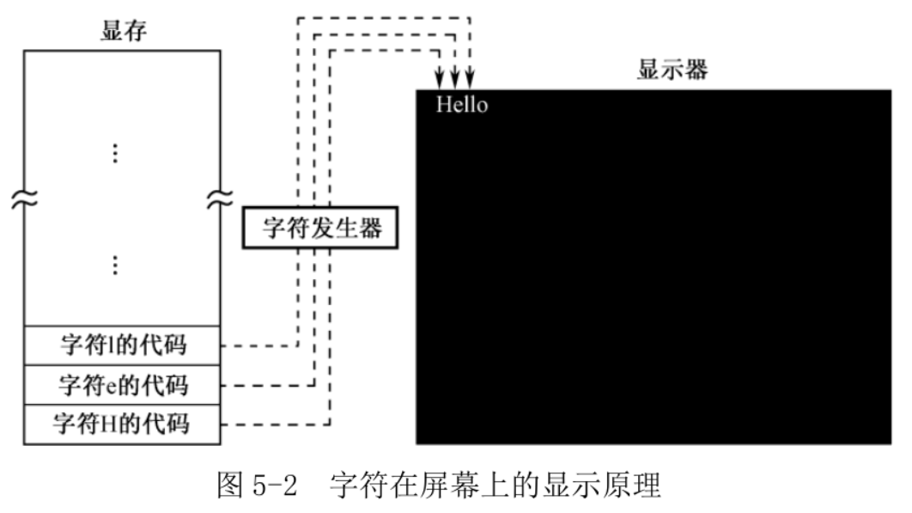
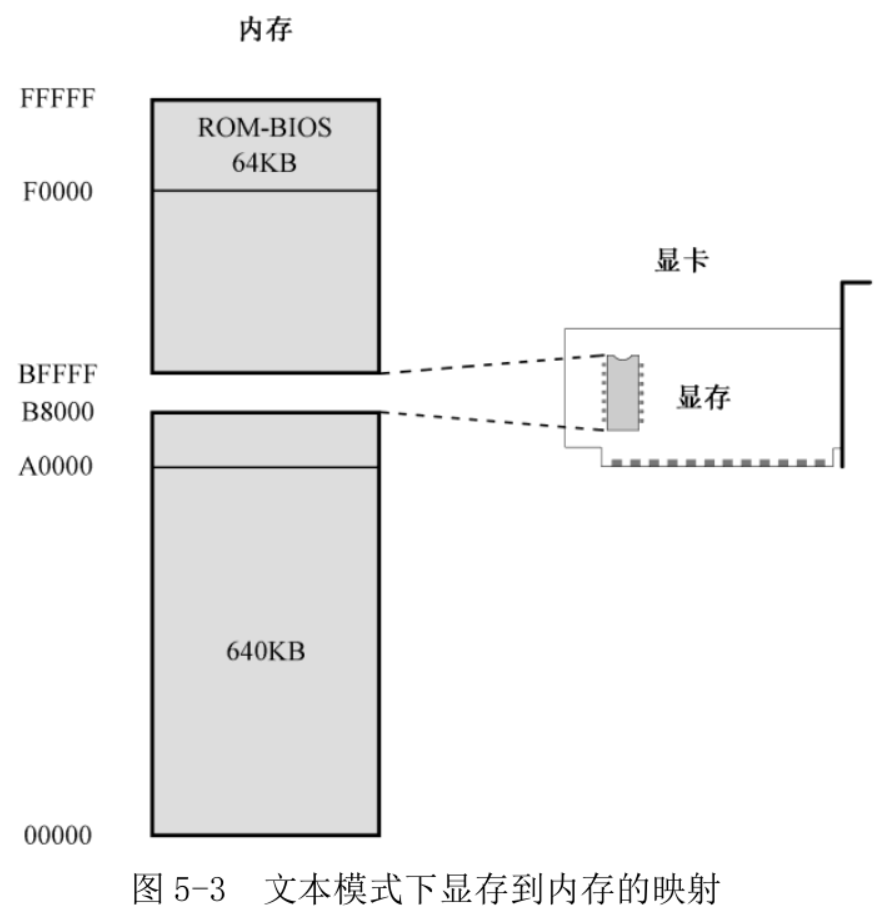
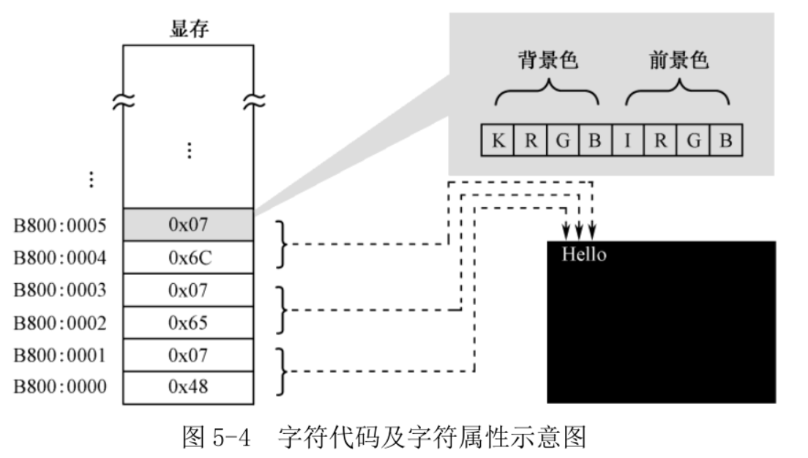
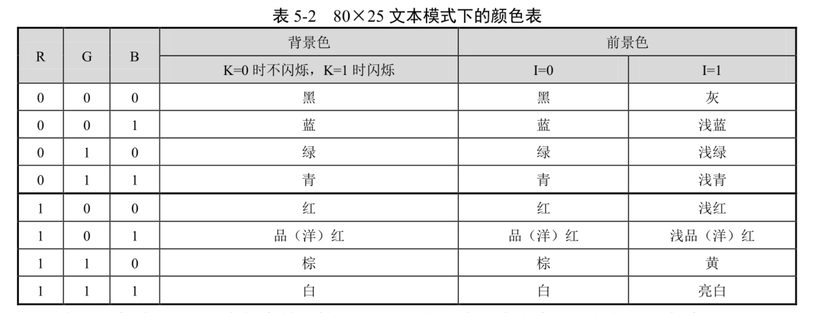

# 1. 显卡和显存

为了显示文字, 通常需要两种硬件, 一是显示器, 二是显卡. **显卡**的职责是**为显示器提供内容**, 并控制显示器的**显示模式和状态**, 显示器的职责是显示内容.

一般, 显卡位于主板上, 未必是独立的插卡. 直接做在主板上的, 叫集成显卡.

**显卡控制显示器的最小单位是像素**, 一个像素对应着屏幕上的一个点.

如何来控制这些像素呢?

**显卡**都有自己的存储器, **显示存储器**(`Video RAM`: **VRAM**), 简称显存, 要显示的内容都预先写入显存. 和其他半导体存储器一样, 也是一个**按字节访问**的存储器件.

对显示器而言, 显示黑白最简单, 因为只需要控制每个像素是亮, 还是不亮. 如果把不亮当成比特"0", 亮看成比特"1", 那就好办了.

如图 5-1 所示:

* 显存的**第 1 个字节**对应着屏幕**左上角连续的 8 个像素**;
* **第 2 个字节**对应着屏幕上后续的 8 个像素, 后面的依次类推.



**显卡的工作是周期性地从显存中提取这些比特, 并把它们按顺序显示在屏幕上**. 如果是比特"0", 则像素保持原来的状态不变, 因为屏幕本来就是黑的; 如果是比特"1", 则点亮对应的像素.

继续观察图 5-1, 假设显存中, 第 1 个字节的内容是 11110000, 第 2 个字节的内容是 11111111, 其他所有的字节都是 00000000. 在这种情况下, 屏幕左上角先是显示 4 个亮点, 再显示 4 个黑点, 然后再显示 8 个亮点. 因为像素是紧挨在一起的, 所以我们看到的先是一条白短线, 隔着一定距离(4 个像素)又是一条白长线.

黑色和白色只需要 1 个比特就能表示, 但要显示更多的颜色, 1 个比特就不够了. 现在最流行的, 是**用 24 个比特, 即 3 个字节, 来对应一个像素**. 因为 2^24=16777216, 所以在这种模式下, 同屏可以显示 16777216 种颜色, 这称为真彩色.

**对于显示器而言, 不管是显示图片, 还是文字, 都是像素**.

问题是, 操作显存里的比特, 使得屏幕上能显示出字符的形状, 是非常麻烦的工作, 因为你必须计算该字符所对应的比特位于显存里的什么位置.

就像一个二进制数可以是一个普通的数, 也可以代表一条处理器指令一样, 他们认为每个字符也可以表示成一个数. 比如, 数字 0x4C 代表字符"L", 这个数字是"L"的 ASCII 码.

如图, 可以将字符的代码存放到显存里, 第 1 个代码对应着屏幕左上角第 1 个字符, 第 2 个代码对应着屏幕左上角第 2 个字符, 后面的依次类推.



传统上, 这种专门用于**显示字符**的**工作方式**称为**文本模式**. **文本模式和图形模式是显卡的两种基本工作模式**, 可以用指令访问显卡, 设置它的显示模式. 在不同的工作模式下, 显卡对显存内容的解释是不同的.

为了给出要显示的字符, 处理器需要访问显存, 把字符的 ASCII 码写进去. 但是, 显存是位于显卡上的, 访问显存需要和显卡这个外围设备打交道. 同时, 多一道手续自然是不好的, 为了实现一些快速的游戏动画效果, 或者播放高码率的电影, 不直接访问显存是办不到的.

所以把显存映射到处理器可以直接访问的地址空间里, 也就是内存空间里.

如图, 我们知道, **8086** 可以访问 **1MB** 内存(00000H ~ FFFFFH). 其中, 0x00000~9FFFF 属于**常规内存**(**640KB**), 由内存条提供(**也就是说内存条只是这么大！！！**); `0xF0000~0xFFFFF`(`0x10000`=`2^16`=**64KB**)由主板上的一个芯片提供, 即 `ROM-BIOS`(**不是使用了内存条的空间, 而是自己本身就是一个存储器！！！**). 物理地址范围可以通过 `cat /proc/iomem` 查看.



中间还有一个 320KB 的空洞, 即 `0xA0000~0xEFFFF`. 传统上, 这段地址空间由特定的外围设备来提供, 其中就包括显卡. 因为显示功能对于现代计算机来说实在是太重要了.

历史原因, 在个人计算机上使用的**显卡**, 在**加电自检之后**都会把自己初始化到 `80×25` 的**文本模式**. 在这种模式下, 屏幕上可以显示 25 行, 每行 80 个字符, 每屏总共 2000 个字符.

如图 5-3 所示, 一直以来, `0xB8000~0xBFFFF`(`0x8000`=`2^15`=**32KB**) 这段物理地址空间, 是留给显卡的, 由显卡来提供, 用来显示文本. 显卡出问题的话, 计算机加电自检都会失败.

# 2. 初始化段寄存器

文本模式下显存的起始物理地址是 0xB8000, 这块内存可以看成是段地址为 0xB800, 偏移地址从 0x0000 延伸到 0xFFFF 的区域, 因此我们可以把段地址定为 0xB800.

访问内存可以使用段寄存器 DS, 但不是强制性的, 也可以使用 ES. 因为 DS 还有别的用处, 所以使用 ES 来指向显存所在的段.

源程序第 6、7 行, 首先把立即数 0xB800 传送到 AX, 然后再把 AX 的值传送到 ES. 这样, 附加段寄存器 ES 就指向 0xb800 段(段基地址为 0xB800).

你可能回想, 为什么不直接这样写:

```
mov es,0xb800
```

而要用寄存器 AX 来中转呢?

原因是不存在这样的指令, **Intel 的处理器不允许将一个立即数传送到段寄存器**, 它只允许这样的指令:

```
mov 段寄存器, 通用寄存器
mov 段寄存器, 内存单元
```

这个规定也没什么原因"(￣_,￣ )"

# 3. 显存的访问和 ASCII 代码

一旦将显存映射到处理器的地址空间, 就可以使用普通的传送指令(mov)读写它(典型统一编址), 非常方便, 但需要首先将它作为一个段来看待, 并将它的基地址传送到段寄存器.

源码 10、11 行, 将 0xB800 作为段地址传送到附加段寄存器 ES, 以后就用 ES 来读写显存. 这样, 段内偏移为 0 的位置就对应着屏幕左上角字符.

在计算机中, 每个用来显示在屏幕上的字符, 都有一个二进制字符.

在计算机中, 所有东西都是无差别的数字, 它们的意义, 只取决于生成者和使用者之间的约定.

不同设备之间, 或者在同一设备的不同模块之间有一个信息传递标准是很有必要的.

ASCII 是 7 位代码, 只用了一个字节中的低 7 位, 最高位通常置 0. 所以 ASCII 只包含 128 个字符.

ASCII 中相当一部分是不可打印的, 用于控制通信过程. 比如, LF 是换行; CR 是回车; DEL 和 BS 分别是删除和退格; BEL 是振铃; SOH 是文头; EOT 是文尾; ACK 是确认, 等等.

在处理器上编写程序算了一道数学题 2+3, 你也希望把结果 5 显示在屏幕上. 这个时候, 算出的结果是 0000 0101, 即 0x05. 但是, 数字 5 和字符 5 是不同的, 显卡在任何时候都认为你发送的是 ASCII 码. 所以, 你不应该发送 0x05, 而应该发送 0x35.

屏幕上的每个字符对应着显存中的两个连续字节, 前一个是字符的 ASCII 代码, 后面是字符的
显示属性, 包括字符颜色(前景色)和底色(背景色). 如图 5-4 所示, 字符"H"的 ASCII 代码是
0x48, 其显示属性是 0x07; 字符"e"的 ASCII 代码是 0x65, 其显示属性是 0x07.

如图 5-4 所示, 字符的显示属性(1 字节)分为两部分, 低 4 位定义的是前景色, 高 4 位定
义的是背景色. 色彩主要由 R、G、B 这 3 位决定, 毕竟我们知道, 可以由红(R)、绿(G)、蓝
(B)三原色来配出其他所有颜色. K 是闪烁位, 为 0 时不闪烁, 为 1 时闪烁; I 是亮度位, 为 0
时正常亮度, 为 1 时呈高亮. 表 5-2 给出了背景色和前景色的所有可能值.





字符属性 0x07 可以解释为黑底白字, 无闪烁, 无加亮.

当屏幕上一片漆黑, 什么内容都没有的时候, 显存里会是什么内容呢?

实际上, 这个时候, 屏幕上显示的全是黑底白字的空白字符, 也叫空格字符(Space), ASCII 代码是 0x20.

# 4. 显示字符

源程序第 10 行到 35 行, 显示一串字符"Label offset:". 为此, 需要将每个 ASCII 码顺序写入显存中.

多数汇编语言编译器**允许在指令中直接使用字符来代替数值的 ASCII 码**

```
mov byte [es:0x00], 'L'
```

等价于

```
mov byte [es:0x00], 0x4c
```

当前的 mov 指令是将立即数传送到内存单元, 目的操作数是内存单元, 源操作数是立即数(ASCII 代码). 为了访问内存单元, 只需要在指令中给出偏移地址, 在这里, 偏移地址是 0x00.

一般情况下, **如果没有附加任何指示, 段地址默认在段寄存器 DS 中**. 比如:

```
mov byte [0x00], 'L'
```

当执行这条指令后, 处理器把**段寄存器 DS 的内容左移 4 位**(相当于乘以十进制数 16 或者十六进制数 0x10), **加上这里的偏移地址 0x00, 就得到了物理地址**.

但是实际上, 显存的段地址位于段寄存器 ES 中, 我们希望使用 ES 来访问内存. 因此, 这里使用了**段超越前缀"es:"**.

0xB800:0x0000, 也就是物理地址 0xB8000, 这个内存单元对应着屏幕左上角第一个字符的位置.

**目的操作数用方括号围起来, 表明它是一个地址**, 处理器应该用这个地址再次访问内存, 将源操作数写进这个单元. 实际上, 这类似于高级语言里的指针.

关键字"byte"用来修饰目的操作数, 指出本次传送是以字节的方式进行的. **在这里, 目的操作数是偏移地址 0x00, 它可以是字节单元, 也可以是字单元; 而源操作数呢, 是立即数 0x4C, 它既可以解释为 8 位的 0x4C, 也可以解释为 16 位的 0x004C**. 在这种情况下, 编译器将无法搞懂你的真实意图, 只能报告错误, 所以必须用"byte"或者"word"进行修饰(明确指示). **下面的指令就不需要任何修饰**:

```
mov [0x00],AL ;按字节操作
mov AX,[0x02] ;按字操作
```

因为屏幕的一个字符对应内存中两个字节: ASCII 代码和属性. 所以, 源程序第 11 行是将属性值 0x07 传送到下一个内存单元, 即偏移地址 0x01 处.

# 5. MOV 指令的格式

mov 用于数据传送. **目的操作数**应该是个"容器", 故必须是**通用寄存器或内存单元**; **源操作数**, 可以是**与目的操作数宽度相同的通用寄存器和内存单元**, 也可以是立即数. 但是**目的操作数和源操作数都不允许同时为内存单元**.

数据宽度不同, 下面指令就是错的:

```
mov ax,bl
```

再看:

```
mov [0x02],bh
mov ax, [0x06]
```

这两条指令中都有寄存器操作数, 所以不需要"byte"或"word"修饰.

源操作数也可以是立即数.

```
mov ah,0x05
mov word [0x1c],0xf000
```

第一条, 将立即数 0x05 传送到寄存器 AH; 第二条将立即数 0xf000 传送到偏移地址为 0x1c 的 16 位内存中, 但是要用 word 修饰.

下面两条都不正确:

```
mov 0x1c,al
mov [0x01],[0x02]
```

