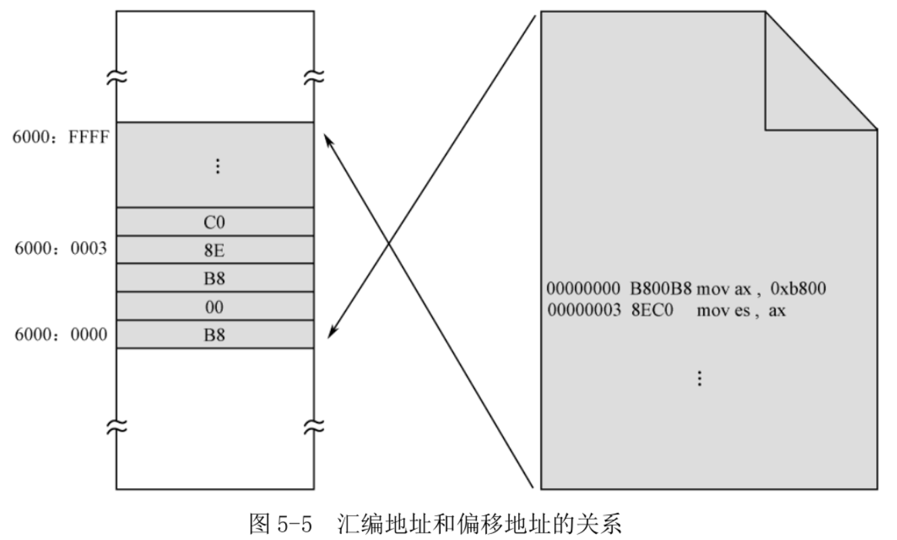
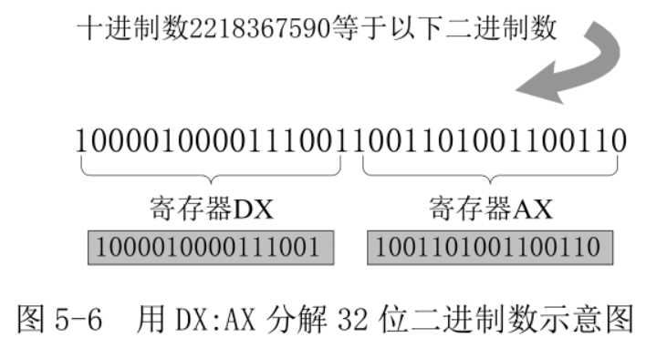
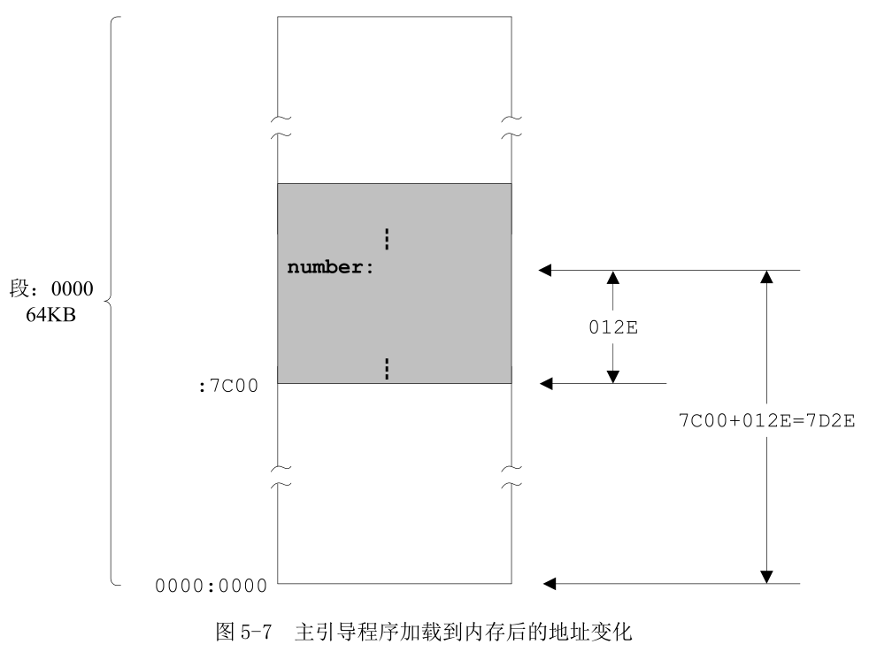
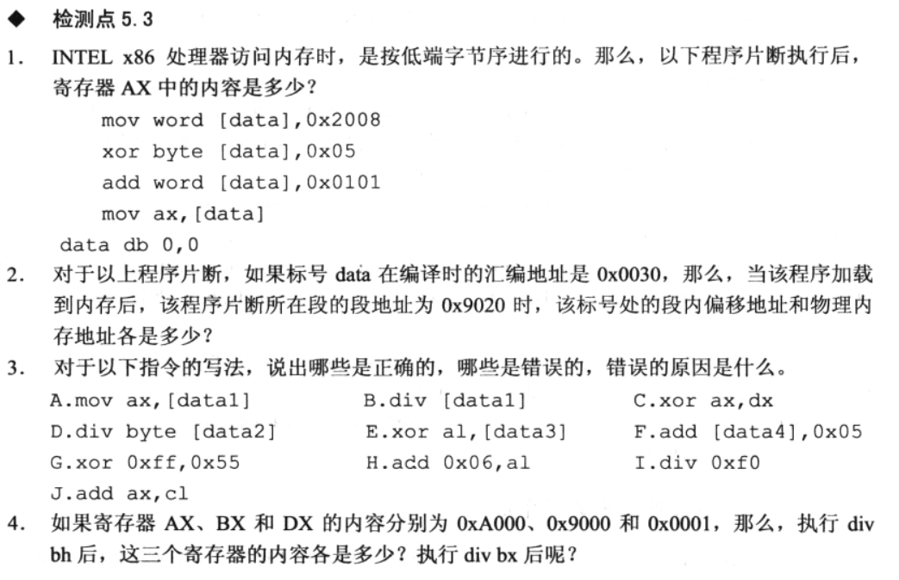

```
5.5 显示标号的汇编地址
　　5.5.1 标号
　　5.5.2 如何显示十进制数字
　　5.5.3 在程序中声明并初始化数据
　　5.5.4 分解数的各个数位
　　5.5.5 显示分解出来的各个数位
```

## 1. 标号

段地址开始于任何 16 字节对齐的地方, 偏移地址总是从 0x0000 开始递增.

为支持这种内存访问模式, 在源程序的编译阶段, 编译器会把源程序整体上作为一个独立的段来处理, 并从 0 开始计算和跟踪每一条指令的地址. 因为该地址是在编译期间计算的, 故称为汇编地址. **汇编地址**是在源程序编译期间, 编译器为每条指令确定的汇编位置(Assembly Position), 也就是**每条指令相对于整个程序开头的偏移量**, 以字节计. 当编译后的程序装入物理内存后, 它又是该指令在内存段内的偏移地址.

通过对 bin 进行反汇编

```
ndisasm c05_mbr.bin
```

结果:

```
00000000  B800B8            mov ax,0xb800
00000003  8EC0              mov es,ax
00000005  26C60600004C      mov byte [es:0x0],0x4c
0000000B  26C606010007      mov byte [es:0x1],0x7
00000011  26C606020061      mov byte [es:0x2],0x61
00000017  26C606030007      mov byte [es:0x3],0x7
0000001D  26C606040062      mov byte [es:0x4],0x62
00000023  26C606050007      mov byte [es:0x5],0x7
00000029  26C606060065      mov byte [es:0x6],0x65
0000002F  26C606070007      mov byte [es:0x7],0x7
00000035  26C60608006C      mov byte [es:0x8],0x6c
0000003B  26C606090007      mov byte [es:0x9],0x7
00000041  26C6060A0020      mov byte [es:0xa],0x20
00000047  26C6060B0007      mov byte [es:0xb],0x7
0000004D  26C6060C006F      mov byte [es:0xc],0x6f
00000053  26C6060D0007      mov byte [es:0xd],0x7
00000059  26C6060E0066      mov byte [es:0xe],0x66
0000005F  26C6060F0007      mov byte [es:0xf],0x7
00000065  26C606100066      mov byte [es:0x10],0x66
0000006B  26C606110007      mov byte [es:0x11],0x7
00000071  26C606120073      mov byte [es:0x12],0x73
00000077  26C606130007      mov byte [es:0x13],0x7
0000007D  26C606140065      mov byte [es:0x14],0x65
00000083  26C606150007      mov byte [es:0x15],0x7
00000089  26C606160074      mov byte [es:0x16],0x74
0000008F  26C606170007      mov byte [es:0x17],0x7
00000095  26C60618003A      mov byte [es:0x18],0x3a
0000009B  26C606190007      mov byte [es:0x19],0x7
000000A1  B82E01            mov ax,0x12e
000000A4  BB0A00            mov bx,0xa
000000A7  8CC9              mov cx,cs
000000A9  8ED9              mov ds,cx
000000AB  BA0000            mov dx,0x0
000000AE  F7F3              div bx
000000B0  88162E7D          mov [0x7d2e],dl
000000B4  31D2              xor dx,dx
000000B6  F7F3              div bx
000000B8  88162F7D          mov [0x7d2f],dl
000000BC  31D2              xor dx,dx
000000BE  F7F3              div bx
000000C0  8816307D          mov [0x7d30],dl
000000C4  31D2              xor dx,dx
000000C6  F7F3              div bx
000000C8  8816317D          mov [0x7d31],dl
000000CC  31D2              xor dx,dx
000000CE  F7F3              div bx
000000D0  8816327D          mov [0x7d32],dl
000000D4  A0327D            mov al,[0x7d32]
000000D7  0430              add al,0x30
000000D9  26A21A00          mov [es:0x1a],al
000000DD  26C6061B0004      mov byte [es:0x1b],0x4
000000E3  A0317D            mov al,[0x7d31]
000000E6  0430              add al,0x30
000000E8  26A21C00          mov [es:0x1c],al
000000EC  26C6061D0004      mov byte [es:0x1d],0x4
000000F2  A0307D            mov al,[0x7d30]
000000F5  0430              add al,0x30
000000F7  26A21E00          mov [es:0x1e],al
000000FB  26C6061F0004      mov byte [es:0x1f],0x4
00000101  A02F7D            mov al,[0x7d2f]
00000104  0430              add al,0x30
00000106  26A22000          mov [es:0x20],al
0000010A  26C606210004      mov byte [es:0x21],0x4
00000110  A02E7D            mov al,[0x7d2e]
00000113  0430              add al,0x30
00000115  26A22200          mov [es:0x22],al
00000119  26C606230004      mov byte [es:0x23],0x4
0000011F  26C606240044      mov byte [es:0x24],0x44
00000125  26C606250007      mov byte [es:0x25],0x7
0000012B  E9FDFF            jmp word 0x12b
0000012E  0000              add [bx+si],al
00000130  0000              add [bx+si],al
······
000001FA  0000              add [bx+si],al
000001FC  0000              add [bx+si],al
000001FE  55                push bp
000001FF  AA                stosb
```

第一列是指令的汇编地址, 第二列是指令编译后的机器代码(**机器码所占大小就是该指令占用的内存大小！！**). 通过 hexdump -C c05_mbr.bin(逐字节查看改文件内容), 可以看到机器码就是该文件的二进制内容. 关于 hexdump 可以查看 Linux/Commands 内容.

```
root@Gerry:/home/project/nasm/booktool/c05# hexdump -C c05_mbr.bin
00000000  b8 00 b8 8e c0 26 c6 06  00 00 4c 26 c6 06 01 00  |.....&....L&....|
00000010  07 26 c6 06 02 00 61 26  c6 06 03 00 07 26 c6 06  |.&....a&.....&..|
00000020  04 00 62 26 c6 06 05 00  07 26 c6 06 06 00 65 26  |..b&.....&....e&|
00000030  c6 06 07 00 07 26 c6 06  08 00 6c 26 c6 06 09 00  |.....&....l&....|
00000040  07 26 c6 06 0a 00 20 26  c6 06 0b 00 07 26 c6 06  |.&.... &.....&..|
00000050  0c 00 6f 26 c6 06 0d 00  07 26 c6 06 0e 00 66 26  |..o&.....&....f&|
00000060  c6 06 0f 00 07 26 c6 06  10 00 66 26 c6 06 11 00  |.....&....f&....|
00000070  07 26 c6 06 12 00 73 26  c6 06 13 00 07 26 c6 06  |.&....s&.....&..|
00000080  14 00 65 26 c6 06 15 00  07 26 c6 06 16 00 74 26  |..e&.....&....t&|
00000090  c6 06 17 00 07 26 c6 06  18 00 3a 26 c6 06 19 00  |.....&....:&....|
000000a0  07 b8 2e 01 bb 0a 00 8c  c9 8e d9 ba 00 00 f7 f3  |................|
000000b0  88 16 2e 7d 31 d2 f7 f3  88 16 2f 7d 31 d2 f7 f3  |...}1...../}1...|
000000c0  88 16 30 7d 31 d2 f7 f3  88 16 31 7d 31 d2 f7 f3  |..0}1.....1}1...|
000000d0  88 16 32 7d a0 32 7d 04  30 26 a2 1a 00 26 c6 06  |..2}.2}.0&...&..|
000000e0  1b 00 04 a0 31 7d 04 30  26 a2 1c 00 26 c6 06 1d  |....1}.0&...&...|
000000f0  00 04 a0 30 7d 04 30 26  a2 1e 00 26 c6 06 1f 00  |...0}.0&...&....|
00000100  04 a0 2f 7d 04 30 26 a2  20 00 26 c6 06 21 00 04  |../}.0&. .&..!..|
00000110  a0 2e 7d 04 30 26 a2 22  00 26 c6 06 23 00 04 26  |..}.0&.".&..#..&|
00000120  c6 06 24 00 44 26 c6 06  25 00 07 e9 fd ff 00 00  |..$.D&..%.......|
00000130  00 00 00 00 00 00 00 00  00 00 00 00 00 00 00 00  |................|
*
000001f0  00 00 00 00 00 00 00 00  00 00 00 00 00 00 55 aa  |..............U.|
00000200
```

编译阶段, **每条指令被计算机赋予了一个汇编地址**, 就像被加载到内存的某个段一样. 实际上, 如图 5-5, 当编译好的程序加载到内存中, 它在段内的偏移地址和它在编译阶段的汇编地址相等.



交叉箭头指示它们之间的映射关系. 之所以交叉, 因为源码编译时从上往下的, 而内存地址的增长时从下往上的(从低地址往高地址方向增长).

图 5-5 假定了程序是从内存物理地址 0x60000 开始加载. 因为该物理地址也对应着逻辑地址 0x6000:0x0000, 因此我们可以说, 该程序位于段 0x6000 内. (《一个操作系统的实现》里面第一个例程, 必须用 org 是因为 BIOS 会将执行程序放到 0x7c00 开始的位置, 里面数据地址<指令地址也是数据地址>都是一个绝对地址, 不是段的相对地址, 所以在移动到 7c00 后, 数据的地址都是有问题的, 必须加上 7c00 的偏移)

这段程序必须指定段, 不能放在内存任意位置, 只有这样, 每条指令里面操作的地址都还能找到, 要不然没法执行.

在 NASM 汇编中, 每条指令前面可以有一个标号, 代表和指示该指令的**汇编地址**.

```
infi: jmp near infi
```

这条指令的汇编地址是 0x0000012b, 所以**infi 代表数值 0x0000012B, 即代表指令的汇编地址**.

**标号之后的冒号是可选的**. 所以下面的写法也是正确的:

```
infi jmp near infi
```

标号可以单独占用一行的位置

```
infi:
    jmp near infi
```

这与上面的相比, 因为**infi 所在那一行没有指令, 也不是数据**, 它**地址和下一行的地址相同**.

## 2. 显示十进制数字

标号可以用来代表指令的汇编地址. 在屏幕上显示这个地址的数值. 先获取标号代表的汇编地址

```
mov ax, number
```

标号"number"位于源程序的第 100 行, 后面没有跟着冒号":". 注意, 传送到寄存器 AX 的值是在源程序编译时确定的, **在编译阶段, 编译器会将标号 number 转换成立即数**. 这条语句其实就是

```
mov ax, 0x012E
```

这条指令编译后, 得到的机器指令为 B8[2E01], 或者 B8 2E 01. B8 是操作码, 后面是字操作数 0x012E, 只不过采用的是低端字节序.

十六进制数 0x012E 等于十进制数 302, 但是, 根据前面的字符显示原理, 直接把寄存器 AX 中的内容传送到显示缓冲区, 是不可能在屏幕上出现"302"的.

解决办法就是将每个数位单独拆分出来, 这需要不停除以 10.

考虑到寄存器 AX 是 16 位的, 可以表示的数从二进制的 0000000000000000 到 1111111111111111, 也就是十进制的 0~65535, 故它可以容纳最大 5 个数位的十进制数. 只要把 AX 的内容不停地除以 10, 只需要 5 次, 把每次的余数反向组合到一起, 就是原来的数字.

即使是得到了单个的数位, 也还是不能在屏幕上显示, 因为它们是数字, 而非 ASCII 代码. 把每次相除得到的余数加上 0x30(字符"0"的 ASCII)就行了.

## 3. 在程序中声明并初始化数据

寄存器数量太少, 所以最好办法就是在内存中专门留空间保存数位.

要达到这个目的**必须初始化一些初始数据来"占位"**, 后续再用的话, 可以直接使用. 源码 100 行用于声明并初始化数据, 标号 number 代表了这些数据的起始汇编地址.

**用 DB 指令来声明**(Declare)的, DB 的意思是声明字节(Declare Byte), 所以, 跟在它后面的**操作数都占一个字节的长度**(位置). 注意, 如果要声明多个数据, 各个操作数之间必须以逗号隔开.

DW(Declare Word)用于声明字数据, DD(Declare Double Word)用于声明双字(两个字)数据, DQ(Declare Quad Word)用于声明四字数据.

DB、DW、DD 和 DQ 不是处理器指令, 只是编译器提供的汇编指令, 称做**伪指令(pseudo Instruction)**. 伪指令是汇编指令的一种, 没有对应的机器指令, 不是机器指令的助记符, 仅仅在编译阶段由编译器执行, 编译成功后, 伪指令就消失了. 所以在程序执行时, 伪指令已不存在.

声明的数据可以是任何值, 只要不超过伪指令所指示的大小.

**和指令不同, 程序中声明的数值, 在编译阶段, 编译器会在它们被声明的汇编地址处原样保留. **

按照标准的做法, 程序中用到的数据应当声明在一个独立的段, 即数据段中. 但是在这里, 为方便起见, 数据和指令代码是放在同一个段中的. 有些数碰巧和某些指令的机器码相同, 也可以顺利执行, 但结果就不可预知.

**在本程序中把数据声明在所有指令之后, 在这个地方, 处理器的执行流程无法到达**.

## 4. 分解数的各个数位

源码 41、42 行, 把代码段寄存器 CS 的内容传送到通用寄存器 CX, 然后再从 CX 传送到数据段寄存器 DS. 在此之后, 数据段和代码段都指向同一个段. 这么做因为声明的数据是和指令代码混在一起的, 可以认为是位于代码段中. 尽管在指令中访问这些数据可以**使用段超越前缀"CS:"**, 但习惯上, 通过数据段来访问它们更自然一些.

**8086 处理器提供了除法指令 div, 可以做两种类型的除法**.

第一种类型是**用 16 位的二进制数除以 8 位的二进制数**. 在这种情况下, 被除数必须在寄存器 AX 中, 必须事先传送到 AX 寄存器里. 除数可以由 8 位的通用寄存器或者内存单元提供. 指令执行后, 商在寄存器 AL 中, 余数在寄存器 AH 中.

```
div cl
div byte [0x0023]
```

前一条指令中, 寄存器 CL 用来**提供 8 位的除数**. 假如 AX 中的内容是 0x0005, CL 中的内容是 0x02, 指令执行后, CL 中的内容不变, AL 中的商是 0x02, AH 中的余数是 0x01.

后一条指令中, 除数位于数据段内偏移地址为 0x0023 的内存单元里. 这条指令执行时, 处理器将数据段寄存器 DS 的内容左移 4 位, 加上偏移地址 0x0023 以形成物理地址. 然后, 处理器再次访问内存, **从此处取得一个字节**, 作为除数同寄存器 AX 做一次除法.

**任何时候, 只要是在指令中涉及内存地址的, 都允许使用段超越前缀**.

```
div byte [cs:0x0023]
div byte [es:0x0023]
```

在一个源程序中, 通常不可能知道汇编地址的具体数值, 只能使用标号. 所以, **指令中的地址部分更常见的形式是使用标号**.

```
dividnd dw 0x3f0
divisor db 0x3f
......
mov ax,[dividnd]
div byte [divisor]
```

上面的程序, 首先, 声明了标号 dividnd 并初始化了一个字 0x3f0 作为被除数; 然后, 又声明了标号 divisor 并初始化一个字节 0x3f 作为除数.

在后面的 mov 和 div 指令中, 是用标号 dividnd 和 divisor 来代替被除数和除数的汇编地址. 编译阶段, 编译器用具体的数值取代括号中的标号 dividnd 和 divisor.

假设 dividnd 和 divisor 所代表的汇编地址分别是 0xf000 和 0xf002. 在编译阶段, 编译器在生成这两条指令的机器
码之前, 会先将它们转换成以下的形式:

```
mov ax, [0xf000]
div byte [0xf002]
```

第一条指令, 处理器用 0xf000 作为偏移地址, 去访问数据段(段地址在段寄存器 DS 中), 来取得内存中的一个字 0x3F0, 并传送到寄存器 AX 中.

第二条指令, 处理器采用同样的方法取得内存中的一个字节 0x3F, 用它来和寄存器 AX 中的内容做除法.

第二种类型是**用 32 位的二进制数除以 16 位的二进制数**. 因为 16 位的处理器无法直接提供 32 位的被除数, 故要求被除数的高 16 位在 DX 中, 低 16 位在 AX 中.

如图 5-6 所示, 假如被除数是十进制数 2218367590, 那么, 它对应着一个 32 位的二进制数 10000100001110011001101001100110.



做除法之前, 先要分成两段进行"切割", 以分别装入寄存器 DX 和 AX. 为了方便, 我们通常用"DX:AX"来描述 32 位的被除数.

除数可以由 16 位的通用寄存器或者内存单元提供, 指令执行后, **商在 AX 中, 余数在 DX 中**.

```
div cx
div word [0x0230]
```

源程序第 46 行, div 指令用 DX:AX 作为被除数, 除以 BX 的内容, 执行后得到的商在 AX 中, 余数在 DX 中. 因为除数是 10, 余数自然比 10 小, 我们可以从 DL 中取得.

第 1 次相除得到的余数是个位上的数字, 将它保存到声明好的数据区中. 第 47 行, 用传送指令, 把寄存器 DL 中的余数传送到数据段.

指令中没有使用段超越前缀, 默认地使用段寄存器 DS 来访问内存. 偏移地址是由标号 number 提供的, 它是数据区的首地址, 也可以说是数据区中第一个数据的地址. 因此, number 和 number+0x00 是一样的, 没有区别.

第 47 行中, 偏移地址并非理论上的 number+0x00, 而是 0x7c00+number+0x00. 这个 0x7c00 是从哪里来的呢?

标号 number 所代表的**汇编地址**, 其数值是在源程序**编译阶段确定**的, 而且是相对于整个程序的开头, 从 0 开始计算的. 第 37 行, 这个在编译阶段计算出来的值是 0x012E.

如图 5-7 所示, 主引导扇区代码是被加载到 0x0000:0x7C00 处的, 而非 0x0000:0000. 对于程序
的执行来说, 这不会有什么问题, 因为主引导扇区的内容被加载到内存中并开始执行时, CS=0x0000, IP=0x7C00.



**加载位置的改变不会对处理器执行指令造成任何困扰, 但会给数据访问带来麻烦**. 当前数据段寄存器 DS 的内容是 0x0000, 因此, number 的偏移地址实际上是 0x012E+0x7C00=0x7D2E. 当正在执行的指令仍然用 0x012E 来访问数据, 灾难就发生了.

在编写主引导扇区程序时, 必须将代码如下

```
mov [0x7c00+number+0x00],dl
```

**指令中的目的操作数是在编译阶段确定的**, 因此, 在编译阶段, 编译器同样会首先将它转换成以下的形式, 再进一步生成机器码:

```
mov [0x7d2e],dl
```

这样, 在编译后, 编译器将这条指令编译成机器码 88 16 2E 7D(相应存在内存中), 其中前两个字节是操作码, 后两个字节是低端字节序的 0x7D2E. 当执行时, 处理器将 DS 的值(和 CS 一样, 是 0x0000)左移 4 位, 再加上偏移地址 0x7D2E, 得到实际物理地址(0x07D2E).

虽然目的操作数也是一个内存单元地址, 但没有使用关键字"byte"来修饰. 因为源操作数是寄存器 DL, 编译器可以推断这是一个字节操作, 不存在歧义.

第 50 行, 指令 xor 来将 DX 寄存器的内容清零. xor, 异或(eXclusive OR).

xor 指令的**目的操作数可以是通用寄存器和内存单元**, **源操作数可以是通用寄存器、内存单元和立即数**(不允许两个操作数同时为内存单元).

一般地, xor 指令的两个操作数应当具有相同的数据宽度.

```
mov ax,0000_0000_0000_0010B
xor ax,1111_0000_1111_0001B ;AX←1111_0000_1111_0011B, 即, 0xf0f3
```

注意, 这两条指令的源操作数都采用了二进制数的写法, NASM 编译器允许使用下画线来分开它们.

尽管都可以用于将寄存器清零, 但是编译后, mov dx,0 的机器码是 BA 00 00; 而 xor dx,dx 的机器码则是 31 D2, 不但较短, 而且, 因为 xor dx,dx 的两个操作数都是通用寄存器, 所以执行速度最快.

## 5. 显示分解出来的各个数位

从 DS 指向的数据段依次取出这些数位, 写入 ES 指向的附加段(显示缓冲区).

数据显示时相反顺序显示. 先从数据段中, 偏移地址为 number+0x04 处取得万位上的数字, 传送到 AL 寄存器. 当然, 因为程序是加载到 0x0000:0x7C00 处的, 所以正确的偏移地址是 0x7C00+number+0x04.

add 指令需要两个操作数, **目的操作数**可以是 8 位或者 16 位的**通用寄存器**, 或指向 8 位或者 16 位实际操作数的**内存地址**; **源操作数**可以是相同数据宽度的 8 位或者 16 位**通用寄存器**、指向 8 位或者 16 位实际操作数的**内存地址**, 或者**立即数**, 但不允许两个操作数同时为内存单元.

## 6. 习题



答:

1. Ox210E

2. 段内偏移地址还是 0x0030, 物理地址是 0x90200+0x0030=0x90230

3.

A 正确

B 不正确, 除数不知道多少位

C 正确

D 正确

E 正确

F 不正确, 大小不确定

G 不正确, 目的操作数应该是个"容器"

H 不正确, 目的操作数应该是个"容器"

I 不正确, 除数位数不确定

J 不正确, 目的操作数和源操作数位数不同

4.

AX 是 0xA000, BX 是 0x9000, DX 是 0x0001

执行 div bh,