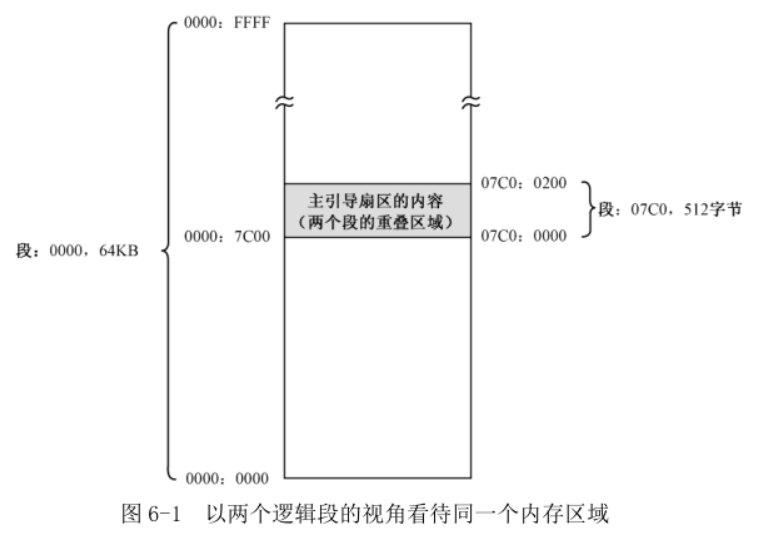

汇编语言源程序的编译符合一种假设, 即编译后的代码将从某个内存段中, 偏移地址为 0 的地方开始加载. 这样一来, 如果有一个标号"label_a", 它在编译时计算的汇编地址是 0x05, 那么, 当程序被加载到内存后, 它在段内的偏移地址仍然是 0x05, 任何使用这个标号来访问内存的指令都不会产生问题.

但是, 如果程序加载时, 不是从段内偏移地址为 0 的地方开始的, 而是 0x7c00, 那么, label\_a 的实际偏移地址就是 0x7c05. 这时, 所有访问 label\_a 的指令仍然会访问偏移地址 0x05, 因为这是在编译时就决定了的. 上一章写法:

```
mov [0x7c00+number+0x00],dl
```

好在 Intel 处理器的分段策略还是很灵活的, 逻辑地址 0x0000:0x7c00 对应的物理地址是 0x07c00, 该地址又是段 0x07C0 的起始地址. 因此, 这个物理地址其实还对应着另一个逻辑地址 0x07c0:0000, 如图 6-1 所示.



我们可以把这 512 字节的区域看成一个单独的段, 段的基地址是 0x07C0, 段长 512 字节. 注意, 该段的最大长度可以为 64KB. 尽管 BIOS 将主引导扇区加载到物理地址 0x07c00 处, 但我们却可以认为它是从 0x07c0:0x0000 处开始加载的.

源程序第 13、14 行, 通过传送指令将数据段寄存器 DS 的内容设置为 0x07c0. 和以前一样, 源程序第 16、17 行, 使附加段寄存器 ES 的内容指向显示缓冲区所在的段 0xb800.