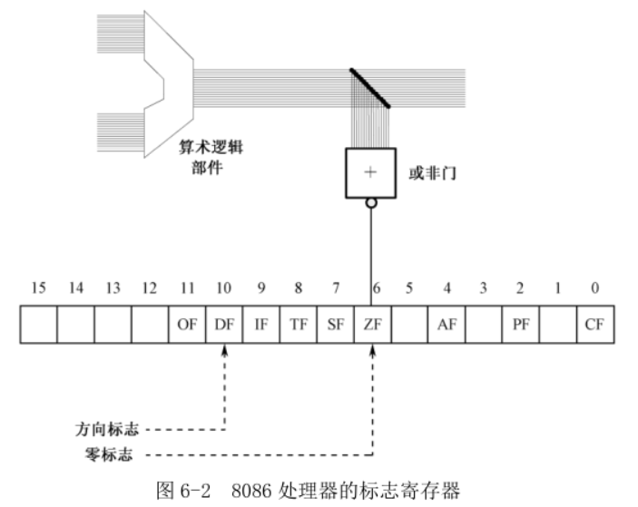

屏幕上显示的内容, 连同显示属性值, 都集中声明在一起. 将它们"搬"到 0xB800 段, 8086 处理器提供了 movsb 或者 movsw 指令.

这两个指令通常用于把数据从**内存中**的一个地方批量地传送(复制)到另一个地方, 处理器把它们看成是数据串. movsb 的传送是以字节为单位的, 而 movsw 的传送是以字为单位的.

这两个指令执行时, 原始数据串的段地址由 DS 指定, 偏移地址由 SI 指定, 简写为**DS:SI**; 要传送到的目的地址由 **ES:DI**指定; 传送的字节数(movsb)或者字数(movsw)由**CX**指定. 除此之外, 还要指定是正向传送还是反向传送, **正向传送是指传送操作的方向是从内存区域的低地址端到高地址端**; 反向传送则正好相反. 正向传送时, 每传送一个字节(movsb)或者一个字(movsw), **SI 和 DI** 加 1 或者加 2; 反向传送时, 每传送一个字节(movsb)或者一个字(movsw)时, SI 和 DI 减去 1 或者减去 2. 每传送一次, CX 的内容自动减一.

如图 6-2, 在 8086 处理器里, 标志寄存器 FLAGS. 作为一个例子, 它的第 6 位是 **ZF(Zero Flag)**, 即**零标志**. 当处理器执行一条算术或者逻辑运算指令后, 算术逻辑部件送出的结果除了送到指令中指定位置(目的操作数指定的位置)外, 还送到一个或非门. 或非门(或运算和非运算结合)的输入全为 0 时, 输出为 1; 输入不全为 0, 或者全部为 1 时, 输出为 0. **或非门的输出送到一个触发器, 这就是标志寄存器的 ZF 位**. 这就是说, 如果计算结果为 0, 这一位被置成 1, 表示计算结果为零是"真"的; 否则清除此位(0).

也可以**通过指令设置一些标志**. 比如, 第 10 位是方向标志 DF(Direction Flag), 通过将这一位清零或者置 1, 就能控制 movsb 和 movsw 的传送方向.

第 19 行是**方向标志清零指令 cld**. 这是个无操作数指令, 与其相反的是置方向标志指令 std. cld 指令将 DF 标志清零, 以指示传送是正方向的.

第 20 行, 设置 SI 寄存器的内容到源串的首地址, 也就是标号 mytext 处的汇编地址.

第 21 行, 设置目的地的首地址到 DI 寄存器. 屏幕上第一个字符的位置对应着 0xB800 段的开始处, 所以设置 DI 的内容为 0.

第 22 行, 设置要批量传送的字节数到 CX 寄存器. 标号代表汇编地址, 相减除以 2 得到该值. 除以 2 是因为 movsw 每次传送一个字.

第 23 行, 是 movsw 指令, 操作码是 0xA5, 该指令没有操作数. 使用 movsw 而不是 movsb 的原因是每次需要传送一个字(ASCII 码和属性). movsw 只能执行一次, 如果希望处理器自动地反复执行, 需要加上指令前缀 rep(repeat), 意思是**CX 不为零则重复**. rep movsw 的操作码是 0xF3 0xA5, 它将重复执行 movsw 直到 CX 的内容为零.

