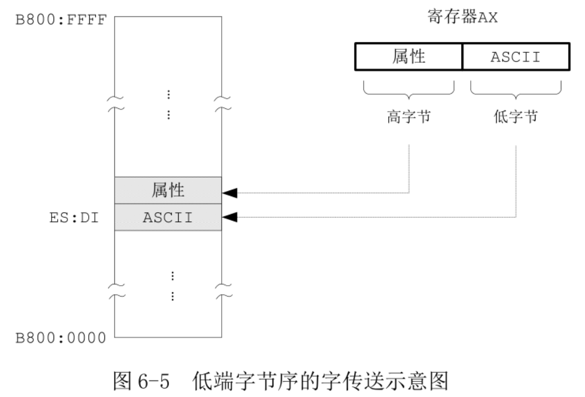

第 40 行, 将保存有各个数位的数据区首地址传送到基址寄存器 BX.

一共有 5 个数字要显示, 其偏移地址分别是 BX(BX+0)、BX+1、BX+2、BX+3、BX+4. 这里, BX 是基地址, 一般不变, 这里使用了 SI 作为索引, SI 被称为索引寄存器(Index Register), 或者叫变址寄存器. 另一个常用的变址寄存器是 DI.

第 41 行, 初始索引值是 4, 因为先显示万位上的数字.

第 43 行, 偏移地址是 BX+SI. 但是, **它们之间的运算并非是在编译阶段进行的, 而是在指令实际执行的时候, 由处理器完成的**.

第 44 行, 得到对应的 ASCII 码.

第 45 行, AX 中会是完整的字, AH 是字符属性, AL 是字.

第 46 行, 在之前使用 movsw 传送字符串"Label offset: "也是使用 DI. 传送结束后, DI 指向了字符":"下一个位置.

注意, 如图 6-5, 数据的传达是按照**低端字节序**的, **寄存器的低字节传送到显示缓冲区的低地址部分**(字节), 寄存器的高字节传送到显示缓冲区的高地址部分(字节).

第 47 行, 将 DI 的内容加上 2, 以指向显示缓冲区的下一个单元.

第 48 行, 将 SI 内容减 1, 下一次 BX+SI 指向千位数字. dec 是减一指令, 和 inc 指令一样, 后面跟一个操作数, 可以是 8 位或者 16 位的通用寄存器或者内存单元.

第 49 行, 指令 **jns show**, 如果**未设置符号位**, 则**转移到标号"show"所在的位置处执行**. 如图 6-2, Intel 处理器的标志寄存器里有**符号位 SF**(Sign Flag), 很多算术逻辑运算会影响到该位, 比如这里的**dec 指令**. 如果**计算结果**的**最高位**是比特"0", 处理器把 SF 位置"0", 否则 SF 位置"1".

SI 初始值是 4, 第一次执行 dec si 后, si 内容为 3, 二进制 0000000000000011, 符号位是"0", 处理器将 SF 位清"0". 于是, 当执行 jns show 时, 发现未设置, 转移到标号"show"执行.

显示完最后一个数位后, SI 内容为 0, 二进制 0000000000000000. 执行 dec si 指令后, 由于产生了借位, 实际的运算结果是 0xffff(SI 只能容纳 16 个比特), 因其最高位是"1", 故处理器将标志位 SF 置"1", 表明当前 SI 中的结果可以理解为一个负数(－1). 于是, 执行 jns show 时, 条件不满足, 接着执行后面第 51 行的指令.

jns 是条件转移指令, 执行时要参考标志寄存器的 SF 位. 编译后的机器指令操作数也是一个相对偏移量, 是用标号处汇编地址减去当前指令的汇编地址, 再减去当前指令的长度得到.