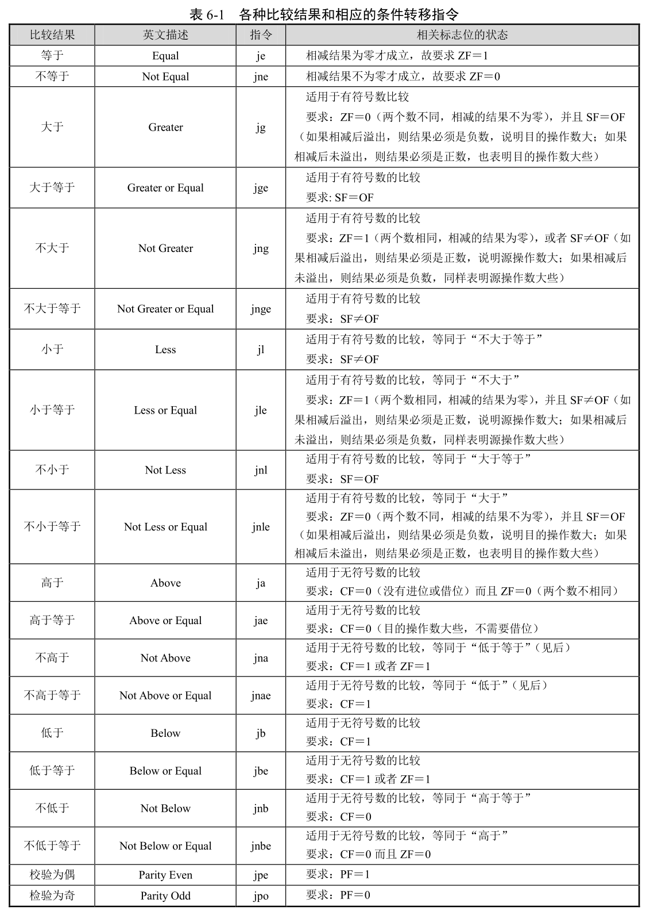

```
6.9 其他标志位和条件转移指令
　　6.9.1 奇偶标志位 PF
　　6.9.2 进位标志 CF
　　6.9.3 溢出标志 OF
　　6.9.4 现有指令对标志位的影响
　　6.9.5 条件转移指令
```

处理器内进行的很多算术逻辑运算, 都会影响到标志寄存器的某些位.

## 1. 奇偶标志位 PF

处理器运算结果, 如果低 8 位中, 有偶数个为 1 的比特, 则 PF=1, 否则为 0.

## 2. 进位标志 CF

处理器进行算术操作时, 如果最高位有向前进位或借位的情况发生, 则 CF=1; 否则 CF=0.

CF 标志始终记录进位或者借位是否发生, 但少数指令除外(如 inc 和 dec).

## 3. 溢出标志 OF

在所有的情况下, 处理器都不知道你的意图, 不知道你进行的是无符号数运算, 还是有符号数运算. 这个标志意思是, 假定你进行的是**有符号数运算**, 如果**结果超出了目标操作数所能容纳的范围**, OF=1; 否则, OF=0.

```
mov ah,0xff
add ah,2
```

执行后, 进位标志 CF 为 1, 因为最高位有进位.

寄存器 AH 可以容纳的数据范围是十进制的-128~127, 假如上面的运算是有符号数运算, 那么, 这实际上是在计算-1＋2(十进制), AH 中的最终的结果是 1, 没有超出 AH 所能表示的数的范围范围, 因此 OF=0.

```
mov ah,0x70
add ah,ah
```

首先, 本次相加, 用二进制数来说就是 01110000＋01110000＝11100000, 最高位没有进位, 故 CF＝0.

其次, 从无符号数的角度来看(十进制), 即 112＋112＝224, 并未超出一个字节所能容纳的数值上限 255, 结果是正确的.

但是, 从有符号数运算的角度来看(十进制), 即 112＋112＝－32, 明显是错的. 错误的原因是相加的结果(224)超出了一个字节所能容纳有符号数范围(十进制的－128~127), 所以破坏了符号位, 使得结果变成了负数(－32). 在这种情况下, OF＝1.

换句话说, 在有符号数运算当中, 溢出就意味着一个错误的计算结果.

## 4. 现有指令对标志位的影响

```
add         OF、SF、ZF、AF、CF 和 PF 的状态依计算结果而定.
and         OF=0, CF=0; 对 SF、ZF 和 PF 的影响依计算结果而定.
cbw         不影响任何标志位.
cld         DF=0, CF、OF、ZF、SF、AF 和 PF 未定义. 未定义的意思是到目前为止还不
            打算让该指令影响到这些标志, 因此, 不要在程序中依赖这些标志.
cwd         不影响任何标志位.
dec         CF 标志不受影响, 因为该指令通常在程序中用于循环计数, 而且在循环体内通
            常有依赖 CF 标志的指令, 故不希望它打扰 CF 标志; 对 OF、SF、ZF、AF 和
            PF 的影响依计算结果而定.
div/idiv    对 CF、OF、SF、ZF、AF 和 PF 的影响未定义.
inc CF      标志不受影响, 对 OF、SF、ZF、AF 和 PF 的影响依计算结果而定.
mov/movs    这类指令不影响任何标志位.
neg         如果操作数为 0, 则 CF=0, 否则 CF=1; 对 OF、SF、ZF、AF 和 PF 的影响依计
            算结果而定.
std         DF=1, 不影响其他标志位.
sub         对 OF、SF、ZF、AF、PF 和 CF 的影响依计算结果而定.
xor         OF=0, CF=0; 对 SF、ZF 和 PF 依计算结果而定; 对 AF 的影响未定义.
```

## 5. 条件转移指令

"jcc"不是一条指令, 而是一个指令族(簇), 功能是根据某些条件进行转移, 比如前面讲过的 jns, 意思是 SF≠1(那就是 SF＝0 了)则转移. 方便起见, 处理器一般提供相反的指令, 如 js, 意思是 SF＝1 则转移.

在汇编语言源代码里, 条件转移指令的操作数是标号. 编译成机器码后, 操作数是一个立即数, 是相对于目标指令的偏移量. 在 16 位处理器上, 偏移量可以是 8 位(短转移)或者 16 位(相对近转移).

jz 的意思是 ZF 标志为 1 则转移; jnz 的意思是 ZF 标志不为 1(为 0)则转移.

jo 的意思是 OF 标志为 1 则转移, jno 的意思是 OF 标志不为 1(为 0)则转移.

jc 的意思是 CF 标志为 1 则转移, jnc 的意思是 CF 标志不为 1(为 0)则转移.

jp 的意思是 PF 标志为 1 则转移, jnp 的意思是 PF 标志不为 1(为 0)则转移.

**转移指令必须出现在影响标志的指令之后**. 比如:

```
dec si
jns show
```

处理器提供比较指令 cmp, 需要两个操作数, 目的操作数可以是 8 位或者 16 位通用寄存器, 也可以是 8 位或者 16 位内存单元; 源操作数可以是与目的操作数**宽度一致**的通用寄存器、内存单元或者立即数, 不能同时为内存单元.

```
cmp al,0x08
cmp dx,bx
cmp [label_a],cx
```

cmp 指令在功能上和 sub 指令相同, 不同之处在于, cmp 指令仅仅根据计算的结果设置相应的标志位, 而不保留计算结果. cmp 指令将会影响到 CF、OF、SF、ZF、AF 和 PF 标志位.



条件转移指令 jcxz(jump if CX is zero), 意思是当 CX 寄存器的内容为零时则转移. 执行这条指令时, 处理器先测试寄存器 CX 是否为零.