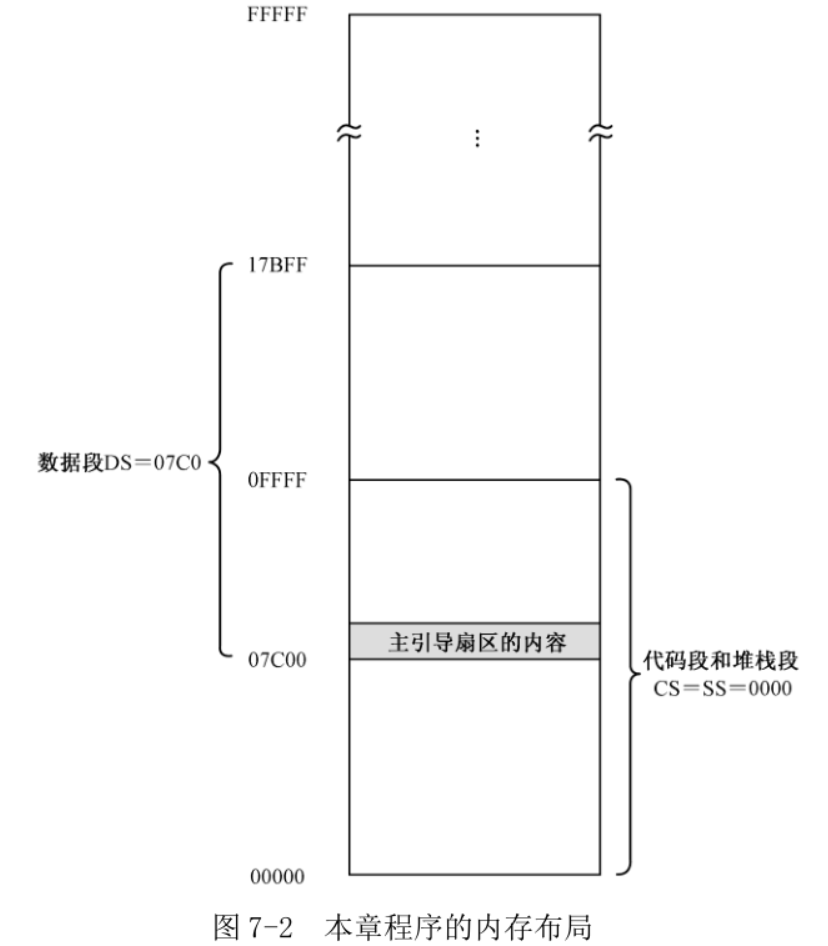
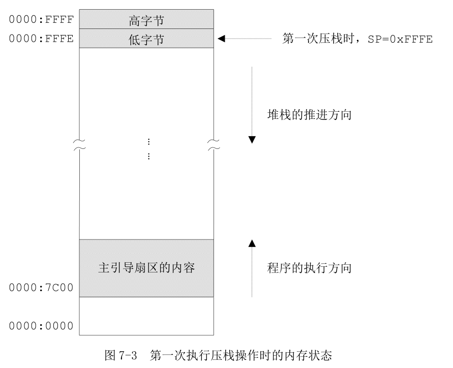

# 1. 栈和栈段的初始化

得到累加和之后, 后面就是将它各个数位分解出来, 并准备显示在屏幕上.

将分解出来的各个数位并不保存在数据段中, 而保存在栈中.

数据还是在内存中, 栈(Stack)不过是一种特殊的读写方式.

和代码段、数据段和附加段一样, 堆栈也被定义成一个内存段, 叫堆栈段(Stack Segment), 由段寄存器 SS 指向.

堆栈的操作有两种, 分别是将数据推进堆栈(push)和从堆栈中弹出数据(pop). 堆栈指针寄存器 SP(Stack Pointer)表示栈顶.

定义堆栈只需要初始化段寄存器 SS 和堆栈指针 SP 的内容.

源码 40 ~ 42 将堆栈段的段地址设置为 0x0000, 堆栈指针设为 0x0000.

我们定义了 3 个段了, 图 7-2 是当前内存布局. 总的内存容量是 1MB, 物理地址的范围是 0x00000~0xFFFFF, 其中, 假定数据段的长度是 64KB(实际上它的长度无关紧要), 占据了物理地址 0x07C00~0x17BFF, 对应的逻辑地址范围是 0x07C0:0x0000~0x07C0:0xFFFF; 代码段和堆栈段是同一个段, 占据着物理地址 0x00000~0x0FFFF, 对应的逻辑地址范围是 0x0000:0x0000~0x0000:0xFFFF.



# 2. 分解各个数位并压栈

数位分解还是做除法. 每次除法结束后, 做一次判断, 如果商为 0, 分解结束.

将每次得到的数入栈, 将来还要出栈, 所以使用 CX 寄存器计算数位个数.

源码 48、49 行, 将 DX 清零, 并和 AX 一起形成 32 位的被除数.

32 位除以 16 位, 商在 AX 中, 余数在 DX 中.

与 xor 一样, or 也是逻辑运算指令.

16 位处理器上, **push 指令**的操作数可以是**16 位寄存器或内存单元**. 对于内存单元:

```
push word [label_a]
```

**push 指令只接受 16 位的操作数**, 为什么要对内存操作数使用关键字"word". 事实上, 8086 处理器只能压入一个字; 但其后的处理器允许压入字、双字或者四字, 因此, 关键字是必不可少的.

就 8086 处理器来说, 因为压入堆栈的内容必须是字, 所以, 下面的指令都是非法的:

```
push al
push byte [label_a]
```

处理器在执行**push 指令**时:

- **首先**将堆栈指针寄存器 SP 的内容**减去操作数的字长**(以字节为单位的长度, **在 16 位处理器上是 2**),

- 然后, 把**要压入堆栈的数据**存放到**逻辑地址 SS:SP 所指向的内存位置**(和其他段的读写一样, 把堆栈段寄存器 SS 的内容左移 4 位, 加上堆栈指针寄存器 SP 提供的偏移地址).

如图 7-3, 代码段和堆栈段是同一个段, CS 和 SS 都是 0x0000. 源码第 42 行 SP 被置为 0. 所以, 当 push 指令第一次执行时, SP 的内容减 2, 即 0x0000－0x0002＝0xFFFE, 借位被忽略. 被压入堆栈的数据, 在内存中的位置实际上是 0x0000:0xFFFE. push 指令的操作数是字, 而且 Intel 处理器是使用低端字节序的, 故低字节在低地址部分, 高字节在高地址部分, 正好占据了堆栈段的最高两个字节位置(dx 的 dh 在高字节, dl 在低字节).



不同于代码段, 代码段在处理器上执行时, 是由低地址端向高地址端推进的, 而压栈操作则正好相反, 是从高地址
端向低地址端推进的. (这是一种存储器堆栈的一种方式, 堆栈向下增长, 这和处理器有关系)

push 指令不影响任何标志位.

# 3. 出栈并显示各个数位

压栈次数(数位的个数)存在寄存器 CX 中. 数位是按"个位"、"十位"、"百位"、"千位"、"万位"的顺序依次压栈(实际情况取决于数的大小), 出栈正好相反. **所以可以顺序将它们弹出堆栈并显示在屏幕上**.

源码 57 行, pop dx 指令功能是将逻辑地址 SS:SP 处的一个字弹出到寄存器 DX 中, 并**将 SP 内容加上操作数的字长**(2).

pop 指令执行时, 处理器将堆栈段寄存器 SS 的内容左移 4 位, 再加上堆栈指针寄存器 SP 的内容, 形成 20 位的物理地址访问内存, 取得所需的数据. 然后, 将 SP 的内容加操作数的字长, 以指向下一个堆栈位置.

pop 指令不影响任何标志位.

第 62 行, 每次执行 loop 指令时, 处理器都是先将寄存器 CX 减一. 当所有的数位都弹出和显示以后, CX 必定为零, 这将导致退出循环.

当处理器最后一次执行出栈操作后, 堆栈指针寄存器 SP 的内容将恢复到最开始设置时的状态, 即它的内容重新为 0.

# 4. 进一步认识堆栈

关于堆栈, 有几点说明.

第一, push 指令的操作数可以是**16 位寄存器**或者**指向 16 位实际操作数的内存单元地址**, push 指令执行后, 压入堆栈中的仅仅是该寄存器或者内存单元里的数值, 与该寄存器或内存单元不再相干. 所以, 下面的指令是合法而且正确的:

```
push cs
pop ds
```

这两条指令的意思是, 将代码段寄存器的内容压栈, 并弹出到数据段寄存器 DS. 这样, 代码段和数据段将属于同一个内存段. 实际上, 这两条指令的执行结果和下面指令执行结果相同:

```
mov ax,cx
mov ds,ax
```

第二, 堆栈在本质上也是普通的内存区域, 堆栈、push 和 pop 指令只是方便程序开发.

第三, 要注意保持堆栈平衡, 防止数据访问越界, 防止破坏有用的数据. 特别当堆栈段和其他段在同一个段时. 如图 7-3, 堆栈段和代码段属于同一个内存段, 段地址都是 0x0000, 段的长度都是 64KB. 主引导程序的长度是 512(0x200)字节, 从偏移地址 0x7c00 延伸到 0x7e00. 堆栈是向下增长的, 它们之间有 0xffff－0x7e00＋1＝0x8200 字节的空档. 通常来说, 我们的程序是安全的, 因为不可能压入这么多的数据.